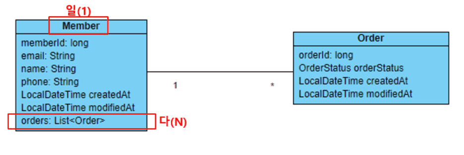
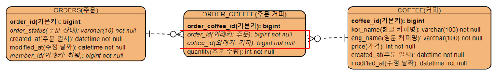
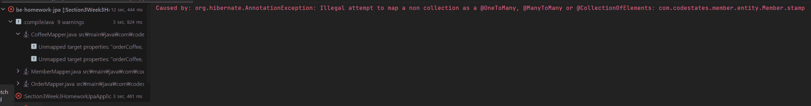

<br>

## 다대다인 두 클래스 연관 관계 매핑

다대다의 관계는 중간에 **테이블을 하나 추가**해서 **두 개의 일대다 관계**를 만들어주는 것이 일반적인 방법이다.

다대다 관계를 매핑하면 연결 테이블이 자동으로 생성되고 복잡성이 증가한다.

- **일대다 단방향 연관 관계**



Member만 List<Order> 객체를 참조할 수 있으므로 단방향 관계

일대다 단방향 매핑은 잘 사용하지 않는다.

<br>
<br>

- **두 개의 일대다 관계 (다대다)**




<br>
<br>

### 1. Order 클래스(주문)와 Coffee 클래스(커피)의 연관 관계 매핑 구현

- 주문과 커피는 다대다 관계이므로 OrderCoffee 클래스를 만든다
    - 다대다(N:M) 관계를 일대다-다대일(1:N-N:1) 관계로 매핑

**OrderCoffee 클래스 추가**

```java
@NoArgsConstructor
@Getter
@Setter
@Entity
public class OrderCoffee {
    @Id
    @GeneratedValue(strategy = GenerationType.IDENTITY)
    private Long orderCoffeeId;

    @ManyToOne
    @JoinColumn(name = "ORDER_ID")
    private Order order;

    @ManyToOne
    @JoinColumn(name = "COFFEE_ID")
    private Coffee coffee;

    @Column(nullable = false)
    private int quantity;

    public OrderCoffee(Order order, Coffee coffee, int quantity) {
        this.order = order;
        this.coffee = coffee;
        this.quantity = quantity;
    }

		public void setOrder(Order order) {
        this.order = order;
        if (!this.order.getOrderCoffees().contains(this)) {
            this.order.getOrderCoffees().add(this);
        }
    }

    public void setCoffee(Coffee coffee) {
        this.coffee = coffee;
        if (!this.coffee.getOrderCoffees().contains(this)) {
            this.coffee.setOrderCoffee(this);
        }
    }
}
```
<br>
<br>

**Order 클래스 수정**

- OrderCoffee 리스트 추가, OneToMany 관계 설정

```java
@OneToMany(mappedBy = "order", cascade = CascadeType.ALL, orphanRemoval = true)
private List<OrderCoffee> orderCoffees = new ArrayList<>();

public void setMember(Member member) {
        this.member = member;
        if (!this.member.getOrders().contains(this)) {
            this.member.getOrders().add(this);
        }
    }
```

주의할 점은, cascade = CascadeType.ALL과 orphanRemoval = true를 설정해야 한다.

이 설정을 통해 Order 또는 Coffee 엔티티가 삭제될 때, 연결 엔티티인 OrderCoffee도 함께 삭제된다. 또한, OrderCoffee를 삭제할 때 연결된 Order 또는 Coffee 엔티티와의 연관 관계도 자동으로 제거된다.

<br>
<br>

**Coffee 클래스 수정**

```java
@OneToMany(mappedBy = "coffee", cascade = CascadeType.ALL, orphanRemoval = true)
private List<OrderCoffee> orderCoffeeList = new ArrayList<>();

public void setOrderCoffee(OrderCoffee orderCoffee) {
      this.orderCoffees.add(orderCoffee);
      if (orderCoffee.getCoffee() != this) {
          orderCoffee.setCoffee(this);
      }
  }
```

<br>
<br>
<br>

### 2. Member 클래스(회원)와 Stamp 클래스(도장)의 연관 관계 매핑 구현

**Stamp 클래스 생성**

```java
@Getter
@Setter
@Entity
@NoArgsConstructor
public class Stamp {
    @Id
    @GeneratedValue(strategy = GenerationType.IDENTITY)
    private Long stampId;

    @Column(nullable = false)
    private int stampCount;

    @OneToOne
    @JoinColumn(name = "MEMBER_ID")
    private Member member;

    public void setMember(Member member) {
        this.member = member;
        if (member.getStamp() != this) {
            member.setStamp(this);
        }
    }
}
```
<br>
<br>

**Meber 클래스 수정(추가)**

```java
@OneToMany(mappedBy = "member", cascade = {CascadeType.PERSIST, CascadeType.REMOVE})
private Stamp stamp;

public void setStamp(Stamp stamp) {
    this.stamp = stamp;
    if (stamp.getMember() != this) {
        stamp.setMember(this);
    }
}
```
<br>
<br>
<br>

## 주문 기능 추가 구현

### 3. OrderService 클래스와 OrderController 기능 완성을 위한 추가 구현

- 커피 주문 기능
    - OrderService 클래스의 createOrder() 메서드에서 주문한 커피가 테이블에 존재하는 커피인지 체크하는 기능 추가
    - 주문한 커피의 수량만큼 회원의 스탬프 숫자를 증가시켜야 함
- 특정 주문 조회 기능
    - OrderController 클래스의 getOrder() 핸들러 메서드에서 주문한 커피 정보가 ResponseEntity에 포함되어야 함
- 주문 목록 조회 기능
    - OrderController 클래스의 getOrders() 핸들러 메서드에서 주문한 커피 정보 목록이 ResponseEntity에 포함되어야 함

<br>
<br>

### 커피 주문 기능 / 스탬프 증가

**OrderService 클래스 수정(추가)**

```java
private final CoffeeService coffeeService;

public OrderService(MemberService memberService,
                    OrderRepository orderRepository, CoffeeService coffeeService) {
    this.memberService = memberService;
    this.orderRepository = orderRepository;
    this.coffeeService = coffeeService;
}
```

<br>
<br>

커피가 존재하는지 확인

```java
order.getOrderCoffees().stream()
                .forEach(orderCoffee -> coffeeService.findVerifiedCoffee(orderCoffee.getCoffee().getCoffeeId()));
```

<br>
<br>

**updateStamp 추가**

```java
private int updateStamp(Order order){
    Member member = memberService.findMember(order.getMember().getMemberId());
    int stampCount = order.getOrderCoffees().stream()
            .map(orderCoffee -> orderCoffee.getQuantity())
            .mapToInt(quantity -> quantity)
            .sum();

    Stamp stamp = member.getStamp();
    stamp.setStampCount(stamp.getStampCount() + stampCount);

    memberService.updateMember(member);
    return stampCount;
}
```

<br>
<br>
<br>

### 특정 주문 조회 기능

**OrderController 클래스의 getOrder() 핸들러 메서드 수정**

```java
@GetMapping("/{order-id}")
public ResponseEntity getOrder(@PathVariable("order-id") @Positive long orderId) {
    Order order = orderService.findOrder(orderId);

    return new ResponseEntity<>(new SingleResponseDto<>(mapper.orderToOrderResponseDto(order)), HttpStatus.OK);
}
```
<br>
<br>

### 주문 목록 조회 기능

**OrderController 클래스의 getOrders() 핸들러 메서드 수정**

```java
@GetMapping
public ResponseEntity getOrders(@Positive @RequestParam int page,
                                @Positive @RequestParam int size) {
    Page<Order> pageOrders = orderService.findOrders(page - 1, size);
    List<Order> orders = pageOrders.getContent();

    return new ResponseEntity<>(
            new MultiResponseDto<>(mapper.ordersToOrderResponseDtos(orders), pageOrders), HttpStatus.OK);
}
```

<br>
<br>

**OrderMapper 수정**

주문한 커피 정보를 ResponseEntity에 포함시키기 위해서는 OrderMapper에서 OrderCoffee 와 

OrderCoffeeResponseDto에 대한 추가 매핑이 필요하다.

```java
@Mapper(componentModel = "spring")
public interface OrderMapper {
    default Order orderPostDtoToOrder(OrderPostDto orderPostDto){
        Order order = new Order();
        Member member = new Member();
        member.setMemberId(orderPostDto.getMemberId());

        List<OrderCoffee> orderCoffees = orderPostDto.getOrderCoffees().stream()
                .map(orderCoffeeDto -> {
                    OrderCoffee orderCoffee = new OrderCoffee();
                    Coffee coffee = new Coffee();
                    coffee.setCoffeeId(orderCoffeeDto.getCoffeeId());
                    orderCoffee.setOrder(order);
                    orderCoffee.setCoffee(coffee);
                    orderCoffee.setQuantity(orderCoffee.getQuantity());
                    return orderCoffee;
                }).collect(Collectors.toList());
        order.setMember(member);
        order.setOrderCoffees(orderCoffees);
        return order;
    }

    Order orderPatchDtoToOrder(OrderPatchDto orderPatchDto);

    List<OrderResponseDto> ordersToOrderResponseDtos(List<Order> orders);

    @Mapping(source = "member.memberId", target = "memberId")
    OrderResponseDto orderToOrderResponseDto(Order order);

    @Mapping(source = "coffee.coffeeId", target = "coffeeId")
    @Mapping(source = "coffee.korName", target = "korName")
    @Mapping(source = "coffee.engName", target = "engName")
    @Mapping(source = "coffee.price.value", target = "price")
    OrderCoffeeResponseDto orderCoffeeToOrderCoffeeResponseDto(OrderCoffee orderCoffee);
}
```

<br>
<br>
<br>

## 진행 과정 중 오류 사항

Caused by: org.hibernate.AnnotationException: Illegal attempt to map a non collection as a @OneToMany, @ManyToMany or @CollectionOfElements: com.codestates.member.entity.Member.stamp



이 오류는 Hibernate가 @OnerToMany, @ManyToMany 또는 @CollectionOfElements와 같은 컬렉션 매핑 어노테이션을 사용하려는데, 해당 필드가 컬렉션 타입이 아니라 일반 객체 타입으로 매핑하려고 할 때 발생한다.

해결 법은 해당 필드를 컬렉션 타입으로 변경하거나, 올바른 어노테이션을 사용하여 매핑하는 것이다. 만약 해당 필드가 일반 객체 타입으로 유지해야 한다면, Hibernate의 매핑 어노테이션 중 하나를 사용하는 대신 직접 매핑하는 방법도 있다.

```java
// 수정 전
@OneToMany(mappedBy = "member", cascade = {CascadeType.PERSIST, CascadeType.REMOVE})
private Stamp stamp;

// 수정 후
@OneToOne(mappedBy = "member", cascade = {CascadeType.PERSIST, CascadeType.REMOVE})
private Stamp stamp;
```

내 경우엔 @OneToOne 어노테이션이 오타로 인해 @OneToMany로 작성되있었다.

<br>
<br>
<br>

## 추가 학습

**@Column 애너테이션 (필드와 컬럼을 매핑해주는 애너테이션)**<br>
(필드와 컬럼 차이 : 필드는 레코드 안에서 하나의 데이터 요소 / 컬럼은 여러 개의 레코드를 모아둔 열. 필드는 데이터의 속성을, 컬럼은 데이터의 형태를 결정하는데 중요한 역할을 함.)


`@Column(nullable = false, updatable = false, unique = true)`

- nullable
    - 컬럼에 null 값을 허용할지 여부(디폴트 값 true)
- updatable
    - 컬럼 데이터를 수정할 수 있는지 여부(디폴트 값 true)
- unique
    - 하나의 컬럼에 유니크 제약 조건을 설정함 (디폴트 값 false)

@Column, @JoinColumn 차이는 @Column 애너테이션은 단순히 엔티티 클래스의 멤버 변수와 데이터베이스 테이블의 컬럼을 매핑할 때 사용하고, @JoinColumn 애너테이션은 연관된 엔티티 클래스와의 연결을 위한 외래 키 컬럼을 매핑할 때 사용한다.

<br>
<br>

**cascade 애트리뷰트**

@OneToMany, @ManyToOne 애너테이션에는 cascade 라는 애트리뷰트가 있다.

cascade 속성은 JPA에서 연관 엔티티를 저장하거나 삭제할 때 연쇄적으로 영향을 미치는 옵션이다.

이 속성을 사용하면 부모 엔티티의 상태 변화가 자식 엔티티에도 영향을 미친다.

예를 들어 @OneToMany or @ManyToOne 으로 매핑된 엔티티에서 cascade 속성을 사용했을때

부모 엔티티의 저장이나 삭제가 발생하면 자식 엔티티도 자동으로 저장이나 삭제가 된다.
<br>
<br>

cascade 속성

- **`CascadeType.ALL`**: 모든 작업(저장, 수정, 삭제 등)에 대해 연쇄 작업이 적용된다.
- **`CascadeType.PERSIST`**: 새로운 엔티티를 저장할 때 연쇄 작업이 적용된다.
- **`CascadeType.MERGE`**: 엔티티를 병합할 때 연쇄 작업이 적용된다.
- **`CascadeType.REMOVE`**: 엔티티를 삭제할 때 연쇄 작업이 적용된다.
- **`CascadeType.REFRESH`**: 엔티티를 다시 로드할 때 연쇄 작업이 적용된다.
- **`CascadeType.DETACH`**: 엔티티를 준영속 상태로 만들 때 연쇄 작업이 적용된다.