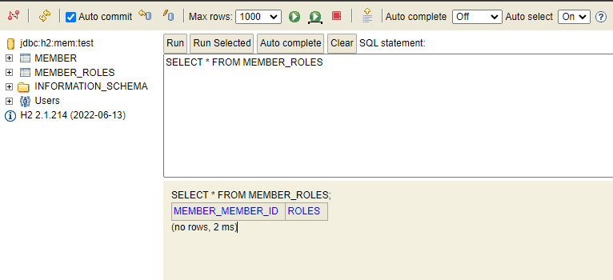
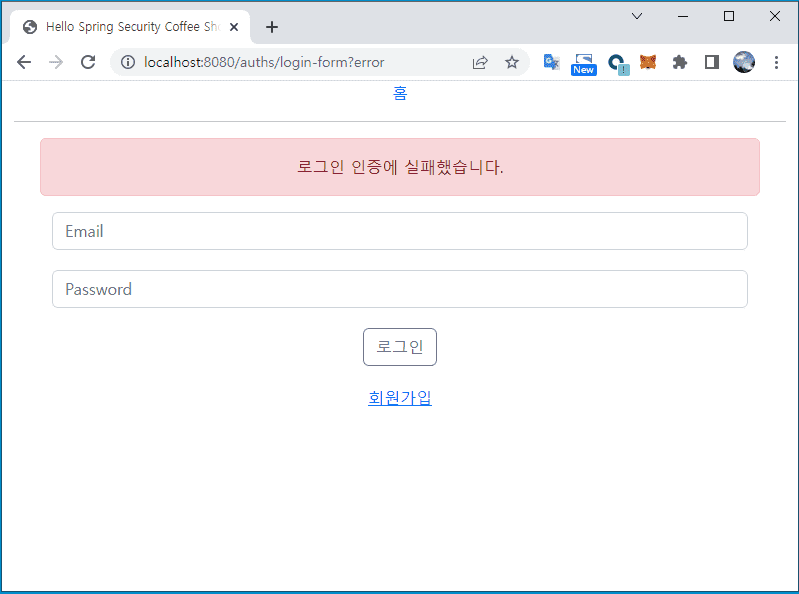
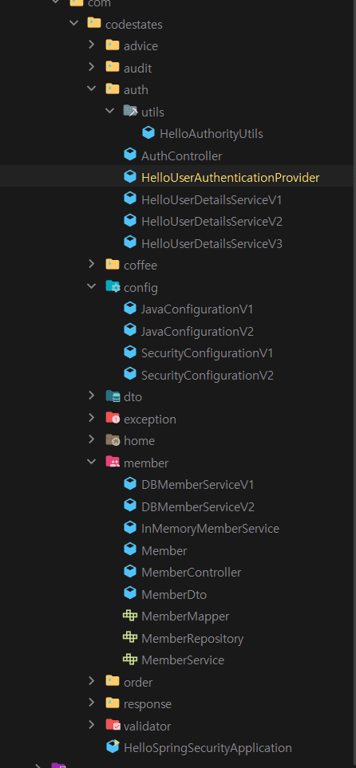

## Custom UserDetailsService 사용

Spring Security에서 User의 인증 정보를 테이블에 저장하고, 

테이블에 저장된 인증 정보를 이용해 인증 프로세스를 진행할 수 있는 방법들 중 하나

<br>

### SecurityConfiguration 수정 및 추가 (InMemory User를 위한 설정들 제거)

```java
@Configuration
public class SecurityConfiguration {
    @Bean
    public SecurityFilterChain filterChain(HttpSecurity http) throws Exception {
        http
                // frameOptions() : <frame>이나 <iframe>, <object> 태그에서 페이지를 렌더링할지의 여부를 결정하는 기능
                .headers().frameOptions().sameOrigin() // 동일 출처로부터 들어오는 request만 페이지 렌더링 허용
                .and()
                .csrf().disable()
                .formLogin()
                .loginPage("/auths/login-form")
                .loginProcessingUrl("/process_login")
                .failureUrl("/auths/login-form?error")
                .and()
                .logout()
                .logoutUrl("/logout")
                .logoutSuccessUrl("/")
                .and()
                .exceptionHandling().accessDeniedPage("/auths/access-denied")
                .and()
                .authorizeHttpRequests(authorize -> authorize
                        .antMatchers("/orders/**").hasRole("ADMIN")
                        .antMatchers("/members/my-page").hasRole("USER")
                        .antMatchers("/**").permitAll());

        return http.build();
    }
    @Bean
    public PasswordEncoder passwordEncoder() {
        return PasswordEncoderFactories.createDelegatingPasswordEncoder();
    }
}
```

<br>

### JavaConfiguration의 Bean 등록 변경

```java
@Configuration
public class JavaConfiguration {
    @Bean
    public MemberService dbMemberService(MemberRepository memberRepository,
                                         PasswordEncoder passwordEncoder) {
        return new DBMemberService(memberRepository, passwordEncoder);
    }
}
```

<br>

### DBMemberService 구현

```java
@Transactional
public class DBMemberService implements MemberService {
    private final MemberRepository memberRepository;
    private final PasswordEncoder passwordEncoder;

    public DBMemberService(MemberRepository memberRepository, PasswordEncoder passwordEncoder) {
        this.memberRepository = memberRepository;
        this.passwordEncoder = passwordEncoder;
    }

    public Member createMember(Member member){
        verifyExistsEmail(member.getEmail());
        // PasswordEncoder를 통해 패스워드를 암호화
        String encryptedPassword = passwordEncoder.encode(member.getPassword());
        // 암호화된 패스워드를 password 필드에 다시 할당
        member.setPassword(encryptedPassword);

        Member savedMember = memberRepository.save(member);

        System.out.println("# Create Member in DB");
        return savedMember;
    }

    private void verifyExistsEmail(String email){
        Optional<Member> member = memberRepository.findByEmail(email);
        if (member.isPresent()) throw new BusinessLogicException(ExceptionCode.MEMBER_EXISTS);
    }
}
```

<br>

### Custom UserDetailsService 구현 <br>

**HelloUserDetailsService 클래스 생성**<br>
(데이터베이스에서 조회한 인증 정보를 기반으로 인증을 처리하는  Custom UserDetailsService)

```java
@Component                             // UserDetailsService 인터페이스 구현
public class HelloUserDetailsServiceV1 implements UserDetailsService {
    private final MemberRepository memberRepository;
    private final HelloAuthorityUtils authorityUtils;

    public HelloUserDetailsServiceV1(MemberRepository memberRepository, HelloAuthorityUtils authorityUtils) {
        this.memberRepository = memberRepository;
        this.authorityUtils = authorityUtils;
    }

    @Override
    public UserDetails loadUserByUsername(String username) throws UsernameNotFoundException {
        Optional<Member> optionalMember = memberRepository.findByEmail(username);
        Member findMember = optionalMember.orElseThrow(() -> new BusinessLogicException(ExceptionCode.MEMBER_NOT_FOUND));
        
        // HelloAuthorityUtils를 이용해 DB에서 조회한 회원의 이메일 정보를 이용해 Role 기반의 권한 정보 컬렉션 생성.
        Collection<? extends GrantedAuthority> authorities = authorityUtils.createAuthorities(findMember.getEmail());

        // UserDetails 인터페이스의 구현체인 User 클래스의 객체를 통해 제공 (인증 처리는 Spring Security 가 대신해줌)
        return new User(findMember.getEmail(), findMember.getPassword(), authorities);
    }
}
```

UserDetailsService 인터페이스를 implements 하는 구현 클래스는 

loadUserByUsername(String username) 과 같이 추상 메서드를 구현해야 한다.

<br>
`Collection<? extends GrantedAuthority> authorities` 에서 `<? extends GrantedAuthority>` 부분은

**제네릭스 문법에서 와일드카드 타입**을 나타낸다.

? 는 모든 타입을 대체할 수 있는 와일드카드 타입이다. 

따라서 Collection 객체에 GrantedAuthority의 하위 클래스 타입을 담을 수 있도록 한다.

<br>

**HelloAuthorityUtils 클래스 생성**

```java
// lombok X
import org.springframework.beans.factory.annotation.Value;
...

@Component
public class HelloAuthorityUtils {
    // application.yml에 추가한 프로퍼티를 가져옴
    @Value("${mail.address.admin}")
    private String adminMailAddress;

    // AuthorityUtils 클래스를 이용해서 관리자용 권한 목록을 생성
    private final List<GrantedAuthority> ADMIN_ROLES = AuthorityUtils.createAuthorityList("ROLE_ADMIN", "ROLE_USER");
    // 일반 사용 권한 목록 생성
    private final List<GrantedAuthority> USER_ROLES = AuthorityUtils.createAuthorityList("ROLE_USER");

    // 파라미터로 전달받은 이메일 주소가 application.yml 파일에서 가져온 관리자용 이메일
    // 주소와 동일하다면 관리자용 권한인 List<GrantedAuthority> ADMIN_ROLES를 리턴
    public List<GrantedAuthority> createAuthorities(String email) {
        if (email.equals(adminMailAddress)) return ADMIN_ROLES;
        return USER_ROLES;
    }
}
```

<br>

**application.yml 추가**

```java
...
...
mail:
    address:
      admin: admin@gmail.com
```

<br>

### Custom UserDetails 구현

**HelloUserDetailsService 수정**

```java
public class HelloUserDetailsService implements UserDetailsService {
    private final MemberRepository memberRepository;
    private final HelloAuthorityUtils authorityUtils;

    public HelloUserDetailsServiceV2(MemberRepository memberRepository, HelloAuthorityUtils authorityUtils) {
        this.memberRepository = memberRepository;
        this.authorityUtils = authorityUtils;
    }

    @Override
    public UserDetails loadUserByUsername(String username) throws UsernameNotFoundException {
        Optional<Member> optionalMember = memberRepository.findByEmail(username);
        Member findMember = optionalMember.orElseThrow(() -> new BusinessLogicException(ExceptionCode.MEMBER_NOT_FOUND));
        // return new User(findMember.getEmail(), findMember.getPassword(), authorities);
        return new HelloUserDetails(findMember); // 개선된 부분
    }

    // HelloUserDetails 클래스 추가
    // 회원 정보를 User 정보로 변환하는 과정과 User의 권한 정보를 생성하는 과정을 캡슐화 할 수 있다.
    private final class HelloUserDetails extends Member implements UserDetails {
        HelloUserDetails(Member member){
            setMemberId(member.getMemberId());
            setFullName(member.getFullName());
            setEmail(member.getEmail());
            setPassword(member.getPassword());
        }

        @Override
        public Collection<? extends GrantedAuthority> getAuthorities(){
			// User 권한 정보 생성 / 리팩토링 포인트 
            return authorityUtils.createAuthorities(this.getEmail());
        }
        // Spring security에서 인식할 수 있는 username을 Member클래스의 email 주소로 채우고 있다.
        @Override
        public String getUsername() {return getEmail();}
        @Override
        public boolean isAccountNonExpired() {return true;}
        @Override
        public boolean isAccountNonLocked() {return true;}
        @Override
        public boolean isCredentialsNonExpired() {return true;}
        @Override
        public boolean isEnabled() {return true;}
    }
}
```

<br>

## User의 Role을 DB에서 관리하기

현재까지 User의 권한 정보는 DB에서 관리하는 것이 아니라 데이터베이스에서 조회한 User 정보를 기준으로 코드상에서 조건에 맞게 생성하고 있다.

<br>
User의 권한 정보를 DB에서 관리하기 위해서는 다음과 같은 과정이 필요하다.

- User의 권한 정보를 저장하기 위한 테이블 생성
- 회원 가입 시, User의 권한 정보(Role)를 DB에 저장하는 작업
- 로그인 인증 시, User의 권한 정보를 데이터베이스에서 조회하는 작업

<br>

### User의 권한 정보 테이블 생성

User와 User의 권한 정보 간에 테이블 간의 연관 관계를 먼저 생각해야 한다.
이 테이블 간의 연관 관계는 ORM 기술인 JPA를 통해 연관 관계를 맺을 수 있다.

<br>
**Member**

```java
@NoArgsConstructor
@Getter
@Setter
@Entity
public class Member extends Auditable implements Principal {
    @Id
    @GeneratedValue(strategy = GenerationType.IDENTITY)
    private Long memberId;

    @Column(length = 100, nullable = false)
    private String fullName;

    @Column(nullable = false, updatable = false, unique = true)
    private String email;

    @Column(length = 100, nullable = false)
    private String password;

    @Enumerated(value = EnumType.STRING)
    @Column(length = 20, nullable = false)
    private MemberStatus memberStatus = MemberStatus.MEMBER_ACTIVE;

    // List, Set 같은 컬렉션 타입의 필드는 @ElementCollection 을 추가하면
    // User 권한 정보와 관련된 별도의 엔티티 클래스를 생성하지 않아도 간단하게 매핑 처리 된다.
    @ElementCollection(fetch = FetchType.EAGER)
    private List<String> roles = new ArrayList<>();

    public Member(String email) {this.email = email;}

    public Member(String email, String fullName, String password) {
        this.email = email;
        this.fullName = fullName;
        this.password = password;
    }

    @Override
    public String getName() {return getEmail();}

    public enum MemberStatus {
        MEMBER_ACTIVE("활동중"),
        MEMBER_SLEEP("휴면 상태"),
        MEMBER_QUIT("탈퇴 상태");

        @Getter
        private String status;

        MemberStatus(String status) {this.status = status;}
    }

    public enum MemberRole {ROLE_USER, ROLE_ADMIN}
}
```

<br>
애플리케이션을 실행하면 테이블이 생성된다.



Member 엔티티 클래스와 연관 관계 매핑에 대한 테이블이 생성되었다.

**한 명의 회원이 한 개 이상의 Role**을 가질 수 있으므로, MEMBER 테이블과 MEMBER_ROLES 테이블은

**1대 N의 관계**이다.

<br>
회원 가입을 통해 회원 정보가 MEMBER 테이블에 저장될 때, MEMBER_ROLES 테이블의

MEMBER_MEMBER_ID 컬럼에는 MEMBER 테이블의 기본키 값이, ROLES 컬럼에는 권한 정보가 저장된다.

<br>

### 회원 가입 시 User의 권한 정보를 DB에 저장

**DBMemberService**

```java
@Transactional
public class DBMemberServiceV2 implements MemberService {
    private final MemberRepository memberRepository;
    private final PasswordEncoder passwordEncoder;
    private final HelloAuthorityUtils authorityUtils;

    public DBMemberService(MemberRepository memberRepository,
                             PasswordEncoder passwordEncoder,
                             HelloAuthorityUtils authorityUtils) {
        this.memberRepository = memberRepository;
        this.passwordEncoder = passwordEncoder;
        this.authorityUtils = authorityUtils;
    }

    public Member createMember(Member member) {
        verifyExistsEmail(member.getEmail());
        String encryptedPassword = passwordEncoder.encode(member.getPassword());
        member.setPassword(encryptedPassword);

        // 추가: User Role DB에 저장
        // List<String> roles 를 생성한 뒤 member 객체에 넘겨줌
        List<String> roles = authorityUtils.createRoles(member.getEmail());
        member.setRoles(roles);
        Member savedMember = memberRepository.save(member);
        return savedMember;
    }

    public Member findMember(String email) {
        return findVerifiedMember(email);
    }

    private Member findVerifiedMember(String email) {
        Optional<Member> optionalMember =
                memberRepository.findByEmail(email);
        Member findMember =
                optionalMember.orElseThrow(() ->
                        new BusinessLogicException(ExceptionCode.MEMBER_NOT_FOUND));
        return findMember;
    }

    private void verifyExistsEmail(String email) {
        Optional<Member> member = memberRepository.findByEmail(email);
        if (member.isPresent())
            throw new BusinessLogicException(ExceptionCode.MEMBER_EXISTS);
    }
}
```

<br>

**HelloAuthorityUtils 추가**

```java
@Component
public class HelloAuthorityUtils {
    @Value("${mail.address.admin}")
    private String adminMailAddress;

    private final List<GrantedAuthority> ADMIN_ROLES = AuthorityUtils.createAuthorityList("ROLE_ADMIN", "ROLE_USER");
    private final List<GrantedAuthority> USER_ROLES = AuthorityUtils.createAuthorityList("ROLE_USER");
    
    // 추가 됨
    private final List<String> ADMIN_ROLES_STRING = List.of("ADMIN", "USER");
    private final List<String> USER_ROLES_STRING = List.of("USER");

    public List<GrantedAuthority> createAuthorities(String email) {
        if (email.equals(adminMailAddress)) return ADMIN_ROLES;
        return USER_ROLES;
    }
    
    // 추가 됨 / DB 저장 용
    public List<String> createRoles(String email){
        if (email.equals(adminMailAddress)) return ADMIN_ROLES_STRING;
        return USER_ROLES_STRING;
    }
}
```

<br>

### 로그인 인증 시, User의 권한 정보를 데이터베이스에서 조회하는 작업

마지막 작업은 로그인 인증 성공 시, 제공하는 User의 권한 정보를
DB의 table에서 관리되는 Role을 기반으로 생성하는 것

<br>
**HelloUserDetailsService 수정**

```java
@Component
public class HelloUserDetailsService implements UserDetailsService {
    private final MemberRepository memberRepository;
    private final HelloAuthorityUtils authorityUtils;

    public HelloUserDetailsService(MemberRepository memberRepository, HelloAuthorityUtils authorityUtils) {
        this.memberRepository = memberRepository;
        this.authorityUtils = authorityUtils;
    }

    @Override
    public UserDetails loadUserByUsername(String username) throws UsernameNotFoundException {
        Optional<Member> optionalMember = memberRepository.findByEmail(username);
        Member findMember = optionalMember.orElseThrow(() -> new BusinessLogicException(ExceptionCode.MEMBER_NOT_FOUND));
        return new HelloUserDetails(findMember);
    }

    private final class HelloUserDetails extends Member implements UserDetails {
        HelloUserDetails(Member member){
            setMemberId(member.getMemberId());
            setFullName(member.getFullName());
            setEmail(member.getEmail());
            setPassword(member.getPassword());
            // 상속하고 있는 Member에 DB에서 조회한 List<String> roles를 전달
            setRoles(member.getRoles()); // 추가 됨
        }

        @Override
        public Collection<? extends GrantedAuthority> getAuthorities(){
            // 수정 / DB에 저장된 Role 정보로 User 권한 목록 생성
            // Member에 전달한 Role 정보를 authorityUtils.createAuthorities() 메서드의
            // 파라미터로 전달해서 권한 목록(List<GrantedAuthority>)을 생성
            return authorityUtils.createAuthorities(getRoles()); 
        }
        @Override
        public String getUsername() {return getEmail();}
        @Override
        public boolean isAccountNonExpired() {return true;}
        @Override
        public boolean isAccountNonLocked() {return true;}
        @Override
        public boolean isCredentialsNonExpired() {return true;}
        @Override
        public boolean isEnabled() {return true;}
    }
}
```

<br>

**HelloAuthorityUtils 추가**

DB에서 조회한 Role 정보를 기반으로 User의 권한 목록을 생성하는
`createAuthorities(List<String> roles)` 메서드가 추가됨.

```java
@Component
public class HelloAuthorityUtils {
    @Value("${mail.address.admin}")
    private String adminMailAddress;

    private final List<GrantedAuthority> ADMIN_ROLES = AuthorityUtils.createAuthorityList("ROLE_ADMIN", "ROLE_USER");
    private final List<GrantedAuthority> USER_ROLES = AuthorityUtils.createAuthorityList("ROLE_USER");
    // 추가 됨
    private final List<String> ADMIN_ROLES_STRING = List.of("ADMIN", "USER");
    private final List<String> USER_ROLES_STRING = List.of("USER");

    // 메모리 상의 Role을 기반으로 권한 정보 생성
    public List<GrantedAuthority> createAuthorities(String email) {
        if (email.equals(adminMailAddress)) return ADMIN_ROLES;
        return USER_ROLES;
    }

    // DB에 저장된 Role을 기반으로 권한 정보 생성
    public List<GrantedAuthority> createAuthorities(List<String> roles){
        List<GrantedAuthority> authorities = roles.stream()
                .map(role -> new SimpleGrantedAuthority("ROLE_" + role))
                .collect(Collectors.toList());
        return authorities;
    }

    public List<String> createRoles(String email){
        if (email.equals(adminMailAddress)) return ADMIN_ROLES_STRING;
        return USER_ROLES_STRING;
    }
}
```

`SimpleGrantedAuthority` 객체를 생성할 때 생성자 파라미터로 넘겨주는 값이 “USER”, “ADMIN”

이면 안 되고 “ROLE_USER”, “ROLE_ADMIN” 형태여야 한다. 

<br>
<br>

## Custom AuthenticationProvider 사용 방법

지금까지 Custom UserDetailsService를 사용해 로그인 인증을 하는 방식은 
Spring Security가 내부적으로 인증을 대신 처리해주는 방식이다.

이번에는 Custom AuthenticationProvider를 이용해 직접 로그인 인증을 처리하는 방법이다.

<br>

**HelloUserAuthenticationProvider 생성**

```java
//Spring Security는 AuthenticationProvider 구현 클래스가 Spring Bean으로 등록되어 있다면
// 해당 AuthenticationProvider를 이용해서 인증을 진행한다.
// 1
@Component
public class HelloUserAuthenticationProvider implements AuthenticationProvider {
    private final HelloUserDetailsServiceV3 userDetailsService;
    private final PasswordEncoder passwordEncoder;

    public HelloUserAuthenticationProvider(HelloUserDetailsServiceV3 userDetailsService, PasswordEncoder passwordEncoder) {
        this.userDetailsService = userDetailsService;
        this.passwordEncoder = passwordEncoder;
    }

		// 3 인증 처리 로직을 이용해 사용자의 인증 여부를 결정함.
    @Override
    public Authentication authenticate(Authentication authentication) throws AuthenticationException {
        // authentication을 캐스팅하여 UsernamePasswordAuthenticationToken을 얻는다.
        UsernamePasswordAuthenticationToken authToken = (UsernamePasswordAuthenticationToken) authentication;
				
        // UsernamePasswordAuthenticationToken 객체에서 해당 사용자의 Username을 얻은 후, 존재하는지 체크.
        String username = authToken.getName();
        Optional.ofNullable(username).orElseThrow(() -> new UsernameNotFoundException("Invalid User name or User Password"));

        // Username이 존재한다면 userDetailsService를 이용해 DB에서 해당 사용자를 조회.
        UserDetails userDetails = userDetailsService.loadUserByUsername(username);

        // authToken.getCredentials()(로그인 정보에 포함된 패스워드) 와 DB에 저장된 사용자의 패스워드 정보가 일치하는지 검증
        String password = userDetails.getPassword();
        verifyCredentials(authToken.getCredentials(), password);

        // 위의 검증 과정을 통과했다면 해당 사용자의 권한을 생성
        Collection<? extends GrantedAuthority> authorities = userDetails.getAuthorities();

        return UsernamePasswordAuthenticationToken.authenticated(username, password, authorities);
    }

    // 2 HelloUserAuthenticationProvider가 Username/Password 방식의 인증을 지원한다는 것을 Spring Security에 알린다.
    @Override
    public boolean supports(Class<?> authentication){
        return UsernamePasswordAuthenticationToken.class.equals(authentication);
    }

    private void verifyCredentials(Object credentials, String password) {
        if (!passwordEncoder.matches((String)credentials, password)) {
            throw new BadCredentialsException("Invalid User name or User Password");
        }
    }
}
```
<details>
<summary><strong>(참고) HelloUserDetailsServiceV3 코드</strong></summary>
<div markdown="1">
    @Component
    public class HelloUserDetailsServiceV3 implements UserDetailsService {
        private final MemberRepository memberRepository;
        private final HelloAuthorityUtils authorityUtils;
    
        public HelloUserDetailsServiceV3(MemberRepository memberRepository, HelloAuthorityUtils authorityUtils) {
            this.memberRepository = memberRepository;
            this.authorityUtils = authorityUtils;
        }
    
        @Override
        public UserDetails loadUserByUsername(String username) throws UsernameNotFoundException {
            Optional<Member> optionalMember = memberRepository.findByEmail(username);
            Member findMember = optionalMember.orElseThrow(() -> new BusinessLogicException(ExceptionCode.MEMBER_NOT_FOUND));
            return new HelloUserDetails(findMember);
        }
    
        private final class HelloUserDetails extends Member implements UserDetails {
            HelloUserDetails(Member member){
                setMemberId(member.getMemberId());
                setFullName(member.getFullName());
                setEmail(member.getEmail());
                setPassword(member.getPassword());
                setRoles(member.getRoles()); 
            }
    
            @Override
            public Collection<? extends GrantedAuthority> getAuthorities(){
                return authorityUtils.createAuthorities(getRoles());
            }
            @Override
            public String getUsername() {return getEmail();}
            @Override
            public boolean isAccountNonExpired() {return true;}
            @Override
            public boolean isAccountNonLocked() {return true;}
            @Override
            public boolean isCredentialsNonExpired() {return true;}
            @Override
            public boolean isEnabled() {return true;}
        }
    }
</div>
</details>
    
<br>
AuthenticationProvider 인터페이스의 구현 클래스는`authenticate(Authentication authentication)`
메서드와 `suppoerts(Class<?> authentication)` 메서드를 구현해야 한다.

<br>

### 인증 실패 페이지 생성

Custom AuthenticationProvider를 이용할 경우에는 인증 실패 시,



이 같은 화면이 아닌 Whitelebel Error Page 가 표시된다.

이유는 **MemberService에서 등록된 회원 정보가 없으면, BusinessLogicException을 throw하는데**

**이 BusinessLogicException이 Custom AuthenticationProvider를 거쳐 그대로** 

**Spring Security 내부 영역으로 throw 되기 때문**이다.

<br>

<br>

**HelloUserAuthenticationProvider 수정** 

Custom AuthenticationProvider에서 Exception이 발생할 경우, catch해서 AuthenticationException으로 rethrow

```java
@Component
public class HelloUserAuthenticationProvider implements AuthenticationProvider {
		...
		...

    // AuthenticationException을 rethrow 하는 개선 코드
    @Override
    public Authentication authenticate(Authentication authentication) throws AuthenticationException {
        UsernamePasswordAuthenticationToken authToken = (UsernamePasswordAuthenticationToken) authentication;

        String username = authToken.getName();
        Optional.ofNullable(username).orElseThrow(() -> new UsernameNotFoundException("Invalid User name or User Password"));

        try {
            UserDetails userDetails = userDetailsService.loadUserByUsername(username);
            String password = userDetails.getPassword();
            verifyCredentials(authToken.getCredentials(), password);
            
            Collection<? extends GrantedAuthority> authorities = userDetails.getAuthorities();
            return UsernamePasswordAuthenticationToken.authenticated(username, password, authorities);
        } catch (Exception ex) {
            // AuthenticationException으로 다시 throw
            throw new UsernameNotFoundException(ex.getMessage());
        }
    }

		...
		...
}
```

`UsernameNotFoundException`은 `AuthenticationException`을 상속하는 하위 Exception이기 때문에

`UsernameNotFoundException`이 throw되면 Spring Security 쪽에서 정상적으로 catch해서

정상적인 인증 실패 화면으로 리다이렉트 시켜준다.

<br>

<br>

<br>

## 마지막 핵심 정리

### 1. SecurityConfig 클래스 (SecurityConfiguration)

스프링 시큐리티를 구성하는 클래스이다.

스프링 시큐리티는 스프링 어플리케이션에서 보안을 적용할 때 사용되는 프레임워크 이며,

SecurityConfig 클래스는 스프링 시큐리티의 기능을 구성하고, 인증과 권한 부여 등

의 보안 요구사항을 설정한다.

- 인증 처리 설정
- 권한 설정
- CSRF(Cross-Site Request Forgery) 방지 설정
- HTTP 보안 설정 등

<br>

### 2. UserDetailsService 구현 클래스  (HelloUserDetailsService)

UserDetailsService 인터페이스는 스프링 시큐리티에서 인증을 위해 사용자 정보를 제공하는 역할을 한다. UserDetailsService 인터페이스를 구현하는 클래스에서는 loadUserByUsername 메소드를

구현하여 사용자 정보를 가져온다. 이 메소드에서는 사용자 이름을 기준으로 DB나 다른 저장소에서

사용자 정보를 조회햐여 UserDetails 객체로 반환한다.

<br>

### 3. UserDetails 구현 클래스 (HelloUserDetailsService(HelloUserDetails))

사용자 이름, 비밀번호, 권한 등을 설정할 수 있다. UserDetails 인터페이스를 구현하여 사용자 정보를 담는다.

UserDetails는 UserDetailsService에 의해 load 되어 인증을 위해 사용되는 핵심 User 정보를 표현하는 인터페이스이다.

UserDetails 인터페이스의 구현체는 Spring Security에서 보안 정보 제공을 목적으로 직접 사용되지는 않고, Authentication 객체로 캡슐화 되어 제공된다.

<br>

### 4. AuthenticationProvider 구현 클래스 (HelloUserAuthenticationProvider)

스프링 시큐리티에서 인증 처리를 담당하는 클래스이다.

이 클래스에서는 authenticate 메소드를 구현하여 사용자 인증을 수행한다.

이 메소드에서는 사용자 이름과 비밀번호를 확인하고, 인증에 선공한 경우 인증된 Authentication 객체를 반환한다.

<br>
**AuthenticationProvider 이란?**

Spring Security에서 클라이언트로부터 전달받은 인증 정보를 바탕으로 인증된 사용자인지에 대한 인증 처리를 수행하는 Spring Security 컴포넌트이다.

AuthenticationProvider는 인터페이스 형태로 정의되어 있으며, Spring Security에서는 `AnonymousAuthenticationProvider`, `DaoAuthenticationProvider`, `JwtAuthenticationProvider`, `RememberMeAuthenticationProvider`, `OAuth2LoginAuthenticationProvider` 등 다양한 유형의 구현체를 제공한다.

<br>

<br>

## 진행과정 중 오류 사항

```java
Could not resolve placeholder 'mail.address.admin' in value "${mail.address.admin}"
```

application.yml 에서 코드에 띄어쓰기가 돼 있어 오류가 발생했다…. (주륵)

```java
mail:
  address:
    admin: admin@gmail.com
```

<br>

<br>

## 추가 학습

### 패스워드 암호화

패스워드 같은 민감한 정보는 반드시 암호화되어 저장되어야 한다.

패스워드는 암호화된 상태에서 복호화할 이유가 없으므로 단방향 암호화 방식으로 암호화 한다.

- BCryptPasswordEncoder 사용

```java
import org.springframework.security.crypto.bcrypt.BCryptPasswordEncoder;

String password = "password123";
BCryptPasswordEncoder passwordEncoder = new BCryptPasswordEncoder();
String hashedPassword = passwordEncoder.encode(password);
```

- Password Encoder 사용

```java
import org.springframework.security.crypto.password.PasswordEncoder;
import org.springframework.security.crypto.password.MessageDigestPasswordEncoder;

PasswordEncoder passwordEncoder = new MessageDigestPasswordEncoder("SHA-256");
String hashedPassword = passwordEncoder.encode("password123");
```

암호화된 Password를 DB에 저장할 때는 Password와 함께 Salt도 함께 저장해야 한다.

<br>

### **와일드카드 문법이란?**

**제네릭스에서 매개변수화된 타입(parameterized type)을 더 유연하게 다룰 수 있도록** 해주는 문법이다.

제네릭스를 사용하면 컴파일 시점에 타입 안정성을 보장할 수 있지만, 타입에 대한 제한도 매우 엄격하다.

예를 들어, List<String> 타입의 객체에는 String 타입의 요소만 추가할 수 있으며, List<Integer> 타입의 객체에는 Integer 타입의 요소만 추가할 수 있다.

하지만 **때로 매개변수화된 타입의 제한을 유연하게 다루어야 할 때** 사용하는 것이 와일드카드 타입이다. **와일드카드 타입은 ‘?’ 기호로 사용**하여 나타낼 수 있으며, List<?>와 같이 사용 할수 있다.

이는 어떤 타입의 요소도 저장할 수 있는 리스트를 나타낸다.

<br>

## 파일 경로

