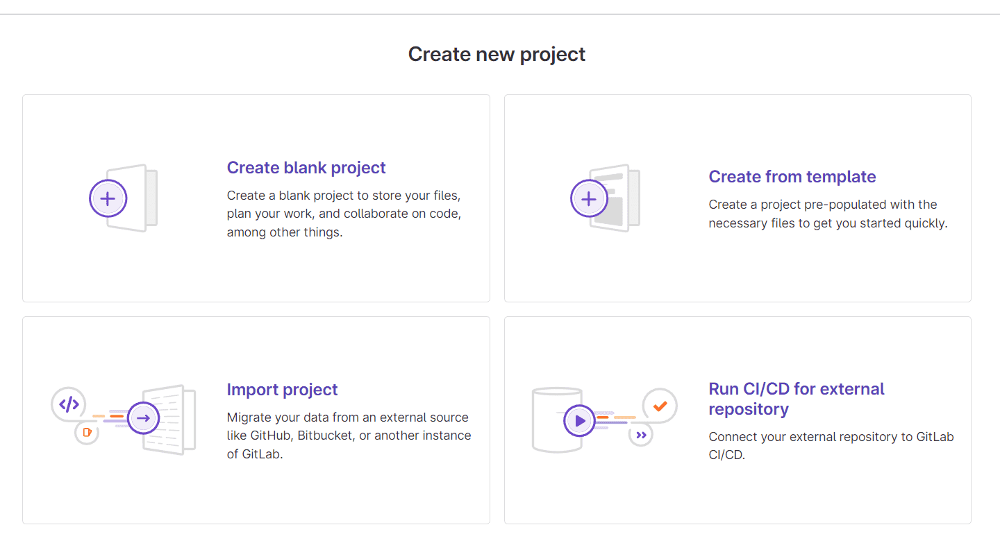
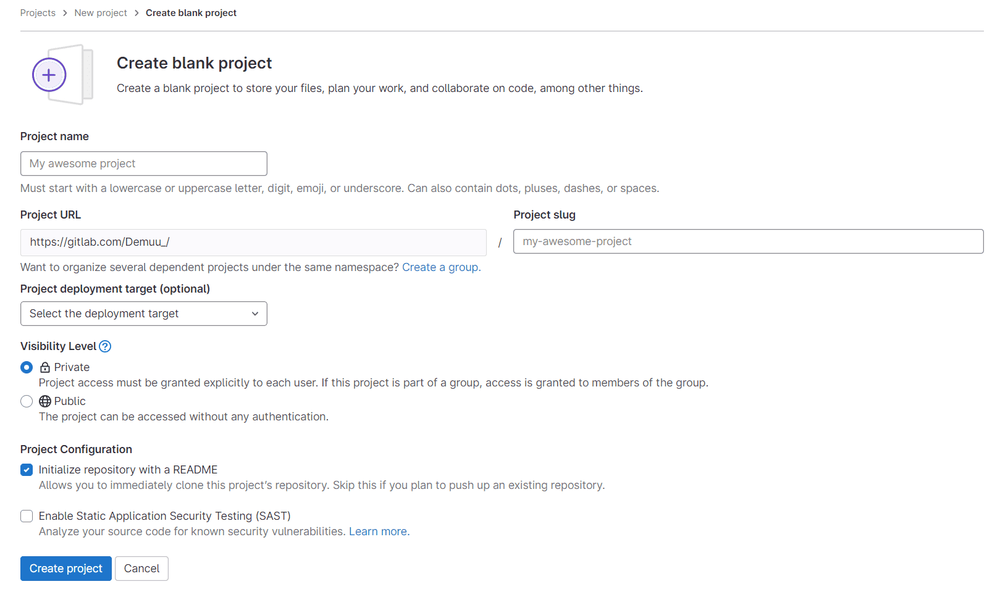
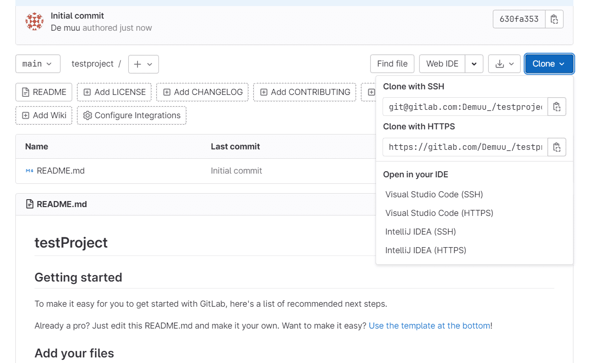
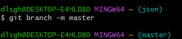
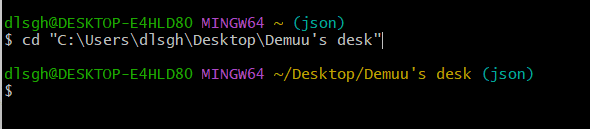
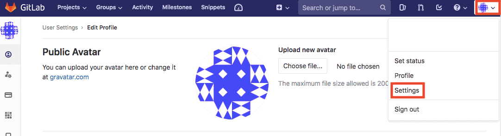
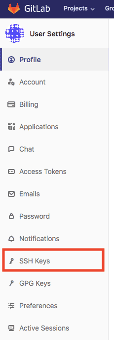

## [Git GUI 설치](https://git-scm.com)


이미 설치돼있다면 다음으로

<br>

## [Gitlab 시작](https://about.gitlab.com/)

### 회원 가입

이름, 이메일, 비밀번호 입력 후 Register 누르면 해당 이메일로 confirm 메일이 간다.

confirm을 해주고 나면 Gitlab 로그인 완료.

<br>

### 프로젝트 생성


오른쪽 상단에 New project 클릭



원하는 옵션 선택



이름, 공개 or 비공개 선택 후 생성



오른쪽 상단을 통해 클론

<br>

### 프로젝트 연결

프로젝트를 만들어서 내 로컬pc를 연결해야 한다.

연습용으로 새 폴더를 하나 만들어서 해당 폴더를 깃랩에 올려 연동하거나,

기존에 깃랩에 있는 파일을 통째로 가져와서(clone) 연동하는 방식도 있다.

실습 들어가기 전에 **깃랩에서 pull push 등을 이용하려면 ssh key를 발급**받아서 등록해야 한다.

(SSH Keys 발급 방법은 하단에서 참고)

윈도우 검색창이나 아무폴더 우클릭에 보면 Git GUI, Git Bash 가 있다.

Git Bash 에서 명령어를 입력해 Gitlab과 연결할 수 있다.

<br>

### 참고

**Git Bash 복붙**

- 복사 (Ctrl + Insert)
- 붙여넣기 (Shift + Insert)

<br>
**브랜치 이름 변경하기**

```bash
$ git branch -m master
```



<br>
### 최초 설정

```bash
$ git config --global user.name “이름”
$ git config --global user.email “이메일”
```

프로젝트마다 다른 이름과 이메일 주소를 사용하고 싶으면 —global 옵션을 뺀다.

<br>

### Git 저장소 만들기

Gitlab에 업로드 하고자 하는 폴더로 이동 (폴더 우클릭 Git Bash here OR cd 명령어)



```bash
$ git init

// 파일 추가
$ git add 파일명

// 커밋
$ git commit -m

// 타 프로젝트 참여 OR Git 저장소 복사
$ git clone https://Gitlab주소/프로젝트 이름

// 파일 상태 확인
$ git status

// Gitlab 서버에 업로드 진행
$ git push -u origin master
```

다른 명령어를 더 알아보고 싶으면 **[git 기초](https://preasim.github.io/3)** 참고.

<br>

## SSH Keys 발급 법





<br>
### Mac

터미널 실행

```bash
ssh-keygen
```

엔터를 누르면 패스워드 입력 화면이 나타난다.

컴터가 안전한 경우 패스코드 입력을 생략 (엔터 2회 누르기)

안전하지 않은 경우 패스코드를 넣으려면 패스코드 입력 후 동일한 패스코드 입력

<br>
**여기서 생성된 id_rsa는 절대 공유해서는 안됨**

**SSH로 등록해서 사용할 파일은 id_rsa.pub**

<br>
아래 명령어를 순서대로 입력

```bash
cd ~/.ssh
ls -al
cat id_rsa.pub
```

출력된 내용 전체인 [ssh-rsa ... .local] 에 해당하는 부분 전체 복사

위에서 열어둔 페이지의 [Key] 부분에 붙여넣기,

[Title]은 작명, Add key 버튼 클릭

<br>
### Window

Git Bash 실행 (아래 코드를 순서대로 입력)

```bash
ssh-keygen
Enter file in which to save the key // 공개키 생성 위치 - 기본경로 생성이기 때문에 엔터
Enter passphrase -> 패스워드 입력 (생략 가능)
Enter same passphrase again // 패스워드 재입력
```

C:\Users\PC계정명\.ssh 폴더에 공개키(id_rsa.pub)가 생성된다.

id_rsa.pub 파일을 메모장으로 열면 암호화타입, 키를 확인할 수 있다.

위에서 열어둔 페이지의 [Key] 부분에 붙여넣기,

[Title]은 작명, Add key 버튼 클릭