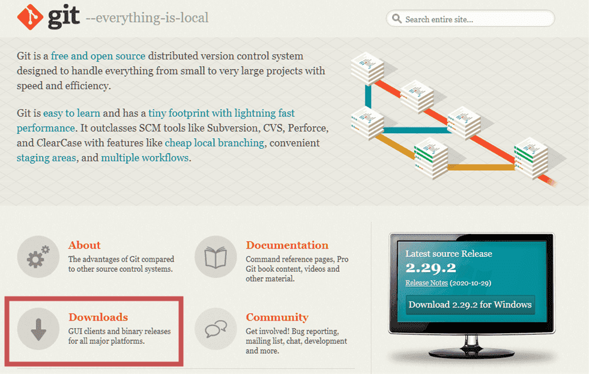
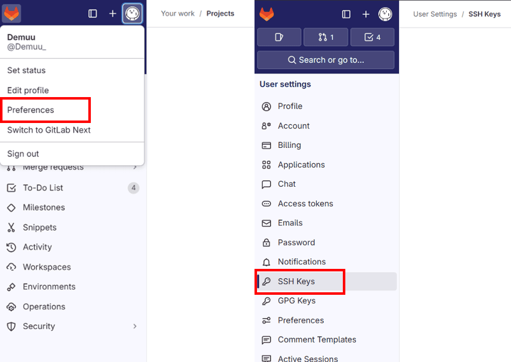
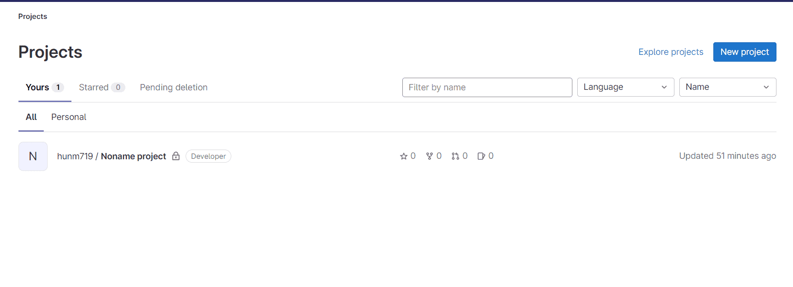
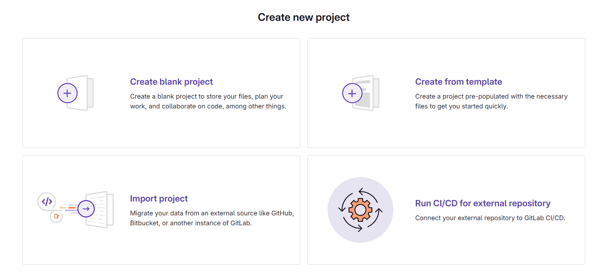

## 1. Git GUI 설치

**Mac 유저는 Git GUI 설치 필요없이 아래 사용되는 모든 명령어는 터미널에서 사용 가능하다.**

<div class="cl3"></div>

Git GUI [[바로가기]](https://git-scm.com)

Git GUI를 다운로드하면 Git GUI와 Git Bash가 함께 설치된다.

<div class="cl3"></div>

**Git GUI**

Git 명령어를 GUI 환경에서 다룰 수 있는 그래픽 인터페이스이다.

Commit, Push, Pull 등의 Git 작업을 GUI로 실행할 수 있어 명렁어가 익숙하지 않은 경우 유용하다.

<div class="cl3"></div>

**Git Bash**

Git 명령어를 사용할 수 있는 터미널 환경으로, UNIX 스타일의 Bash 쉘을 제공한다.

Git 명령어뿐만 아니라 Linux 커멘드를 사용할 수 있어 윈도우 환경에서 Git을 효율적으로 사용할 수 있다.

<p align="center" style="margin: 34px 0 34px 0"></p>

<div class="cl2"></div>

## 2. GitLab 계정 생성 및 로그인

GitLab [[바로가기]](https://gitlab.com/)

GitLab에서 계정을 만든다. (자체 서버에 호스팅 된 GitLab을 사용할 경우 관리자에게서 계정을 발급받을 수도 있다.)

<div class="cl2"></div>

## 3. SSH 키 생성 및 등록

다운로드한 Git Bash를 열고, 아래 명령어를 입력한다. (이미 Git 설정을 완료한 경우에는 생략해도 된다.)

아래 명령어는 Git 사용자 정보 설정을 위한 것이다.

<div class="cl4"></div>

name은 Git 커밋에 표시될 이름이다.

email은 커밋에 사용될 이메일 주소이다. 보통 GitHub에 등록한 이메일을 사용한다.

```bash
$ git config --global user.name "이름"
$ git config --global user.email "이메일"
```

<div class="cl3"></div>

**SSH 키 생성**

GitLab에 SSH 키를 등록하면 로컬 컴퓨터에서 쉽게 인증할 수 있다.

로컬터미널 bash에서 아래 명령어를 입력한다.

```bash
ssh-keygen -t rsa -b 4096 -C "이메일"
```

<div class="cl4"></div>

이메일은 GitLab에 등록한 이메일을 입력한다.

키가 생성되면 일반적으로 `~/.ssh/id_rsa.pub` 경로에 저장된다.

<div class="cl3"></div>

**SSH 키 등록**

- GitLab에서 왼쪽 상단 프로필 아이콘을 클릭하고 Preferences > SSH Keys 메뉴로 이동한다.
- 생성된 `id_rsa.pub` 파일의 내용을 복사하여 GitLab에 붙여넣고 등록한다.

<p align="center" style="margin: 34px 0 34px 0"></p>

<div class="cl2"></div>

## 4. 새 프로젝트 생성

GitLab 대시보드에서 New Project 버튼을 클릭한다.

<p align="center" style="margin: 34px 0 34px 0"></p>

<p align="center" style="margin: 34px 0 34px 0"></p>

**Create Blank Project**

빈 프로젝트를 새로 생성하는 옵션이다.

<div class="cl4"></div>

처음부터 프로젝트를 시작하고자 할 때 사용한다.

코드, 파일 구조, Git 설정 등을 직접 정의할 수 있다.

<div class="cl3"></div>

**Create from Template**

GitLab에서 제공하는 다양한 템플릿을 이용하여 프로젝트를 생성하는 옵션이다.

<div class="cl4"></div>

자주 사용하는 프로젝트 구조나 설정을 쉽게 시작하고자 할 때 유용하다.

예를 들어 Node.js, Python, Ruby, Django 등의 템플릿을 선택할 수 있다.

<div class="cl3"></div>

**Import Project**

GitHub, Bitbucket, 다른 GitLab 인스턴스, 또는 로컬 저장소에서 기존 프로젝트를 가져와서 사용하는 옵션이다.

<div class="cl4"></div>

이미 다른 플랫폼에 존재하는 프로젝트를 GitLab으로 이전하고자 할 때 사용한다.

<div class="cl3"></div>

**Run CI/CD for External Repository**

외부 Git 저장소에 저장된 프로젝트에 대해 GitLab의 CI/CD 기능만 사용하고자 할 때 선택하는 옵션이다.

<div class="cl3"></div>

Project Name, Visibility Level (공개/비공개) 등 기본 설정을 입력한다.

<p align="center" style="margin: 34px 0 34px 0"></p>

프로젝트 페이지에서 Git 또는 SSH  URL을 복사하여 로컬 컴퓨터에서 사용할 준비를 한다.

<p align="center" style="margin: 34px 0 34px 0"></p>

<div class="cl2"></div>

## 5. Git 초기화 및 원격 저장소 연결

로컬 저장소 생성 및 초기화

```bash
mkdir my-project
cd my-project
git init
```

<div class="cl3"></div>

GitLab 원격 저장소 연결

```bash
git remote add origin <your_gitlab_repo_url>
```