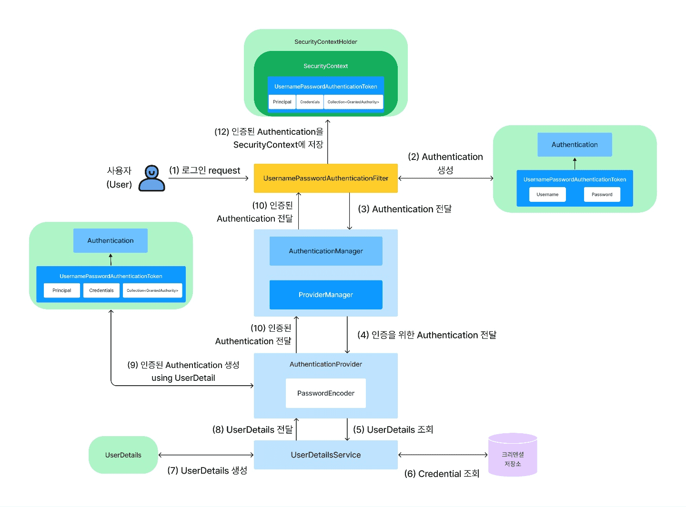
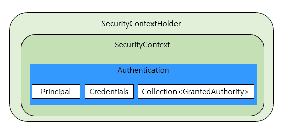

<br>

## 인증(Authentication) 처리 흐름

<p align="center"></p>

1. 사용자가 로그인 폼 등을 이용해 Username, Password를 포함한 request를 Spring Security가 적용된 애플리케이션에 전송한다.
    사용자의 로그인 요청이 Spring Security의 Filter Chain까지 들어오면 여러 Filter들 중에서 `UsernamePasswordAuthenticationFilter` 가 해당 요청을 전달받는다.
    
    <br>
2. 사용자의 로그인 요청을 받은 `UsernamePasswordAuthenticationFilter`는 Username과 Password를 이용해 `UsernamePasswordAuthenticationToken`(Authentication 인터페이스 구현 클래스)을 생성한다.

    <br>
3. 아직 미인증인 Authentication을 가지고 있는 `UsernamePasswordAuthenticationFilter`는 해당 Authentication을 `AuthenticationManager`에게 전달한다.
    
    
    `AuthenticationManager`는 인증 처리를 총괄하는 인터페이스이고, AuthenticationManager 구현 클래스가 바로 `ProviderManager`이다.<br>
    즉, **`ProviderManager` 가 인증이라는 작업을 총괄하는 실질적인 매니저**이다.
    
    <br>
4. `ProviderManager`로 부터 Authentication을 전달받은 `AuthenticationProvider`는 `UserDetailsService`를 이용해 `UserDetails`를 조회한다.

    `UserDetails`는 DB 등의 저장소에 저장된 사용자의 Username과 사용자의 자격을 증명해주는 크리덴셜(Credential)인 Password, <br>
    그리고 사용자의 권한 정보를 포함하고 있는 컴포넌트이다. 이 UserDetails를 제공하는 컴포넌트가 바로 UserDetailsService이다.

    <br>
5. UserDetailsService는 DB 등의 저장소에서 사용자의 Credential을 포함한 사용자의 정보를 조회한다.

    <br>
6. DB 등의 저장소에서 조회한 사용자의 Credential을 포함한 사용자의 정보를 기반으로 (7)과 같이 `UserDetails`를 생성한 후, 생성된 `UserDetails`를 다시 `AuthenticationProvider`에게 전달한다.(8)

    <br>
7. `UserDetails` 를 전달받은 `AuthenticationProvider`는 PasswordEncoder를 이용해 `UserDetails`에 포함된 암호화된 Password와 인증을 위한 Authentication 안에 포함된 Password가 일치하는지 검증한다.
    
     (9) **검증에 성공하면 UserDetails를 이용해 인증된 Authentication을 생성**한다 (실패시 exception 발생)
    
    <br>
8. `AuthenticationProvider`는 인증된 Authentication을 `ProviderManager`에게 전달한다. (10)
    
    
    (2)에서의 Authentication은 **인증을 위해 필요한 정보**, 이 단계에서 ProviderManager에게 전달한 Authenticaion은 **인증에 성공한 정보**를 가지고 있다.
    
    <br>
9. ProviderManager는 (11)과 같이 인증된 Authentication을 다시 UsernamePasswordAuthenticationFilter에게 전달한다.

    <br>
10. 인증된 Authentication을 전달 받은 UsernamePasswordAuthenticationFilter는 마지막으로 (12) SecurityContextHolder를 이용해 SecurityContext에 인증된 Authentication을 저장한다.

<br>

<br>

## 인증(Authentication) 컴포넌트

### UsernamePasswordAuthenticationFilter

`UsernamePasswordAuthenticationFilter`는 클라이언트로부터 전달받은 Username, Password를 Spring Security가 인증 프로세스에서 이용할 수 있도록 UsernamePasswordAuthenticationToken을 생성한다.


```java
// 상위 클래스인 AbstractAuthenticationProcessingFilter가 doFilter() 메서드를 포함
// 로그인 request를 제일 먼저 전달받는 클래스는 AbstractAuthenticationProcessingFilter
public class UsernamePasswordAuthenticationFilter extends AbstractAuthenticationProcessingFilter {

    // 클라이언트의 로그인 폼을 통해 전송되는 request parameter의 default name
    public static final String SPRING_SECURITY_FORM_USERNAME_KEY = "username"; 
    public static final String SPRING_SECURITY_FORM_PASSWORD_KEY = "password";

    // 클라이언트의 URL에 매치되는 매처
    private static final AntPathRequestMatcher DEFAULT_ANT_PATH_REQUEST_MATCHER = new AntPathRequestMatcher("/login","POST");
    ...
    ...
    public UsernamePasswordAuthenticationFilter(AuthenticationManager authenticationManager) {
        // 상위 클래스인 AbstractAuthenticationProcessingFilter에 전달
        super(DEFAULT_ANT_PATH_REQUEST_MATCHER, authenticationManager);
    }
  
    // 클라이언트에서 전달한 username, password 정보를 이용해 인증을 시도
    @Override
    public Authentication attemptAuthentication(HttpServletRequest request, HttpServletResponse response)
        throws AuthenticationException {

        // If HTTP Method is not POST Exception throw
        if (this.postOnly && !request.getMethod().equals("POST")) {
            throw new AuthenticationServiceException("Authentication method not supported: " + request.getMethod());
        }

        String username = obtainUsername(request);
        ...
        String password = obtainPassword(request);
        ...

        // 클라이언트에서 전달한 username, password 정보를 이용해 UsernamePasswordAuthenticationToken을 생성 (인증을 하기 위해)
        UsernamePasswordAuthenticationToken authRequest = UsernamePasswordAuthenticationToken.unauthenticated(username, password);
        ...
        // AuthenticationManager의 authenticate() 메서드를 호출해 인증 처리 위임
        return this.getAuthenticationManager().authenticate(authRequest);
    }
	...
    ...
}
```

<br>

### AbstractAuthenticationProcessingFilter

UsernamePasswordAuthenticationFilter가 상속하는 상위 클래스, Spring Security에서 제공하는 Filter중 하나이다.

HTTP 기반의 인증 요청을 처리하지만 실질적인 인증 시도는 하위 클래스에 맡기고, 인증에 성공하면 인증된 사용자의 정보를 SecurityContext에 저장하는 역할을 한다.

```java
public abstract class AbstractAuthenticationProcessingFilter extends GenericFilterBean
    implements ApplicationEventPublisherAware, MessageSourceAware {
    ...
    ...
    @Override
    public void doFilter(ServletRequest request, ServletResponse response, FilterChain chain)
            throws IOException, ServletException {
        doFilter((HttpServletRequest) request, (HttpServletResponse) response, chain);
    }

    // (1) AbstractAuthenticationProcessingFilter클래스가 Spring Security의 Filter임을 알 수 있다.
    private void doFilter(HttpServletRequest request, HttpServletResponse response, FilterChain chain)
            throws IOException, ServletException {
        // requiresAuthentication() 메서드는 하위 클래스에서 전달받은 requiresAuthenticationRequestMatcher
        // 객체를 통해 들어오는 요청이 인증 처리를 해야 하는지 여부를 결정 한다.
        if (!requiresAuthentication(request, response)) {
            chain.doFilter(request, response);
            return;
        }
        try {
            // 하위 클래스에 인증을 시도해 줄 것을 요청한다.
            // 하위 클래스 코드는 이 전에 작성한 위의 코드에 UsernamePasswordAuthenticationFilter
            Authentication authenticationResult = attemptAuthentication(request, response);
            if (authenticationResult == null) {
                // return immediately as subclass has indicated that it hasn't completed
                return;
            }
            this.sessionStrategy.onAuthentication(authenticationResult, request, response);
            // Authentication success
            if (this.continueChainBeforeSuccessfulAuthentication) {
                chain.doFilter(request, response);
            }
            // 인증에 성공하면 처리할 동작을 수행하기 위해 successfulAuthentication() 메서드 호출
            successfulAuthentication(request, response, chain, authenticationResult);
        }
        catch (InternalAuthenticationServiceException failed) {
            this.logger.error("An internal error occurred while trying to authenticate the user.", failed);
            // 인증에 실패한다면 unsuccessfulAuthentication() 메서드를 호출해 실패 시 처리할 동작 수행
            unsuccessfulAuthentication(request, response, failed);  // (1-4)
        }
        catch (AuthenticationException ex) {
            // Authentication failed
            unsuccessfulAuthentication(request, response, ex);
        }
    }


    // (2)
    protected boolean requiresAuthentication(HttpServletRequest request, HttpServletResponse response) {
        if (this.requiresAuthenticationRequestMatcher.matches(request)) {
            return true;
        }
        if (this.logger.isTraceEnabled()) {
            this.logger
                    .trace(LogMessage.format("Did not match request to %s", this.requiresAuthenticationRequestMatcher));
        }
        return false;
    }
    ...
    ...
    // (3)
    protected void successfulAuthentication(HttpServletRequest request, HttpServletResponse response, FilterChain chain,
            Authentication authResult) throws IOException, ServletException {
        SecurityContext context = SecurityContextHolder.createEmptyContext();
        context.setAuthentication(authResult);
        SecurityContextHolder.setContext(context);
        this.securityContextRepository.saveContext(context, request, response);
        if (this.logger.isDebugEnabled()) {
            this.logger.debug(LogMessage.format("Set SecurityContextHolder to %s", authResult));
        }
        this.rememberMeServices.loginSuccess(request, response, authResult);
        if (this.eventPublisher != null) {
            this.eventPublisher.publishEvent(new InteractiveAuthenticationSuccessEvent(authResult, this.getClass()));
        }
        this.successHandler.onAuthenticationSuccess(request, response, authResult);
    }
    // (4)
    protected void unsuccessfulAuthentication(HttpServletRequest request, HttpServletResponse response,
            AuthenticationException failed) throws IOException, ServletException {
        SecurityContextHolder.clearContext();
        this.logger.trace("Failed to process authentication request", failed);
        this.logger.trace("Cleared SecurityContextHolder");
        this.logger.trace("Handling authentication failure");
        this.rememberMeServices.loginFail(request, response);
        this.failureHandler.onAuthenticationFailure(request, response, failed);
    }
    ...
    ...
}
```

<br>

### UsernamePasswordAuthenticationToken

Spring Security에서 Username/Password로 인증을 수행하기 위해 필요한 토큰

또한 인증 성공 후 인증에 성공한 사용자의 인증 정보가 UsernamePasswordAuthenticationToken에 포함되어 Authentication 객체 형태로 SecurityContext에 저장된다.

```java
public class UsernamePasswordAuthenticationToken extends AbstractAuthenticationToken {

    ...

    private final Object principal;
    private Object credentials;

    ...
    ...

    // unauthenticated() 메서드는 인증에 필요한 용도의 UsernamePasswordAuthenticationToken 객체를 생성
    public static UsernamePasswordAuthenticationToken unauthenticated(Object principal, Object credentials) {
        return new UsernamePasswordAuthenticationToken(principal, credentials);
    }

    // authenticated() 메서드 인증에 성공한 이후 SecurityContext에 저장될 UsernamePasswordAuthenticationToken 객체를 생성
    public static UsernamePasswordAuthenticationToken authenticated(Object principal, Object credentials,
            Collection<? extends GrantedAuthority> authorities) {
        return new UsernamePasswordAuthenticationToken(principal, credentials, authorities);
    }

    ...
    ...

}
```

<br>

### Authentication

Spring Security에서 인증 자체를 표현하는 인터페이스

UsernamePasswordAuthenticationToken(위 코드) 는 AbstractAuthenticationToken 추상 클래스를 상속하는 확장 클래스 이자 Authentication 인터페이스의 메서드 일부를 구현하는 구현 클래스 이다.

애플리케이션 코드상에서 인증을 위해 생성되는 인증 토큰 또는 인증 성공 후 생성되는 토큰은 UsernamePasswordAuthenticationToken과 같은 하위 클래스의 형태로 생성되지만 

생성된 토큰을 리턴 받거나 SecurityContext에 저장될 경우에 Authentication 형태로 리턴 받거나 저장된다.

```java
// Principal: 사용자를 식별하는 고유 정보 (Username)
public interface Authentication extends Principal, Serializable {
    // Authorities: AuthenticationProvider에 의해 부여된 사용자의 접근 권한 목록
    Collection<? extends GrantedAuthority> getAuthorities();
    // Creedntials: 인증에 필요한 Password, 인증 후 ProviderManager가 해당Credentials를 삭제한다.
    Object getCredentials();
    Object getDetails();
    Object getPrincipal();
    boolean isAuthenticated();
    void setAuthenticated(boolean isAuthenticated) throws IllegalArgumentException;
}
```

<br>

### AuthenticationManager

인증 처리를 총괄하는 매니저 역할 인터페이스

```java
public interface AuthenticationManager {
    Authentication authenticate(Authentication authentication) throws AuthenticationException;
}
```

인증을 위한 Filter는 AuthenticationManager를 통해 느슨한 결합을 유지하고 있으며,

인증을 위한 실질적인 관리는 AuthenticationManager를 구현하는 구현 클래스를 통해 이루어진다.

<br>

### ProviderManager

AuthenticationManager 인터페이스 구현 클래스

AuthenticationProvider를 관리하고, AuthenticationProvider에게 인증 처리를 위임하는 역할.

```java
public class ProviderManager implements AuthenticationManager, MessageSourceAware, InitializingBean {
  ...
  ...

    // ProviderManager 클래스가 Bean으로 등록 시, List<AuthenticationProvider> 객체를 DI 받는다.
    public ProviderManager(List<AuthenticationProvider> providers, AuthenticationManager parent) {
        Assert.notNull(providers, "providers list cannot be null");
        this.providers = providers;
        this.parent = parent;
        checkState();
    }

  ...
  ...

    @Override
    public Authentication authenticate(Authentication authentication) throws AuthenticationException {
        Class<? extends Authentication> toTest = authentication.getClass();
        AuthenticationException lastException = null;
        AuthenticationException parentException = null;
        Authentication result = null;
        Authentication parentResult = null;
        int currentPosition = 0;
        int size = this.providers.size();

        // DI 받은 List를 이용해 for문으로 적절한 AuthenticaionProvider를 찾는다.
        for (AuthenticationProvider provider : getProviders()) {
            if (!provider.supports(toTest)) {
                continue;
            }
            if (logger.isTraceEnabled()) {
                logger.trace(LogMessage.format("Authenticating request with %s (%d/%d)",
                        provider.getClass().getSimpleName(), ++currentPosition, size));
            }
            try {
                // 적절한 AuthenticationProvider를 찾았다면 AuthenticationProvider에게 인증 처리를 위임한다.
                result = provider.authenticate(authentication);
                if (result != null) {
                    copyDetails(authentication, result);
                    break;
                }
            }
            catch (AccountStatusException | InternalAuthenticationServiceException ex) {
                prepareException(ex, authentication);
                throw ex;
            }
            catch (AuthenticationException ex) {
                lastException = ex;
            }
        }

        ...
        ...

        if (result != null) {
            if (this.eraseCredentialsAfterAuthentication && (result instanceof CredentialsContainer)) {
                ((CredentialsContainer) result).eraseCredentials(); // 인증이 처리되면 인증에 사용된 Credentials를 제거한다.
            }
            if (parentResult == null) {
                this.eventPublisher.publishAuthenticationSuccess(result);
            }
            return result;
        }
    ...
    ...
    }
  ...
  ...
}
```

<br>

### AuthenticationProvider

AuthenticationManager로부터 인증 처리를 위임받아 실질적인 인증 수행을 담당하는 컴포넌트

Username, Password 기반의 인증 처리는 `DaoAuthenticationProvider`가 담당,

`DaoAuthenticationProvider`는 UserDetailsService로부터 전달받은 UserDetails를 이용해 인증을 처리함.

```java
// AuthenticationProvider 인터페이스의 구현 클래스는 AbstractUserDetailsAuthenticationProvider
// AbstractUserDetailsAuthenticationProvider 추상 클래스의 authenticate() 메서드에서부터 실질적인 인증 처리 시작
public class DaoAuthenticationProvider extends AbstractUserDetailsAuthenticationProvider {
    ...
    ...
    private PasswordEncoder passwordEncoder;
    ...
    ...

    // retrieveUser() 는 UserDetailsService로부터 UserDetails를 조회하는 역할
    // UserDetails는 사용자를 인증할 때, 인증에 성공할 경우, 인증된 Authentication 객체를 생성하는 데 사용한다.
    @Override
    protected final UserDetails retrieveUser(String username, UsernamePasswordAuthenticationToken authentication)
            throws AuthenticationException {
        prepareTimingAttackProtection();
        try {
            UserDetails loadedUser = this.getUserDetailsService().loadUserByUsername(username); // UserDetails를 조회
            if (loadedUser == null) {
                throw new InternalAuthenticationServiceException(
                        "UserDetailsService returned null, which is an interface contract violation");
            }
            return loadedUser;
        }
        catch (UsernameNotFoundException ex) {
            mitigateAgainstTimingAttack(authentication);
            throw ex;
        }
        catch (InternalAuthenticationServiceException ex) {
            throw ex;
        }
        catch (Exception ex) {
            throw new InternalAuthenticationServiceException(ex.getMessage(), ex);
        }
    }

    // (3)
    @Override
    protected void additionalAuthenticationChecks(UserDetails userDetails,
            UsernamePasswordAuthenticationToken authentication) throws AuthenticationException {
        if (authentication.getCredentials() == null) {
            this.logger.debug("Failed to authenticate since no credentials provided");
            throw new BadCredentialsException(this.messages
                    .getMessage("AbstractUserDetailsAuthenticationProvider.badCredentials", "Bad credentials"));
        }
        String presentedPassword = authentication.getCredentials().toString();
        if (!this.passwordEncoder.matches(presentedPassword, userDetails.getPassword())) { // (3-1)
            this.logger.debug("Failed to authenticate since password does not match stored value");
            throw new BadCredentialsException(this.messages
                    .getMessage("AbstractUserDetailsAuthenticationProvider.badCredentials", "Bad credentials"));
        }
    }

    ...
    ...
}
```
<br>
**메소드 호출 순서**

1. `AbstractUserDetailsAuthenticationProvider`의 authenticate() 메서드 호출
2. `DaoAuthenticationProvider`의 rerieveUser() 메서드 호출
3.  `DaoAuthenticationProvider`의 additionalAuthenticationChecks() 메서드 호출
4. `DaoAuthenticationProvider`의 createSuccessAuthentication() 메서드 호출
5. `AbstractUserDetailsAuthenticationProvider`의 createSuccessAuthentication() 메서드 호출
6. 인증된 `Authentication`을 ProviderManager에게 리턴

<br>

### UserDetails

DB 등의 저장소에 저장된 사용자의 Username과 사용자의 자격을 증명해주는 Credential인 password 그리고 사용자의 권한 정보를 포함하는 컴포넌트

AuthenticationProvider는 UserDetails를 이용해 자격 증명을 수행한다.

```java
public interface UserDetails extends Serializable {

    Collection<? extends GrantedAuthority> getAuthorities(); // (1) 권한 정보
    String getPassword(); // (2) 패스워드
    String getUsername(); // (3) Username

    boolean isAccountNonExpired();  // (4)
    boolean isAccountNonLocked();   // (5)
    boolean isCredentialsNonExpired(); // (6)
    boolean isEnabled();               // (7)
}
```

<br>

### UserDetailsService

UserDetails를 로드하는 핵심 인터페이스

```java
public interface UserDetailsService {
    UserDetails loadUserByUsername(String username) throws UsernameNotFoundException;
}
```

UserDetailsService를 구현하는 클래스는 loadUserByUsername(String username)을 통해 사용자의 정보를 로드한다.

<br>

### SecurityContext와 SecurityContextHolder

SecurityContext는 인증된 Authentication 객체를 저장하는 컴포넌트,<br>
SecurityContextHolder는 SecurityContext를 관리하는 역할이다.

Spring Security 에선 SecurityContextHolder에 의해 SecurityContext에 값이 채워져 있다면 인증된 사용자로 간주한다.

<p align="center"></p>

SecurityContextHolder를 통해 인증된 Authentication을 SecurityContext에 설정할 수 있고, SecurityContextHolder를 통해 인증된 Authentication 객체에 접근할 수 있다.

```java
public class SecurityContextHolder {
    ...
    ...
    // SecurityContextHolder에서 사용하는 전략을 의미
    // SecurityContextHolder 기본 전략은 ThreadLocalSecurityContextHolderStrategy 이다.
    private static SecurityContextHolderStrategy strategy;
    ...
    ...

    // getContext() 메서드를 통해 현재 실행 스레드에서 SecurityContext를 얻을 수 있다.
    public static SecurityContext getContext() {
        return strategy.getContext();
    }
    ...
    ...

    // setContext() 메서드는 현재 실행 스레드에 SecurityContext를 연결한다.
    // 대부분 인증된 Authentication을 포함한 SecurityContext를 현재 실행 스레드에 연결하는데 사용한다.
    public static void setContext(SecurityContext context) {
        strategy.setContext(context);
    }
    ...
    ...
}
```

ThreadLocal은 스레드 간에 공유되지 않는 스레드 고유의 로컬 변수 같은 영역을 말한다.