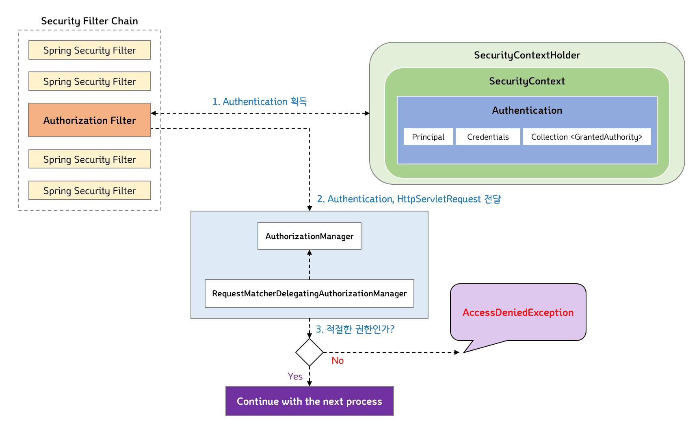

인증된 사용자임을 환인 후, Spring Security에서 인증된 사용자에게 애플리케이션 리소스에 대한 접근 권한을 부여하는 과정

<p align="center"></p>

Spring Security Filter Chain에서 URL을 통해 사용자의 엑세스를 제한하는 권한 부여 Filter는 바로 `AuthorizationFilter`이다.

1. `AuthorizationFilter`는 그림(1) 과 같이 SecurityContextHolder로 부터 Authentication을 회득한다.
2. 그리고 그림(2)와 같이 SecurityContextHolder로 부터 획득한 Authentication과 HttpServletRequest를 `AuthorizationManager`에게 전달한다.
3. `RequestMatcherDelegatingAuthorizationManager` 내부에서 매치되는 `AuthorizationManager` 구현 클래스가 있다면 해당 구현 클래스가 사용자의 권한을 체크한다. / 그림(3)
4. 적절한 권한이라면 다음 요청 프로세스를 이어간다. OR 적절한 권한이 아니라면 `AccessDeniedException`이 throw되고 `ExceptionTranslationFilter`가 `AccessDeniedException`을 처리한다.

> `RequestMatcherDelegatingAuthorizationManager`가 직접 권한 부여 처리를 하는 것이 아니라 `RequestMatcher`를 통해 매치되는 `AuthorizationManager` 구현 클래스에게 위임한다.

<br>

<br>

## Spring Security의 권한 부여 컴포넌트

<br>
### AuthorizationFilter

URL을 통해 사용자의 액세스를 제한하는 권한 부여 Filter (Spring Security 5.5 이상부터 FilterSecurityInterceptor 대체)

```java
public class AuthorizationFilter extends OncePerRequestFilter {

    private final AuthorizationManager<HttpServletRequest> authorizationManager;
    ...
    ...

    // DI 받은 AuthorizationManager를 통해 권한 부여 처리를 진행
    public AuthorizationFilter(AuthorizationManager<HttpServletRequest> authorizationManager) {
        Assert.notNull(authorizationManager, "authorizationManager cannot be null");
        this.authorizationManager = authorizationManager;
    }

    @Override
    protected void doFilterInternal(HttpServletRequest request, HttpServletResponse response, FilterChain filterChain)
            throws ServletException, IOException {

        // DI 받은 AuthorizationManager의 check() 메서드를 호출해 적절한 권한 부여 여부를 체크
        AuthorizationDecision decision = this.authorizationManager.check(this::getAuthentication, request);
        this.eventPublisher.publishAuthorizationEvent(this::getAuthentication, request, decision);
        if (decision != null && !decision.isGranted()) {
            throw new AccessDeniedException("Access Denied");
        }
        filterChain.doFilter(request, response);
    }
    ...
    ...
}
```
AuthorizationManager의 `check()` 메서드는 AuthorizationManager 구현 클래스에 따라 권한 체크 로직이 다르다.

URL 기반으로 권한 부여 처리를 하는 **AuthorizationFilter**는 AuthorizationManager의 구현 클래스로 `RequestMatcherDelegatingAuthorizationManager`를 사용한다.

<br>

<br>

### AuthorizationManager

권한 부여 처리를 총괄하는 매니저 역할 인터페이스

```java
@FunctionalInterface
public interface AuthorizationManager<T> {
    ...
    ...

    @Nullable
    AuthorizationDecision check(Supplier<Authentication> authentication, T object);
}
```

check() 메서드 하나만 정의되어 있으며,  Supplier와 제너릭 타입의 객체를 파라미터로 가진다.

<br>

<br>

### RequestMatcherDelegatingAuthorizationManager

<br>
AuthorizationManager의 구현 클래스 중 하나

직접 권한 부여 처리를 수행하지 않고 RequestMatcher를 통해 매치되는 AuthorizationManager 구현 클래스에게 처리를 위임함.

```java
public final class RequestMatcherDelegatingAuthorizationManager implements AuthorizationManager<HttpServletRequest> {
    ...
    ...

    @Override
    public AuthorizationDecision check(Supplier<Authentication> authentication, HttpServletRequest request) {
        if (this.logger.isTraceEnabled()) {
            this.logger.trace(LogMessage.format("Authorizing %s", request));
        }

        // (1)
        for (RequestMatcherEntry<AuthorizationManager<RequestAuthorizationContext>> mapping : this.mappings) {

            RequestMatcher matcher = mapping.getRequestMatcher(); // (2)
            MatchResult matchResult = matcher.matcher(request);
            if (matchResult.isMatch()) {   // (3)
                AuthorizationManager<RequestAuthorizationContext> manager = mapping.getEntry();
                if (this.logger.isTraceEnabled()) {
                    this.logger.trace(LogMessage.format("Checking authorization on %s using %s", request, manager));
                }
                return manager.check(authentication,
                        new RequestAuthorizationContext(request, matchResult.getVariables()));
            }
        }
        this.logger.trace("Abstaining since did not find matching RequestMatcher");
        return null;
    }
}
```

check() 메서드 내부에서 반복문을 돌면서 RequestMatcherEntry 정보를 얻은 후에 (2) RequestMatcher 객체를 얻는다.

(3) MatchResult.isMatch() == true 이면 AuthorizationManager 객체를 얻은 뒤, 사용자의 권한을 체크한다.

> RequestMatcher는 SecurityConfiguration에서 `.antMatchers("/orders/**").hasRole("ADMIN")`와 같은 메서드 체인 정보를 기반으로 생성된다.

<br>

<br>

## 접근 제어 표현식

Spring Security에서는 웹 및 메소드 보안을 위해 표현식(Spring EL)을 사용할 수 있다.

<br>

- **hasRole(String role)**
    - 현재 보안 주체(principal)가 지정된 역할을 갖고 있는지 여부를 확인하고 있다면 true를 리턴.
    - hasRole(’admin’)처럼 파라미터로 넘긴 role이 ROLE_로 시작하지 않으면 기본적으로 추가한다.

---

<br>
- **hasAnyRole(String… roles)**
    - 현재 보안 주체가 지정한 역할 중 1개라도 가지고 있으면 true를 리턴. (문자열 리스트를 콤마로 구분해서 전달)
    - ex) hasAnyRole(’admin’, ‘user’)

---

<br>
- **hasAuthority(String authoriy)**
    - 현재 보안 주체가 지정한 권한을 갖고 있는지 여부를 확인하고 있다면 true 리턴
    - ex) hasAuthoriy(’read’)

---

<br>
- **hasAnyAuthority(String… authorities)**
    - 현재 보안 주체가 지정한 권한 중 하나라도 있으면 true 리턴.
    - ex) hasAnyAuthority(’read’, ‘write’)

---

<br>
- **principal**
    - 현재 사용자를 나타내는 principal 객체에 직접 접근할 수 있음.

---

<br>
- **authentication**
    - SecurityContext로 조회할 수 있는 현재 Authentication 객체에 직접 접근할 수 있음.

---

<br>
- **permitAll**
    - 항상 true로 평가.

---

<br>
- **denyAll**
    - 항상 false로 평가.

---

<br>
- **isAnonymous()**
    - 현재 보안 주체가 익명 사용자면 true 리턴.

---

<br>
- **isRememberME()**
    - 현재 보안 주체가 remember-me 사용자면 true 리턴.

---

<br>
- **isAuthenticated()**
    - 사용자가 익명이 아닌 경우 true를 리턴.

---

<br>
- **isFullyAuthenticated()**
    - 사용자가 익명 사용자나 remember-me 사용자가 아니면 true 리턴.

---

<br>
- **hasPermission(Object target, Object permission)**
    - 사용자가 target에 해당 permission 권한이 있으면 true 리턴.
    - ex) hasPermission(domainObject, ‘read’)

---

<br>
- **hasPermission(Object targetId, String targetType, Object permission)**
    - 사용자가 target에 해당 permission 권한이 있으면 true 리턴.
    - ex) hasPermission(1, ‘com.example.domain.Message’, ‘read’)

<br>

<br>