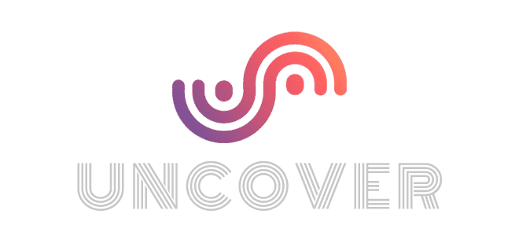

코드스테이츠 메인 프로젝트 Undefined팀 Uncover 프로젝트 회고

 
**GitHub**. **[seb43_main_017](https://github.com/codestates-seb/seb43_main_017)** &nbsp; /
**🎧[홈페이지 바로가기](https://uncoversound.com/)**

 

 

## 나의 프로젝트 경험에 대한 회고

프로젝트를 마무리하며 여러 가지 좋은 경험과 성장을 얻을 수 있었다.

특히 다음과 같은 점들이 나에게 큰 의미를 가진 경험들이었다.

 

### 1. 협업과 커뮤니케이션

프로젝트 동안 팀원들과의 원활한 커뮤니케이션은 프로젝트의 핵심이었다.

팀원들과 의견을 공유하고 조율하는 과정에서 서로의 아이디어와 전문성을 존중하고 융합할 수 있는 능력을 키울 수 있었다.

특히 정기적인 회의와 업무 분담, 의사 결정 과정에서의 원활한 소통은 프로젝트 진행에 큰 도움이 되었다.

 

### 2. 문제 해결과 트러블 슈팅

프로젝트 도중 발생한 문제들을 해결해나가는 과정에서 많은 도전을 겪었다.

하지만 이러한 도전은 동시에 성장의 기회였다.

문제를 분석하고 원인을 찾아내며 해결책을 모색하는 과정에서 문제 해결 능력과 창의적 사고력을 향상시킬 수 있었다.

 

### 3. 프로젝트 관리와 멘탈 관리

프로젝트를 성공적으로 완수하기 위해서는 체계적인 프로젝트 관리와 멘탈 관리가 필요했다.

일정 관리, 작업 우선순위 설정, 스트레스 관리 등을 통해 프로젝트를 효율적으로 진행하고 팀원들과의 긍정적인 협력을 유지할 수 있었다.

이러한 경험을 통해 효과적인 프로젝트 관리와 멘탈 관리의 중요성을 깨달을 수 있었다.

 

 

## 다른 팀의 서비스를 경험해본 후기

우리 팀은 다른 팀의 서비스를 경험하며 많은 교훈을 얻을 수 있었다.

다른 팀의 서비스를 통해 알게 된 점들은 다음과 같다.

 

### 1. 기술적인 차이

다른 팀의 서비스를 사용해보면서 기술적인 차이를 느낄 수 있었다.

각 팀이 선택한 기술 스택, 아키텍처, 디자인 패턴 등은 서로 다른 접근 방식과 장단점을 가지고 있었다.

이를 통해 다른 팀의 기술적 선택과 구현 방법을 살펴보며, 우리 팀의 기술적인 개선점을 도출할 수 있었다.

 

### 2. 팀 활동 페이지 별 특성

다른 팀의 서비스를 사용하면서 각 팀의 팀 활동 페이지의 특성을 알 수 있었다.

팀별로 어떤 정보를 공유하고 어떤 형식으로 업무를 관리하는지를 비교하고 분석할 수 있었다.

이를 통해 우리 팀의 팀 활동 페이지를 보다 효율적으로 개선하고 업무 협업을 원활하게 진행할 수 있을 것이다.

 

### 3. 다음 프로젝트에 대한 배움과 도전

다른 팀의 서비스를 경험하면서 다음 프로젝트에 대한 도전과 배움의 기회를 얻을 수 있었다.

다른 팀의 서비스에서 보았던 장점과 아쉬운 점들을 살펴보고, 이를 우리 팀의 다음 프로젝트에 적용하고 개선해 나갈 수 있을 것이다.

위와 같은 경험들을 통해 다른 팀의 서비스를 사용해본 후기는 우리 팀의 기술적인 성장과 향후 프로젝트의 개선 방향성을 제시하는 데 큰 도움이 되었다.

 

 

## 마치며

프로젝트를 진행하며 많은 경험을 쌓을 수 있어서 영광이었다.

이 프로젝트를 통해 새로운 기술을 배우고, 팀원들과의 협업을 통해 문제를 해결하고 성과를 이끌어낼 수 있었다.

 
또한, 다른 팀의 서비스를 경험해본 것도 큰 도움이 되었다.

다른 팀의 접근 방식과 아이디어를 접하며 새로운 관점을 얻고, 우리 팀의 성장과 개선 방향을 도출할 수 있었다.

 
이 프로젝트를 통해 내가 얻은 경험과 성장은 앞으로의 여정에서도 큰 자산이 될 것이다.

프로젝트 동료들과의 협업, 문제 해결 과정, 기술적인 습득 등 다양한 경험들은 나에게 끊임없이 발전하는 기회를 제공해주었다.

 
마지막으로, 이번 프로젝트에 참여한 팀원들에게 감사의 말을 전하고 싶다.

함께 노력하고 협력하여 프로젝트를 성공으로 이끌어낸 모든 팀원들에게 큰 칭찬과 격려의 말을 전하고 싶다.

각자의 역할을 수행하며 우리 팀의 목표를 달성하였고, 그 과정에서 함께 성장할 수 있었다.

 
이 프로젝트를 통해 배운 것들을 지속적으로 발전시켜 나가며, 앞으로 더욱 탁월한 성과를 이루어내기 위해 노력하고 싶다.

  

    <h2>Uncover 프로젝트와 관련된 포스트들</h2>
    
<a href="https://preasim.github.io/46">Undefined팀 회고 ></a>

    
<a href="https://preasim.github.io/45">노래 추천 알고리즘 ></a>

    
<a href="https://preasim.github.io/44">동시성 문제와 해결책 ></a>

  

