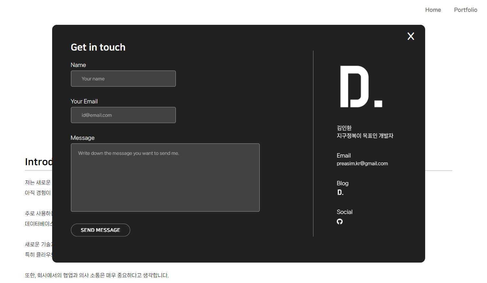
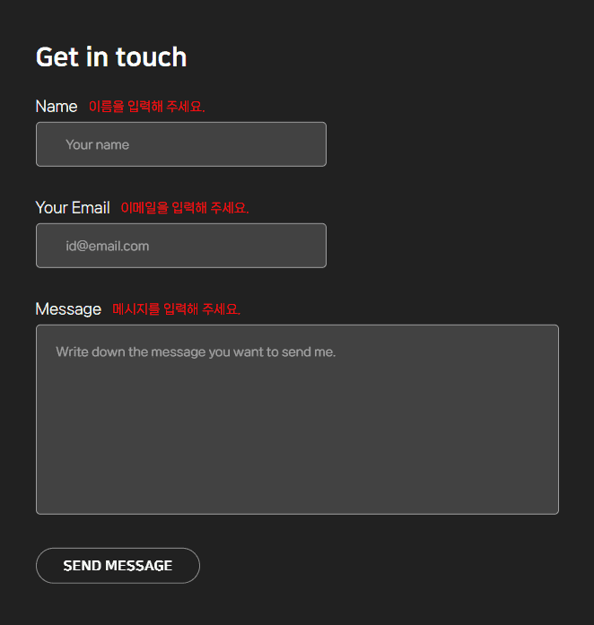

email.js를 사용해서 이메일 보내기

<br>

<p align="center"></p>

내 웹에서 유저가 나에게 바로 메일을 보낼 수 있도록 만들었다.

<br>

```jsx
<script type="text/javascript" src="https://cdn.jsdelivr.net/npm/@emailjs/browser@3/dist/email.min.js"></script>
<script type="text/javascript">
  (function(){
     emailjs.init("secret key");
  })();
</script>
```

<br>

**html**

```html
<div class="send-mail">
    <h2>Get in touch</h2>
    <div class="send-namebx">
      <p>Name</p> <span>이름을 입력해 주세요.</span>
      <input type="text" id="fullName" placeholder="Your name" required>
    </div>
    <div class="send-emailbx">
      <p>Your Email</p> 
      <span class="email-alert1">이메일을 입력해 주세요.</span>
      <span class="email-alert2">이메일 형식이 잘못되었습니다.</span>
      <input type="email" id="email_id" placeholder="id@email.com">
    </div>
    <div class="send-messagebx">
      <p>Message</p> <span>메시지를 입력해 주세요.</span>
      <textarea id="message" placeholder="Write down the message you want to send me." required></textarea>
    </div>
    <div class="send-mailBtn">
      <button onclick="SendMail();">
        SEND MESSAGE
      </button>
      <i class="fa-solid fa-truck"></i>
    </div>

    <div class="my-information">
      
      <div>
        <h5>김인환</h5>
        <h5>지구정복이 목표인 개발자</h5>
      </div>
      <div>
        <h5>Email</h5>
        <p>preasim.kr@gmail.com</p>
      </div>
      <div class="information-blog">
        <h5>Blog</h5>
        <a href="https://preasim.github.io" target="_blank"></a>
      </div>
      <div class="information-social">
        <h5>Social</h5>
        <a href="https://github.com/Preasim" target="_blank"><i class="fa-brands fa-github"></i></a>
      </div>
    </div>
    <i class="fa-solid fa-x x-btn"></i>
  </div>
```

<br>

<p align="center"></p>

<br>

유저가 이메일이 아닌 다른 문자를 작성하면 이메일이 보내지지 않도록 검수하고

입력한 텍스트가 조건에 맞지 않거나 작성되지 않았다면

상단에 빨간 글씨로 경고 문자를 표시한다.

<br>

**JS**

```jsx
let enterMessage = false;

function SendMail() {
  const nameBx = document.querySelector('.send-namebx input').value.trim();
  const nameBxAlert = document.querySelector('.send-namebx span');

  const emailBx = document.querySelector('.send-emailbx input').value.trim();
  const emailBxAlert = document.querySelector('.email-alert1');
  const emailBxAlert2 = document.querySelector('.email-alert2');

  const messageBx = document.querySelector('.send-messagebx textarea').value.trim();
  const messageBxAlert = document.querySelector('.send-messagebx span');

  const reg_email = /^([0-9a-zA-Z_\.-]+)@([0-9a-zA-Z_-]+)(\.[0-9a-zA-Z_-]+){1,2}$/;

  // name 입력했는지 여부
  if(nameBx === "") {
    nameBxAlert.style.display = 'inline-block';
    return;
  } else {
    nameBxAlert.style.display = 'none';
  }
  // 이메일 입력했는지 여부
  if (emailBx === "") {
    emailBxAlert.style.display = 'inline-block';
    return;
  } else {
    emailBxAlert.style.display = 'none';
  }
  if (!reg_email.test(emailBx)){
    emailBxAlert2.style.display = 'inline-block';
    return;
  } else {
    emailBxAlert2.style.display = 'none';
  }

  // name 입력했는지 여부
  if (messageBx === "") {
    messageBxAlert.style.display = 'inline-block';
    return;
  } else {
    messageBxAlert.style.display = 'none';
  }

  enterMessage = !(nameBx === "" || emailBx === "" || messageBx === "");

  if(nameBx) {
    nameBxAlert.style.display = 'none';
  } else if (emailBx) {
    emailBxAlert.style.display = 'none';
  } else if (messageBx) {
    messageBxAlert.style.display = 'none';
  }
  
  let params = {
    from_name : document.querySelector('#fullName').value,
    email_id : document.querySelector('#email_id').value,
    message : document.querySelector('#message').value
  }
  emailjs.send("service_jy4uocr", "template_wathvzm", params);
}

function SendMailClick(){
  let click = true;
  const contactBtn = document.querySelector('.contact-btn');
  const sendMail = document.querySelector('.send-mail');
  
  contactBtn.addEventListener('click', function(){
    if(click){
      sendMail.style.transform = 'translate(-50%, -50%)';
      click = false;
    } else {
      sendMail.style.transform = 'translate(-50%, 100%)';
      click = true;
    }
  });
  
  const Xbtn = document.querySelector('.x-btn');
  Xbtn.addEventListener('click', function(){
    sendMail.style.transform = 'translate(-50%, 100%)';
    click = true;
  });
  
  const sendMailBtn = document.querySelector('.send-mailBtn button');
  const sendMailBtnTruck = document.querySelector('.send-mailBtn i');
  const inputReset = document.querySelector('.send-namebx input');
  const inputReset2 = document.querySelector('.send-emailbx input');
  const textReset = document.querySelector('.send-messagebx textarea');
  sendMailBtn.addEventListener('click', () => {
    if(enterMessage == true) {
      sendMailBtn.style.setProperty('--y', '25px');
      sendMailBtn.style.setProperty('--rocate', '90deg');

      sendMailBtnTruck.style.opacity = '1';
      setTimeout(() => {
        sendMailBtnTruck.style.transform = 'translate(2300%, 0)';

        setTimeout(() => {
          sendMailBtnTruck.style.opacity = '0';

          setTimeout(() => {
            sendMail.style.transform = 'translate(-50%, 100%)';
            click = true;
          },800);

          setTimeout(() => {
            sendMailBtnTruck.style.transform = 'translate(0, 0)';
            sendMailBtn.style.setProperty('--y', '0');
            sendMailBtn.style.setProperty('--rocate', '0');
            inputReset.value = "";
            inputReset2.value = "";
            textReset.value = "";
            enterMessage = false;
          }, 2000);
        },1200);

      },500);
    }
  })

}
SendMailClick();
```

<div class="cl2"></div>

<div class="callout cImpact">
  <div class="callout-in">
    <h2>Portfolio 프로젝트와 관련된 포스트들</h2>
    <p style="padding-top: 16px;"><a href="https://preasim.github.io/52">포트폴리오 웹 제작 회고 ></a></p>
    <p><a href="https://preasim.github.io/51">JS에서 이메일 보내기 ></a></p>
    <p><a href="https://preasim.github.io/50">cdn끼리 충돌 날 때 해결법 ></a></p>
    <p><a href="https://preasim.github.io/49">스크롤 시 한 섹션씩 이동 ></a></p>
    <p><a href="https://preasim.github.io/48">JS으로  Include 사용하기! ></a></p>
    <p><a href="https://preasim.github.io/47">자동 무한 이미지 슬라이드 구현 ></a></p>
  </div>
</div>