포폴웹 제작 후기

<div class="cl3"></div>
**GitHub**. **[Demuu](https://github.com/Preasim/Demuu)** &nbsp; /
**[홈페이지 바로가기](http://demuu.dothome.co.kr/main-page/index.html)**

<div class="cl3"></div>

나를 단순한 이력서와 포트폴리오로 표현하는 것은 충분하지 않다고 생각했다.

나만의 창작물과 스토리를 더욱 생생하게 전달하고자, 포트폴리오 웹을 만들기로 결심했다.

<div class="cl3"></div>

나를 나타내는 포트폴리오인 만큼 

내가 좋아하는 무채색인 하얀색, 회색, 검은색을 선택했다.

이 색들은 나를 최대한 솔직하게 표현하며, 깔끔하고 전문적인 이미지를 구축하기에 가장 적합하다고 생각했다.

색 조합은 **#fff, #f5f5f5 ~ #9e9e9e ~ #212121, #000** 범위 내에서 자유롭게 선택했다.

<div class="cl3"></div>

또한, 처음 웹 개발을 공부했을 때부터 만들고 싶은 동적인 요소들이 많은 **인터랙티브 웹**을 계획했다.

**인터랙티브 웹**은 사용자가 웹을 탐색하면서 나의 작업물과 이야기에 몰입할 수 있는 환경을 만들 수 있을 것이라 생각했다.

<div class="cl3"></div>

따라서 내가 가장 중요하게 생각한 주제는 **무채색, 동적인 요소, 심플함** 이였다.

이 주제들은 나의 스타일과 목표를 정확하게 대변해주며, 

방문자들에게 나의 작업물과 철학을 보다 잘 이해시켜주기 위한 열쇠 역할을 할 것이라 기대했다.

<div class="cl3"></div>

주제를 선택한 후 핀터레스트, 코드펜 등 사이트들을 돌아다니며 여러 디자인들을 참고하였고

동적인 요소를 넣는데 심플함을 충족해야 하는 점이 가장 어려웠다.

<div class="cl2"></div>

## 제작 단계

우선은 이력서와 포트폴리오를 바로 볼 수 있는 기능을 하는 페이지인 **Portfolio 페이지**

여러 프로젝트들을 갤러리로 볼 수 있고, 그 프로젝트의 포트폴리오를 볼 수 있는 **Gallery 페이지**

내가 지금까지 해왔던 것들과, 생각한 것들을 글로 남긴 **Blog 페이지**

위 모든 것을 나타내고 거쳐가며, 사용자가 흥미를 가질 수 있도록 하는 **Home 페이지**

<div class="cl4"></div>
이렇게 단계별로 제작하기로 정했다.

<br>

## 1. Home

<p align="center">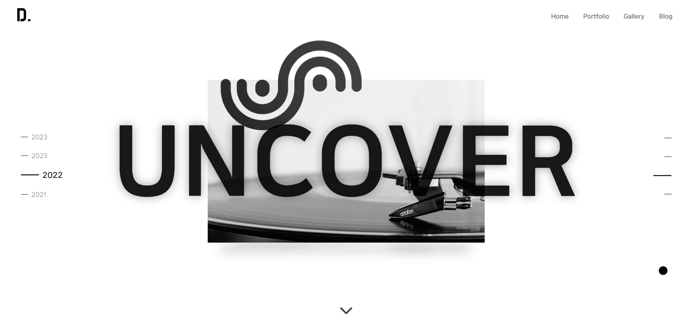</p>

<p align="center">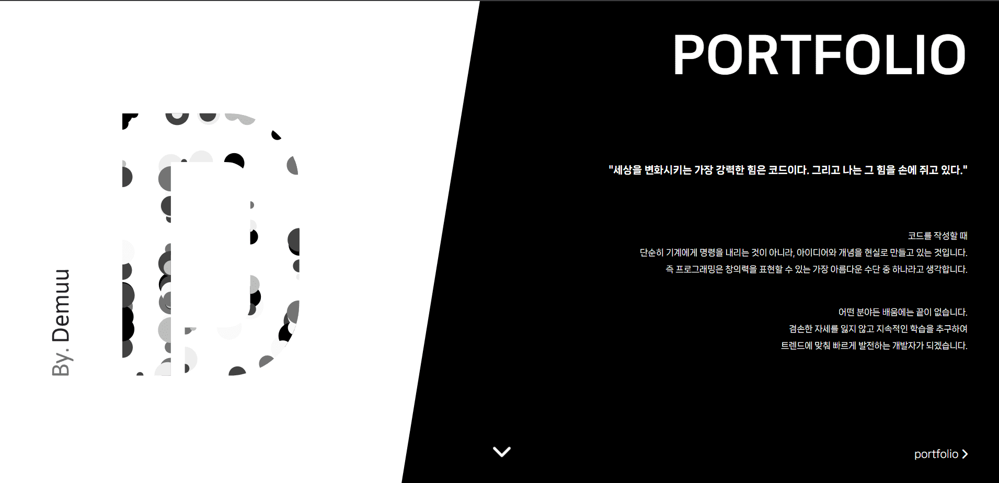</p>

<p align="center">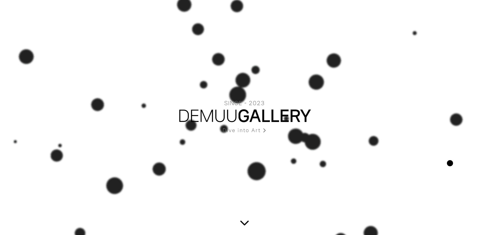</p>

<p align="center">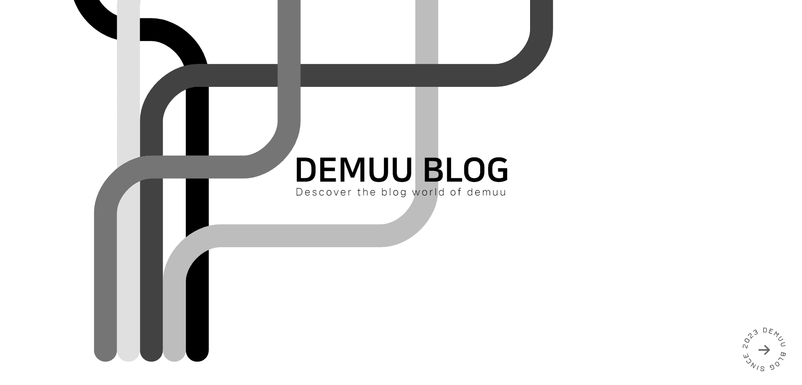</p>

<p align="center">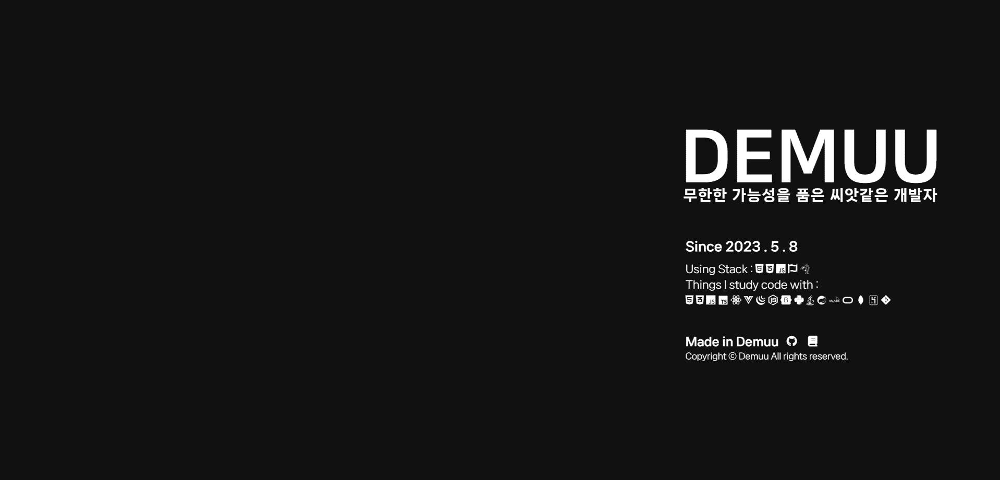</p>

<div class="cl4"></div>

위처럼 총 5개의 섹션을 나누어

1번째는 프로젝트

2번째는 포트폴리오 페이지

3번째는 갤러리 페이지

4번째는 블로그 페이지

5번째는 간단하게 나를 설명하는 글을 작성했다.

<div class="cl3"></div>

### 최적화

우선 home 페이지는 풀 페이지의 기능(스크롤 시 한 섹션 씩 이동)을 적용해

사용자가 보는 섹션의 js를 차례대로 실행되도록 만들었다.

<div class="cl3"></div>

이미지는 해상도가 높고 크기가 커 용량을 많이 차지해 렌더링에 부담이 많이 되어

우선 **이미지 해상도를 한 단계 낮추고 압축 후 webp 확장자로 변환해 용량을 약 60% 줄였다.**

<div class="cl3"></div>

마지막으로 폰트는 제목 폰트 하나, 본문 폰트 두개로 선택하여 사용자가 접속할 때 다운로드 할 요소를 최소화 하였다.

<br>

<br>

## 2. Portfolio

<p align="center">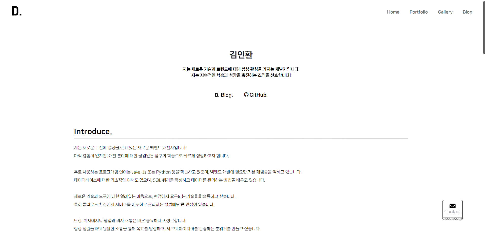</p>

<p align="center">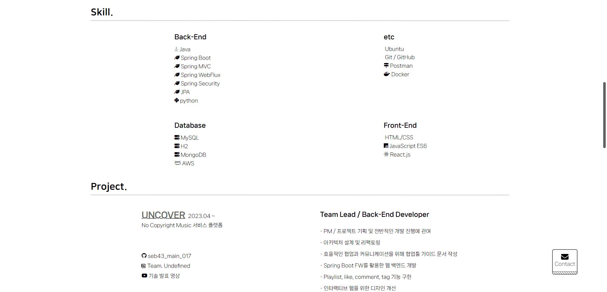</p>

<p align="center">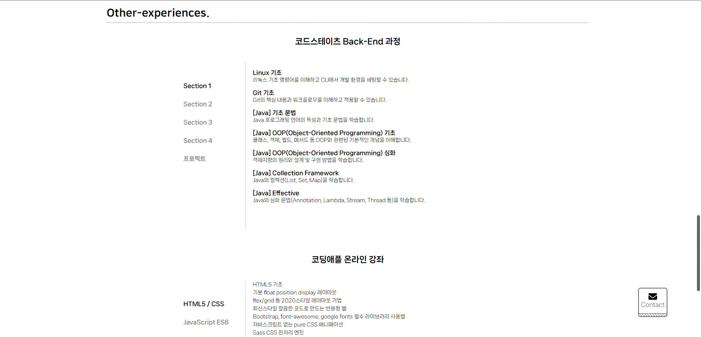</p>

<p align="center">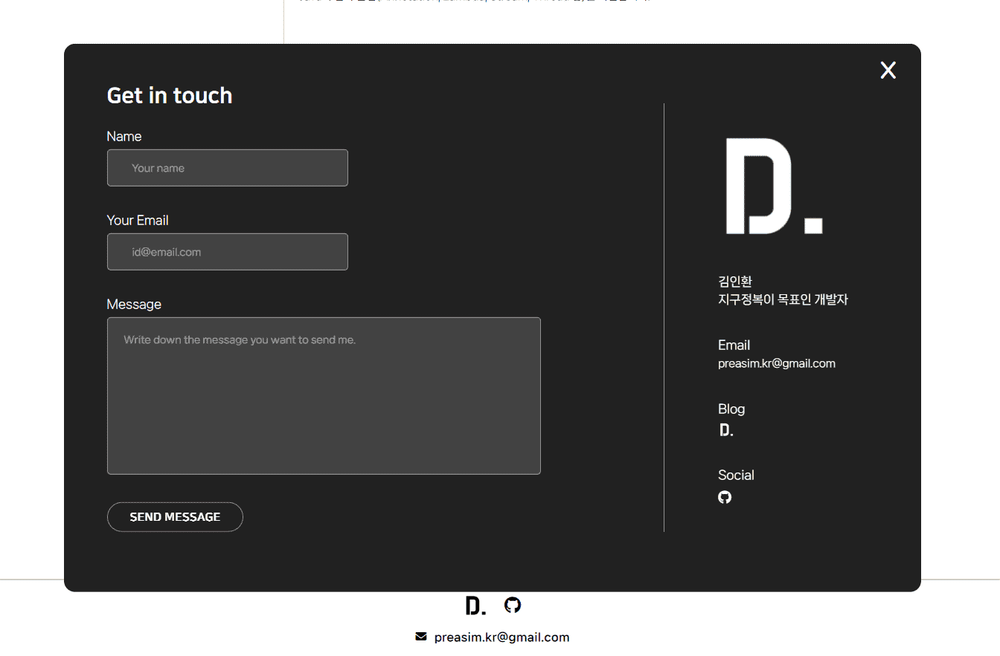</p>

<div class="cl4"></div>

포트폴리오 페이지에서는 간단한 자기소개, 스킬, 프로젝트, 그동안 배웠던 커리큘럼 순서로 만들었으며,

오른쪽 하단의 Contact 버튼을 누르면 바로 이메일을 보낼 수 있도록 제작했다.

<div class="cl3"></div>

### 최적화

이력서는 여러 사람들이 보고 나를 평가하는 페이지인 만큼 동적인 요소는 최소화 했고

최대한 심플하고 간결하게 제작했다

<div class="cl3"></div>

성능이 낮은 기기에서도 느리거나 렉이 없도록 부하가 걸리는 요소들은 배제했고

pc, mobile 페이지를 따로 분리하지 않고 하나의 페이지에서 반응형으로 제작했다.

<div class="cl3"></div>

다른 페이지에서도 사용하지만 포트폴리오 페이지에서 가장 많이 사용하는 fontawesome은

cdn, 이나 all.css 파일을 사용하지 않고 직접 페이지에서 **사용중인 아이콘들만 가져와** 

**따로 css 파일을 만들어서 110kb 에서 6kb 까지 용량을 낮췄다.**

<div class="cl2"></div>

## 3. Gallery

<p align="center">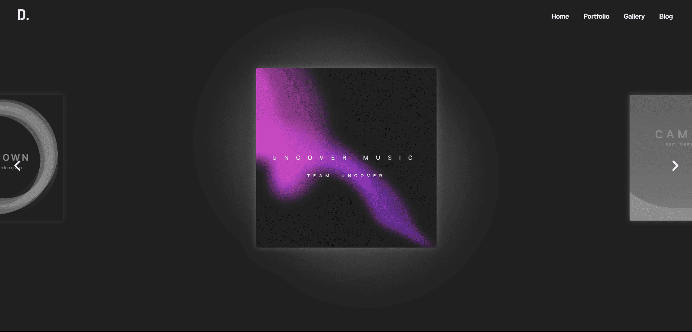</p>

<p align="center">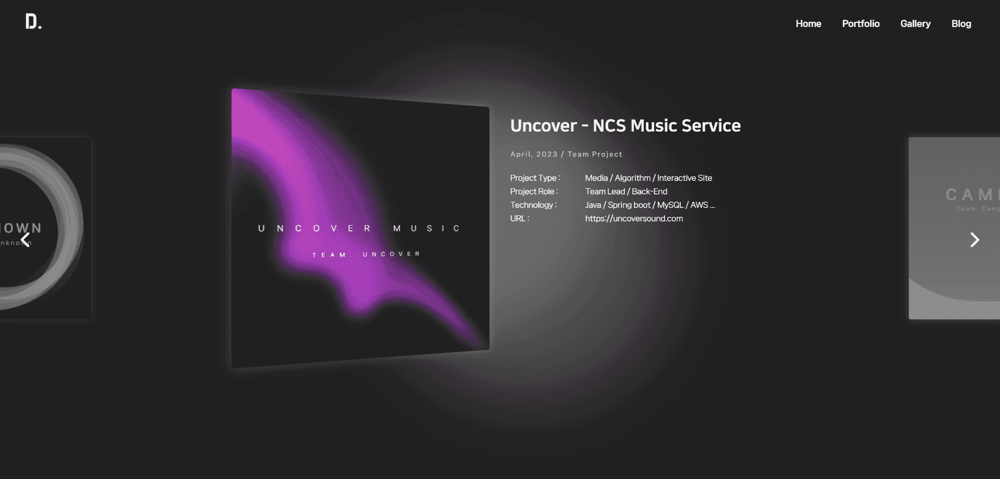</p>

<p align="center">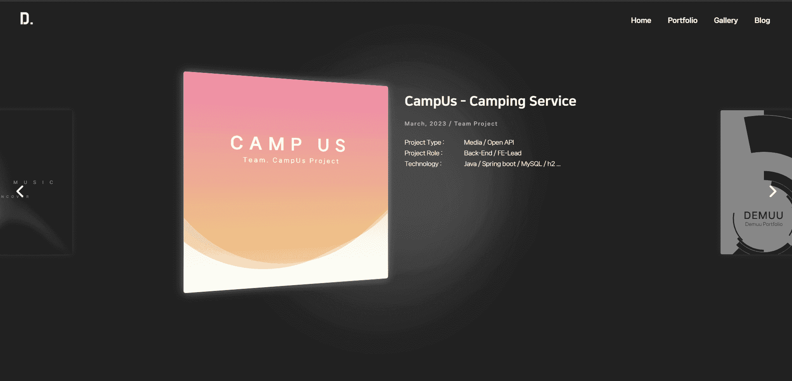</p>

<div class="cl4"></div>

갤러리 페이지는 여러 프로젝트들을 전시된 것처럼 볼 수 있게 만들었으며

간략한 설명과 내가 담당한 포지션 사용 스택 등을 볼 수 있게 제작했다.

<div class="cl3"></div>

프로젝트를 클릭하면 그 프로젝트에 해당하는 포트폴리오를 볼 수 있도록 했다.

(추후에 내 개발 인생이 담긴 사진들도 볼 수 있게 만들 생각이다.)

<div class="cl3"></div>

### 최적화

갤러리 페이지는 기기에 부하가 가장 많이 걸리는 페이지였다 

<div class="cl3"></div>

그래서 우선 uncover 배너는 수많은 Dom을 직접 회전시켜 만드는 애니메이션이라

화면 녹화 후 **동영상으로 교체**를 하였고 

<div class="cl3"></div>

가운데에 있는 배너를 제외하고 **다른 배너들은 모두 애니메이션이 작동 중지** 되도록 만들었다.

<div class="cl3"></div>

가장 아쉬운 건 아직도 성능이 낮은 기기에서는 렉이 유발되어

입체감이 있게 보이게 하기 위해 넣었던 **반사효과를 삭제**했다.

```css
/* 반사효과는 렌더링 부하 문제로 성능 낮은 기기에서 사용 불가 */
-webkit-box-reflect: below 0vw -webkit-gradient(linear, left top, left bottom, from(transparent), color-stop(0.65, transparent), to(rgba(255, 255, 255, 0.4)));
```

<div class="cl3"></div>

이 외에도 빠른 로드를 위해 home, gallery를 한 페이지에서 pc, 태블릿, 모바일에

반응형으로 제작하는게 아닌 **pc / 태블릿, 모바일 페이지를 따로 만들었다.**

<div class="cl2"></div>

## 후기

첨에는 가벼운 마음으로 한 달 안에 완성될 줄 알았던 프로젝트가

시간이 많이 지연돼서 두 달 반이 걸려 완성되었다.


<div class="cl3"></div>

코딩하는 시간도 생각보다 길었지만

크게 디자인, 최적화하는 시간이 너무 길게 걸렸다.

<div class="cl3"></div>

특히 최적화는 내가 인터랙티브 웹을 만들어본 게 처음이라 

성능이 낮은 기기에서 잘 작동이 되는가?를 생각하지도 않고 시작한 게 문제였다.

<div class="cl3"></div>

만들다 보니 여러 기기에서 테스트를 했을 때 문제가 생겼고 뒤늦게 최적화 작업을 하기 시작했다.

프로젝트 진행 기간은 계획보다 많이 늦어졌지만.

이 덕분에 최적화의 필요성과 어떤 부분에서 렌더링 지연과 부하가 발생하는지 알게 되었다.

<div class="cl3"></div>

**GitHub**. **[Demuu](https://github.com/Preasim/Demuu)** &nbsp; /
**[홈페이지 바로가기](http://demuu.dothome.co.kr/main-page/index.html)**

<div class="cl2"></div>

<div class="callout cImpact">
  <div class="callout-in">
    <h2>Portfolio 프로젝트와 관련된 포스트들</h2>
    <p style="padding-top: 16px;"><a href="https://preasim.github.io/52">포트폴리오 웹 제작 회고 ></a></p>
    <p><a href="https://preasim.github.io/51">JS에서 이메일 보내기 ></a></p>
    <p><a href="https://preasim.github.io/50">cdn끼리 충돌 날 때 해결법 ></a></p>
    <p><a href="https://preasim.github.io/49">스크롤 시 한 섹션씩 이동 ></a></p>
    <p><a href="https://preasim.github.io/48">JS으로  Include 사용하기! ></a></p>
    <p><a href="https://preasim.github.io/47">자동 무한 이미지 슬라이드 구현 ></a></p>
  </div>
</div>