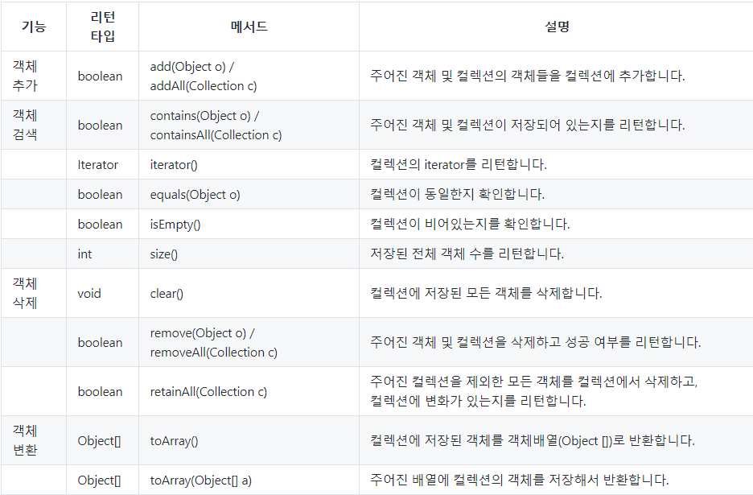
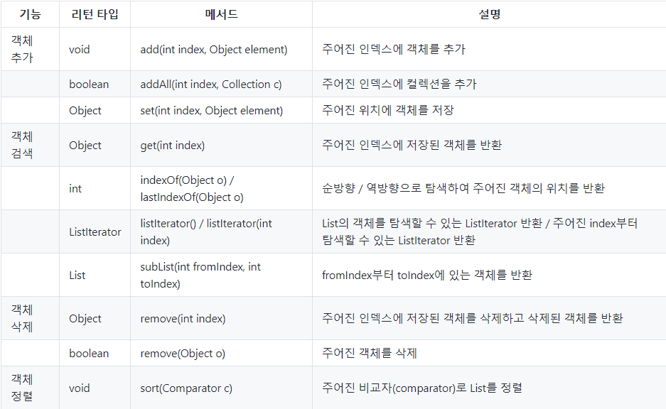
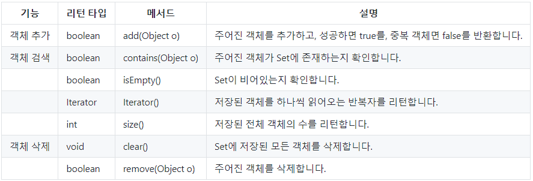
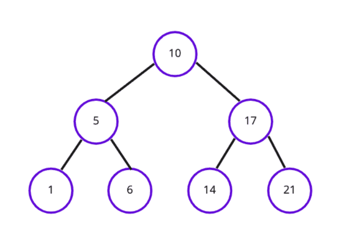
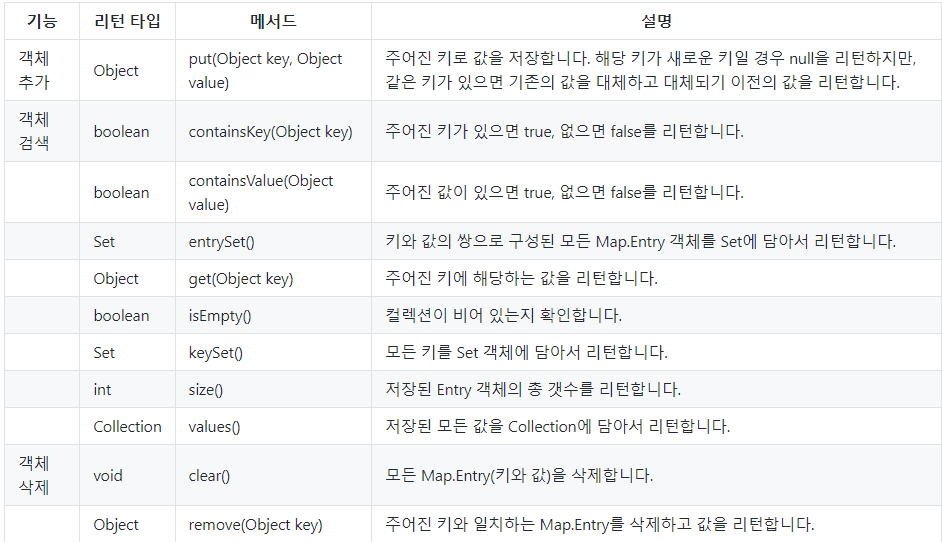
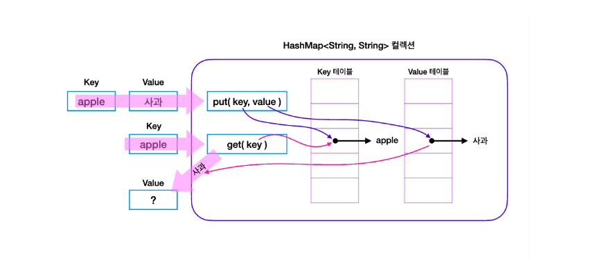

자바 복습 및 정리 6P

<div class="cl1"></div>

## 열거형 (Enum)

자바에서 상수를 정의하기 위한 특별한 데이터 타입.

열거형은 연관된 상수 그룹을 정의하고 사용할 때 코드의 가독성과 안정성을 향상시키는 데 도움을 준다.

<div class="cl3"></div>

**열거형 선언**

```java
enum Day {
    SUNDAY, MONDAY, TUESDAY, WEDNESDAY, THURSDAY, FRIDAY, SATURDAY
}
```

<div class="cl3"></div>

**열거형 변수**

열거형 변수는 해당 열거형의 상수 중 하나를 가질 수 있다.

```java
Day today = Day.SUNDAY;
```

<div class="cl3"></div>

**열거형 메서드와 값 접근**

```java
System.out.println(today);       // "SUNDAY"
System.out.println(today.name()); // "SUNDAY"
System.out.println(today.ordinal()); // 0
```

<div class="cl3"></div>

**switch문과 열거형**

```java
switch (today) {
    case MONDAY:
        System.out.println("It's Monday!");
        break;
    case SUNDAY:
        System.out.println("It's Sunday!");
        break;
    // ...
}
```

<div class="cl3"></div>

**열거형 메서드 추가**

열거형은 추가 메서드와 필드를 가질 수 있으며, 각 상수마다 다르게 구현할 수 있다.

```java
enum Status {
    PENDING("Waiting for approval"),
    APPROVED("Approved and ready"),
    REJECTED("Not approved");

    private final String description;

    Status(String description) {
        this.description = description;
    }

    public String getDescription() {
        return description;
    }
}
```

<div class="cl1"></div>

## 제네릭 (Generic)

컬렉션 클래스, 메서드, 인터페이스 등을 설계할 때 타입을 파라미터로 지정하여 코드의 재사용성과 타입 안정성을 높이기 위한 기능이다.

<div class="cl3"></div>

**타입 매개변수 (Type Parameter)**

제네릭을 사용할 때, 타입 매개변수를 정의하여 어떤 타입의 객체를 다룰 것인지를 지정한다.

타입 매개변수는 보통 대문자 알파벳으로 표현하며, 관례적으로 E (Element), T (Type), K (Key), V (Value) 등을 많이 사용한다.

<div class="cl3"></div>

**타입 안정성 (Type Safety)**

제네릭을 사용하면 컴파일 시에 타입 불일치 오류를 미리 검출할 수 있어, 런타임 시에 발생할 수 있는 예외를 줄일 수 있다.

<div class="cl3"></div>

**컬렉션 클래스에서의 활용**

컬렉션 프레임워크(ArrayList, HashMap 등)에서 제네릭을 활용하여 타입 안정성을 확보하고 형변환을 줄일 수 있다.

<div class="cl3"></div>

**메서드에서의 활용**

제네릭 메서드를 정의하여 다양한 타입의 데이터를 처리할 수 있으며, 코드 재사용성을 높일 수 있다.

<div class="cl4"></div>

```java
public class MyGenericClass<T> {
    private T value;

    public MyGenericClass(T value) {
        this.value = value;
    }

    public T getValue() {
        return value;
    }
}

MyGenericClass<Integer> integerObj = new MyGenericClass<>(42);
MyGenericClass<String> stringObj = new MyGenericClass<>("Hello, Generics!");

System.out.println(integerObj.getValue()); // 42
System.out.println(stringObj.getValue());  // "Hello, Generics!"
```

```java
public class GenericUtils {
    public static <T> void printArray(T[] array) {
        for (T item : array) {
            System.out.print(item + " ");
        }
        System.out.println();
    }
}

Integer[] intArray = {1, 2, 3, 4, 5};
String[] strArray = {"apple", "banana", "cherry"};

GenericUtils.printArray(intArray); // 1 2 3 4 5
GenericUtils.printArray(strArray); // "apple" "banana" "cherry"
```

```java
public class Pair<T, U> {
    private T first;
    private U second;

    public Pair(T first, U second) {
        this.first = first;
        this.second = second;
    }

    public T getFirst() {
        return first;
    }

    public U getSecond() {
        return second;
    }

    public void setFirst(T first) {
        this.first = first;
    }

    public void setSecond(U second) {
        this.second = second;
    }
}

Pair<Integer, String> pair1 = new Pair<>(42, "Hello");
Pair<Double, Boolean> pair2 = new Pair<>(3.14, true);

System.out.println(pair1.getFirst() + ", " + pair1.getSecond()); // 42, "Hello"
System.out.println(pair2.getFirst() + ", " + pair2.getSecond()); // 3.14, true

pair1.setFirst(100);
pair1.setSecond("World");

System.out.println(pair1.getFirst() + ", " + pair1.getSecond()); // 100, "World"
```

<div class="cl2"></div>

### 제한된 제네릭 클래스

basket 클래스를 인스턴스화할 때 타입으로 Flower 클래스의 하위 클래스만 지정하도록 제한된다.

```java
class Flower { ... }
class Rose extends Flower { ... }
class RosePasta { ... }

class Basket<T extends Flower> {
    private T item;
	
		...
}

class Main {
    public static void main(String[] args) {
    
        // 인스턴스화 
        Basket<Rose> roseBasket = new Basket<>();
        Basket<RosePasta> rosePastaBasket = new Basket<>(); // 에러
    }
}
```

<div class="cl3"></div>

특정 인터페이스를 구현한 클래스만 타입으로 지정할 수 있도록 제한할 수도 있다.

이 경우에도 동일하게 extends 키워드를 사용한다

```java
interface Plant { ... }
class Flower implements Plant { ... }
class Rose extends Flower implements Plant { ... }

class Basket<T extends Plant> {
    private T item;
	
		...
}

class Main {
    public static void main(String[] args) {

        // 인스턴스화 
        Basket<Flower> flowerBasket = new Basket<>();
        Basket<Rose> roseBasket = new Basket<>();
    }
}
```

<div class="cl3"></div>

만약, 특정 클래스를 상속받으면서 동시에 특정 인터페이스를 구현한 클래스만 타입으로 지정할 수 있도록 제한하려면 &를 사용하여 코드를 작성하면 된다.

```java
interface Plant { ... }
class Flower implements Plant { ... }
class Rose extends Flower implements Plant { ... }

class Basket<T extends Flower & Plant> { // (1)
    private T item;
	
		...
}

class Main {
    public static void main(String[] args) {

        // 인스턴스화 
        Basket<Flower> flowerBasket = new Basket<>();
        Basket<Rose> roseBasket = new Basket<>();
    }
}
```

<div class="cl2"></div>

### 제네릭 메서드

클래스 내부의 특정 메서드만 제네릭으로 선언할 수 있다.

```java
class Basket {
    ...
    public <T> void add(T element) {
        ...
    }
}
```

<div class="cl3"></div>

제네릭 메서드의 타입 매개 변수는 제네릭 클래스의 타입 매개 변수와 별개이다.

```java
class Basket<T> {                    // 1 : 여기에서 선언한 타입 매개 변수 T와 
    ...
    public <T> void add(T element) { // 2 : 여기에서 선언한 타입 매개 변수 T는 서로 다른 것.
        ...
    }
}

Basket<String> basket = new Bakset<>(); // 위 예제의 1의 T가 String으로 지정됩니다. 
basket.<Integer>add(10);                // 위 예제의 2의 T가 Integer로 지정됩니다. 
basket.add(10);                         // 타입 지정을 생략할 수도 있다.
```

<div class="cl3"></div>

또한, 클래스 타입 매개 변수와 달리 메서드 타입 매개 변수는 static 메서드에서도 선언할 수 있다.

```java
class Basket {
		...
		static <T> int setPrice(T element) {
				...
		}
}
```

<div class="cl2"></div>

### 와일드카드

다양한 제네릭 타입을 처리하고, 유연성을 높이기 위한 기능이다.

와일드카드는 어떠한 타입으로든 대체될 수 있는 타입 파라미터를 의미하며, 

? 기호를 사용하여 표시하고 제네릭 타입을 보다 일반적으로 다룰 때 사용된다.

<div class="cl4"></div>

```java
public static void printList(List<?> list) {
    for (Object element : list) {
        System.out.println(element);
    }
}
```

printList 메서드는 List를 인자로 받으며, 그 안에 어떤 타입의 요소가 들어있던지 상관하지 않고 출력할 수 있다.

<div class="cl3"></div>

```java
public class Box<T> {
    private T value;

    public Box(T value) {
        this.value = value;
    }

    public T getValue() {
        return value;
    }

    public void setValue(T value) {
        this.value = value;
    }
}

public static void main(String[] args) {
    Box<?> box = new Box<>("Hello, Generics!");
    Object value = box.getValue(); // 와일드카드를 사용하면 모든 타입을 받을 수 있음
    System.out.println(value);
}
```

Box 클래스에서 와일드카드를 사용하면 Box 객체를 생성할 때 어떤 타입의 값을 저장해도 상관 없다.

<div class="cl3"></div>

일반적으로 와일드카드는 extends와 super 키워드를 조합하여 사용한다.

```java
// T와 T를 상속받는 하위 클래스 타입만 타입 파라미터로 받을 수 있도록 지정한다.
<? extends T>

// T와 T의 상위 클래스만 타입 파라미터로 받을 수 있도록 지정한다.
<? super T>
```

<div class="cl2"></div>

### 예외 처리 (Exception Handling)

실행 중에 발생하는 예기치 않은 상황을 다루는 프로그래밍 기술

프로그램이 비정상적으로 종료되는 것을 방지하고, 안정성을 확보하기 위해 중요하다.

<div class="cl3"></div>

**try-catch 블록**

```java
try {
    // 예외가 발생할 수 있는 코드
} catch (ExceptionType1 e1) {
    // 예외 처리 코드
} catch (ExceptionType2 e2) {
    // 예외 처리 코드
} finally {
    // 예외 발생 여부와 상관없이 항상 실행되는 코드
}
```

<div class="cl3"></div>

**throws 키워드**

```java
public class FileReader {
    public String readFromFile(String filePath) throws IOException {
        // 파일을 읽는 코드
        // IOException은 파일 입출력 예외를 나타내는 예외 클래스이다.
        return "파일 내용";
    }
}

public class FileProcessor {
    public void processFile(String filePath) {
        FileReader reader = new FileReader();
        try {
            String content = reader.readFromFile(filePath);
            // 파일 내용을 처리하는 코드
        } catch (IOException e) {
            System.err.println("파일을 읽는 동안 오류가 발생했습니다: " + e.getMessage());
        }
    }
}
```

<div class="cl3"></div>

**throw 키워드**

```java
public class CustomException extends Exception {
    public CustomException(String message) {
        super(message);
    }
}

public class PositiveNumberChecker {
    public int getSquareRoot(int number) throws CustomException {
        if (number < 0) {
            throw new CustomException("음수는 처리할 수 없습니다.");
        }
        return (int) Math.sqrt(number);
    }
}
```

<div class="cl2"></div>

### 컴파일 에러, 런타임 에러

<div class="cl4"></div>

**컴파일 에러**

소스 코드를 컴파일할 때 발생하는 오류이다.

주로 문법 오류나 타입 오류와 관련이 있다.

컴파일러가 코드를 파싱하고 분석할 때 발생하는 문제로, 프로그램 실행 이전에 발견된다.

```java
public class CompileErrorExample {
    public static void main(String[] args) {
        int x = 10;
        System.out.println("Hello, World!")
    }
}
// 세미콜론이 빠져있어 컴파일 에러 발생
```

<div class="cl3"></div>

**런타임 에러**

프로그램을 실행하는 동안 발생하는 오류이다.

문법적으로 유효한 코드일 수 있으며, 컴파일러가 확인할 수 없는 런타임 시점의 문제로 인해 발생한다.

일반적으로 프로그램 실행 중에 입력 데이터, 메모리 부족, 배열 범위를 벗어난 접근 등과 관련이 있다.

```java
public class RuntimeErrorExample {
    public static void main(String[] args) {
        int[] numbers = {1, 2, 3};
        System.out.println(numbers[4]); // 배열 범위를 벗어나는 접근
    }
}
```

<div class="cl1"></div>

## 컬렉션 프레임워크 (Collection Framework)

데이터 그룹(또는 컬렉션)을 다루기 위한 표준화된 방법을 제공하는 라이브러리이다.

데이터 구조, 데이터 그룹을 조작하는 알고리즘, 검색 및 정렬 등을 제공하여 데이터를 쉽게 다룰 수 있게 도와준다.

컬렉션 프레임워크는 java.util 패키지에 정의되어 있다.

<div class="cl3"></div>

**인터페이스 (Interfaces)**

컬렉션 프레임워크의 핵심은 다양한 종류의 데이터 그룹을 나타내는 인터페이스이다.

대표적으로 List, Set, Map 인터페이스 등이 있다.

<div class="cl3"></div>

**구현 클래스 (Implementations)**

각 인터페이스는 여러 가지 구현 클래스를 가진다.

이러한 구현 클래스는 각각 다른 데이터 구조와 동작을 제공한다.

예를 들어, List 인터페이스의 구현 클래스로 ArrayList, LinkedList, Vector 등이 있다.

<div class="cl3"></div>

**알고리즘 및 유틸리티 메서드**

컬렉션 프레임워크는 데이터 그룹을 조작하는 데 유용한 다양한 알고리즘과 메서드를 제공한다.

이러한 메서드를 사용하면 데이터의 추가, 삭제, 검색, 정렬 등을 쉽게 수행할 수 있다.

<div class="cl3"></div>

**제네릭 (Generics)**

컬렉션 프레임워크는 제네릭을 지원하여 타입 안전성을 제공한다.

이것은 컬렉션에 저장되는 요소의 데이터 타입을 컴파일 시점에 검사할 수 있도록 해준다.

<div class="cl3"></div>

**동기화 (Synchronization)**

몇몇 컬렉션 클래스는 동기화를 지원하여 멀티스레딩 환경에서 안전하게 사용할 수 있게 한다.

동기화된 컬렉션은 여러 스레드 간에 데이터 공유를 관리하는데 도움을 준다.

<div class="cl2"></div>

### 컬렉션 인터페이스의 메서드들

<p align="center"></p>

<div class="cl2"></div>

### List

데이터의 순서가 유지되며, 중복 저장이 가능한 컬렉션을 구현하는 데에 사용된다.

ArrayList, Vector, stack, LinkedList 등이 List 인터페이스를 구현한다.

<div class="cl3"></div>

List 인터페이스에서 공통으로 사용할 수 있는 메서드

컬렉션 인터페이스의 메서드 또한 상속받아 사용할 수 있다.

<p align="center"></p>

<div class="cl3"></div>

**ArrayList**

배열 기반의 List 구현으로, 요소의 접근 및 검색이 빠르고 메모리를 효율적으로 사용한다.

크기를 동적으로 조정할 수 있다.

<div class="cl4"></div>

ArrayList에 객체를 순차적으로 저장할 때는 데이터를 이동하지 않아도 되므로 작업 속도가 빠르지만,

중간에 위치한 객체를 추가 및 삭제할 때는 데이터 이동이 많이 일어나므로 속도가 저하된다.

반면 검색(읽기) 측면에서는 유리하다.

<div class="cl4"></div>

정리하자면

데이터를 순차적으로 추가하거나 삭제하는 경우, 데이터를 불러오는 경우는 효율적이고,

중간에 데이터를 추가하거나, 중간에 위치하는 데이터를 삭제하는 경우 효율적이지 못하다.

<div class="cl3"></div>

**LinkedList**

이중 연결 리스트 기반의 List 구현으로, 요소의 삽입 및 삭제가 빠르며, 순차 접근 속도는 느리다.

크기를 동적으로 조정할 수 있다.

<div class="cl4"></div>

데이터를 중간에 추가하거나 삭제하는 경우, ArrayList보다 빠른 속도를 보여주지만

검색에 있어서는 ArrayList보다 상대적으로 속도가 느리다.

<div class="cl3"></div>

**Vector**

ArrayList와 유사한 배열 기반의 List 구현이다.

Vector는 thread-safe 하게 동작하므로 멀티스레드 환경에서 사용된다.

그러나 성능 면에서는 ArrayList보다 떨어질 수 있다.

<div class="cl3"></div>

**Stack**

스택 자료 구조를 구현한 List이다.

후입선출 방식으로 요소를 추가하고 삭제한다.

<div class="cl3"></div>

Vector와 Stack은 오래된 클래스이며, 보다 현대적인 ArrayList나 LinkedList를 사용한 것이 권장된다.

<div class="cl4"></div>

```java
import java.util.ArrayList;
import java.util.List;

public class ListExample {
    public static void main(String[] args) {
        // ArrayList 생성
        List<String> names = new ArrayList<>();

        // 요소 추가
        names.add("Alice");
        names.add("Bob");
        names.add("Charlie");

        // 요소 접근
        System.out.println("첫 번째 요소: " + names.get(0));

        // 요소 수정
        names.set(1, "Eve");

        // 요소 삭제
        names.remove(2);

        // 모든 요소 출력
        for (String name : names) {
            System.out.println(name);
        }
    }
}
```

<div class="cl2"></div>

### Set

데이터의 순서가 유지되지 않으며, 중복 저장이 불가능한 컬렉션을 구현하는 데에 사용된다.

HashSet, TreeSet, LinkedHashSet이 Set 인터페이스를 구현한다.

<div class="cl3"></div>

Set은 중복 요소를 제거하고 고유한 요소를 관리해야 할 때 유용하다.

주로 집합 연산 (교집합, 합집합, 차집합 등)을 수행할 때 사용하거나, 중복된 항목을 제거하고 유일한 값을 추출할 때 활용된다.

<div class="cl4"></div>

<p align="center"></p>

<div class="cl3"></div>

**HashSet**

Set 인터페이스를 구현한 가장 대표적인 컬렉션 클래스이다.

Set 인터페이스의 특성을 그대로 물려받으므로 중복된 값을 허용하지 않으며, 저장 순서를 유지하지 않는다.

<div class="cl4"></div>

해시 테이블 구조 : 해시 테이블 기반으로 요소를 저장한다.

이는 요소를 빠르게 검색할 수 있게 해주며, 검색, 삽입, 삭제 연산이 평균적으로 상수 시간(시간 복잡도 O(1))에 수행된다.

<div class="cl4"></div>

순서 유지하지 않음 : 요소의 저장 순서를 유지하지 않는다.

따라서 요소가 저장된 순서대로 순회되지 않는다.

<div class="cl4"></div>

동기화 되지 않음 : 스레드 간 동기화를 지원하지 않으므로, 멀티스레드 환경에서 안정성에 주의해야 한다.

```java
public class Main {
    public static void main(String[] args) {

        // HashSet 생성
        HashSet<String > languages = new HashSet<String>();

        // HashSet에 객체 추가
        languages.add("Java"); 
        languages.add("Python");
        languages.add("Javascript");
        languages.add("C++");
        languages.add("Kotlin");
        languages.add("Ruby");
        languages.add("Java"); // 중복

        // 반복자 생성하여 it에 할당
        Iterator it = languages.iterator();

        // 반복자를 통해 HashSet을 순회하며 각 요소들을 출력
        while(it.hasNext()) {
            System.out.println(it.next());
        }
    }
}

// 출력 (Java는 두번 추가 했지만 하나만 입력됬다.)
// C++
// Java
// Kotlin
// Python
// Ruby
// Javascript
```

<div class="cl3"></div>

**TreeSet**

이진 탐색 트리 형태로 데이터를 저장한다.

데이터의 중복 저장을 허용하지 않고 저장 순서를 유지하지 않는 Set 인터페이스의 특징은 그대로 유지된다.

<div class="cl3"></div>

이진 탐색 트리란 하나의 부모 노드가 최대 두 개의 자식 노드와 연결되는 이진트리의 일종으로, 정렬과 검색에 특화된 자료 구조이다.

이진 탐색 트리는 모든 왼쪽 자식의 값이 루트나 부모보다 작고, 모든 오른쪽 자식의 값이 루트나 부모보다 큰 값을 가지는 특징이 있다.

<div class="cl4"></div>

<p align="center"></p>

<div class="cl3"></div>

```java
public class TreeSetExample {
    public static void main(String[] args) {

        // TreeSet 생성
        TreeSet<String> workers = new TreeSet<>();

        // TreeSet에 요소 추가
        workers.add("Lee Java");
        workers.add("Park Hacker");
        workers.add("Kim Coding");

        System.out.println(workers);
        System.out.println(workers.first());
        System.out.println(workers.last());
        System.out.println(workers.higher("Lee"));
        System.out.println(workers.subSet("Kim", "Park"));
    }

// 출력 (자동으로 사전 편찬 순에 따라 오름차순으로 정렬됨)
// [Kim Coding, Lee Java, Park Hacker]
// Kim Coding
// Park Hacker
// Lee Java
// [Kim Coding]
```

<div class="cl2"></div>

### Map

key와 value의 쌍으로 데이터를 저장하는 컬렉션을 구현하는 데에 사용된다.

데이터의 순서가 유지되지 않으며, 키는 값을 식별하기 위해 사용되므로 중복 저장이 불가능하지만, 값은 중복 저장이 가능하다.

HashMap, HashTable, TreeMap, SortedMap 등이 인터페이스를 구현한다.

<div class="cl4"></div>

<p align="center"></p>

<div class="cl3"></div>

**HashMap**

Map 인터페이스를 구현한 대표적인 클래스이다.

HashMap은 아래 그림과 같이 키와 값으로 구성된 객체를 저장하는데, 이 객체를 Entry 객체라고 한다.

<p align="center"></p>

HashMap은 해시 함수를 통해 키와 값이 저장되는 위치를 결정하므로, 사용자는 그 위치를 알 수 없고, 삽입되는 순서와 위치 또한 관계가 없다.

또한, Hashing을 사용하기 때문에 많은 양의 데이터를 검색하는데 있어서 뛰어난 성능을 보인다.

<div class="cl4"></div>

```java
public class HashMapExample {
    public static void main(String[] args) {

	    // HashMap 생성
        HashMap<String, Integer> map = new HashMap<>();

        // Entry 객체 저장
        map.put("피카츄", 85);
        map.put("꼬부기", 95);
        map.put("야도란", 75);
        map.put("파이리", 65);
        map.put("피존투", 15);

        // 저장된 총 Entry 수 얻기
        System.out.println("총 entry 수: " + map.size());

        // 객체 찾기
        System.out.println("파이리 : " + map.get("파이리"));
				
        // key를 요소로 가지는 Set을 생성 -> 아래에서 순회하기 위해 필요합니다. 
        Set<String> keySet = map.keySet();

        // keySet을 순회하면서 value를 읽어옵니다. 
        Iterator<String> keyIterator = keySet.iterator();
        while(keyIterator.hasNext()) {
            String key = keyIterator.next();
            Integer value = map.get(key);
            System.out.println(key + " : " + value);
        }

        // 객체 삭제
        map.remove("피존투");

        System.out.println("총 entry 수: " + map.size());

        // Entry 객체를 요소로 가지는 Set을 생성 -> 아래에서 순회하기 위해 필요합니다. 
        Set<Map.Entry<String, Integer>> entrySet = map.entrySet();

        // entrySet을 순회하면서 value를 읽어옵니다. 
        Iterator<Map.Entry<String, Integer>> entryIterator = entrySet.iterator();
        while(entryIterator.hasNext()) {
            Map.Entry<String, Integer> entry = entryIterator.next();
            String key = entry.getKey(); // Map.Entry 인터페이스의 메서드
            Integer value = entry.getValue(); // Map.Entry 인터페이스의 메서드
            System.out.println(key + " : " + value);
        }

        // 객체 전체 삭제
        map.clear();
    }
}
```

<div class="cl3"></div>

**Hashtable**

HashMap과 내부 구조가 동일하며, 사용 방법 또한 매우 유사하다.

HashMap이 Hashtable의 새로운 버전이라고 이해할 수 있다.

<div class="cl4"></div>

HashMap은 스레드 간 동기화를 지원하지 않지만, Hashtable은 스레드 간 동기화를 지원한다.

HashMap은 null 값을 허용한다. Hashtable은 null 값을 허용하지 않는다.

<div class="cl4"></div>

일반적으로는 HashMap이 Hashtable보다 성능이 우수하다.

<div class="cl4"></div>

```java
public class HashtableExample {
    public static void main(String[] args){

        Hashtable<String, String> map = new Hashtable<String, String>();

        map.put("Spring", "345");
        map.put("Summer", "678");
        map.put("Fall", "91011");
        map.put("Winter", "1212");

        System.out.println(map);

        Scanner scanner = new Scanner(System.in);

        while (true) {
            System.out.println("아이디와 비밀번호를 입력해 주세요");
            System.out.println("아이디");
            String id = scanner.nextLine();

            System.out.println("비밀번호");
            String password = scanner.nextLine();

            if (map.containsKey(id)) {
                if (map.get(id).equals(password)) {
                    System.out.println("로그인 되었습니다.");
                    break;
                } 
                else System.out.println("비밀번호가 일치하지 않습니다. ");
            } 
            else System.out.println("입력하신 아이디가 존재하지 않습니다.");
        }
    }
}
```

<div class="cl3"></div>

### Iterator

컬렉션(Collection)을 순회하기 위한 일반적인 인터페이스이며,

특정한 종류의 컬렉션 자체가 아닌, 컬렉션을 순회하는 공통된 방법을 제공한다.

List, Set, Map등 다양한 종류의 컬렉션에서 사용할 수 있다.

<div class="cl4"></div>

```java
public interface Iterator<E> {
    boolean hasNext(); // 다음 요소가 있는지 확인
    E next();          // 다음 요소를 반환
    void remove();     // 현재 요소를 삭제 (optional)
}
```

<div class="cl3"></div>

hasNext()

다음 요소가 있는지 확인하는 메서드로, boolean 값을 반환한다.

<div class="cl3"></div>

next()

다음 요소를 반환하는 메서드로, E 타입의 요소를 반환한다.

이 메서드를 호출하면 커서가 다음 요소로 이동한다.

<div class="cl3"></div>

remove()

현재 요소를 삭제하는 메서드로, 일부 컬렉션에서는 지원되지 않을 수 있다.

이 메서들를 호출하면 현재 커서가 위치한 요소를 삭제한다.

<div class="cl4"></div>

```java
import java.util.ArrayList;
import java.util.Iterator;
import java.util.List;

public class IteratorExample {
    public static void main(String[] args) {
        List<String> fruits = new ArrayList<>();
        fruits.add("Apple");
        fruits.add("Banana");
        fruits.add("Cherry");

        // Iterator를 사용하여 리스트 순회
        Iterator<String> iterator = fruits.iterator();
        while (iterator.hasNext()) {
            String fruit = iterator.next();
            System.out.println(fruit);
        }
    }
}
```

