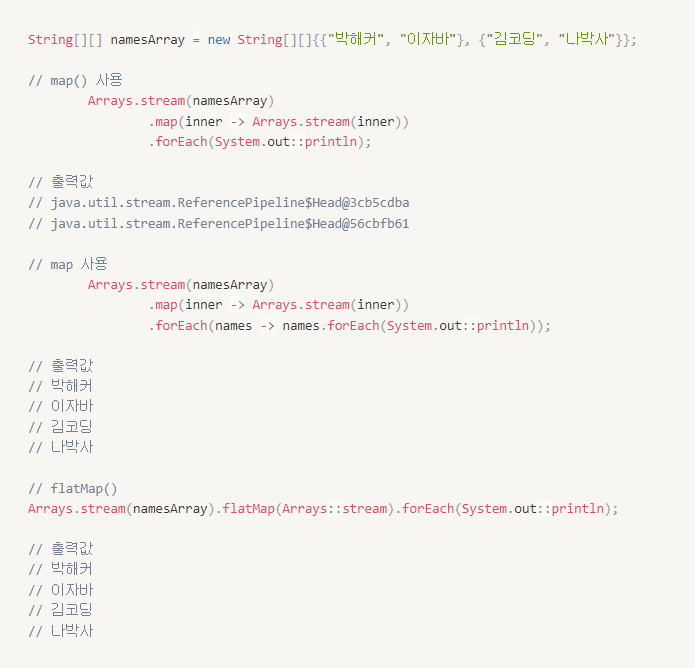
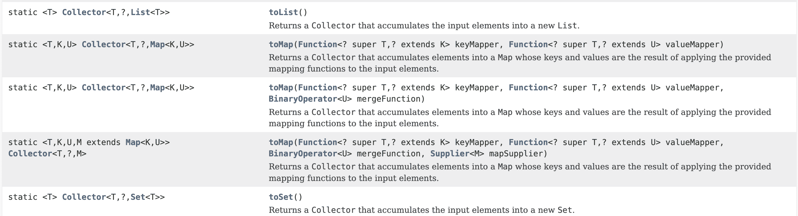

람다(함수형 인터페이스, 메서드 레퍼런스), 스트림(생성, 중간 연산, 최종 연산)

<div class="cl1"></div>

## 람다 (Lambda)

Java8부터 도입된 기능으로, 간결하게 익명 함수를 표현할 수 있도록 해주는 기능이다.

<div class="cl4"></div>

```java
(parameter) -> expression
```

<div class="cl3"></div>

**`(parameter)`**

메서드의 매개변수를 나타낸다.

매개변수가 없는 경우 빈 괄호를 사용할 수 있으며, 여러 매개변수가 있는 경우 괄호 안에 매개변수를 나열한다.

<div class="cl3"></div>

**`→`**

람다 화살표로 불리며, 매개변수와 메서드 본문을 구분한다.

<div class="cl3"></div>

**`expression`**

메서드의 본문을 나타낸다.

표현식이 한 줄인 경우 중괄호를 생략할 수 있으며, 여러 줄인 경우 중괄호 내부에 코드 블록을 작성한다.

<div class="cl4"></div>

```java
// 기존 메서드 표현 방식
void sayhello() {
  System.out.println("HELLO!")
}

//위의 코드를 람다식으로 표현한 식
() -> System.out.println("HELLO!") 
```

<div class="cl4"></div>

```java
List<String> names = Arrays.asList("Alice", "Bob", "Charlie");

// 람다 표현식을 사용하여 리스트의 요소를 출력
names.forEach(name -> System.out.println(name));
```

<div class="cl4"></div>

```java
int sum(int num1, int num2) {
  return num1 + num2;
}

(int num1, int num2) -> { // 반환타입과 메서드명 제거 + 화살표 추가
  return num1 + num2;
}
```

<div class="cl4"></div>

람다식에서는 반환타입과 이름을 생략할 수 있다.

따라서 종종 이름이 없는 함수, 즉 익명 함수(anonymous function)라 부르기도 한다.

<div class="cl3"></div>

```java
List<Integer> numbers = Arrays.asList(1, 2, 3, 4, 5, 6, 7, 8, 9, 10);

// 짝수만 필터링하고 제곱하여 새 리스트 생성
List<Integer> evenSquares = numbers.stream()
    .filter(n -> n % 2 == 0)
    .map(n -> n * n)
    .collect(Collectors.toList());

System.out.println(evenSquares); // [4, 16, 36, 64, 100]
```

<div class="cl4"></div>

```java
// 람다를 사용하여 새 스레드 실행
Thread thread = new Thread(() -> {
    for (int i = 0; i < 10; i++) {
        System.out.println("Thread: " + i);
    }
});

thread.start();
```

<div class="cl2"></div>

### 함수형 인터페이스

딱 하나의 추상 메서드만을 가지는 인터페이스를 말한다.

<div class="cl3"></div>

**추상메서드 하나만 갖고 있어야 한다.**

함수형 프로그래밍의 핵심 원칙 중 하나인 단일 추상 메서드 원칙을 지켜야 한다.

<div class="cl3"></div>

**@FunctionalInterface 어노테이션**

함수형 인터페이스를 정의할 때, 코드의 가독성을 높이고 실수를 줄이기 위해 @FunctionalInterface 어노테이션을 사용하는 것이 좋다.

이 어노테이션을 사용하면 해당 인터페이스가 함수형 인터페이스임을 명시적으로 나타낼 수 있다.

<div class="cl3"></div>

```java
@FunctionalInterface
interface Calculator {
    int calculate(int a, int b);
}
```

위의 Calculator 인터페이스는 하나의 추상 메서드 calculate 를 가지고 있으므로 함수형 인터페이스이다.

<div class="cl3"></div>

```java
Calculator add = (a, b) -> a + b;
Calculator subtract = (a, b) -> a - b;
```

위의 람다식은 Calculator 함수형 인터페이스의 추상 메서드 calculate 를 구현한 것이다.

<div class="cl4"></div>

함수형 인터페이스는 람다 표현식을 통해 익명 함수를 생성하고 전달하는데 주로 사용된다.

이를 통해 함수형 프로그래밍의 장점인 코드 간결성과 가독성을 활용할 수 있다.

<div class="cl3"></div>

```java
public class LamdaExample1 {
    public static void main(String[] args) {

        // 람다식 Object obj = (num1, num2) -> num1 + num2; 로 대체 가능
        Object obj = new Object() {
            int sum(int num1, int num2) {
                return num1 + num1;
            }
        };

        obj.sum(1, 2);
    }
}

// 출력 결과
// java: cannot find symbol
// symbol:   method sum(int,int)
// location: variable obj of type java.lang.Object
```

Object 클래스에는 sum이라는 메서드가 없으므로, Object 타입의 참조변수에 담는다고 하더라도 sum 메서드를 사용할 수 없다.

<div class="cl3"></div>

위 코드를 함수형 인터페이스를 적용한 방법이다.

```java
public class LamdaExample1 {
    public static void main(String[] args) {
        /* Object obj = new Object() {
            int sum(int num1, int num2) {
                return num1 + num1;
            }
        };
        */ 
        ExampleFunction exampleFunction = (num1, num2) -> num1 + num2;
        System.out.println(exampleFunction.sum(10,15));
}

@FunctionalInterface 
interface ExampleFunction {
    int sum(int num1, int num2);
}

// 출력값
// 25
```

<div class="cl2"></div>

### 메서드 레퍼런스

메서드를 가리키는 축약된 표현이다.

주로 함수형 인터페이스를 구현하는 메서드가 이미 존재할 때 사용된다.

<div class="cl3"></div>

메서드 레퍼런스는 **`::`** 연산자를 사용하여 표현한다.

```java
참조타입::메서드이름
```

<div class="cl3"></div>

**정적 메서드 참조**

```java
// 람다식을 메서드 레퍼런스로 변환
Function<Integer, Integer> square = x -> Math.pow(x, 2);
// 위 람다식과 동일한 동작을 하는 메서드 레퍼런스
Function<Integer, Integer> square = Math::pow;
```

<div class="cl3"></div>

**인스턴스 메서드 참조**

```java
// 람다식을 메서드 레퍼런스로 변환
Consumer<String> printer = str -> System.out.println(str);
// 위 람다식과 동일한 동작을 하는 메서드 레퍼런스
Consumer<String> printer = System.out::println;
```

<div class="cl3"></div>

**임의 객체의 인스턴스 메서드 참조**

```java
List<String> names = Arrays.asList("Alice", "Bob", "Charlie");
// 람다식을 메서드 레퍼런스로 변환
names.forEach(name -> System.out.println(name));
// 위 람다식과 동일한 동작을 하는 메서드 레퍼런스
names.forEach(System.out::println);
```

<div class="cl3"></div>

**예시**

```java
public class Calculator {
  public static int staticMethod(int x, int y) {
    return x + y;
  }

  public int instanceMethod(int x, int y) {
    return x * y;
  }
}
```

```java
import java.util.function.IntBinaryOperator;

public class MethodReferences {
  public static void main(String[] args) throws Exception {
    IntBinaryOperator operator;

    /*정적 메서드
    클래스이름::메서드이름
    */
    operator = Calculator::staticMethod;
    System.out.println("정적메서드 결과 : " + operator.applyAsInt(3, 5));

    /*인스턴스 메서드
    인스턴스명::메서드명
    */
		
    Calculator calculator = new Calculator();
    operator = calculator::instanceMethod;
    System.out.println("인스턴스 메서드 결과 : "+ operator.applyAsInt(3, 5));
  }
}
/*
정적메서드 결과 : 8
인스턴스 메서드 결과 : 15
*/
```

<div class="cl3"></div>

**생성자 참조**

```java
public class Member {
  private String name;
  private String id;

  public Member() {
    System.out.println("Member() 실행");
  }

  public Member(String id) {
    System.out.println("Member(String id) 실행");
    this.id = id;
  }

  public Member(String name, String id) {
    System.out.println("Member(String name, String id) 실행");
    this.id = id;
    this.name = name;
  }

  public String getName() {
    return name;
  }

public String getId() {
    return id;
  }
}
```

```java
import java.util.function.BiFunction;
import java.util.function.Function;

public class ConstructorRef {
  public static void main(String[] args) throws Exception {
    Function<String, Member> function1 = Member::new;
    Member member1 = function1.apply("kimcoding");

    BiFunction<String, String, Member> function2 = Member::new;
    Member member2 = function2.apply("kimcoding", "김코딩");
  }
}

/*
Member(String id) 실행
Member(String name, String id) 실행
*/
```

<div class="cl1"></div>

## 스트림 (Stream)

Java8부터 추가된 기능으로, 데이터를 처리하고 조작하는데 강력한 도구를 제공한다.

스트림은 데이터 소스(컬렉션, 배열 등)로부터 데이터를 읽고, 필터링하고, 매핑하고, 집계하는 작업을 편리하게 수행할 수 있도록 해준다.

<div class="cl3"></div>

**데이터 소스**

스트림은 데이터를 처리하기 위한 원본 데이터 소스이다.

이 데이터 소스는 컬렉션, 배열, 파일, I/O 채널 등 다양한 형태가 될 수 있다.

<div class="cl3"></div>

**스트림 파이프라인**

스트림 파이프라인은 데이터 처리 작업을 연결하여 연속적으로 수행할 수 있게 한다.

스트림은 중간 연산과 최종 연산으로 구분된다.

중간 연산은 다른 스트림을 반환하고, 최종 연산은 결과를 생성하거나 반환한다.

스트림 파이프라인은 중간 연산을 여러개 연결하고 마지막에 최종 연산을 수행한다.

<div class="cl3"></div>

**중간 연산**

중간 연산은 스트림을 다른 스트림으로 변환하거나 필터링, 매핑, 정렬 등의 작업을 수행한다.

주요 중간 연산에는 filter, map, sorted, distinct 등이 있다.

<div class="cl3"></div>

**최종 연산**

최종 연산은 스트림 파이프라인의 결과를 반환하거나 집계 작업을 수행한다.

주요 최종 연산에는 forEach, collect, reduce, count 등이 있다.

<div class="cl3"></div>

**게으른 연산**

스트림은 게으른 특성을 가진다.

이는 중간 연산을 수행할 때 실제로 데이터를 처리하지 않고 연산의 요청만을 저장하며, 최종 연산을 호출할 때 비로소 연산을 수행한다는 의미이다.

이로 인해 불필요한 연산을 최소화하고 효율적으로 데이터를 처리할 수 있다.

<div class="cl3"></div>

**병렬 스트림**

스트림은 병렬 처리를 지원한다.

데이터가 크고 병렬 처리가 가능한 경우, 스트림을 병렬 스트림으로 변환하여 동시에 여러 스레드에서 처리할 수 있다.

<div class="cl3"></div>

```java
List<String> names = Arrays.asList("Alice", "Bob", "Charlie", "David", "Eva");

// 중간 연산: 길이가 4 이상인 이름만 필터링
Stream<String> filteredStream = names.stream()
        .filter(name -> name.length() >= 4);

// 중간 연산: 이름을 대문자로 변환
Stream<String> upperCaseStream = filteredStream
        .map(String::toUpperCase);

// 최종 연산: 결과 출력
upperCaseStream.forEach(System.out::println);
```

<div class="cl2"></div>

### 스트림의 도입 배경

기존 방식은 for 문이나 Iterator를 사용하는 경우였는데 이는 코드가 길고 복잡해질 수 있었다.

<div class="cl3"></div>

**Iterator를 사용한 반복 처리 예시**

```java
public class PrintNumberOperator {
    public static void main(String[] args) {
        // 각 숫자를 배열화
        List<Integer> list = Arrays.asList(1, 2, 3, 4, 5);

        // Iterator 생성
        Iterator<Integer> it = list.iterator();

        // 리스트를 순회하며 값 출력
        while (it.hasNext()) {
            int num = it.next();
            System.out.print(num);
        }
    }
}

// 출력값
// 12345
```

<div class="cl3"></div>

**스트림을 사용한 반복 처리 예시**

```java
public class PrintNumberOperatorByStream {
    public static void main(String[] args) {
        List<Integer> list = Arrays.asList(1, 2, 3, 4, 5);
        Stream<Integer> stream = list.stream();
        stream.forEach(System.out::print);
    }
}

// 출력값
// 12345
```

<div class="cl2"></div>

### 스트림의 생성

<p align="center"></p>

<div class="cl3"></div>

**컬렉션을 스트림으로 변환**

**`Collection.stream()`** : List, Set, Map과 같은 컬렉션 타입을 스트림으로 변환한다.

**`Collection.parallelStream()`** : 병렬 스트림을 생성한다.

```java
List<String> list = Arrays.asList("A", "B", "C");
Stream<String> stream = list.stream();
```

<div class="cl3"></div>

**배열을 스트림으로 변환**

**`Arrays.stream()`** : 배열을 스트림으로 변환한다.

```java
String[] array = {"A", "B", "C"};
Stream<String> stream = Arrays.stream(array);
```

<div class="cl3"></div>

**스트림 팩토리 메서드**

**`Stream.of()`** : 가변 인자를 받아 스트림을 생성한다.

**`Stream.empty()`** : 비어있는 스트림을 생성한다.

**`Stream.iterate()`** : 초기 값부터 시작하여 주어진 조건에 따라 연속된 요소를 생성한다.

**`Stream.generate()`** : Supplier 함수를 사용하여 무한한 요소를 생성한다.

```java
Stream<String> stream1 = Stream.of("A", "B", "C");
Stream<Integer> emptyStream = Stream.empty();
Stream<Integer> iterateStream = Stream.iterate(0, n -> n + 1);
Stream<Double> generateStream = Stream.generate(Math::random);
```

<div class="cl3"></div>

**파일을 스트림으로 읽기**

**`Files.lines()`** : 파일의 각 라인을 스트림으로 읽어온다.

```java
try (Stream<String> lines = Files.lines(Paths.get("file.txt"))) {
    // 파일의 각 라인을 스트림으로 처리
} catch (IOException e) {
    e.printStackTrace();
}
```

<div class="cl3"></div>

**스트림 생성 범위 제한**

```java
public class StreamCreator {
    public static void main(String[] args) {
			
      // 스트림 생성의 범위를 5개로 제한
      IntStream ints = new Random().ints(5);
      IntStream ints = new Random().ints().limit(5); 
      ints.forEach(System.out::println);
    }
}
```

<div class="cl3"></div>

**스트림 범위 포함 여부**

```java
public class StreamCreator {
    public static void main(String[] args) {

        //특정 범위의 정수
        IntStream intStream = IntStream.rangeClosed(1, 10);
        intStream.forEach(System.out::println);
    }
}

// 출력값
// 12345678910
```

`rangeClosed()` 가 아닌 `range()` 를 사용하면 끝번호가 포함되지 않아 1~9까지의 숫자가 출력됨.

<div class="cl2"></div>

### 스트림의 중간 연산

<p align="center"></p>

<div class="cl3"></div>

**필터링**

**`distinct()`** : Sream의 요소들에 중복된 데이터가 존재하는 경우, 중복을 제거한다.

**`filter()`** : Stream에서 조건에 맞는 데이터만을 정제하여 더 작은 컬렉션을 만든다.

```java
public class FilteringExample {
    public static void main(String[] args) throws Exception {

        List<String> names = Arrays.asList("김코딩", "이자바", "박해커", "김코딩", "박해커");

        names.stream()
                .distinct() //중복 제거
                .forEach(element -> System.out.println(element));
        System.out.println();
        // 김코딩
        // 이자바
        // 박해커

        names.stream()
                .filter(element -> element.startsWith("김")) // 김씨 성을 가진 요소만 필터링 
                .forEach(element -> System.out.println(element));
        System.out.println();
        // 김코딩
        // 김코딩

        names.stream()
                .distinct() //중복제거
                .filter(element -> element.startsWith("김")) // 김씨 성을 가진 요소만 필터링 
                .forEach(element -> System.out.println(element));
        // 김코딩
    }
}
```

<div class="cl3"></div>

**매핑**

**`map()`** : 각 요소를 주어진 함수(mapper)를 사용하여 변환하고, 변환된 요소로 구성된 새로운 스트림을 반환한다.

**`flatMap()`** : 각 요소를 스트림으로 변환하고 이를 하나의 스트림으로 평탄화시킨다.

```java
public class IntermediateOperationExample {
    public static void main(String[] args) {
        List<String> names = Arrays.asList("kimcoding", "javalee", "hackerna", "luckyguy");
        names.stream()
                .map(element -> element.toUpperCase()) // 요소들을 하나씩 대문자로 변환
                .forEach(element->System.out.println(element));
    }
}

// 출력값
// KIMCODING
// JAVALEE
// HACKERNA
// LUCKYGUY
```

```java
Stream<String> words = lines.stream().flatMap(line -> Arrays.stream(line.split(" ")));
```

<div class="cl3"></div>

**map() 과 flatMap()의 차이점**

<p align="center"></p>

<div class="cl3"></div>

**정렬**

**`sorted()`** : 요소를 정렬한 새로운 스트림을 반환한다. Comparator를 제공하지 않으면 요소의 자연 순서에 따라 정렬된다.

```java
public class IntermediateOperationExample {
    public static void main(String[] args) {
        // 동물들의 이름을 모아둔 리스트 
        List<String> animals = Arrays.asList("Tiger", "Lion", "Monkey", "Duck", "Horse", "Cow");
				
        // 인자값 없는 sort() 호출
        animals.stream().sorted().forEach(System.out::println);
    }
}

// 출력값
// Cow
// Duck
// Horse
// Lion
// Monkey
// Tiger
```

<div class="cl3"></div>

**역순 정렬**

```java
public class IntermediateOperationExample {
    public static void main(String[] args) {

        List<String> animals = Arrays.asList("Tiger", "Lion", "Monkey", "Duck", "Horse", "Cow");

        // 인자값에 Comparator 인터페이스에 규정된 메서드 사용
        animals.stream().sorted(Comparator.reverseOrder()).forEach(System.out::println);

    }
}

// 출력값
// Tiger
// Monkey
// Lion
// Horse
// Duck
// Cow
```

<div class="cl3"></div>

**기타**

**`skip(long n)`:** 스트림에서 처음 n개의 요소를 건너뛴 후 나머지 요소로 구성된 새로운 스트림을 반환한다.

```java
Stream<Integer> afterFirstTwoNumbers = numbers.stream().skip(2);
```

<div class="cl3"></div>

**`limit(long maxSize)`:** 스트림에서 처음부터 최대 요소 수(maxSize)만큼의 요소로 제한된 새로운 스트림을 반환한다.

```java
Stream<Integer> firstThreeNumbers = numbers.stream().limit(3);
```

<div class="cl3"></div>

**`peek(Consumer<T> action)`:** 요소를 소비하면서 해당 요소를 변경하지 않는 새로운 스트림을 반환합니다. 디버깅 목적으로 사용될 수 있다.

```java
Stream<Integer> peekedNumbers = numbers.stream().peek(n -> System.out.println("Processing: " + n));
```

<div class="cl2"></div>

### 스트림의 최종 연산

**기본 집계**

**`count()`:** 스트림의 요소 개수를 반환한다.

<div class="cl4"></div>

**`sum()`:** 스트림의 요소들의 합계를 반환한다. 

이 연산은 IntStream, LongStream, DoubleStream에서 사용할 수 있다.

<div class="cl4"></div>

**`average()`:** 스트림의 요소들의 평균값을 반환한다. 

이 연산은 IntStream, LongStream, DoubleStream에서 사용할 수 있다.

<div class="cl4"></div>

**`max()`:** 스트림의 최댓값을 반환한다. 

요소의 비교는 해당 타입의 Comparator 또는 요소 자체의 자연 순서에 따라 이루어진다.

<div class="cl4"></div>

**`min()`:** 스트림의 최솟값을 반환한다. 

요소의 비교는 해당 타입의 Comparator 또는 요소 자체의 자연 순서에 따라 이루어진다.

<div class="cl4"></div>

```java
public class TerminalOperationExample {
    public static void main(String[] args) {
        // int형 배열 생성
        int[] intArray = {1,2,3,4,5};

        // 카운팅
        long count = Arrays.stream(intArray).count();
        System.out.println("intArr의 전체 요소 개수 " + count);

        // 합계
        long sum = Arrays.stream(intArray).sum();
        System.out.println("intArr의 전체 요소 합 " + sum);

        // 평균
        double average = Arrays.stream(intArray).average().getAsDouble();
        System.out.println("전체 요소의 평균값 " + average);

        // 최대값
        int max = Arrays.stream(intArray).max().getAsInt();
        System.out.println("최대값 " + max);

        // 최소값
        int min = Arrays.stream(intArray).min().getAsInt();
        System.out.println("최소값 " + min);

        // 배열의 첫 번째 요소 
        int first = Arrays.stream(intArray).findFirst().getAsInt();
        System.out.println("배열의 첫 번째 요소 " + first);
    }
}

// 출력값
// intArr의 전체 요소 개수 5
// intArr의 전체 요소 합 15
// 전체 요소의 평균값 3.0
// 최대값 5
// 최소값 1
// 배열의 첫 번째 요소 1
```

<div class="cl3"></div>

**매칭**

**`allMatch(Predicate<T> predicate)`:** 스트림의 모든 요소가 주어진 조건(predicate)을 만족하는지 여부를 검사한다.

모든 요소가 조건을 만족하면 true를 반환하고, 하나라도 조건을 만족하지 않는 요소가 있으면 false를 반환한다.

<div class="cl3"></div>

**`anyMatch(Predicate<T> predicate)`:** 스트림의 요소 중 하나 이상이 주어진 조건(predicate)을 만족하는지 여부를 검사한다.

하나 이상의 요소가 조건을 만족하면 true를 반환하고, 모든 요소가 조건을 만족하지 않으면 false를 반환한다.

<div class="cl3"></div>

**`noneMatch(Predicate<T> predicate)`:** 스트림의 모든 요소가 주어진 조건(predicate)을 만족하지 않는지 여부를 검사한다.

모든 요소가 조건을 만족하지 않으면 true를 반환하고, 하나라도 조건을 만족하는 요소가 있으면 false를 반환다.

<div class="cl4"></div>

```java
public class TerminalOperationExample {
    public static void main(String[] args) throws Exception {
        // int형 배열 생성
        int[] intArray = {2,4,6};

        // allMatch()
        boolean result = Arrays.stream(intArray).allMatch(element-> element % 2 == 0);
        System.out.println("요소 모두 2의 배수인가요? " + result);

        // anyMatch()
        result = Arrays.stream(intArray).anyMatch(element-> element % 3 == 0);
        System.out.println("요소 중 하나라도 3의 배수가 있나요? " + result);

        // noneMatch()
        result = Arrays.stream(intArray).noneMatch(element -> element % 3 == 0);
        System.out.println("요소 중 3의 배수가 하나도 없나요? " + result);
    }

}

// 출력값
// 요소 모두 2의 배수인가요? true
// 요소 중 하나라도 3의 배수가 있나요? true
// 요소 중 3의 배수가 하나도 없나요? false
```

<div class="cl3"></div>

**요소 소모**

**`reduce()`** : 스트림의 요소들을 결합하거나 축소하여 단일 결과값을 생성하는 최종 연산이다. 

reduce() 연산을 사용하면 스트림의 요소를 순차적으로 처리하며 원하는 연산을 수행할 수 있다.

reduce() 메서드는 최대 3개까지 매개변수를 받을 수 있다.

<div class="cl4"></div>

```java
public class TerminalOperationExample {
    public static void main(String[] args) throws Exception {
        int[] intArray = {1,2,3,4,5};

        // sum()
        long sum = Arrays.stream(intArray).sum();
        System.out.println("intArray 전체 요소 합: " + sum);

        // 초기값이 없는 reduce()
        int sum1 = Arrays.stream(intArray)
                .map(element -> element * 2)
	                .reduce((a , b) -> a + b)
                .getAsInt();
        System.out.println("초기값이 없는 reduce(): " + sum1);

        // 초기값이 있는 reduce()
        int sum2= Arrays.stream(intArray)
                .map(element -> element * 2)
                .reduce(5, (a ,b) -> a + b);
        System.out.println("초기값이 있는 reduce(): " + sum2);
    }
}

// 출력값
// intArray 전체 요소 합: 15
// 초기값이 없는 reduce(): 30
// 초기값이 있는 reduce(): 35
```

<div class="cl3"></div>

**요소 수집**

**`collect()`** : 스트림의 요소들을 수집하여 원하는 자료구조로 변환하거나, 요소들을 그룹화하거나, 요약하는 데 사용되는 최종 연산 중 하나이다. 

스트림 요소들을 List, Set, Map 등 원하는 형식으로 모을 수 있다.

<div class="cl3"></div>

**`collect()`** 메서드는 Collector 인터페이스 타입의 인자를 받아서 처리할 수 있는데,

직접 구현하거나 미리 제공된 것들을 사용할 수 있다. 빈번하게 사용되는 기능들은 Collectors 클래스에서 제공한다.

<div class="cl4"></div>

<p align="center"></p>

<div class="cl3"></div>

**컬렉션 생성 및 요소 추가**

스트림의 요소들을 컬렉션에 추가하여 수집한다.

```java
List<Integer> collectedList = numbers.stream().collect(Collectors.toList());
Set<String> collectedSet = strings.stream().collect(Collectors.toSet());
```

<div class="cl3"></div>

**요소 그룹화**

스트림의 요소를 주어진 조건에 따라 그룹화하고, 그룹화된 결과를 Map으로 수집한다.

```java
Map<String, List<Person>> personByCity = people.stream()
    .collect(Collectors.groupingBy(Person::getCity));
```

<div class="cl3"></div>

**커스텀 수집**

Collector 인터페이스를 구현하여 사용자 지정 수집 연산을 정의할 수 있다.

```java
List<String> result = strings.stream()
    .collect(CustomCollector.collectingToCustomList());
```

<div class="cl3"></div>

**통계 및 요약**

스트림의 요소에 대한 통계 정보(합계, 평균, 최댓값, 최솟값 등)를 계산하여 수집한다.

```java
IntSummaryStatistics statistics = numbers.stream()
    .collect(Collectors.summarizingInt(Integer::intValue));
```

<div class="cl3"></div>

**문자열 결합**

스트림의 문자열 요소들을 결합하여 하나의 문자열로 수집한다.

```java
String mergedString = strings.stream()
    .collect(Collectors.joining(", "));
```

