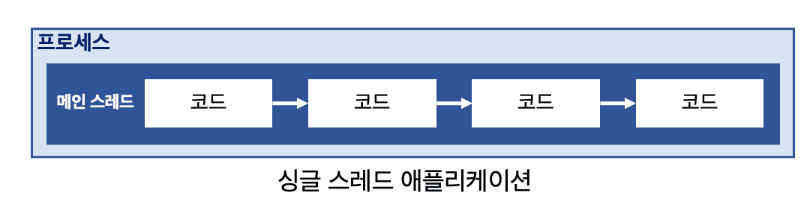
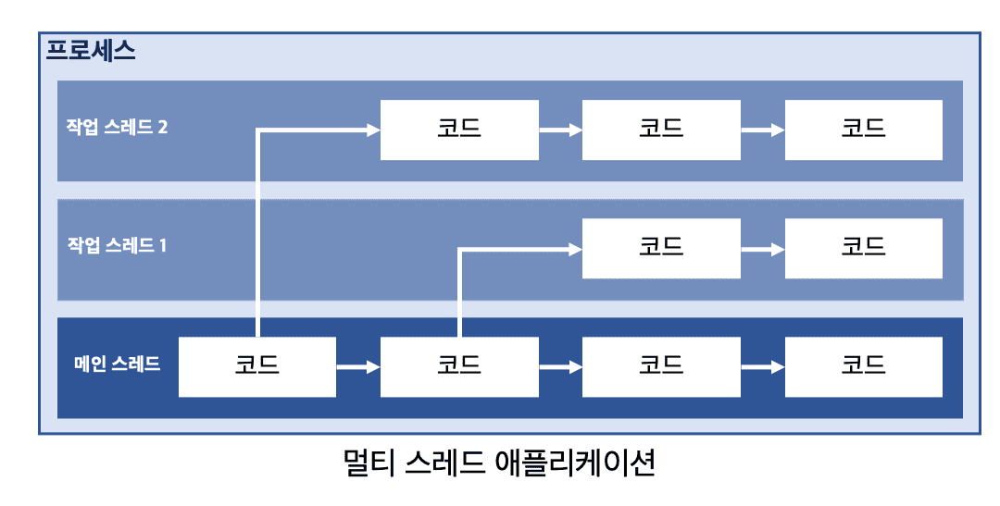
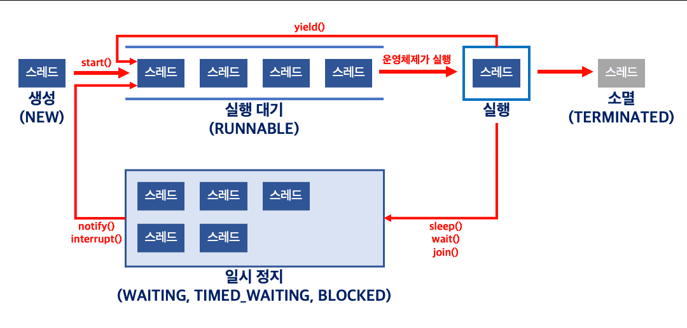
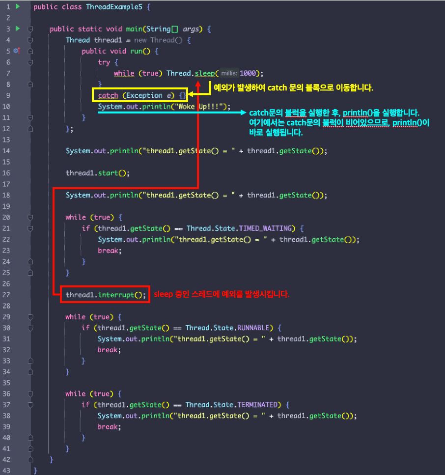

생성과 실행, 스레드의 이름, 동기화, 상태와 실행 제어

<div class="cl1"></div>

## 프로세스(Process)와 스레드(Thread)

**프로세스는 실행 중인 애플리케이션을 의미한다.**

애플리케이션을 실행하면 운영체제로부터 실행에 필요한 만큼의 메모리를 할당받아 프로세스가 된다.

<div class="cl3"></div>

프로세서는 데이터, 컴퓨터 자원, 스레드로 구성되는데, **스레드는 데이터와 애플리케이션이 확보한 자원을 활용하여 소스 코드를 실행한다.**

즉, 스레드는 하나의 코드 실행 흐름이라고 볼 수 있다.

<div class="cl2"></div>

## 메인 스레드

자바 애플리케이션을 실행하면 가장 먼저 실행되는 메서드는 main 메서드이며, 메인 스레드가 main  메서드를 실행시켜 준다.

<p align="center"></p>

<div class="cl2"></div>

## 멀티 스레드

하나의 프로세스는 여러 개의 스레드를 가질 수 있으며, 이를 멀티 스레드 프로세스라 한다.

여러 개의 스레드를 가진다는 것은 여러 스레드가 동시에 작업을 수행할 수 있음을 의미하며, 이를 멀티 스레딩이라고 한다.

<p align="center"></p>

<div class="cl2"></div>

## 작업 스레드 생성과 실행

메인 스레드 외에 별도의 작업 스레드를 활용한다는 것은, 작업 스레드가 수행할 코드를 작성하고, 작업 스레드를 생성하여 실행시키는 것을 의미한다.

<div class="cl4"></div>

**`run()`** 이라는 메서드 내에 스레드가 처리할 작업을 작성하도록 규정되어 있다.

**`run()`** 메서드는 Runnable 인터페이스와 Thread 클래스에 정의되어 있다.

<div class="cl4"></div>

### Runnable 인터페이스

```java
public class ThreadExample1 {
    public static void main(String[] args) {

    }
}

// Runnable 인터페이스를 구현하는 클래스
class ThreadTask1 implements Runnable {
    public void run() {

    }
}
```

```java
public class ThreadExample1 {
    public static void main(String[] args) {
        Runnable task1 = new ThreadTask1();
        Thread thread1 = new Thread(task1);

        // 작업 스레드를 실행시켜, run() 내부의 코드를 처리하도록 합니다. 
        thread1.start();
    }
}

class ThreadTask1 implements Runnable {
    public void run() {
        for (int i = 0; i < 100; i++) {
            System.out.print("#");
        }
    }
}
```

<div class="cl3"></div>

### Thread 클래스

```java
public class ThreadExample2 {
    public static void main(String[] args) {

    }
}

// Thread 클래스를 상속받는 클래스 작성
class ThreadTask2 extends Thread {
    public void run() {

    }
}
```

```java
public class ThreadExample2 {
    public static void main(String[] args) {

        ThreadTask2 thread2 = new ThreadTask2();

        // 작업 스레드를 실행시켜, run() 내부의 코드를 처리하도록 합니다. 
        thread2.start();

        // 반복문 추가
        for (int i = 0; i < 100; i++) {
            System.out.print("@");
        }
    }
}

class ThreadTask2 extends Thread {
    public void run() {
        for (int i = 0; i < 100; i++) {
            System.out.print("#");
        }
    }
}
```

<div class="cl3"></div>

### Runnable 인터페이스와 Thread 클래스 차이점

<div class="cl4"></div>

**자바 다중 상속의 한계**

자바에서 클래스는 하나의 클래스만 상속할 수 있다.

그렇기 때문에 이미 다른 클래스를 상속한 경우에는 Thread 클래스를 상속할 수 없다.

Runnable은 인터페이스이므로 클래스가 다른 클래스를 상속한 상태에서도 사용할 수 있다.

<div class="cl3"></div>

**코드 재사용성과 유연성**

Runnable은 인터페이스이므로 여러 클래스에서 구현할 수 있다.

이것은 코드의 재사용성과 유연성을 높일 수 있다.

다양한 작업을 수행하는 스레드가 필요한 경우, Runnable을 구현하는 다양한 클래스를 만들어 사용할 수 있다.

<div class="cl3"></div>

**스레드 풀 사용**

스레드 풀을 사용하는 경우 Runnable 객체를 스레드 풀에 제출하는 것이 일반적이다.

스레드 풀은 Runnable 작업을 큐에 넣고 필요할 때 스레드를 할당하여 실행한다.

<div class="cl3"></div>

**가독성**

Runnable을 사용하면 작업 내용과 스레드 실행을 분리할 수 있으므로 코드가 더 가독성이 높아진다.

Runnable은 스레드 생성과 실행을 명확하게 분리하는 방법으로 코드를 구조화 하는데 도움이 된다.

<div class="cl4"></div>

따라서 Runnable은 특히 상속이 불가능한 상황이나 다중 작업을 관리하는 데 더 좋은 선택일 수 있다.

<div class="cl3"></div>

### Runnable 익명 객체 사용

```java
public class ThreadExample1 {
    public static void main(String[] args) {
				
        // 익명 Runnable 구현 객체를 활용하여 스레드 생성
        Thread thread1 = new Thread(new Runnable() {
            public void run() {
                for (int i = 0; i < 100; i++) {
                    System.out.print("#");
                }
            }
        });

        thread1.start();

        for (int i = 0; i < 100; i++) {
            System.out.print("@");
        }
    }
}
```

<div class="cl4"></div>

### Thread 익명 하위 객체 사용

```java
public class ThreadExample2 {
    public static void main(String[] args) {

        // 익명 Thread 하위 객체를 활용한 스레드 생성
        Thread thread2 = new Thread() {
            public void run() {
                for (int i = 0; i < 100; i++) {
                    System.out.print("#");
                }
            }
        };

        thread2.start();

        for (int i = 0; i < 100; i++) {
            System.out.print("@");
        }
    }
}
```

<div class="cl2"></div>

## 스레드의 이름

```java
public class ThreadExample4 {
    public static void main(String[] args) {

        Thread thread4 = new Thread(new Runnable() {
            public void run() {
                System.out.println("Set And Get Thread Name");
            }
        });

        thread4.start();

        System.out.println("thread4.getName() = " + thread4.getName());

        thread4.setName("Demuu");

        System.out.println("thread4.getName() = " + thread4.getName());
    }
}

// 출력
// thread4.getName() = Thread-0
// thread4.getName() = Demuu
```

스레드의 이름은 .getName()으로 조회할 수 있고, .setName()으로 설정할 수 있다.

<div class="cl3"></div>

### 스레드 인스턴스 주소값 얻기

실행 중인 스레드의 주소값을 사용해야 하는 상황이 발생한다면 Thread 클래스의 정적 메서드인 **`currentThread()`** 를 사용하면 된다.

```java
public class ThreadExample1 {
    public static void main(String[] args) {

        Thread thread1 = new Thread(new Runnable() {
            public void run() {
                System.out.println(Thread.currentThread().getName());
            }
        });

        thread1.start();
        System.out.println(Thread.currentThread().getName());
    }
}

// 출력
// main
// Thread-0
```

<div class="cl2"></div>

## 스레드 동기화

멀티스레드 환경에서 여러 스레드가 공유 데이터 또는 리소스에 접근할 때 발생할 수 있는 문제를 해결하기 위한 기술이다.

동기화는 다수의 스레드가 동시에 공유 데이터를 변경하거나 접근하지 못하도록 조절하는 메커니즘을 제공한다.

<div class="cl4"></div>

스레드 동기화는 주의 깊은 계획과 구현이 필요하며, 오버헤드와 데드락과 같은 부작용을 유발할 수 있으므로 신중하게 사용해야 한다.

또한, 최근에는 락프리(Lock-Free) 및 웨이트프리(Wait-Free)알고리즘 등의 동기화 없는 기법도 발전하고 있으므로 상황에 따라 고려해야 한다.

<div class="cl3"></div>

**임계 영역** : 오로지 하나의 스레드만 코드를 실행할 수 있는 코드 영역

**락** : 임계 영역을 포함하고 있는 객체에 접근할 수 있는 권한

<div class="cl3"></div>

### 스레드의 동기화가 필요한 이유

<div class="cl4"></div>

**경쟁조건 (Race Condition) 방지** 

여러 스레드가 동시에 공유 데이터를 읽고 쓸 때, 예측할 수 없는 결과가 발생할 수 있다.

동기화를 통해 이러한 경쟁 조건을 방지할 수 있다.

<div class="cl3"></div>

**데드락 방지**

두 개 이상의 스레드가 서로의 작업이 끝나기를 기다리면서 상호 대기 상태에 빠지는 상황인 데드락을 방지한다.

<div class="cl3"></div>

**메모리 일관성 보장**

동기화는 스레드 간에 메모리 일관성을 보장하며, 캐시된 데이터를 갱신하여 모든 스레드에 반영될 수 있도록 한다.

<div class="cl3"></div>

**스레드 안전성 확보**

스레드 동기화를 통해 여러 스레드가 동시에 객체의 메서드를 호출하더라도 안전하게 수행되도록 보장한다.

<div class="cl3"></div>

### 동기화를 구현하는 주요 방법들

<div class="cl4"></div>

**synchronized 키워드**

자바에서는 메서드나 블록에 synchronized 키워드를 사용하여 동기화를 구현할 수 있다.

이를 통해 한 번에 하나의 스레드만 해당 블록 또는 메서드에 접근할 수 있다.

<div class="cl3"></div>

**Lock 인터페이스**

java.util.concurrent.locks 패키지에서 Lock 인터페이스와 그 구현체인 ReentrantLock을 제공한다.

이를 사용하여 더 정밀한 도이고하를 구현할 수 있다.

<div class="cl3"></div>

**wait()과 notify() / notifyAll() 메서드**

스레드 간 통신과 동기화를 위해 wait()과 notify() 또는 notifyAll() 메서드를 사용할 수 있다.

이를 통해 스레드를 일시 정지시키고 다른 스레드에게 상태 변경을 알릴 수 있다.

<div class="cl3"></div>

**동기화 블록**

synchronized 블록을 사용하여 특정 코드 블록을 동기화할 수 있다.

이는 메서드 전체가 아니라 필요한 부분만 동기화할 수 있도록 한다.

<div class="cl3"></div>

### 메서드 전체를 임계 영역으로 지정

```java
class Account {
	...
	public synchronized boolean withdraw(int money) {
	    if (balance >= money) {
	        try { Thread.sleep(1000); } catch (Exception error) {}
	        balance -= money;
	        return true;
	    }
	    return false;
	}
}
```

`withdraw()` 가 호출되면, `withdraw()`를 실행하는 스레드는 `withdraw()`가 포함된 객체의 락을 얻으며, 해당 스레드가 락을 반납하기 이전에 다른 스레드는 해당 메서드의 코드를 실행하지 못하게 된다.

<div class="cl3"></div>

### 특정한 영역을 임계 영역으로 지정

```java
class Account {
	...
	public boolean withdraw(int money) {
			synchronized (this) {
			    if (balance >= money) {
			        try { Thread.sleep(1000); } catch (Exception error) {}
			        balance -= money;
			        return true;
			    }
			    return false;
			}
	}
}
```

특정 영역을 임계 영역으로 지정하려면 sychronized 키워드와 함께 소괄호 안에 해당 영역이 포함된 객체의 참조를 넣고, 중괄호로 블록을 열어, 블록 내에 코드를 작성하면 된다.

<div class="cl2"></div>

## 스레드 상태와 실행 제어

<p align="center"></p>

`start()`는 스레드를 실행시키는 메서드가 아닌 실행 대기 상태로 만들어주는 메서드이다.

<div class="cl3"></div>

### sleep()

스레드를 잠시 멈춘다.

```java
static void sleep(long milliSecond)

try { Thread.sleep(1000); } catch (Exception error) {}
```

**`sleep()`**에 의해 일시 정지된 스레드는 **인자로 전달한 시간만큼의 시간이 경과한 경우**, **`interrupt()` 를 호출**한 경우에 실행 대기 상태로 복귀한다.

<div class="cl3"></div>

### interrupt()

sleep(), wait(), join()에 의해 일시 정지된 스레드들을 실행 대기 상태로 복귀시킨다.

```java
void interrupt()
```

<div class="cl4"></div>

<p align="center"></p>

<div class="cl3"></div>

### yield()

다른 스레드에 실행을 양보한다.

```java
static void yield()
```

운영 체제의 스케줄러에 의해 3초를 할당받은 스레드 A가 1초 동안 작업을 수행하다가 `yield()`를 호출하면 남은 실행 시간 2초는 다음 스레드에 양보된다.

<div class="cl4"></div>

```java
public class YieldExample {
    public static void main(String[] args) {
        Thread thread1 = new Thread(new MyRunnable("Thread 1"));
        Thread thread2 = new Thread(new MyRunnable("Thread 2"));

        thread1.start();
        thread2.start();
    }
}

class MyRunnable implements Runnable {
    private String name;

    public MyRunnable(String name) {
        this.name = name;
    }

    @Override
    public void run() {
        for (int i = 0; i < 5; i++) {
            System.out.println(name + ": " + i);
            
            // 현재 스레드가 실행을 양보하고 다른 스레드에게 CPU 실행 기회를 주기 위해 yield() 호출
            Thread.yield();
        }
    }
}
```

<div class="cl3"></div>

### join()

다른 스레드의 작업이 끝날 때까지 기다린다.

```java
void join()
void join(long milliSecond)
```

<div class="cl4"></div>

`join()`을 호출한 스레드는 일시 중지 상태가 된다. (`sleep()`과 유사)

try … catch 문으로 감싸서 사용해야 한다.

`interrupt()`에 의해 실행 대기 상태로 복귀할 수 있다.

<div class="cl4"></div>

`sleep()`과 `join()`의 차이점은 `sleep()`은 Thread 클래스의 static 메서드이다.

반면, `join()`은 특정 스레드에 대해 동작하는 인스턴스 메서드이다.

<div class="cl4"></div>

```java
public class ThreadExample {
    public static void main(String[] args) {
        SumThread sumThread = new SumThread();

        sumThread.setTo(10);

        sumThread.start();

        // 메인 스레드가 sumThread의 작업이 끝날 때까지 기다립니다. 
        try { sumThread.join(); } catch (Exception e) {}

        System.out.println(String.format("1부터 %d까지의 합 : %d", sumThread.getTo(), sumThread.getSum()));
    }
}

class SumThread extends Thread {
    private long sum;
    private int to;

    public long getSum() {
        return sum;
    }

    public int getTo() {
        return to;
    }

    public void setTo(int to) {
        this.to = to;
    }

    public void run() {
        for (int i = 1; i <= to; i++) {
            sum += i;
        }
    }
}
```

<div class="cl3"></div>

### wait(), notify()

스레드 간 협업에 사용된다.

<div class="cl4"></div>

`wain()` : 스레드를 일시 중지하고, 다른 스레드에게 실행 기회를 양도한다.

`notify()` : 대기 중인 스레드 중 하나를 깨운다.

<div class="cl4"></div>

```java
public class WaitNotifyExample {
    public static void main(String[] args) {
        final SharedObject sharedObject = new SharedObject();

        Thread thread1 = new Thread(() -> {
            for (int i = 1; i <= 5; i++) {
                sharedObject.printOdd(i);
            }
        });

        Thread thread2 = new Thread(() -> {
            for (int i = 2; i <= 10; i += 2) {
                sharedObject.printEven(i);
            }
        });

        thread1.start();
        thread2.start();
    }
}

class SharedObject {
    private boolean isOddTurn = true;

    public synchronized void printOdd(int num) {
        while (!isOddTurn) {
            try {
                wait(); // 짝수의 차례일 때는 대기
            } catch (InterruptedException e) {
                Thread.currentThread().interrupt();
            }
        }

        System.out.println("Odd: " + num);
        isOddTurn = false;
        notify(); // 다른 스레드에게 실행 기회 양보
    }

    public synchronized void printEven(int num) {
        while (isOddTurn) {
            try {
                wait(); // 홀수의 차례일 때는 대기
            } catch (InterruptedException e) {
                Thread.currentThread().interrupt();
            }
        }

        System.out.println("Even: " + num);
        isOddTurn = true;
        notify(); // 다른 스레드에게 실행 기회 양보
    }
}
```

SharedObject 클래스의 printOdd와 printEven 메서드에서 `wait()`와 `notify()`를 사용하여 두 스레드 간에 번갈아가며 숫자를 출력하도록 동기화 한다.