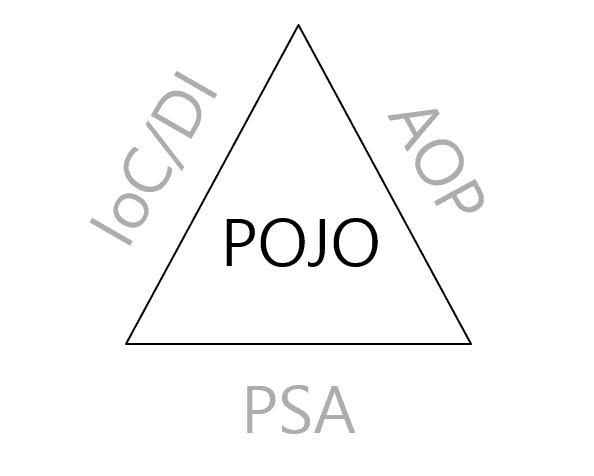
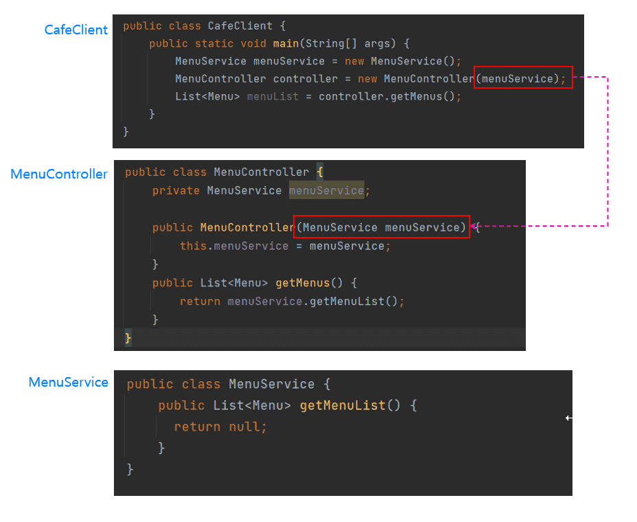

스프링 복습 및 정리 1P

<div class="cl1"></div>

## POJO (Plain Old Java Object)

<p align="center"></p>

위 spring 삼각형의 가운데에 있는 POJO는 IoC/DI, AOP, PSA를 통해서 달성할 수 있다는 것을 의미한다.

<div class="cl3"></div>

POJO란 순수한 자바 객체를 나타내는 용어로,

특정 프레임워크나 라이브러리에 종속되지 않는 일반적인 자바 객체를 의미한다.

<div class="cl3"></div>

스프링 프레임워크에서 POJO는 핵심 개념 중 하나이며, 스프링을 사용하면서 POJO를 활용하면 애플리케이션의 유지 보수성, 테스트 용이성, 확장성을 향상시킬 수 있다.

<div class="cl3"></div>

POJO는 스프링에서 주로 컴포넌트(서비스, 컨트롤러 등)로 사용되며,

스프링의 IoC 컨테이너가 POJO 객체의 라이프사이클을 관리하고 의존성 주입을 수행한다.

<div class="cl3"></div>

**순수한 자바 클래스**

POJO는 자바 클래스로, 특정 스프링 인터페이스나 클래스를 상속받거나 특정 어노테이션을 사용하지 않아도 된다.

즉, POJO 클래스는 자바의 기본 규칙에 따라 작성된다.

<div class="cl3"></div>

**컨테이너에 독립적**

POJO는 스프링 컨테이너에 종속되지 않는다.

이것은 POJO 객체가 스프링 컨테이너를 사용하지 않아도 독립적으로 생성하고 테스트할 수 있음을 의미한다.

<div class="cl3"></div>

**의존성 주입 (Dependency Injection) 가능**

스프링은 POJO 객체의 의존성을 주입하는 데 사용된다.

이것은 객체 간의 결합도를 낮추고 테스트 용이성을 향상시킨다.

<div class="cl3"></div>

**프레임워크에 종속되지 않음**

POJO는 스프링뿐만 아니라 다른 프레임워크와도 함께 사용할 수 있다.

<div class="cl2"></div>

### POJO를 사용한 예시

```java
public class Customer {
    private String name;
    private String email;

    // 기본 생성자
    public Customer() {}

    public Customer(String name, String email) {
        this.name = name;
        this.email = email;
    }

    // Getter와 Setter 메서드
    public String getName() {
        return name;
    }

    public void setName(String name) {
        this.name = name;
    }

    public String getEmail() {
        return email;
    }

    public void setEmail(String email) {
        this.email = email;
    }
}
```

위 코드는 자바에서 제공하는 기능만 사용하여 getter, setter만 가지고 있는 코드이다.

해당 클래스의 코드에서는 Java언어 이외에 특정한 기술에 종속되어 있지 않은 순수한 객체이기 때문에 POJO라고 부를 수 있다.

<div class="cl2"></div>

### POJO를 사용하지 않은 예시

```java
import org.springframework.stereotype.Component;

@Component
public class CustomerService {
    // 스프링 컴포넌트로 인식되는 클래스

    private String serviceName;

    public CustomerService() {
        this.serviceName = "CustomerService";
    }

    public void serveCustomer(String customerName) {
        System.out.println("[" + serviceName + "] 서비스 중: " + customerName);
    }
}
```

위의 CustomerService 클래스는 스프링의 @Component 어노테이션을 사용하여 스프링 빈으로 등록되고, 스프링 프레임워크에 의존성이 강하다.

이 클래스를 다른 프레임워크나 라이브러리에서 사용하기 어려울 수 있다.

<div class="cl1"></div>

## IoC (Inversion of Control)

프로그램의 제어 흐름을 역전시키는 디자인 패턴이다.

개발자가 코드의 제어를 직접 하지 않고 외부 컨테이너(스프링 컨테이너)에 의해 관리되도록 하는 원칙이다.

<div class="cl3"></div>

**제어의 역전 (Inversion of Control)**

기존의 애플리케이션에서는 개발자가 객체의 생성과 생명 주기 관리, 의존성 주입 등을 직접 제어한다.

그러나 스프링에서는 객체의 생성과 관리, 의존성 주입 등을 스프링 컨테이너에 위임함으로써 제어의 역전이 발생한다.

개발자는 컨테이너가 언제, 어떻게 객체를 생성하고 관리할지 신경쓰지 않아도 된다.

<div class="cl3"></div>

**스프링 컨테이너**

IoC의 햄심은 스프링 컨테이너에 의해 관리되는 객체이다.

스프링 컨테이너는 애플리케이션에서 필요한 객체를 생성, 관리하고 의존성을 주입하여 객체 간의 관걔를 관리한다.

스프링 컨테이너는 애플리케이션 컴포넌트(빈)의 라이프사이클도 관리한다.

<div class="cl3"></div>

**의존성 주입 (Dependency Injection)**

스프링에서는 객체들 사이의 의존성을 코드에 직접 작성하는 대신 스프링 컨테이너가 이를 관리한다.

<div class="cl3"></div>

**빈 (Bean)**

스프링에서 IoC 컨테이너가 관리하는 객체를 “빈”이라고 한다.

빈은 스프링 컨테이너에 등록되어 애플리케이션에서 사용된다.

<div class="cl3"></div>

**DI 컨테이너**

스프링 컨테이너는 DI 컨테이너의 역할도 수행한다.

DI는 객체 간의 의존성을 주입하는 것을 의미하며, 스프링은 이를 자동으로 수행한다.

<div class="cl2"></div>

### IoC를 사용하지 않은 예시

```java
public class MessageService {
    public String getMessage() {
        return "Hello, World!";
    }
}

public class MessageProcessor {
    private MessageService messageService = new MessageService();

    public void processMessage() {
        String message = messageService.getMessage();
        System.out.println("Received message: " + message);
    }
}

public class Main {
    public static void main(String[] args) {
        MessageProcessor processor = new MessageProcessor();
        processor.processMessage();
    }
}
```

MessageProcessor 클래스는 MessageService에 직접 의존하고 있다.

MessageProcessor를 만들 때 MessageService를 생성하고 관리하는 책임은 개발자에게 있다.

<div class="cl2"></div>

### IoC를 사용한 예시

```java
// 스프링 설정 파일 (application-context.xml)
<beans xmlns="http://www.springframework.org/schema/beans"
       xmlns:xsi="http://www.w3.org/2001/XMLSchema-instance"
       xsi:schemaLocation="http://www.springframework.org/schema/beans
                           http://www.springframework.org/schema/beans/spring-beans.xsd">
    
    <!-- MessageService 빈 설정 -->
    <bean id="messageService" class="com.example.MessageService" />

    <!-- MessageProcessor 빈 설정 -->
    <bean id="messageProcessor" class="com.example.MessageProcessor">
        <property name="messageService" ref="messageService" />
    </bean>

</beans>
```

```java
public class MessageService {
    public String getMessage() {
        return "Hello, World!";
    }
}

public class MessageProcessor {
    private MessageService messageService;

    // 스프링이 의존성 주입 (Dependency Injection)을 수행
    public void setMessageService(MessageService messageService) {
        this.messageService = messageService;
    }

    public void processMessage() {
        String message = messageService.getMessage();
        System.out.println("Received message: " + message);
    }
}

public class Main {
    public static void main(String[] args) {
        // 스프링 컨테이너 초기화
        ApplicationContext context = new ClassPathXmlApplicationContext("application-context.xml");

        // MessageProcessor 빈 가져오기
        MessageProcessor processor = (MessageProcessor) context.getBean("messageProcessor");
        
        // 메시지 처리
        processor.processMessage();
    }
}
```

MessageProcessor 클래스는 MessageService에 대한 의존성을 직접 관리하지 않는다.

스프링 컨테이너가 MessageService 객체를 생성하고 MessageProcessor에 주입 한다.

개발자는 객체 생성 및 관리에 대한 부담을 덜고 의존성 주입을 통해 더 모듈화된 코드를 작성할 수 있다.

<div class="cl1"></div>

## DI (Dependency Injection)

객체 간의 의존성을 외부에서 주입하는 방식을 말한다.

이것은 소프트웨어 개발에서 객체가 필요로하는 의존 객체를 직접 생성하거나 관리하는 대신,

외부에서 주입받아 사용하는 방식을 의미한다.

DI는 애플리케이션을 더 모듈화하고 유연하게 만들며, 유지 보수성을 향상시키는 데 도움이 된다.

DI는 IoC 개념을 조금 구체화시킨 것이라고 볼 수 있다.

<div class="cl3"></div>

**의존성 (Dependency)**

의존성은 하나의 객체가 다른 객체에 의존하는 경우이다.

예를 들어, 주문 처리 객체가 결제 처리 객체에 의존한다면 주문 처리 객체는 결제 처리 객체의 인스턴스를 어떻게 얻을 것인지 결정해야 한다.

<div class="cl3"></div>

**의존성 주입 (Dependency Injection)**

DI는 의존성을 주입하는 것을 의미한다.

객체가 필요로 하는 의존성을 직접 생성하는 대신, 외부에서 주입받아 사용하는 방식이다.

이것은 객체 간의 결합도를 낮추고 재사용성과 테스트 용이성을 높인다.

<div class="cl3"></div>

**IoC (Inversion of Control)**

DI의 핵심 개념 중 하나로, 객체 생성과 관리의 주도권이 개발자가 아닌 프레임워크 또는 컨테이너에게 넘어감을 의미한다.

스프링 컨테이너가 객체의 생명주기를 관리하고 의존성을 주입하는 것이 IoC의 핵심이다.

<div class="cl2"></div>

### 의존성 주입이란?

<p align="center"></p>

생성자의 파라미터로 객체를 전달하는 것을 외부에서 객체를 주입한다라고 표현한다.

CafeClinet 클래스가 MenuController의 생성자 파라미터로 menuService를 전달하고 있기 때문에 객체를 주입해 주는 외부가 된다.

즉, 외부에서 객체를 주입해주는 외부는 CafeClient 클래스이다.

<div class="cl2"></div>

### DI를 구현하는 방법

<div class="cl4"></div>

**컨스트럭터 주입 (Constructor Injection)**

```java
public class OrderService {
    private PaymentService paymentService;

    @Autowired
    public OrderService(PaymentService paymentService) {
        this.paymentService = paymentService;
    }
}
```

객체 생성 시 생성자를 통해 의존성을 주입하는 방식이다.

@Autowired 어노테이션을 사용하여 이러한 종류의 주입을 수행한다.

<div class="cl3"></div>

**세터 주입 (Setter Injection)**

```java
public class OrderService {
    private PaymentService paymentService;

    @Autowired
    public void setPaymentService(PaymentService paymentService) {
        this.paymentService = paymentService;
    }
}
```

<div class="cl3"></div>

**필드 주입 (Field Injection)**

```java
public class OrderService {
    @Autowired
    private PaymentService paymentService;
}
```

필드에 직접 의존성을 주입하는 방식이다.

일반적으로 추천되지 않지만 간단한 예제에서 사용할 수 있다.

<div class="cl1"></div>

## AOP (Aspect Oriented Programming)

프로그램의 횡단 관심사(콘솔 로깅, 트랜잭션 관리, 보안, 성능 측정 등)를 모듈화하고 재사용 가능한 측면으로 분리하는 프로그래밍 접근 방식이다.

<div class="cl3"></div>

AOP를 사용하면 이러한 횡단 관심사를 핵심 비즈니스 로직에서 분리할 수 있으며, 코드의 모듈성과 유지보수성을 향상시킬 수 있다.

<div class="cl3"></div>

AOP를 한글로 번역하면 관심 지향 프로그래밍 정도로 해석할 수 있다.

**AOP라는 것은 애플리케이션의 핵심 업무 로직에서 로깅이나 보안, 트랜잭션 같은 공통 기능 로직들을 분리하는 것이라고 생각하면 된다.**

<div class="cl3"></div>

**Aspect (관점)**

관심사의 모듈화를 정의한 모듈이다.

보통 여러 종류의 어드바이스와 포인트컷으로 구성된다.

예를 들어, 트랜잭션 관리를 하는 Aspect, 로깅을 하는 Aspect 등이 있을 수 있다.

<div class="cl3"></div>

**Advice**

관심사의 구체적인 내용을 정의한 모듈이다.

어드바이스는 관심사의 언제(포인트컷)와 어떻게(로직) 적용할지를 정의한다.

주요 어드바이스 유형으로는 Before (메서드 실행 전), After (메서드 실행 후), Around (메서드 실행 전후를 제어) 등이 있다.

<div class="cl3"></div>

**Pointcut**

어떤 위치에 어떤 어드바이스를 적용할지를 지정하는 표현식이다.

예를 들어, 모든 서비스 메서드 호출 지점에 트랜잭션 관리 어드바이스를 적용하려면 해당 메서드 호출 지점을 지정하는 표현식이 포인트컷이다.

<div class="cl3"></div>

**Join Point**

애플리케이션 실행 중에 AOP가 적용될 수 있는 특정 지점 또는 위치이다.

메서드 호출, 예외 발생, 객체 생성 등이 조인 포인트의 예시이다.

<div class="cl3"></div>

**Weaving**

AOP의 Aspect를 실제 코드에 적용하는 과정이다.

컴파일 시점, 클래스로딩 시점, 런타임 시점에 위빙을 수행할 수 있다.

스프링에서 AOP를 구현하기 위해 사용되는 주요 라이브러리는 AspectJ와 스프링 AOP가 있다.

스프링 AOP는 프록시 패턴을 기반으로 하며, 메서드 호출 시 프록시 객체를 통해 어드바이스를 적용한다.

AspectJ는 자바 언어의 확장으로 AOP를 지원하며, 더 강력한 기능을 제공하지만 설정과 사용이 복잡할 수 있다.

<div class="cl2"></div>

### AOP를 사용하지 않은 예시

```java
public class BlogService {

    public void createPost(String content) {
        // 게시물 생성 로직
        System.out.println("게시물을 생성합니다.");
    }

    public void updatePost(int postId, String content) {
        // 게시물 업데이트 로직
        System.out.println("게시물을 업데이트합니다.");
    }
}
```

이 경우, 각 메서드 내에서 로깅을 직접 추가해야 한다.

<div class="cl2"></div>

### AOP를 사용한 예시

```java
public class BlogService {

    public void createPost(String content) {
        // 게시물 생성 로직
    }

    public void updatePost(int postId, String content) {
        // 게시물 업데이트 로직
    }
}
```

```java
@Aspect
@Component
public class LoggingAspect {

    @Before("execution(* com.example.BlogService.*(..))")
    public void beforeMethodExecution(JoinPoint joinPoint) {
        String methodName = joinPoint.getSignature().getName();
        System.out.println("메서드 '" + methodName + "'가 실행되었습니다.");
    }
}
```

createPost와 updatePost 메서드를 호출할 때마다 메서드가 실행되었음을 로그로 기록할 수 있다.

AOP를 사용하면 핵심 비즈니스 로직과 로깅과 같은 횡단 관심사를 분리하여 코드를 더 깔끔하고 관리하기 쉽게 만들 수 있다.

<div class="cl1"></div>

## PSA (Portable Service Abstraction)

PSA(프로그래밍 방식 추상화)는 스프링 프레임워크가 제공하는 여러 추상화 계층을 의미한다.

PSA는 스프링의 핵심 철학 중 하나인 “높은 수준의 추상화”를 실현하기 위해 만들어진 개념이다.

PSA는 스프링을 사용하는 개발자가 구체적인 기술적 세부 사항에 직접 물들지 않고, 높은 수준의 추상화를 통해 개발할 수 있도록 돕는다.

<div class="cl2"></div>

### PSA 주요 구성 요소

**IoC 컨테이너**

**DI**

**AOP**

**포터블 서비스 추상화 (Portlet Service Abstraction)**

여러 종류의 웹 포털 환경에서 동일한 코드를 실행할 수 있다.

<div class="cl3"></div>

**템플릿/콜백 추상화**

개발자는 기술적인 세부 사항을 신경 쓰지 않고도 DB나 메시징 시스템과 상호 작용할 수 있다.

<div class="cl2"></div>

### PSA를 사용하지 않은 예시

```java
// PSA를 사용하지 않은 일반적인 Java 애플리케이션
public class ProductService {
    private ProductRepository productRepository;

    public ProductService(ProductRepository productRepository) {
        this.productRepository = productRepository;
    }

    public List<Product> getAllProducts() {
        return productRepository.getAllProducts();
    }

    // 다양한 비즈니스 로직...
}

// PSA를 사용하지 않은 일반적인 Java 애플리케이션
public class ProductController {
    private ProductService productService;

    public ProductController(ProductService productService) {
        this.productService = productService;
    }

    public List<Product> getAllProducts() {
        return productService.getAllProducts();
    }

    // 다양한 웹 요청 처리 메서드...
}
```

개발자가 직접 객체 생성 및 의존성 주입을 관리해야 한다.

이로 인해 코드가 더 복잡해지고 유지보수가 어려울 수 있다.

<div class="cl2"></div>

### PSA를 사용한 예시

```java
// 스프링을 사용한 PSA 적용
@Service
public class ProductService {
    @Autowired
    private ProductRepository productRepository;

    public List<Product> getAllProducts() {
        return productRepository.getAllProducts();
    }

    // 다양한 비즈니스 로직...
}

// 스프링을 사용한 PSA 적용
@RestController
@RequestMapping("/api/products")
public class ProductController {
    @Autowired
    private ProductService productService;

    @GetMapping
    public List<Product> getAllProducts() {
        return productService.getAllProducts();
    }

    // 다양한 웹 요청 처리 메서드...
}
```

@Autowired 어노테이션을 통해 의존성 주입을 설정하고, IoC 컨테이너가 객체의 생성과 관리를 자동으로 처리한다.

개발자는 객체 생성 및 관리에 대한 코드를 작성하지 않고도 비즈니스 로직을 개발할 수 있다.

