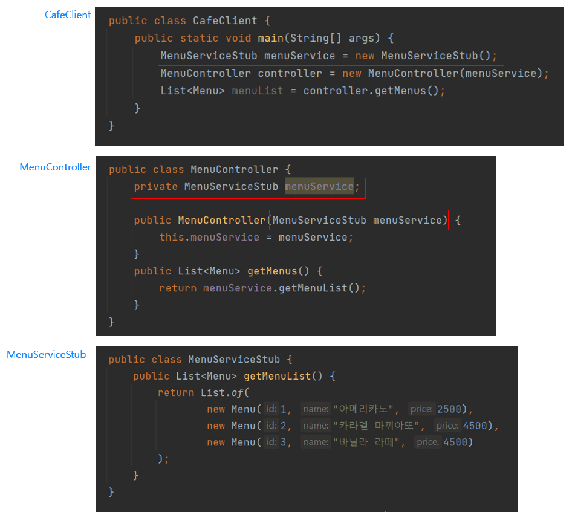
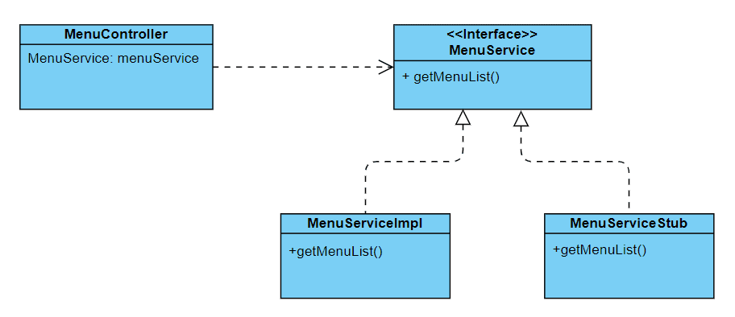
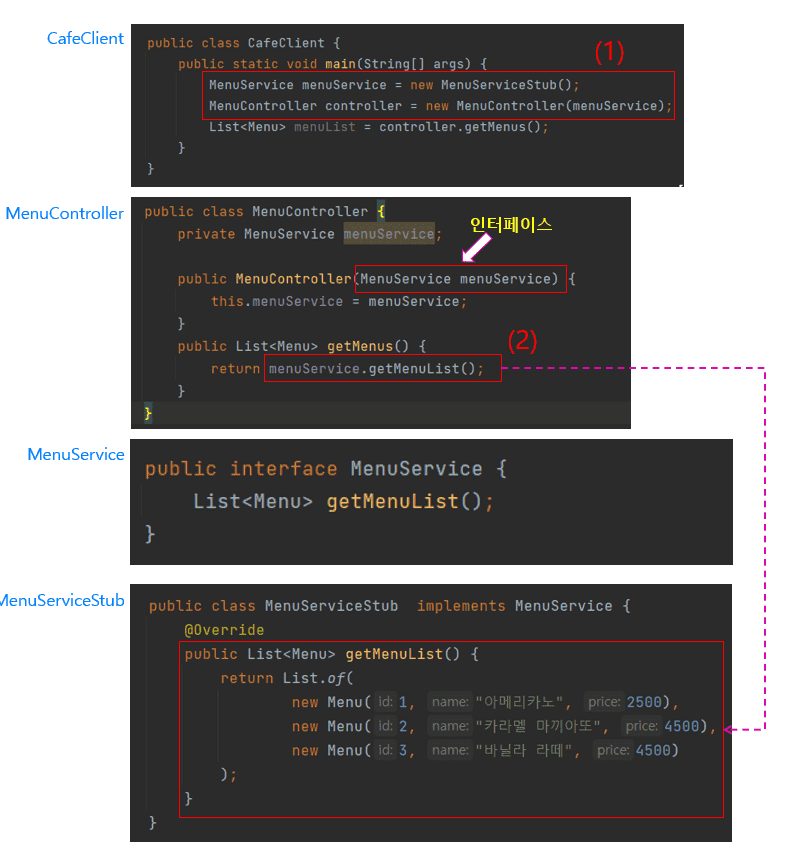
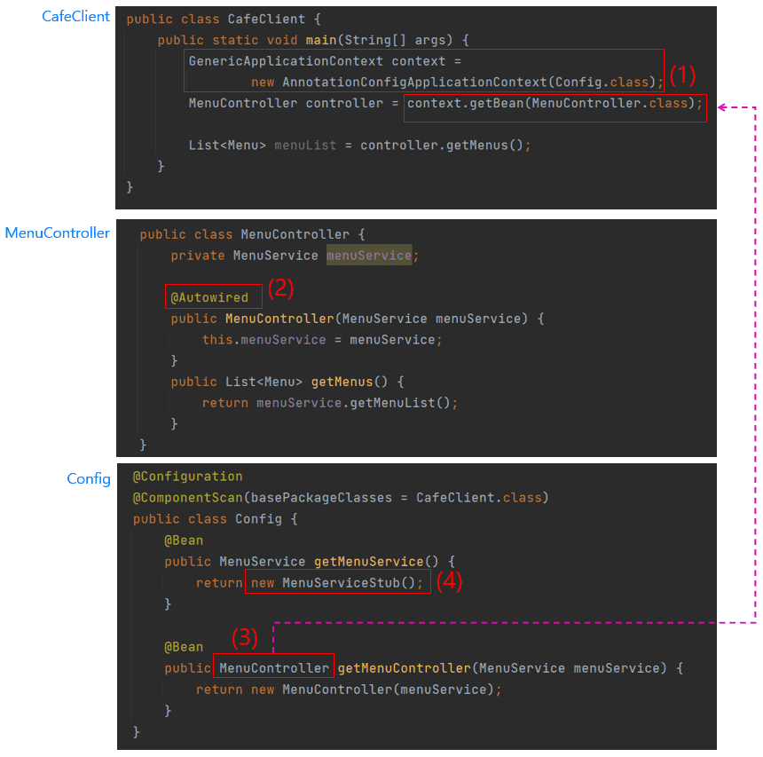

스프링 복습 및 정리 1.1P

애플리케이션 코드 내부에서 직접적으로 new 키워드를 사용할 경우 객체지향 설계의 관점에서 중요한 문제가 발생할 수 있다.

프론트엔드 쪽에서 Stub(고정된 데이터 / 동일한 데이터 리턴)를 요청했을때

백엔드에서 코드 구성을 수정한 예시이다.

MenuServiceStub 클래스를 보면 getMenuList()에 Stub 데이터로 채워져 있다.

**만약 MenuServiceStub 클래스를 사용할 대상이 수십, 수백 군데일 때,**

CafeClient와 MenuController에서 MenuService를 MenuServiceStub 클래스로 불가피하게 변경해야 되는 상황이 발생하면 수동으로 일일이 많은 곳을 수정해야 한다.

**결국 new 키워드를 사용해서 객체를 생성하게 되면 참조할 클래스가 바뀌게 될 경우, 이 클래스를 사용하는 모든 클래스들을 수정할 수 밖에 없다.**

이처럼 new 키워드를 사용해서 의존 객체를 생성할 때, 클래스들 간에 **강하게 결합(Tight Coupling)**되어 있다고 한다.

이를 피하기 위해선 **느슨한 결합(Loose Coupling)**이 필요하다.

## 느슨한 의존성 주입

클래스들 간의 관계를 느슨하게 만드는 대표적인 방법은 인터페이스(Interface)를 사용하는 것이다.

어떤 클래스가 인터페이스 같이 일반화된 구성 요소에 의존하고 있을 때, 클래스들 간에 **느슨하게 결합**되어 있다고 한다.

(1)을 보면 new로 MenuServiceStub 클래스의 객체를 생성해서 MenuService 인터페이스에 할당한다.

이처럼 인터페이스 타입의 변수에 그 인터페이스의 구현 객체를 할당할 수 있는데 이를 **업캐스팅(Upcasting)**이라고 한다.

업캐스팅을 통한 의존성 주입으로 인해 MenuController와 MenuService는 느슨한 결합 관계를 유지하게 된다.

하지만 클래스들 간의 관계를 느슨하게 만들기 위해서는 new 키워드를 사용하지 않아야 되는데,

CafeClient 클래스의 (1)을 보면 MenuServiceStub의 객체와 MenuController 객체를 생성하기 위해 여전히 new를 사용한다.

이 new 키워드를 제거하고 의존 관계를 느슨하게 만드는 것은 spring이 대신해준다.

## Spring 기반 애플리케이션에서 의존성 주입

(1)에 해당하는 코드는 모두 Spring에서 지원하는 API 코드이다.

이 코드에 나오는 코드는 예를 보여주기 위해서 사용한 것이다. 웹 애플리케이션에서는 몰라도 되는 코드이다.

POJO 프로그래밍을 위한 규칙 중에 하나는 ‘다른 기술이나 규약에 얽매이지 않아야 한다’인데 (1)에서는 Spring Framework에 해당하는 코드가 애플리케이션 코드에 직접적으로 나와 버렸다.

**좋은 개발 방식이 아니라고 할 수 있다.** (실제 Spring 기반의 웹 애플리케이션에는 위와 같은 코드는 나오지 않는다)

new 키워드를 없앨 수 있었던 이유는 Config라는 클래스 덕분이다.

Config 클래스에서 MenuController 객체 생성을 정의해 두면 (1)을 이용해서 이 객체를 애플리케이션 코드에서 사용하게 된다.

한마디로 Config 클래스에 정의해 둔 MenuController 객체를 Spring의 도움을 받아서 CafeClient 클래스에게 제공을 하고 있는 것이다.

Config 클래스 안에서 new키워드로 객체를 생성했으니까 이것도 문제라고 볼 수 있겠지만

Config 클래스는 단순한 클래스가 아니라 Spring Framework의 영역에 해당하는 것이고 Config 클래스가 실제 애플리케이션의 핵심 로직에 관여하지 않고 있다.

이제 프론트엔드 에게 데이터 전달할 때 애플리케이션 코드에서 변경할 내용들이 있으면

Spring Framework 영역에 있는 MenuServiceStub 클래스를 MenuServiceImpl 클래스로 단 한 번만 변경해 주면 된다.

