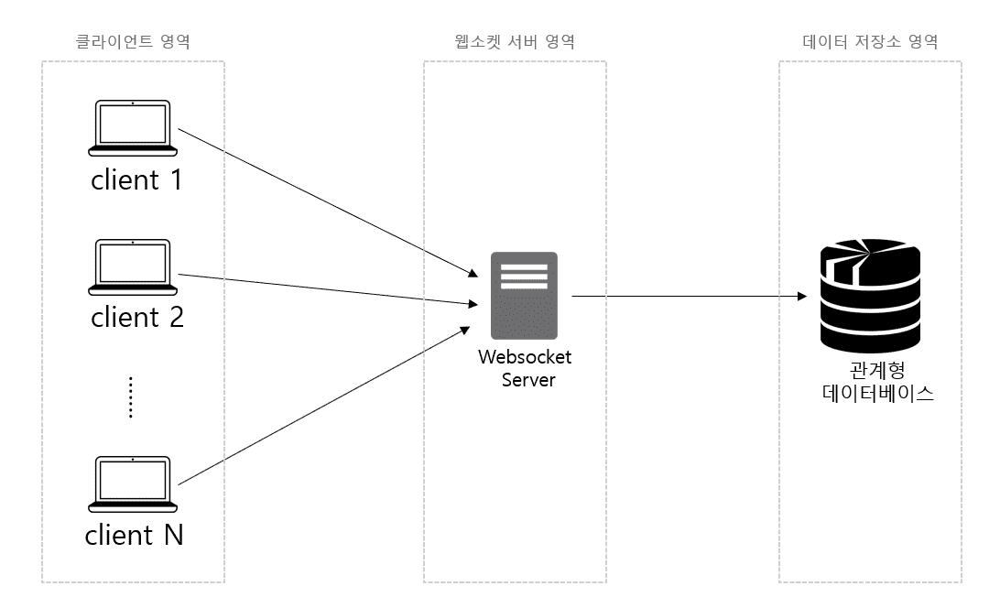
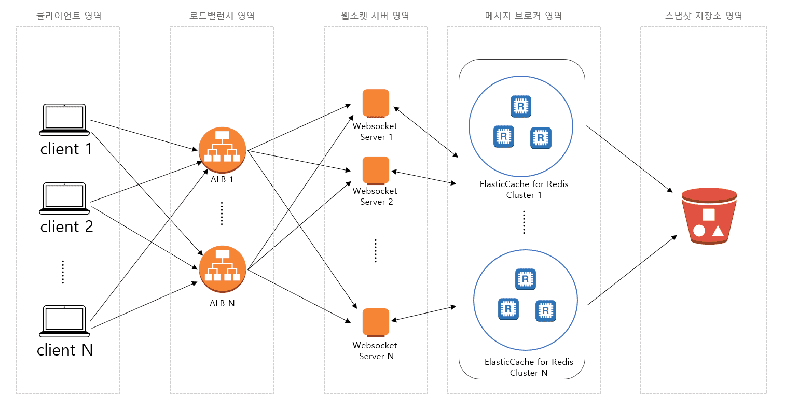
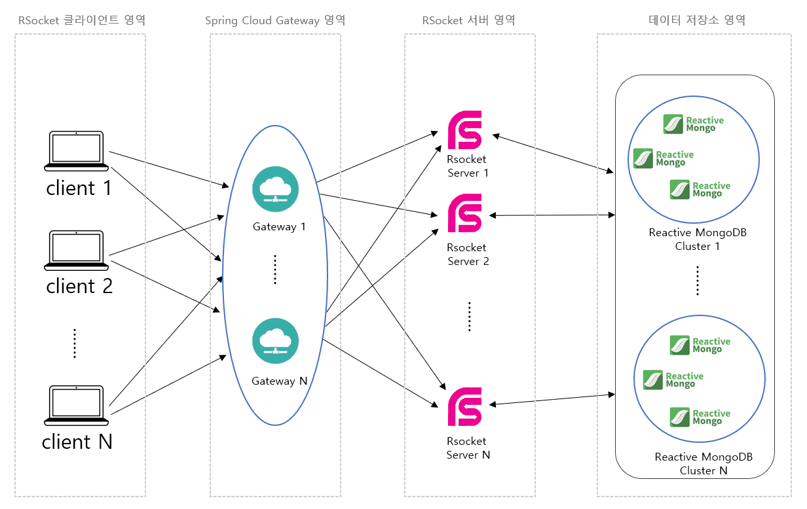
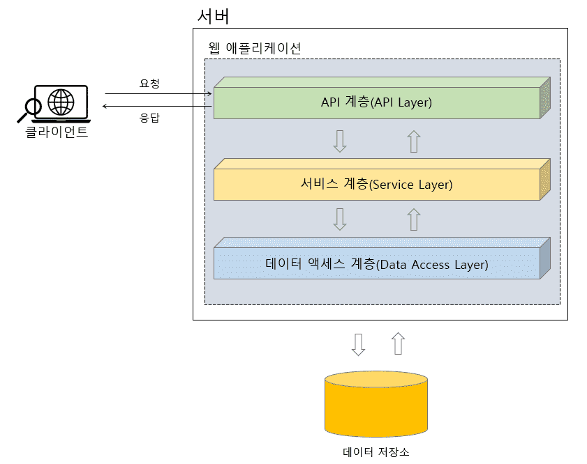
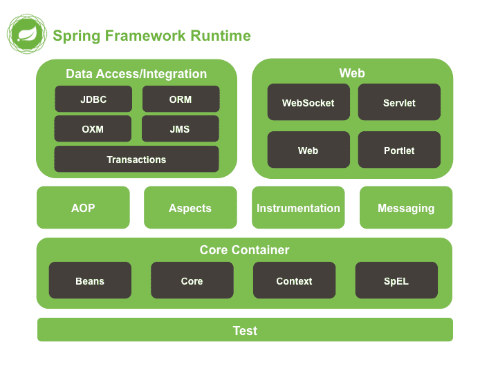

소프트웨어나 시스템의 구조와 구성을 설계하고 조직화하는 과정 및 결과물을 가르킨다.

## 아키텍처란?

소프트웨어 아키텍처는 시스템의 전체적인 디자인과 구조를 정의하며, 다양한 소프트웨어 컴포넌트와 그들 간의 관계를 결정한다.

아키텍처는 시스템의 확장성, 성능, 보안, 유지보수성 및 기타 품질 속성을 결정하고 이를 달성하기 위한 지침을 제공한다.

**구성 요소 (Components)**

시스템을 구성하는 주요 구성 요소를 식별하고 정의한다.

이러한 구성 요소는 모듈, 서비스, 데이터베이스, 인터페이스 등이 될 수 있다.

**관계 (Relationships)**

구성 요소 간의 상호 작용 및 의존성을 결정한다.

이것은 어떤 구성 요소가 다른 구성 요소를 어떻게 호출하고 통신하는지를 정의한다.

**디자인 패턴 (Design Patterns)**

아키텍처는 소프트웨어 디자인 패턴을 활용하여 구현된다.

이러한 패턴은 일반적인 디자인 문제에 대한 해결책을 제공하며, 코드의 재사용성과 유지보수성을 촉진한다.

**품질 속성 (Quality Attributes)**

시스템의 품질 속성을 정의하고 이를 달성하기 위한 방법을 제공한다.

이러한 품질 속성은 성능, 확장성, 보안, 가용성, 유지보수성 등이 포함된다.

**비용 및 일정 (Cost and Schedule)**

아키텍처는 프로젝트 비용과 일정을 고려하여 계획되어야 한다.

효율적인 아키텍처는 개발 및 유지보수 비용을 최소화하고 프로젝트 일정을 준수할 수 있도록 도와준다.

## 시스템 아키텍처

시스템 아키텍처는 하드웨어와 소프트웨어를 모두 포함하는 시스템의 전체적인 구성을 큰 그림으로 표헌한 것이다.

시스템 아키텍처를 통해 기본적으로 해당 시스템이 어떤 하드웨어로 구성되고, 어떤 소프트웨어를 사용하는지를 대략적으로 알 수 있다.

### 시스템 아키텍처 예시

**채팅 서버를 구축하기 위한 전통적인 시스템 아키텍처**

위 그림은 사용자의 요청을 단일 서버가 모두 처리하기 때문에 제한적인 사용자 요청만 처리할 수 있다.

사용자의 요청이 늘어나는 상황에 대비하기 위한 시스템 확장에 대한 부분이 전혀 고려되지 않았다.

또한 웹소켓 서버가 단일 서버이기 때문에 해당 서버가 다운되면 시스템 전체가 죽게 되는 문제가 있다.

**채팅 서버 아키텍처 개선**

- 사용자의 요청을 분산시켜 주는 로드 밸런서 영역을 두어서 웹소켓 서버를 안정적으로 운영할 수 있도록 하고 있다.
- 여러 대의 웹소켓 서버로 확장이 가능하기 때문에 사용자의 요청이 늘어나도 서버의 부하를 줄일 수 있으며, 장애가 발생해도 전체 시스템이 죽는 격우를 방지할 수 있다.
- 메시지 브로커 영역을 두어서 웹소켓 서버가 다중 서버로 구성이 되어 있더라도 특정 사용자들 간에 메시지를 주고받을 수 있는 공유 채널을 사용하는 것이 가능해진다.

**채팅 서버의 전송 속도 향상 아키텍처**

## 소프트웨어 아키텍처

**Java 플랫폼 아키텍처**

소프트웨어는 하드웨어를 제외한 컴퓨터 내의 모든 프로그램을 포괄하는 의미를 가지고 있으며 이러한 소프트웨어의 구성을 큰 그림으로 표현한 것이 소프트웨어 아키텍처이다.

## 애플리케이션 아키텍처

애플리케이션은 소프트웨어 종류의 하나로써 좁게는 데스크톱이나 스마트폰에서 사용하는 응용 프로그램을 말하며, 넓게는 클라이언트의 요청을 처리하는 서버 애플리케이션을 의미한다.

### 계층형 아키텍처

웹 애플리케이션을 계층형으로 표현한 아키텍처

**API 계층**

클라이언트의 요청을 받아들이는 계층이다.

일반적으로 표현 계층(Presentation Layer)라고도 불리지만 REST API를 제공하는 애플리케이션의 경우 API 계층이라는 표현이 더 적절하다.

**서비스 계층**

API 계층에서 전달받은 요청을 업무 도메인의 요구 사항에 맞게 비즈니스적으로 처리하는 계층이다.

애플리케이션의 핵심 로직은 서비스 계층에 포함되어 있다고 해도 과언이 아닐 만큼 애플리케이션에 있어 핵심이 되는 계층이다.

**데이터 액세스 계층**

비즈니스 계층에서 처리된 데이터를 데이터베이스 등의 데이터 저장소에 저장하기 위한 계층이다.

## Spring Framework Module 아키텍처

