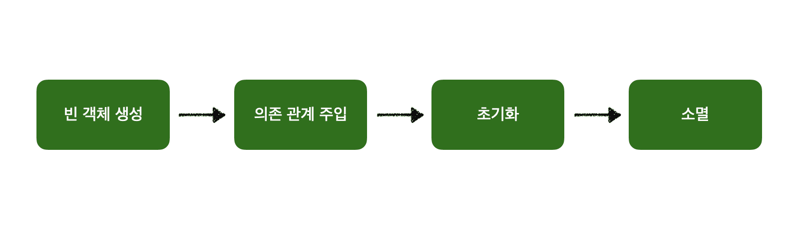
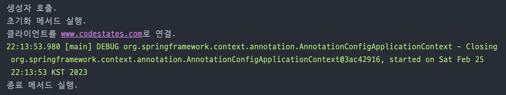
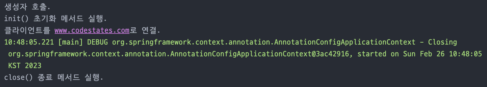
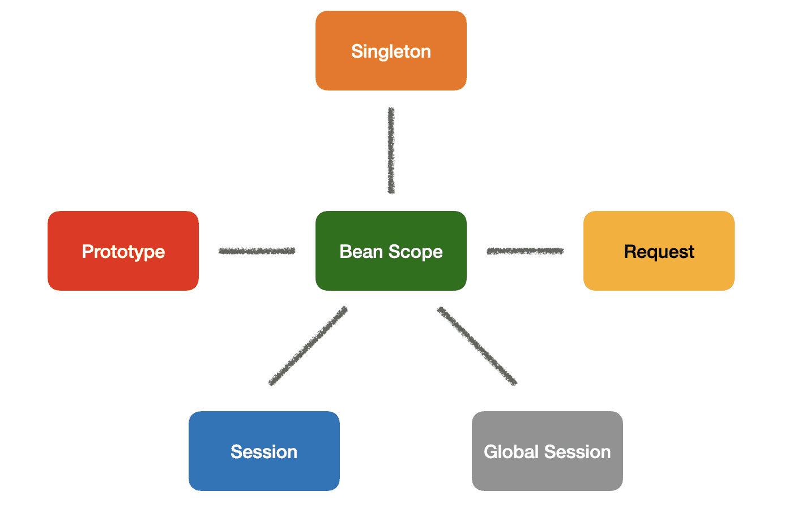
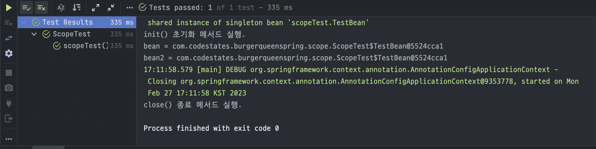
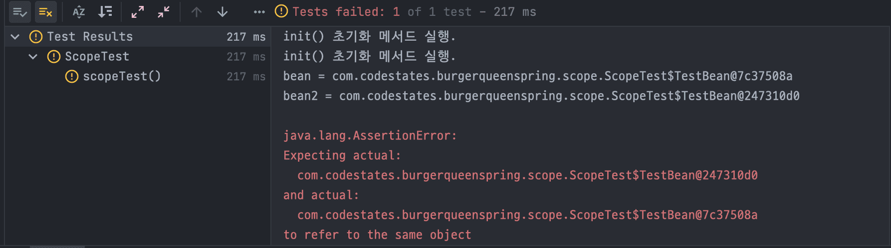

빈(Bean) 생명주기와 범위

<div class="cl1"></div>

## 빈 생명 주기와 범위

```java
public class Main {
    public static void main(String[] args) {
				
				// (1) 컨테이너 초기화
        AnnotationConfigApplicationContext applicationContext = new AnnotationConfigApplicationContext(TestConfigurer.class);

				// (2) 컨테이너 사용
        ProductRepository productRepository = applicationContext.getBean("productRepository", ProductRepository.class);
        Menu menu = applicationContext.getBean("menu", Menu.class);
        Cart cart = applicationContext.getBean("cart", Cart.class);
        Order order = applicationContext.getBean("order", Order.class);

				--- 생략 ---
        
				// (3) 컨테이너 종료
        applicationContext.close();
    }
}
```

<div class="cl3"></div>

**컨테이너 초기화**

`AnnotationConfigApplicationContext` 를 통해 객체를 생성함과 동시에 스프링 컨테이너를 초기화한다.

이때 스프링 컨테이너는 앞에서 설명한 것처럼 구성 정보를 기반으로 빈 객체를 생성하고, 각 의존 관계를 연결하는 작업을 수행한다.

<div class="cl3"></div>

**컨테이너 사용**

스프링 컨테이너의 초기화 작업 완료 후 스프링 컨테이너의 관리하에 있는 빈 객체들을 조회하여 사용할 수 있다.

주로 `getBean()` 메서드를 사용하여 빈을 조회한다.

<div class="cl3"></div>

**컨테이너 종료**

컨테이너 사용이 모두 끝나면 컨테이너를 `close()` 메서드를 통해 종료시킬 수 있다.

`close()` 메서드는 AbstractApplicationContext 클래스에 정의되어 있는데, 이것을AnnotationConfigApplicationContext 클래스가 상속하여 사용하는 것이다.

<div class="cl1"></div>

## 빈 객체 생명 주기

<p align="center"></p>

**데이터베이스의 커넥션 풀**이나 **채팅 클라이언트**의 기능을 구현할 때 스프링 컨테이너와 빈 객체의 생명 주기에 대해 이해가 필요하다.

<div class="cl3"></div>

초기화의 단계에서, 커넥션 풀을 위한 빈 객체는 데이터베이스를 연결하며, 채팅 클라이언트는 서버와의 연결을 진행한다.

반대로, 컨테이너가 종료되어 빈 객체가 소멸되는 시점에서는 데이터베이스 또는 서버와의 연결을 적절하게 끊어낼 수 있어야 한다.

<div class="cl3"></div>

따라서, 생명 주기에 대한 이러한 기본적인 이해가 없다면 앞서 언급한 기능들을 적절한 시점에 바르게 수행하기가 매우 어려워질것이다.

<div class="cl3"></div>

**스프링은 의존 관계 설정이 완료된 시점과 스프링 컨테이너의 종료 직전의 시점에 지정된 메서드를 호출하여 개발자로 각각의 시점에 필요한 작업을 수행할 수 있도록 지원**한다.

<div class="cl3"></div>

**InitializingBean & DisposableBean 인터페이스**

```java
// 초기화 단계에서 실행되는 메서드
public interface InitializingBean {
	void afterPropertiesSet() throws Exception;
}

// 소멸 단계에서 실행되는 메서드 
public interface DisposableBean {
	void destroy() throws Exception;
}
```

<div class="cl2"></div>

### 코드 예시

<div class="cl4"></div>

**TestClient 클래스 - InitializingBean과 DisposableBean 인터페이스 구현체**

생성자로 받은 url 주소를 연결하는 역할을 하는 클래스이다.

```java
public class TestClient implements InitializingBean, DisposableBean {

    private String url;

    public TestClient(String url) {
        System.out.println("생성자 호출.");
        this.url = url;
    }

		@Override
    public void afterPropertiesSet() throws Exception {
        System.out.println("초기화 메서드 실행.");
    }

    public void connect() {
        System.out.println("클라이언트를 " + url + "로 연결.");
    }

		@Override
    public void destroy() throws Exception {
        System.out.println("종료 메서드 실행.");
    }
}
```

<div class="cl3"></div>

**ClientConfig 클래스**

```java
@Configuration
public class ClientConfig {

    @Bean
    public TestClient testClient() {
				// 생성자로 url 주소값 전달 
        TestClient testClient = new TestClient("www.codestates.com");
        return testClient;
    }
}
```

`@Configuration`과 `@Bean` 애너테이션을 사용하여 스프링 컨테이너에 TestClient 빈 객체를 수동으로 등록해 주는 빈 구성 정보 클래스를 정의한다.

<div class="cl3"></div>

**ClientMain 클래스**

```java
public class ClientMain {

    public static void main(String[] args) {
        // 컨테이너 생성
        AnnotationConfigApplicationContext applicationContext = new AnnotationConfigApplicationContext(ClientConfig.class);

        // 컨테이너 사용
        TestClient testClient = applicationContext.getBean("testClient", TestClient.class);
        testClient.connect();

        // 컨테이너 종료 
        applicationContext.close();
    }
}
```

이제 ClientMain 실행 클래스를 생성하여 정의한 구성정보를 바탕으로 스프링 컨테이너를 생성하고,

testClient 빈 객체를 가져와 사용하고, 모든 작업이 종료된 후에는 컨테이너를 종료하도록 한다.

<div class="cl3"></div>

**출력 화면**

<p align="center"></p>

<div class="cl4"></div>

콘솔에 출력된 결과를 확인하면, 가장 먼저 생성자가 호출되고 있다.

이 단계에서 빈 객체의 생성과 의존 관계 주입이 이뤄진다.

<div class="cl3"></div>

이렇게 의존 관계 주입까지 모두 이뤄지면, 초기화 과정에서 호출되는 메서드인 `afterPropertiesSet()` 가 호출된다.

이 메서드를 통해 초기화 작업까지 모두 마치면, 이제 앞에서 우리가 해왔던 방식대로 스프링 컨테이너의 빈 객체들을 불러 사용할 수 있다.

<div class="cl3"></div>

마지막으로, 로그를 통해 사용이 모두 끝나고 컨테이너가 종료되면 **destroy()** 메서드가 호출된다는 사실을 알 수 있다.

<div class="cl3"></div>

하지만, InitializingBean 인터페이스와 DisposableBean 인터페이스는 **스프링 전용 인터페이스**이기 때문에,

**초기화와 소멸 메서드의 이름을 개발자가 임의로 변경할 수 없으며, 직접 구현한 클래스가 아닌 외부에서 받은 라이브러리나 클래스 등에 두 가지 인터페이스를 적용할 수 있는 방법이 없다.**

<div class="cl3"></div>

이 문제를 극복하기 위해, 구성 정보 클래스에 initMethod 속성과 destoryMethod 속성을 사용하여 위의 문제를 해결할 수 있다.

<div class="cl2"></div>

### 코드 예시2 (수정)

<div class="cl4"></div>

**TestClient 클래스**

```java
public class TestClient {

    private String url;

    public TestClient(String url) {
        System.out.println("생성자 호출.");
        this.url = url;
    }

    public void init() {
        System.out.println("init() 초기화 메서드 실행.");
    }

    public void connect() {
        System.out.println("클라이언트를 " + url + "로 연결.");
    }

    public void close() {
        System.out.println("close() 종료 메서드 실행.");
    }

}
```

TestClient 클래스에서 `implements` 키워드를 사용하여 인터페이스를 구현하는 부분을 삭제한다.

기존에 메서드 오버라이딩을 사용하여 정의한 `afterPropertiesSet()`과 `destroy()` 메서드를 제거하고, 그 자리를 임의로 만든 `init()`과 `close()` 메서드로 대체했다.

<div class="cl3"></div>

**ClientConfig 클래스**

```java
@Configuration
public class ClientConfig {

    @Bean(initMethod = "init", destroyMethod = "close")
    public TestClient testClient() {
        TestClient testClient = new TestClient("www.codestates.com");
        return testClient;
    }
}
```

ClientConfig 클래스의 @Bean 태그에서 iniMethod 속성과 destroyMethod 속성을 각각 `init`과 `close` 메서드로 지정해 준다. 

<div class="cl3"></div>

**출력 화면**

<p align="center"></p>

의도한 대로 `init()` 메서드와 `close()` 메서드가 각각 초기화와 소멸 과정에서 정상적으로 잘 호출이 되었음을 알 수 있다.

<div class="cl3"></div>

참고로 destroyMethod 속성은 디폴트값이 `(inferred)`, 즉 추론되도록 등록이 되어있다.

<div class="cl3"></div>

이 추론 기능은 일반적으로 라이브러리 등에서 빈번하게 사용하는 `close` 또는 `shutdown`이라는 이름의 메서드를 자동으로 호출해준다.

위의 경우에도 destroyMethod 속성 값을 아예 빼고 다시 실행하더라도 같은 `close` 메서드가 호출됩니다. 만약 이 기능을 사용하고 싶지 않은 경우에는 `destroyMethod=””`처럼 빈 공백을 지정하면 된다.

<div class="cl2"></div>

### 코드 예시3

마지막으로 최신 스프링에서 가장 권장하는 방법이자 가장 간편하고 강력한 방법인 **@PostConstruct와 @PreDestory 애너테이션**을 활용하는 것이다.

<div class="cl4"></div>

**TestClient 클래스**

```java
public class TestClient {

    private String url;

    public TestClient(String url) {
        System.out.println("생성자 호출.");
        this.url = url;
    }

    @PostConstruct
    public void init() {
        System.out.println("init() 초기화 메서드 실행.");
    }

    public void connect() {
        System.out.println("클라이언트를 " + url + "로 연결.");
    }

    @PreDestroy
    public void close() {
        System.out.println("close() 종료 메서드 실행.");
    }
}
```

코드 작성 끝이다. 매우 간편하다.

<div class="cl3"></div>

기존에 ClientConfig 클래스에 작성했던 부분을 지우고, 이전과 동일하게 프로그램을 실행해 보면 정확하게 동일한 값을 출력한다는 사실을 확인할 수 있다.

유일한 단점은 수정이 어려운 외부 라이브러리 코드에 적용하기는 어렵다는 것인데, 그 경우에는 유연하게 앞에서 봤었던 @Bean 태그 속성을 활용할 수 있다.

<div class="cl1"></div>

## 빈 객체의 관리 범위

**스프링 컨테이너는 싱클톤 레지스트리 기능을 가진 싱글톤 컨테이너이며,**

**그 안에서 관리되는 스프링 빈도 스프링 컨테이너의 생성과 종료와 함께 운명을 같이 한다.**

<div class="cl3"></div>

이렇게 스프링 빈이 스프링 컨테이너와 운명을 같이하게 된 것은 해당 빈 객체가 **별도의 설정이 없는 경우 싱글톤 범위(scope)**를 가지기 때문이다.

여기서 빈 객체의 스코프란 이름 그대로 빈 객체가 존재할 수 있는 범위를 말한다.

<div class="cl3"></div>

빈 객체의 관리 범위에는 싱글톤 외에도 **프로토타입(prototype), 세션(session), 리퀘스트(request)** 등의 범위가 존재한다.

<p align="center"></p>

사용 빈도 측면에 있어서는 대부분 싱클톤 범위를 사용하기 때문에 그 외의 범위들은 사용 빈도가 상대적으로 낮다고 할 수 있지만,

알고 있으면 추후에 필요할 때 유용하게 사용할 수 있다.

<div class="cl2"></div>

### 싱글톤 코드 예시

<div class="cl4"></div>

**ScopeTest 클래스**

```java
public class ScopeTest {

    @Test
    public void scopeTest() {
        // 컨테이너 생성
        AnnotationConfigApplicationContext annotationConfigApplicationContext = new AnnotationConfigApplicationContext(TestBean.class);
        
        // 컨테이너 사용
        TestBean bean = annotationConfigApplicationContext.getBean(TestBean.class);
        TestBean bean2 = annotationConfigApplicationContext.getBean(TestBean.class);

        System.out.println("bean = " + bean);
        System.out.println("bean2 = " + bean2);

        // 검증
        Assertions.assertThat(bean).isSameAs(bean2);

        // 컨테이너 종료
        annotationConfigApplicationContext.close();
    }

    
    static class TestBean {

        // 초기화 메서드 설정
        @PostConstruct
        public void init() {
            System.out.println("init() 초기화 메서드 실행.");
        }

        // 종료 메서드 설정 
        @PreDestroy
        public void close() {
            System.out.println("close() 종료 메서드 실행.");
        }
    }
}
```

`static`으로 선언된 테스트용 TestBean 클래스를 생성하고 그  안에 초기화 메서드와 종료 메서드를 각각 선언했다.

<div class="cl3"></div>

TestBean 클래스를 구성 정보로 하는 스프링 컨테이너를 생성한 다음, `getBean()` 메서드를 통해 빈을 두 번 조회하여 동일한 객체를 반환하는지 출력하고 Assertions 클래스의 `isSameAs()` 메서드를 통해 다시 검증했다.

<div class="cl3"></div>

**출력 화면**

<p align="center"></p>

<div class="cl2"></div>

### 프로토타입 코드 예시

관리 범위를 프로토타입으로 두면, **스프링 컨테이너는 프로토타입 빈의 생성, 의존성 주입, 초기화 단계까지만 관여하고 그 이후에는 더 이상 관여하지 않는다.**

<div class="cl4"></div>

**ScopeTest 클래스**

```java
public class ScopeTest {

    @Test
    public void scopeTest() {
        // 컨테이너 생성
        AnnotationConfigApplicationContext annotationConfigApplicationContext = new AnnotationConfigApplicationContext(TestBean.class);

        // 컨테이너 사용
        TestBean bean = annotationConfigApplicationContext.getBean(TestBean.class);
        TestBean bean2 = annotationConfigApplicationContext.getBean(TestBean.class);

        System.out.println("bean = " + bean);
        System.out.println("bean2 = " + bean2);

        // 검증
        Assertions.assertThat(bean).isSameAs(bean2);

        // 컨테이너 종료
        annotationConfigApplicationContext.close();
    }

    @Scope("prototype")
    static class TestBean {

        // 초기화 메서드 설정
        @PostConstruct
        public void init() {
            System.out.println("init() 초기화 메서드 실행.");
        }

        // 종료 메서드 설정
        @PreDestroy
        public void close() {
            System.out.println("close() 종료 메서드 실행.");
        }
    }
}
```

<div class="cl3"></div>

**출력 화면**

<p align="center"></p>

<div class="cl4"></div>

결과를 확인해 보면, 이전과 달리 테스트가 통과되지 않고, 출력 화면에 초기화 메서드가 두 번 출력되면서 각기 다른 빈이 조회되는 것을 확인할 수 있다.

<div class="cl3"></div>

**빈의 관리 범위가 프로토타입이기 때문에 빈을 조회했을 때 각기 다른 객체가 반환되면서 이전의 테스트가 더 이상 통과되지 않는 것을 확인 할 수 있다.**

<div class="cl3"></div>

또한, 프로토타입 범위는 싱글톤 범위와 다르게 빈의 생성, 의존성 주입, 초기화까지만 스프링 컨테이너가 관여하게 됨으로 초기화 메서드만 두 번 호출될 뿐 종료 메서드는 더 이상 호출되지 않는다.

