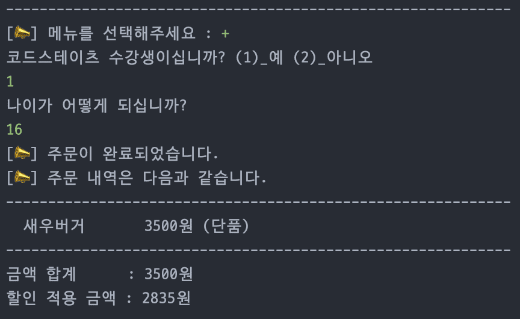

스프링 복습 및 정리 3P

<div class="cl1"></div>

## 컴포넌트 스캔과 의존성 자동 주입

<div class="cl4"></div>

**@Configuration과 @Bean을 사용한 수동 주입 방식**

```java
@Configuration
public class AppConfigurer {

    @Bean
    public Menu menu() {
        return new Menu(productRepository());
    }

    @Bean
    public ProductRepository productRepository() {
        return new ProductRepository();
    }

    @Bean
    public Cart cart() {
        return new Cart(productRepository(), menu());
    }

    @Bean
    public Order order() {
        return new Order(cart(), discount());
    }

    @Bean
    public Discount discount() {
        return new Discount(new DiscountCondition[] {
                new CozDiscountCondition(new FixedRateDiscountPolicy()),
                new KidDiscountCondition(new FixedAmountDiscountPolicy())
        });
    }
}
```

위 코드처럼 수동으로 개발자가 직접 의존 관계를 설정해 주는 일은 분명 직관적이고 유용하지만,

또 다른 한편에서 굉장히 번거롭기도 하다.

<div class="cl3"></div>

이러한 번거로움을 해결하기 위해, 스프링 프레임워크는 수동으로 클래스 구성 정보를 일일이 작성하지 않고, 

자동으로 스프링 빈을 등록하는 **컴포넌트 스캔(Component Scan) 기능**을 지원한다.

<div class="cl3"></div>

컴포넌트 스캔만으로는 앞에서 봤던 것과 같은 구체적인 의존 관계 설정이 불가능하기 때문에

**@Autowired 어노테이션**을 통해 **빈을 자동으로 등록함과 동시에 의존 관계가 설정**된다.

<div class="cl2"></div>

### 사용 예시

```java
package com.codestates.burgerqueenspring;

import org.springframework.context.annotation.ComponentScan;
import org.springframework.context.annotation.Configuration;

@Configuration
@ComponentScan
public class TestConfigurer {

}
```

@ComponentScan 이라는 이름의 새로운 애너테이션이 클래스 레벨에 붙여져 있다.

ComponentScan은 이름처럼 @Component 어노테이션이 붙은 클래스를 모두 스캔하여 자동으로 스프링 빈으로 등록한다.

<div class="cl3"></div>

위 예시에서 스캔 범위는 burgerqueenspring 디렉토리 전체이다.

만약 범위를 변경하고 싶다면, `@ComponentScan(basePackages = “스캔을 할 패키지”)` 방법으로 스캔의 범위 지정을 바꿀 수 있다.

<div class="cl3"></div>

`@Component`와 `@Autowired` 어노테이션을 사용하여 자동으로 스프링 빈 등록 및 의존 관계 설정이 되도록 작업해 보겠다.

<div class="cl3"></div>

**프로젝트 구조**

```java
com.example.myapp
|-- MyApplication.java
|-- controllers
|   |-- MyController.java
|-- services
|   |-- MyService.java
```

<div class="cl3"></div>

**컨트롤러 클래스**

```java
package com.example.myapp.controllers;

import org.springframework.beans.factory.annotation.Autowired;
import org.springframework.stereotype.Controller;
import com.example.myapp.services.MyService;

@Controller
public class MyController {

    private final MyService myService;

    @Autowired
    public MyController(MyService myService) {
        this.myService = myService;
    }

    public void doSomething() {
        myService.doServiceLogic();
    }
}
```

<div class="cl3"></div>

**서비스 클래스**

```java
package com.example.myapp.services;

import org.springframework.stereotype.Service;

@Service
public class MyService {

    public void doServiceLogic() {
        System.out.println("Service logic executed.");
    }
}
```

<div class="cl3"></div>

**애플리케이션 메인 클래스**

```java
package com.example.myapp;

import org.springframework.boot.SpringApplication;
import org.springframework.boot.autoconfigure.SpringBootApplication;
import org.springframework.context.annotation.ComponentScan;

@SpringBootApplication
@ComponentScan(basePackages = "com.example.myapp") // 컴포넌트 스캔을 할 패키지 설정
public class MyApplication {

    public static void main(String[] args) {
        SpringApplication.run(MyApplication.class, args);

        // 컨트롤러 실행
        MyController myController = new MyController(null);
        myController.doSomething();
    }
}
```

<div class="cl4"></div>

위 코드에서 `@ComponentScan` 어노테이션은 `"com.example.myapp"` 패키지와 

하위 패키지에서 `@Component` 어노테이션이 붙은 클래스들을 스캔하여 스프링 빈으로 등록한다.

<div class="cl3"></div>

`MyController` 클래스에서는 `@Autowired` 어노테이션을 사용하여 `MyService` 빈을 주입받고, `doSomething` 메서드를 실행할 때 `MyService`의 로직을 호출한다.

<div class="cl3"></div>

이렇게 설정하면 `MyController`와 `MyService`가 스프링 컨테이너에서 관리되며, 의존성 주입이 자동으로 이루어진다.

<div class="cl3"></div>

참고로 **생성자가 단 하나만 존재하는 경우에는 @Autowired 어노테이션을 붙이지 않아도 자동으로 의존 관계가 연결**된다.

```java
@Service
public class DiscountService {

    private final DiscountPolicy discountPolicy;

    // 생성자가 하나만 존재하는 경우, @Autowired 어노테이션을 사용하지 않아도 됨
    public DiscountService(DiscountPolicy discountPolicy) {
        this.discountPolicy = discountPolicy;
    }
    
    // ...
}
```

<div class="cl3"></div>

마지막으로, @Component 어노테이션만 컴포넌트 스캔의 기본 타깃에 들어가는 것은 아니다.

@Configuration, @Controller, @Service, @Repository 등의 어노테이션도 컴포넌트 스캔의 대상에 포함된다.

<div class="cl1"></div>

## @Autowired

```java
@Component
public class Discount {
    private DiscountCondition[] discountConditions;

    public Discount(DiscountCondition[] discountConditions) {
        this.discountConditions = discountConditions;
    }

    --- 생략 ---
}
```

<div class="cl4"></div>

```java
@Component
public class CozDiscountCondition implements DiscountCondition {

    --- 생략 ---
}
```

<div class="cl4"></div>

```java
@Component
public class KidDiscountCondition implements DiscountCondition {
    
	--- 생략 ---
}
```

<div class="cl4"></div>

```java
@Component
public class FixedAmountDiscountPolicy implements DiscountPolicy {

  --- 생략 ---
}
```

<div class="cl4"></div>

```java
@Component
public class FixedRateDiscountPolicy implements DiscountPolicy {

    --- 생략 ---
}
```

<div class="cl3"></div>

위 클래스들에 @Component 어노테이션을 붙이고 프로그램을 실행해 보면 에러 메시지가 뜬다.

<div class="cl2"></div>

### NoUniqueBeanDefinitionException 에러

```java
No qualifying bean of type 'com.codestates.burgerqueenspring.discount.discountPolicy.DiscountPolicy' available: expected single matching bean but found 2: fixedAmountDiscountPolicy,fixedRateDiscountPolicy
```

<div class="cl4"></div>

**하나의 빈이 매칭될 것이 예상되었는데 두 개의 빈이 발견**되었다고 한다.

<div class="cl3"></div>

CozDiscountCondition 또는 KidDiscountCondition 클래스의 입장에서 보면, DiscountPolicy 타입의 객체만 주입되면 아무런 문제가 없는데,

들어올 수 있는 선택지가 두 가지가 되어 어떤 구현 객체가 들어와야 할지 스프링에 입장에서는 알 방도가 전혀 없기 때문이다.

<div class="cl3"></div>

만약 FixedAmountDiscountPolicy 또는 FixedRateDiscountPolicy 클래스 중에 하나만 @Component를 붙인다면,

프로그램은 잘 실행되겠지만 모든 할인에 둘 중에 하나의 정책이 적용되는 문제가 발생한다.

<div class="cl3"></div>

이 문제를 해결할 수 있는 방법으로 스프링은 크게 3가지의 해결 방법을 제공한다.

1. **@Autowired 필드명 매칭**
2. **@Qualifier 사용**
3. **@Primary 사용**

<div class="cl2"></div>

### @Autowired 필드명 매칭

@Autowired는 먼저 타입으로 빈을 조회하고, 만약 2개 이상의 여러 개의 빈이 있는 경우에 필드명 또는 매개변수명으로 빈을 매칭한다.

<div class="cl4"></div>

```java
@Component
public class CozDiscountCondition implements DiscountCondition {

    private boolean isSatisfied;

    @Autowired
    private DiscountPolicy fixedRateDiscountPolicy;

//    public CozDiscountCondition(DiscountPolicy discountPolicy) {
//        this.fixedRatediscountPolicy = discountPolicy;
//    }

    --- 생략 --- 

    // 필드명 변경 
    public int applyDiscount(int price) {
        return fixedRateDiscountPolicy.calculateDiscountedPrice(price);
    }
}
```

먼저 기존의 생성자를 주석처리 한 후, 필드(참조변수)의 이름을 `discountPolicy` → `fixedRateDiscountPolicy`로 바꾸었다.

KidDiscountPolicy에도 동일하게 필드명을 `fixedAmountDiscountPolicy`로 변경 후에 프로그램을 동작시켜 보면,

이전과 같이 프로그램이 잘 작동하는 모습을 확인할 수 있다.

<div class="cl2"></div>

### @Qualifier 사용

추가적인 구분자를 통해 의존 관계를 연결하는 방식이다.

<div class="cl4"></div>

```java
@Component
@Qualifier("fixedAmount")
public class FixedAmountDiscountPolicy implements DiscountPolicy {
	
	--- 생략 ---

}
```

<div class="cl4"></div>

```java
@Component
@Qualifier("fixedRate")
public class FixedRateDiscountPolicy implements DiscountPolicy {

    --- 생략 ---

}
```

<div class="cl4"></div>

```java
@Component
public class CozDiscountCondition implements DiscountCondition {

    private boolean isSatisfied;
    private DiscountPolicy discountPolicy;

    public CozDiscountCondition(@Qualifier("fixedRate") DiscountPolicy discountPolicy) {
        this.discountPolicy = discountPolicy;
    }

    --- 생략 ---
}
```

<div class="cl4"></div>

```java
@Component
public class KidDiscountCondition implements DiscountCondition {
    private boolean isSatisfied;

    private DiscountPolicy discountPolicy;

    public KidDiscountCondition(@Qualifier("fixedAmount") DiscountPolicy discountPolicy) {
        this.discountPolicy = discountPolicy;
    }

    --- 생략 ---
}
```

<div class="cl4"></div>

@Qualifier 애너테이션은, **먼저 @Qualifier이 붙여진 추가 구분자를 통해 매칭되는 빈이 있는지 탐색하고, 매칭되는 빈이 없다면 빈의 이름으로 조회**를 진행한다.

<div class="cl3"></div>

참고로 어노테이션을 직접 커스터마이징하여 사용할 수 있는 방법도 존재한다.

<div class="cl2"></div>

### @Primary 사용

가장 빈번하게 사용되는 방식인 **@Primary 애너테이션**을 사용하여 여러 개의 빈이 들어올 수 있는 경우 빈 객체들 간 **우선순위를 설정**해 줄 수 있다.

<div class="cl4"></div>

```java
@Component
@Primary
public class FixedRateDiscountPolicy implements DiscountPolicy {

    private int discountRate = 10;

    public int calculateDiscountedPrice(int price) {
        return price - (price * discountRate / 100);
    }
}
```

<div class="cl4"></div>

CozDiscountCondition와 KidDiscountCondition 클래스의 입장에서 같은 타입의 여러 개의 빈이 조회되는 경우 우선순위를 가지는 FixedRateDiscountPolicy가 우선적으로 의존성 주입이 된다.

<div class="cl3"></div>

**출력 화면**

<p align="center"></p>

<div class="cl4"></div>

새우버거를 하나 주문한 후에, 두 가지 할인 정책이 모두 적용되도록 값을 입력해 보면, 그 결과 값이 모두 정률할인으로 적용되어 나오고 있음을 확인할 수 있다.

<div class="cl3"></div>

이런 경우 @Qualifier를 함께 사용하여 원하는 결과를 얻어낼 수 있다.

<div class="cl4"></div>

```java
@Component
public class KidDiscountCondition implements DiscountCondition {
    private boolean isSatisfied;

    private DiscountPolicy discountPolicy;

    public KidDiscountCondition(@Qualifier("fixedAmount") DiscountPolicy discountPolicy) {
        this.discountPolicy = discountPolicy;
    }

    --- 생략 ---
}
```

<div class="cl4"></div>

```java
@Component
@Qualifier("fixedAmount")
public class FixedAmountDiscountPolicy implements DiscountPolicy {

    private int discountAmount = 500;

    --- 생략 ---
}
```

<div class="cl4"></div>

이제 다시 프로그램을 동작시켜 보면 이전과 같이 잘 작동하는 모습을 확인하실 수 있다.

이처럼 빈번하게 사용되는 인스턴스를 @Primary로 해두고 상대적으로 사용 빈도가 적은 인스턴스를 @Qualifier로 지정하여 상황에 맞게 변용하여 사용할 수 있다.

