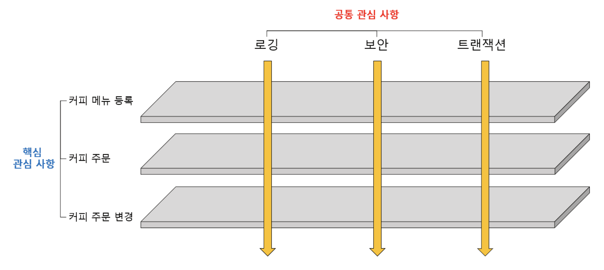
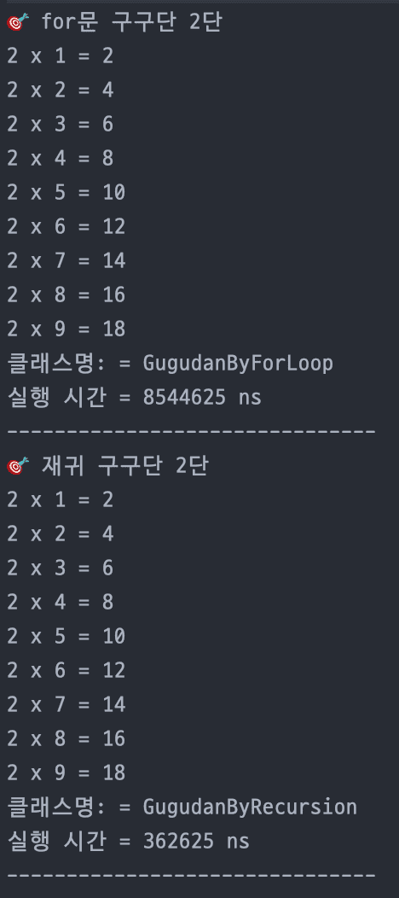
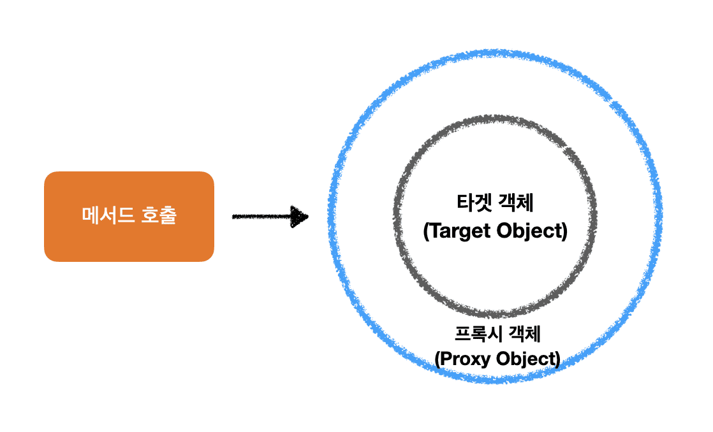
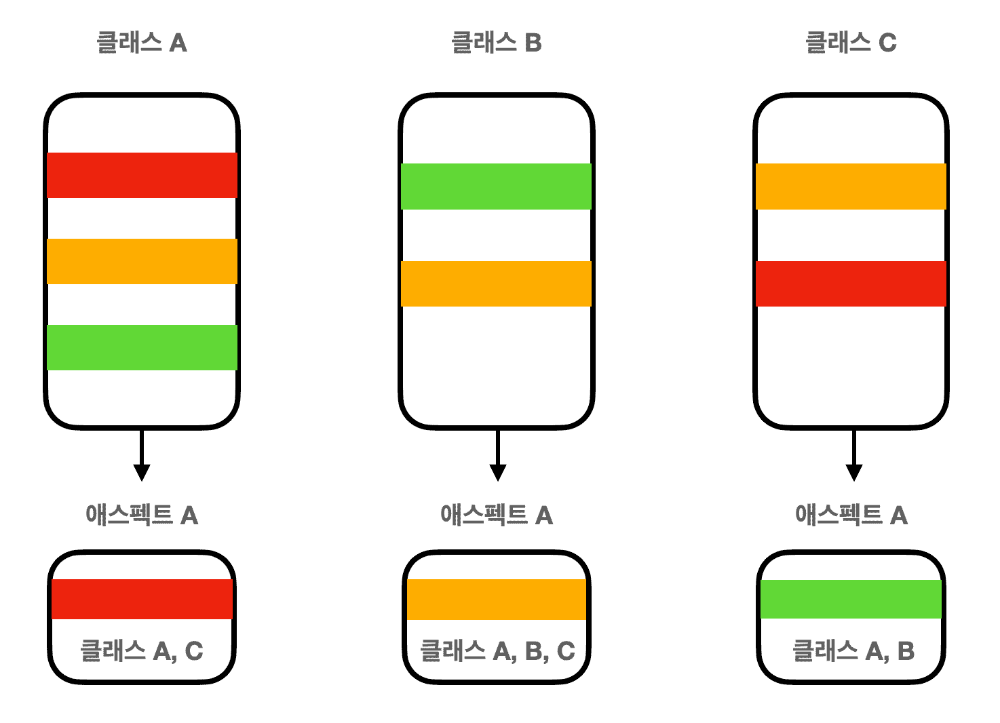
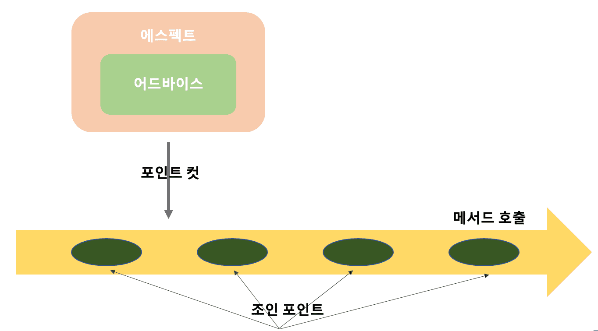
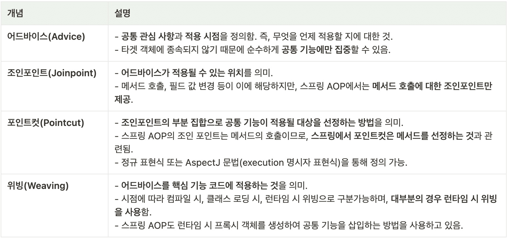
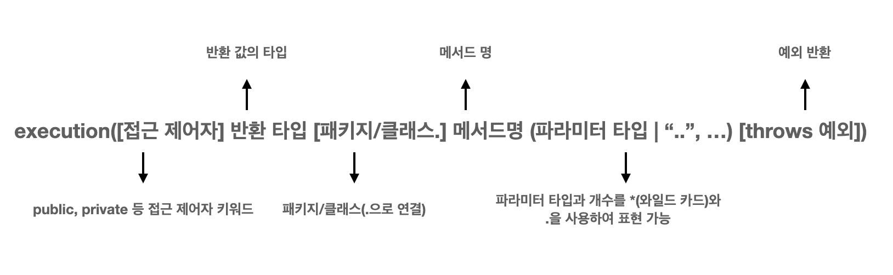
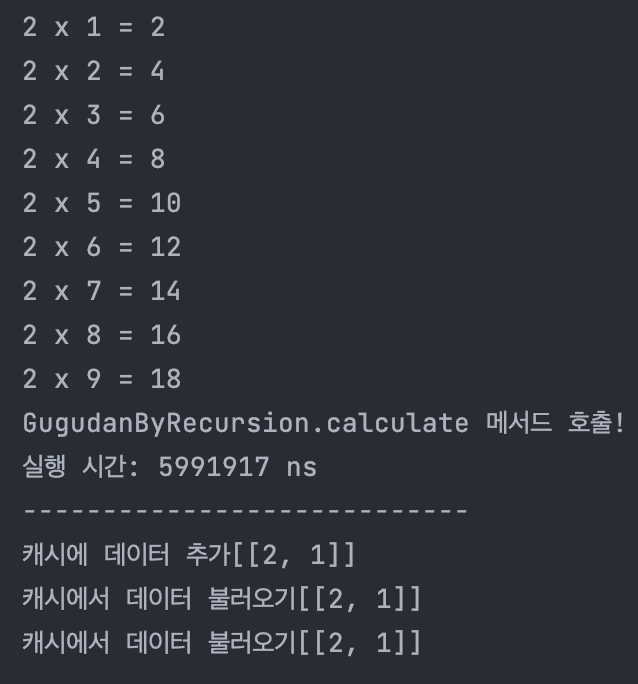
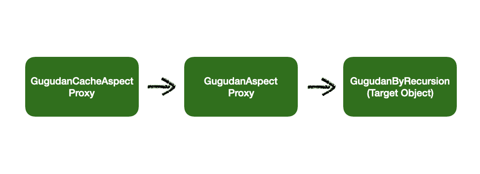
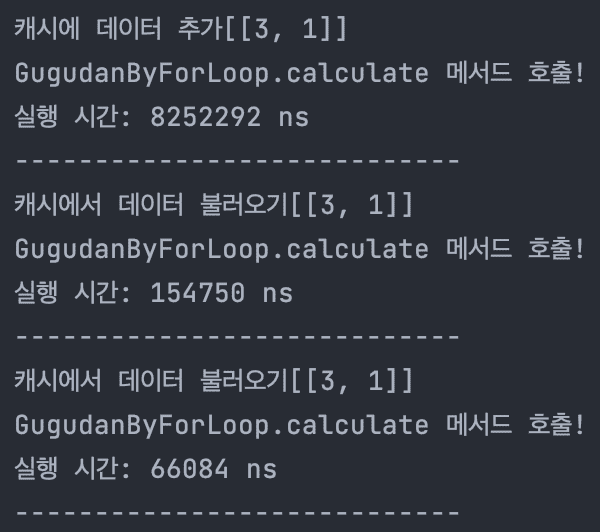

AOP (Aspect Oriented Programming 관심 지향 프로그래밍)

<div class="cl1"></div>

## AOP란?

**애플리케이션 개발의 과정에서 여러 객체에 공통적으로 적용할 수 있는 공통의 관심 사항 (Cross-cutting Concern)과**

**핵심 로직과 관련한 핵심 관심 사항(Cross-cutting concern)을 분리시키는 프로그래밍 기법**을 의미한다.

<div class="cl3"></div>

구체적인 예시로, 애플리케이션의 보안, 로깅, 트랜젝션 등 공통적인 관심 사항을 분리시켜 관리하는 것과 관련이 있다.

<div class="cl4"></div>

<p align="center"></p>

<div class="cl4"></div>

이렇게 AOP를 적용하여 공통의 관심 사항과 핵심 관심 사항의 기능을 구분하여 코드를 설계하면,

**코드의 간결성과 재사용성을 높이고, 객체지향 설계 원칙에 좀 더 부합하는 코드를 구현**할 수 있다.

<div class="cl1"></div>

## 프록시 객체

- 프록시 객체는 다른 객체에 대한 대리자 역할을 하는 객체이다. <br> 주로 AOP에서 사용되며, 핵심 객체(Core Object)에 대한 접근을 제어하고 추가 기능을 제공한다.

- 프록시 객체는 핵심 객체와 동일한 인터페이스를 구현하고, 핵심 객체에 대한 요청을 가로채서 처리할 수 있다.

- 프록시 객체를 사용하여 AOP 측면에서 관심사를 추가하거나, 핵심 객체의 메소드 호출 전/후에 추가 작업을 수행할 수 있다.

- 프록시 객체는 코드의 재사용성을 높이고, 코드 중복을 줄이며, 유지 보수성을 향상시킨다.

<div class="cl3"></div>

예를 들어, AOP를 사용하여 메소드 호출 시간을 측정하는 기능을 추가하려면 다음과 같이 프록시 객체 및 AOP 어드바이스를 정의할 수 있다.

```java
// 핵심 객체
public class MyService {
    public void doSomething() {
        // 핵심 비즈니스 로직
    }
}

// AOP 어드바이스
public class TimingAdvice {
    public void measureTime(JoinPoint joinPoint) {
        long startTime = System.currentTimeMillis();
        joinPoint.proceed(); // 핵심 객체의 메소드 실행
        long endTime = System.currentTimeMillis();
        System.out.println("메소드 실행 시간: " + (endTime - startTime) + "ms");
    }
}

// 프록시 설정
@Configuration
@EnableAspectJAutoProxy
public class AppConfig {
    @Bean
    public MyService myService() {
        return new MyService();
    }
    
    @Bean
    public TimingAdvice timingAdvice() {
        return new TimingAdvice();
    }
}
```

위의 코드에서 `TimingAdvice`는 핵심 메소드를 감싸서 실행 시간을 측정하고, `AppConfig`에서 `@EnableAspectJAutoProxy`를 사용하여 AOP를 활성화한다.

이렇게 구성하면 `MyService`의 메소드 호출 시간을 자동으로 측정할 수 있다.

<div class="cl2"></div>

### 예시

<div class="cl4"></div>

**Gugudan 인터페이스**

```java
public interface Gugudan {

    // 추상 메서드 정의
    void calculate(int level, int count);
}
```

<div class="cl3"></div>

**GugudanByForLoop 클래스**

```java
public class GugudanByForLoop implements Gugudan {

    // for문을 사용한 구구단 메서드
	  @Override
    public void calculate(int level, int number) {

       for(int count = number; count < 10; count++) {
            System.out.printf("%d x %d = %d\n", level, count, level * count);
        }
   }
}
```

<div class="cl3"></div>

**GugudanByRecursion 클래스**

```java
public class GugudanByRecursion implements Gugudan {

    // 재귀호출로 구현한 구구단
    @Override
    public void calculate(int level, int count) {
        
	if(count > 9) {
          return;
          }
        System.out.printf("%d x %d = %d\n", level, count, level*count);
        calculate(level, ++count);
    }
}
```

<div class="cl3"></div>

**GugudanProxy 클래스**

```java
public class GugudanProxy implements Gugudan {

    private Gugudan delegator;

    public GugudanProxy(Gugudan delegator) {
        this.delegator = delegator;
    }

    @Override
    public void calculate(int level, int count) {
        long start = System.nanoTime();
        delegator.calculate(2,1);
        long end = System.nanoTime();
        System.out.printf("클래스명: = %s\n", delegator.getClass().getSimpleName());
        System.out.printf("실행 시간 = %d ms\n", (end - start));
        System.out.println("-------------------------------");
    }
}
```

<div class="cl3"></div>

**GugudanTest 클래스**

```java
public class GugudanTest {

    public static void main(String[] args) {

        GugudanByForLoop gugudanByForLoop = new GugudanByForLoop();
	System.out.println("🎯 for문 구구단 2단");
        GugudanProxy proxy = new GugudanProxy(gugudanByForLoop);
        proxy.calculate(2,1);

        GugudanByRecursion gugudanByRecursion = new GugudanByRecursion();
        System.out.println("🎯 재귀 구구단 2단");
        GugudanProxy proxy2 = new GugudanProxy(gugudanByRecursion);
        proxy2.calculate(2, 1);

    }
}
```

<div class="cl3"></div>

**출력 화면**

<p align="center"></p>

<div class="cl4"></div>

이처럼 GugudanProxy 클래스와 같이 핵심 기능을 다른 객체에게 위임하고,

동시에 실행 시간 측정과 같은 부가적인 기능을 제공하는 객체를 프록시라고 부른다.

<div class="cl3"></div>

프록시의 존재로 인해 코드의 중복을 없애고, 기존 코드의 변경 없이도 실행 시간을 출력할 수 있다.

<div class="cl3"></div>

**GugudanProxy 클래스는 실행 시간 측정이라는 공통 사항 로직에 집중하고,**

**GugudanByForLoop클래스와 GugudanByRecursion 클래스에서 구구단 계산에 대한 핵심 기능을 담당하여 역할을 분리시켰다.**

<div class="cl2"></div>

## AOP의 핵심 개념

- AOP란 **공통 관심 사항과 핵심 관심 사항을 분리시켜 코드의 중복을 제거하고, 코드의 재사용성을 높이는 프로그래밍 방법론**을 의미한다.

- AOP은 **핵심 기능에 공통기능을 삽입하는 것**으로, 이를 통해 **핵심 관심 사항 코드의 변경 없이 공통 기능의 구현을 추가 또는 변경하는 것**이 가능하다.

<div class="cl3"></div>

스프링 프레임워크는 **프록시 객체를 자동으로 생성하여 AOP를 구현하는 방식**을 지원하고 있다.

<div class="cl3"></div>

참고로, 프록시를 사용하는 방법 외에도 컴파일 시점에 코드에 공통 기능을 삽입하거나

클래스 로딩 시점에 공통 기능을 삽입하는 방법이 있다. (클래스 로딩 시점, 런타임 시점)

<p align="center"></p>

스프링 AOP는 위 그림과 같이 **타깃 객체를 외부에서 프록시 객체가 한번 감싸는 구조**를 가지고 있다.

따라서, 설정에 따라 타깃 객체의 핵심 로직이 실행되기 전과 후에 공통 기능을 호출할 수 있다.

<div class="cl3"></div>

한 가지 차이는, 앞의 프록시 객체 예시에서는 프록시 객체를 직접 생성했지만,

**스프링의 경우 해당 프록시 객체를 스프링이 자동적으로 생성**해 주기 때문에 GugudanProxy 클래스와 같은 객체를 따로 만들 필요가 없다.

<div class="cl3"></div>

<p align="center"></p>

AOP에서는 공통 관심 사항에 대한 기능을 **애스펙트(Aspect)**라고 부른다.

<div class="cl3"></div>

AOP에서 첫 번째 A에 해당하는 부분이기도 한데,

공통 기능과 적용 시점을 정의한 **어드바이스(Advide)**와 어드바이스가 적용될 지점을 정의하는 **포인트컷(Pointcut)**의 조합으로 구성된다.

트랜잭션이나 보안 등이 애스펙트의 대표적인 예시이다.

<p align="center"></p>

<p align="center"></p>

**스프링에서 구현 가능한 어드바이스의 종류**는 몇 가지가 있는데, 아래와 같이 애너테이션을 사용하여 다양한 시점에 원하는 기능을 삽입할 수 있다.

- **@Before**
    - 타깃 객체의 메서드 호출 전에 공통 기능을 실행
- **@After**
    - 예외 발생 여부에 관계없이 타깃 객체의 메서드 실행 후 공통 기능을 실행
- **@AfterReturning**
    - 타깃 객체의 메서드가 예외 없이 실행되어 값을 반환한 경우 공통 기능을 실행
- **@AfterThrowing**
    - 타깃 객체의 메서드 실행 중 예외가 발생한 경우 공통 기능을 실행
- **@Around**
    - 타깃 객체의 메서드 실행 전과 후 또는 예외 발생 시 공통 기능을 실행
    - 가장 빈번하게 사용됨

<div class="cl1"></div>

## AOP 구현

**가장 먼저 해야 할 일은 공통 기능을 제공하는 Aspect 구현 클래스를 만드는 일이다.**

<div class="cl3"></div>

**GugudanAspect 클래스**

공통 관심 사항을 정의하는 Aspect 구현 클래스

```java
// (1) @Aspect
@Aspect
public class GugudanAspect {

    // (2) @PointCut
		// @Pointcut("execution(public void cal*(..))")
    @Pointcut("execution(public void com..calculate(..))")
    private void targetMethod() {}

    // (3) @Around
    @Around("targetMethod()")
    public Object measureTime(ProceedingJoinPoint joinPoint) throws Throwable {

        long start = System.nanoTime();

        try {
            Object result = joinPoint.proceed();
            return result;
        } finally {
            long end = System.nanoTime();
            Signature signature = joinPoint.getSignature();
            System.out.printf("%s.%s 메서드 호출!\n", joinPoint.getTarget().getClass().getSimpleName(), signature.getName());
            System.out.printf("실행 시간: %d ns", (end-start));
        }
    }
}
```

<div class="cl4"></div>

**(1) @Aspect**

위에서 설명한 것처럼, 애스펙트는 **공통 기능**과 그 **적용 시점을 정의한 어드바이스**,

그리고 이것을 **적용할 지점을 의미하는 포인트컷**을 포함하는데,

해당하는 부분이 각각 **(2) @Pointcut과 (3) @Around 어노테이션으로 구현**된다.

<div class="cl3"></div>

**(2) @Pointcut**

애스펙트를 적용할 위치를 지정할 때 사용하는 포인트컷의 설정을 보면 `execution()` 으로 시작되는 명시자를 사용하여 

어드바이스의 대상이 되는 메서드를 지정하고 있는데, 그 문법 구조는 아래 사진과 같다.

<div class="cl4"></div>

<p align="center"></p>

<div class="cl4"></div>

위에서 대괄호로 표시된 부분은 생략 가능하고, 각 패턴은 * 기호를 사용하여 모든 값을 표현하는 것이 가능하다.

마지막으로 점 두개(..)를 사용하여 0개 이상의 수를 표현할 수 있다.

```java
@Pointcut("execution(public void com..calculate(..))")
@Pointcut*("execution(* cal*(..))")
```

<div class="cl3"></div>

**(3) @Around**

**@Around 어노테이션은** **타깃 객체의 메서드 실행 전과 후 또는 예외가 발생했을 때 사용한다.**

<div class="cl3"></div>

@Around 어노테이션 값으로 `targerMethod()`가 정의되었는데, 이것은 `targetMethod()`에 정의한 포인트컷에 공통 기능을 적용한다는 것을 의미한다.

<div class="cl3"></div>

즉, 앞에서 정의한 대상 메서드들의 실행 전과 후에 공통 기능을 실행한다는 의미이다.

여기서 공통 기능을 실행하는 메서드는 위에서 정의한 `measureTime()`이며, 메서드 바디에 실행 시간 측정을 위한 로직이 작성된다.

<div class="cl3"></div>

`measureTime(ProceedingJoinPoint joinPoint)`의 `ProceedingJoinPoint` **타입의 매개변수는 타깃 객체의 실제 메서드를 호출할 때 사용**되는데, 아래와 같이 `proceed()` 메서드를 사용한다.

```java
Object result = joinPoint.proceed();
```

이렇게 `proceed()` 메서드를 실행하면 **실제 타깃이 되는 객체의 메서드가 호출된다.**

<div class="cl3"></div>

**공통 관심 기능 정의 & 핵심 기능 호출**

```java
@Around("targetMethod()")
public Object measureTime(ProceedingJoinPoint joinPoint) throws Throwable {

    // 핵심 기능 로직 실행 전 호출
    long start = System.nanoTime();

    try {
        // 핵심 기능 호출
        Object result = joinPoint.proceed();
        return result;
    } finally {
        // 핵심 기능 로직 실행 후 호출 
        long end = System.nanoTime();
        Signature signature = joinPoint.getSignature();
        System.out.printf("%s.%s 메서드 호출!\n", joinPoint.getTarget().getClass().getSimpleName(), signature.getName());
        System.out.printf("실행 시간: %d ns", (end-start));
    }
}
```

**ProceedingJoinPoint 인터페이스는 위의 `getSignature()` , `getTarget()` 등 호출한 메서드의 시그니처와 대상 객체를 구할 수 있는 메서드를 제공한다.**

<div class="cl3"></div>

이 외에도 **매개 변수의 목록을 불러올 수 있는 `getArgs()` 메서드**가 있다.

특별히 `getSignature()` 메서드는 Signature 타입의 값을 반환하는 데 

해당 인터페이스를 사용하여 `getName()` , `toShortString()` , `toLongString()`과 같은 메서드의 정보를 제공받을 수 있다.

<div class="cl2"></div>

### 스프링 빈 등록

**GugudanConfig 클래스**

```java
@Configuration
@EnableAspectJAutoProxy // @Aspect 애노테이션 붙인 클래스를 공통 기능으로 적용
public class GugudanConfig {

    @Bean
    public GugudanAspect gugudanAspect() {
        return new GugudanAspect();
    }

    // For문을 사용한 구구단 객체 빈 등록
    @Bean
    public Gugudan gugudan() {
        return new GugudanByForLoop();
    }
}
```

**@EnableAspectJAutoProxy 애너테이션은 스프링으로 @Aspect 애너테이션이 붙은 빈 객체를 찾아 해당 객체의 포인트컷과 어드바이스 설정을 사용**하도록 한다.

<div class="cl3"></div>

**GugudanTest 클래스**

```java
public class GugudanTest {

    public static void main(String[] args) {

        // 레거시 코드
//        GugudanByForLoop gugudanByForLoop = new GugudanByForLoop();
//        System.out.println("🎯 for문 구구단 2단");
//        GugudanProxy proxy = new GugudanProxy(gugudanByForLoop);
//        proxy.calculate(2,1);
//
//        GugudanByRecursion gugudanByRecursion = new GugudanByRecursion();
//        System.out.println("🎯 재귀 구구단 2단");
//        GugudanProxy proxy2 = new GugudanProxy(gugudanByRecursion);
//        proxy2.calculate(2, 1);

        AnnotationConfigApplicationContext annotationConfigApplicationContext = new AnnotationConfigApplicationContext(GugudanConfig.class);

        Gugudan gugudan = annotationConfigApplicationContext.getBean("gugudan", Gugudan.class);
        gugudan.calculate(2,1);
    }
}
```

<div class="cl1"></div>

## 여러 개의 Advice 사용

경우에 따라, 하나의 포인트컷에 여러 개의 어드바이스를 적용할 수도 있다.

<div class="cl3"></div>

**GugudanCacheAspect 클래스**

```java
@Aspect
public class GugudanCacheAspect {

    // 캐시 저장소
    private List<Object> cashe = new ArrayList<>();

    // 포인트컷 적용
    @Pointcut("execution(* cal*(..))")
    public void cacheTarget() {
    }

    // 어드바이스 정의
    @Around("cacheTarget()")
    public Object execute(ProceedingJoinPoint joinPoint) throws Throwable {

        // 데이터 초기화
        Object[] argumentObject = joinPoint.getArgs();
        String argumentToString = Arrays.toString(argumentObject);

        // 만약 데이터가 있다면, 캐시에서 꺼내서 전달
        if(cashe.size() != 0) {
            for (Object element : cashe) {

                String elementToString = Arrays.toString((Object[]) element);

                if (elementToString.equals(argumentToString)) {
                    System.out.printf("캐시에서 데이터 불러오기[%s]\n", elementToString);
                    return elementToString;
                }
            }
        }

        // 데이터가 없다면, 타깃 객체의 메서드를 호출하여 캐시에 데이터 추가 
        Object result = joinPoint.proceed();
        cashe.add(argumentObject);
        System.out.printf("캐시에 데이터 추가[%s]\n", Arrays.toString(argumentObject));

        return result;
    }
}
```

위의 코드는 간단하게 캐시 기능을 구현한 새로운 애스펙트를 보여준다.

@Around의 값으로 **cacheTarget()** 메서드를 설정했다.

<div class="cl3"></div>

먼저 ArrayList로 캐시 저장소를 만든 다음,

만약 받아온 데이터와 일치하는 값이 있는 경우에는 캐시에서 데이터를 불러와 리턴하고

그렇지 않은 경우에는 타깃 객체의 메서드를 호출하여 캐시에 새로운 데이터를 추가하도록 했다.

편의상 실제 데이터는 불러오지 않고 “캐시에서 데이터 불러오기”라는 문구만 출력한다.

이렇게 구현한 새로운 애스펙트를 구성 클래스에 추가해서 사용해 보도록 하겠다.

<div class="cl3"></div>

**GugudanConfig 구성 클래스**

```java
@Configuration
@EnableAspectJAutoProxy
public class GugudanConfig {

    // 새로운 애스펙트 추가
    @Bean
    public GugudanCacheAspect casheAspect() {
        return new GugudanCacheAspect();
    }

    @Bean
    public GugudanAspect gugudanAspect() {
        return new GugudanAspect();
    }

    @Bean
    public Gugudan gugudan() {
        return new GugudanByRecursion();
    }
}
```

<div class="cl3"></div>

**GugudanTest 클래스**

```java
public class GugudanTest {

    public static void main(String[] args) {

        AnnotationConfigApplicationContext annotationConfigApplicationContext = new AnnotationConfigApplicationContext(GugudanConfig.class);

        Gugudan gugudan = annotationConfigApplicationContext.getBean("gugudan", Gugudan.class);

        // 동일한 방법으로 메서드 3번 호출
        gugudan.calculate(2,1);
        gugudan.calculate(2,1);
        gugudan.calculate(2,1);

    }
}
```

<div class="cl3"></div>

**출력 결과**

<div class="cl4"></div>

<p align="center"></p>

<div class="cl4"></div>

실행시간에 대한 공통 관심 사항은 GugudanAspect가, 캐시에 대한 공통 기능은 GugudanCacheAspect가 출력하고 있다.

<div class="cl3"></div>

또한, 캐시 기능이 잘 적용되어 동일한 방식으로 메서드를 3번 호출했을 때

첫 번째 호출에서만 GugudanAspect와 GugudanCacheAspect가 모두 동작하고, 나머지 두 번은 캐시에 대한 공통 기능만 사용된 것을 확인할 수 있다.

<div class="cl3"></div>

이러한 출력 흐름이 발생된 것은 두 개의 어드바이스가 다음의 순서로 적용되었기 때문이다.

<p align="center"></p>

<div class="cl3"></div>

위의 GugudanTest 클래스에서 `getBean()` 메서드를 사용하여 조회할 수 있는 빈 객체의 타입은 GugudanCacheAspect 프록시 객체이다.

```java
annotationConfigApplicationContext.getBean("gugudan", Gugudan.class);
```

<div class="cl3"></div>

그리고 GugudanCacheAspect 프록시 객체의 타깃 객체는 다시 GugudanAspect이며,

최종적으로 GugudanAspect 프록시 객체가 그 타깃 객체인 GugudanByRecursion 구현 객체의 메서드를 호출하는 식이다.

<div class="cl3"></div>

좀 더 구체적으로 코드를 통해 확인해 보면

가장 먼저, GugudanTest의 `gugudan.calculate(2,1)` 메서드가 실행되면 위의 그림처럼 GugudanCacheAspect 프록시 객체가 동작한다.

<div class="cl3"></div>

**GugudanCacheAspect 클래스**

```java
@Aspect
public class GugudanCacheAspect {

    // 캐시 저장소
    private List<Object> cashe = new ArrayList<>();

    --- 생략 ---

    // 어드바이스 정의
    @Around("cacheTarget()")
    public Object execute(ProceedingJoinPoint joinPoint) throws Throwable {

        --- 생략 ---

        // (1) 데이터가 없기 때문에 joinPoint.proceed() 호출
        Object result = joinPoint.proceed();

        // (5) 캐시에 데이터 추가 및 메시지 출력
        cashe.add(argumentObject);
        System.out.printf("캐시에 데이터 추가[%s]\n", Arrays.toString(argumentObject));

        return result;
    }
}
```

최초 호출 시 데이터가 없기 때문에 (1) `joinPoint.proceed()` 메서드가 호출이 되는데,

그 대상 객체가 GugudanAspect 프록시 객체이기 때문에 해당 객체의 `measureTime()` 메서드가 실행된다.

<div class="cl3"></div>

**GugudanAspect 클래스**

```java
@Aspect
public class GugudanAspect {

    --- 생략 --- 

    @Around("targetMethod()")
    public Object measureTime(ProceedingJoinPoint joinPoint) throws Throwable {

        long start = System.nanoTime();

        try {
            // (2) 실제 타깃 객체 메서드 호출 -> GugudanByRecursion 클래스 메서드 호출
            Object result = joinPoint.proceed();
            return result;
        } finally {
            // (4) 실행 시간을 측정하여 출력
            long end = System.nanoTime();
            Signature signature = joinPoint.getSignature();
            System.out.printf("%s.%s 메서드 호출!\n", joinPoint.getTarget().getClass().getSimpleName(), signature.getName());
            System.out.printf("실행 시간: %d ns\n", (end-start));
            System.out.println("----------------------------");
        }
    }
}
```

<div class="cl3"></div>

**GugudanByRecursion 클래스**

```java
public class GugudanByRecursion implements Gugudan {

    // (3) 실제 타깃 객체 메서드 호출
    @Override
    public void calculate(int level, int count) {

        if(count > 9) {
            return;
        }
        System.out.printf("%d x %d = %d\n", level, count, level*count);
        calculate(level, ++count);;
    }
}
```

<div class="cl3"></div>

`measureTime` 메서드는 위와 같이 다시 (2) - (3) 실제 타깃 객체 메서드인 GugudanByRecursion의 `calculate(int level, int count)` 메서드를 실행하고, 이어서 (4) 실행 시간을 측정하여 출력한다.

<div class="cl3"></div>

마지막으로, 다시 GugudanCacheAspect 클래스에서 (5) 반환된 값을 캐시에 새롭게 추가하고, 이를 확인하는 메시지를 출력한다.

그러나 두 번째 `gugudan.calculate(2,1)` 호출부터는 캐시 기능을 통해 기존에 저장된 데이터가 반환되기 때문에 GugudanAspect 클래스는 실행되지 않는다.

<div class="cl3"></div>

어드바이스가 적용되는 순서는 GugudanCacheAspect 프록시 ⇒ GugudanAspect 프록시 ⇒ GugudanByRecursion 객체 순이며,

이에 따라 각각 해당하는 메서드가 순차적으로 호출되는 것을 눈으로 확인할 수 있다.

<div class="cl3"></div>

만약 이 순서를 바꾸고 싶다면 아래와 같이 @Order 어노테이션을 이용해 아래와 같이 사용할 수 있다.

<div class="cl3"></div>

**GugudanAspect 클래스**

```java
@Aspect
@Order(value = 1) // 🛑 추가 
public class GugudanAspect {

    --- 생략 ---

}
```

<div class="cl3"></div>

**GugudanCasheAspect 클래스**

```java
@Aspect
@Order(value = 2) // 🛑 추가 
public class GugudanCacheAspect {

    --- 생략 ---

}
```

<div class="cl3"></div>

**출력 결과**

<div class="cl4"></div>

<p align="center"></p>

