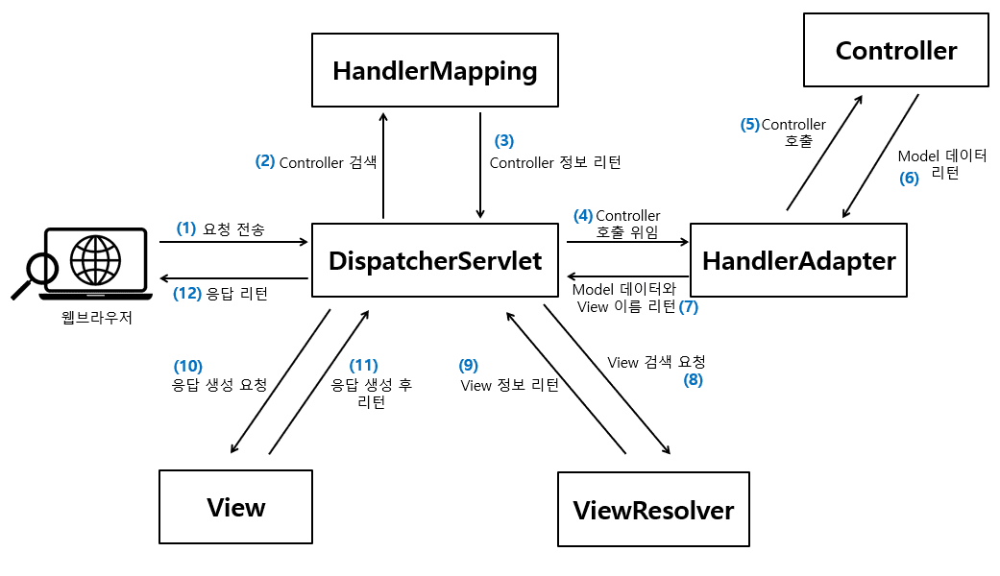

스프링 복습 및 정리 5P

<div class="cl1"></div>

## Spring MVC(Model-View-Controller)란?

스프링 프레임워크를 기반으로 웹 애플리케이션을 개발하기 위한 웹 애플리케이션 아키텍처 패턴 중 하나이다.

이 패턴은 애플리케이션을 세 가지 주요 컴포넌트로 분리하여 관리하며,

각 컴포넌트의 역할과 책임을 확실히 정의하여 개발의 구조화와 유지보수를 쉽게 만들어준다.

<div class="cl2"></div>

### Model

Model은 애플리케이션의 데이터와 비즈니스 로직을 나타낸다.

데이터베이스에서 데이터를 읽거나 저장하고, 비즈니스 로직을 수행하며, 이 정보를 뷰에 전달한다.

<div class="cl3"></div>

Spring MVC 기반의 웹 애플리케이션이 클라이언트의 요청을 전달받으면 요청 사항을 처리하기 위한 작업을 한다.

이렇게 처리한 작업의 결과 데이터를 클라이언트에게 응답으로 돌려줘야 하는데,

이때 클라이언트에게 응답으로 돌려주는 **작업의 처리 결과 데이터를 Model**이라고 한다.

<div class="cl3"></div>

> 클라이언트의 요청 사항을 구체적으로 처리하는 영역을 **서비스 계층**이라고 하며, <br> 실제로 요청 사항을 처리하기 위해 Java 코드로 구현한 것을 **비즈니스 로직**이라고 한다.

<div class="cl3"></div>
<div class="downLine2"></div>
<div class="cl3"></div>

### View

뷰는 사용자에게 데이터를 보여주는 역할을 한다.

사용자 인터페이스(UI)와 관련된 부분을 담당하며, 모델의 데이터를 사용자가 이해할 수 있는 형태로 표현한다.

<div class="cl3"></div>

**View는 앞에서 설명한 Model 데이터를 이용해서 웹 브라우저 같은 클라이언트 애플리케이션의 화면에 보이는 리소스를 제공하는 역할을 한다.**

<div class="cl3"></div>

View 형태는 아래와 같이 나눌 수 있다.

<div class="cl4"></div>

- **HTML 페이지의 출력**
    - 기본적인 HTML 태그로 구성된 페이지에 Model 데이터를 채워 넣은 후, 최종적인 HTML 페이지를 만들어 클라이언트 측에 전송해 준다.
    - Spring MVC에서 지원하는 HTML 페이지 출력 기술은 Thymeleaf, FreeMarkerm JSP+, JSTL, Tiles 등이 있다.

> 이 방식은 프론트엔드와 백엔드가 통합된 구조이다. 

<div class="cl4"></div>

- **PDF, Excel 등의 문서 형태로 출력**
    - Model 데이터를 가공해서 PDF of Excel 문서를 만들어서 클라이언트 측에 전송하는 방식이다.
    - 문서 내에서 데이터가 동적으로 변경되어야 하는 경우 사용할 수 있는 방식이다.

<div class="cl3"></div>

- **XML, JSON 등 특정 형식의 포맷으로의 변환**
    - Model 데이터를 특정 프로토콜 형태로 변환해서 변환된 데이터를 클라이언트 측에 전송하는 방식이다.

<div class="cl3"></div>
<div class="downLine2"></div>
<div class="cl3"></div>

### Controller

컨트롤러는 모델과 뷰 사이의 중개자 역할을 한다.

사용자의 요청을 처리하고, 모델을 업데이트하고, 적절한 뷰를 선택하여 결과를 사용자에게 반환한다.

스프링 MVC에서 컨트롤러는 Java 클래스로 구현되며, 요청을 처리하기 위해 메서드 단위로 매핑된다.

<div class="cl3"></div>

정리하자면, 클라이언트 측의 요청을 전달받아서 비즈니스 로직을 거친 후에 Model 데이터가 만들어지면,

이 Model 데이터를 View로 전달하는 역할이다.

```java
@RestController
@RequestMapping(path = "/v1/coffee")
public class CoffeeController {                 
    private final CoffeeService coffeeService;

    CoffeeController(CoffeeService coffeeService) {
        this.coffeeService = coffeeService;
    }

    @GetMapping("/{coffee-id}")  // (1)
    public Coffee getCoffee(@PathVariable("coffee-id") long coffeeId) {
        return coffeeService.findCoffee(coffeeId); // (2)
    }
}
```

(1)의 `@Getmapping` 어노테이션을 통해 클라이언트 측의 요청을 수신한다.

(2)에서 `CoffeeService` 클래스의 `findCoffee()` 메서드를 호출해서 비즈니스 로직을 처리한다.

(2)에서 비즈니스 로직을 처리한 다음 리턴 받는 Coffee가 Model 데이터가 된다.

<div class="cl3"></div>
<div class="downLine2"></div>
<div class="cl3"></div>

Spring MVC는 이러한 컴포넌트들을 조합하여 웹 애플리케이션을 구축하고 관리할 수 있도록 지원한다.

또한 다양한 기능을 제공하여 RESTful 웹 서비스와 같은 다양한 웹 애플리케이션을 개발할 수 있다.

<div class="cl3"></div>

**Spring MVC 내부에서는 서블릿을 기반으로 웹 애플리케이션이 동작**한다. (**`spring-webmvc` 모듈이 Spring MVC이다.**)

서블릿은 **클라이언트의 요청을 처리하도록 특정 규약에 맞추어서 Java 코드로 작성하는 클래스 파일**이다.

그리고 **아파치 톰캣**은 이러한 서블릿들이 웹 애플리케이션으로 실행이 되도록 해주는 **서블릿 컨테이너** 중 하나이다.

<div class="cl3"></div>

Model, View, Controller 간의 처리 흐름은 최종적으로 아래와 같다.

**Client가 요청 데이터 전송 →**

**Controller가 요청 데이터 수신 → 비즈니스 로직 처리 → Model 데이터 생성 →**

**Controller에게 Model 데이터 전달 → Controller가 View에게 Model 데이터 전달 →**

**View가 응답 데이터 생성**

<div class="cl1"></div>

## Spring MVC의 동작 방식과 구성 요소

<p align="center"></p>

(1) 클라이언트가 요청을 전송하면 DispatcherServlet 이라는 클래스에 요청이 전달된다.

<div class="cl4"></div>

(2) DispatcherServlet은 **클라이언트의 요청을 처리할 Controller에 대한 검색**을 HandlerMapping 인터페이스에게 요청한다.

<div class="cl4"></div>

(3) HandlerMapping은 **클라이언트 요청과 매핑되는 핸들러 객체를 다시 DispatcherServlet에게 리턴**해준다.

> 핸들러 객체는 해당 핸들러의 Handler 메서드 정보를 포함하고 있다. <br> Handler 메서드는 Controller 클래스 안에 구현된 요청 처리 메서드를 의미한다.

<div class="cl4"></div>

(4) **실제로 클라이언트 요청을 처리할 Handler 메서드**를 찾아서 호출해야 한다.

DispatcherServlet은 Handler 메서드를 직접 호출하지 않고, HandlerAdapter에게 **Handler 메서드 호출을 위임**한다.

<div class="cl4"></div>

(5) HandlerAdapter는 DispatcherServlet으로부터 전달받은 Controller 정보를 기반으로 **해당 Controller의 Handler 메서드를 호출**한다.

<div class="cl4"></div>

(6) Controller의 Handler 메서드는 비즈니스 로직 처리 후 리턴 받은 **Model 데이터를 HandlerAdapter에게 전달**한다.

<div class="cl4"></div>

(7) HandlerAdapter는 전달받은 **Model 데이터와 View 정보를 다시 DispatcherServlet에게 전달**한다.

<div class="cl4"></div>

(8) DispatcherServlet은 전달받은 View 정보를 다시 ViewResolver에게 **전달해서 View 검색을 요청**한다.

<div class="cl4"></div>

(9) ViewResolver는 View 정보에 해당하는 View를 찾아서 View를 다시 리턴해준다.

<div class="cl4"></div>

(10) DispatcherServlet은 ViewResolver로부터 전달받은 View 객체를 통해 Model 데이터를 넘겨주면서 클라이언트에게 전달할 **응답 데이터 생성을 요청**한다.

<div class="cl4"></div>

(11) View는 응답데이터를 생성해서 다시 DispatcherServlet에게 전달한다.

<div class="cl4"></div>

(12) DispatcherServlet은 **View로부터 전달받은 응답 데이터를 최종적으로 클라이언트에게 전달**한다.

<div class="cl3"></div>

**DispatcherServlet의 역할**

DispatcherServlet이 굉장히 많은 일은 하는 것처럼 보이지만 실제로 요청에 대한 처리는 다른 구성 요소들에게 **위임(Delegate)**하고 있다.

<div class="cl4"></div>

이처럼 DispatcherServlet이 애플리케이션의 가장 앞단에 배치돼서 다른 구성요소들과 상호작용하면서 클라이언트의 요청을 처리하는 패턴을 **front Controller Pattern**이라고 한다.

