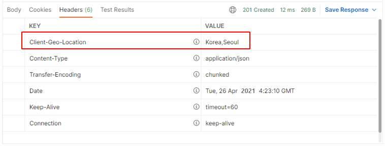

HTTP Header, Rest Client

<div class="cl1"></div>

## HTTP Header란?

HTTP 요청 및 응답 메시지의 메타 정보를 포함하는 부분이다.

웹 브라우저와 웹 서버 간의 통신을 제어하고 다양한 정보를 전달하는 데 사용된다.

<div class="cl3"></div>

HTTP헤더는 크게 두 가지로 나눌 수 있다.

<div class="cl3"></div>

**요청 헤더 (Request Header)**

클라이언트가 웹 서버에게 요청을 보낼 때 전달하는 정보이다.

이 헤더에는 클라이언트의 정보, 요청의 형식, 요청이 어떤 자원을 대상으로 하는지 등의 정보가 포함된다.

```bash
GET /index.html HTTP/1.1
Host: www.example.com
User-Agent: Mozilla/5.0 (Windows NT 10.0; Win64; x64)
Accept: text/html,application/xhtml+xml,application/xml;q=0.9,image/webp,image/apng,*/*;q=0.8
```

<div class="cl3"></div>

**응답 헤더 (Response Header)**

웹 서버가 클라이언트에게 응답을 보낼 때 포함되는 정보이다.

이 헤더에는 서버의 정보, 응답의 상태, 응답 본문의 형식 등이 포함된다.

```yaml
HTTP/1.1 200 OK
Content-Type: text/html; charset=UTF-8
Server: Apache/2.4.29 (Ubuntu)
Content-Length: 1234
```

<div class="cl3"></div>

HTTP 헤더는 다양한 역할을 수행할 수 있으며, 주요 역할은 다음과 같다.

- **인증 및 보안** : 클라이언트 및 서버 간의 인증 및 보안 관련 정보를 포함할 수 있다.
- **캐싱** : 리소스를 캐싱하고 캐시된 리소스를 관리하기 위한 지시사항을 제공한다.
- **콘텐츠 협상** : 클라이언트가 원하는 콘텐츠 형식 및 언어를 지정하는 데 사용된다.
- **세션 관리** : 세션 식별자 및 관리를 위한 정보를 포함할 수 있다.
- **사용자 에이전트 정보** : 클라이언트의 소프트웨어 및 기기 정보를 포함할 수 있다.

<div class="cl1"></div>

## HTTP Header의 사용 목적

### 클라이언트와 서버 관점에서의 HTTP 해더

클라이언트와 서버의 관점에서 내부적으로 가장 많이 사용되는 헤더 정보로 **Content-Type**이 있다.

클라이언트와 서버는 이 **Content-Type**이 명시된 데이터 형식에 맞는 데이터들을 주고받는 것이다.

<div class="cl3"></div>

**Content-Type 이란?**

HTTP 헤더 중 하나로, 전송되는 리소스의 컨텐츠 유형을 명시한다.

이 헤더는 클라이언트에게 전달된 리소스의 형식을 알려주며, 이를 기반으로 클라이언트는 리소스를 어떻게 처리할지 결정한다.

<div class="cl3"></div>

Content-Type이 text/html인 경우, 클라이언트는 해당 리소르를 HTML 문서로 해석한다.

application/json이라면, 클라이언트는 이를 JSON 데이터로 처리한다.

<div class="cl4"></div>

```yaml
Content-Type: text/html; charset=utf-8
```

위에서 text/html은 컨텐츠의 주요 유형을 나타내고, charset=utf-8은 해당 리소스의 문자 인코딩 방식을 나타낸다.

<div class="cl2"></div>

### 개발자들이 직접 실무에서 사용하는 대표적인 HTTP 헤더

클라이언트와 서버 관점에서의 HTTP 헤더들은 개발자가 건드릴 일은 많지 않다.

개발자가 직접 코드 레벨에서 HTTP 헤더를 컨트롤해야 될 경우가 있는데 예를 들어보겠다.

<div class="cl3"></div>

**Authorization** [더 알아보기](https://preasim.github.io/36)

Authorization 헤더 정보는 클라이언트가 적절한 자격 증명을 가지고 있는지를 확인하기 위한 정보이다.

<div class="cl4"></div>

일반적으로 REST API 기반 애플리케이션의 경우 클라이언트와 서버 간의 로그인 인증에 통과한 클라이언트들은 Authorization 헤더 정보를 기준으로 인증에 통과한 클라이언트가 맞는지 확인하는 절차를 거친다.

<div class="cl3"></div>

**User-Agent**

실무에서 애플리케이션을 구현하다 보면 여러 가지 유형의 클라이언트가 하나의 서버 애플리케이션에 요청을 전송하는 경우가 굉장히 많다.

<div class="cl4"></div>

데스크 탑에서 들어오는 요청과 모바일에서 들어오는 요청을 구분해서 응답 데이터를 다르게 보내줘야 되는 경우가 있을 수 있다.

<div class="cl4"></div>

예를 들면, 모바일 화면과 데스크톱 또는 노트북의 화면 크기의 차이가 많이 나기 때문에 더 큰 화면에서 더 많은 정보를 보여주기 위해 각각 데이터의 종류와 크기가 다를 수 있다.

<div class="cl4"></div>

이 경우, User-Agent 정보를 이용해서 모바일 에이전트에서 들어오는 요청인지 모바일 이외에 다른 에이전트에서 들어오는 요청인지를 구분해서 처리할 수 있다.

<div class="cl1"></div>

## HTTP Request Header 정보 얻기

### @RequestHeader

**개별 헤더 정보 받기**

```java
@RestController
@RequestMapping(path = "/v1/coffees")
public class CoffeeController {
    @PostMapping
    public ResponseEntity postCoffee(@RequestHeader("user-agent") String userAgent,
                                     @RequestParam("korName") String korName,
                                     @RequestParam("engName") String engName,
                                     @RequestParam("price") int price) {
        System.out.println("user-agent: " + userAgent);
        return new ResponseEntity<>(new Coffee(korName, engName, price),
                HttpStatus.CREATED);
    }
}
```

<div class="cl3"></div>

**전체 헤더 정보 받기**

```java
@RestController
@RequestMapping(path = "/v1/members")
public class MemberController {
    @PostMapping
    public ResponseEntity postMember(@RequestHeader Map<String, String> headers,
                                     @RequestParam("email") String email,
                                     @RequestParam("name") String name,
                                     @RequestParam("phone") String phone) {
        for (Map.Entry<String, String> entry : headers.entrySet()) {
            System.out.println("key: " + entry.getKey() +
                    ", value: " + entry.getValue());
        }

        return new ResponseEntity<>(new Member(email, name, phone),
                HttpStatus.CREATED);
    }
}
```

<div class="cl3"></div>

PostMember() 요청 결과

```bash
key: user-agent, value: PostmanRuntime/7.29.0
key: accept, value: */*
key: cache-control, value: no-cache
key: postman-token, value: 6082ccc2-3195-4726-84ed-6a2009cbae95
key: host, value: localhost:8080
key: accept-encoding, value: gzip, deflate, br
key: connection, value: keep-alive
key: content-type, value: application/x-www-form-urlencoded
key: content-length, value: 54
```

<div class="cl2"></div>

### HttpServletRequest

```java
@RestController
@RequestMapping(path = "/v1/orders")
public class OrderController {
    @PostMapping
    public ResponseEntity postOrder(HttpServletRequest httpServletRequest,
                                    @RequestParam("memberId") long memberId,
                                    @RequestParam("coffeeId") long coffeeId) {
        System.out.println("user-agent: " + httpServletRequest.getHeader("user-agent"));

        return new ResponseEntity<>(new Order(memberId, coffeeId),
                HttpStatus.CREATED);
    }
}
```

`HttpServletRequest` 객체를 통해서 Request 헤더 정보를 얻을 수 있다.

`HttpServletRequest`는 다양한 API를 지원하지만 단순히 특정 헤더 정보에 접근하고자 한다면 앞서 설명한 `@RequestHeader`를 이용하는 편이 낫다.

<div class="cl2"></div>

### HttpEntity

Spring MVC에서는 HttpEntity 객체를 통해서도 헤더 정보를 읽을 수 있다.

HttpEntity는 Request 헤더와 바디 정보를 래핑하고 있으며, 조금 더 쉽게 헤더와 바디에 접근할 수 있는 다양한 API를 지원한다.

```java
@RestController
@RequestMapping(path = "/v1/coffees")
public class CoffeeController{
    @PostMapping
    public ResponseEntity postCoffee(@RequestHeader("user-agent") String userAgent,
                                     @RequestParam("korName") String korName,
                                     @RequestParam("engName") String engName,
                                     @RequestParam("price") int price) {
        System.out.println("user-agent: " + userAgent);
        return new ResponseEntity<>(new Coffee(korName, engName, price),
                HttpStatus.CREATED);
    }

    @GetMapping
    public ResponseEntity getCoffees(HttpEntity httpEntity) {
        for(Map.Entry<String, List<String>> entry : httpEntity.getHeaders().entrySet()){
            System.out.println("key: " + entry.getKey()
                    + ", " + "value: " + entry.getValue());
        }

        System.out.println("host: " + httpEntity.getHeaders().getHost());
        return null;
    }
}
```

getXXXX() 메서드는 자주 사용되는 헤더 정보만 얻어올 수 있으므로 

getXXXX() 메서드로 원하는 헤더 정보를 읽어올 수 없다면 

get() 메서드를 사용해서 `get(”host”)`와 같이 해당 헤더 정보를 얻을 수 있다.

<div class="cl3"></div>

출력 결과

```bash
key: user-agent, value: [PostmanRuntime/7.29.0]
key: accept, value: [*/*]
key: cache-control, value: [no-cache]
key: postman-token, value: [368ad61b-b196-4f75-9222-b9a5af750414]
key: host, value: [localhost:8080]
key: accept-encoding, value: [gzip, deflate, br]
key: connection, value: [keep-alive]
host: localhost:8080
```

<div class="cl1"></div>

## HTTP Response Header 정보 추가

### ResponseEntity와 HttpHeaders

```java
@RestController
@RequestMapping(path = "/v1/members")
public class MemberController{
    @PostMapping
    public ResponseEntity postMember(@RequestParam("email") String email,
                                     @RequestParam("name") String name,
                                     @RequestParam("phone") String phone) {
        // (1) 위치 정보를 헤더에 추가
        HttpHeaders headers = new HttpHeaders();
        headers.set("Client-Geo-Location", "Korea,Seoul");

        return new ResponseEntity<>(new Member(email, name, phone), headers,
                HttpStatus.CREATED);
    }
}
```

<div class="cl3"></div>

실행 결과

<p align="center"></p>

<div class="cl2"></div>

### HttpServletResponse

```java
@RestController
@RequestMapping(path = "/v1/members")
public class MemberController{
    @GetMapping
    public ResponseEntity getMembers(HttpServletResponse response) {
        response.addHeader("Client-Geo-Location", "Korea,Seoul");

        return null;
    }
}
```

`HttpServletResponse`의 `addHeader()` 메서드 역시 `HttpHeaders`의 `set()` 메서드와 메서드 이름만 다를 뿐 헤더 정보를 추가하는 방법은 같다.

한 가지 차이점은 `HttpHeaders` 객체는 `ResponseEntity`에 포함을 시키는 처리가 필요하지만 `HttpServletResponse` 객체는 헤더 정보만 추가할 뿐 별도의 처리가 필요 없다.

<div class="cl4"></div>

<div class="callout">
  <div class="callout-in">
    <p>HttpServletRequest와 HttpServletResponse는 저수준(Low Level)의 서블릿 API를 사용할 수 있기 때문에 복잡한 HTTP Request/Response를 처리하는 데 사용할 수 있다.</p>
    <div class="cl4"></div>
    <p>반면에 ResponseEntity나 HttpHeaders는 Spring에서 지원하는 고수준(High Level) API로써 간단한 HTTP Request/Response 처리를 빠르게 진행할 수 있다.</p>
    <div class="cl4"></div>
    <p>복잡한 처리가 아니라면 코드의 간결성이나 생산성 면에서 가급적 Spring에서 지원하는 고수준 API를 사용하길 권장한다.</p>
  </div>
</div>

<div class="cl4"></div>

## 참고 자료

**HTTP 헤더(Header)**  [더 알아보기](https://developer.mozilla.org/ko/docs/Web/HTTP/Headers)

<div class="cl4"></div>

**HttpServletRequest API Docs** [더 알아보기](https://docs.oracle.com/javaee/7/api/index.html?javax/servlet/http/HttpServletRequest.html)

<div class="cl4"></div>

**HttpServletResponse API Docs** [더 알아보기](https://docs.oracle.com/javaee/7/api/index.html?javax/servlet/http/HttpServletResponse.html)

<div class="cl4"></div>

**User Agent** [더 알아보기](https://developer.mozilla.org/en-US/docs/Web/HTTP/Headers/User-Agent)

<div class="cl4"></div>

**Google Cloud Load Balancing 사례** [더 알아보기](https://cloud.google.com/load-balancing/docs/user-defined-request-headers?hl=ko)

<div class="cl4"></div>

**AWS Elastic Load Balancing 사례** [더 알아보기](https://docs.aws.amazon.com/ko_kr/elasticloadbalancing/latest/application/x-forwarded-headers.html)

<div class="cl1"></div>

## Rest Client란?

Rest Client란 말 그대로 Rest API 서버에 HTTP 요청을 보낼 수 있는 클라이언트 툴 또는 라이브러리를 의미한다.

애플리케이션을 만들면서 사용하는 Postman은 UI가 갖춰진 Rest Client라고 보면 된다.

<div class="cl3"></div>

UI가 없는 Backend A의 애플리케이션 내부에서 Backend B의 애플리케이션에 HTTP 요청을 보내려면 Rest Client 라이브러리를 사용하면 된다.

<div class="cl2"></div>

## RestTemplate

Java에서 사용할 수 있는 HTTP Client 라이브러리로는 java.net.HttpURLConnection, Apache HttpComponents, OkHttp 3, Netty 등이 있다.

<div class="cl3"></div>

Spring에서는 이 HTTP Client 라이브러리 중 하나를 이용해서 원격지에 있는 다른 Backend 서버에 HTTP 요청을 보낼 수 있는 RestTemplate가 Rest Client API를 제공한다.

<div class="cl3"></div>

RestTemplate를 이용하면 Rest 엔드 포인트 지정, 헤더 설정, 파라미터 및 body 설정을 한 줄의 코드로 순쉽게 전송할 수 있는데 밑에서 단계적으로 설명하겠다.

<div class="cl2"></div>

### 1. RestTemplate 객체 생성

```java
public class RestClientExample01 {
    public static void main(String[] args) {
        // (1) 객체 생성
        RestTemplate restTemplate = 
                new RestTemplate(new HttpComponentsClientHttpRequestFactory());
    }
}
```

`HttpComponentsClientHttpRequestFactory` 클래스를 통해 Apache HttpComponents를 전달한다.

<div class="cl3"></div>

Apache HttpComponents를 사용하기 위해서는 builde.gradle에 의존 라이브러리를 추가한다.

```java
dependencies {
    implementation 'org.apache.httpcomponents:httpclient'
}
```

<div class="cl2"></div>

### 2. URI 생성

RestTemplate 객체를 생성했다면 HTTP Request를 전송할 Rest 엔드포인트의 URI를 지정해 주어야 한다.

(테스트를 위해서 HTTP Request 엔드 포인트로 World Time API의 URI를 사용하고 있다.) [바로가기](http://worldtimeapi.org)

```java
import org.springframework.http.client.HttpComponentsClientHttpRequestFactory;
import org.springframework.web.client.RestTemplate;
import org.springframework.web.util.UriComponents;
import org.springframework.web.util.UriComponentsBuilder;
import java.net.URI;

public class RestClientExample01 {
    public static void main(String[] args) {
        // (1) 객체 생성
        RestTemplate restTemplate =
                new RestTemplate(new HttpComponentsClientHttpRequestFactory());

        // (2) URI 생성
        UriComponents uriComponents =
                UriComponentsBuilder
                        .newInstance()
                        .scheme("http")
                        .host("worldtimeapi.org")
//                        .port(80)
                        .path("/api/timezone/{continents}/{city}")
                        .encode()
                        .build();
        URI uri = uriComponents.expand("Asia", "Seoul").toUri();
    }
}
```

- `newInstance()`
    - `UriComponentsBuilder` 객체를 생성한다.

    <div class="cl4"></div>

- `scheme()`
    - URI의 scheme을 설정한다.

    <div class="cl4"></div>

- `host()`
    - 호스트 정보를 입력한다.

    <div class="cl4"></div>

- `port()`
    - 디폴트 값은 80이므로 80포트를 사용하는 호스트라면 생략 가능하다.

    <div class="cl4"></div>

- `path()`
    - URI의 경로를 입력한다.
    - 위 예제에서는 {continents}, {city}의 두 개의 템플릿 변수를 사용하고 있다.
    - 두 개의 템플릿 변수는 `uriComponents.expand("Asia", "Seoul").toUri();`에서 `expand()` 메서드 파라미터의 문자열로 채워진다. (`{Asia}/{Seoul}`)

    <div class="cl4"></div>

- `encode()`
    - URI에 사용된 템플릿 변수들을 인코딩해준다.
    - 이 인코딩의 의미는 non-ASCII 문자와 URI에 적절하지 않은 문자를 Percent Encoding 한다는 의미이다.

    <div class="cl4"></div>

- `build()`
    - `UriComponents` 객체를 생성한다.

    <div class="cl4"></div>
    
- `expand()`
    - 파라미터로 입력한 값을 URI 템플릿 변수의 값으로 대체한다.

    <div class="cl4"></div>

- `toUri()`
    - `URI` 객체를 생성한다.

<div class="cl2"></div>

### 3. 요청 전송

`getForObject()`를 이용한 문자열 응답 데이터 전달받기

```java
public class RestClientExample01 {
    public static void main(String[] args) {
        // (1) 객체 생성
        RestTemplate restTemplate =
                new RestTemplate(new HttpComponentsClientHttpRequestFactory());

        // (2) URI 생성
        UriComponents uriComponents =
                UriComponentsBuilder
                        .newInstance()
                        .scheme("http")
                        .host("worldtimeapi.org")
                        // .port(80)
                        .path("/api/timezone/{continents}/{city}")
                        .encode()
                        .build();
        URI uri = uriComponents.expand("Asia", "Seoul").toUri();

        // (3) Request 전송
        String result = restTemplate.getForObject(uri, String.class);

        System.out.println(result);
    }
}
```

- `getForObject(URI uri, Class<T> responseType)`
    - `getForObject()` 메서드는 HTTP Get 요청을 통해 서버의 리소스를 조회한다.
    - `URI uri` : Request를 전송할 엔드포인트의 URI 객체를 지정해 준다.
    - `Class<T> responseType` : 응답으로 전달받을 클래스의 타입을 지정해 준다.

<div class="cl3"></div>

**실행 결과**

```bash
abbreviation: KST
client_ip: 125.129.191.130
datetime: 2022-04-28T09:49:44.492621+09:00
day_of_week: 4
day_of_year: 118
dst: false
dst_from: 
dst_offset: 0
dst_until: 
raw_offset: 32400
timezone: Asia/Seoul
unixtime: 1651106984
utc_datetime: 2022-04-28T00:49:44.492621+00:00
utc_offset: +09:00
week_number: 17
```

<div class="cl2"></div>

### 커스텀 클래스 타입으로 원하는 정보만 응답으로 전달받기

```java
public class RestClientExample02 {
    public static void main(String[] args) {
        // (1) 객체 생성
        RestTemplate restTemplate =
                new RestTemplate(new HttpComponentsClientHttpRequestFactory());

        // (2) URI 생성
        UriComponents uriComponents =
                UriComponentsBuilder
                        .newInstance()
                        .scheme("http")
                        .host("worldtimeapi.org")
                        // .port(80)
                        .path("/api/timezone/{continents}/{city}")
                        .encode()
                        .build();
        URI uri = uriComponents.expand("Asia", "Seoul").toUri();

        // (3) Request 전송. WorldTime 클래스로 응답 데이터를 전달받는다.
        WorldTime worldTime = restTemplate.getForObject(uri, WorldTime.class);

        System.out.println("# datatime: " + worldTime.getDatetime());
        System.out.println("# timezone: " + worldTime.getTimezone());
        System.out.println("# day_of_week: " + worldTime.getDay_of_week());
    }
}
```

<div class="cl3"></div>

**WorldTime 클래스**

```java
public class WorldTime {
    private String datetime;
    private String timezone;
    private int day_of_week;

    public String getDatetime() {
        return datetime;
    }

    public String getTimezone() {
        return timezone;
    }

    public int getDay_of_week() {
        return day_of_week;
    }
}
```

WorldTime 클래스를 사용해서 전체 응답 데이터를 모두 전달받는 것이 아니라 datetime 과 timezone 정보만 전달을 받고 있다.

<div class="cl3"></div>

<div class="callout">
  <div class="callout-in">
    <p>전달받고자 하는 <strong>응답 데이터의 JSON 프로퍼티 이름과 클래스의 멤버변수 이름이 동일</strong>해야 하고</p>
    <p>해당 멤버 변수에 접근하기 위한 <strong>getter 메서드 역시 동일한 이름</strong>이어야 한다.</p>
    <div class="cl4"></div>
    <p>예를 들어, JSON 프로퍼티 이름이 day_of_week라면 클래스 멤버 변수의 이름도 day_of_week여야 하고,</p>
    <p>클래스 멤버 변수의 getter 메서드 명은 getDay_of_week가 되어야 한다.</p>
  </div>
</div>

<div class="cl3"></div>

**실행 결과**

```bash
# datatime: 2021-10-10T11:39:15.099207+09:00
# timezone: Asia/Seoul
# day_of_week: 4
```

<div class="cl2"></div>

### getForEntity()를 사용한 정보 전달받기

`getForentity()`를 사용한 Response Body + Header 정보 전달받기

```java
public class RestClientExample02 {
    public static void main(String[] args) {
        // (1) 객체 생성
        RestTemplate restTemplate =
                new RestTemplate(new HttpComponentsClientHttpRequestFactory());

        // (2) URI 생성
        UriComponents uriComponents =
                UriComponentsBuilder
                        .newInstance()
                        .scheme("http")
                        .host("worldtimeapi.org")
//                        .port(80)
                        .path("/api/timezone/{continents}/{city}")
                        .encode()
                        .build();
        URI uri = uriComponents.expand("Asia", "Seoul").toUri();

        // (3) Request 전송. ResponseEntity로 헤더와 바디 정보를 모두 전달받을 수 있다.
        ResponseEntity<WorldTime> response =
                restTemplate.getForEntity(uri, WorldTime.class);

        System.out.println("# datatime: " + response.getBody().getDatetime());
        System.out.println("# timezone: " + response.getBody().getTimezone()());
        System.out.println("# day_of_week: " + response.getBody().getDay_of_week());
        System.out.println("# HTTP Status Code: " + response.getStatusCode());
        System.out.println("# HTTP Status Value: " + response.getStatusCodeValue());
        System.out.println("# Content Type: " + response.getHeaders().getContentType());
        System.out.println(response.getHeaders().entrySet());
    }
}
```

응답으로 전달되는 모든 헤더 정보를 보고 싶다면 `getHeaders().entrySet()` 메서드를 이용해서 확인할 수 있다.

<div class="cl2"></div>

### exchange()를 사용한 응답 데이터 받기

`exchange()` 메서드를 사용한 방식은 앞에서 보았던 방식들보다 조금 더 일반적인 HTTP Request 방식이다.

HTTP Method나 HTTP Request, HTTP Response 방식을 개발자가 직접 지정해서 유연하게 사용할 수 있다.

<div class="cl4"></div>

`exchange(URI uri, HttpMethod method, HttpEntity<?> requestEntity, Class<T> responseType)`

```java
public class RestClientExample03 {
    public static void main(String[] args) {
        // (1) 객체 생성
        RestTemplate restTemplate =
                new RestTemplate(new HttpComponentsClientHttpRequestFactory());

        // (2) URI 생성
        UriComponents uriComponents =
                UriComponentsBuilder
                        .newInstance()
                        .scheme("http")
                        .host("worldtimeapi.org")
                        // .port(80)
                        .path("/api/timezone/{continents}/{city}")
                        .encode()
                        .build();
        URI uri = uriComponents.expand("Asia", "Seoul").toUri();

        // (3) Request 전송. exchange()를 사용한 일반화 된 방식
        ResponseEntity<WorldTime> response =
                restTemplate.exchange(uri,
                        HttpMethod.GET,
                        null,
                        WorldTime.class);

        System.out.println("# datatime: " + response.getBody().getDatetime());
        System.out.println("# timezone: " + response.getBody().getTimezone());
        System.out.println("# day_of_week: " + response.getBody().getDay_of_week());
        System.out.println("# HTTP Status Code: " + response.getStatusCode());
        System.out.println("# HTTP Status Value: " + response.getStatusCodeValue());
    }
}
```

<div class="cl1"></div>

## RestTemplate 적용

**결제 서비스**

결제 서비스를 지원해 주는 PG(Payment Gateway)사와의 API 통신에 REstTemplate을 사용할 수 있다.

<div class="cl3"></div>

**메시징 기능**

카카오톡 같은 메시지로 고객에게 메시지 알람을 전송할 필요가 있을 때,

외부의 메시징 서비스와의 HTTP 통신을 위해서 RestTemplate을 사용할 수 있다.

<div class="cl3"></div>

**외부 웹 서비스와의 통합**

다른 웹 서비스의 API를 호출하여 데이터를 가져오거나 외부 서비스로 데이터를 전송하는 데 사용된다.

예를 들어, 지도 서비스 API를 사용하여 위치 정보를 검색하거나, 소셜 미디어 플랫폼과 상호 작용할 때 사용할 수 있다.

<div class="cl3"></div>

**인증 및 보안**

HTTP기반의 보안 프로토콜을 사용하여 인증된 웹 서비스와 통신하는 데 활용될 수 있다.

OAuth또는 기타 인증 토큰을 사용하여 웹 서비스에 안전하게 액세스할 수 있다.

<div class="cl3"></div>

**웹 스크래핑**

웹 사이트에서 데이터를 추출하는 데 사용할 수 있다.

웹 스크래핑은 주어진 URL로 HTTP 요청을 보내고 HTML 응답을 파싱하여 원하는 데이터를 추출하는 프로세스이다.

<div class="cl3"></div>

**마이크로서비스 아키텍처**

마이크로서비스 아키텍처에서 서로 다른 마이크로서비스 간에 통신하는 데 사용될 수 있다.

각 마이크로서비스는 RESTful 엔드포인트를 노출하고, RestTemplate을 사용하여 다른 서비스와 상호 작용 한다.

<div class="cl3"></div>

**테스트**

RestTemplate은 테스트 코드에서도 자주 사용된다.

모의 객체(mock)를 사용하여 통합 테스트를 수행하거나, 외부 서비스 대신 테스트용 스텁(stub) 서버와 통신하는 데 활용 될 수 있다.

<div class="cl3"></div>

**데이터 수집 및 분석**

웹 사이트에서 대량의 데이터를 수집하고 분석하는 데 사용될 수 있다.

예를 들어, 뉴스 기사, 주식 가격, 날씨 데이터 등을 수집하고 분석하는 데 활용할 수 있다.

<div class="cl3"></div>

**외부 시스템과의 통합**

외부 시스템 또는 서비스와의 통합에 사용될 수 있다.

예를 들어, ERP 시스템, CRM 시스템, 결제 게이트웨이 등과의 통합에 활용될 수 있다.

<div class="cl3"></div>

**클라우드 서비스와 통합**

클라우드 서비스 (AWS, Azure, Google Cloud 등)의 API를 호출하여 클라우드 리소스를 관리하거나 클라우드 서비스와 상호 작용하는 데 사용될 수 있다.

<div class="cl3"></div>

<div class="callout">
  <div class="callout-in">
    <p>Spring 공식 API 문서에는 RestTemplate이 5.0 버전부터 maintenance mode 상태를 유지한다라고 명시되어 있다.</p>
    <div class="cl4"></div>
    <p>maintenance mode란 API의 사소한 변경이나 버그에 대해서는 대응을 하겠지만 신규 기능의 추가는 없을 것이라는 의미이다.</p>
    <p>미래에는 Deprecated될 가능성이 있다고도 볼 수 있다.</p>
    <div class="cl4"></div>
    <p>하지만 학습하기 위해 가장 적절한 Rest Client는 여전히 RestTemplate이다.</p>
    <p>Spring 공식 문서에는 RestTemplate 대신에 WebClient라는 현대적인 API를 사용하라고 권장을 한다.</p>
    <div class="cl4"></div>
    <p>WebClient는 원래 Non-Blocking 통신을 주목적으로 탄생한 Rest Client이다.</p>
    <div class="cl4"></div>
    <p>물론 Blocking 통신을 지원하기 때문에 RestTemplate 대신에 WebClient의 사용을 고려해 보라고 권장하는 건 맞지만</p>
    <p>WebClient를 제대로 잘 사용하기 위해서는 Non-Blocking의 개념과 Spring WebFlux의 개념을 이해하고 난 다음에 사용하는 것이 낫다.</p>
  </div>
</div>

<div class="cl1"></div>

## 참고 자료

RestTemplate API [더보기](https://docs.spring.io/spring-framework/docs/current/reference/html/integration.html#rest-client-access)

RestTemplate API Docs [더보기](https://docs.spring.io/spring-framework/docs/current/javadoc-api/)

[공공 데이터 포털 >](https://www.data.go.kr/dataset/3043385/openapi.do)

[카카오 REST API >](https://developers.kakao.com/docs/latest/ko/kakaologin/rest-api)

[네이버 API >](https://developers.naver.com/products/intro/plan/plan.md)

[구글 API 서비스 >](https://console.cloud.google.com/)

[공공 인공지능 API 서비스 >](https://aiopen.etri.re.kr/)


