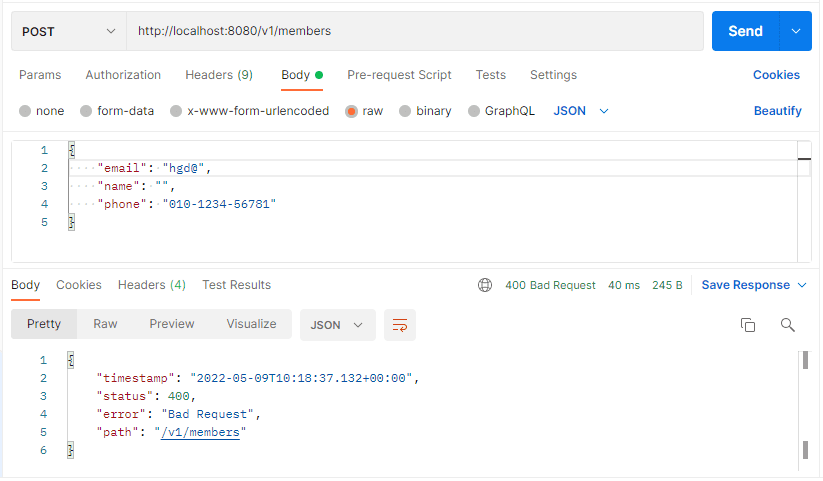
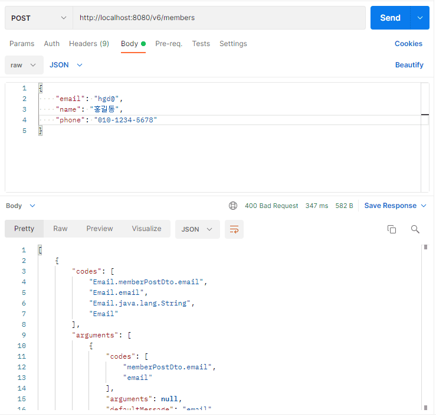
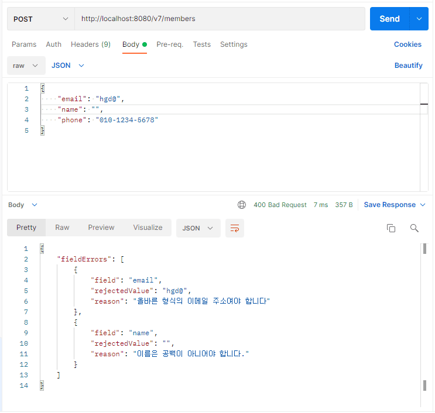
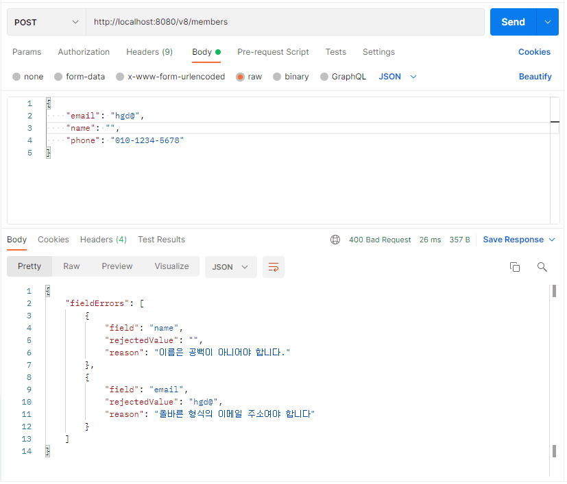

Spring MVC / 예외 처리 (@ExceptionHandler, @RestControllerAdvice)

<div class="cl1"></div>

## @ExceptionHandler 예외 처리

이전 까지는 클라이언트 요청 데이터의 유효성 검증에 실패할 경우 아래와 같은 응답 메시지를 확인할 수 있었다.

<div class="cl3"></div>

<p align="center"></p>

<div class="cl4"></div>

위와 같은 Response Body의 내용만으로는 요청 데이터 중에서 어떤 항목이 유효성 검증에 실패했는지 알 수가 없다.

<div class="cl3"></div>

위 문제를 해결하기 위해서 Spring이 처리하는 에러 응답 메시지를 개발자가 직접 처리하도록 코드를 수정해 보겠다.

<div class="cl4"></div>

> Spring에서의 예외는 애플리케이션에 문제가 발생할 경우, 이 문제를 알려서 처리하는 것뿐만 아니라 유효성 검증에 실패했을 때와 같이 이 실패를 하나의 예외로 간주하여 이 예외를 던져서(throw) 예외 처리를 유도한다.

<div class="cl2"></div>

### @ExceptionHandler 적용

**MemberController에 @ExceptionHandler 적용**

```java
@RestController
@RequestMapping("/v6/members")
@Validated
@Slf4j
public class MemberControllerV6 {
    ...
    ...

    @PostMapping
    public ResponseEntity postMember(@Valid @RequestBody MemberPostDto memberDto) {
        Member member = mapper.memberPostDtoToMember(memberDto);

        Member response = memberService.createMember(member);

        return new ResponseEntity<>(mapper.memberToMemberResponseDto(response),
                HttpStatus.CREATED);
    }

    ...
    ...

    @ExceptionHandler
    public ResponseEntity handleException(MethodArgumentNotValidException e) {
        // (1)
        final List<FieldError> fieldErrors = e.getBindingResult().getFieldErrors();

        // (2)
        return new ResponseEntity<>(fieldErrors, HttpStatus.BAD_REQUEST);
    }
}
```

<div class="cl4"></div>

위 코드에서는 @ExceptionHandler 어노테이션을 이용해서 예외를 처리하도록 handleException() 메서드를 추가했다.

<div class="cl3"></div>

예를 들어 회원 등록 과정에서 Request Body의 유효성 검증에 실패했을 때 예외 처리 과정 설명하겠다.

<div class="cl4"></div>

1. 클라이언트 쪽에서 회원 등록을 위해 Membercontroller의 postMember() 핸들러 메서드에 요청을 전송한다.

<div class="cl4"></div>

2. RequestBody에 유효하지 않은 데이터가 포함되어 있어 유효성 검증에 실패하고, MethodArgumentNotValidException이 발생한다.

<div class="cl4"></div>

3. MemberController에는 @ExceptionHandler 어노테이션이 추가된 예외 처리 메서드인 handleException()이 있기 때문에 유효성 검증 과정에서 내부적으로 던져진 MethodArgumentNotValidException을 handleException() 메서드가 전달받는다.

<div class="cl4"></div>

4. (1)과 같이 MethodArgumentNotValidException 객체에서 getBindingResult().getFieldErrors()를 통해 발생한 에러 정보를 확인할 수 있다.

<div class="cl4"></div>

5. (1)에서 얻은 에러 정보를 (2)에서 ResponseEntity를 통해 Response Body로 전달한다.

<div class="cl3"></div>

<p align="center"></p>

<div class="cl4"></div>

회원 등록 정보 중에서 유효하지 않은 이메일 주소를 포함해서 요청을 전송한 결과이다.

Response Body를 보면 전과는 조금 다른 응답 메시지를 전달받은 것을 알 수 있다.

<div class="cl3"></div>

**요청 결과에 대한 전체 Response Body**

```java
[
    {
        "codes": [
            "Email.memberPostDto.email",
            "Email.email",
            "Email.java.lang.String",
            "Email"
        ],
        "arguments": [
            {
                "codes": [
                    "memberPostDto.email",
                    "email"
                ],
                "arguments": null,
                "defaultMessage": "email",
                "code": "email"
            },
            [],
            {
                "arguments": null,
                "defaultMessage": ".*",
                "codes": [
                    ".*"
                ]
            }
        ],
        "defaultMessage": "올바른 형식의 이메일 주소여야 합니다",
        "objectName": "memberPostDto",
        "field": "email",
        "rejectedValue": "hgd@",
        "bindingFailure": false,
        "code": "Email"
    }
]
```

<div class="cl4"></div>

그런데 클라이언트 입장에서는 의미를 알 수 없는 정보를 전부 포함한 Response Body 전체 정보를 굳이 다 전달받을 필요는 없어 보인다.

<div class="cl3"></div>

요청 전송 시, Request Body의 JSON 프로퍼티 중에서 문제가 된 프로퍼티는 무엇인지와 에러 메시지 정도만 전달 받을 수 있게,

위의 에러 정보를 기반으로 한 Error Response 클래스를 만들어서 필요한 정보만 담은 후에 클라이언트 쪽에 전달해 주면 된다.

<div class="cl2"></div>

### ErrorResponse 클래스 적용

```java
@Getter
@AllArgsConstructor
public class ErrorResponse {
    // (1)
    private List<FieldError> fieldErrors;

    @Getter
    @AllArgsConstructor
    public static class FieldError {
        private String field;
        private Object rejectedValue;
        private String reason;
    }
}
```

위 코드는 DTO 클래스의 유효성 검증 실패 시, 실패한 필드에 대한 Error 정보만 담아서 응답으로 전송하기 위한 ErrorResponse 클래스이다.

<div class="cl3"></div>

위의 Response Body를 보면 JSON 응답 객체가 배열()인 것을 알 수 있다.

배열인 이유를 생각해 보면 **DTO 클래스에서 검증해야 되는 멤버 변수에서 유효성 검증에 실패하는 멤버 변수들이 하나 이상이 될 수 있기 때문에 유효성 검증 실패 에러 역시 하나 이상이 될 수 있다**는 의미이다.

<div class="cl3"></div>

그렇기 때문에 (1)과 같이 한 개 이상의 유효성 검증에 실패한 필드의 에러 정보를 담기 위해서 List 객체를 이용하며,

이 한 개의 필드 에러 정보는 FieldError라는 별도의 static class를 ErrorResponse 클래스의 멤버 클래스로 정의했다.

<div class="cl3"></div>

<div class="callout">
   <div class="callout-in">
       <p>FieldError 클래스는 ErrorResponse 클래스 내부에 정의되어 있다고 해서 Inner 클래스라고 부르기 보다는 ErrorResponse 클래스의 static 멤버 클래스라고 부르는 것이 적절하다.</p>
       <div class="cl4"></div>
       <p>클래스가 멤버 변수와 멤버 메서드를 포함하듯이 static 멤버 클래스를 포함할 수 있다고 생각하면 된다.</p>
       <div class="cl4"></div>
       <p>그리고 ErrorResponse는 에러 정보만 담는 클래스이기 때문에 필드의 에러 정보를 담는 FieldError 클래스 역시 에러라는 공통의 관심사를 가지고 있으므로 ErrorResponse의 멤버로 표현하는 것이 적절하다.</p>
       <p></p>
   </div>
</div>

<div class="cl2"></div>

### handleException() 수정

ErrorResponse를 사용하도록 MemberController의 handleException() 메서드 수정

```java
@RestController
@RequestMapping("/v7/members")
@Validated
@Slf4j
public class MemberControllerV7 {
    ...
    ...

    @PostMapping
    public ResponseEntity postMember(@Valid @RequestBody MemberPostDto memberDto) {
        Member member = mapper.memberPostDtoToMember(memberDto);

        Member response = memberService.createMember(member);

        return new ResponseEntity<>(mapper.memberToMemberResponseDto(response),
                HttpStatus.CREATED);
    }

    ...
    ...

    @ExceptionHandler
    public ResponseEntity handleException(MethodArgumentNotValidException e) {
        // (1)
        final List<FieldError> fieldErrors = e.getBindingResult().getFieldErrors();

        // (2)
        List<ErrorResponse.FieldError> errors =
                fieldErrors.stream()
                            .map(error -> new ErrorResponse.FieldError(
                                error.getField(),
                                error.getRejectedValue(),
                                error.getDefaultMessage()))
                            .collect(Collectors.toList());

        return new ResponseEntity<>(new ErrorResponse(errors), HttpStatus.BAD_REQUEST);
    }
}
```

<div class="cl4"></div>

위 코드에서는 (1)의 List<FieldError>을 통째로 ResponseEntity 클래스에 실어서 전달했지만 이번에는

(2)와 같이 **필요한 정보들만 선택적으로 골라서** ErrorResponse.FieldError 클래스에 담아서 List로 변환 후, List<ErrorResponse.FieldError>를 ResponseEntity 클ㄹ래스에 실어서 전달하고 있다.

<div class="cl3"></div>

<p align="center"></p>

<div class="cl2"></div>

### @ExceptionHandler의 단점

1. 각각의 Controller 클래스에서 @ExceptionHandler 어노테이션을 사용하여 Request Body에 대한 유효성 검증 실패에 대한 에러 처리를 해야 되므로 각 Controller 클래스마다 코드 중복이 발생한다.

<div class="cl4"></div>

2. Controller에서 처리해야 되는 예외가 유효성 검증 실패에 대한 예외(MethodArgumentNotValidException)만 있는 것이 아니기 때문에 하나의 Controller 클래스 내에서 @ExceptionHandler를 추가한 에러 처리 핸들러 메서드가 늘어난다.

<div class="cl3"></div>

대표적인 예가 아래와 같이 patchMember() 핸들러 메서드의 URI에 유효하지 않은 변수 값을 전송할 경우이다.

```java
@RestController
@RequestMapping("/v8/members")
@Validated
@Slf4j
public class MemberControllerV8 {
    ...
    ...

    @PostMapping
    public ResponseEntity postMember(@Valid @RequestBody MemberPostDto memberDto) {
        Member member = mapper.memberPostDtoToMember(memberDto);

        Member response = memberService.createMember(member);

        return new ResponseEntity<>(mapper.memberToMemberResponseDto(response),
                HttpStatus.CREATED);
    }

    @PatchMapping("/{member-id}")
    public ResponseEntity patchMember(
            @PathVariable("member-id") @Positive long memberId,
            @Valid @RequestBody MemberPatchDto memberPatchDto) {
        memberPatchDto.setMemberId(memberId);

        Member response =
                memberService.updateMember(mapper.memberPatchDtoToMember(memberPatchDto));

        return new ResponseEntity<>(mapper.memberToMemberResponseDto(response),
                HttpStatus.OK);
    }
    ...
    ...

    @ExceptionHandler
    public ResponseEntity handleException(MethodArgumentNotValidException e) {
        // (1)
        final List<FieldError> fieldErrors = e.getBindingResult().getFieldErrors();

        // (2)
        List<ErrorResponse.FieldError> errors =
                fieldErrors.stream()
                            .map(error -> new ErrorResponse.FieldError(
                                error.getField(),
                                error.getRejectedValue(),
                                error.getDefaultMessage()))
                            .collect(Collectors.toList());

        return new ResponseEntity<>(new ErrorResponse(errors), HttpStatus.BAD_REQUEST);
    }

    @ExceptionHandler
    public ResponseEntity handleException(ConstraintViolationException e) {
        /**
         * - ConstraintViolationException 클래스는 getBindingResult().getFieldErrors() 
         * 와 같이 에러 정보를 얻을 수 없다.
         * - MethodArgumentNotValidException과 다르게 또 다른 방식으로 처리가 필요.
         */
        
        return new ResponseEntity(HttpStatus.BAD_REQUEST);
    }
}
```

<div class="cl4"></div>

위 코드에서는 patchMember() 핸들러 메서드의 URI 변수인 “/{member-id}”에 0이 넘어올 경우,

ConstraintViolationException 이 발생하기 때문에 ConstraintViolationException을 처리할 @ExceptionHandler를 추가한 메서드를 하나 더 추가했다.

<div class="cl3"></div>

이처럼 @ExceptionHandler 어노테이션을 사용한 방식은 코드 중복과 유연하지 않은 예외 처리 방식이기 때문에 예외 처리에 대한 개선이 필요하다.

<div class="cl3"></div>

@ExceptionHandler 어노테이션을 사용한 예외 처리 방식을 개선할 방법은 밑에서 설명하겠다.

<div class="cl2"></div>

## @RestControllerAdvice 예외 처리

특정 클래스에 @RestControllerAdvice 어노테이션을 추가하면 여러 개의 Controller 클래스에서 @ExceptionHandler, @InitBinder 또는 @ModelAttribute가 추가된 메서드를 공유해서 사용할 수 있다.

<div class="cl3"></div>

@RestControllerAdvice 어노테이션을 추가한 클래스를 이용하면 **예외 처리를 공통화할 수 있다는 것**이다.

<div class="cl3"></div>

이 전에 @ExceptionHandler 어노테이션을 이용해 각각의 Controller 클래스에서 예외 처리하던 방식을

@RestControllerAdvice 어노테이션을 이용하는 방식으로 바꿔보겠다.

<div class="cl3"></div>

<div class="callout">
   <div class="callout-in">
       <p>@InitBinder와 @ModelAttribute 어노테이션은 JSP, Thymeleaf 같은 서버 사이드 렌더링(SSR) 방식에서 주로 사용되는 방식이다.</p>
       <div class="cl4"></div>
       <p>여기선 클라이언트 사이드 렌더링(CSR) 방식인 REST API 기반 애플리케이션에 대해서만 다룬다.</p>
   </div>
</div>

<div class="cl2"></div>

### Exception 핸들러 메서드 구현

```java
@RestControllerAdvice
public class GlobalExceptionAdvice {
    // (1)
    @ExceptionHandler
    public ResponseEntity handleMethodArgumentNotValidException(
            MethodArgumentNotValidException e) {
        final List<FieldError> fieldErrors = e.getBindingResult().getFieldErrors();

        List<ErrorResponse.FieldError> errors =
                fieldErrors.stream()
                        .map(error -> new ErrorResponse.FieldError(
                                error.getField(),
                                error.getRejectedValue(),
                                error.getDefaultMessage()))
                        .collect(Collectors.toList());

        return new ResponseEntity<>(new ErrorResponse(errors), HttpStatus.BAD_REQUEST);
    }

    // (2)
    @ExceptionHandler
    public ResponseEntity handleConstraintViolationException(
            ConstraintViolationException e) {
        // TODO should implement for validation

        return new ResponseEntity<>(HttpStatus.BAD_REQUEST);
    }
}
```

<div class="cl4"></div>

예외를 처리할 ExceptionAdvice 클래스에 @RestControllerAdvice 어노테이션을 추가하면 이 클래스는 이제 **Controller 클래스에서 발생하는 예외를 도맡아서 처리**하게 된다.

<div class="cl3"></div>

<p align="center"></p>

<div class="cl4"></div>

@RestControllerAdvice 어노테이션을 이용해서 예외 처리를 공통화하면 각 Controller마다 추가되는

@exceptionHandler 로직에 대한 중복 코드를 제거하고, Controller의 코드를 단순화할 수 있다.

<div class="cl2"></div>

### ErrorResponse 수정

이제 GlobalExceptionAdvice를 통해 Controller 클래스에서 발생하는 RequestBody의 유효성 검증에 대한 에러는 유연한 처리가 가능해졌다.

<div class="cl3"></div>

그런데 위 코드 (2)에서 URI 변수로 넘어오는 값의 유효성 검증에 대한 에러(ConstraintViolationException) 처리는 아직 구현되지 않았다.

<div class="cl3"></div>

이 부분을 처리하기 전에 먼저 ErrorResponse 클래스가 ConstraintViolationException에 대한 Error Response를 생성할 수 있도록 ErrorResponse 클래스를 수정해 보겠다.

<div class="cl4"></div>

```java
@Getter
public class ErrorResponse {
    private List<FieldError> fieldErrors; // (1)
    private List<ConstraintViolationError> violationErrors;  // (2)

    // (3)
    private ErrorResponse(List<FieldError> fieldErrors, List<ConstraintViolationError> violationErrors) {
        this.fieldErrors = fieldErrors;
        this.violationErrors = violationErrors;
    }

    // (4) BindingResult에 대한 ErrorResponse 객체 생성
    public static ErrorResponse of(BindingResult bindingResult) {
        return new ErrorResponse(FieldError.of(bindingResult), null);
    }

    // (5) Set<ConstraintViolation<?>> 객체에 대한 ErrorResponse 객체 생성
    public static ErrorResponse of(Set<ConstraintViolation<?>> violations) {
        return new ErrorResponse(null, ConstraintViolationError.of(violations));
    }

    // (6) Field Error 가공
    @Getter
    public static class FieldError {
        private String field;
        private Object rejectedValue;
        private String reason;

        private FieldError(String field, Object rejectedValue, String reason) {
            this.field = field;
            this.rejectedValue = rejectedValue;
            this.reason = reason;
        }

        public static List<FieldError> of(BindingResult bindingResult) {
            final List<org.springframework.validation.FieldError> fieldErrors =
                                                        bindingResult.getFieldErrors();
            return fieldErrors.stream()
                    .map(error -> new FieldError(
                            error.getField(),
                            error.getRejectedValue() == null ?
                                            "" : error.getRejectedValue().toString(),
                            error.getDefaultMessage()))
                    .collect(Collectors.toList());
        }
    }

    // (7) ConstraintViolation Error 가공
    @Getter
    public static class ConstraintViolationError {
        private String propertyPath;
        private Object rejectedValue;
        private String reason;

        private ConstraintViolationError(String propertyPath, Object rejectedValue,
                                  String reason) {
            this.propertyPath = propertyPath;
            this.rejectedValue = rejectedValue;
            this.reason = reason;
        }

        public static List<ConstraintViolationError> of(
                Set<ConstraintViolation<?>> constraintViolations) {
            return constraintViolations.stream()
                    .map(constraintViolation -> new ConstraintViolationError(
                            constraintViolation.getPropertyPath().toString(),
                            constraintViolation.getInvalidValue().toString(),
                            constraintViolation.getMessage()
                    )).collect(Collectors.toList());
        }
    }
}
```

<div class="cl4"></div>

위 코드는 ErrorResponse 클래스가 ConstraintViolationException에 대한 Error Response 까지 생성 가능하도록 수정된 코드이다.

<div class="cl3"></div>

수정된 ErrorResponse는 총 두 개의 예외 유형을 처리해서 Error Response에 포함할 수 있다.

<div class="cl3"></div>

첫 번째가 DTO 클래스의 유효성 검증에서 발생하는 MethodArgumentNotValidException에 대한 Error Repsonse이고

두 번째는 URI의 변수값 검증에서 발생하는 ConstraintViolationException에 대한 Error Response이다.

<div class="cl3"></div>

(1)은 MethodArgumentNotValidException으로부터 발생하는 에러 정보를 담는 멤버 변수이다.

즉, DTO 멤버 변수 필드의 유효성 검증 실패로 발생한 에러 정보를 담는 멤버 변수이다.

<div class="cl3"></div>

(2)는 ConstraintViolationException으로부터 발생하는 에러 정보를 담는 멤버 변수이다.

즉, URI 변수 값의 유효성 검증에 실패로 발생한 에러 정보를 담는 멤버 변수이다.

<div class="cl3"></div>

(3)은 ErrorResponse 클래스의 생성자인데 생성자 앞에 private 접근 제한자를 지정했다.

이렇게 함으로써 ErrorResponse 클래스는 new ErrorResponse(…) 방식으로 ErrorResponse 객체를 생성할 수 없다.

<div class="cl4"></div>

대신에 (4)와 (5)처럼 of() 메서드를 이용해서 ErrorResponse의 객체를 생성할 수 있다.

이렇게 코드를 구성한 이유는 ErrorResponse의 객체를 생성함과 동시에 ErrorResponse의 역할을 명확하게 해 준다.

<div class="cl3"></div>

(4)는 MethodArgumentNotValidException에 대한 ErrorResponse 객체를 생성해 준다.

MethodArgumentNotValidException에서 에러 정보를 얻기 위해 필요한 것이 바로 BindingResult 객체 이므로 이 of() 메서드를 호출하는 쪽에서 bindingResult 객체를 파라미터로 넘겨주면 된다.

<div class="cl4"></div>

이 BindingResult 객체를 가지고 에러 정보를 추출하고 가공하는 일은 ErrorResponse 클래스의 static 멤버 클래스인 **FieldError 클래스에게 위임**하고 있다.

<div class="cl3"></div>

(5)는 ConstraintViolationException에 대한 ErrorResponse 객체를 생성해 준다.

ConstraintViolationException에서 에러 정보를 얻기 위해 필요한 것이 바로 `Set<ConstraintViolation<?>>` 객체 이므로 이 of() 메서드를 호출하는 쪽에서 `Set<ConstraintViolation<?>>` 객체를 파라미터로 넘겨주면 된다.

<div class="cl4"></div>

`Set<ConstraintViolation<?>>` 객체를 가지고 에러 정보를 추출하고 가공하는 일은 ErrorResponse 클래스의 static 멤버 클래스인 **ConstraintViolationError 클래스에게 위임**하고 있다.

<div class="cl4"></div>

**(4)와 (5)를 통해서 ErrorResponse 객체에 에러 정보를 담는 역할이 명확하게 분리된다.**

<div class="cl3"></div>

(6)에서는 필드(DTO 클래스의 멤버 변수)의 유효성 검증에서 발생하는 에러 정보를 생성한다.

<div class="cl3"></div>

(7)에서는 URI 변수 값에 대한 에러 정보를 생성한다.

<div class="cl4"></div>

> 기능이 늘어남에 따라 ErrorResponse 클래스의 구현 복잡도가 늘어나긴 했지만 에러 유형에 따른 에러 정보 생성 역할을 분리함으로써 ErrorREsponse를 사용하는 입장에서는 한층 더 사용하기 편리해졌다.

<div class="callout">
   <div class="callout-in">
       <p>of() 메서드는 Java 8의 API에서도 흔히 볼 수 있는 네이빙 컨벤션이다.</p>
       <p>주로 객체 생성 시 어떤 값들의(of~) 객체를 생성한다는 의미에서 of() 메서드를 사용한다.</p>
   </div>
</div>

<div class="cl2"></div>

### Exception 핸들러 메서드 수정

이제 수정된 ErrorResponse 클래스의 메서드를 사용하도록 GlobalExceptionAdvice 클래스를 수정하겠다.

```java
@RestControllerAdvice
public class GlobalExceptionAdvice {
    @ExceptionHandler
    @ResponseStatus(HttpStatus.BAD_REQUEST)
    public ErrorResponse handleMethodArgumentNotValidException(
            MethodArgumentNotValidException e) {
        final ErrorResponse response = ErrorResponse.of(e.getBindingResult());

        return response;
    }

    @ExceptionHandler
    @ResponseStatus(HttpStatus.BAD_REQUEST)
    public ErrorResponse handleConstraintViolationException(
            ConstraintViolationException e) {
        final ErrorResponse response = ErrorResponse.of(e.getConstraintViolations());

        return response;
    }
}
```

<div class="cl4"></div>

이전 코드와 비교했을 때, Error Response 정보를 만드는 역할을 ErrorResponse 클래스가 대신해주기 때문에 코드 자체가 간결해졌다.

<div class="cl3"></div>

또 하나 중요한 변경사항은 이전 코드에서는 ErrorResponse 객체를 ResponseEntity로 래핑해서 리턴한 반면 

지금은 ResponseEntity가 사라지고 ErrorREsponse 객체를 바로 리턴하고 있다.

<div class="cl3"></div>

그리고 @ResponseStatus 어노테이션을 이용해서 HTTP Status를 HTTP Response에 포함하고 있다.

<div class="cl3"></div>

<div class="callout">
   <div class="callout-in">
       <strong>@RestControllerAdvice VS @ControllerAdvice</strong>
       <div class="cl3"></div>
       <p>Spring MVC 4.3 버전 이후부터 @RestControllerAdvice 어노테이션을 지원하는데, 둘 사이의 차이점은 아래와 같다.</p>
       <div class="cl4"></div>
       <p>@RestControllerAdvice = @ControllerAdvice + @ResponseBody</p>
       <div class="cl4"></div>
       <p>@RestControllerAdvice 어노테이션은 @ControllerAdvice의 기능을 포함하고 잇으며,</p>
       <p>@ResponseBody의 기능 역시 포함하고 있기 때문에 JSON 데이터를 Response Body로 전송하기 위해서 ResponseEntity로 데이터를 래핑 할 필요가 없다.</p>
   </div>
</div>

