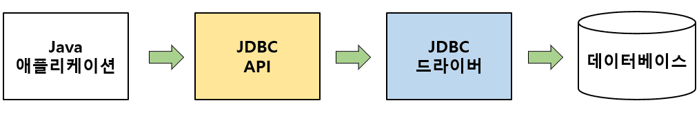
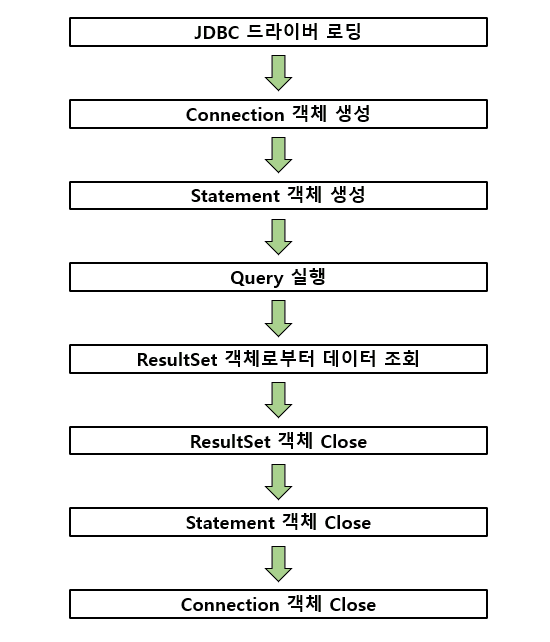
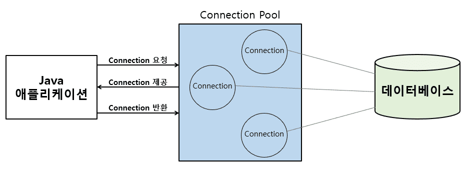
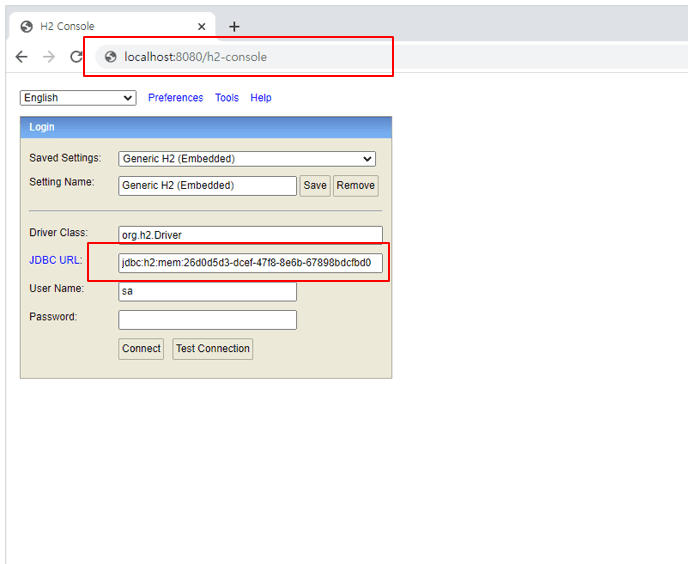
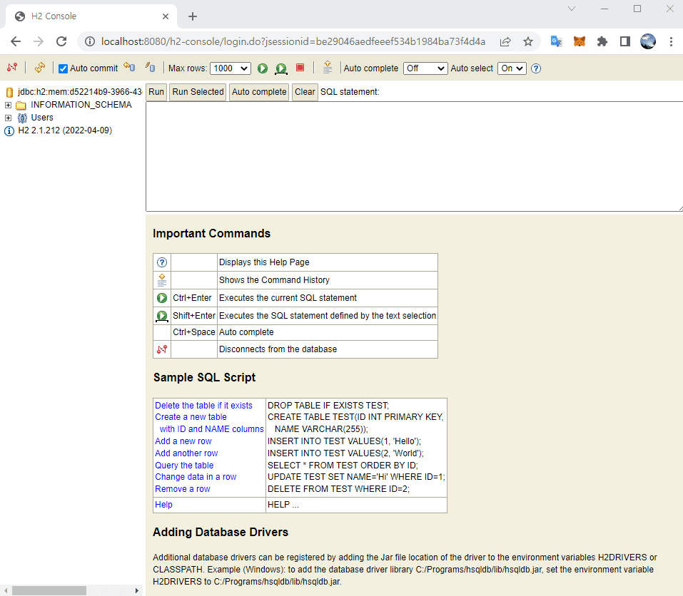

스프링 복습 및 정리 11P

<div class="cl1"></div>

## JDBC란?

Java 기반 애플리케이션의 코드 레벨에서 사용하는 데이터를 DB에 저장 및 업데이트하거나 

반대로 DB에 저장된 데이터를 Java 코드 레벨에서 사용할 수 있도록 해주는 

**Java에서 제공하는 표준 사양(또는 명세, Specification)**이다.

<div class="cl3"></div>

JDBC는 Java 기반의 애플리케이션에서 사용하는 데이터 액세스 기술의 기본이 되는 저수준 API이다.

Spring에서는 JDBC API를 직접적으로 사용하기보다는 Spring Data JDBC나 Spring Data JPA같은 기술을 제공함으로써 

개발자들이 조금 더 편리하게 데이터 액세스 로직을 구현할 수 있도록 해준다.

<div class="cl3"></div>

따라서 JDBC API의 사용법을 배우지 않아도 되지만,

Spring Data JDBC나 Spring Data JPA 같은 기술 역시 데이터베이스와 연동하기 위해 내부적으로는 JDBC를 이용하기 때문에 JDBC의 동작 흐름 정도는 알면 Spring에서 지원하는 데이터  액세스 기술을 사용하는데 도움이 된다.

<div class="cl2"></div>

### JDBC의 동작 흐름

<p align="center"></p>

Java 애플리케이션에서 JDBC API를 이용해 적절한 데이터베이스 드라이버를 로딩한 후, 데이터베이스와 인터렉션 한다.

<div class="cl3"></div>

<div class="callout">
   <div class="callout-in">
       <strong>JDBC 드라이버</strong>
       <p>JDBC 드라이버는 데이터베이스와의 통신을 담당하는 인터페이스인데,</p>
       <p>Oracle이나 MS SQL, MySQL 같은 다양한 벤더에서는 해당 벤더에 맞는 JDBC 드라이버를 구현해서 제공을 하게 되고, </p>
       <p>이 JDBC 드라이버의 구현체를 이용해서 특정 벤더의 데이터베이스에 액세스 할 수 있다.</p>
   </div>
</div>

<div class="cl2"></div>

### JDBC API 사용 흐름

<p align="center"></p>

<div class="cl4"></div>

Java 코드 상에서 JDBC API를 사용하는 일반적인 흐름이다.

<div class="cl3"></div>

1. **드라이버 로딩** <br>
사용하고자 하는 JDBC 드라이버를 로딩한다. <br>
JDBC 드라이버는 DriverManager라는 클래스를 통해서 로딩된다. <br> <br>

2. **Connection 객체 생성** <br>
JDBC 드라이버가 정상적으로 로딩되면 DriverManager를 통해 데이터베이스와 연결되는 Session인 Connection 객체를 생성한다. <br> <br>

3. **Statement 객체 생성** <br>
Statement 객체는 작성된 SQL 쿼리문을 실행하기 위한 객체로써 객체 생성 후에 정적인 SQL 쿼리 문자열을 입력으로 가진다. <br> <br>

4. **Query 실행** <br>
생성된 Statement 객체를 이용해서 입력한 SQL 쿼리를 실행한다. <br> <br>

5. **ResultSet 객체로부터 데이터 조회** <br>
실행된 SQL 쿼리문에 대한 결과 데이터 셋이다. <br> <br>

6. **ResultSet 객체 Close, Statement 객체 Close, Connection 객체 Close** <br>
JDBC API를 통해 사용된 객체들은 사용 이후에 사용한 순서의 역순으로 차례로 Close를 해주어야 한다. <br> <br>

<div class="cl2"></div>

### Connection Pool

<p align="center"></p>

JDBC API를 사용해서 DB와의 연결을 위한 Connection 객체를 생성하는 작업은 비용이 많이 드는 작업 중 하나이다.

<div class="cl3"></div>

따라서 애플리케이션 로딩 시점에 Connection 객체를 미리 생성해 두고 애플리케이션에서 DB에 연결이 필요할 경우,

Connection 객체를 새로 생성하는 것이 아니라 미리 만들어 둔 Connection 객체를 사용함으로써 애플리케이션의 성능을 향상할 수 있다.

<div class="cl3"></div>

이처럼 DB Connection을 미리 만들어서 보관하고 애플리케이션이 필요할 때 이 Connection을 제공해 주는 역할을 하는 Connection 관리자를 바로 Connection Pool이라고 한다.

<div class="cl3"></div>

<div class="callout">
   <div class="callout-in">
       <p>Spring Boot 2.0 이전 버전에는 Apache 재단의 오픈 소스인 Apache Commons DBCP를 주로 사용했지만</p>
       <p>Spring Boot 2.0부터는 성능면에서 더 나은 이점을 가지고 있는 HikariCP를 기본 DBCP로 채택했다.</p>
   </div>
</div>

<div class="cl2"></div>

### 참고 자료

[JDBC [더보기]](https://ko.wikipedia.org/wiki/JDBC)

[HikariCP [더보기]](https://github.com/brettwooldridge/HikariCP)

<div class="cl1"></div>

## Spring Data JDBC

Spring에서 사용할 수 있는 대표적인 데이터 액세스 기술에는 mybatis, Spring JDBC, Spring Data JDBC, JPA, Spring Data JPA 등이 있다.

<div class="cl3"></div>

### SQL 중심 기술

mybatis, Spring JDBC는 대표적인 SQL 중심 기술이다.

SQL 중심 기술은 애플리케이션에서 데이터베이스에 접근하기 위해 SQL 쿼리문을 애플리케이션 내부에 직접적으로 작성하는 것이 중심이 되는 기술이다.

<div class="cl3"></div>

**mybatis에서 사용되는 SQL Mapper의 예**

```html
<select id="findMember" resultType="Member">
  SELECT * FROM MEMBER WHERE member_id = #{memberId}
</select>
```

<div class="cl4"></div>

mybatis의 경우, SQL Mapper라는 설정 파일이 존재하는데 이 SQL Mapper에서 SQL 쿼리문을 직접적으로 작성한다.

<div class="cl4"></div>

작성된 SQL 쿼리문을 기반으로 데이터베이스의 특정 데이블에서 데이터를 조회한 후, Java 객체로 변환해 주는 것이 mybatis의 대표적인 기술적 특징이다.

<div class="cl3"></div>

**Spring JDBC의 JdbcTemplate 사용 예**

```java
Member member = this.jdbcTemplate.queryForObject(
                    "select * from member where member_id=?", 1, Member.class);
```

Spring JDBC의 경우에도 Java 코드에 SQL 쿼리문이 직접적으로 포함이 되어 있다.

<div class="cl4"></div>

이처럼 SQL 쿼리문이 직접적으로 포함이 되는 방식은 과거부터 많이 사용하던 방식이고,

현재도 사용이 되고 있긴 하지만 **Java 진영에서는 SQL 중심의 기술에서 객체(Object) 중심의 기술로 지속적으로 이전을 하고 있는 추세**이다.

<div class="cl2"></div>

### 객체(Object) 중심 기술

객체 중심 기술은 데이터를 SQL 쿼리문 위주로 생각하는 것이 아니라 모든 데이터를 객체 관점으로 바라보는 기술이다.

<div class="cl3"></div>

데이터베이스에 접근하기 위해서 SQL 쿼리문을 직접적으로 작성하기 보다는 데이터베이스의 테이블에 데이터를 저장하거나 조회할 경우,

Java 객체를 이용해 애플리케이션 내부에서 이 Java 객체를 SQL 쿼리문으로 자동 변환 한 후에 데이터베이스의 테이블에 접근한다.

<div class="cl3"></div>

이러한 객체 중심의 데이터 액세스 기술을 **ORM(Object-Relational Mapping)**이라고 한다.

<div class="cl3"></div>

Java에서 대표적인 ORM 기술이 바로 **JPA(Java Persistence API)**이다.

JPA를 사용하면 SQL 쿼리문을 직접적으로 다룰 일은 많지 않다.

물론 복잡한 조건의 데이터 조회를 위해 SQL 쿼리문을 사용하기도 하지만 그 사용 빈도수는 이 전보다 현저히 적다.

<div class="cl3"></div>

이제 Spring Data JDBC를 간단한 샘플 코드를 통해서 기본 동작 방식을 설명하겠다.

<div class="cl2"></div>

### 기초 세팅

**의존 라이브러리 추가**

```js
dependencies {
  implementation 'org.springframework.boot:spring-boot-starter-data-jdbc'
  runtimeOnly 'com.h2database:h2'
}
```

<div class="cl4"></div>

데이터베이스에서 데이터를 관리할 것이므로 개발 환경에서 손쉽게 사용할 수 있는 인메모리 DB인 H2를 사용한다.

<div class="cl3"></div>

**인메모리(In-memory) DB란 이름 그대로 메모리 안에 데이터를 저장하는 DB이다.**

일반적으로 알고 있는 DB는 삭제를 하지 않는 이상 DB 서버를 내렸다가 다시 가동해도 DB 안에 데이터가 그대로 유지된다.

반면에 메모리는 휘발성이기 때문에 인메모리 DB는 컴퓨터 전원을 내렸다 올리면 데이터는 모두 지워지게 된다.

<div class="cl3"></div>

이처럼 인메모리 DB는 애플리케이션이 실행되는 동안에만 데이터를 저장하고 있기 때문에 애플리케이션 실행을 중지했다가 다시 실행시키면 인메모리 DB 안에 저장되어 있던 데이터는 모두 사라진다.

<div class="cl3"></div>

인메모리 DB를 사용하는 이유는 개발을 진행하면서 작업한 코드에 대한 테스트는 꾸준히 진행을 해야 할 텐데,

테스트를 진행하기 위해서는 테스트에 필요한 데이터 이외에 나머지 쓸데없는 데이터는 테이블에 없는 것이 테스트의 정확도 면에서 유리하기 때문이다.

<div class="cl3"></div>

그렇기 때문에 로컬 개발 환경에서는 테스트가 끝나고 나면 데이터베이스의 테이블에 남아있는 데이터는 깨끗이 비워져 있는 것이 좋다.

<div class="cl3"></div>

물론 운영 환경에서는 당연히 인메모리 DB를 사용하지 않는다.

<div class="cl3"></div>

<br>

**application.yml 파일에 H2 Browser 활성화 설정 추가**

`src/main/resources` 디렉토리 하단에 `application.properties` 라는 파일이 있다.

Spring에서는 `application.properties` 또는 `application.yml` 파일을 통해 Spring에서 사용하는 다양한 설정 정보들을 입력할 수 있다.

<div class="cl3"></div>

.yml 파일은 애플리케이션의 설정 정보(프로퍼티)를 depth 별로 입력할 수 있는 더 나은 방법을 제공하기 때문에 `application.properties`의 파일 확장자를 `application.yml`로 변경한다.

<div class="cl3"></div>

H2 관련 설정을 `application.yml`에 추가한다.

```js
spring:
  h2:
    console:
      enabled: true
```

위와 같이 설정하면 웹 브라우저 상에서 H2 DB에 접속한 후, DB를 관리할 수 있다.

<div class="cl3"></div>

<br>

**H2 DB 정상 동작 확인**

```bash
.   ____          _            __ _ _
 /\\ / ___'_ __ _ _(_)_ __  __ _ \ \ \ \
( ( )\___ | '_ | '_| | '_ \/ _` | \ \ \ \
 \\/  ___)| |_)| | | | | || (_| |  ) ) ) )
  '  |____| .__|_| |_|_| |_\__, | / / / /
 =========|_|==============|___/=/_/_/_/
 :: Spring Boot ::                (v2.7.0)

No active profile set, falling back to 1 default profile: "default"
Bootstrapping Spring Data JDBC repositories in DEFAULT mode. // 데이터베이스와 관련된 로그
Finished Spring Data repository scanning in 10 ms. Found 0 JDBC repository interfaces. // 데이터베이스와 관련된 로그
Tomcat initialized with port(s): 8080 (http)
Starting service [Tomcat]
Starting Servlet engine: [Apache Tomcat/9.0.63]
Initializing Spring embedded WebApplicationContext
Root WebApplicationContext: initialization completed in 1830 ms
HikariPool-1 - Starting... // 데이터베이스와 관련된 로그
HikariPool-1 - Start completed. // 데이터베이스와 관련된 로그
H2 console available at '/h2-console'. Database available at 'jdbc:h2:mem:26d0d5d3-dcef-47f8-8e6b-67898bdcfbd0' // (1)
Tomcat started on port(s): 8080 (http) with context path ''
Started Section3Week1JdbcApplication in 3.018 seconds (JVM running for 3.423)
```

<div class="cl4"></div>

(1)의’ H2 console available at’ 로 시작하는 로그는 이제 H2 DB를 정상적으로 사용할 준비가 되었으며, 웹 브라우저로 접속해서 DB를 관리할 수 있음을 의미한다.

<div class="cl3"></div>

이제 H2 DB에 접속한다.

<p align="center"></p>

<div class="cl4"></div>

웹 브라우저에 주소를 localhost:8080/h2-console로 입력한다.

그리고 애플리케이션 로그에 출력된 `jdbc:h2:mem:26d0d5d3-dcef-47f8-8e6b-67898bdcfbd0`을

JDBC URL 항목에 붙여넣고 Connect 버튼을 클릭한다.

<div class="cl3"></div>

아래와 같은 화면이 보이면 정상적으로 접속한 것이다.

<div class="cl4"></div>

<p align="center"></p>

<div class="cl3"></div>

<br>

**H2 DB 설정 추가**

애플리케이션을 재시작할 때마다 애플리케이션 로그에 출력되는 JDBC URL이 매번 랜덤하게 바뀌기 때문에 다시 입력해야 하는 불편함이 있다.

이 문제는 아래와 같이 추가 설정을 해 해결할 수 있다.

```js
spring:
  h2:
    console:
      enabled: true
      path: /h2     # (1) Context path 변경
  datasource:
    url: jdbc:h2:mem:test     # (2) JDBC URL 변경
```

<div class="cl4"></div>

이제 localhost:8080/h2로 접속한 뒤 JDBC URL 항목에 `jdbc:h2:mem:test`을 입력하고 Connect 버튼을 클릭하면 된다.

<div class="cl2"></div>

### 샘플 코드 구현

클라이언트 에서 “Hello, World” 문자열 데이터를 Request Body로 전송한 후에 Spring Data JDBC를 이용해서 이 문자열을 H2 DB에 저장해보겠다.

<div class="cl3"></div>

**MessageDto**

```java
@Getter
public class MessagePostDto {
    @NotBlank
    private String message;
}
```

```java
@Getter
@Setter
public class MessageResponseDto {
    private long messageId;
    private String message;
}
```

<div class="cl3"></div>

**MessageController**

```java
@RestController
@AllArgsConstructor
@RequestMapping("/v1/messages")
public class MessageController {
    private final MessageService messageService;
    private final MessageMapper messageMapper;

    @PostMapping
    public ResponseEntity postMessage(@Valid @RequestBody MessagePostDto messagePostDto) {
        Message message = messageService.createMessage(messageMapper.messageDtoToMessage(messagePostDto));

        return ResponseEntity.ok(messageMapper.messageToMessageResponseDto(message));
    }
}
```

<div class="cl3"></div>

**MessageMapper**

DTO 클래스와 Entity 클래스를 매핑해 주는 Mapper 인터페이스

```java
@Mapper(componentModel = "spring")
public interface MessageMapper {
    Message messageDtoToMessage(MessagePostDto messagePostDto);
    MessageResponseDto messageToMessageResponseDto(Message message);
}
```

<div class="cl3"></div>

**MessageRepository**

데이터 액세스 계층에서 DB와의 연동을 담당하는 Repository

```java
public interface MessageRepository extends CrudRepository<Message, Long> {
}
```

<div class="cl4"></div>

`CrudRepository`라는 인터페이스를 상속하고 있고, 이 `CrudRepository`의 제너릭 타입이 `<Message, Long>`으로 선언되어 있다.

<div class="cl4"></div>

`CrudRepository`는 DB에 CRUD(데이터 생성, 조회, 수정, 삭제) 작업을 진행하기 위해 Spring에서 지원해 주는 인터페이스이다.

<div class="cl4"></div>

`CrudRepository<Message, Long>`와 같이 제네릭 타입을 지정해 줌으로써

Message Entity 클래스 객체에 담긴 데이터를 DB 테이블에 생성 또는 수정하거나 

DB에서 조회한 데이터를 Message Entity 클래스로 변환할 수 있다.

<div class="cl4"></div>

`CrudRepository<Message, Long>` 에서 Long은 Message Entity 클래스의 멤버 변수 중에 식별자를 의미하는 `@Id`라는 어노테이션이 붙어있는 멤버 변수의 데이터 타입이다.

<div class="cl3"></div>

**MemberService**

```java
@Service
@AllArgsConstructor
public class MessageService {
    // (1)
    private final MessageRepository messageRepository;

    public Message createMessage(Message message) {
        return messageRepository.save(message); // (2)
    }
}
```

<div class="cl4"></div>

MessageRepository 인터페이스는 위의 (1)과 같이 MessageService 클래스에서 DI를 통해 주입받은 후,

(2) 에서 Message Entity 클래스에 포함된 데이터를 DB에 저장하는 데 사용하고 있다.

<div class="cl4"></div>

`save()`메서드는 MessageRepository가 상속받은 CrudRepository에 정의되어 있다.

<div class="cl4"></div>

결론적으로 개발자가 CRUD 작업을 위한 별도의 코드를 구현하지 않아도 CrudRepository가 이 작업을 대신해 주는 역할을 한다.

<div class="cl4"></div>

(2)에서는 DB에 데이터를 저장하고 난 후, DB에 저장된 데이터를 다시 리턴해준다.

<div class="cl3"></div>

**Message**

```java
@Getter
@Setter
public class Message { // (1)
    @Id // (2)
    private long messageId;
    private String message;
}
```

(1)의 Message라는 클래스 명은 DB의 테이블 명에 해당한다.

(2)의 `@Id` 어노테이션을 추가한 멤버 변수는 해당 Entity의 고유 식별자 역할을 하고,

이 식별자는 DB의 Primary key로 지정한 열에 해당된다.

<div class="cl4"></div>

애플리케이션의 로직은 모두 구현되었다.

마지막으로 데이터를 저장할 테이블을 생성하면 된다.

<div class="cl3"></div>

**H2 DB에 MESSAGE 테이블 생성**

```js
spring:
  h2:
    console:
      enabled: true
      path: /h2     
  datasource:
    url: jdbc:h2:mem:test
  sql:
    init:
      schema-locations: classpath*:db/h2/schema.sql   // (1) 테이블 생성 파일 경로
```

(1)과 같이 테이블 생성을 위한 SQL 문이 추가된 schema라는 파일명으로 .sql 파일의 경로를 지정해 주면 이 schema.sql 파일에 있는 스크립트를 읽어서 애플리케이션 실행 시, DB에 테이블을 자동으로 생성해준다.

<div class="cl4"></div>

그리고 인메모리 DB를 사용할 경우, 애플리케이션이 실행될 때마다 schema.sql 파일의 스크립트가 매번 실행된다.

<div class="cl3"></div>

**schema.sql**

schema.sql 파일은 `src/main/resources/db/h2` 디렉토리 내에 위치해 있다.

```js
CREATE TABLE IF NOT EXISTS MESSAGE (
    message_id bigint NOT NULL AUTO_INCREMENT,
    message varchar(100) NOT NULL,
    PRIMARY KEY (message_id)
);
```

<div class="cl4"></div>

스크립트에서 보다시피 message_id는 MESSAGE 테이블의 Primary key이고 AUTO_INCREMENT를 지정했기 때문에 데이터가 insert될 때마다 자동으로 증가된다.

<div class="cl4"></div>

이 말의 의미는 애플리케이션 쪽에서 DB에 데이터를 insert할 때 message_id 열에 해당하는 값을 지정해주지 않아야 한다는 의미이다.

<div class="cl4"></div>

**MESSAGE 테이블은 Message 클래스 명과 매핑되고 message_id 열은 Message 클래스의 messageId 멤버 변수와 매핑된다.**

**message열은 Message 클래스의 message 멤버 변수와 매핑된다.**

<div class="cl4"></div>

ORM에서는 객체의 멤버 변수와 데이터베이스 테이블의 열이 대부분 1대1로 매핑이 된다.

