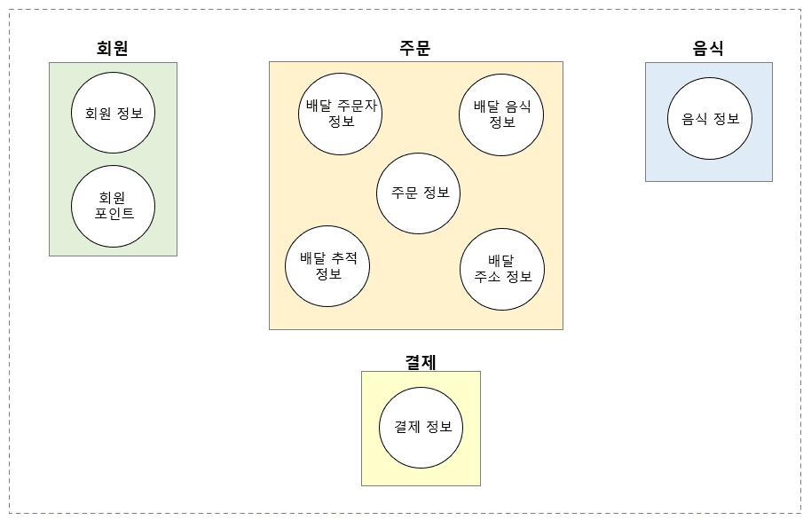
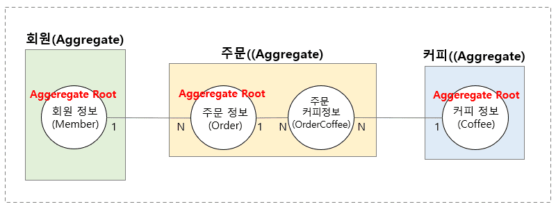
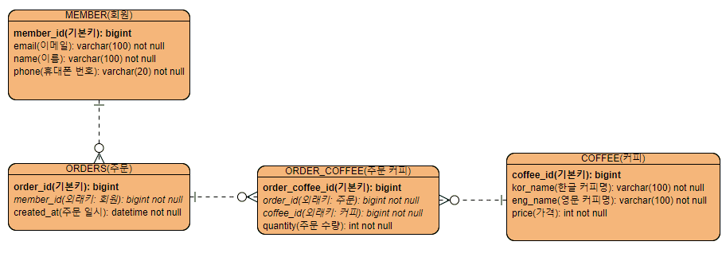

스프링 복습 및 정리 11.1P

Spring Data JDBC 기반의 데이터 액세스 계층을 연동하기 위해 먼저 해야 될 일은 바로 **DB의 테이블과 도메인 Entity 클래스의 설계**이다.

## DDD(Domain Driven Design)

이전 포스트[[더보기]](https://preasim.github.io/73#%EC%84%9C%EB%B9%84%EC%8A%A4-%EA%B3%84%EC%B8%B5) 에서도 DDD에 대해 언급한 적이 있다.

DDD는 한국어로 **도메인 주도 설계** 정도로 해석할 수 있는데,

용어의 의미 그대로 도메인 위주의 설계 기법을 의미한다.

성능, 생산성, 안정성 면에서 뛰어난 애플리케이션을 만들기 위해 가장 중요한 영역인 애플리케이션의 설계는 구현보다 더 어렵다.

그래서 오래전부터 많은 사람들이 어떻게 하면 좀 더 나은 애플리케이션을 잘 설계할 수 있을지 고민한 결과물 중 하나가 DDD이다.

DDD 자체는 굉장히 뛰어난 설계 및 구현 기법이지만,

DDD의 개념을 완벽히 이해하는 것이 쉽지 않기 때문에 많은 학습과 설계 경험이 필요하다.

Spring Data JDBC는 DDD와 밀접한 관련이 있기 때문에, Spring Data JDBC에서 사용하는 DDD에 대한 기본 개념 정도는 이해하고 있어야 된다.

밑에서 간단하게 설명하겠다.

### 도메인 (Domain)

애플리케이션 개발에서 흔하게 사용하는 도메인이란 용어는 주로 비즈니스적인 어떤 업무 영역과 관련이 있다.

예를 들어, 새로운 배달 주문 앱을 만들어야 한다면

고객과 음식점, 배달원, 카드사 또는 은행 등 배달 주문 앱을 구현하기 위해 필요한 업무들을 자세히 알면 알수록 퀄리티가 높은 애플리케이션을 만들 가능성이 높다.

즉, 고객이 음식을 주문하는 과정, 주문받은 음식을 처리하는 과정, 조리된 음식을 배달하는 과정 등의 

도메인 지식(Domain Knowledge)들을 서비스 계층에서 비즈니스 로직으로 구현해야 하는 것이다.

정리하자면 **도메인이란 우리가 실제로 현실 세계에서 접하는 업무의 한 영역이다.**

### 애그리거트(Aggregate)

위에서 말한 배달 주문 앱에서 필요한 업무 즉, 도메인에는 무엇이 있는지 세분화 해서 그림으로 정리 해보겠다.

위 그림에서는 배달 주문 앱의 도메인 영역을 구체적인 하위 수준의 도메인으로 세분화했다.

**애그리거트**란 위 그림과 같이 비슷한 업무 도메인들의 묶음을 말한다.

위 그림에서 애그리거트는 총 네 개이다.

편의상 회원 애그리거트, 주문 애그리거트, 음식 애그리거트, 결제 애그리거트라고 부를 수 있다.

정리하면 **애그리거트는 비슷한 범주의 연관된 업무들을 하나로 그룹화해놓은 그룹**이라고 생각하면 된다.

### 애그리거트 루트(Aggregate Root)

이전 그림에서 정의한 네 개의 애그리거트 안에는 1개 이상의 도메인들이 있는데,

각각의 애그리거트에는 해당 애그리거트를 대표하는 도메인이 존재한다.

이처럼 **하나의 애그리거트를 대표하는 도메인을 DDD에서는 애그리거트 루트**라고 한다.

예를 들면, 1, 2, 3동으로 구성 된 아파트가 있는데, 각 동에는 각 동을 대표해서 일을 하는 동대표가 1명씩 있다.

동에 거주하는 입주민을 대표해서 의견도 전달하고, 주거 환경도 개선하는 등 해당 동에 관련된 일은 동 대표를 거쳐서 이루어지는 경우가 많다.

이 동대표가 바로 애그리거트 루트인 셈이다.

**애그리거트 루트 선정 기준**

이전 그림에서 각 애그리거트 내의 도메인들 중에서 다른 모든 도메인들과 직간접적으로 연관이 되어 있는 도메인이 있다.

회원 애그리거트의 경우, 회원 포인트가 얼마인지 알려면 해당 포인트를 가지는 회원 정보를 알아야 한다.

즉 회원 정보 도메인이 애그리거트 루트가 된다.

주문 애그리거트의 경우, 주문 정보가 다른 모든 도메인과 직접적으로 관련이 있다.

즉, 주문 정보 도메인이 애그리거트 루트가 된다.

**DB의 테이블 간 관계로 보자면, 애그리거트 루트는 부모 테이블이 되고, 애그리거트 루트가 아닌 다른 도메인들은 자식 테이블이 되는 셈이다.**

즉, 애그리거트 루트의 기본키 정보를 다른 도메인들이 외래키 형태로 가지고 있다고 볼 수 있다.

## 도메인 엔티티 및 테이블 설계

커피 주문 샘플 애플리케이션을 Spring Data JDBC의 기술을 잘 사용할 수 있도록 도메인 엔티티의 구성을 만들어 보겠다.

커피 주문 샘플 애플리케이션은 한 명의 회원이 하나 이상의 커피를 주문할 수 있는 요구 사항이 반영되었다.

### 애그리거트 간의 관계

각 애그리거트 간의 관계는 1과 N으로 표시했다.

- 회원 정보와 주문 정보의 관계 (1대 N)
    - 한 명의 회원은 여러 번 주문을 할 수 있다.

- 주문 정보와 커피 정보의 관계 (N 대 N)
    - 하나의 주문은 여러 종류의 커피를 가질 수 있다.
    - 하나의 커피는 여러 건의 주문에 속할 수 있다.

- N 대 N의 관계는 일반적으로 1 대 N, N 대 1의 관계로 재 설계 되기 때문에 아래와 같이 변경된다.
    - 주문 정보와 주문 커피 정보 = 1 대 N
    - 주문 커피 정보와 커피 정보 = N 대 1

### 엔티티 클래스 간의 관계

이제 이 애그리거트를 기준으로 도메인 엔티티 클래스 간의 관걔를 클래스 다이어그램을 통해 구체적으로 표현해 보겠다.

**Member Entity Class**

Member 클래스와 Order의 관계는 1 대 N의 관계이기 때문에 Member 클래스에 `List<Order>`가 추가되었다.

**Order Entity Class**

Order 클래스와 Coffee 클래스는 N 대 N의 관계를 가지기 때문에 N 대 N의 관계를 1 대 N의 관계로 만들어 주는 `List<OrderCoffee>`를 멤버 변수로 추가했다.

**Coffee Entity Class**

Order 클래스와 Coffee 클래스가 N 대 N의 관계를 가지기 때문에 N 대 N의 관계를 1 대 N의 관계로 만들어 주는 `List<OrderCoffee>`를 멤버 변수로 추가했다.

**OrderCoffee Table**

Order 클래스와 Coffee 클래스가 N 대 N 관계이므로 두 클래스의 관계를 각각 1 대 N의 관계로 만들어 주기 위한 OrderCoffee 클래스가 추가되었다.

그리고 주문하는 커피가 한 잔 이상일 수 있기 때문에 quantity 멤버 변수를 추가했다.

> DB 테이블 간의 관계는 외래키를 통해 맺어지지만 클래스 간의 관계는 객체의 참조를 통해 맺어진다.

   

       
애그리거트를 왜 구분하고, 애그리거트 루트는 왜 찾는 거며, 엔티티 클래스 간의 관계를 왜 정의하는지 궁금할 수 있다.

       

       
이유는 ORM 기반의 데이터 액세스 기술인 Spring Data JDBC이기 때문이다.

       

       
ORM(Object-Relational Mapping)은 말 그대로 객체와 테이블을 매핑하는 기술이기 때문에 앞에서 했던 것처럼 클래스 간의 연관 관계를 찾을 수밖에 없다.

       

       
특히나 애그리거트 루트는 Spring Data JDBC가 DDD와 밀접한 관련이 있기 때문에

       
Spring Data JDBC 기술을 사용하기 위해서는 도메인 모델을 잘 정의하고 애그리거트 루트를 찾아야 한다.

   

### 데이터베이스 테이블 설계

도메인 엔티티 클래스 간의 관계를 토대로 만든 데이터베이스의 테이블 설계이다.

도메인 엔티티 클래스 간의 관계는 객체의 참조로 이루어지지만 테이블 간의 관계는 외래키 참조로 이루어진다.

ORDER는 SQL 쿼리문에서 테이블의 로우(Row)를 정렬하기 위해 사용하는 ORDER BY라는 예약어에 사용되기 때문에 테이블이 생성될 때 에러가 발생할 수 있다.

이 때문에 주문 테이블의 이름이 ORDER가 아니라 ORDERS인 것이다.

이제 Spring Data JDBC를 적용하기 위한 설계가 끝났다.

이 설계를 토대로 다음 포스트에서 커피 주문 애플리케이션에 Spring Data JDBC를 적용해 보겠다.

## 참고 자료

[DDD (도메인 주도 설계) [더보기]](https://ko.wikipedia.org/wiki/%EB%8F%84%EB%A9%94%EC%9D%B8_%EC%A3%BC%EB%8F%84_%EC%84%A4%EA%B3%84)

[빈약한 도메인 모델 [더보기]](https://ko.wikipedia.org/wiki/%EB%B9%88%EC%95%BD%ED%95%9C_%EB%8F%84%EB%A9%94%EC%9D%B8_%EB%AA%A8%EB%8D%B8)

[Aggregate (애그리거트) [더보기]](https://www.alibabacloud.com/blog/an-in-depth-understanding-of-aggregation-in-domain-driven-design_598034)

