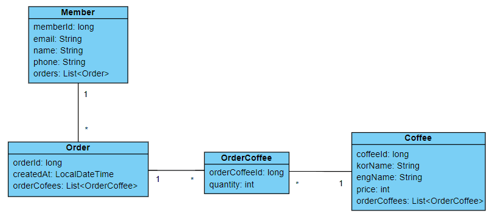
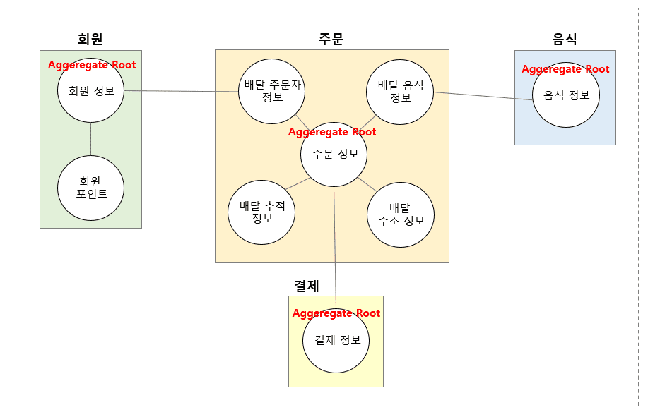

스프링 복습 및 정리 11.2P

<div class="cl1"></div>

이제 이전 포스트에서 설계한 대로 엔티티 클래스를 코드로 정의할 차례이다.

<div class="cl1"></div>

**테이블 설계**

<div class="cl4"></div>

<p align="center"></p>

<div class="cl4"></div>

테이블 간의 관계는 외래키라는 연결 요소가 있어서 직관적이다.

그런데 클래스들 간에는 외래키라는 연결 요소가 없다.

대신에 클래스들은  객체 간에 참조가 가능하기 때문에 이 객체 참조를 사용해서 외래키의 기능을 대신한다.

<div class="cl3"></div>

ORM에서 가장 헷갈리는 것들 중에 하나가 바로 외래키를 객체 참조로 표현하는 것이다.

<div class="cl3"></div>

MEMBER 테이블은 member_id를 ORDERS 테이블의 외래키로 지정하면 된다.

그러면 ORDERS 테이블의 데이터를 조회할 수 있다.

<div class="cl3"></div>

그런데 Member 클래스는 테이블이 아니어서 외래키 자체가 없다.

Member 클래스가 Order 클래스의 데이터를 조회하려면 객체 참조가 있으면 된다.

<div class="cl3"></div>

List인 이유는 사람들이 카페에 가면 커피를 여러 번 주문할 수 있듯이

Member 클래스 역시 Order 클래스의 객체를 여러 개 가질 수 있다.

여러 개의 객체는 List, Set 같은 컬렉션을 사용해서 표현한다.

<div class="cl1"></div>

## Aggregate 객체 매핑

데이터베이스 테이블의 경우 위에서 설계한 대로 테이블 스키마를 사용해서 테이블을 생성하면 된다.

<div class="cl3"></div>

그런데 문제는 도메인 엔티티 클래스이다.

지금까지 설계한 도메인 엔티티 클래스 간의 관계는 잘 설계된 게 맞지만

Spring Data JDBC를 사용하기 위해서는 설계한 도메인 엔티티 클래스의 관계를 DDD의 애그리거트 매핑 규칙에 맞게 한번 더 변경할 필요가 있다.

<div class="cl3"></div>

이 전 포스트에서 DDD의 애그리거트와 애그리거트 루트를 설명한 이유가 이것때문이다.

<div class="cl2"></div>

### 애그리거트 객체 매핑 규칙

1. **모든 엔티티 객체의 상태는 애그리거트 루트를 통해서만 변경할 수 있다.** <br> <br>

2. 동일한 하나의 애그리거트 내에서는 엔티티 간에 객체로 참조한다. <br> <br>

3. 애그리거트 루트 대 애그리거트 루트 간의 엔티티 객체 참조
  - 애그리거트 루트 간의 참조는 객체 참조 대신에 ID로 참조한다.
  - 1대1 또는 1대N 관계일 때 테이블 간의 외래키 방식과 동일하다.
  - N대N 관계일 때는 외래키 방식인 ID 참조와 객체 참조 방식이 함께 사용된다.

<div class="cl3"></div>

이 규칙을 밑에서 자세히 설명하겠다.

<div class="cl3"></div>

<p align="center"></p>

<div class="cl3"></div>

위 그림으로 **1번 규칙**을 설명하겠다.

<div class="cl3"></div>

회원 애그리거트의 경우, 애그리거트 루트는 회원 정보라는 엔티티 클래스가 될 것이다.

비용을 지불하고 주문을 하면 주문한 만큼 회원 포인트를 얻게 된다.

이때 프로그래밍적으로는 회원의 포인트를 업데이트해주어야 하는데,

회원 포인트라는 엔티티를 직접적으로 접근하지 말고 반드시 ‘회원 정보’ 라는 애그리거트 루트를 통해서 ‘회원 포인트’ 엔티티에 접근한 뒤,

포인트의 상태를 변경한다는 것이 바로 1번 규칙의 핵심이다.

<div class="cl3"></div>

주문 애그리거트 역시 마찬가지이다.

‘주문 정보’ 애그리거트 루트 이외에 다른 엔티티의 상태를 변경하려면 ‘주문 정보’ 애그리거트 루트를 거쳐서 엔티티의 상태를 변경해야 한다.

<div class="cl3"></div>

**결과적으로 애그리거트 루트를 통해서 나머지 엔티티에 접근한다는 것은 어떤 식으로든 애그리거트 루트가 나머지 모든 엔티티에 대한 객체를 직간접적으로 참조할 수 있다는 의미이다.**

<div class="cl3"></div>

**왜 애그리거트 루트를 통해서만 나머지 엔티티의 상태를 변경해야 하냐면 DDD와 관련이 있기 때문이다.**

<div class="cl3"></div>

음식을 주문한 이후에 주소를 잘못 입력해서 배달 주소 정보를 다시 변경하는 경우를 예로 들어보겠다.

<div class="cl3"></div>

이때, ‘배달 주소 정보’ 라는 엔티티에 직접적으로 접근해서 주소 정보를 바꾸어 버리면 주소 정보를 변경할 수 없는 상태에도 주소 정보를 변경할 수 잇게 되어버린다.

<div class="cl3"></div>

이를테면 음식이 이미 다 만들어져서 처음에 잘못 입력한 주소 정보로 배달을 하는 중인데,

배달 주소를 바꾼다고 배달 업체가 변경된 주소로 배달을 하지는 않을 것이다.

이 경우에는 음식점에 직접 전화해서 수동으로 변경 사항을 요청해야 할 것이다.

<div class="cl3"></div>

즉, ‘배달 주소 정보’ 라는 엔티티에 직접 접근해서 주소 정보를 변경하게 되면

‘음식이 다 만들어지기 전까지만 주소 정보를 변경할 수 있다’ 라는 규칙을 무시하고 상태를 변경하는 것이 되기 때문에 이런 도메인 규칙에 대한 일관성이 깨진다.

<div class="cl3"></div>

따라서 항상 ‘주문 정보’ 라는 애그리거트 루트를 먼저 거쳐서 규칙을 잘 검증한 후에 검증에 통과하면 ‘배달 주소 정보’ 엔티티의 상태를 어데이트하도록 해서 도메인 규칙의 일관성을 유지하도록 하는 것이다.

<div class="cl3"></div>

**2번 규칙**은 이미 알고 있는 엔티티 간에는 객체로 참조한다라는 규칙과 같다.

단, 2번 규칙은 동일한 애그리거트 내의 엔티티끼리 참조할 경우에만 적용되는 규칙이다.

<div class="cl3"></div>

**3번 규칙**의 핵심은 애그리거트 루트 간에 객체로 참조하지 않고,

테이블에 외래키를 추가하듯이 참조하고자 하는 애그리거트 루트의 ID를 참조 값으로 멤버 변수에 추가하는 것이다.

<div class="cl3"></div>

하지만 1대N일 경우와 N대N일 경우의 방식이 조금 다르다.

<div class="cl3"></div>

애그리거트 간의 매핑 규칙은 문장으로 쉽게 이해되지 않기 때문에 코드를 구현하면서 구체적으로 설명하겠다.

<div class="cl1"></div>

## Entity 구현

**Member**

```java
@Getter
@Setter
public class Member {
    @Id
    private long memberId;

    private String email;

    private String name;

    private String phone;
}
```

<div class="cl4"></div>

Member 클래스는 Spring Data JDBC의 엔티티이므로 memberId 멤버 변수에 `@Id` 어노테이션을 붙여 식별자로 지정했다.

<div class="cl3"></div>

이제 이 Member 클래스는 데이터베이스 테이블에서 MEMBER 테이블과 매핑된다.

<div class="cl2"></div>

**Order**

```java
@Getter
@Setter
@Table("ORDERS")
public class Order {
    @Id
    private long orderId;
    private long memberId;
}
```

<div class="cl4"></div>

위 코드는 Order 클래스 코드의 일부이다.

`@Table` 어노테이션을 추가하지 않으면 기본적으로 클래스명이 테이블의 이름과 매핑된다.

`@Table` 어노테이션을 추가하여 ORDERS로 테이블 명을 변경했다.

<div class="cl3"></div>

Order 클래스 역시 Spring Data JDBC의 엔티티이므로 orderId 멤버 변수에 `@Id` 어노테이션을 붙여 식별자로 지정했다.

이제 Order 클래스는 ORDERS 테이블과 매핑된다.

<div class="cl3"></div>

Member 클래스는 회원 애그리거트의 루트이다.

그리고 Order 클래스는 주문 애그리거트의 루트이다.

Member 클래스와 Order 클래스는 1대N의 관계이다.

<div class="cl3"></div>

애그리거트 간의 매핑 **규칙 3번에서 애그리거트 루트와 애그리거트 루트 간에는 객체로 직접 참조하는 것이 아니라 ID로 참조한다**고 했다.

이 때문에 Order 클래스에 **long memberId를 외래키처럼 추가**했다.

<div class="cl3"></div>

<div class="callout">
   <div class="callout-in">
       <p>위 코드에선 long memberId로 외래키를 표현했는데</p>
       <p>Spring Data JDBC에서는 AggregateReference 라는 클래스를 이용해</p>
       <p><code>private AggregateReference<Member, Long> memberId;</code>와 같이 외래키를 표현할 수도 있다.</p>
       <div class="cl3"></div>
       <p>이렇게 하면 코드를 통해 명시적으로 애그리거트 루트 간의 참조를 표현하기 때문에 코드 가독성이 좋아지지만,</p>
       <p>memberId 필드가 원시타입이 아닌 객체 참조 타입이므로 OrderMapper에서 DTO와 Entity 같이 변환에 추가 작업이 필요할 수 있다.</p>
   </div>
</div>

<div class="cl2"></div>

**Order 클래스와 Coffee 클래스의 애그리거트 루트 매핑**

두 클래스 모두 애그리거트의 루트이다.

Order 클래스와 Coffee 클래스는 **N대N 관계**이다.

<div class="cl3"></div>

애그리거트 매핑 규칙에서 3번인 

‘애그리거트 루트와 애그리거트 루트 간에는 객체로 직접 참조하는 것이 아니라 ID로 참조한다.‘

가 적용되지만 N대 N의 관계이기 때문에 1대 N의 관계인 Member, Order 클래스와는 조금 다르게 매핑이 된다.

<div class="cl3"></div>

**Coffee**

```java
@Getter
@Setter
public class Coffee {
    @Id
    private long coffeeId;
    private String korName;
    private String engName;
    private Integer price;
    private String CoffeeCode; // 추가
}
```

<div class="cl4"></div>

이제 `@Id` 어노테이션에 대한 설명은 하지 않겠다.

Cofee의 중복 등록을 체크하기 위해 필요한 coffeeCode 멤버 변수를 추가하였다.

<div class="cl2"></div>

**Order**

```java
@Getter
@Setter
@Table("ORDERS")
public class Order {
    @Id
    private long orderId;
    private long memberId;
    
    @MappedCollection(idColumn = "ORDER_ID")
    private Set<OrderCoffee> orderCoffees = new LinkedHashSet<>(); // 추가
}
```

<div class="cl4"></div>

위 코드에서는 Order 엔티티 클래스와 Coffee 엔티티 클래스를 매핑하기 위해 orderCoffees가 추가되었다.

<div class="cl3"></div>

Order, Coffee 두 클래스는 N대 N관계이다. 따라서 매핑 규칙 3번이 적용되지만 N대 N이기 때문에

1대1, 1대N과 같이 ID 값을 참조하지만 다른 방식을 적용한다.

<div class="cl3"></div>

우선 Order 클래스와 Coffee 클래스가 N대 N 관계이기 때문에 **이 관계를 1대 N, N대 1 관계로 풀어**줄 엔티티가 중간에 하나 필요하다.

<div class="cl3"></div>

그 엔티티 클래스가 OrderCoffee라는  클래스이다.

이 OrderCoffee 클래스는 주문 애그리거트에 포함된 ‘주문커피정보’ 엔티티의 역할을 하는데 중요한 건 

**이 엔티티가 Order 클래스와 동일한 애그리거트에 있다는 것**이다.

<div class="cl3"></div>

동일한 애그리거트 내에서는 객체 참조를 사용한다. (매핑 규칙 2번)

그래서 `Set<OrderCoffee>`를 통해 Order 클래스와 ‘주문커피정보’ 엔티티 역할을 하는 OrderCoffee 클래스와 1대 N의 관계를 만들 수 있다.

<div class="cl3"></div>

위 코드에서 추가한 `@MappedCollection(idColumn = "ORDER_ID")` 은 엔티티 클래스 간에 연관 관계를 맺어주는 정보를 의미한다.

<div class="cl3"></div>

OREDER_COFFEE테이블의 열 중에서 ORDERS테이블과 관계를 맺어주는 역할을 하는 열은

ORDERS 테이블의 기본키를 외래키로 가지는 열이다.

즉, ORDER_COFFEE에서외래키 역할을 하는 열명은 ORDER_ID이다.

<div class="cl3"></div>

```java
@MappedCollection(idColumn = "ORDER_ID", keyColumn = "ORDER_COFFEE_ID")
private Set<OrderCoffee> orderCoffees = new LinkedHashSet<>();
```

<div class="cl3"></div>

**idColumn**

idColumn 애트리뷰트는 자식 테이블에 추가되는 외래키에 해당되는 열명을 지정한다.

ORDERS 테이블의 자식 테이블은 ORDER_COFFEE 테이블이고 이 ORDER_ID 열의값을 외래키로 가진다.

<div class="cl3"></div>

**keyColumn**

keyColumn 애트리뷰트는 외래키를 포함하고 있는 테이블의 기본키 열명을 지정한다.

ORDERS 테이블의자식 테이블인 ORDER_COFFEE 테이블의 기본키는ORDER_COFFEE_ID 이므로

keyColumn의 값이다.

<div class="cl3"></div>

이제 OrderCoffee 클래스와 Coffee 클래스 간에 N대 1의 관계만 만들면 된다.

<div class="cl2"></div>

**OrderCoffee**

```java
@Getter
@Builder
@Table("ORDER_COFFEE")
public class OrderCoffee {
    @Id
    private long orderCoffeeId;
    private long coffeeId;
    private int quantity;
}
```

<div class="cl4"></div>

OrderCoffee 클래스는 주문 애그리거트 내에 있는 엔티티 클래스이다.

COFFEE 클래스는 커피 애그리거트 내에 있는 엔티티 클래스이자 애그리거트 루트이다.

따라서 애그리거트 간의 매핑 규칙을 따르기 때문에 Member, Order 클래스에서 했던 것처럼 coffeeId를 외래키처럼 추가한다.

<div class="cl2"></div>

**Order 클래스의 멤버 변수 추가**

```java
@Getter
@Setter
@Table("ORDERS")
public class Order {
    @Id
    private long orderId;
    private long memberId;

    @MappedCollection(idColumn = "ORDER_ID")
    private Set<OrderCoffee> orderCoffees = new LinkedHashSet<>();
    
    private OrderStatus orderStatus = OrderStatus.ORDER_REQUEST; // (1) 추가
    
    private LocalDateTime createdAt =LocalDateTime.now(); // (2) 추가
    
    public enum OrderStatus { // (3) 추가
        ORDER_REQUEST(1, "주문 요청"),
        ORDER_CONFIRM(2, "주문 확정"),
        ORDER_COMPLETE(3,"주문 완료"),
        ORDER_CANCEL(4, "주문 취소");
        
        @Getter
        private int stepNumber;
        
        @Getter
        private String stepDescription;

        OrderStatus(int stepNumber, String stepDescription) {
            this.stepNumber = stepNumber;
            this.stepDescription = stepDescription;
        }
    }
}
```

<div class="cl4"></div>

**(1) 주문 상태 정보**

(1)은 주문 상태 정보를 나타내는 멤버 변수이며, OrderStatus enum타입이다.

주문 정보가 저장될 때 기본 값은 ORDER_REQUEST이다.

<div class="cl3"></div>

**(2) 주문 등록 시간**

(2)는 주문이 등록되는 시간 정보를 나타내는 멤버 변수이며, LocalDateTime 타입이다.

<div class="cl3"></div>

**(3) OrderStatus enum**

주문의 상태를 나타내는 enum이다.

OrderStatus enum이 Order 클래스의 멤버로 포함이 되어 있는 이유는 OrderStatus는 주문을 위한 전용 상태 값으로 사용할 수 있기 때문이다.

<div class="cl3"></div>

만약 OrderStatus가 다른 기능에서도 사용할 가능성이 있다면 클래스 외부로 분리시킬 수 있겠지만

현재로서는 특별히 그럴 이유가 없다.

<div class="cl2"></div>

**테이블 생성 스크립트 추가**

마지막으로 schema.sql 파일에 테이블 생성 스크립트를 추가해서 애플리케이션 실행 시, 테이블이 생성되도록 한다.

```js
CREATE TABLE IF NOT EXISTS MEMBER (
    MEMBER_ID bigint NOT NULL AUTO_INCREMENT,
    EMAIL varchar(100) NOT NULL UNIQUE,
    NAME varchar(100) NOT NULL,
    PHONE varchar(100) NOT NULL,
    PRIMARY KEY (MEMBER_ID)
);

CREATE TABLE IF NOT EXISTS COFFEE (
    COFFEE_ID bigint NOT NULL AUTO_INCREMENT,
    KOR_NAME varchar(100) NOT NULL,
    ENG_NAME varchar(100) NOT NULL,
    PRICE int NOT NULL,
    COFFEE_CODE char(3) NOT NULL,
    PRIMARY KEY (COFFEE_ID)
);

CREATE TABLE IF NOT EXISTS ORDERS (
    ORDER_ID bigint NOT NULL AUTO_INCREMENT,
    MEMBER_ID bigint NOT NULL,
    ORDER_STATUS varchar(20) NOT NULL,
    CREATED_AT datetime NOT NULL,
    PRIMARY KEY (ORDER_ID),
    FOREIGN KEY (MEMBER_ID) REFERENCES MEMBER(MEMBER_ID)
);

CREATE TABLE IF NOT EXISTS ORDER_COFFEE (
    ORDER_COFFEE_ID bigint NOT NULL AUTO_INCREMENT,
    ORDER_ID bigint NOT NULL,
    COFFEE_ID bigint NOT NULL,
    QUANTITY int NOT NULL,
    PRIMARY KEY (ORDER_COFFEE_ID),
    FOREIGN KEY (ORDER_ID) REFERENCES ORDERS(ORDER_ID),
    FOREIGN KEY (COFFEE_ID) REFERENCES COFFEE(COFFEE_ID)
);
```

<div class="cl4"></div>

이제 엔티티 클래스에 대한 정의가 끝났다.

다음 챕터에서 서비스 클래스와 데이터 액세스 계층의 Repository 클래스를 구현하겠다.

