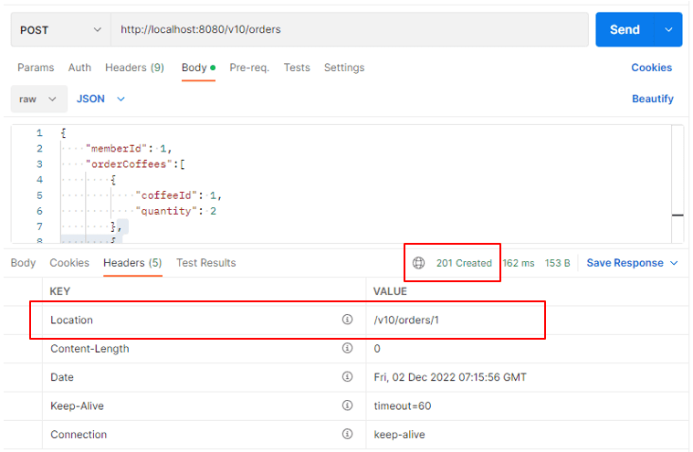

스프링 복습 및 정리 11.3P

<div class="cl1"></div>

이전 포스트에서 커피 주문 샘플 애플리케이션 도메인 엔티티 클래스 정의를 진행했다.

이제 이 도메인 엔티티 클래스를 이용해 서비스 클래스와 리포지토리 클래스를 구현해 보겠다.

<div class="cl3"></div>

<div class="callout">
   <div class="callout-in">
       <p>Spring Data JDBC, Spring Data JPA에서는 데이터 액세스 계층에서</p>
       <p>데이터베이스와 상호작용하는 역할을 하는 인터페이스를 Repository라고 한다.</p>
       <div class="cl4"></div>
       <p>이 Repository라는 용어는 DDD에서 사용하는 용어이다.</p>
   </div>
</div>

<div class="cl1"></div>

## Repository 인터페이스 정의

커피 주문을 하기 위해서는 회원 정보, 커피 정보, 주문 정보가 모두 필요하므로

이 정보를 모두 저장 및 조회할 수 있도록 각각의 리포지토리 인터페이스를 정의해 보겠다.

<div class="cl3"></div>

**MemberRepository**

```java
// (1)
public interface MemberRepository extends CrudRepository<Member, Long> {
    Optional<Member> findByEmail(String email); // (2)
}
```

<div class="cl3"></div>

Spring Data JDBC에서는 CrudRepository라는 인터페이스를 제공해주고 있으며,

이 CrudRepository의 기능을 사용하기 위해서 MemberRepository가 CrudRepository를 상속하고 있다.

<div class="cl3"></div>

`CrudRepository<Member, Long>`에서 Member는 Member 엔티티 클래스를 가리키며,

Long은 Member 엔티티 클래스에서 `@Id` 어노테이션이 붙은 멤버 변수의 타입을 가리킨다.

<div class="cl3"></div>

2는 Spring Data JDBC에서 지원하는 Query Method 정의를 이용한 데이터 조회 메서드를 정의했다.

find + by + SQL 쿼리문에서 WHERE 절의 열명 + (WHERE 절 열의 조건이 되는 데이터) 형식으로

쿼리 메서를 정의하면 조건에 맞는 데이터를 테이블에서 조회한다.

<div class="cl3"></div>

2에서는 email 열을 WHERE 절의 조건으로 지정해서 MEMBER 테이블에서 하나의 row를 조회하겠다고 정의했다.

이 쿼리 메서드는 이미 테이블에 등록된 이메일 주소가 있는지 확인하기 위한 용도로 사용한다.

<div class="cl3"></div>

2의 리턴값으로 SQL 질의를 통한 결과 데이터를 Member 엔티티 클래스의 객체로 지정했다.

Spring Data JDBC에서는 Optional을 지원하기 때문에 리턴값을 Optional로 래핑 할 수 있다.

<div class="cl3"></div>

<div class="callout">
   <div class="callout-in">
       <strong>쿼리 메서드 (Query Method)</strong>
       <div class="cl3"></div>
       <p>쿼리 메서드를 이요해서 SQL 쿼리문을 사용하지 않고 데이터베이스에 질의를 할 수 있다.</p>
       <div class="cl4"></div>
       <p>기본적인 사용법은 find + by + SQL 쿼리문에서 WHERE 절의 열명 + (WHERE 절 열의 조건이 되는 데이터) 형식이며,</p>
       <p>WHERE 절의 조건 열을 여러 개 지정하고 싶다면 And를 사용하면 된다.</p>
       <div class="cl4"></div>
       <p>예를 들어 EMAIL 열과 NAME 열을 조건으로 지정하고 싶다면,</p>
       <p>findByEmailAndName(String email, String name)과 같이 쿼리 메서드를 정의하면 된다.</p>
       <div class="cl4"></div>
       <p>주의해야 되는 부분은 findByXXXX에서 사용하는 열명은 내부적으로는 테이블의 열명으로 변경되지만</p>
       <p>Spring Data JDBC 입장에서는 엔티티 클래스를 바라보고 작업을 하기 때문에 반드시 엔티티 클래스의 멤버 변수명을 적어주어야 한다.</p>
       <div class="cl4"></div>
       <p>만약 Member 엔티티 클래스에 firstName이라는 멤버 변수가 있고,</p>
       <p>테이블에 있는 FIRST_NAME이라는 열명과 매핑이 된다고 가정할 경우,</p>
       <p>쿼리메서드는 findbyFirstName이 되어야지 findByFIRST_NAME이 되어서는 안된다.</p>
   </div>
</div>

<div class="cl2"></div>

**CoffeeRepository**

```java
public interface CoffeeRepository extends CrudRepository<Coffee, Long> {
    // (1)
    Optional<Coffee> findByCoffeeCode(String coffeeCode);
    
    // (2)
    @Query("SELECT * FROM COFFEE WHERE COFFEE_ID = :coffeeId")
    Optional<Coffee> findByCoffee(Long coffeeId);
}
```

<div class="cl4"></div>

1은 WHERE 절에서 COFFEE_CODE를 조건으로 질의하게 해주는 쿼리 메서드이다.

2에서는 COFFEE 테이블에 질의하기 위해 `@Query`라는 어노테이션을 사용했다.

`@Query` 어노테이션은 쿼리 메서드명을 기준으로 SQL 쿼리문을 생성하는 것이 아니라 개발자가 직접 쿼리문을 작성해서 질의를 할 수 있도록 해준다.

`@Query`에 작성된 쿼리문에서 `:coffeeId`는 `findByCoffeeId(Long coffeeId)`의 coffeeId 변수 값이 채워지는 동적 쿼리 파라미터 이다.

<div class="cl3"></div>

<div class="callout">
   <div class="callout-in">
       <p><code>@Query</code> 어노테이션을 사용하면 SQL 쿼리문을 직접 작성할 수 있기 때문에 복잡한 쿼리문의 경우</p>
       <p><code>@Query</code> 어노테이션을 사용해서 직접 쿼리문을 작성할 수 있다.</p>
       <div class="cl4"></div>
       <p>단순한 쿼리의 경우 Spring Data JDBC에서 지원하는 Query Method를 정의해서 사용하는 것이 간결한 코드 유지와 생산성 면에서 좋다.</p>
       <div class="cl4"></div>
       <p>위 (2)코드의 경우 예시를 들려고 사용한것 뿐, 실제로는 CrudRepository 인터페이스에 내장되어 있는 findById(Id id)를 사용하면 된다.</p>
   </div>
</div>

<div class="cl2"></div>

**OrderRepository**

```java
public interface OrderRepository extends CrudRepository<Order, Long> {
}
```

<div class="cl4"></div>

이전의 MemberRepository나 CofeeRepository에는 작성된 쿼리 메서드가 있었는데 OrderRepository는 작성된 쿼리메서드가 없다.

<div class="cl3"></div>

쿼리메서드가 없어도 CrudRepository 인터페이스를 상속하기 때문에 CrudRepository에 이미 정의되어 있는 기본 쿼리메서드를 서비스 클래스에서 사용할 수 있다.

<div class="cl1"></div>

## Service 클래스 구현

<div class="cl4"></div>

**MemberService**

```java
@Service
@AllArgsConstructor
public class MemberService {
    private MemberRepository memberRepository;

    public Member createMember(Member member) {
        // (1) 이미 등록된 이메일인지 검증
        verifyExistsEmail(member.getEmail());

        // (2) 회원 정보 저장
        return memberRepository.save(member);
    }

    public Member updateMember(Member member) {
        // (3) 존재하는 회원인지 검증
        Member findMember = findVerifiedMember(member.getMemberId());
        
        // (4) 이름 정보와 휴대폰 번호 정보 업데이트
        Optional.ofNullable(member.getName()).ifPresent(name -> findMember.setName(name));
        Optional.ofNullable(member.getPhone()).ifPresent(findMember::setPhone);
        
        // (5) 회원 정보 업데이트
        return memberRepository.save(findMember);
    }
    
    // (6) 특정 회원 정보 조회
    public Member findMember(long memberId) {
        return findVerifiedMember(memberId);
    }
    
    public List<Member> findMembers() {
        // (7) 모든 회원 정보 조회
        return (List<Member>) memberRepository.findAll();
    }
    
    public void deleteMember(long memberId) {
        // (8) 특정 회원 정보 삭제
        memberRepository.delete(findVerifiedMember(memberId));
    }

    // (9) 이미 존재하는 회원인지 검증
    public Member findVerifiedMember(long memberId) {
        Optional<Member> optionalMember = memberRepository.findById(memberId);

        return optionalMember.orElseThrow(() -> 
                new BusinessLogicException(ExceptionCode.MEMBER_NOT_FOUND));
    }
    
    // (10) 이미 등록된 이메일 주소인지 검증
    private void verifyExistsEmail(String email) {
        Optional<Member> member = memberRepository.findByEmail(email);
        if (member.isPresent()) throw new BusinessLogicException(ExceptionCode.MEMBER_EXISTS);
    }
}
```

<div class="cl4"></div>

MemberRepository 인터페이스는 정의했지만 인터페이스의 구현 클래스는 별도로 구현을 한 적이 없다.

이 MemberRepository 인터페이스의 구현 클래스는 Spring Data JDBC에서 내부적으로 

Java의 리플렉션 기술과 Proxy 기술을 이용해서 MemberRepository 인터페이스의 구현 클래스 객체를 생성해 준다.

<div class="cl3"></div>

(4)에서는 회원 존재 여부 검증에 통과한 회원이라면 이름과 주소 정보를 setter 메서드를 통해 변경한다.

`Optional.ofNullable(…)`을 사용하는 이유는 파라미터로 전달받은 member 객체는 클라이언트 쪽에서

사용자가 이름 정보나 휴대폰 정보를 선택적으로 수정할 수 있기 때문에 name 멤버 변수가 null일 수도 있고, phone 멤버 변수가 null일 수도 있다.

<div class="cl3"></div>

이처럼 멤버 변수 값이 null일 경우에는 `Optional.of()`가 아닌 `Optional.ofNullable()`을 이용해서 null 값을 허용할 수 있다.

<div class="cl3"></div>

따라서 값이 null이더라도 NullPointerException이 발생하지 않고, 다음 메서드인 ifPresent() 메서드를 호출할 수 있다.

<div class="cl3"></div>

수정할 값이 있다면 ifPresent() 메서드 내의 코드가 실행이 되고, 값이 없다면 아무 동작도 하지 않는다.

<div class="cl3"></div>

(5)에서는 name 또는 phone 멤버 변수의 수정된 값이 적용되어 테이블에서 회원 정보를 업데이트한다.

`@Id` 어노테이션이 추가된 엔티티 클래스의 멤버 변수 값이 0 또는 null이면 신규 데이터라고 판단하여 테이블에 insert 쿼리를 전송한다.

<div class="cl3"></div>

반면에 `@Id` 어노테이션이 추가된 엔티티 클래스의 멤버 변수 값이 0 또는 null이 아니라면 이미 테이블에 존재하는 데이터라고 판단하여 테이블에 update 쿼리를 전송한다.

<div class="cl3"></div>

(7)에서는 findAll() 메서드의 리턴값이 `Iterable<T>`이기 때문에 `List<Member>`로 캐스팅했다.

<div class="cl3"></div>

(8)에서는 특정 회원 정보를 삭제한다.

위 코드에선 학습을 위해 회원 정보 자체를 테이블에서 삭제했지만

실무에서는 **테이블의 데이터 자체를 삭제하기보다는 MEMBER_STATUS 같은 열을 두어 상태 값만 변경한다.**

회원의 회원 가입 상태를 가입, 휴면, 탈퇴 등의 상태 정보로 나누어서 관리하는 것이 좋다.

<div class="cl2"></div>

**CoffeeService**

```java
@Service
@AllArgsConstructor
public class CoffeeService {
    private CoffeeRepository coffeeRepository;

    public Coffee createCoffee(Coffee coffee) {
        // (1) 커피 코드를 대문자로 변경
        String coffeeCode = coffee.getCoffeeCode().toUpperCase();

        // 이미 등록된 커피 코드인지 확인
        verifyExistCoffee(coffeeCode);
        coffee.setCoffeeCode(coffeeCode);

        return coffeeRepository.save(coffee);
    }

    public Coffee updateCoffee(Coffee coffee) {
        // 조회하려는 커피가 검증된 커피인지 확인
        Coffee findCoffee = findVerifiedCoffee(coffee.getCoffeeId());

        Optional.ofNullable(coffee.getKorName()).ifPresent(findCoffee::setKorName);
        Optional.ofNullable(coffee.getEngName()).ifPresent(findCoffee::setEngName);
        Optional.ofNullable(coffee.getPrice()).ifPresent(findCoffee::setPrice);

        return coffeeRepository.save(findCoffee);
    }
    
    public Coffee findCoffee(long coffeeId) {
        return findVerifiedCoffeeByQuery(coffeeId);
    }
    
    // (2) 주문에 해당하는 커피 정보 조회
    public List<Coffee> findOrderedCoffees(Order order) {
        return order.getOrderCoffees()
                .stream()
                .map(orderCoffee -> findCoffee(orderCoffee.getCoffeeId()))
                .collect(Collectors.toList());
    }
    
    public List<Coffee> findCoffees() {
        return (List<Coffee>) coffeeRepository.findAll();
    }
    
    public void deleteCoffee(long coffeeId) {
        coffeeRepository.delete(findVerifiedCoffee(coffeeId));
    }
    
    public Coffee findVerifiedCoffee(long coffeeId) {
        Optional<Coffee> optionalCoffee = coffeeRepository.findById(coffeeId);

        return optionalCoffee.orElseThrow(() -> new BusinessLogicException(ExceptionCode.COFFEE_NOT_FOUND));
    }

    private void verifyExistCoffee(String coffeeCode) {
        Optional<Coffee> coffee = coffeeRepository.findByCoffeeCode(coffeeCode);
        if (coffee.isPresent()) throw new BusinessLogicException(ExceptionCode.COFFEE_CODE_EXISTS);
    }

    private Coffee findVerifiedCoffeeByQuery(long coffeeId) {
        Optional<Coffee> optionalCoffee = coffeeRepository.findByCoffee(coffeeId);

        return optionalCoffee.orElseThrow(() -> new BusinessLogicException(ExceptionCode.COFFEE_NOT_FOUND));
    }
}
```

<div class="cl4"></div>

(1)은 사용자가 대소문자에 신경 쓰지 않고 입력할 수 있도록 사용자 편의성을 높여주는 기능을 한다.

<div class="cl3"></div>

(2) Order 객체는, memberId와 orderStatus 값만 얻을 수 있지 실제 회원이 주문한 커피 정보는 얻을 수 없다. 따라서 getOrderCoffees()를 통해서 주문한 구체적인 커피 정보를 얻어와야 한다.

<div class="cl3"></div>

`findOrderedCoffees(Order order)` 메서드의 리턴값은 OrderResponseDto 클래스에 포함되는데 이 부분은 뒤에서 다시 설명하겠다.

<div class="cl2"></div>

**OrderService**

```java
@Service
@AllArgsConstructor
public class OrderService {
    final private OrderRepository orderRepository;
    final private MemberService memberService;
    final private CoffeeService coffeeService;

    public Order createOrder(Order order) {
        // 회원이 존재하는지 확인
        memberService.findVerifiedMember(order.getMemberId());

        // 커피가 존재하는지 조회
        order.getOrderCoffees()
                .stream()
                .forEach(orderCoffee -> {
                    coffeeService.findVerifiedCoffee(orderCoffee.getCoffeeId());
                });
        
        return orderRepository.save(order);
    }
    
    public Order findOrder(long orderId) {
        return findVerifiedOrder(orderId);
    }
    
    public List<Order> findOrders() {
        return (List<Order>) orderRepository.findAll();
    }
    
    public void cancelOrder(long orderId) {
        Order findOrder = findVerifiedOrder(orderId);
        int step = findOrder.getOrderStatus().getStepNumber();
        
        // OrderStatus의 step이 2미만일 경우(ORDER_CONFIRM)에만 주문취소가 되도록한다.
        if (step >= 2) {
            throw new BusinessLogicException(ExceptionCode.CANNOT_CHANGE_ORDER);
        }
        
        findOrder.setOrderStatus(Order.OrderStatus.ORDER_CANCEL);
        orderRepository.save(findOrder);
    }

    private Order findVerifiedOrder(long orderId) {
        Optional<Order> optionalOrder = orderRepository.findById(orderId);
        return optionalOrder.orElseThrow(() -> new BusinessLogicException(ExceptionCode.ORDER_NOT_FOUND));
    }
}
```

<div class="cl4"></div>

일반적으로 커피 주문이 확정되면 커피 주문을 취소할 수 없어야 된다.

따라서 OrderStatus가 주문 요청(ORDER_REQUEST) 단계를 넘어가면 주문 정보를 변경할 수 없도록 하며,

주문 요청(ORDER_REQUEST) 단계 까지만 주문을 취소할 수 있도록 한다.

<div class="cl1"></div>

## 기타 수정 코드

<div class="cl4"></div>

**CoffeePostDto**

```java
@Getter
public class CoffeePostDto {
    @NotBlank
    private String korName;

    @NotBlank
    @Pattern(regexp = "^([A-Za-z])(\\s?[A-Za-z])*$",
            message = "커피명(영문)은 영문이어야 합니다(단어 사이 공백 한 칸 포함). 예) Cafe Latte")
    private String engName;

    @Range(min = 100, max = 50000)
    private int price;

    @NotBlank
    @Pattern(regexp = "^([A-Za-z]){3}$", message = "커피 코드는 3자리 영문이어야 합니다.")
    private String coffeeCode;
}
```

<div class="cl2"></div>

**OrderController**

```java
@RestController
@RequestMapping("/v5/orders")
@Validated
public class OrderController {
    private final static String ORDER_DEFAULT_URL = "/v10/orders"; // (1) Default URL 경로
    private final OrderService orderService;
    private final OrderMapper mapper;
    private final CoffeeService coffeeService;

    public OrderController(OrderService orderService, OrderMapper mapper, CoffeeService coffeeService) {
        this.orderService = orderService;
        this.mapper = mapper;
        this.coffeeService = coffeeService;
    }

    @PostMapping
    public ResponseEntity postOrder(@Valid @RequestBody OrderPostDto orderPostDto) {
        Order order = orderService.createOrder(mapper.orderPostDtoToOrder(orderPostDto));

        // (2) 등록된 주문(Resource)에 해당하는 URI 객체
        URI location =
                UriComponentsBuilder
                        .newInstance()
                        .path(ORDER_DEFAULT_URL + "/{order-id}")
                        .buildAndExpand(order.getOrderId())
                        .toUri();

        return ResponseEntity.created(location).build(); // (3) HTTP 201 Created Status
    }

    @GetMapping("/{order-id}")
    public ResponseEntity getOrder(@PathVariable("order-id") @Positive long orderId) {
        Order order = orderService.findOrder(orderId);

        return new ResponseEntity<>(mapper.orderToOrderResponseDto(coffeeService, order), HttpStatus.OK);
    }

    @GetMapping
    public ResponseEntity getOrders() {
        List<Order> orders = orderService.findOrders();

        List<OrderResponseDto> response =
                orders.stream()
                        .map(order -> mapper.orderToOrderResponseDto(coffeeService, order))
                        .collect(Collectors.toList());

        return new ResponseEntity<>(response, HttpStatus.OK);
    }

    @DeleteMapping("/{order-id}")
    public ResponseEntity cancelOrder(@PathVariable("order-id") long orderId) {
        orderService.cancelOrder(orderId);
        return new ResponseEntity<>(HttpStatus.NO_CONTENT);
    }
}
```

<div class="cl4"></div>

**postOrder() 핸들러 메서드의 수정 내용**

이 전까지는 데이터베이스를 연동하지 않았기 때문에 주문 정보 등록 시,

OrderController에서 OrderService의 `createOrder(order)`를 호출해 등록할 주문을 전달하고,

이렇게 전달한 Order 객체를 `createOrder(order)`의 리턴 값으로 그대로 리턴하도록 했다.

<div class="cl3"></div>

그런데 이제는 등록할 주문 정보는 데이터베이스에 저장이 되고,

ORDER 테이블에 하나의 row로 저장이 된다.

즉, ORDER_ID라는 고유한 식별자를 가지는 진정한 주문 정보로써의 역할을 하게 된다.

<div class="cl3"></div>

일반적으로 클라이언트 측에서 백엔드 애플리케이션 측에 어떤 리소스(회원 정보, 커피 정보, 주문 정보 등)의 등록을 요청할 경우,

백엔드 애플리케이션은 해당 리소스를 데이터베이스에 저장한 후 요청한 리소스가 성공적으로 저장되었음을 알리는

`201 Created` HTTP Status를 response header에 추가해서 클라이언트 측에 응답으로 전달한다.

<div class="cl3"></div>

그리고 추가적으로 데이터베이스에 저장된 리소스의 위치를 알려주는

위치 정보(Location)인 URI를 역시 response header에 추가해서 응답으로 전달한다.

<div class="cl3"></div>

클라이언트 측에서는 response header에 포함된 리소스의 위치 정보를 얻은 후에

해당 리소스의 URI로 다시 요청을 전송해서 리소스의 정보를 얻어온다.

<div class="cl3"></div>

위에서 설명한 이 내용을 postOrder() 핸들러 메서드에 적용해 보겠다.

<div class="cl3"></div>

(1)에서 리소스(주문 정보)의 디폴트 URL을 정의한다.

(2)에서 UriComponentsBuilder를 이용해 등록된 리소스의 위치 정보인 URI 객체를 생성한다.

(3)에서 `ResponseEntity.created(location).build();`를 이용해 응답 객체를 리턴한다.

`ResponseEntity.created(location).build();` 메서드는 내부적으로 201 Created HTTP Status를

response header에 추가하고, 별도의 response body는 포함하지 않는다.

<div class="cl4"></div>

<p align="center"></p>

<div class="cl4"></div>

postOrder() request를 전송할 경우의 response 모습이다. 201 Created HTTP Status이고,

등록된 주문 정보의 위치 정보가 Location header에 포함되어 있다.

<div class="cl3"></div>

백엔드 애플리케이션 측에 리소스를 등록할 경우에는 등록된 리소스의 정보를 응답으로 리턴할 필요가 없다.

<div class="cl2"></div>

**OrderPostDto**

```java
@Getter
@AllArgsConstructor
public class OrderPostDto {
    @Positive
    private long memberId;

    // 여러 잔의 커피를 주문할 수 있도록 수정
    @Valid
    private List<OrderCoffeeDto> orderCoffees;
}
```

<div class="cl2"></div>

**OrderCoffeeDto 클래스 추가**

```java
@Getter
@AllArgsConstructor
public class OrderCoffeeDto {
    @Positive
    private long coffeeId;
    
    @Positive
    private int quantity;
}
```

<div class="cl2"></div>

**OrderCoffeeRepsonseDto 클래스 추가**

```java
@Getter
@AllArgsConstructor
public class OrderCoffeeResponseDto {
    private long coffeeId;
    private String korName;
    private String engName;
    private int price;
    private int quantity;
}
```

<div class="cl2"></div>

**OrderResponseDto**

```java
@Getter
@Setter
public class OrderResponseDto {
    private long orderId;
    private long memberId;
    private Order.OrderStatus orderStatus;
    private List<OrderCoffeeResponseDto> orderCoffees;
    private LocalDateTime createdAt;
}
```

<div class="cl2"></div>

**OrderMapper**

```java
@Mapper(componentModel = "spring")
public interface OrderMapper {
    default Order orderPostDtoToOrder(OrderPostDto orderPostDto) {
        Order order = new Order();

        // (1)
        order.setMemberId(orderPostDto.getMemberId());

        // (2)
        Set<OrderCoffee> orderCoffees = orderPostDto.getOrderCoffees()
                .stream()
                .map(orderCoffeeDto ->
                        // (2-1)
                        OrderCoffee.builder()
                        .coffeeId(orderCoffeeDto.getCoffeeId())
                        .quantity(orderCoffeeDto.getQuantity())
                        .build()).collect(Collectors.toSet());

        order.setOrderCoffees(orderCoffees);

        return order;
    }

    default OrderResponseDto orderToOrderResponseDto(CoffeeService coffeeService, Order order) {
        // (3)
        long memberId = order.getMemberId();

        // (4)
        List<OrderCoffeeResponseDto> orderCoffees =
                orderCoffeesToOrderCoffeeResponseDtos(coffeeService, order.getOrderCoffees());

        OrderResponseDto orderResponseDto = new OrderResponseDto();
        orderResponseDto.setOrderCoffees(orderCoffees);
        orderResponseDto.setMemberId(memberId);
        orderResponseDto.setCreatedAt(order.getCreatedAt());
        orderResponseDto.setOrderId(order.getOrderId());
        orderResponseDto.setOrderStatus(order.getOrderStatus());

        return orderResponseDto;
    }

    default List<OrderCoffeeResponseDto> orderCoffeesToOrderCoffeeResponseDtos
            (CoffeeService coffeeService, Set<OrderCoffee> orderCoffees) {

        // (5)
        return orderCoffees.stream()
                .map(orderCoffee -> {
                    // (5-1)
                    Coffee coffee = coffeeService.findCoffee(orderCoffee.getCoffeeId());
                    
                    return new OrderCoffeeResponseDto(
                            coffee.getCoffeeId(),
                            coffee.getKorName(),
                            coffee.getEngName(),
                            coffee.getPrice(),
                            orderCoffee.getQuantity()
                    );
                }).collect(Collectors.toList());
    }
}
```

<div class="cl4"></div>

OrderMapper 인터페이스는 DTO와 Entity 클래스 간의 복잡한 매핑 절차로 인해 기존에 MapStruct가

엔티티 클래스와 DTO 클래스를 대신 매핑해 주던 방식에서 개발자가 직접 매핑 작업 코드를 구현하는 것으로 변경되었다.

<div class="cl3"></div>

- `orderPostDtoToOrder(OrderPostDto orderPostDto)`
    - orderPostDtoToOrder() 메서드는 등록하고자 하는 커피 정보(OrderPostDto)를 Order Entity 클래스의 객체로 변환하는 역할을 한다.
    - (1)에서는 orderPostDto에 포함된 memberId를 Order 클래스의 memberId에 할당해 준다.
    - (2)에서는 `Set<OrderCoffee> orderCoffees`로 변환하고 있다.
        - (2-1)에서는 OrderCoffee 클래스에 @Builder 어노테이션이 적용되어 있으므로 lombok에서 지원하는 빌더 패턴을 사용할 수 있다.
        - 따라서 빌더 패턴을 이용해 `List<OrderCofeeDto> orderCoffees`에 포함된 주문한 커피 정보를 OrderCoffee의 필드에 추가하고 있다.
        - 빌더 패턴을 사용하는 것은 필수는 아니다. 빌더 패턴을 사용하든 new 키워드로 객체를 생성하든 상관없지만 빌더 패턴의 사용 예를 보여주기 위해 사용했다.
        - @Builder 어노테이션 [[더보기]](https://preasim.github.io/65#builder)

<div class="cl3"></div>

- `orderToOrderResponseDto(CoffeeService coffeeService, Order order)`
    - orderToOrderResponseDto()는 데이터베이스에서 조회한 Order 객체를 OrderResponseDto 객체로 변환해 주는 역할을 한다.
    - (3)에서는 Order의 memberId 필드 값을 얻는다.
    - (4)에서는 주문한 커피의 구체적인 정보를 조회하기 위해 `orderToOrderCoffeeResponseDto(coffeeService, order.getOrderCoffees());`를 호출한다.
        - `order.getOrderCoffees()`의 리턴 값은 `Set<OrderCofee> orderCoffees`이고, 이 orderCoffees에는 커피명이나 가격 같은 구체적인 커피 정보가 포함된 것이 아니기 때문에 DB에서 구체적인 커피 정보를 조회하는 추가 작업을 수행해야 한다.

<div class="cl3"></div>

- `orderCoffeesToOrderCoffeeResponseDtos(coffeeService coffeeService, Set<OrderCoffee> orderCoffees)`
    - orderCoffeesToOrderCoffeeResponseDtos()는 데이터베이스에서 커피의 구체적인 정보를 조회한 후, OrderCoffeeResponseDto에 커피 정보를 채워 넣는 역할을 한다.
    - (5)에서는 파라미터로 전달받은 orderCoffees를 Java의 Stream을 이용해 DB에서 구체적인 커피 정보를 조회한 후, OrderCoffeeResponseDto로 변환하는 작업을 하고 있다.
        - (5-1)에서 파라미터로 전달받은 coffeeService 객체를 이용해 coffeeId에 해당하는 Coffee를 조회하고 있다.

<div class="cl2"></div>

**ExceptionCode**

```java
public enum ExceptionCode {
    MEMBER_NOT_FOUND(404, "Member not found"),
    MEMBER_EXISTS(409, "Member exists"),
    COFFEE_NOT_FOUND(404, "Coffee not found"),
    COFFEE_CODE_EXISTS(409, "Coffee Code exists"),
    ORDER_NOT_FOUND(404, "Order not found"),
    CANNOT_CHANGE_ORDER(403, "Order can not change"),
    NOT_IMPLEMENTATION(501, "Not Implementation");

    @Getter
    private int status;

    @Getter
    private String message;

    ExceptionCode(int code, String message) {
        this.status = code;
        this.message = message;
    }
}
```

<div class="cl2"></div>

## 애플리케이션 실행

구현한 커피 주문 샘플 애플리케이션을 실행해서 데이터베이스에 저장이 잘 되는지 확인한다.

애플리케이션 실행 후, 아래와 같은 순서대로 테스트를 진행한다.

<div class="cl3"></div>

**회원 정보 등록**

```java
{
    "email": "hgd@gmail.com",
    "name": "홍길동",
    "phone": "010-1234-5555"
}
```

<div class="cl3"></div>

**커피 정보 등록**

```java
{
    "korName": "카라멜 라떼",
    "engName": "Caramel Latte",
    "price": 4500,
    "coffeeCode": "CRL"
}
```

```java
{
    "korName": "바닐라 라떼",
    "engName": "Vanilla Latte",
    "price": 5000,
    "coffeeCode": "VNL"
}
```

<div class="cl3"></div>

**커피 주문**

등록한 회원 정보로 등록한 커피 정보를 주문한다.

```java
{
    "memberId": 1,
    "orderCoffees":[
        {
            "coffeeId": 1,
            "quantity": 2
        },
        {
            "coffeeId": 2,
            "quantity": 1
        }
    ]
}
```

<div class="cl3"></div>

정상적으로 주문이 되었다면 아래와 같이 headers 탭에서 Location 정보를 확인할 수 있다.

<p align="center"></p>

