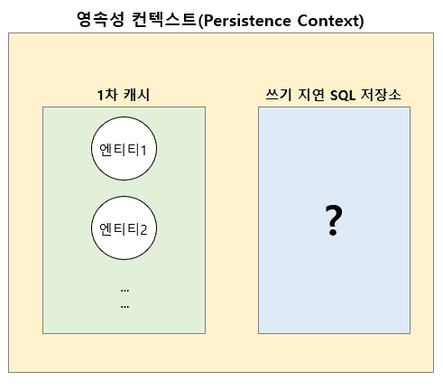
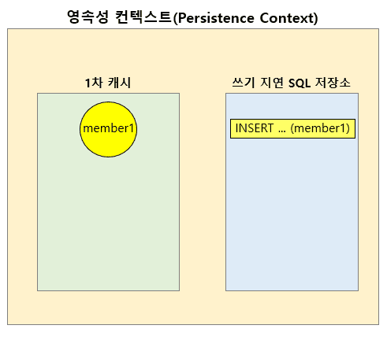
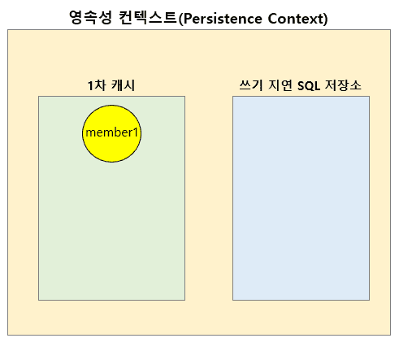
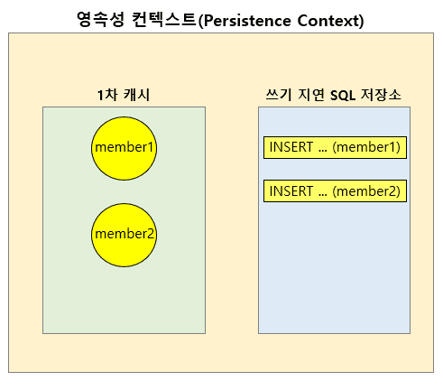
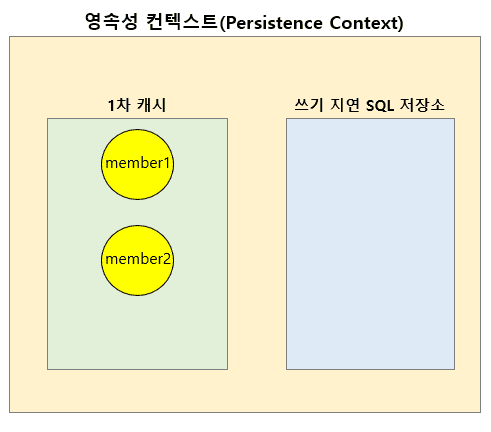

스프링 복습 및 정리 12P

<div class="cl1"></div>

## JPA란?

JPA(Java Persistence API)는 Java 진영에서 사용하는 ORM(Object-Relational Mapping) 기술의 표준 사양이다.

<div class="cl3"></div>

포준 사양(또는 명세)이라는 의미는 다시 말하면 Java의 인터페이스로 사양이 정의되어 있기 때문에 JPA라는 표준 사양을 구현한 구현체는 따로 있다는 것을 의미한다.

<div class="cl3"></div>

우리가 JPA를 학습한다라고 하면 JPA 표준 사양을 구현한 구현체에 대해서 학습한다라고 생각하면 된다.

<div class="cl2"></div>

### Hibernate ORM

JPA 표준 사양을 구현한 구현체로는 Hibernate ORM, EclipseLink, DataNucleus 등이 있는데,

여기서 설명할 구현체는 Hibernate ORM이다.

<div class="cl3"></div>

Hibernate ORM은 JPA에서 정의해 둔 인터페이스를 구현한 구현체로써 JPA에서 지원하는 기능 이외에 Hibernate 자체적으로 사용할 수 있는 API 역시 지원하고 있다.

<div class="cl4"></div>

> JPA는 Java Persistence API의 약자이지만 현재는 Jakarta Persistence라고도 불린다.

<div class="cl1"></div>

## 데이터 액세스 계층

데이터 액세스 계층에서의 JPA 위치

<p align="center" style="margin: 26px 0 26px 0"></p>

JPA는 위 그림과 같이 데이터 액세스 계층의 상단에 위치한다.

<div class="cl3"></div>

데이터 저장, 조회 등의 작업은 JPA를 거쳐 JPA의 구현체인 Hibernate ORM을 통해서 이루어지며

Hibernate ORM은 내부적으로 JDBC API를 이용해서 데이터베이스에 접근하게 된다.

<div class="cl1"></div>

## Persistence

JPA에서 P(Persistence)의 의미

<div class="cl3"></div>

Persistence는 영속성, 지속성이라는 뜻을 가지고 있다.

즉, **무언가를 금방 사라지지 않고 오래 지속되게 한다라는 것이 Persistence의 목적**이다.

<div class="cl2"></div>

### 영속성 컨텍스트(Persistence Context)

ORM은 객체와 데이터베이스 테이블의 매핑을 통해 엔티티 클래스 객체 안에 포함된 정보를 테이블에 저장하는 기술이다.

<div class="cl3"></div>

JPA에서는 테이블과 매핑되는 엔티티 객체 정보를 **영속성 컨텍스트라는 곳에 보관**해서 애플리케이션 내에서 오래 지속되도록 한다.

그리고 이렇게 보관된 엔티티 정보는 데이터베이스 테이블에 데이터를 저장, 수정, 조회, 삭제하는 데 사용된다.

<p align="center" style="margin: 26px 0 26px 0"></p>

영속성 컨텍스트에는 **1차 캐시**라는 영역과 **쓰기 지연 SQL 저장소**라는 영역이 있다.

<div class="cl3"></div>

JPA API 중에서 엔티티 정보를 영속성 컨텍스트에 저장(persist)하는 API를 사용하면

영속성 컨텍스트의 1차 캐시에 엔티티 정보가 저장된다.

<div class="cl3"></div>

밑에서 JPA에서 지원하는 API를 사용해서 영속성 컨텍스트에 엔티티를 저장해 보겠다.

<div class="cl2"></div>

### JPA API 영속성 컨텍스트

<div class="cl4"></div>

**build.gradle**

```js
dependencies {
	implementation 'org.springframework.boot:spring-boot-starter-web'
	implementation 'org.springframework.boot:spring-boot-starter-data-jpa' // (1)
	compileOnly 'org.projectlombok:lombok'
	runtimeOnly 'com.h2database:h2'
	annotationProcessor 'org.projectlombok:lombok'
	testImplementation 'org.springframework.boot:spring-boot-starter-test'
}
```

<div class="cl4"></div>

(1)과 같이 spring-boot-starter-data-jpa를 추가하면 Spring Data JPA 기술을 포함해서 JPA API를 사용할 수 있다.

> Spring Data JPA가 아닌 JPA API만 사용하고 싶다면 JPA 관련 의존 라이브러리를 별도로 추가해야 한다.

<div class="cl2"></div>

**application.yml**

```js
spring:
  h2:
    console:
      enabled: true
      path: /h2     
  datasource:
    url: jdbc:h2:mem:test
  jpa:
    hibernate:
      ddl-auto: create  # (1) 스키마 자동 생성
    show-sql: true      # (2) SQL 쿼리 출력
```

<div class="cl4"></div>

(1)은 JPA에서 사용하는 엔티티 클래스를 정의하고 애플리케이션 실행 시, 이 엔티티와 매핑되는 테이블을 DB에 자동으로 생성해 준다.

<div class="cl3"></div>

즉, Spring Data JDBC에서는 schema.sql 파일을 이용해 테이블 생성을 위한 스키마를 직접 지정해 주어야 했지만 

JPA에서는 (1)의 설정을 추가하면 **JPA가 자동으로 DB에 테이블을 생성**해 준다.

<div class="cl3"></div>

(2)는 JPA의 동작 과정을 이해하기 위해 JPA API를 통해서 실행되는 SQL 쿼리를 로그로 출력해 준다.

<div class="cl2"></div>

**Configuration**

샘플 코드 실행을 위한 Configuration 클래스 생성

```java
// (1)
@Configuration
public class JpaBasicConfig {
    private EntityManager em;
    private EntityTransaction tx;

		// (2)
    @Bean
    public CommandLineRunner testJpaBasicRunner(EntityManagerFactory emFactory) {
        this.em = emFactory.createEntityManager();
        this.tx = em.getTransaction();

        return args -> {
            // (3) 코드 작성
        };
    }
}
```

@Configuration [[더보기]](https://preasim.github.io/65#configuration)

<div class="cl4"></div>

위 코드에서 (1)과 같이 특정 클래스에 @Configuration 어노테이션을 추가하면

Spring에서 Bean 검색 대상인 Configuration 클래스로 간주해서

(2)와 같이 @Bean 어노테이션이 추가된 메서드를 검색한 후, 해당 메서드에서 리턴하는 객체를 Spring Bean으로 추가해 준다.

<div class="cl3"></div>

(3)과 같이 CommandLineRunner 객체를 람다 표현식으로 정의해 주면 애플리케이션

부트스트랩 과정이 완료된 후에 이 람다 표현식에 정의한 코드를 실행해 준다.

<div class="cl2"></div>

**영속성 컨텍스트에 엔티티 저장**

```java
@Getter
@Setter
@NoArgsConstructor
@Entity // (1)
public class Member {
    @Id // (2)
    @GeneratedValue // (3)
    private long memberId;
    private String email;

    public Member(String email) {
        this.email = email;
    }
}
```

<div class="cl4"></div>

위 코드는 JPA에서 사용하기 위한 Member 엔티티 클래스이다.

@Entity 어노테이션과 @Id 어노테이션을 추가해 주면 JPA에서 해당 클래스를 엔티티 클래스로 인식한다.

<div class="cl3"></div>

(3)의 @GeneratedValue 어노테이션은 식별자를 생성해 주는 전략을 지정할 때 사용한다.

@GeneratedValue 어노테이션에 대해서는 다음 포스트와 [[더보기]](https://preasim.github.io/65#generatedvalue) ← 여길 참고하면 된다.

<div class="cl2"></div>

**Configuration**

영속성 컨텍스트 Member 객체를 저장

```java
@Configuration
public class JpaBasicConfig {
    private EntityManager em;
    
    @Bean
    public CommandLineRunner testJpaBasicRunner(EntityManagerFactory emFactory) { // (1)
        this.em = emFactory.createEntityManager(); // (2)

        return args -> {
            example01();
        };
    }
    
    private void example01() {
        Member member = new Member("abc@gmail.com");
        
        // (3)
        em.persist(member);
        
        // (4)
        Member resultMember = em.find(Member.class, 1L);
        System.out.println("Id: " + resultMember.getMemberId() + ", email: " + resultMember.getEmail());
    }
}
```

<div class="cl4"></div>

위 코드는 이전에 정의한 Member 엔티티 클래스의 객체를 JPA의 영속성 컨텍스트에 저장하는 예제 코드이다.

<div class="cl3"></div>

JPA의 영속성 컨텍스트는 EntityManager 클래스에 의해서 관리되는데 이 EntityManager 클래스의 객체는 

(1)과 같이 EntityManagerFactory 객체를 Spring으로부터 DI 받을 수 있다.

<div class="cl3"></div>

(2)와 같이 EntityManagerFactory의 createEntityManager() 메서드를 이용해서 EntityManager 클래스의 객체를 얻을 수 있다

이제 이 EntityManager 클래스의 객체를 통해서 JPA의 API 메서드를 사용할 수 있다.

<div class="cl3"></div>

(3)과 같이 `persist(member)` 메서드를 호출하면 영속성 컨텍스트에 member 객체의 정보들이 저장된다.

<div class="cl3"></div>

(4)에서는 영속성 컨텍스트에 member 객체가 잘 저장되었는지 `find(Member.class, 1L)` 메서드로 조회하고 있다.

<div class="cl4"></div>

<p align="center" style="margin: 26px 0 26px 0"></p>

위 코드를 실행했을 때의 영속성 컨텍스트의 상태이다.

<div class="cl3"></div>

`em.persist(member)`를 호출하면 위 그림과 같이 1차 캐시에 member 객체가 저장되고,

이 member 객체는 쓰기 지연 SQL 저장소에 INSERT 쿼리 형태로 등록이 된다.

<div class="cl3"></div>

```js
Hibernate: drop table if exists member CASCADE 
Hibernate: drop table if exists orders CASCADE 
Hibernate: drop sequence if exists hibernate_sequence
Hibernate: create sequence hibernate_sequence start with 1 increment by 1
Hibernate: create table member (member_id bigint not null, email varchar(255), primary key (member_id))
Hibernate: create table orders (order_id bigint not null, created_at timestamp, primary key (order_id))
Hibernate: call next value for hibernate_sequence

**Id: 1, email: abc@gmail.com**
```

<div class="cl4"></div>

출력 결과를 보면 ID가 1인 Member의 email 주소를 영속성 컨텍스트에서 조회하고 있는 것을 확인할 수 있다.

member 객체 정보를 출력하는 라인 위쪽 로그에서 JPA가 내부적으로 테이블을 자동 생성하고,

테이블의 기본키를 할당해 주는 것을 확인할 수 있다.

<div class="cl3"></div>

그런데, em.persist(member)를 호출할 경우,

영속성 컨텍스트에 member 객체를 저장하지만 실제 테이블에 회원 정보를 저장하지는 않는다.

<div class="cl3"></div>

실제 로그에도 insert 쿼리가 보이지 않는다.

<div class="cl2"></div>

**영속성 컨텍스트와 테이블에 엔티티 저장**

이 member 정보를 실제 테이블에 저장해 보겠다.

```java
@Configuration
public class JpaBasicConfig {
    private EntityManager em;
    private EntityTransaction tx;

    @Bean
    public CommandLineRunner testJpaBasicRunner(EntityManagerFactory emFactory) {
        this.em = emFactory.createEntityManager();
        
        // (1)
        this.tx = em.getTransaction();

        return args -> {
            example02();
        };
    }
    
    private void example02() {
        // (2)
        tx.begin();
        Member member = new Member("abc@gmail.com");
        
        // (3)
        em.persist(member);
        
        // (4)
        tx.commit();
        
        // (5)
        Member resultMember1 = em.find(Member.class, 1L);
        System.out.println("Id: " + resultMember1.getMemberId() + ", email: " + resultMember1.getEmail());
        
        // (6)
        Member resultMember2 = em.find(Member.class, 2L);
        
        // (7)
        System.out.println(resultMember2 == null);
    }
}
```

<div class="cl4"></div>

위 코드에서는 member 객체를 영속성 콘텍스트뿐만 아니라 테이터베이스의 테이블에도 저장하고 있다.

<div class="cl3"></div>

(1)에서는 EntityManager를 통해서 Transaction 객체를 얻는다.

JPA에서는 이 Transaction 객체를 기준으로 데이터베이스의 테이블에 데이터를 저장한다.

<div class="cl3"></div>

JPA에서는 (2)와 같이 Transaction을 시작하기 위해서 `tx.begin()` 메서드를 먼저 호출해 주어야 한다.

<div class="cl3"></div>

(3)에서 member 객체를 영속성 컨텍스트에 저장한다.

<div class="cl3"></div>

(4)와 같이 `tx.commit()`을 호출하는 시점에 영속성 컨텍스트에 저장되어 있는 member 객체를 **DB의 테이블에 저장**한다.

<div class="cl3"></div>

(5)에서 `em.find(Member.class, 1L)`를 호출하면 (3)에서 영속성 컨텍스트에 저장한 member 객체를 1차 캐시에서 조회한다.

1차 캐시에 member 객체 정보가 있기 때문에 별도로 테이블에 SELECT 쿼리를 전송하지 않는다.

<div class="cl3"></div>

(6)에서 `em.find(Member.class, 2L)`를 호출해서 식별자 값이 2L인 member 객체를 조회한다.

하지만 영속성 컨텍스트에는 식별자 값이 2L인 member 객체는 존재하지 않기 때문에

(7)의 결과는 true가 된다.

<div class="cl3"></div>

(6)에서는 영속성 컨텍스트에서 식별자 값이 2L인 member 객체가 존재하지 않기 때문에 **테이블에 직접 SELECT 쿼리를 전송**한다.

<p align="center" style="margin: 34px 0 34px 0"></p>

위 그림은 위 코드를 실행했을 때의 영속성 컨텍스트의 상태이다.

`tx.commit()`을 했기 때문에 member에 대한 INSERT 쿼리는 실행되어 쓰기 지연 SQL 저장소에서 사라진다.

<div class="cl3"></div>

```js
Hibernate: drop table if exists member CASCADE 
Hibernate: drop table if exists orders CASCADE 
Hibernate: drop sequence if exists hibernate_sequence
Hibernate: create sequence hibernate_sequence start with 1 increment by 1
Hibernate: create table member (member_id bigint not null, email varchar(255), primary key (member_id))
Hibernate: create table orders (order_id bigint not null, created_at timestamp, primary key (order_id))
Hibernate: call next value for hibernate_sequence
Hibernate: insert into member (email, member_id) values (?, ?)
Id: 1, email: abc@gmail.com

// (1)
**Hibernate: select member0_.member_id as member_i1_0_0_, 
    member0_.email as email2_0_0_ from member member0_ where member0_.member_id=?**
true
```

<div class="cl4"></div>

위 실행 결과를 보면 (1)에서 SELECT 쿼리가 실행된 것을 볼 수 있다.

<div class="cl3"></div>

코드 (6)에서 `em.find(Member.class, 2L)`로 조회를 했는데 식별자 값이 2L에 해당하는

member2 객체가 영속성 컨텍스트의 1차 캐시에 없기 때문에 추가적으로 테이블에서 한번 더 조회한다.

<div class="cl3"></div>

<div class="callout">
   <div class="callout-in">
       <p><code>em.persist()</code>를 호출하면 영속성 컨텍스트의 1차 캐시에 엔티티 클래스의 객체가 저장되고,</p>
       <p>쓰기 지연 SQL 저장소에 INSERT 쿼리가 등록된다.</p>
       <div class="cl4"></div>
       <p><code>tx.commit()</code>을 하는 순간 쓰기 지연 SQL 저장소에 등록된 INSERT 쿼리가 실행되고,</p>
       <p>실행된 INSERT 쿼리는 쓰기 지연 SQL 저장소에서 제거된다.</p>
       <div class="cl4"></div>
       <p><code>em.find()</code>를 호출하면 먼저 1차 캐시에서 해당 객체가 있는지 조회하고,</p>
       <p>없으면 테이블에 SELECT 쿼리를 전송해서 조회한다.</p>
   </div>
</div>

<div class="cl2"></div>

**쓰기 지연을 통한 영속성 컨텍스트와 테이블에 엔티티 일괄 저장**

```java
@Configuration
public class JpaBasicConfig {
    private EntityManager em;
    private EntityTransaction tx;

    @Bean
    public CommandLineRunner testJpaBasicRunner(EntityManagerFactory emFactory) {
        this.em = emFactory.createEntityManager();
        this.tx = em.getTransaction();

        return args -> {
            example03();
        };
    }

    private void example03() {
        tx.begin();

        Member member1 = new Member("abc@gmail.com");
        Member member2 = new Member("abcd@gmail.com");

        em.persist(member1);
        em.persist(member2);

        tx.commit();
    }
}
```

<p align="center" style="margin: 110px 0 50px 0"></p>

위 그림은 위 코드에서 `tx.commit()`이 실행되기 직전의 영속성 컨텍스트 상태이다.

`tx.commit()`을 하기 전까지는 `em.persist()`를 통해 쓰기 지연 SQL 저장소에 등록된 INSERT 쿼리가 실행이 되지 않는다.

따라서 테이블에 데이터가 저장 되지 않는다.

<p align="center" style="margin: 100px 0 38px 0"></p>

tx.commit()이 실행된 직후의 영속성 컨텍스트 상태를 표현한 것이다.

tx.commit()이 실행된 이후에는 쓰기 지연 SQL 저장소에 등록된 INSERT 쿼리가 모두 실행되고 실행된 쿼리는 제거된다.

따라서 테이블에 데이터가 저장된다.

<div class="cl3"></div>

```js
Hibernate: drop table if exists member CASCADE 
Hibernate: drop table if exists orders CASCADE 
Hibernate: drop sequence if exists hibernate_sequence
Hibernate: create sequence hibernate_sequence start with 1 increment by 1
Hibernate: create table member (member_id bigint not null, email varchar(255), primary key (member_id))
Hibernate: create table orders (order_id bigint not null, created_at timestamp, primary key (order_id))
Hibernate: call next value for hibernate_sequence
Hibernate: call next value for hibernate_sequence

// (1)
Hibernate: insert into member (email, member_id) values (?, ?)
Hibernate: insert into member (email, member_id) values (?, ?)
```

<div class="cl4"></div>

위 실행 결과를 보면 (1)과 같이 쓰기 지연 SQL 저장소에 저장된 INSERT 쿼리가 실행이 된 것을 확인할 수 있다.

<div class="cl2"></div>

**영속성 컨텍스트와 테이블에 엔티티 업데이트**

```java
@Configuration
public class JpaBasicConfig {
    private EntityManager em;
    private EntityTransaction tx;

    @Bean
    public CommandLineRunner testJpaBasicRunner(EntityManagerFactory emFactory) {
        this.em = emFactory.createEntityManager();
        this.tx = em.getTransaction();

        return args -> {
            example04();
        };
    }

    private void example04() {
        tx.begin();
        em.persist(new Member("abc@gmail.com")); // (1)
        tx.commit(); // (2)
        
        tx.begin();
        Member member1 = em.find(Member.class, 1L); // (3)
        member1.setEmail("abcde@gmail.com"); // (4)
        tx.commit();
    }
}
```

<div class="cl4"></div>

(1)에서 member 객체를 영속성 컨텍스트의 1차 캐시에 저장한다.

<div class="cl3"></div>

(2)에서 `tx.commit()`을 호출해서 영속성 컨텍스트의 쓰기 지연 SQL 저장소에 등록된 INSERT 쿼리를 실행한다.

<div class="cl3"></div>

(3)과 같이 (2)에서 테이블에 저장된 member 객체를 영속성 컨텍스트의 1차 캐시에서 조회한다.

**테이블에서 조회하는 것이 아니다.**

영속성 컨텍스트의 1차 캐시에 이미 저장된 객체가 있기 때문에 영속성 컨텍스트에서 조회한다.

<div class="cl3"></div>

(4)에서 setter 메서드로 이메일 정보를 변경한다.

em.update같은 JPA API가 있을 것 같지만 setter 메서드로 값을 변경하기만 하면 업데이트 로직은 완성이다.

<div class="cl3"></div>

```js
Hibernate: drop table if exists member CASCADE 
Hibernate: drop table if exists orders CASCADE 
Hibernate: drop sequence if exists hibernate_sequence
Hibernate: create sequence hibernate_sequence start with 1 increment by 1
Hibernate: create table member (member_id bigint not null, email varchar(255), primary key (member_id))
Hibernate: create table orders (order_id bigint not null, created_at timestamp, primary key (order_id))
Hibernate: call next value for hibernate_sequence
Hibernate: insert into member (email, member_id) values (?, ?)

// (1)
**Hibernate: update member set email=? where member_id=?**
```

<div class="cl4"></div>

실행 결과를 보면 UPDATE 쿼리가 실행이 된 것을 확인할 수 있다.

<div class="cl3"></div>

<div class="callout">
   <div class="callout-in">
       <p>영속성 컨텍스트에 엔티티가 저장될 경우에는 저장되는 시점의 상태를 그대로 가지고 있는 스냅샷을 생성한다.</p>
       <div class="cl3"></div>
       <p>그 후 해당 엔티티 값을 setter 메서드로 변경한 후, tx.commit()을 하면</p>
       <p>변경된 엔티티와 이 전에 이미 떠 놓은 스냅샷을 비교한 후,</p>
       <p>변경된 값이 있으면 쓰기 > 지연 SQL 저장소에 UPDATE 쿼리를 등록하고 실행한다.</p>
   </div>
</div>

<div class="cl2"></div>

**영속성 컨텍스트와 테이블의 엔티티 삭제**

```java
@Configuration
public class JpaBasicConfig {
    private EntityManager em;
    private EntityTransaction tx;

    @Bean
    public CommandLineRunner testJpaBasicRunner(EntityManagerFactory emFactory) {
        this.em = emFactory.createEntityManager();
        this.tx = em.getTransaction();

        return args -> {
            example05();
        };
    }

    private void example05() {
        tx.begin();
        em.persist(new Member("abc@gmail.com"));
        tx.commit();
        
        tx.begin();
        Member member = em.find(Member.class, 1L);
        em.remove(member);
        tx.commit();
    }
}
```

<div class="cl4"></div>

`em.remove(member)`를 통해 영속성 컨텍스트의 1차 캐시에 있는 엔티티 제거를 요청한다.

<div class="cl3"></div>

<div class="callout">
   <div class="callout-in">
       <strong>EntityManager의 flush() API</strong>
       <p>예제 코드에서 나오진 않았지만 예제 코드에서 사용한 tx.commit() 메서드가 호출되면</p>
       <p>JPA 내부적으로 em.flush() 메서드가 호출되어 영속성 컨텍스트의 변경 내용을 DB에 반영한다.</p>
   </div>
</div>

