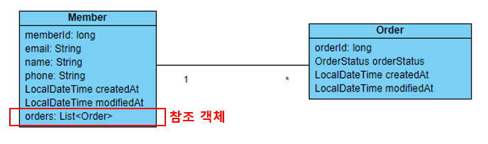
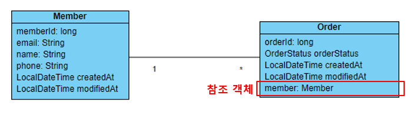
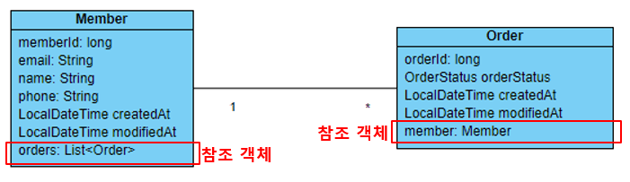
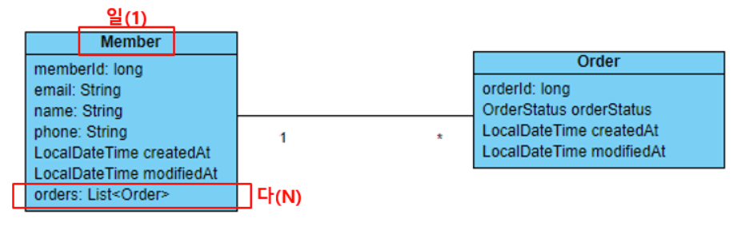
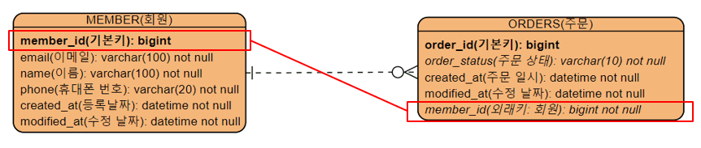
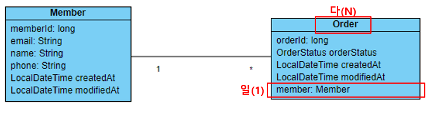
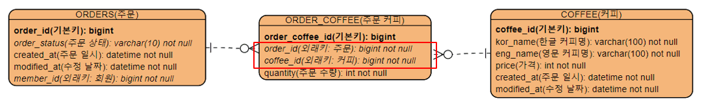

JPA 엔티티 간의 연관 관계 매핑

<div class="cl1"></div>

## 연관 관계 매핑

연관 관계 매핑은 이전 Spring Data JDBC 포스트에서 한번 설명했었다. [[더보기]](https://preasim.github.io/76)

<div class="cl3"></div>

테이블 설계, 클래스 다이어그램 설계를 통해 회원과 주문, 주문과 커피와의 관계를 도출했었던 것처럼

**엔티티 클래스 간의 관계를 만들어주는 것이 바로 연관 관계 매핑**이다.

<div class="cl3"></div>

Spring Data JDBC에서 했던 것 처럼 JPA의 방식으로 엔티티 클래스 간에 관계를 매핑해 주어야 한다.

<div class="cl3"></div>

연관 관계 매핑은 참조하는 방향성을 기준으로 생각했을 때 단방향 연관 관계와 양방향 연관 관계로 구분 할 수 있다.

<div class="cl3"></div>

그리고, 엔티티 간에 참조할 수 있는 객체의 수에 따라서 일대다, 다대일, 다대다, 일대일의 연관 관계로 나눌 수 있다.

<div class="cl3"></div>

아래에서 커피 주문 샘플 애플리케이션의 Member 클래스와 Order 클래스의 관계를 통해서 JPA의 연관 관계를 설명하겠다.

<div class="cl2"></div>

### 단방향 연관 관계

<p align="center" style="margin: 54px 0 34px 0"></p>

위 그림에서는 Member 클래스가 Order 객체를 원소로 포함하고 있는 List 객체를 가지고 있으므로,

<div class="cl3"></div>

Order를 참조할 수 있다. 따라서 Member는 Order의 정보를 알 수 있다.

하지만 Order 클래스는 Member 클래스에 대한 참조 값이 없으므로 Order 입장에서는 Member 정보를 알 수 없다.

<p align="center" style="margin: 54px 0 34px 0"></p>

위 그림에서는 Order 클래스가 Member 객체를 가지고 있으므로, Member 클래스를 참조할 수 있다.

<div class="cl3"></div>

하지만 Member 클래스는 Order 클래스에 대한 참조 값이 없으므로 Member 입장에서는 Order 정보를 알 수 없다.

<div class="cl3"></div>

이처럼 한 쪽 클래스만 다른 쪽 클래스의 참조 정보를 가지고 있는 관계를 단방향 연관 관계라고 한다.

<div class="cl2"></div>

### 양방향 연관 관계

<p align="center" style="margin: 54px 0 34px 0"></p>

위 그림에서는 Member 클래스가 Order 객체를 원소로 포함하고 있는

List 객체를 가지고 있고, Order 클래스를 참조할 수 있다.

<div class="cl4"></div>

그리고 Order 클래스 역시 Member 객체를 가지고 있으므로, Member 클래스를 참조할 수 있다.

<div class="cl3"></div>

결론적으로 두 클래스가 모두 서로의 객체를 참조할 수 있으므로, Member는 Order 정보를 알 수 있고,

Order는 Member 정보를 알 수 있다.

<div class="cl3"></div>

이처럼 양쪽 클래스가 서로의 참조 정보를 가지고 있는 관계를 양방향 연관 관계라고 한다.

> JPA는 단방향, 양방향 연관 관계를 모두 지원하는 반면에 Spring Data JDBC는 단방향 연관 관계만 지원한다.

<div class="cl2"></div>

### 일대다 단방향 연관 관계

<p align="center" style="margin: 54px 0 34px 0"></p>

일대다의 관계랑 **‘일’에 해당하는 클래스가 ‘다’에 해당하는 객체를 참조할 수 있는 관계**를 의미한다.

위 그림과 같이 한 명의 회원이 여러 건의 주문을 할 수 있으므로 Member와 Order는 일대다 관계이다.

그리고 Member만 List<Order> 객체를 참조할 수 있으므로 단방향 관계이다.

<div class="cl3"></div>

일대다 단방향 매핑은 잘 사용하지 않는다.

<p align="center" style="margin: 44px 0 34px 0"></p>

위 그림은 MEMBER 테이블과 ORDERS 테이블의 관계를 나타내는 다이어그램이다.

테이블 간의 관계에서는 일대다 중에서 ‘다’에 해당하는 테이블에서 ‘일’에 해당하는 테이블의 기본키를 외래키로 가진다.

<div class="cl3"></div>

따라서 ORDERS 테이블이 MEMBER 테이블의 기본키인 member_id를 외래키로 가진다.

<div class="cl3"></div>

그런데 이전 그림과 같이 Order 클래스가 테이블 관계에서 외래키에 해당하는

Member 클래스의 참조값을 가지고 있기 않기 때문에 **일반적인 테이블 간의 관계를 정상적으로 표현하지 못하고 있다.**

<div class="cl3"></div>

따라서, Order 클래스의 정보를 테이블에 저장하더라도 외래키에 해당하는 MEMBER 클래스의 memberId 값이 없는 채로 저장이 된다.

<div class="cl3"></div>

이러한 문제 때문에 일대다 단방향 매핑은 잘 사용하지 않는다.

> 단, 일대다 단방향 매핑 하나만 사용하는 경우는 드물고, 다대일 단방향 매핑을 먼저 한 후에 필요한 경우, <br> 일대다 단방향 매핑을 추가해서 양방향 연관 관계를 만드는 것이 일반적이다.

<div class="cl2"></div>

### 다대일 연관 관계

<p align="center" style="margin: 54px 0 34px 0"></p>

‘다’에 해당하는 클래스가 ‘일’에 해당하는 객체를 참조할 수 있는 관계를 의미한다.

위 그림과 같이 여러 건의 주문은 한 명의 회원에 속할 수 있으므로 Order와 Member는 다대일 관계이다.

그리고 Order만 Member 객체를 참조할 수 있으므로 단방향 관계이다.

<div class="cl3"></div>

다대일 단방향 매핑은 이전 그림에서 ORDERS 테이블이 MEMBER 테이블의 member_id를 외래키로 가지듯이

Order 클래스가 Member 객체를 외래키처럼 가지고 있다.

<div class="cl3"></div>

즉, 다대일 단방향 매핑은 테이블 간의 관계처럼 자연스러운 매핑 방식이기 때문에

JPA의 엔티티 연관 관계 중에서 가장 기본으로 사용되는 매핑 방식이다.

<div class="cl3"></div>

**다(N)에 해당하는 Order 클래스**

```java
@NoArgsConstructor
@Getter
@Setter
@Entity(name = "ORDERS")
public class Order {
    @Id
    @GeneratedValue(strategy = GenerationType.IDENTITY)
    private Long orderId;

    @Enumerated(EnumType.STRING)
    private OrderStatus orderStatus = OrderStatus.ORDER_REQUEST;

    @Column(nullable = false)
    private LocalDateTime createdAt = LocalDateTime.now();

    @Column(nullable = false, name = "LAST_MODIFIED_AT")
    private LocalDateTime modifiedAt = LocalDateTime.now();

		
    @ManyToOne   // (1)
    @JoinColumn(name = "MEMBER_ID")  // (2)
    private Member member;

    public void addMember(Member member) {
        this.member = member;
    }

    public enum OrderStatus {
        ORDER_REQUEST(1, "주문 요청"),
        ORDER_CONFIRM(2, "주문 확정"),
        ORDER_COMPLETE(3, "주문 완료"),
        ORDER_CANCEL(4, "주문 취소");

        @Getter
        private int stepNumber;

        @Getter
        private String stepDescription;

        OrderStatus(int stepNumber, String stepDescription) {
            this.stepNumber = stepNumber;
            this.stepDescription = stepDescription;
        }
    }
}
```

<div class="cl4"></div>

다대일 연관관계 매핑에서는 위 코드의 (1), (2)와 같은 방법으로 매핑할 수 있다.

먼저 (1)과 같이 @ManyToOne 어노테이션으로 다대일의 관계를 명시한다.

그리고 (2)와 같이 @JoinColumn 어노테이션으로 ORDERS 테이블에서 **외래키에 해당하는 열 이름**을 적어준다.

<div class="cl3"></div>

일반적으로 부모 테이블에서 기본키로 설정된 열 이름과 동일하게 외래키 열을 만드는데,

여기서는 MEMBER 테이블의 기본키 열 이름이 MEMBER_ID이기 때문에 동일하게 적어주었다.

<div class="cl3"></div>

다대일 단방향 연관 관계이기 때문에 (1), (2)와 같이 다(N) 쪽에서만 설정을 해주면 매핑 작업은 끝난다.

<div class="cl2"></div>

**다대일 매핑을 이용한 회원과 주문 정보 저장**

```java
@Configuration
public class JpaManyToOneUniDirectionConfig {
    private EntityManager em;
    private EntityTransaction tx;

    @Bean
    public CommandLineRunner testJpaManyToOneRunner(EntityManagerFactory emFactory) {
        this.em = emFactory.createEntityManager();
        this.tx = em.getTransaction();

        return args -> {
            mappingManyToOneUniDirection();
        };
    }

    private void mappingManyToOneUniDirection() {
        tx.begin();
        Member member = new Member("abc@gmail.com", "Hong Gil Dong", "010-1111-1111");

        // (1)
        em.persist(member);

        Order order = new Order();
        order.addMember(member); // (2)
        em.persist(order); // (3)

        tx.commit();

        // (4)
        Order findOrder = em.find(Order.class, 1L);

        // (5) 주문에 해당하는 회원 정보를 가져올 수 있다.
        System.out.println("findOrder: " + findOrder.getMember().getMemberId() +
                            ", " + findOrder.getMember().getEmail());
    }
}
```

<div class="cl4"></div>

(1)에서 회원 정보를 저장한다.

<div class="cl4"></div>

(1)에서 저장한 회원 정보의 주문 정보를 저장하기 위해서

(2)와 같이 order 객체에 member 객체를 추가한다.

order 객체에 추가된 member 객체는 외래키의 역할을 한다.

> INSERT 쿼리문에는 MEMBER 테이블의 MEMBER_ID가 외래키로 포함이 될 것이다. <br> (2)와 같이 추가되는 member 객체는 이 MEMBER_ID 같은 외래키의 역할을 한다고 생각하면 된다.

<div class="cl4"></div>

(3)에서는 주문 정보를 저장한다.

<div class="cl4"></div>

(4)에서는 등록한 회원에 해당하는 주문 정보를 조회하고 있다.

<div class="cl4"></div>

(5)에서 `findOrder.getMember()`와 같이 주문에 해당하는 회원 정보를 가져와서 출력하고 있다.

`findOrder.getMember().getMemberId()`와 같이 객체를 통해 

다른 객체의 정보를 얻을 수 있는 것을 **객체 그래프 탐색**이라고 한다.

<div class="cl2"></div>

**다대일 매핑에 일대다 매핑 추가**

카페 주인 입장에서는 이 주문을 누가 했는지 회원의 회원 정보를 알아야 할 경우에는

다대일 매핑을 통해 주문한 사람의 정보를 조회할 수 있다.

<div class="cl3"></div>

그런데 회원 입장에서는 내가 주문한 주문의 목록을 확인할 수 있어야 할 텐데

다대일 매핑만으로는 member 객체를 통해 내가 주문한 주문 정보인 order 객체들을 조회할 수 없다.

<div class="cl3"></div>

```java
@NoArgsConstructor
@Getter
@Setter
@Entity
public class Member {
    @Id
    @GeneratedValue(strategy = GenerationType.IDENTITY)
    private Long memberId;

    @Column(nullable = false, updatable = false, unique = true)
    private String email;

    @Column(length = 100, nullable = false)
    private String name;

    @Column(length = 13, nullable = false, unique = true)
    private String phone;

    @Column(nullable = false)
    private LocalDateTime createdAt = LocalDateTime.now();

    @Column(nullable = false, name = "LAST_MODIFIED_AT")
    private LocalDateTime modifiedAt = LocalDateTime.now();

    // (1)
    @OneToMany(mappedBy = "member")
    private List<Order> orders = new ArrayList<>();

    public Member(String email) {
        this.email = email;
    }

    public Member(String email, String name, String phone) {
        this.email = email;
        this.name = name;
        this.phone = phone;
    }

    public void addOrder(Order order) {
        orders.add(order);
    }
}
```

<div class="cl4"></div>

위 코드는 일대다에서 일에 해당하는 Member 클래스이다.

다대일 매핑에 일대다 매핑을 추가해서 양방향 관계를 만들어주었다.

<div class="cl3"></div>

JPA에서 가장 이해하기 어려워하는 부분 중에 하나가 이 @OneToMany 어노테이션의 mappedBy 애트리뷰트이다.

<div class="cl3"></div>

일대다 단방향 매핑의 경우에는 mappedBy 애트리뷰트의 값이 필요하지 않는다.

mappedBy는 참조할 대상이 있어야 하는데 일대다 단방향 매핑의 경우 참조할 대상이 없기 때문이다.

<div class="cl3"></div>

@OneToMany 어노테이션을 이해하기 쉽게 설명하자면

MEMBER 테이블과 ORDER 테이블의 관계에서 ORDER 테이블의

외래키로 MEMBER 테이블의 키본키 열인 MEMBER_ID의 값을 지정한다.

<div class="cl3"></div>

그렇다면 Order 클래스에서 외래키의 역할을 하는 필드는 member 필드이다.

그렇기 때문에 위 코드의 (1)에서 mappedBy의 값이 member가 되는 것이다.

<div class="cl3"></div>

mappedBy의 값으로 무얼 지정해야 할지 모르겠다면 두 가지를 생각하면 된다.

1. **두 객체들 간에 외래키의 역할을 하는 필드는 무엇인가?**
2. **외래키의 역할을 하는 필드는 다(N)에 해당하는 클래스 안에 있다.**

<div class="cl3"></div>

이제 양방향으로 매핑된 두 엔티티 클래스를 이용해서 회원 정보와 주문 정보를 저장한 후,

회원 정보를 통해 주문한 회원의 주문 정보를 조회해 보도록 하겠다.

<div class="cl2"></div>

**다대일 매핑에 일대다 매핑을 추가하여 주문 정보 조회**

```java
@Configuration
public class JpaManyToOneBiDirectionConfig {
    private EntityManager em;
    private EntityTransaction tx;

    @Bean
    public CommandLineRunner testJpaManyToOneRunner(EntityManagerFactory emFactory) {
        this.em = emFactory.createEntityManager();
        this.tx = em.getTransaction();

        return args -> {
            mappingManyToOneBiDirection();
        };
    }

    private void mappingManyToOneBiDirection() {
        tx.begin();
        Member member = new Member("hgd@gmail.com", "Hong Gil Dong",
                "010-1111-1111");
        Order order = new Order();

        member.addOrder(order); // (1)
        order.addMember(member); // (2)

        em.persist(member);
        em.persist(order);

        tx.commit();

        // (3)
        Member findMember = em.find(Member.class, 1L);

        // (4) 이제 주문한 회원의 회원 정보를 통해 주문 정보를 가져올 수 있다.
        findMember
                .getOrders()
                .stream()
                .forEach(findOrder -> {
                    System.out.println("findOrder: " +
                            findOrder.getOrderId() + ", "
                            + findOrder.getOrderStatus());
                });
    }
}
```

<div class="cl4"></div>

먼저 (1)에서 member 객체에 order 객체를 추가해 준다.

member 객체에 order 객체를 추가해주지 않아도 테이블에는 member 정보와 order 정보가 정상적으로 저장이 된다.

<div class="cl3"></div>

하지만 member 객체에 order 객체를 추가해주지 않으면 (3)에서 find() 메서드로 조회한

member 객체로 order를 그래프 탐색하면 order 객체를 조회할 수 없다.

<div class="cl3"></div>

이유는 find() 메서드가 1차 캐시에서 member 객체를 조회하는데 (1)에서 order를

추가해주지 않으면 1차 캐시에 저장된 member 객체는 order를 당연히 가지고 있지 않기 때문이다.

<div class="cl3"></div>

(2)에서 order 객체에 member 객체를 추가해 준다.

order 객체에 member 객체를 추가해 주는 이유는 다대일 관계에서 보았듯이

member가 order의 외래키 역할을 하기 때문에 order 객체 저장 시, 반드시 필요하다.

<div class="cl3"></div>

만약에 order 객체에 member 객체를 추가해주지 않으면 ORDERS 테이블에 저장된 주문 정보의

MEMBER_ID 필드가 null이 될 것이다. 외래키로 참조할 객체 정보(member)가 없기 때문이다.

<div class="cl3"></div>

(3)에서 방금 저장한 회원 정보를 1차 캐시에서 조회한다.

일대다 양방향 관계를 매핑했기 때문에 (4)와 같이 find()메서드로 조회한 member로부터

객체 그래프 탐색을 통해 List 정보에 접근할 수 있다.

<div class="cl2"></div>

### 다대다 연관 관계

실무에서는 다대다의 관계를 가지는 테이블을 설계하는 경우도 굉장히 많다.

지금 만들고 있는 커피 주문 샘플 애플리케이션에서도 Order과 Coffee의 관계는 

하나의 주문에 여러 개의 커피가 속할 수 있고, 하나의 커피는 여러 주문에 속할 수 있으니 다대다 관계이다.

<div class="cl3"></div>

테이블 설계 시, 다대다의 관계는 중간에 테이블을 하나 추가해서 두 개의 일대다 관계를 만들어주는 것이 일반적인 방법이다.

<p align="center" style="margin: 54px 0 34px 0"></p>

위 그림에서는 다대다 관계에 있는 ORDERS, COFFEE 테이블 사이에 ORDER_COFFEE 테이블을 두고

두 개의 일대 다 관계로 만들었다.

<div class="cl3"></div>

ORDER_COFFEE 테이블은 ORDERS, COFFEE 테이블의 외래키를 가지고 있다.

<div class="cl3"></div>

**일대다 단방향 매핑은 외래키를 포함하지 않기 때문에 자주 사용되지 않는 매핑 방법**이라고 위에서 설명했었다.

<div class="cl3"></div>

그렇다면 두 개의 다대일 매핑이 필요하다.

그러고 나서 현실적으로 다대일 매핑을 통해 객체 그래프 탐색으로 원하는 객체를 조회할 수 없다면

그때 일대다 양방향 매핑을 추가하면 된다.

<div class="cl3"></div>

**OrderCoffee**

```java
@Getter
@Setter
@NoArgsConstructor
@Entity(name = "ORDERS_COFFEE")
public class OrderCoffee {
    @Id
    @GeneratedValue(strategy = GenerationType.IDENTITY)
    private Long id;

    @ManyToOne
    @JoinColumn(name = "ORDER_ID")
    private Order order;

    @ManyToOne
    @JoinColumn(name = "COFFEE_ID")
    private Coffee coffee;

    @Column(nullable = false)
    private int quantity;

    public void addCoffee(Coffee coffee) {
        this.coffee = coffee;
    }

    public void addOrder(Order order) {
        this.order = order;
    }
}
```

<div class="cl3"></div>

**Order**

```java
@NoArgsConstructor
@Getter
@Setter
@Entity(name = "ORDERS")
public class Order {
    @Id
    @GeneratedValue(strategy = GenerationType.IDENTITY)
    private Long orderId;

    @Enumerated(EnumType.STRING)
    private OrderStatus orderStatus = OrderStatus.ORDER_REQUEST;

    @Column(nullable = false)
    private LocalDateTime createdAt = LocalDateTime.now();

    @Column(nullable = false, name = "LAST_MODIFIED_AT")
    private LocalDateTime modifiedAt = LocalDateTime.now();

    @ManyToOne
    @JoinColumn(name = "MEMBER_ID")
    private Member member;

    // -------------------------------------------------------

    @OneToMany(mappedBy = "order")
    private List<OrderCoffee> orderCoffees = new ArrayList<>();

    public void addOrderCoffee(OrderCoffee orderCoffee) {
        orderCoffees.add(orderCoffee);
    }

    // -------------------------------------------------------

    public void addMember(Member member) {
        this.member = member;
    }

    public enum OrderStatus {
        ORDER_REQUEST(1, "주문 요청"),
        ORDER_CONFIRM(2, "주문 확정"),
        ORDER_COMPLETE(3, "주문 처리 완료"),
        ORDER_CANCEL(4, "주문 취소");

        @Getter
        private int stepNumber;

        @Getter
        private String stepDescription;

        OrderStatus(int stepNumber, String stepDescription) {
            this.stepNumber = stepNumber;
            this.stepDescription = stepDescription;
        }
    }
}
```

<div class="cl3"></div>

**Coffee**

```java
@NoArgsConstructor
@Getter
@Setter
@Entity
public class Coffee {
    @Id
    @GeneratedValue(strategy = GenerationType.IDENTITY)
    private Long coffeeId;

    @Column(length = 100, nullable = false)
    private String korName;

    @Column(length = 100, nullable = false)
    private String engName;

    @Column(nullable = false)
    private Integer price;

    @Column(length = 3, nullable = false, unique = true)
    private String coffeeCode;

    // -------------------------------------------------------

    @OneToMany(mappedBy = "coffee")
    private List<OrderCoffee> orderCoffees = new ArrayList<>();

    public void addOrderCoffee(OrderCoffee orderCoffee) {
        orderCoffees.add(orderCoffee);
    }

    // -------------------------------------------------------

    // 커피 상태 추가
    @Enumerated(value = EnumType.STRING)
    @Column(length = 20, nullable = false)
    private CoffeeStatus coffeeStatus = CoffeeStatus.COFFEE_FOR_SALE;

    @Column(nullable = false)
    private LocalDateTime createdAt = LocalDateTime.now();

    @Column(nullable = false, name = "LAST_MODIFIED_AT")
    private LocalDateTime modifiedAt = LocalDateTime.now();

    // 커피 상태 추가
    public enum CoffeeStatus {
        COFFEE_FOR_SALE("판매중"),
        COFFEE_SOLD_OUT("판매중지");

        @Getter
        private String status;

        CoffeeStatus(String status) {
            this.status = status;
        }
    }
}
```

<div class="cl2"></div>

### 일대일 연관관계

일대일 연관 관계 매핑은 다대일 단방향 연관 관계 매핑과 매핑 방법은 동일하다.

<div class="cl3"></div>

단지 @ManyToOne 어노테이션이 아닌 @OneToOne 어노테이션을 사용한다는 차이만 있다.

일대일 단방향 매핑에 양방향 매핑을 추가하는 방법도 다대일에 일대다 매핑을 추가하는 방식과 동일하다.

<div class="cl3"></div>

@OneToOne 어노테이션을 사용할 때 단방향 관계이면 mappedBy 애트리뷰트를 사용하지 않지만,

양방향 관계를 설정하려면 mappedBy 애트리뷰트를 사용해야 한다.

<div class="cl3"></div>

아래에서 Member 클래스와 Stamp 클래스의 연관 관계 매핑으로 설명하겠다.

스탬프는 회원이 주문하는 커피 한잔 당 찍히는 도장이다.

<div class="cl3"></div>

**Member**

```java
  ...

@OneToOne
@JoinColumn(name = "STAMP_ID")
private Stamp stamp;

public void addStamp(Stamp stamp) {
    this.stamp = stamp;
}

...
```
<div class="cl3"></div>

**Stamp**

```java
@Entity
@Getter
@Setter
@NoArgsConstructor
public class Stamp {
    @Id
    @GeneratedValue(strategy = GenerationType.IDENTITY)
    private Long stampId;

    @Column(nullable = false)
    private int stampCount;

    @Column(nullable = false)
    private LocalDateTime createdAt;

    @Column(nullable = false)
    private LocalDateTime modifiedAt;

    @OneToOne(mappedBy = "stamp")
    private Member member;
}
```

<div class="cl2"></div>

## 정리

**일대다 매핑은 사용하지 않는다.**

<div class="cl3"></div>

**제일 먼저 다대일 단방향 매핑부터 적용한다.**

<div class="cl3"></div>

**다대일 단방향 매핑을 통해 객체 그래프 탐색으로 조회할 수 없는 정보가 있을 경우,**

**그때 비로소 양방향 매핑을 적용한다.**

<div class="cl2"></div>

### mappedBy 애트리뷰트

연관 관계의 주인을 명시하고 양방향 관계를 설정할 때 중요한 역할을 한다.

<div class="cl3"></div>

mappedBy는 주로 아래 상황에서 사용된다.

<div class="cl3"></div>

**일대다 또는 일대일 양방향 관계 설정**

mappedBy는 연관 관계의 주인을 나타내며, 관계를 양방향으로 설정할 때 필요하다.

주인 엔티티가 역방향 엔티티를 참조하는 경우,

mappedBy를 사용하여 주인 엔티티의 어떤 필드가 역방향 엔티티와 관련되는지 명시한다.

<div class="cl3"></div>

**연관 관계의 주인 설정**

JPA에서 양방향 관계는 하나의 엔티티가 연관된 다른 엔티티를 소유하는 것을 의미한다.

연관 관계의 주인은 외래 키를 관리하고 데이터베이스에 영향을 미치는 책임이 있는 쪽이다.

<div class="cl3"></div>

```java
@Entity
public class Department {
    @Id
    @GeneratedValue(strategy = GenerationType.IDENTITY)
    private Long id;

    @OneToMany(mappedBy = "department")
    private List<Employee> employees;
    // ...
}

@Entity
public class Employee {
    @Id
    @GeneratedValue(strategy = GenerationType.IDENTITY)
    private Long id;

    @ManyToOne
    @JoinColumn(name = "department_id")
    private Department department;
    // ...
}
```

