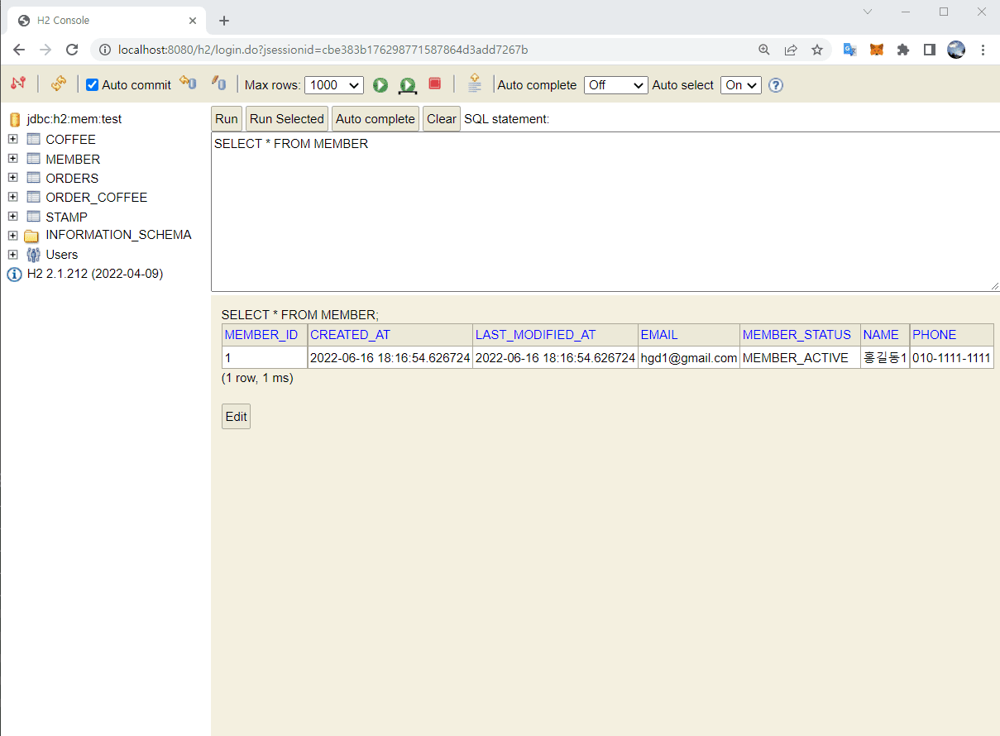
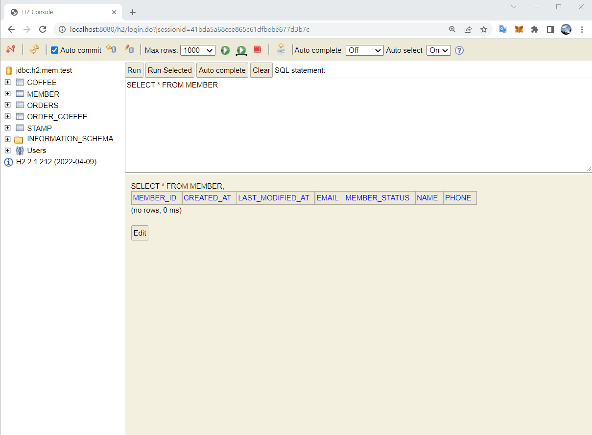
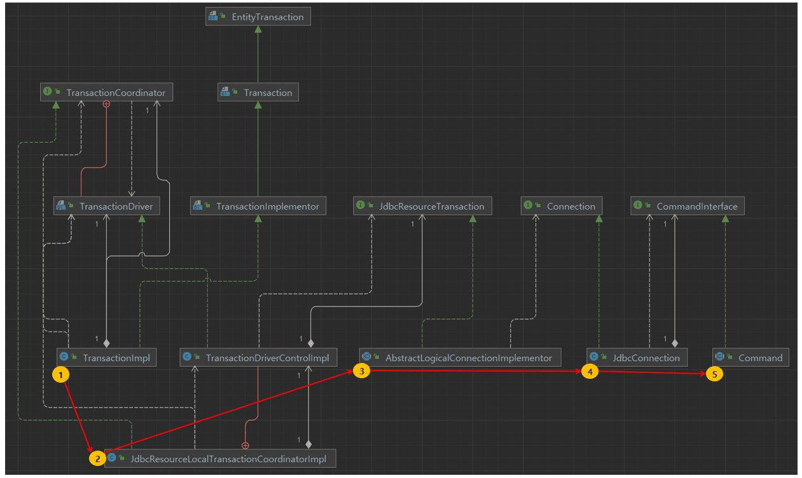

스프링 복습 및 정리 13P

<div class="cl1"></div>

## Transaction

Spring Framework의 일부로, 웹 애플리케이션에서 모델-뷰-컨트롤러 (MVC) 아키텍처를 구현하는 데 사용되는 프레임워크이다.

Spring MVC는 트랜잭션 처리에 대한 지원을 제공하며,

이를 통해 웹 애플리케이션에서 데이터베이스 또는 다른 리소스와 관련된 작업을 안전하게 수행할 수 있다.

<div class="cl3"></div>

이해하기 쉽도록 아래에서 예시를 몇 가지 들어보겠다.

<div class="cl3"></div>

고객이 제품을 선택하고 결제 버튼을 누른 후, 주문이 진행되는 중에 네트워크 오류로 인해 결제를 실패했다.

그런데, 고객이 주문한 주문이 정상적으로 데이터베이스에 등록이 되고, 포인트가 적립되었다.

이 경우, 판매처는 수익을 얻지 못하는 손해를 볼 것이고 고객은 공짜 포인트가 생겼다.

<div class="cl3"></div>

반대로 고객이 주문한 제품에 대한 결제는 완료되었는데,

데이터베이스에 저장하는 중에 에러가 발생해서 고객이 주문한 제품 주문 정보가 데이터베이스에 등록이 되지 않았다.

이 경우, 고객은 제품을 얻지 못한 채 금전적인 손해만 본다.

<div class="cl3"></div>

마지막으로 고객의 주문은 정상적으로 처리되었는데, 포인트가 적립되지 않는 상황도 있을 것이다.

<div class="cl3"></div>

위 사례들의 공통점은 두 개 이상의 작업이 그룹으로 묶여서 처리되는 중에

이 중 하나라도 처리에 실패할 경우 애플리케이션의 신뢰성이 깨지는 상황이 발생하고 있다.

<div class="cl3"></div>

이처럼 **트랜잭션은 여러 개의 작업들을 하나의 그룹으로 묶어서 처리하는 처리 단위**인데,

앞에서 본 사례처럼 애플리케이션의 신뢰성이 깨지는 상황이 발생하면 트랜잭션이라고 부를 수 없다.

<div class="cl3"></div>

이러한 **All or Nothing**이라는 트랜잭션 처리 방식은

애플리케이션에서 사용하는 데이터의 무결성을 보장하는 핵심적인 역할을 한다.

<div class="cl3"></div>

Spring MVC에서 트랜잭션 처리에 대한 내용은 아래와 같다.

<div class="cl4"></div>
---
<div class="cl4"></div>

**트랜잭션 관리**

데이터베이스 또는 다른 리소스와 관련된 작업을 트랜잭션 내에서 실행할 수 있게 한다.

이를 통해 데이터 일관성과 무결성을 유지할 수 있다.

<div class="cl4"></div>
---
<div class="cl4"></div>

**선언적 트랜잭션 관리**

개발자가 코드에서 직접 트랜잭션을 관리하지 않고,

어노테이션 또는 XML 설정을 사용하여 트랜잭션을 선언할 수 있음을 의미한다.

@Transactional 어노테이션을 사용하여 메서드에 트랜잭션을 적용할 수 있다.

<div class="cl4"></div>

```java
@Service
public class ProductService {
    @Autowired
    private ProductRepository productRepository;

    @Transactional
    public void saveProduct(Product product) {
        productRepository.save(product);
    }
}
```

<div class="cl4"></div>
---
<div class="cl4"></div>

**트랜잭션 속성 설정**

롤백 조건, 격리 수준, 타임아웃 등을 지정할 수 있다.

<div class="cl4"></div>
---
<div class="cl4"></div>

**롤백 및 예외 처리**

예외 발생 시 자동으로 롤백할 수 있도록 설정할 수 있다.

트랜잭션 관리를 통해 예외가 발생하면 트랜잭션을 롤백하고 예외를 처리할 수 있다.

<div class="cl4"></div>
---
<div class="cl4"></div>

**여러 데이터 소스 및 트랜잭션 매니저 지원**

여러 데이터 소스(데이터베이스, 메시징 시스템 등) 및 다양한 트랜잭션 매니저와 통합할 수 있다.

<div class="cl1"></div>

## ACID 원칙

트랜잭션은 일반적으로 ACID라는 원칙을 이용한다.

<div class="cl3"></div>

**원자성 (Atomicity)**

트랜잭션에서의 원자성이란 작업을 더 이상 쪼갤 수 없음을 의미한다.

<div class="cl3"></div>

여러 작업을 하나의 작업으로 인식해서

둘 다 성공하든가 둘 다 실패하든가(All or Nothing) 중에서 하나로만 처리되는 것이 보장되어야 한다.

<div class="cl4"></div>
---
<div class="cl4"></div>

**일관성 (Consistency)**

일관성은 트랜잭션이 에러 없이 성공적으로 종료될 경우,

비즈니스 로직에서 의도하는 대로 일관성 있게 저장되거나 변경되는 것을 의미한다.

<div class="cl3"></div>

회원이 3잔의 커피를 주문했으면 스탬프 횟수가 3 증가한 값으로 저장이 되어 있을 거라고 예상했는데,

3이 아닌 숫자로 증가한 값이 조회된다면 일관성에 위배되는 것이다.

<div class="cl4"></div>
---
<div class="cl4"></div>

**격리성 (Isolation)**

격리성은 여러 개의 트랜잭션이 실행될 경우 각각 독립적으로 실행이 되어야 함을 의미한다.

<div class="cl3"></div>

격리성을 이해하기 위해서는 CPU가 프로세스를 처리하는 과정을 이해하고 있는 것이 좋다.

예를 들어 컴퓨터에서 워드 작업을 하고 있고, 동시에 뮤직 플레이어로 음악을 듣고 있다면

우리는 눈에는 보이지 않지만 CPU는 위 두 가지 프로세스를 아주 빠른 속도로 번갈아가면서 실행을 시키는 것이다.

<div class="cl3"></div>

이처럼 데이터베이스 역시 성능 향상을 목적으로 한 개 이상의 트랜잭션을 번갈아가면서 처리할 수 있는데,

이 경우 각 트랜잭션이 다른 트랜잭션에 영향을 주지 않고 독립적으로 실행이 되여야 한다.

<div class="cl4"></div>
---
<div class="cl4"></div>

**지속성 (Durability)**

트랜잭션이 완료되면 그 결과는 지속되어야 한다는 의미이다.

<div class="cl3"></div>

즉, 지속성은 데이터베이스가 종료되어도 데이터는 물리적인 저장소에 저장되어 지속적으로 유지되어야 한다.

<div class="cl1"></div>

## 트랜잭션 commit과 rollback

커밋과 롤백은 데이터베이스에서 사용되는 명령어인데, 아래에서 그 특징을 설명하겠다.

<div class="cl2"></div>

### 커밋 (commit)

모든 작업을 최종적으로 데이터베이스에 반영하는 명령어로써

commit 명령을 수행하면 변경된 내용이 데이터베이스에 영구적으로 저장된다.

<div class="cl3"></div>

만약 commit 명령을 수행하지 않으면 작업의 결과가 데이터베이스에 최종적으로 반영되지 않는다.

그리고 commit 명령을 수행하면, 하나의 트랜잭션 과정은 종료하게 된다.

<div class="cl3"></div>

```jsx
BEGIN TRANSACTION;
insert into  MEMBER VALUES 
       (1, now(), now(), 'hgd1@gmail.com', 'MEMBER_ACTIVE', '홍길동1', '010-1111-1111');
COMMIT;

BEGIN TRANSACTION;
insert into  MEMBER VALUES 
       (2, now(), now(), 'hgd2@gmail.com', 'MEMBER_ACTIVE', '홍길동2', '010-2222-2222');
```

<div class="cl3"></div>

위 쿼리를 실행해 보면 아래와 같은 결과를 얻을 수 있다.

<p align="center" style="margin: 64px 0 64px 0"></p>

첫 번째 INSERT문은 커밋 명령이 수행되었기 때문에 INSET문 수행 결과가 테이블에 반영되었으며,

두 번째 INSERT문은 새로운 트랜잭션에서 커밋 명령이 수행되지 않았기 때문에 INSERT문 수행결과가 테이블에 반영되지 않았다.

<div class="cl2"></div>

### 롤백 (rollback)

롤백은 작업 중 문제가 발생했을 때, 트랜잭션 내에서 수행된 작업들을 취소한다.

따라서 트랜잭션 시작 이 전의 상태로 되돌아간다.

<div class="cl3"></div>

```jsx
BEGIN TRANSACTION;
insert into  MEMBER VALUES 
      (1, now(), now(), 'hgd1@gmail.com', 'MEMBER_ACTIVE', '홍길동1', '010-1111-1111');
ROLLBACK;
COMMIT;
```

<div class="cl3"></div>

위 쿼리를 실행해 보면 아래와 같은 결과를 얻을 수 있다.

<p align="center" style="margin: 64px 0 64px 0"></p>

INSERT문이 실행되었지만 커밋 직전에 롤백 명령을 먼저 수행했기 때문에 트랜잭션의 상태가

INSERT문 수행 이 전 상태로 되돌아갔으며, INSERT문에서 실행된 데이터는 테이블에 저장되지 않았다.

<div class="cl2"></div>

그런데 애플리케이션을 구현하는 입장에서는 이처럼 콘솔을 통해 직접적으로 데이터베이스에 커밋, 롤백 명령어를 사용할 수 없다.

<div class="cl3"></div>

애플리케이션 코드 상에서 프로그래밍 적으로 커밋과 롤백 명령을 내려야 한다.

<div class="cl3"></div>

이전 포스트에서 커밋 명령은 코드 상에서 사용해 본 적이 있다.

<div class="cl4"></div>

```java
@Configuration
public class JpaBasicConfig {
    private EntityManager em;
    private EntityTransaction tx;

    @Bean
    public CommandLineRunner testJpaBasicRunner(EntityManagerFactory emFactory) {
        this.em = emFactory.createEntityManager();

        this.tx = em.getTransaction();

        return args -> {
            tx.begin();
            Member member = new Member("hgd@gmail.com");

            em.persist(member);
          
            tx.commit(); // 커밋
        };
    }
```

<div class="cl1"></div>

## JPA의 tx.commit() 내부

JPA에서 사용했던 commit()의 프로그래밍적으로는 어떤 과정을 거쳐서 DB에 commit 명령어를 전달하는지 아래에서 설명하겠다.

<p align="center" style="margin: 44px 0 34px 0"></p>

위 그림은 JPA API를 통해 EntityTransaction 객체를 얻은 후,

이 EntityTransaction 객체(tx)로 tx.commit() 메서드를 호출했을 때의 동작 과정이다.

<div class="cl3"></div>

JPA의 EntityTransaction과 직간접적으로 관계를 맺고 있는 인터페이스 및 클래스의 구성을 다이어그램으로 보여주고 있다.

<div class="cl3"></div>

위 그림의 번호가 매겨져 있는 클래스들을 확인해보면

tx.commit()을 호출했을 때, commit이 되는 과정을 대략적으로 알 수 있다.

<div class="cl2"></div>

### TransactionImpl

```java
public class TransactionImpl implements TransactionImplementor {
  ...
  ...
  @Override
  public void commit() {
    ...
    ...
    try {
      internalGetTransactionDriverControl().commit(); // (1)
    }
    catch (RuntimeException e) {
      throw session.getExceptionConverter().convertCommitException( e );
    }
  }
}
```

<div class="cl4"></div>

JPA EntityTransacton 객체(tx)로 tx.commit()을 호출하는 것은 EntityTransaction 인터페이스의

구현 클래스인 TransactionImpl 클래스의 commit()을 호출하는 것이다.

<div class="cl3"></div>

TransactionImpl 클래스에서는 (1)과 같이 물리적인 트랜잭션을 제어하기 위한 로컬 트랜잭션 드라이버

구현 객체(TransactionDriverControlImpl)를 얻은 후에 구현 메서드인 commit()을 다시 호출한다.

<div class="cl2"></div>

### JdbcResourceLocalTransactionCoordinatorImpl > TransactionDriverControlImpl

```java
public class JdbcResourceLocalTransactionCoordinatorImpl implements TransactionCoordinator {
        ...
        ...
    public class TransactionDriverControlImpl implements TransactionDriver {
        @Override
        public void commit() {
            try {
                    ...
                    ...
                JdbcResourceLocalTransactionCoordinatorImpl
                        .this.beforeCompletionCallback();
                jdbcResourceTransaction.commit();  // (1)
                JdbcResourceLocalTransactionCoordinatorImpl
                        .this.afterCompletionCallback( true );
            }
            catch (RollbackException e) {
                throw e;
            }
            catch (RuntimeException e) {
                try {
                    rollback();
                }
                catch (RuntimeException e2) {
                    log.debug( "Encountered failure rolling back failed commit", e2 );
                }
                throw e;
            }
        }
    }
}
```

<div class="cl4"></div>

TransactionDriverControlImpl에서는 (1)과 같이 JDBC Connection의 액세스 방법을 제공하는

JdbcResourceTransaction의 구현 객체인 AbstractLogicalConnectionImplementor의 commit()을 다시 호출한다.

<div class="cl2"></div>

### AbstractLogicalConnectionImplementor

```java
public abstract class AbstractLogicalConnectionImplementor implements LogicalConnectionImplementor, PhysicalJdbcTransaction {
        ...
        ...
    @Override
    public void begin() {
          ...
    }

    @Override
    public void commit() {
        try {
            getConnectionForTransactionManagement().commit(); // (1)
            status = TransactionStatus.COMMITTED;

        }
        catch( SQLException e ) {
            status = TransactionStatus.FAILED_COMMIT;
        }
        afterCompletion();
    }
  
        ...
        ...
    @Override
    public void rollback() {
        try {
            getConnectionForTransactionManagement().rollback();
            status = TransactionStatus.ROLLED_BACK;
        }
        catch( SQLException e ) {
            status = TransactionStatus.FAILED_ROLLBACK;
        }

        afterCompletion();
    }
}
```

<div class="cl4"></div>

(1)에서 실제 물리적인 JDBC Connection을 얻은 후에 이 connection 객체의 commit()을 다시 호출한다.

<div class="cl3"></div>

여기까지가 Hibernate ORM에서의 영역이다.

이제 물리적인 JDBC Connection을 통해 데이터베이스와 인터랙션 하기 위해서

JDBC API의 구현체인 JdbcConnection 영역으로 이동한다.

<div class="cl2"></div>

### JdbcConnection

```java
public class JdbcConnection extends TraceObject implements Connection, JdbcConnectionBackwardsCompat, CastDataProvider {
      ...
      ...
    @Override
    public synchronized void commit() throws SQLException {
        try {
            ...
            ...
            commit = prepareCommand("COMMIT", commit); // (1)
            commit.executeUpdate(null); // (2)
        } catch (Exception e) {
            throw logAndConvert(e);
        }
    }
}
```

<div class="cl4"></div>

위 코드는 JDBC API의 구현체인 H2의 영역이다.

(1)에서 데이터베이스에 commit 명령을 준비한 후, (2)에서 해당 명령을 실행한다.

(1), (2)의 메서드 호출은 H2에서 지원하는 Command 클래스에서 이루어진다.

<div class="cl2"></div>

### Command

```java
public abstract class Command implements CommandInterface {
        ...
        ...
    @Override
    public ResultWithGeneratedKeys executeUpdate(Object generatedKeysRequest) {
        long start = 0;
        Database database = session.getDatabase();
        session.waitIfExclusiveModeEnabled();
        boolean callStop = true;
        
        //noinspection SynchronizationOnLocalVariableOrMethodParameter
        synchronized (session) {
            commitIfNonTransactional(); // (1)
            SessionLocal.Savepoint rollback = session.setSavepoint();
            session.startStatementWithinTransaction(this);
            DbException ex = null;
            Session oldSession = session.setThreadLocalSession();
            try {
                ...
                ...
            } catch (DbException e) {
                e = e.addSQL(sql);
                  ...
                  ...
                try {
                    database.checkPowerOff();
                    if (s.getErrorCode() == ErrorCode.DEADLOCK_1) {
                        session.rollback(); // (2)
                    } else {
                        session.rollbackTo(rollback);
                    }
                } catch (Throwable nested) {
                    e.addSuppressed(nested);
                }
                ex = e;
                throw e;
            } finally {
                ...
                ...
            }
        }
    }

    private void commitIfNonTransactional() {
        if (!isTransactional()) {
            boolean autoCommit = session.getAutoCommit(); // (3)
            session.commit(true); // (4)
            if (!autoCommit && session.getAutoCommit()) {
                session.begin();
            }
        }
    }
}
```

<div class="cl4"></div>

데이터베이스에 commit 명령을 전달하기 위해 (1)에서 commitIfNonTransactional() 메서드를 호출한다.

commitIfNonTransactional() 메서드 내부에서는 (3)에서 auto commit 여부를 체크한 후,

(4)와 같이 데이터베이스 세션에 해당하는 Session 객체를 통해 commit 명령을 수행하고 있다.

<div class="cl3"></div>

만약에 commitIfNonTransactional() 수행 과정에서 예외가 발생하면 (2)와 같이 rollback을 수행한다.

<div class="cl2"></div>

### SessionLocal

```java
public final class SessionLocal extends Session implements TransactionStore.RollbackListener {
      ...
      ...
    public void commit(boolean ddl) {
        beforeCommitOrRollback();
        if (hasTransaction()) {
            try {
                markUsedTablesAsUpdated();
                transaction.commit(); // (1)
                removeTemporaryLobs(true);
                endTransaction();
            } finally {
                transaction = null;
            }
            ...
            ...
        }
    }
}
```

<div class="cl4"></div>

마지막으로 다이어그램에는 나와 있지 않지만 SessionLocal 클래스에서 (1)과 같이 트랜잭션에 대한 commit이 수행된다.

