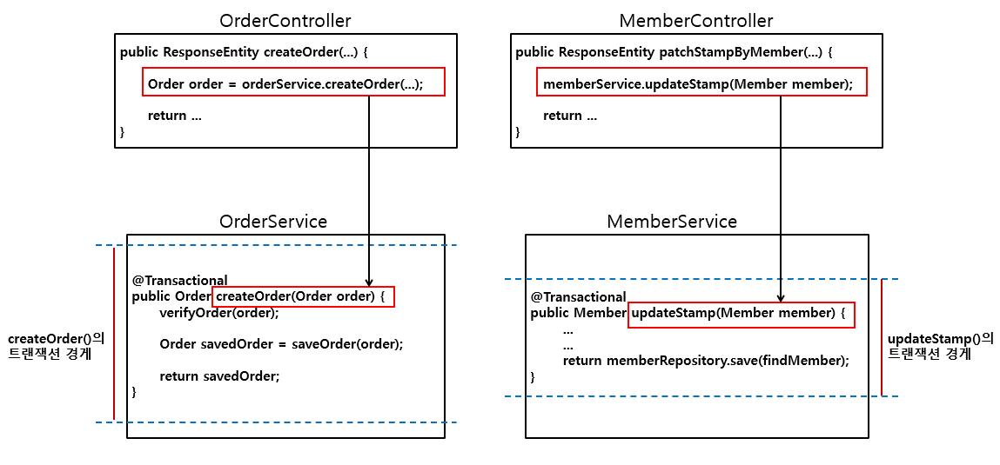
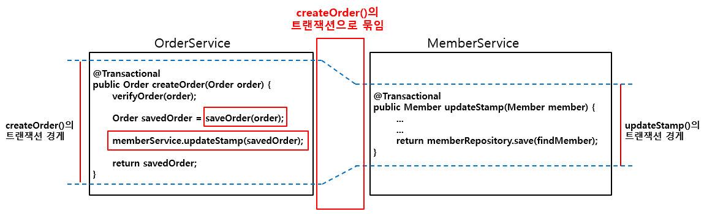

선언형 방식의 트랜잭션 적용

<div class="cl1"></div>

선언형 방식으로 트랜잭션을 적용하는 방법은 크게 두 가지이다.

<div class="cl3"></div>

첫 번째는 비즈니스 로직에 어노테이션을 추가하는 방식이고,

또 하나는 AOP 방식을 이용해서 비즈니스 로직에서 아예 트랜잭션 적용 코드 자체를 감추는 방식이다.

<div class="cl3"></div>

이 두 가지 방식의 사용 방법을 코드로 확인해 두 방식의 장단점을 파악해 보도록 하겠다.

<div class="cl1"></div>

## Spring Boot에서의 트랜잭션 설정

```java
@Configuration
@EnableTransactionManagement
public class JpaConfig{

    @Bean
    public LocalContainerEntityManagerFactoryBean entityManagerFactoryBean(){
        final LocalContainerEntityManagerFactoryBean em = 
        new LocalContainerEntityManagerFactoryBean();
        em.setDataSource(dataSource());
        ...
        ...

        return em;
    }

    // (1)
    @Bean
    public DataSource dataSource() {
        final DriverManagerDataSource dataSource = new DriverManagerDataSource();
        
        ...
        ...

        return dataSource;
    }

    @Bean
    public PlatformTransactionManager transactionManager(){
        JpaTransactionManager transactionManager
                = new JpaTransactionManager(); // (2)
        transactionManager.setEntityManagerFactory(
                entityManagerFactoryBean().getObject() );
        return transactionManager;
    }
}
```

<div class="cl4"></div>

만약 Spring Boot를 사용하고 있지 않다면 일반적으로 위 코드와 같은 설정을

Spring Configuration에 추가해야 한다.

<div class="cl3"></div>

트랜잭션은 기본적으로 데이터베이스와의 인터랙션과 관련이 있기 때문에 (1)과 같이

데이터베이스 커넥션 정보를 포함하고 있는 Datasource가 기본적으로 필요하다.

<div class="cl3"></div>

Spring에서 트랜잭션은 기본적으로 PlatformTransactionManager에 의해 관리되며,

PlatformTransactionManager 인터페이스를 구현해서 해당 데이터 액세스 기술에 맞게

유연하게 트랜잭션을 적용할 수 있도록 추상화되어 있다.

<div class="cl3"></div>

지금은 Spring Boot를 사용하고 있기 때문에 트랜잭션 관련 설정은 Spring Boot가 내부적으로 알아서 해준다.

따라서 위 코드와 같은 트랜잭션 설정을 직접 해 줄 필요는 없다.

대략적으로 이런 식으로 설정한다 정도만 확인하고 넘어가면 된다.

<div class="cl1"></div>

## 어노테이션 방식의 트랜잭션 적용

Spring에서 트랜잭션을 적용하는 가장 간단한 방법은

@Transactional이라는 어노테이션을 트랜잭션이 필요한 영역에 추가해 주는 것이다.

<div class="cl2"></div>

### 클래스 레벨에 적용

```java
@Service
@Transactional // (1)
public class MemberService {
    private final MemberRepository memberRepository;

    public MemberService(MemberRepository memberRepository) {
        this.memberRepository = memberRepository;
    }

    public Member createMember(Member member) {
        verifyExistsEmail(member.getEmail());

        return memberRepository.save(member);
    }
    
    ...
    ...
}
```

<div class="cl4"></div>

위 코드는 MemberService 클래스에 트랜잭션을 적용한 코드 일부이다.

(1)과 같이 @Transactional 어노테이션을 클래스 레벨에 추가하면 기본적으로

해당 클래스에서 MemberRepository의 기능을 이용하는 모든 메서드에 트랜잭션이 적용된다.

<div class="cl3"></div>

<div class="callout">
   <div class="callout-in">
       <p>Exception, SQLException, DataFormatException 같은 체크 예외는</p>
       <p>@Transactional 어노테이션만 추가해서는 rollback이 되지 않는다.</p>
       <div class="cl4"></div>
       <p>체크 예외의 경우, 말 그대로 체크를 해야 되는 예외이다.</p>
       <p>따라서 캐치한 후에 해당 예외를 복구할지 회피할지 등의 적절한 예외 전략을 고민해 볼 필요가 있다.</p>
       <div class="cl4"></div>
       <p>만약 별도의 예외 전략을 짤 필요가 없다면</p>
       <code>@Transactional(rollbackFor = {SQLException.class, DataFormatException.class})</code>
       <p>와 같이 해당 체크 예외를 직접 지정해 주거나 언체크 예외로 감싸서 rollback이 동작하도록 할 수 있다.</p>
   </div>
</div>

<div class="cl2"></div>

### 메서드 레벨에 적용

```java
@Service
@Transactional  // (1)
public class MemberService {
    private final MemberRepository memberRepository;

    public MemberService(MemberRepository memberRepository) {
        this.memberRepository = memberRepository;
    }

    // (2)
    @Transactional(readOnly = true)
    public Member findMember(long memberId) {
        return findVerifiedMember(memberId);
    }
    
    ...
    ...
}
```

<div class="cl4"></div>

위 코드에서는 (1)과 같이 앞에서 이미 추가한 클래스 레벨 @Transactional 어노테이션 이외에

(2)와 같이 findMember() 메서드에 `@Transactional(readOnly = true)`를 추가했다.

<div class="cl3"></div>

이 경우, findMember() 메서드는 읽기 전용 트랜잭션이 적용된다.

<div class="cl3"></div>

```jsx
2022-06-20 17:39:13.293 DEBUG 21436 --- o.j.s.OpenEntityManagerInViewInterceptor : 
Opening JPA EntityManager in OpenEntityManagerInViewInterceptor
2022-06-20 17:39:13.301 DEBUG 21436 --- o.s.orm.jpa.JpaTransactionManager        : 
Found thread-bound EntityManager [SessionImpl(523063927<open>)] for JPA transaction
2022-06-20 17:39:13.302 DEBUG 21436 --- o.s.orm.jpa.JpaTransactionManager        : 
Creating new transaction with name 
PROPAGATION_REQUIRED,ISOLATION_DEFAULT, readOnly // (1)
2022-06-20 17:39:13.305 DEBUG 21436 --- o.s.orm.jpa.JpaTransactionManager        : 
Found thread-bound EntityManager [SessionImpl(523063927<open>)] for JPA transaction
2022-06-20 17:39:13.305 DEBUG 21436 --- o.s.orm.jpa.JpaTransactionManager        : 
Participating in existing transaction

2022-06-20 17:39:13.323 DEBUG 21436 --- o.s.orm.jpa.JpaTransactionManager        : 
Initiating transaction commit
2022-06-20 17:39:13.324 DEBUG 21436 --- o.s.orm.jpa.JpaTransactionManager        : 
Committing JPA transaction on EntityManager [SessionImpl(523063927<open>)]
2022-06-20 17:39:13.324 DEBUG 21436 --- o.s.orm.jpa.JpaTransactionManager        : 
Not closing pre-bound JPA EntityManager after transaction
2022-06-20 17:39:13.325 DEBUG 21436 --- o.j.s.OpenEntityManagerInViewInterceptor : 
Closing JPA EntityManager in OpenEntityManagerInViewInterceptor
```

<div class="cl4"></div>

findMember()에 `@Transactonal(readOnly = true)`를 추가했을 때, 호출 결과이다.

(1)을 보면 트랜잭션 설정이 readOnly인 것을 확인할 수 있다.

<div class="cl3"></div>

findMember()와 같은 조회 메서드에 `@Transactonal(readOnly = true)`로 설정해도 commit 절차를 진행하기는 한다.

<div class="cl3"></div>

JPA에서 commit이 호출되면 영속성 컨텍스트가 flush(DB에 실제로 적용되는 시점)된다.

그런데 `@Transactonal(readOnly = true)`로 설정하면 JPA 내부적으로 영속성 컨텍스트를 flush하지 않는다.

그리고 읽기 전용 트랜잭션일 경우, 변경 감지를 위한 스냅샷 생성도 진행하지 않는다.

<div class="cl3"></div>

flush 처리를 하지 않고, 스냅샷도 생성하지 않으므로 불필요한 추가 동작을 줄일 수 있다.

즉, **조회 메서드에는 readOnly 속성을 true로 지정해서 JPA가 자체적으로 성능 최적화 과정을 거치도록 하는 것이 좋다.**

<div class="cl2"></div>

### 클래스 레벨과 메서드 레벨의 트랜잭션 적용 순서

<div class="cl4"></div>

**클래스 레벨에만 @Transactional이 적용된 경우**

클래스 레벨의 @Transactional 어노테이션이 메서드에 일괄 적용된다.

<div class="cl3"></div>

**클래스 레벨과 메서드 레벨에 함께 적용된 경우**

메서드 레벨의 @Transactional 어노테이션이 적용된다.

만약 메서드 레벨에 @Transactional 어노테이션이 적용되지 않았을 경우,

클래스 레벨의 @Transactional 어노테이션이 적용된다.

<div class="cl1"></div>

## 여러 작업이 하나의 트랜잭션으로 묶이는 경우

<p align="center" style="margin: 34px 0 34px 0"></p>

위 그림은 클라이언트가 주문한 주문 정보를 데이터베이스에 저장하는 상황이다.

만약 위 그림과 같이 주문 정보를 저장하는 작업과 주문한 커피 수만큼 스탬프 수를 업데이트하는

작업이 차례차례 실행 된다고 생각해 보겠다.

<div class="cl3"></div>

OrderService에서 createOrder() 메서드를 호출할 경우, 내부에서 주문 정보 저장을 위한 트랜잭션이

하나 시작되며, 다음으로 memberService.updateStamp() 메서드 호출을 통해서

MemberService에서 스탬프 업데이트를 위한 트랜잭션이 하나 더 시작될 것이다.

<div class="cl3"></div>

그런데 이처럼 두 개의 트랜잭션이 각각 독립적으로 실행이 된다면 updateStamp() 동작에서 예외가 

발생할 경우 스탬프 숫자는 업데이트되지 않았는데 주문 정보는 저장되는 원치 않는 상황이 발생할 것이다.

<p align="center" style="margin: 64px 0 34px 0"></p>

위 그림은 두 개의 클래스에서 처리되는 작업이 하나의 트랜잭션으로 묶인 모습니다.

각각의 트랜잭션 경계선이 하나로 연결되어 있는 것을 볼 수 있다.

<div class="cl3"></div>

트랜잭션이 하나로 묶여있기 때문에 MemberService의 updateStamp() 메서드 작업을 처리하는 도중에 예외가

발생해도 두 클래스에서 작업을 처리하는 메서드들이 모두 하나의 트랜잭션 경계 내에 있으므로 모두 rollback 된다.

<div class="cl3"></div>

**OrderService**

```java
@Transactional  // (1)
@Service
public class OrderService {
    private final MemberService memberService;
    private final OrderRepository orderRepository;
    private final CoffeeService coffeeService;

    public OrderService(MemberService memberService,
                        OrderRepository orderRepository,
                        CoffeeService coffeeService) {
        this.memberService = memberService;
        this.orderRepository = orderRepository;
        this.coffeeService = coffeeService;
    }

    
    public Order createOrder(Order order) {
        verifyOrder(order);
        Order savedOrder = saveOrder(order);
        updateStamp(savedOrder);
        
        // (2)
        throw new RuntimeException("rollback test");
//        return savedOrder;
    }

    private void updateStamp(Order order) {
        Member member = memberService.findMember(order.getMember().getMemberId());
        int stampCount = calculateStampCount(order);
        
        Stamp stamp = member.getStamp();
        stamp.setStampCount(stamp.getStampCount() + stampCount);
        member.setStamp(stamp);

        memberService.updateMember(member);
    }

    private int calculateStampCount(Order order) {
        return order.getOrderCoffees().stream()
                .map(orderCoffee -> orderCoffee.getQuantity())
                .mapToInt(quantity -> quantity)
                .sum();
    }

    private Order saveOrder(Order order) {
        return orderRepository.save(order);
    }
    ...
    ...
}
```

<div class="cl4"></div>

위 코드는 OrderService의 코드 일부이다.

(1)과 같이 클래스 레벨에 @Transactional 어노테이션이 추가되었으므로 메서드 전체에 트랜잭션이 적용된다.

그리고 (2)에서 테스트를 위해 RuntimeException이 발생하도록 했다.

<div class="cl2"></div>

**MemberService**

```java
@Transactional
@Service
public class MemberService {
    private final MemberRepository memberRepository;

    public MemberService(MemberRepository memberRepository) {
        this.memberRepository = memberRepository;
    }

    ...
    ...

    // (1)
    @Transactional(propagation = Propagation.REQUIRED)
    public Member updateMember(Member member) {
        Member findMember = findVerifiedMember(member.getMemberId());

        Optional.ofNullable(member.getName())
                .ifPresent(name -> findMember.setName(name));
        Optional.ofNullable(member.getPhone())
                .ifPresent(phone -> findMember.setPhone(phone));
        Optional.ofNullable(member.getMemberStatus())
                .ifPresent(memberStatus -> findMember.setMemberStatus(memberStatus));

        return memberRepository.save(findMember);
    }

    @Transactional(readOnly = true)
    public Member findMember(long memberId) {
        return findVerifiedMember(memberId);
    }
    ...
    ...
}
```

<div class="cl4"></div>

(1)과 같이 애트리뷰트로 `propagation = Propagation.REQUIRED`를 지정했다.

<div class="cl3"></div>

(1)과 같이 propagation 애트리뷰트의 값으로 Propagation.REQUIRED를 지정하면 메서드 실행 시,

**현재 진행 중인 트랜잭션이 존재하면 해당 트랜잭션을 사용하고, 존재하지 않으면 새 트랜잭션을 생성하도록 한다.**

<div class="cl3"></div>

따라서 OrderService에서 createOrder() 메서드를 호출하면 트랜잭션이 하나 생성되며,

createOrder() 메서드 내에서 updateMember() 메서드를 호출하면 현재 OrderService에서 진행 중인 트랜잭션에 참여한다.

<div class="cl2"></div>

**실행 결과**

```jsx
...
...
2022-06-21 12:00:16.841 DEBUG 16740 --- [nio-8080-exec-6] o.s.orm.jpa.JpaTransactionManager : Initiating transaction rollback
2022-06-21 12:00:16.841 DEBUG 16740 --- [nio-8080-exec-6] o.s.orm.jpa.JpaTransactionManager : Rolling back JPA transaction on EntityManager [SessionImpl(1039885576<open>)]
2022-06-21 12:00:16.844 DEBUG 16740 --- [nio-8080-exec-6] o.s.orm.jpa.JpaTransactionManager : Not closing pre-bound JPA EntityManager after transaction
2022-06-21 12:00:16.871 ERROR 16740 --- [nio-8080-exec-6] c.c.advice.GlobalExceptionAdvice  : # handle Exception

java.lang.RuntimeException: rollback test
  at com.codestates.order.service.OrderService.createOrder(OrderService.java:39) ~[main/:na]
        ...
        ...

2022-06-21 12:00:16.921 DEBUG 16740 --- [nio-8080-exec-6] o.j.s.OpenEntityManagerInViewInterceptor : Closing JPA EntityManager in OpenEntityManagerInViewIntercepto
```

<div class="cl4"></div>

위 실행 결과를 보면 OrderService에서 강제로 발생시킨 예외로 인해 rollback이 진행되는 것을 확인할 수 있다.

<div class="cl3"></div>

결과적으로 두 작업이 OrderService에서 시작된 하나의 트랜잭션에 묶여있기 때문에 두 개의 작업은 모두 rollback 처리된다.

<div class="cl3"></div>

H2 웹 콘솔로 확인해 보면 주문 정보와 스탬프 정보가 반영되지 않았음을 확인할 수 있다.

<div class="cl2"></div>

### 트랜잭션 전파

트랜잭션의 경계에서 진행 중인 트랜잭셔닝 존재할 때 또는 존재하지 않을 때,

어떻게 동작할 것인지 결정하는 방식을 의미한다.

<div class="cl3"></div>

트랜잭션 전파는 propagation 애트리뷰트를 통해서 설정할 수 있다.

<div class="cl3"></div>

**Propagation.REQUIRED**

일반적으로 가장 많이 사용되는 propagation 유형의 디폴트 값이다.

진행 중인 트랜잭션이 없으면 새로 시작하고, 진행 중인 트랜잭션이 있으면 해당 트랜잭션에 참여한다.

<div class="cl3"></div>

**Propagation.REQUIRES_NEW**

이미 진행 중인 트랜잭션과 무관하게 새로운 트랜잭션이 시작된다.

기존에 진행 중이던 트랜잭션은 새로 시작된 트랜잭션이 종료할 때까지 중지된다.

<div class="cl3"></div>

**Propagation.MANDATORY**

Propagation.REQUIRED와 반대로 진행중인 트랜잭션이 없으면 예외를 발생시킨다.

<div class="cl3"></div>

**Propagation.NOT_SUPPORTED**

트랜잭션을 필요로 하지 않음을 의미한다.

진행 중인 트랜잭션이 있으면 메서드 실행이 종료될 때까지 진행 중인 트랜잭션은 중지되며,

메서드 실행이 종료되면 트랜잭션을 계속 진행한다.

<div class="cl3"></div>

**Propagation.NEVER**

트랜잭션을 필요로 하지 않음을 의미하며,

진행 중인 트랜잭션이 존재할 경우에는 예외를 발생시킨다.

<div class="cl2"></div>

### 트랜잭션 격리 레벨

ACID 원칙에서 살펴보았다시피 트랜잭션은 다른 트랜잭션에 영향을 주지 않고,

독립적으로 실행되어야 하는 격리성이 보장되어야 하는데 Spring은 이러한 격리성을

조정할 수 있는 옵션을 isolation 애트리뷰트를 통해 제공하고 있다.

<div class="cl3"></div>

**Isolation.DEFAULT**

데이터베이스에서 제공하는 기본 값이다.

<div class="cl3"></div>

**Isolation.READ_UNCOMMITTED**

다른 트랜잭션에서 커밋하지 않은 데이터를 읽는 것을 허용한다.

<div class="cl3"></div>

**Isolation.READ_COMMITTED**

다른 트랜잭션에 의해 커밋된 데이터를 읽는 것을 허용한다.

<div class="cl3"></div>

**Isolation.REPEATABLE_READ**

트랜잭션 내에서 한 번 조회한 데이터를 반복해서 조회해도 같은 데이터가 조회되도록 한다.

<div class="cl3"></div>

**Isolation.SERIALIZABLE**

동일한 데이터에 대해서 동시에 두 개 이상의 트랜잭션이 수행되지 못하도록 한다.

<div class="cl1"></div>

## AOP 방식의 트랜잭션 적용

@Transactional 어노테이션 조차도 비즈니스 로직에 적용하지 않고, 트랜잭션을 적용하는 방법이다.

<div class="cl3"></div>

이 방식을 이용해서 CoffeeService에 트랜잭션을 적용해 보도록 하겠다.

<div class="cl4"></div>

```java
// (1)
@Configuration
public class TxConfig {
    private final TransactionManager transactionManager;

    // (2)
    public TxConfig(TransactionManager transactionManager) {
        this.transactionManager = transactionManager;
    }

    @Bean
    public TransactionInterceptor txAdvice() {
        NameMatchTransactionAttributeSource txAttributeSource =
                                    new NameMatchTransactionAttributeSource();

        // (3)
        RuleBasedTransactionAttribute txAttribute =
                                        new RuleBasedTransactionAttribute();
        txAttribute.setPropagationBehavior(TransactionDefinition.PROPAGATION_REQUIRED);

        // (4)
        RuleBasedTransactionAttribute txFindAttribute =
                                        new RuleBasedTransactionAttribute();
        txFindAttribute.setPropagationBehavior(
                                        TransactionDefinition.PROPAGATION_REQUIRED);
        txFindAttribute.setReadOnly(true);

        // (5)
        Map<String, TransactionAttribute> txMethods = new HashMap<>();
        txMethods.put("find*", txFindAttribute);
        txMethods.put("*", txAttribute);

        // (6)
        txAttributeSource.setNameMap(txMethods);

        // (7)
        return new TransactionInterceptor(transactionManager, txAttributeSource);
    }

    @Bean
    public Advisor txAdvisor() {
        // (8)
        AspectJExpressionPointcut pointcut = new AspectJExpressionPointcut();
        pointcut.setExpression("execution(* com.codestates.coffee.service." +
                "CoffeeService.*(..))");

        return new DefaultPointcutAdvisor(pointcut, txAdvice());  // (9)
    }
}
```

<div class="cl4"></div>

AOP 방식으로 트랜잭션을 적용하는 순서는 아래와 같다.

<div class="cl3"></div>

**AOP 방식으로 트랜잭션을 적용하기 위한 Configuration 클래스 정의**

(1)과 같이 @Configuration 어노테이션을 추가하여 Configuration 클래스를 정의한다.

<div class="cl2"></div>

**TransactionManager DI**

애플리케이션에 트랜잭션을 적용하기 위해서는 TransactionManager 객체가 필요하다.

(2)와 같이 TransactionManager 객체를 DI 받는다.

<div class="cl2"></div>

**트랜잭션 어드바이스용 TransactionInterceptor 빈 등록**

TransactionInterceptor를 이용해서 대상 클래스 또는 인터페이스에 트랜잭션 경계를 설정하고 트랜잭션을 적용할 수 있다.

<div class="cl3"></div>

-  <u>트랜잭션 애트리뷰트 지정</u>
    
    메서드 이름 패턴에 따라 구분해서 적용 가능하기 때문에 (3), (4)와 같이 트랜잭션 애트리뷰트를 설정할 수 있다.

    <div class="cl4"></div>
    
    (3)은 조회 메서드를 제외한 공통 트랜잭션 애트리뷰트이고,
    (4)는 조회 메서드에 적용하기 위한 트랜잭션 애트리뷰트이다.
    
<div class="cl3"></div>

- <u>트랜잭션을 적용할 메서드에 트랜잭션 애트리뷰트 매핑</u>
    
    설정한 트랜잭션 애트리뷰트는 (5)와 같이 Map에 추가하는데,
    
    Map의 key를 메서드 이름 패턴 으로 지정해서 각각의 트랜잭션 애프리뷰트를 추가해 주면 된다.

    <div class="cl4"></div>
    
    트랜잭션 애트리뷰트를 추가한 Map 객체를 (6)과 같이 `txAttributeSource.setNameMap(txMethods)`으로 넘겨준다.
    
<div class="cl3"></div>

- <u>TransactionInterceptor 객체 생성</u>
    
    (7)과 같이 TransactionInterceptor의 생성자 파라미터로
    
    transactionManager, txAttributeSource를 전달한다.
    

<div class="cl2"></div>

**Advisor 빈 등록**

- <u>포인트 컷 지정</u>
    
    이제 트랜잭션 어드바이스인 TransactionInterceptor를 타깃 클래스에 적용하기 위해 포인트 컷을 지정한다.
    
    (8)과 같이 AspectJExpressionPointcut 객체를 생성한 후, 포인트 컷 표현식으로 CoffeeService 클래스를 타깃 클래스로 지정한다.
    
<div class="cl3"></div>
    
- <u>Advisor 객체 생성</u>
    
    마지막으로 (9)와 같이 DefaultPointcutAdvisor의 생성자 파라미터로 포인트컷과 어드바이스를 전달해 준다.


