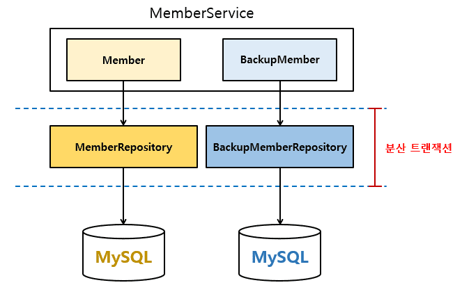

스프링 복습 및 정리 13.2P

<div class="cl1"></div>


이전 포스트에서 적용한 트랜잭션 방식은 단일 데이터베이스에 대한 트랜잭션 적용 방식을 의미하는 로컬 트랜잭션이다.

<div class="cl3"></div>

그런데 때때로 서로 다른 데이터소스를 사용하는 한 개 이상의 데이터베이스를

하나의 트랜잭션으로 묶어서 처리해야 할 경우가 있는데 이를 **분산 트랜잭션**이라고 한다.

<div class="cl3"></div>

이번 포스트에서는 분산 트랜잭션을 이용해서 두 개의 MySQL 데이터베이스를 사용하는

데이터 액세스 작업을 하나의 트랜잭션으로 묶어보도록 하겠다.

<div class="cl1"></div>

## 분산 트랜잭션 구조

샘플 애플리케이션에 적용할 분산 트랜잭션 구조

<p align="center" style="margin: 44px 0 44px 0"></p>

위 그림은 서비스 계층과 데이터 액세스 계층과의 관계를 표현한 것이다.

<div class="cl3"></div>

백업용 회원 정보는 기존 회원 정보의 백업 데이터 역할을 하며,

분산 트랜잭션의 적용을 확인하기 위한 학습용 임시 테이블이라고 생각하면 된다.

<div class="cl3"></div>

<div class="callout">
   <div class="callout-in">
       <p>백업을 위해 특정 데이터베이스의 데이터를 다른 데이터베이스로 복제하는 방법은 여러 가지가 존재한다.</p>
       <div class="cl3"></div>
       <p>같은 종류의 데이터베이스일 경우, 복제 기능을 이용해서 데이터를 백업할 수 있다.</p>
       <div class="cl3"></div>
       <p>다른 종류의 데이터베이스 간에 사용할 수 있는 방법은 애플리케이션의 스케줄링 기능을 통해</p>
       <p>주기적으로 원본 데이터베이스의 데이터를 다른 데이터베이스로 백업하는 기능을 구현할 수 있으며,</p>
       <p>이런 기능들을 기본적으로 지원하는 Apache NiFi같은 오픈 소스 기술을 사용할 수도 있다.</p>
   </div>
</div>

<div class="cl1"></div>

## 사전 준비

분산 트랜잭션을 적용하기 위해서는 MySQL 데이터베이스가 준비되어 있어야 한다.

MySQL 설치 방법 [[더보기]](https://preasim.github.io/88)

<div class="cl3"></div>

분산 트랜잭션을 적용해 보기 위해서는 두 개의 DB와 user가 필요하다.

아래 명령으로 두 개의 DB와 user를 생성한다.

<div class="cl3"></div>

**기존의 커피 주문 정보를 위한 데이터베이스 정보**

```jsx
mysql> create database coffee_order;
mysql> create user guest@localhost identified by 'guest';
mysql> grant all privileges on *.* to guest@localhost;
mysql> flush privileges;
```

<div class="cl3"></div>

**백업 회원 정보를 위한 데이터베이스 정보**

```jsx
mysql> create database backup_data;
mysql> create user backup@localhost identified by 'backup';
mysql> grant all privileges on *.* to backup@localhost;
mysql> flush privileges;
```

<div class="cl3"></div>

**의존 라이브러리 추가**

```jsx
dependencies {
  implementation 'mysql:mysql-connector-java'
  implementation 'org.springframework.boot:spring-boot-starter-jta-atomikos'
}
```

<div class="cl1"></div>

## 두 개의 DB 설정

두 개의 데이터베이스에 분산 트랜잭션을 적용하려면 다음가 같은 설정이 필요하다.

<div class="cl3"></div>

1. 해당 데이터베이스에 맞는 데이터소스를 생성한다.
2. 각 데이터소스를 JPA의 EntityManager가 인식하도록 설정한다.
3. JTA TransactionManager 설정
4. JTA Platform 설정

<div class="cl3"></div>

**커피 주문을 위한 데이터베이스 설정**

```java
// (1) JpaRepository 활성화
@EnableJpaRepositories(
        basePackages = {"com.codestates.member",
                "com.codestates.stamp",
                "com.codestates.order",
                "com.codestates.coffee"},
        entityManagerFactoryRef = "coffeeOrderEntityManager"
)
@Configuration
public class XaCoffeeOrderConfig {
    // (2) 데이터소스 생성
    @Primary
    @Bean
    public DataSource dataSourceCoffeeOrder() {
        MysqlXADataSource mysqlXADataSource = new MysqlXADataSource();
        mysqlXADataSource.setURL("jdbc:mysql://localhost:3306/coffee_order" +
                "?allowPublicKeyRetrieval=true" +
                "&characterEncoding=UTF-8");
        mysqlXADataSource.setUser("guest");
        mysqlXADataSource.setPassword("guest");

        AtomikosDataSourceBean atomikosDataSourceBean = new AtomikosDataSourceBean();
        atomikosDataSourceBean.setXaDataSource(mysqlXADataSource);
        atomikosDataSourceBean.setUniqueResourceName("xaCoffeeOrder");

        return atomikosDataSourceBean;
    }

    // (3) EntityManagerFactoryBean 설정
    @Primary
    @Bean
    public LocalContainerEntityManagerFactoryBean coffeeOrderEntityManager() {
        LocalContainerEntityManagerFactoryBean emFactoryBean =
                new LocalContainerEntityManagerFactoryBean();
        HibernateJpaVendorAdapter vendorAdapter = new HibernateJpaVendorAdapter();
        vendorAdapter.setDatabase(Database.MYSQL);
        Map<String, Object> properties = new HashMap<>();
        properties.put("hibernate.hbm2ddl.auto", "create");
        properties.put("hibernate.show_sql", "true");
        properties.put("hibernate.format_sql", "true");

        // (4)
        properties.put("hibernate.transaction.jta.platform", 
                                            AtomikosJtaPlatform.class.getName());
        properties.put("javax.persistence.transactionType", "JTA");

        emFactoryBean.setDataSource(dataSourceCoffeeOrder());
        emFactoryBean.setPackagesToScan(new String[]{
                "com.codestates.member",
                "com.codestates.stamp",
                "com.codestates.order",
                "com.codestates.coffee"
        });
        emFactoryBean.setJpaVendorAdapter(vendorAdapter);
        emFactoryBean.setPersistenceUnitName("coffeeOrderPersistenceUnit");
        emFactoryBean.setJpaPropertyMap(properties);

        return emFactoryBean;
    }
}
```

<div class="cl4"></div>

위 코드는 커피 주문을 위한 데이터베이스 설정 코드이다.

로컬 트랜잭션의 경우, Spring Boot의 자동 구성을 이용했기 때문에 개발자가 해야 하는 일이 별로 없지만

분산 트랜잭션의 경우 위 코드와 같이 별도의 추가 설정이 필요하다.

<div class="cl3"></div>

(1)에서는 데이터베이스를 사용하기 위한 JpaRepository가 위치한 패키지와 entityManagerFactory 빈에 대한 참조를 설정한다.

- basePackages
    - 기존에 사용하던 JpaRepository를 그대로 사용하도록 해당 Repository가 있는 패키지 경로를 적어준다.
- entityManagerFactoryRef
    - (3)의 Bean 생성 메서드 명을 적어준다.

<div class="cl3"></div>

(2)에서는 데이터베이스에 대한 데이터소스를 생성하기 위해 데이터베이스 접속 정보들을 설정한다.

<div class="cl3"></div>

(3)에서는 JPA의 EntityManager를 얻기 위해서 LocalContainerEntityManagerFactoryBean을 사용하고 있다.

- LocalContainerEntityManagerFactoryBean에서 사용하는 어댑터 중에서 우리가 사용하는 <br> HibernateJpaVendorAdapter를 설정해 주고, Hibernate에서 필요한 설정 정보를 Map으로 설정해 준다.
- EntityManager가 사용할 Entity 클래스가 위치한 패키지 경로를 지정해 준다.

<div class="cl3"></div>

(4)와 같이 JTA Platform의 이름을 추가해주어야 한다.

<div class="cl3"></div>

서블릿 컨테이너 환경에서 분산 트랜잭션을 적용하기 위해서는 별도의 JTA 트랜잭션 매니저가 필요한데,

여기선 가장 많이 사용하는 오픈 소스 JTA 트랜잭션 매니저 플랫폼인 Atomikos를 사용한다.

<div class="cl2"></div>

**백업용 회원 정보 데이터베이스 설정**

```java
// (1)
@EnableJpaRepositories(
    basePackages = {"com.codestates.backup"},
    entityManagerFactoryRef = "backupEntityManager"
)
@Configuration
public class XaBackupConfig {
    @Bean
    public DataSource dataSourceBackup() {
        // (2)
        MysqlXADataSource mysqlXADataSource = new MysqlXADataSource();
        mysqlXADataSource.setURL("jdbc:mysql://localhost:3306/backup_data" +
                "?allowPublicKeyRetrieval=true" +
                "&characterEncoding=UTF-8");
        mysqlXADataSource.setUser("backup");
        mysqlXADataSource.setPassword("backup");

        AtomikosDataSourceBean atomikosDataSourceBean = new AtomikosDataSourceBean();
        atomikosDataSourceBean.setXaDataSource(mysqlXADataSource);
        atomikosDataSourceBean.setUniqueResourceName("xaMySQLBackupMember");

        return atomikosDataSourceBean;
    }

    @Bean
    public LocalContainerEntityManagerFactoryBean backupEntityManager() {
        LocalContainerEntityManagerFactoryBean emFactoryBean =
                new LocalContainerEntityManagerFactoryBean();
        HibernateJpaVendorAdapter vendorAdapter = new HibernateJpaVendorAdapter();
        vendorAdapter.setDatabase(Database.MYSQL);
        Map<String, Object> properties = new HashMap<>();
        properties.put("hibernate.hbm2ddl.auto", "create");
        properties.put("hibernate.show_sql", "true");
        properties.put("hibernate.format_sql", "true");
        properties.put("hibernate.transaction.jta.platform",  
                                            AtomikosJtaPlatform.class.getName());
        properties.put("javax.persistence.transactionType", "JTA");

        emFactoryBean.setDataSource(dataSourceBackup());

        // (3)
        emFactoryBean.setPackagesToScan(new String[]{"com.codestates.backup"});
        emFactoryBean.setJpaVendorAdapter(vendorAdapter);
        emFactoryBean.setPersistenceUnitName("backupPersistenceUnit");
        emFactoryBean.setJpaPropertyMap(properties);

        return emFactoryBean;
    }
}
```

<div class="cl4"></div>

백업용 회원 정보 데이터베이스의 설정 방법은 커피 주문을 위한 데이터베이스의 설정 방식과 동일한데

아래와 같이 백업용 회원 정보 데이터베이스에 필요한 정보로 적절하게 수정해 주면 된다.

<div class="cl3"></div>

- 데이터베이스에서 사용할 JpaRepository가 위치한 패키지 경로를 (1)과 같이 바꿔줘야 한다.
- MySQL 접속 정보를 (2)와 같이 입력해주여야 한다.
- EntityManager가 사용할 Entity 클래스(BackupMember)가 위치한 패키지 경로를 (3)과 같이 변경해 준다.

<div class="cl2"></div>

**JTA TransactionManager 설정**

```java
@Configuration
public class JtaConfig {
    // (1)
    @Bean(name = "userTransaction")
    public UserTransaction userTransaction() throws Throwable {
        UserTransactionImp userTransactionImp = new UserTransactionImp();
        userTransactionImp.setTransactionTimeout(10000);
        return userTransactionImp;
    }

    @Bean(name = "atomikosTransactionManager")
    public TransactionManager atomikosTransactionManager() throws Throwable {
        // (2)
        UserTransactionManager userTransactionManager = new UserTransactionManager();
        userTransactionManager.setForceShutdown(false);

        // (3)
        AtomikosJtaPlatform.transactionManager = userTransactionManager;

        return userTransactionManager;
    }

    @Bean(name = "transactionManager")
    @DependsOn({ "userTransaction", "atomikosTransactionManager" })
    public PlatformTransactionManager transactionManager() throws Throwable {
        UserTransaction userTransaction = userTransaction();

        AtomikosJtaPlatform.transaction = userTransaction;

        TransactionManager atomikosTransactionManager = atomikosTransactionManager();

        // (4)
        return new JtaTransactionManager(userTransaction, atomikosTransactionManager);
    }
}
```

<div class="cl4"></div>

Atomikos와 관련된 두 개의 Bean은 userTransaction과 atomikosTransactionManager이며,

이 두 개의 Bean을 (4)와 같이 JtaTransactionManager의 생성자로 넘겨주면 Atomikos의 분산 트랜잭션을 사용할 수 있다.

<div class="cl3"></div>

(1)의 UserTransaction은 애플리케이션이 트랜잭션 경계에서 관리되는 것을 명시적으로 정의한다.

<div class="cl3"></div>

(2)와 같이 UserTransaction을 관리하는 UserTransactionManager를 생성한 후에

(3)과 같이 AtomikosJtaPlatform의 트랜잭션 매니저로 설정한다.

<div class="cl2"></div>

**JTA Platform 설정**

```java
public class AtomikosJtaPlatform  extends AbstractJtaPlatform {
    static TransactionManager transactionManager;
    static UserTransaction transaction;

    @Override
    protected TransactionManager locateTransactionManager() {
        return transactionManager;
    }

    @Override
    protected UserTransaction locateUserTransaction() {
        return transaction;
    }
}
```

<div class="cl4"></div>

JTA Platform 설정은 별다를 게 없다.

AbstractJtaPlatform을 상속한 후에 트랜잭션 매니저의 위치와 UserTransaction의 위치를 지정만 해주면 되는데,

이 작업은 JTA TransactionManager(JtaConfig) 설정에서 이루어진다.

<div class="cl2"></div>

**회원 백업 정보 엔티티 클래스 정의**

```java
@NoArgsConstructor
@Getter
@Setter
@Entity
public class BackupMember extends Auditable {
    @Id
    @GeneratedValue(strategy = GenerationType.IDENTITY)
    private Long memberId;

    @Column(nullable = false, updatable = false, unique = true)
    private String email;

    @Column(length = 100, nullable = false)
    private String name;

    @Column(length = 13, nullable = false, unique = true)
    private String phone;

    // 추가된 부분
    @Enumerated(value = EnumType.STRING)
    @Column(length = 20, nullable = false)
    private MemberStatus memberStatus = MemberStatus.MEMBER_ACTIVE;

    public BackupMember(String email) {
        this.email = email;
    }

    public BackupMember(String email, String name, String phone) {
        this.email = email;
        this.name = name;
        this.phone = phone;
    }

    public enum MemberStatus {
        MEMBER_ACTIVE("활동중"),
        MEMBER_SLEEP("휴면 상태"),
        MEMBER_QUIT("탈퇴 상태");

        @Getter
        private String status;

        MemberStatus(String status) {
          this.status = status;
        }
    }
}
```

<div class="cl4"></div>

다른 엔티티 클래스와의 연관 관계를 제거했으며, 나머지 코드는 Member 클래스와 동일하다.

<div class="cl2"></div>

**회원 백업 정보 저장을 위한 Repository 인터페이스**

```java
public interface BackupMemberRepository extends JpaRepository<BackupMember, Long> {
}
```

<div class="cl4"></div>

Member가 BackupMember로 변경되었다.

<div class="cl2"></div>

**MemberService에서 회원 정보와 백업 정보 등록**

```java
@Transactional
@Service
public class MemberService {
    private final BackupMemberService backupMemberService;
    private final MemberRepository memberRepository;
    private final BackupMemberRepository backupMemberRepository;

    public MemberService(BackupMemberService backupMemberService, // (1)
                        MemberRepository memberRepository) {
        this.backupMemberService = backupMemberService;
        this.memberRepository = memberRepository;
        this.backupMemberRepository = backupMemberRepository;
    }

    @Transactional
    public Member createMember(Member member) {
        verifyExistsEmail(member.getEmail());
        Member savedMember = memberRepository.save(member);

        // (2)
        backupMemberService.createBackupMember(new BackupMember(member.getEmail(),
                member.getName(), member.getPhone()));

        return savedMember;
    }

    ...
    ...
}
```

<div class="cl4"></div>

MemberService의 createMember() 메서드는 데이터베이스에 회원 정보를 등록할 때,

백업용 회원 정보 데이터베이스에 추가로 회원 정보를 저장하도록 구현했다.

<div class="cl3"></div>

(1)에서 백업용 회원 정보를 저장할 BackupMemberService를 DI 받는다.

회원 정보를 등록한 후, (2)에서 백업용 회원 정보를 저장한다.

<div class="cl2"></div>

**MemberService에서 회원 정보와 회원 백업 정보 등록**

```java
@Service
public class BackupMemberService {
    private final BackupMemberRepository backupMemberRepository;

    public BackupMemberService(BackupMemberRepository backupMemberRepository) {
        this.backupMemberRepository = backupMemberRepository;
    }

    @Transactional
    public void createBackupMember(BackupMember backupMember) {
        backupMemberRepository.save(backupMember);
        
        // (1)
        throw new RuntimeException("multi datasource rollback test");
    }
}
```

<div class="cl4"></div>

실질적으로 백업용 회원 정보 저장 작업을 수행하는데,

회원 정보 저장 중에 예외 발생을 시뮬레이션하기 위해 (1)과 같이 RuntimeException을 발생시켰다.

<div class="cl3"></div>

이제 애플리케이션을 실행시키고, Postman으로 postMember()에 요청을 전송하면

두 개의 데이터베이스에 각각 회원 정보를 저장하기 위한 작업을 하다가 BackupMemberService에서

예외가 발생하기 때문에 두 개의 데이터베이스에는 모두 데이터가 저장되지 않는다.

<div class="cl3"></div>

이처럼 분산 트랜잭션을 적용하면 서로 다른 리소스에 대한 작업을 수행하더라도

하나의 작업처럼 관리하기 때문에 원자성을 보장할 수 있다.

