MySQL 설치 방법

## Windows

MySQL [[더보기]](https://www.mysql.com/)에 접속한다.

<p align="center" style="margin: 64px 0 64px 0"></p>

---

<p align="center" style="margin: 64px 0 64px 0">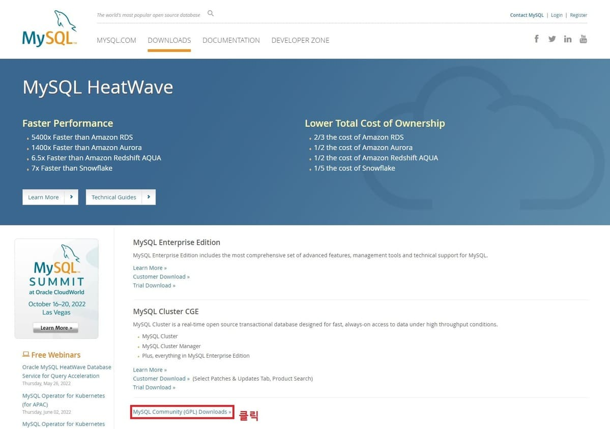</p>

---

<p align="center" style="margin: 64px 0 64px 0">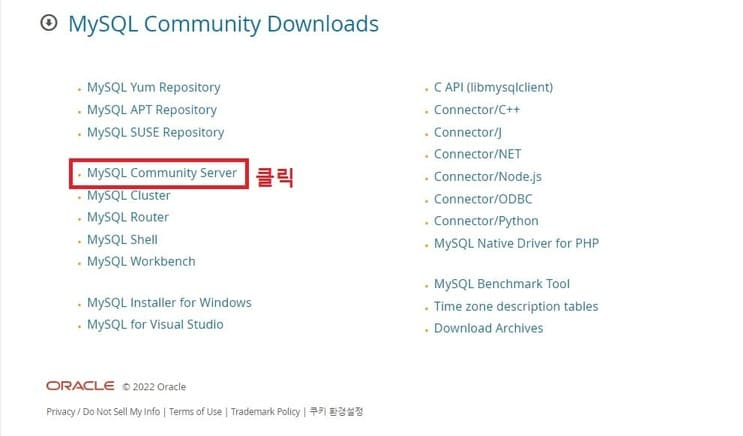</p>

---

<p align="center" style="margin: 64px 0 64px 0">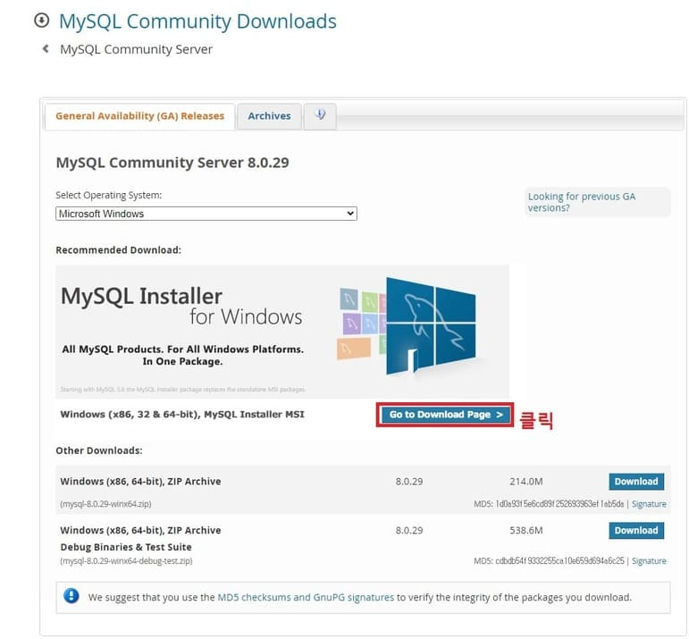</p>

---

<p align="center" style="margin: 64px 0 64px 0"></p>

---

<p align="center" style="margin: 64px 0 64px 0">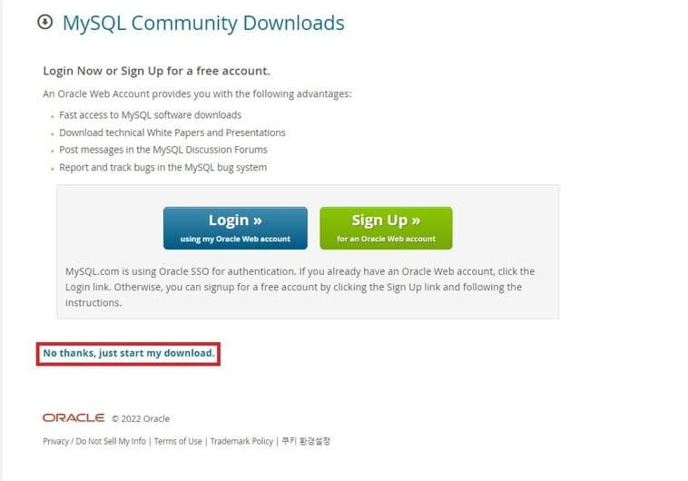</p>

---

<p align="center" style="margin: 64px 0 64px 0">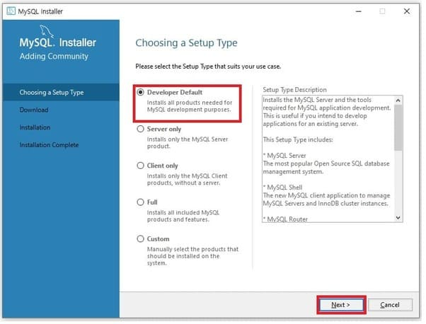</p>

---

<p align="center" style="margin: 64px 0 64px 0">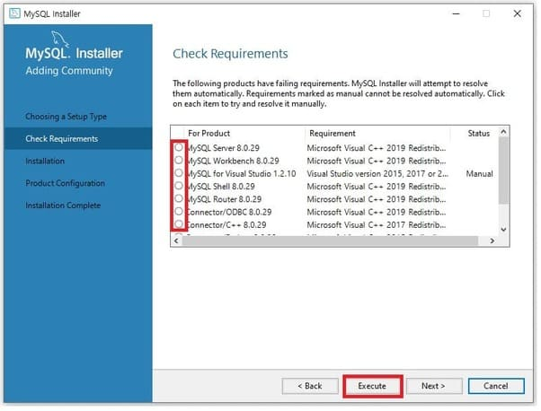</p>

---

<p align="center" style="margin: 64px 0 64px 0">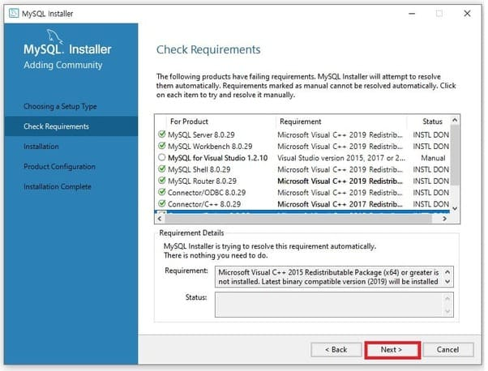</p>

---

<p align="center" style="margin: 64px 0 64px 0">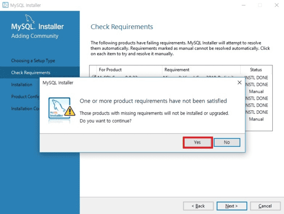</p>

---

<p align="center" style="margin: 64px 0 64px 0">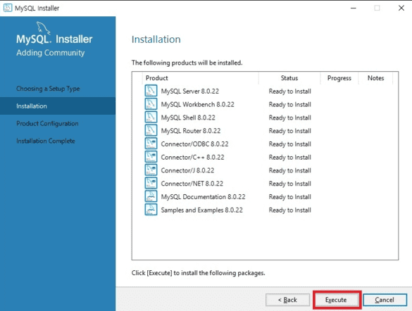</p>

---

<p align="center" style="margin: 64px 0 64px 0">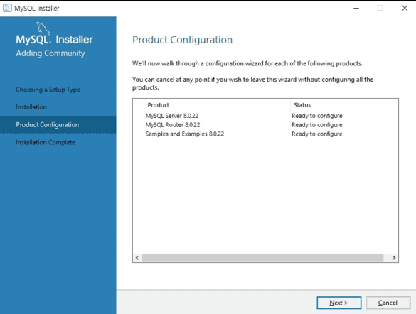</p>

---

<p align="center" style="margin: 64px 0 64px 0">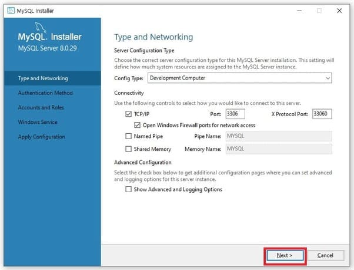</p>

---

<p align="center" style="margin: 64px 0 64px 0">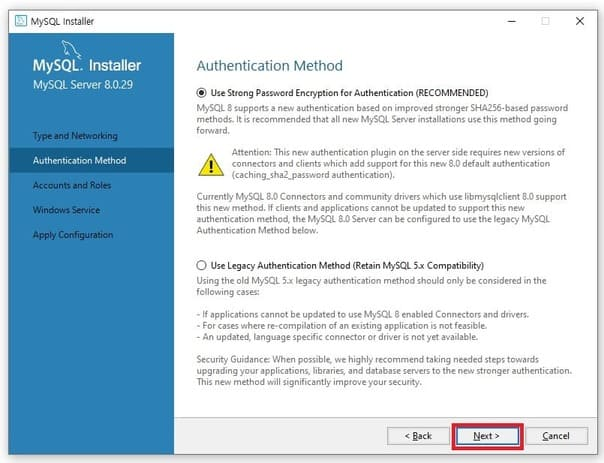</p>

---

<p align="center" style="margin: 64px 0 64px 0">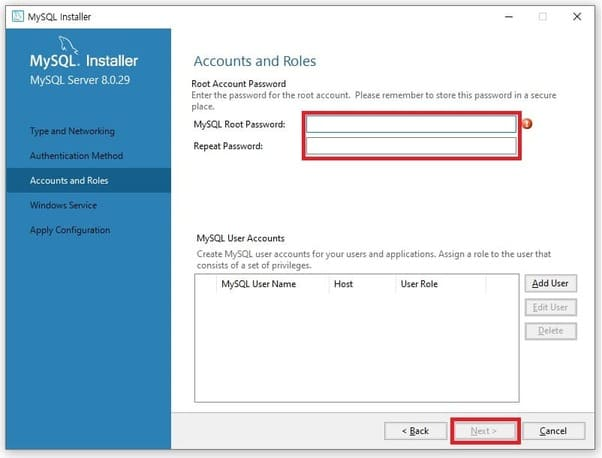</p>

---

<p align="center" style="margin: 64px 0 64px 0">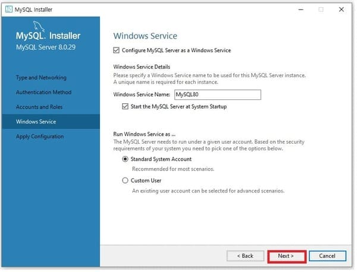</p>

---

<p align="center" style="margin: 64px 0 64px 0">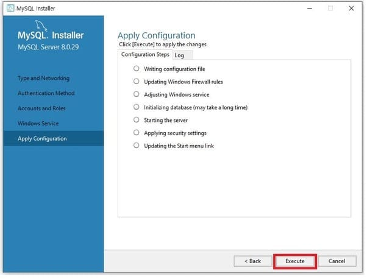</p>

---

<p align="center" style="margin: 64px 0 64px 0">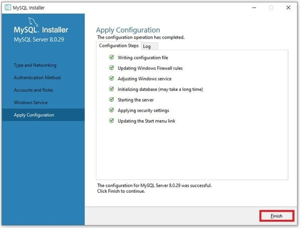</p>

---

<p align="center" style="margin: 64px 0 64px 0">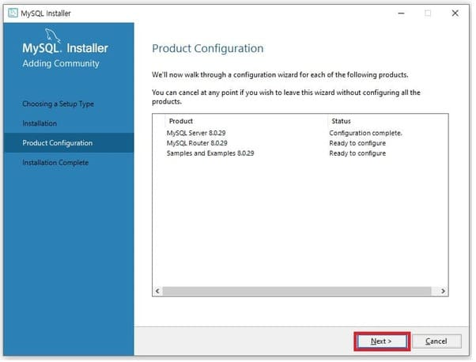</p>

---

<p align="center" style="margin: 64px 0 64px 0">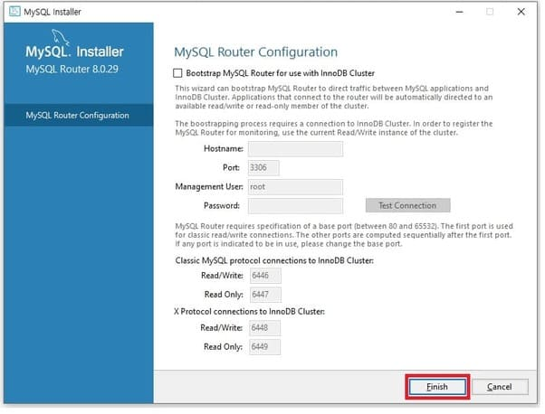</p>

---

<p align="center" style="margin: 64px 0 64px 0">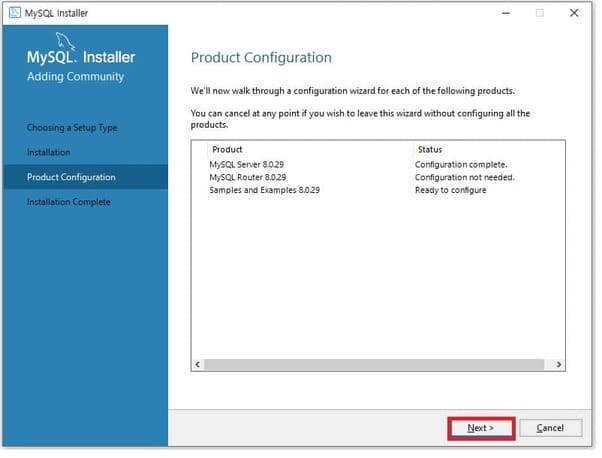</p>

---

<p align="center" style="margin: 64px 0 64px 0">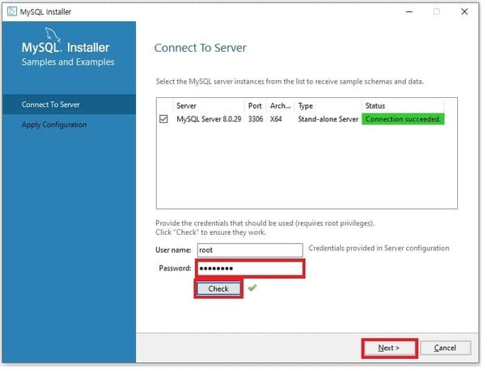</p>

---

<p align="center" style="margin: 64px 0 64px 0">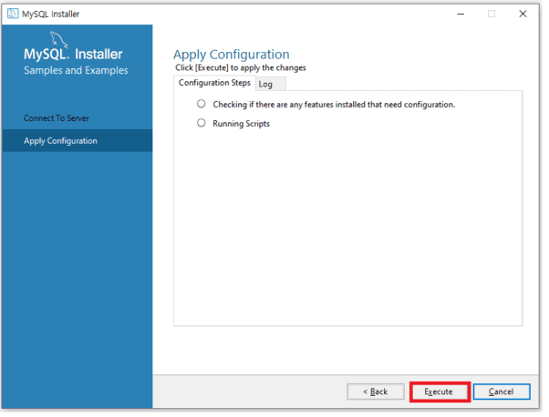</p>

---

<p align="center" style="margin: 64px 0 64px 0">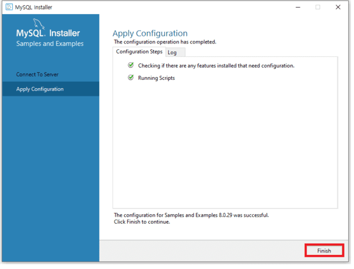</p>

---

<p align="center" style="margin: 64px 0 64px 0">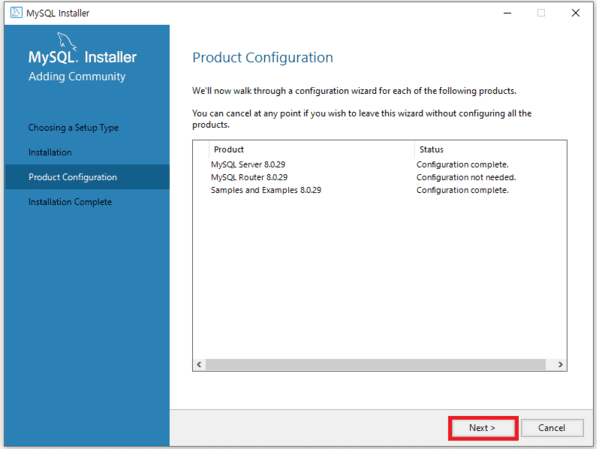</p>

---

<p align="center" style="margin: 64px 0 64px 0">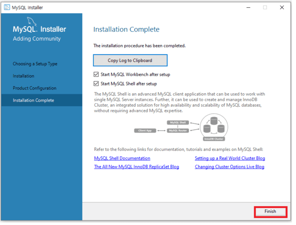</p>

---

### MySQL 접속

<p align="center" style="margin: 64px 0 64px 0">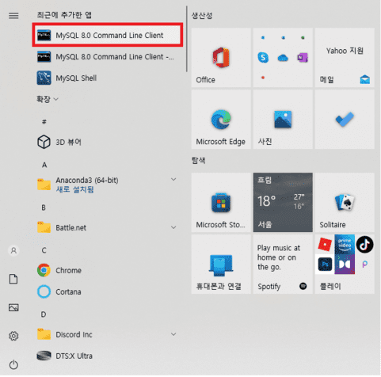</p>

---

<p align="center" style="margin: 64px 0 64px 0">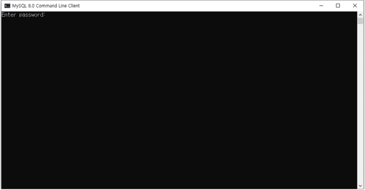</p>

---

MYSQL Command Line Clien을 실행하고, 해당 화면에서 비밀번호를 입력한다.

<p align="center" style="margin: 64px 0 64px 0">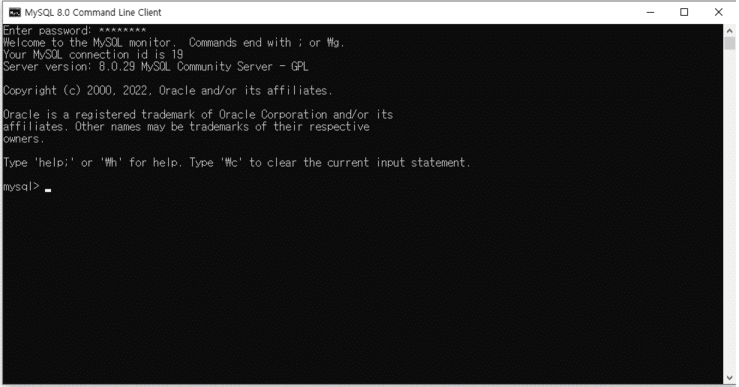</p>

<div class="cl1"></div>
<div class="downLine"></div>
<div class="cl2"></div>

## Mac

Homebrew혹은 Linux를 이용해 MySQL을 설치한다.

<div class="cl3"></div>

**Homebrew**

```jsx
brew install mysql
brew info mysql
```

<div class="cl3"></div>

**Ubuntu(Linux)**

```jsx
sudo apt-get update
sudo apt-get install mysql-server
```

<div class="cl2"></div>

MySQL을 설치했다면, 프로그램을 실행한다.

<div class="cl3"></div>

**Homebrew**

```jsx
brew services start mysql
```

<div class="cl3"></div>

**Ubuntu(Linux)**

```jsx
sudo systemctl start mysql
```

<div class="cl2"></div>

아래 명령어로 MySQL에 접속할 수 있다.

오류가 발생하거나, 존재하지 않는 명령어라는 결과가 나온다면, 설치에 문제가 있거나

MySQL이 실행되지 않은 상태이다.

<div class="cl3"></div>

**MySQL 접속**

```jsx
mysql -u root
```

<div class="cl3"></div>

```jsx
# -u(계정 접근), -p(비밀번호)
mysql -u root -p
```

<div class="cl3"></div>

MySQL에서 'root' 사용자의 비밀번호를 'yourPassword'로 변경하는 명령어

```jsx
ALTER USER 'root'@'localhost' IDENTIFIED WITH mysql_native_password BY 'yourPassword';
```

<div class="cl1"></div>
<div class="downLine"></div>
<div class="cl2"></div>

## SQL GUI Suppoert Tool

GUI 환경에서도 MySQL과 같은 데이터베이스에 접속할 수 있다.

GUI 툴을 이용해 SQL문을 입력하여 실행하거나, 테이블 정보를 볼 수 있다.

<div class="cl3"></div>

MySQL Workbench [[더보기]](https://www.mysql.com/products/workbench/)

Sequel Pro (OSX 전용) [[더보기]](https://www.sequelpro.com/)

Table Plus [[더보기]](https://tableplus.com/)

DBeaver [[더보기]](https://dbeaver.io/download/)

DataGrip [[더보기]](https://www.jetbrains.com/datagrip/)