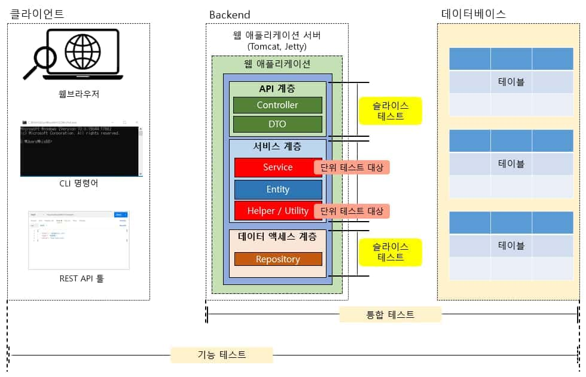

스프링 복습 및 정리 14P

<div class="cl1"></div>

## 단위 테스트 (Unit Test)란?

가장 작은 단위의 코드 조각을 개별적으로 테스트하는 소프트웨어 테스트 방법이다.

특정 함수, 메서드, 또는 모듈의 동작이 예상대로 작동하는지 확인하기 위해 사용된다.

단위 테스트는 소프트웨어의 기능성을 확인하고 개발자가 작성한 코드의 품질을 개선하는 데 도움이 된다.

<p align="center" style="margin: 54px 0 64px 0"></p>

### 기능 테스트

위 그림을 보면 기능 테스트의 테스트의 범위가 가장 큰 것을 볼 수 있다.

단위로 따지자면 단위가 가장 크다.

<div class="cl3"></div>

기능 테스트는 주로 **애플리케이션을 사용하는 사용자 입장에서 애플리케이션이 제공하는 기능이 올바르게 동작하는지를 테스트**한다.

<div class="cl3"></div>

기능 테스트를 하는 주체는 주로 해당 애플리케이션을 개발한 개발자가 될 수도 있지만

일반적으로는 테스트 전문 부서(QA 부서) 또는 외부 QA 업체가 된다.

종종 Frontend 개발자도 서버 측 애플리케이션이 잘 동작하는지 가볍게 테스트를 진행하기도 한다.

<div class="cl3"></div>

기능 테스트의 경우 API 툴이나 데이터베이스까지 연관되어 있어서 HTTP 통신도 해야 되고,

데이터베이스 연결도 해야 되는 등 **개발한 애플리케이션과 연관된 대상이 많기 때문에**

**단위 테스트로 부르기는 힘들다.** (외부 서비스와도 연동될 수 있기 때문에 얽혀있는 것이 많다.)

<div class="cl2"></div>

### 통합 테스트

기능 테스트는 테스트를 하는 주체가 주로 개발자 이외의 제 3자인 반면에

통합 테스트는 애플리케이션을 만든 개발자 또는 개발팀이 테스트의 주체가 되는 것이 일반적이다.

<div class="cl3"></div>

통합 테스트는 클라이언트 측 툴 없이 개발자가 짜 놓은 테스트 코드를 실행시켜서 이루어지는 경우가 많다.

<div class="cl3"></div>

예를 들어, 개발자가 Controller의 API를 호출하는 테스트 코드를 작성한 후 실행하면

서비스 계층과 데이터 액세스 계층을 거쳐 DB에 실제로 접속해서 기대했던 대로

동작을 하는지 테스트하는 것은 통합 테스트의 하나라고 볼 수 있다.

<div class="cl3"></div>

그런데 통합 테스트 역시 애플리케이션의 여러 계층이 연관되어 있으며,

DB까지 연결되어 있어서 독립적인 테스트가 가능하다고 볼 수는 없기 때문에 단위 테스트라고 하기에는 범위가 크다.

<div class="cl2"></div>

### 슬라이드 테스트

슬라이스 테스트는 애플리케이션을 특정 계층으로 쪼개어서 하는 테스트를 의미한다.

위 그림을 보면 API 계층, 서비스 계층, 데이터 액세스 계층이 각각 슬라이스 테스트의 대상이 될 수 있다.

<div class="cl3"></div>

이 정도로 쪼개어서 테스트한다면 단위 테스트라고 부를 수 있을 수도 있다.

<div class="cl3"></div>

하지만 슬라이스 테스트 역시 해당 계층에서 HTTP 요청이 필요하고,

외부 서비스가 연동되기도 하며 특히나 데이터 액세스 계층의 경우 여전히 DB와 연동되어 있기 때문에

슬라이스 테스트는 단위 테스트보다는 말 그대로 계층별로 쪼개어 테스트한다는 의미의 슬라이스 테스트라고 부른다.

<div class="cl3"></div>

슬라이스 테스트는 **단위 테스트라고 부르기에는 단위가 큰 데스트이며,**

**또한 애플리케이션의 일부만 테스트하기 때문에 부분 통합 테스트라고 부르기도 한다.**

<div class="cl2"></div>

### 단위 테스트

서비스 계층의 경우, 애플리케이션의 핵심 로직인 비즈니스 로직을 구현하는 계층이다.

<div class="cl3"></div>

일반적으로 개발자들이 직접 구현하는 핵심 로직 즉, 비즈니스 로직에서 사용하는 클래스들이

독립적으로 테스트하기 가장 좋은 대상이기 때문에 단위 테스트라고 부르는 경우가 가장 많다.

<div class="cl3"></div>

단위 테스트 코드는 메서드 단위로 대부분 작성된다고 생각하면 된다.

<div class="cl3"></div>

<div class="callout">
   <div class="callout-in">
       <strong>DB를 사용한다면 단위 테스트라고 보기 힘든 것일까?</strong>
       <div class="cl3"></div>
       <p>통합 테스트나 슬라이스 테스트에서 데이터베이스와 연동된다고 해서</p>
       <p>무조건적으로 단위 테스트라고 부르기 어렵다기보다는</p>
       <strong>데이터베이스의 상태가 테스트 이 전과 이 후가 동일하게 유지될 수 있다면</strong> <br>
       <strong>데이터베이스가 연동된다고 해도 단위 테스트에 포함될 수는 있다.</strong>
       <div class="cl4"></div>
       <p>하지만 일반적으로 단위 테스트는 최대한 독립적인 것이 좋고, 최대한 작은 단위인 것이 더 좋다.</p>
       <div class="cl4"></div>
       <p>더 작은 단위일수록 다른 연관된 기능들을 생각할 필요도 없고,</p>
       <p>테스트 코드 짜기도 더 단순해지고 그만큼 빠르게 테스트를 수행할 수 있기 때문이다.</p>
   </div>
</div>

<div class="cl2"></div>

### F.I.R.S.T 원칙

단위 테스트를 위한 테스트 케이스를 작성하기 위해서 F.I.R.S.T 가이드 원칙을 참고할 수 있다.

<div class="cl3"></div>

**Fast (빠르게)**

일반적으로 작성한 테스트 케이스는 빨라야 한다는 의미이다.

작성한 테스트 케이스가 너무 느리다면 테스트 케이스를 돌려보고 싶은 마음이 잘 들지 않을 것이다.

자주 돌려야 문제를 빨리 찾을 텐데, 너무 느려서 돌리기 힘들다면 테스트 케이스를 작성하는 의미가 퇴색될 것이다.

<div class="cl3"></div>

**Independent (독립적으로)**

각각의 테스트 케이스는 독립적이어야 한다는 의미이다.

일반적으로 우리가 테스트 케이스를 작성할 때, 클래스 단위로 해당 클래스 내의 메서드 동작을 테스트한다.

<div class="cl4"></div>

메서드는 어러 개 존재할 가능성이 높을 테니 테스트 클래스 안에 테스트 케이스도 하나 이상이 될 것이다.

<div class="cl4"></div>

이때, 어떤 테스트 케이스를 먼저 실행시켜도 실행되는 순서와 상관없이 정상적인 실행이 보장되어야 한다.

<div class="cl4"></div>

예를 들어, A라는 테스트 케이스를 먼저 실행시킨 후에 다음으로

B라는 테스트 케이스를 실행시켰더니 테스트에 실패하게 된다면 테스트 케이스끼리 독립적이지 않은 것이다.

<div class="cl3"></div>

**Repeatable (반복 가능)**

테스트 케이스는 어떤 환경에서도 반복해서 실행이 가능해야 된다는 의미이다.

IDE에서 버튼을 눌러서 실행을 하든, Gradle 같은 빌드 테스크를 직접 입력해서 실행을 하든,

로컬 환경이나 서버 환경에서 실행하든 반복해서 같은 결과를 확인할 수 있어야 한다.

<div class="cl4"></div>

외부 서비스나 외부 리소스가 연동되는 경우 앞에서 언급한 원칙들을 포함해서 동일한 테스트 결과

역시 보장하지 못하기 때문에 단위 테스트 시에는 외부의 서비스나 리소스의 연동을 끊어주는 것이 바람직하다.

<div class="cl3"></div>

**Self-validation (셀프 검증)**

단위 테스트는 성공 또는 실패라는 자체 검증 결과를 보여주어야 한다는 의미이다.

즉, 테스트 케이스 스스로 결과가 옳은지 그른지 판단할 수 있어야 한다는 것이다.

<div class="cl3"></div>

**Timely (시기적절하게)**

단위 테스트는 테스트하려는 기능 구현을 하기 직전에 작성해야 한다는 의미이다.

TDD(테스트 주도 개발) 개발 방식에서는 기능 구현 전에 실패하는 테스트 케이스를

먼저 작성하는 방식을 취하지만 실제로 기능 구현도 하지 않았는데 테스트 케이스부터

먼저 작성한다는 게 쉽지 않은 부분이다.

<div class="cl4"></div>

다만, 기능 구현을 먼저 한다 하더라도 너무 많은 구현 코드가 작성된 상태에서

테스트 케이스를 작성하려면 오히려 테스트 케이스를 작성하는데 더 많은 시간을 들일 가능성도 있다.

<div class="cl4"></div>

**구현하고자 하는 기능을 단계적으로 조금씩 업그레이드하면서 그때그때**

**테스트 케이스 역시 단계적으로 업그레이드하는 방식이 더 낫다.**

<div class="cl1"></div>

## 단위 테스트 적용하기

JUnit 없이 비즈니스 로직에 단위 테스트 적용해 보기

<div class="cl3"></div>

원래는 JUnit이라는 테스트 프레임워크를 사용하겠지만

JUnit 없이 기본적으로 테스트 케이스를 작성하는 흐름을 보면서 감을 잡아 보도록 하겠다.

<div class="cl3"></div>

단위 테스트를 제일 쉽고 빠르게 적용할 수 있는 부분은 바로 헬퍼(helper) 클래스 또는 유틸리티(utility) 클래스이다.

<div class="cl3"></div>

<div class="callout">
   <div class="callout-in">
       <strong>유틸리티 클래스에 대한 논쟁</strong>
       <div class="cl3"></div>
       <p>유틸리티 클래스의 메서드들은 일반적으로 클래스의 객체로 인스턴스화될 필요가 없기 때문에 정적 메서드로 구성된다.</p>
       <div class="cl4"></div>
       <p>객체 지향 세계에서 모든 걸 객체 지향적인 시각으로 바라보는 사람들에게는</p>
       <p>유틸리티 클래스의 사용을 지양하고 유틸리티 클래스조차 객체 지향적으로 구성하기 위한 노력을 한다.</p>
       <div class="cl4"></div>
       <p>그런데 실제 여러 검증된 오픈 소스에서 유틸리티 클래스를 사용하는 일은 드문 일이 아니다.</p>
       <div class="cl4"></div>
       <p>심지어 여태껏 사용해 온 Spring Framework에서 조차 StringUtils, BeanUtils 같은 유틸리티 클래스를 지원한다.</p>
   </div>
</div>

<div class="cl2"></div>

**테스트 대상인 헬퍼 클래스**

```java
public class StampCalculator {
    public static int calculateStampCount(int nowCount, int earned) {
        return nowCount + earned;
    }
}
```

<div class="cl4"></div>

위 코드는 커피 주문 샘플 애플리케이션에서 현재 회원이 보유한 스탬프 수와

회원이 주문한 커피 수량만큼 획득한 스탬프 수를 더해서 누적 스탬프 수를 계산해 주는 헬퍼 클래스이다.

<div class="cl3"></div>

단위 테스트 학습을 목적으로 단 하나의 메서드만 가지고 있는

이 StampCalculator의 calculateStampCount() 메서드가 기대했던 대로

잘 동작하는지 검증하는 테스트 케이스를 작성해 보겠다.

<div class="cl3"></div>

```java
public class StampCalculatorTestWithoutJUnit {
    public static void main(String[] args) {
        calculateStampCountTest();
    }
    
    private static void calculateStampCountTest() {
        // given
        int nowCount = 5;
        int earned = 3;
        

        // when
        int actual = StampCalculator.calculateStampCount(nowCount, earned);

        int expected = 7;

        // then
        System.out.println(expected == actual);
    }
}
```

<div class="cl4"></div>

위 코드는 JUnit을 사용하지 않고, calculateStampCount()를 테스트하는 테스트 케이스이다.

<div class="cl3"></div>

위 코드에서 주어진 스탬프 수가 5(nowCount)이고, 주문으로 얻게 되는 스탬프 수가 3(earned)인데

기대하는 값은 7(expected)이라고 예상하고 있다.

<div class="cl3"></div>

코드를 실행하면 당연히 계산 결과는 8(actual)이기 때문에 결과 값인 expected == actual은 false이다.

<div class="cl3"></div>

즉, expected로 틀린 값인 7을 기대했기 때문에 결과(actual) 값으로 false가 나왔다는 것은 테스트에 실패한 것이다.

<div class="cl2"></div>

### Given-When-Then 표현 스타일

위 코드에서 주석으로 표시한 given - when - then이라는 용어는 BDD(Behavior Driven Development)라는 테스트 방식에서 사용하는 용어이다.

<div class="cl3"></div>

**Given**

- 테스트를 위한 준비 과정을 명시할 수 있다.
- 테스트에 필요한 전제 조건들이 포함된다고 보면 된다.
- 테스트 대상에 전달되는 입력 값(테스트 데이터) 역시 Given에 포함된다.

<div class="cl3"></div>

**When**

- 테스트할 동작(대상)을 지정한다.
- 단위 테스트에서는 일반적으로 메서드 호출을 통해 테스트를 진행하므로 한두 줄 정도로 작성이 끝나는 부분이다.

<div class="cl3"></div>

**Then**

- 테스트의 결과를 검증하는 영역이다.
- 일반적으로 예상하는 값(expected)과 테스트 대상 메서드의 동작 수행 결과(actual)
값을 비교해서 기대한 대로 동작을 수행하는지 검증(Assertion)하는 코드들이 포함된다.

<div class="cl3"></div>

<div class="callout">
   <div class="callout-in">
       <strong>Assertion(어써션)이란?</strong>
       <div class="cl3"></div>
       <p>우리말로 단언, 단정 등의 뜻이 있는데</p>
       <p>테스트 세계에서 Assertion이라는 용어는 테스트 결과를 검증할 때 주로 사용한다.</p>
       <div class="cl4"></div>
       <p>테스트 케이스 결과가 반드시 true여야 한다는 것을 논리적으로 표현한 것이 Assertion인데,</p>
       <p>한마디로 예상하는 결과 값이 true이길 바라는 것이라고 이해하면 된다.</p>
       <div class="cl4"></div>
       <p>Assertion을 단언문, 단정문이라고 표현을 하는 곳이 많은데 여기선 Assertion이라고 하겠다.</p>
   </div>
</div>

<div class="cl2"></div>

**테스트 대상인 헬퍼 클래스 예**

```java
public class StampCalculator {
    // (1)
    public static int calculateStampCount(int nowCount, int earned) {
        return nowCount + earned;
    }

    // (2)
    public static int calculateEarnedStampCount(Order order) {
        return order.getOrderCoffees().stream()
                .map(orderCoffee -> orderCoffee.getQuantity())
                .mapToInt(quantity -> quantity)
                .sum();
    }
}
```

<div class="cl4"></div>

위 코드를 보면 테스트 대상 클래스인 StampCalculator 클래스에 (2)와 같이 하나의 기능이 더 추가되었다.

(1)은 앞에서 이미 테스트 한 기능이다.

<div class="cl3"></div>

(2)의 calculateEarnedStampCount() 메서드는 회원이 주문한 주문 정보에서 얻게 되는 스탬프 개수를 계산하는 기능을 한다.

<div class="cl3"></div>

이번에는 이 calculateEarnedStampCount()를 테스트해 보겠다.

<div class="cl3"></div>

```java
public class StampCalculatorTestWithoutJUnit {
    public static void main(String[] args) {
        calculateStampCountTest();        // (1)
        calculateEarnedStampCountTest();  // (2)
    }

    private static void calculateStampCountTest() {
        // given
        int nowCount = 5;
        int earned = 3;

        // when
        int actual = StampCalculator.calculateStampCount(nowCount, earned);

        int expected = 7;

        // then
        System.out.println(expected == actual);
    }

    private static void calculateEarnedStampCountTest() {
        // given
        Order order = new Order();
        OrderCoffee orderCoffee1 = new OrderCoffee();
        orderCoffee1.setQuantity(3);

        OrderCoffee orderCoffee2 = new OrderCoffee();
        orderCoffee2.setQuantity(5);

        order.setOrderCoffees(List.of(orderCoffee1, orderCoffee2));

        int expected = orderCoffee1.getQuantity() + orderCoffee2.getQuantity();

        // when
        int actual = StampCalculator.calculateEarnedStampCount(order);

        // then
        System.out.println(expected == actual);
    }
}
```

<div class="cl4"></div>

(2)는 calculateEarnedStampCount() 메서드를 테스트하는 테스트 케이스이다.

Given-When-Then으로 테스트 케이스를 설명하면 다음과 같다.

<div class="cl3"></div>

Given

- 주문한 커피의 수량이 필요하기 때문에 Order와 OrderCoffee 객체를 직접 만들어서 테스트에 필요한 데이터를 생성한다.

<div class="cl3"></div>

When

- 테스트 대상에 given에서 생성한 테스트 데이터를 입력값으로 전달한다.

<div class="cl3"></div>

Then

- 주문한 커피 수량만큼의 스탬프가 계산되는지를 Assertion한다.

위 코드를 실행하면 두 개의 테스트 케이스가 실행되고 두 개의 결과가 다음과 같이 콘솔에 출력된다.

<div class="cl4"></div>

```jsx
false
true
```

<div class="cl3"></div>

이 처럼 하나의 테스트 클래스에서 여러 개의 테스트 케이스를 한꺼번에 실행할 수 있으며,

JUnit을 사용하더라도 마찬가지이다.

<div class="cl3"></div>

그리고 두 개의 케이스를 한꺼번에 실행하고 순서를 바꿔서 사용하더라도 각각의 테스트 케이스는

독립적으로 실행되기 때문에 테스트 케이스를 실행할 때마다 테스트 결과가 바뀌는 경우는 없다.

<div class="cl3"></div>

즉, 간단한 예제 코드이지만 앞에서 설명한 F.I.R.S.T 원칙을 그럭저럭 잘 따른다고 볼 수 있다.

