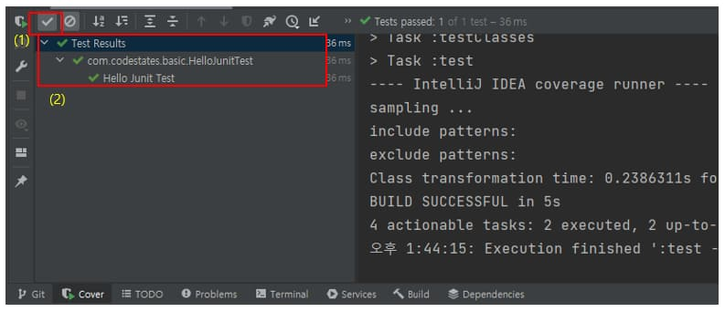
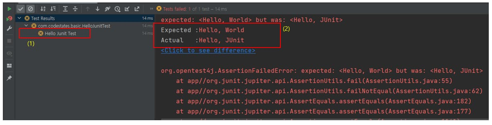
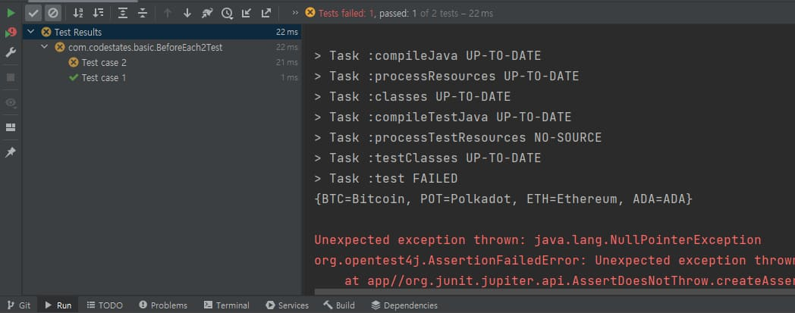

스프링 복습 및 정리 14.1P

<div class="cl1"></div>

JUnit은 자바 언어용 단위 테스트 프레임워크로,

소프트웨어 개발에서 단위 테스트를 쉽게 작성하고 실행할 수 있도록 도와준다.

JUnit은 오픈 소스이며, 자바 언어로 개발된 애플리케이션의 품질을 검증하고 테스트하기 위해 사용된다.

<div class="cl1"></div>

## JUnit 작성법

Spring Boot Intializr를 이용해서 프로젝트를 생성하면 기본적으로

`testImplementation >'org.springframework.boot:spring-boot-starter-test`

스타터가 포함되며, JUnit도 포함이 되어 있으므로 별다른 설정 없이 JUnit을 사용하면 된다.

<div class="cl4"></div>

### 테스트 케이스의 기본 구조

```java
public class JunitDefaultStructure {
    @Test
    public void test1() {
        // 테스트하고자 하는 대상에 대한 테스트 로직 작성
    }

    @Test
    public void test2() {
        // 테스트하고자 하는 대상에 대한 테스트 로직 작성
    }

    @Test
    public void test3() {
        // 테스트하고자 하는 대상에 대한 테스트 로직 작성
    }
}
```

<div class="cl4"></div>

위 코드와 같이 애플리케이션에서 테스트하고자 하는 Target이 있으면

`public void test1(){…}` 같은 void 타입의 메서드를 만들고, @Test 어노테이션을 추가해 준다.

그리고 그 내부에 테스트하고자 하는 대상 메서드에 대한 테스트 로직을 작성해 주면 된다.

<div class="cl2"></div>

### Assertion 메서드 사용하기

Assertion은 **예상하는 결과 값이 true이길 바라는 논리적인 표현**이다라고 전 포스트에서 설명했었다.

JUnit에서는 Assertion과 관련된 다양한 메서드를 사용해서 테스트 대상에 대한 Assertion을 진행할 수 있다.

> 설명하지 않은 Assertion 메서드는 참고 자료에서 확인할 수 있다.

<div class="cl2"></div>

**assertEquals()**

```java
import static org.junit.jupiter.api.Assertions.assertEquals;

public class HelloJUnitTest {
    @DisplayName("Hello JUnit Test")  // (1)
    @Test
    public void assertionTest() {
        String expected = "Hello, JUnit";
        String actual = "Hello, JUnit";

        assertEquals(expected, actual); // (2)
    }
}
```

<div class="cl4"></div>

assertEquals() 메서드를 사용하면 기대하는 값과 실제 결과 값이 같은지를 검증할 수 있다.

(2)에서는 기대하는 문자열(expected)과 실제 결과 값(actual)이 일치하는지를 검증하고 있다.

<div class="cl3"></div>

(1)은 테스트 케이스를 실행시켰을 때, 실행 결과 창에 표시되는 이름을 지정하는 부분이다.

<p align="center" style="margin: 54px 0 54px 0"></p>

테스트 케이스 실행 결과 중에서 (2)와 같이 테스트에 통과한 결과를 보기 위해서는 (1)의 체크 박스에 체크가 되어 있어야 한다.

<div class="cl3"></div>

(2)를 보면 `@DisplayName("Hello JUnit Test")`의 값이 실행 결과에 표시되는 걸 확인할 수 있다.

테스트 케이스가 성공이면 테스트 결과에 초록색 체크 아이콘이 표시된다.

<p align="center" style="margin: 54px 0 34px 0"></p>

반대로 실패할 경우에는 X 아이콘이 표시되고, (2)를 통해서 왜 실패했는지에 대한 설명을 볼 수 있다.

기대했던 값은 “Hello, World”인데, 실제 결과 값은 “Hello, JUnit”이 나온다고 알려준다.

<div class="cl2"></div>

**assertNotNull()**

Null 여부 테스트

```java
import static org.junit.jupiter.api.Assertions.assertNotNull;

public class AssertionNotNullTest {

    @DisplayName("AssertionNull() Test")
    @Test
    public void assertNotNullTest() {
        String currencyName = getCryptoCurrency("ETH");

        // (1)
        assertNotNull(currencyName, "should be not null");
    }

    private String getCryptoCurrency(String unit) {
        return CryptoCurrency.map.get(unit);
    }
}
```

<div class="cl4"></div>

assertNotNull() 메서드의 첫 번째 파라미터는 테스트 대상 객체이고,

두 번째 파라미터는 테스트에 실패했을 때, 표시할 메시지이다.

<div class="cl3"></div>

실행 결과는 ETH에 해당하는 암호 화폐 이름이 map에 저장이 되어 있기 때문에 passed이다.

<div class="cl3"></div>

CryptoCurrency 클래스 코드는 아래 코드를 참고하면 된다.

```java
public class CryptoCurrency {
    public static Map<String, String> map = new HashMap<>();

    static {
        map.put("BTC", "Bitcoin");
        map.put("ETH", "Ethereum");
        map.put("ADA", "ADA");
        map.put("POT", "Polkadot");
    }
}
```

<div class="cl2"></div>

**assertThrows()**

Exception 테스트

```java
import static org.junit.jupiter.api.Assertions.*;

public class AssertionExceptionTest {

    @DisplayName("throws NullPointerException when map.get()")
    @Test
    public void assertionThrowExceptionTest() {
        // (1)
        assertThrows(NullPointerException.class, () -> getCryptoCurrency("XRP"));
    }

    private String getCryptoCurrency(String unit) {
        return CryptoCurrency.map.get(unit).toUpperCase();
    }
}
```

<div class="cl4"></div>

(1)에서 assertThrows()의 첫 번째 파라미터에는 발생이 기대되는 예외 클래스를 입력하고,

두 번째 파라미터인 람다 표현식에서는 테스트 대상 메서드를 호출하면 된다.

<div class="cl3"></div>

테스트 케이스를 실행하면 getCryptoCurrency() 메서드가 호출되고,

파라미터로 전달한 XRP라는 키에 해당하는 암호 화폐가 있는지 map에서 찾는다.

<div class="cl3"></div>

하지만 XRP에 해당하는 암호 화폐는 map에 존재하지 않기 때문에 map에서 반환된 값은 null이 될 것이다.

그리고 map에서 반환된 값이 null인 상태에서 toUpperCase()를 호출해서 대문자로 변환하려고

했기 때문에 NullPointerException이 발생할 것이다.

<div class="cl3"></div>

따라서 (1)에서 NullPointerException이 발생할 것이라고 기대했기 때문에 테스트 실행 결과는 passed이다.

<div class="cl3"></div>


<div class="callout">
   <div class="callout-in">
       <p>만약 assertThrows()의 첫 번째 파라미터로 NullPointerException.class 대신에</p>
       <p>IllegalSateException.class으로 입력 값을 바꾸게 된다면 테스트 실행 결과는 failed이다.</p>
       <div class="cl4"></div>
       <p>우선 기본적으로 IllegalStateException과 NullPointerException은 다른 타입이고,</p>
       <p>IllegalStateException이 NullPointerException의 상위 타입도 아니기 때문에 failed이다.</p>
       <div class="cl4"></div>
       <p>만약 NullPointerException 대신에 RuntimeException 또는 Exception으로 입력 값을 바꾸면</p>
       <p>이 경우, 테스트 실행 결과는 passed이다.</p>
       <div class="cl4"></div>
       <p>NullPointerException은 RuntimeException을 상속하는 하위 타입이고,</p>
       <p>RuntimeException은 Exception을 상속하는 하위 타입이기 때문이다.</p>
       <div class="cl4"></div>
       <p>이처럼 assertThrows()를 사용해서 예외를 테스트하기 위해서는</p>
       <strong>예외 클래스의 상속 관계를 이해한 상태에서 테스트 실행 결과를 예상해야 된다.</strong>
   </div>
</div>

<div class="cl3"></div>

<div class="callout">
   <div class="callout-in">
       <strong>Executable 함수형 인터페이스</strong>
       <div class="cl3"></div>
       <p>assertThrows()의 두 번째 파라미터인 람다 표현식은 JUnit에서 지원하는 Executable 함수형 인터페이스이다.</p>
       <div class="cl4"></div>
       <p>Executable 함수형 인터페이스는 void execute() throw Throwable; 메서드 하나만 정의 되어 있으며 리턴값이 없다.</p>
       <div class="cl4"></div>
       <p>Java에서 지원하는 함수형 인터페이스 중에서 리턴값이 없는 Consumer에 해당된다고 보면 된다.</p>
       <p></p>
   </div>
</div>

<div class="cl2"></div>

### 테스트 케이스 실행 전, 전처리

테스트 케이스를 실행하기 전에 어떤 객체나 값에 대한 초기화 작업 등의 전처리 과정을 해야 할 경우가 많다.

이 경우 JUnit에서 사용할 수 있는 어노테이션이 바로 @BeforeEach와 @BeforeAll()이다.

<div class="cl3"></div>

**@BeforeEach**

```java
public class BeforeEach1Test {

    @BeforeEach
    public void init() {
        System.out.println("Pre-processing before each test case");
    }

    @DisplayName("@BeforeEach Test1")
    @Test
    public void beforeEachTest() {

    }

    @DisplayName("@BeforeEach Test2")
    @Test
    public void beforeEachTest2() {

    }
}
```

<div class="cl4"></div>

위 코드는 두 개의 테스트 케이스가 비어 있지만 @BeforeEach의 동작 방식을 이해하기에는 적절하다.

<div class="cl3"></div>

위 테스트 케이스 메서드를 실행하면 아래와 같은 결과가 콘솔에 출력된다.

```jsx
Pre-processing before each test case
Pre-processing before each test case
```

<div class="cl4"></div>

실행 결과를 보면 init() 메서드가 총 두 번 실행되어 “Pro-processing before each test case”가 두 번 출력되었다.

<div class="cl3"></div>

이처럼 @BeforeEach 어노테이션을 추가한 메서드는 테스트 케이스가 각각 실행될 때마다

테스트 케이스 실행 직전에 먼저 실행되어 초기화 작업 등을 진행할 수 있다.

<div class="cl2"></div>

**예시 2**

```java
public class BeforeEach2Test {
    private Map<String, String> map;

    @BeforeEach
    public void init() {
        map = new HashMap<>();
        map.put("BTC", "Bitcoin");
        map.put("ETH", "Ethereum");
        map.put("ADA", "ADA");
        map.put("POT", "Polkadot");
    }

    @DisplayName("Test case 1")
    @Test
    public void beforeEachTest() {
        map.put("XRP", "Ripple");
        assertDoesNotThrow(() -> getCryptoCurrency("XRP"));
    }

    @DisplayName("Test case 2")
    @Test
    public void beforeEachTest2() {
        System.out.println(map);
        assertDoesNotThrow(() -> getCryptoCurrency("XRP"));
    }

    private String getCryptoCurrency(String unit) {
        return map.get(unit).toUpperCase();
    }
}
```

<div class="cl4"></div>

아래는 위 코드의 실행 결과이다.

<p align="center" style="margin: 34px 0 34px 0"></p>

실행 결과를 보면, Test case 2는 failed이고, Test case 1은 passed이다.

<div class="cl3"></div>

Test case 1은 assertDoesNotThrow()로 Assertion 하기 전에 map에 XRP의 값을 추가했다.

그렇기 때문에 map에 XRP의 값이 존재하므로 예외가 발생하지 않는다.

<div class="cl3"></div>

assertDoesNotThrow() 메서드는 예외가 발생하지 않는다고 기대하는 Assertion 메서드이다.

따라서, 테스트 실행 결과는 passed이다.

<div class="cl3"></div>

그런데 Test case 2는 Assertion 하기 전에 map에 XRP를 추가하지 않았다.

따라서 Test case 2가 실행되기 전에 init() 메서드가 호출되면서 이 전에 한번 사용했던 map 객체가 다시 초기화된다.

<div class="cl3"></div>

**Test case 1에서 map에 XRP를 추가했다 하더라도 추가한 XRP는 Test case 2 실행 전에**

**init() 메서드가 다시 호출되면서 map이 초기화되기 때문에 초기화된 상태로 되돌아간다.**

<div class="cl3"></div>

따라서 Test case 2에서 예외가 발생하지 않는다고 기대했지만 NullpointerException이 발생하므로

테스트 실행 결과는 failed이다.

<div class="cl3"></div>

콘솔에 출력된 `{BTC=Bitcoin, POT=Polkadot, ETH=Ethereum, ADA=ADA}`는 Test case 2 실행 시,

map의 상태를 출력한 것이다. map안에 XRP는 없는 것을 확인할 수 있다.

<div class="cl2"></div>

**@BeforeAll()**

@BeforeEach()와 달리 클래스 레벨에서 테스트 케이스를 한꺼번에 실행시키면 테스트 케이스가

실행되기 전에 딱 한 번만 초기화 작업을 할 수 있도록 해주는 어노테이션이다.

```java
public class BeforeAllTest {
    private static Map<String, String> map;

    @BeforeAll
    public static void initAll() {
        map = new HashMap<>();
        map.put("BTC", "Bitcoin");
        map.put("ETH", "Ethereum");
        map.put("ADA", "ADA");
        map.put("POT", "Polkadot");
        map.put("XRP", "Ripple");

        System.out.println("initialize Crypto Currency map");
    }

    @DisplayName("Test case 1")
    @Test
    public void beforeEachTest() {
        assertDoesNotThrow(() -> getCryptoCurrency("XRP"));
    }

    @DisplayName("Test case 2")
    @Test
    public void beforeEachTest2() {
        assertDoesNotThrow(() -> getCryptoCurrency("ADA"));
    }

    private String getCryptoCurrency(String unit) {
        return map.get(unit).toUpperCase();
    }
}
```

<div class="cl4"></div>

위 코드에서는 @BeforeAll 어노테이션을 사용해서 map 객체를 한 번만 초기화하기 때문에

두 개의 테스트 케이스 실행 결과는 모두 passed이다.

<div class="cl3"></div>

그리고, 콘솔에는 아래와 같이 ”initialize Crypto Currency map”이 한 번만 출력된다.

```jsx
initialize Crypto Currency map
```

> @BeforeAll 어노테이션을 추가한 메서드는 정적 메서드여야 한다.

<div class="cl2"></div>

### 테스트 케이스 실행 후, 후처리

JUnit에서는 테스트 케이스 실행이 끝난 시저멩 후처리 작업을 할 수 있는 @AfterEach, @AfterAll 같은 어노테이션도 지원한다.

<div class="cl3"></div>

**@AfterEach**

```java
import org.junit.jupiter.api.AfterEach;
import org.junit.jupiter.api.Test;

public class ExampleTest {

    @Test
    void test1() {
        // 이 테스트 메서드에서 어떤 작업을 수행
    }

    @AfterEach
    void cleanup() {
        // 테스트 메서드 실행 이후에 실행되는 클린업 코드
        // 예: 리소스 해제 또는 상태 초기화
    }
}
```

<div class="cl3"></div>

**@AfterAll**

```java
import org.junit.jupiter.api.AfterAll;
import org.junit.jupiter.api.Test;

public class ExampleTest {

    @Test
    void test1() {
        // 이 테스트 메서드에서 어떤 작업을 수행
    }

    @AfterAll
    static void cleanup() {
        // 모든 테스트 메서드 실행이 완료된 후에 한 번 호출되는 클린업 코드
        // 예: 리소스 해제 또는 데이터베이스 정리
    }
}
```

<div class="cl2"></div>

### Assumption을 이용한 조건부 테스트

JUnit 5에는 Assumption이라는 기능이 추가되었따.

Assumption은 ‘**~라고 가정하고**’ 라는 표현을 쓸 때의 ‘가정’에 해당한다.

JUnit 5의 Assumption 기능을 사용하면 특정 환경에만 테스트 케이스가 실행되도록 할 수 있다.

```java
public class AssumptionTest {
    @DisplayName("Assumption Test")
    @Test
    public void assumptionTest() {
        // (1)
        assumeTrue(System.getProperty("os.name").startsWith("Windows"));
        // assumeTrue(System.getProperty("os.name").startsWith("Linux")); // (2)
        System.out.println("execute?");
        assertTrue(processOnlyWindowsTask());
    }

    private boolean processOnlyWindowsTask() {
        return true;
    }
}
```

<div class="cl4"></div>

위 코드는 Assumption 기능을 사용하는 예제 코드이다.

(1)에서 assumeTrue() 메서드는 파라미터로 입력된 값이 true 이면 나머지 아래 로직들을 실행한다.

<div class="cl3"></div>

만약, 테스트 케이스를 실행하는 PC의 OS가 윈도우라면 assumeTrue() 메서드의 파라미터 값이

true가 될 것이므로 assumeTrue() 아래 나머지 로직들이 실행이 될 것이고,

OS가 윈도우가 아니라면 실행되지 않을 것이다.

<div class="cl1"></div>

## 참고 자료

TestNG [[더보기]](https://testng.org/doc/)

JUnit 5 Assertion [[더보기]](https://junit.org/junit5/docs/current/user-guide/#writing-tests-assertions)

JUnit 5 Assumption [[더보기]](https://junit.org/junit5/docs/current/user-guide/#writing-tests-assumptions)

