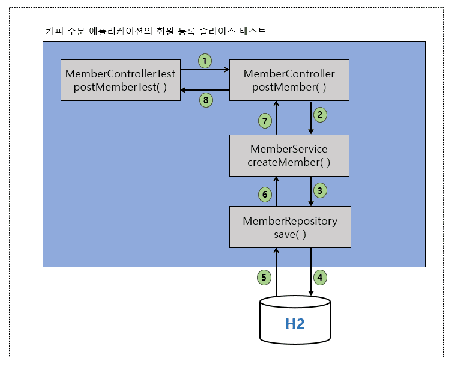
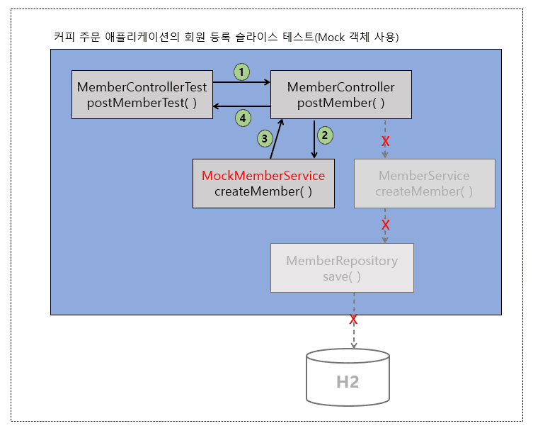
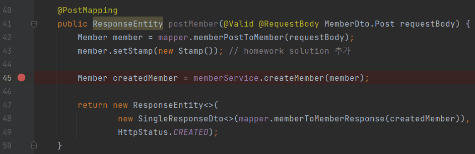
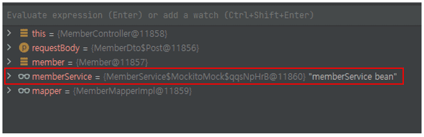

스프링 복습 및 정리 14.4P

<div class="cl1"></div>

## 테스트에서 Mock 객체를 사용하는 이유

Mock은 가짜 객체를 의미한다.

단위 테스트나 슬라이스 테스트 등에 Mock 객체를 사용하는 것을 Mocking이라고 한다.

<p align="center" style="margin: 84px 0 34px 0"></p>

위 그림은 Mock 객체를 사용하지 않은 슬라이스 테스트 프로세스이다.

MemberControllerTest 클래스는 슬라이스 테스트를 위해 작성한 테스트이지만 완전한 슬라이스 테스트라고 보기 힘들다.

<div class="cl3"></div>

위 그림을 보면 MemberController의 postMember() 핸들러 메서드 족만 테스트해야 되는데

서비스 계층을 거쳐서 데이터 액세스 계층 그리고 데이터베이스까지 그 동작 흐름이 끝까지

이어졌다가 되돌아오기 때문에 슬라이스 테스트라기보다는 통합 테스트에 가깝다.

<div class="cl3"></div>

슬라이스 테스트의 목적은 **해당 계층 영역에 대한 테스트에 집중하는 것**이다.

<div class="cl3"></div>

위 그림에서는 API 계층인 MemberController만 테스트하면 되는데 불필요한 전 계층을 다 거쳐야

되기 때문에 성능 면에서나 테스트 관심 영역 면에서나 슬라이스 테스트의 주목적에 맞지 않는다.

<div class="cl3"></div>

**“테스트의 단위는 가급적 작을수록 좋다.”** 이 문장을 기억하자.

<div class="cl3"></div>

Mock 객체를 사용하면 위 MemberController에 진정한 슬라이스 테스트를 적용할 수 있다.

<p align="center" style="margin: 64px 0 34px 0"></p>

위 그림은 Mock 객체를 사용한 슬라이스 테스트 프로세스이다.

<div class="cl3"></div>

위 그림에서는 MemberController에서 MemberService 클래스의 createMember()를 호출하지 않고,

MockMemberService 클래스의 createMember()를 호출하고 있다.

<div class="cl3"></div>

MemberService 클래스에 접근을 했다면 데이터베이스에서 데이터를 조회하는 과정을 거쳤을 텐데,

Mock 객체를 이용함으로써 다른 계층과 단절되어 불필요한 과정을 줄일 수 있다.

<div class="cl1"></div>

## Mockito

Mock 객체로 Mocking을 할 수 있게 해주는 여러 오픈 소스 라이브러리가 있지만 그중에서 가장 많이 사용되고,

Spring framework 자체적으로도 지원하고 있는 Mocking 라이브러리는 바로 Mockito이다.

<div class="cl3"></div>

Mockito는 Mock 객체를 생성하고, 해당 Mock 객체가 진짜처럼 동작하게 하는 역할을 담당한다.

<div class="cl3"></div>

Mockito의 Mocking 기능을 이용해서 테스트하고자 하는 대상에서

다른 영역(다른 계층 또는 외부 통신이 필요한 서비스 등)을 단절시켜 오로지 테스트 대상에만 집중할 수 있다.

<div class="cl2"></div>

### 슬라이스 테스트에 Mockito 적용

**MemberController의 postMember() 테스트에 Mockito 적용**

```java
import static org.mockito.BDDMockito.given;
import static org.springframework.test.web.servlet.request.MockMvcRequestBuilders.post;
import static org.springframework.test.web.servlet.result.MockMvcResultMatchers.header;
import static org.springframework.test.web.servlet.result.MockMvcResultMatchers.status;
import static org.hamcrest.Matchers.is;
import static org.hamcrest.Matchers.startsWith;

@SpringBootTest
@AutoConfigureMockMvc
public class MemberControllerMockTest {

    @Autowired
    private MockMvc mockMvc;

    @Autowired
    private Gson gson;

    // (1)
    @MockBean
    private MemberService memberService;

    // (2)
    @Autowired
    private MemberMapper mapper;

    @Test
    void postMemberTest() throws Exception {
        // given
        MemberDto.Post post = new MemberDto.Post("abc@gmail.com", "demuu", "010-1111-2222");

        Member member = mapper.memberPostToMember(post); // (3)
        member.setMemberId(1L); // (4)

        // (5)
        given(memberService.createMember(Mockito.any(Member.class))).willReturn(member);
        String content = gson.toJson(post);

        // when
        ResultActions actions = mockMvc.perform(
                post("/v11/members")
                        .accept(MediaType.APPLICATION_JSON)
                        .contentType(MediaType.APPLICATION_JSON)
                        .content(content)
        );

        // then
        actions.andExpect(status().isCreated())
                .andExpect(header().string("Location", is(startsWith("/v11/members/"))));
    }
}
```

<div class="cl4"></div>

위 코드는 이전 포스트에서 Mockito 없이 MemberController의 postMember() 핸들러 메서드를

테스트했던 테스트 케이스에 Mockito를 적용했다.

<div class="cl4"></div>
---
<div class="cl4"></div>

@MockBean 어노테이션은 Application Context에 등록되어 있는

Bean에 대한 Mockito Mock 객체를 생성하고 주입해 주는 역할을 한다.

<div class="cl4"></div>

(1)과 같이 @MockBean 어노테이션을 필드에 추가하면 해당 필드의 Bean에 대한 Mock 객체를 생성한 후, 필드에 주입(DI)한다.

(1)에서는 MemberService 빈에 대한 Mock 객체를 생성해서 memberService 필드에 주입한다.

<div class="cl4"></div>
---
<div class="cl4"></div>

(2)에서 MemberMapper를 DI 받는 이유는 MockMemberService(가칭)의 createMember()에서

리턴하는 Member 객체를 생성하기 위함이다.

<div class="cl4"></div>
---
<div class="cl4"></div>

(3)에서 MemberMapper를 이용해 post(MemberDto.Post 타입) 변수를 Member 객체로 변환하고 있다.

<div class="cl4"></div>

MemberMapper를 굳이 사용하지 않고 new Member()와 같이 Member 객체를 생성해도 되지만

여기서는 post 변수를 재사용하기 위해 MemberMapper로 변환을 했다.

<div class="cl4"></div>
---
<div class="cl4"></div>

실제 createMember()의 리턴 값(Member 객체)에는 memberId가 포함이 되는데

이 memberId는 response의 Location header에 포함이 되어야 하므로

(4)와 같이 mockMemberService의 createMember()에서도 memberId를 리턴해 줄 수 있도록 memberId를 추가해 준다.

<div class="cl4"></div>
---
<div class="cl4"></div>

(5)는 Mockito에서 지원하는 Stubbing 메서드이다.

<div class="cl4"></div>

**`given(memberService.createMember(Mockito.any(Member.class)))`**

given()은 Mock 객체가 특정 값을 리턴하는 동작을 지정하는 데 사용하며,

Mockito에서 지원하는 when()과 동일한 기능을 한다.

<div class="cl4"></div>

여기서는 Mock 객체인 memberService 객체로 createMember() 메서드를 호출하도록 정의하고 있다.

<div class="cl4"></div>

createMember()의 파라미터인 `Mockito.any(Member.class)`는 mockito에서 지원하는 변수 타입 중 하나이다.

MockMemberService가 아닌 실제 MemberService 클래스에서 createMember()의 파라미터 타입은 바로 Member 타입이다.

따라서 Mockito.any()에 Member.class를 타입으로 지정해 주었다.

<div class="cl3"></div>

**`.willreturn(member)`**

MockMemberService의 createMember() 메서드가 리턴할 Stub 데이터이다.

<div class="cl3"></div>

<div class="callout">
   <div class="callout-in">
       <strong>Stubbing이란?</strong>
       <p>Stubbing은 테스트를 위해서 Mock 객체가 항상 일정한 동작을 하도록 지정하는 것을 의미한다.</p>
       <p>위 코드의 (5)에서는 MockMemberService의 createMember() 메서드가 항상 동일한 member 객체를 리턴하고 있다.</p>
   </div>
</div>

<div class="cl2"></div>

이제 MembercontrollerMockTest 클래스의 postMemberTest()를 실행해 보겠다

```jsx
...
...
2022-07-08 20:29:29.258  INFO 19036 --- [ionShutdownHook] j.LocalContainerEntityManagerFactoryBean : Closing JPA EntityManagerFactory for persistence unit 'default'
2022-07-08 20:29:29.261  INFO 19036 --- [ionShutdownHook] com.zaxxer.hikari.HikariDataSource       : HikariPool-1 - Shutdown initiated...
2022-07-08 20:29:29.266  INFO 19036 --- [ionShutdownHook] com.zaxxer.hikari.HikariDataSource       : HikariPool-1 - Shutdown completed.
BUILD SUCCESSFUL in 15s

// 실제 MemberService의 createMember()가 호출되면 Member, Stamp 등록 등의 insert query 문이 출력되지만
// MockMemberService(가칭)의 createMember()가 호출되므로 Member 등록에 대한 쿼리가 출력되지 않음.
```

<div class="cl4"></div>

실행 결과를 보면, MockMemberService의 createMember() 메서드가 호출되므로,

데이터 액세스 계층 쪽의 로직은 실행이 되지 않는다.

<div class="cl3"></div>

즉, MockMemberService 클래스는 우리가 테스트하고자 하는 Controller의 테스트에 집중할 수 있도록

다른 계층과의 연동을 끊어주는 역할을 하는 것이다.

<div class="cl3"></div>

MemberService의 클래스 쪽의 createMember()가 호출되지 않고,

Mockito가 생성한 MockMemberService의 createMember()가 호출되는지 확인하고 싶다면 아래와 같이 하면 된다.

<div class="cl3"></div>

1. MemberService의 createMember() 메서드 내에 디버깅 용 breakpoint를 추가해서 <br> MemberControllerMockTest 클래스의 실행이 breakpoint에서 멈추는지 확인한다. <br> <br> 멈추지 않고, 정상적으로 실행이 된다면 MockMemberService쪽의 로직이 실행된다고 유추할 수 있다. <br> <br> <br> <br> <br>

2. MemberController의 postMember() 핸들러 메서드 내에서 아래 그림처럼 breakpoint를 추가해 본다.

<p align="center" style="margin: 34px 0 34px 0"></p>

MemberControllerMockTest 클래스를 디버그 모드로 실행하면 breakpoint에서 실행이 일시 중지된다.

이때, Debug 창을 확인해 보면 아래 그림과 같이 memberService 객체의 정체를 확인할 수 있다.

<p align="center" style="margin: 54px 0 34px 0"></p>

보다시피 Mockito의 Mock 객체이다.

<div class="cl1"></div>

**MemberService의 createMember() 테스트에 Mockito 적용**

MemberService 클래스의 createMember() 메서드는 비즈니스 로직이다.

일반적으로 비즈니스 로직은 데이터 액세스 계층과는 무관하게 서비스 계층에 구현된

비즈니스 로직 자체를 Spring Framework의 도움을 받지 않고도 빠르게 테스트를 진행할 수 있어야 한다.

<div class="cl4"></div>

```java
@Transactional
@Service
public class MemberService {
    private final MemberRepository memberRepository;
    private final ApplicationEventPublisher publisher;

    public MemberService(MemberRepository memberRepository,
                        ApplicationEventPublisher publisher) {
        this.memberRepository = memberRepository;
        this.publisher = publisher;

    }

    public Member createMember(Member member) {
        verifyExistsEmail(member.getEmail()); // (1)
        Member savedMember = memberRepository.save(member);

        publisher.publishEvent(new MemberRegistrationApplicationEvent(this, savedMember));
        return savedMember;
    }

    ...
    ...

    private void verifyExistsEmail(String email) {
        Optional<Member> member = memberRepository.findByEmail(email); // (2)

        // (3)
        if (member.isPresent())
            throw new BusinessLogicException(ExceptionCode.MEMBER_EXISTS);
    }
}
```

<div class="cl4"></div>

위 코드는 테스트를 진행할 MemberService 클래스 코드의 일부이다.

<div class="cl3"></div>

테스트하고자 하는 부분은 createMember() 메서드의 (1)과 같이 DB에 존재하는 이메일인지 여부를 검증하는

verifyExistsEmail() 메서드가 정상적인 동작을 수행하는지를 테스트하는 것이다.

<div class="cl3"></div>

그런데 verifyExistsEmail() 메서드의 내부를 보면 (2)와 같이 verifyExistsEmail() 메서드의 파라미터로전달받은

email을 조건으로 한 회원 정보가 있는지 `memberRepository.findByEmail(email)`을 통해서 DB에서 조회하고 있다.

<div class="cl3"></div>

하지만 verifyExistsEmail() 메서드가 DB에서 Member 객체를 잘 조회하는지 여부를 테스트하려는게 아니라,

어디서 조회해 왔든 상관없이 조회된 Member 객체가 null이 아니라면

BusinessLogicException을 잘 던지는지 여부만 테스트하면 된다.

> (3)과 같이 단 두 줄짜리 코드이더라도 member 객체 null 여부를 판단하는 것 역시 비즈니스 로직이라고 볼 수 있다.

<div class="cl3"></div>

따라서 DB에서 회원 정보를 조회하는 (2)의 `memberRepository.findByEmail(email)`은 Mocking의 대상이 된다.

<div class="cl3"></div>

```java
import static org.junit.jupiter.api.Assertions.assertThrows;
import static org.mockito.BDDMockito.given;

// (1)
@ExtendWith(MockitoExtension.class)
public class MemberServiceMockTest {

    @Mock // (2)
    private MemberRepository memberRepository;

    @InjectMocks // (3)
    private MemberService memberService;

    @Test
    public void createMemberTest() {
        // given
        Member member = new Member("abc@gmail.com", "demuu", "010-1111-2222");

        // (4)
        given(memberRepository.findByEmail(Mockito.anyString())).willReturn(Optional.of(member)); // (5)

        // when / then (6)
        assertThrows(BusinessLogicException.class, () -> memberService.createMember(member));
    }
}
```

<div class="cl4"></div>

위 코드는 MemberService의 createMember()를 테스트하는 MemberServiceMockTest 클래스이다.

<div class="cl3"></div>

Spring을 사용하지 않고, JUnit에서 Mockito의 기능을 사용하기 위해서는

(1)과 같이 `@ExtendWith(MockitoExtension.class)`를 추가해야 한다.

<div class="cl3"></div>

(2)와 같이 @Mock 어노테이션을 추가하면 해당 필드의 객체를 Mock 객체로 생성한다.

<div class="cl3"></div>

그리고 (3)과 같이 @InjectMocks 어노테이션을 추가한 필드에 (2)에서 생성한 Mock 객체를 주입해 준다.

즉, (3)의 memberService 객체는 주입받은 memberRepository Mock 객체를 포함하고 있다.

<div class="cl3"></div>

(4)에서는 (2)에서 생성한 memberRepository Mock 객체로 Stubbing을 하고 있다.

`memberRepository.findByEmail(Mockito.anyString())`의 리턴 값으로 (5)와 같이

`Optional.of(member)`를 지정했기 때문에 테스트 케이스를 실행하면 결과는 passed이다.

<div class="cl3"></div>

`Optional.of(member)`의 member 객체에 포함된 이메일 주소가 memberService.createMember(member)에서

파라미터로 전달한 member 객체에 포함된 이메일 주소와 동일하기 때문에 검증 결과가 passed이다.

<div class="cl1"></div>

## 실습

```java
import static com.codestates.member.entity.Member.MemberStatus.MEMBER_ACTIVE;
import static com.codestates.member.entity.Member.MemberStatus.MEMBER_SLEEP;
import static org.mockito.BDDMockito.given;
import static org.mockito.Mockito.doNothing;
import static org.springframework.test.web.servlet.request.MockMvcRequestBuilders.*;
import static org.springframework.test.web.servlet.result.MockMvcResultMatchers.*;

@Transactional
@SpringBootTest
@AutoConfigureMockMvc
public class MemberControllerHomeworkTest {
    @Autowired
    private MockMvc mockMvc;

    @Autowired
    private Gson gson;

    @MockBean
    private MemberService memberService;

    @Autowired
    private MemberMapper mapper;

    @Test
    void patchMemberTest() throws Exception {
        MemberDto.Patch patchDto = new MemberDto.Patch(1L, "demuu", "010-1111-1111", MEMBER_ACTIVE);
        Member patchMember = mapper.memberPatchToMember(patchDto);
        patchMember.setStamp(new Stamp());

        given(memberService.updateMember(Mockito.any(Member.class))).willReturn(patchMember);
        String content = gson.toJson(patchDto);

        ResultActions actions = mockMvc.perform(
                patch("/v11/members/" + patchDto.getMemberId())
                        .contentType(MediaType.APPLICATION_JSON)
                        .content(content)
        );

        actions.andExpect(status().isOk())
                .andExpect(jsonPath("$.data.name").value(patchDto.getName()))
                .andExpect(jsonPath("$.data.phone").value(patchDto.getPhone()));
    }

    @Test
    void getMemberTest() throws Exception {
        Member member = new Member("abc@gmail.com", "demuu", "010-1111-1111");
        member.setMemberId(1L);
        member.setMemberStatus(MEMBER_ACTIVE);
        member.setStamp(new Stamp());

        given(memberService.findMember(Mockito.anyLong())).willReturn(member);

        mockMvc.perform(
                get("/v11/members/" + member.getMemberId())
                        .accept(MediaType.APPLICATION_JSON)
                        .contentType(MediaType.APPLICATION_JSON)
        ).andExpect(status().isOk())
                .andExpect(jsonPath("$.data.name").value(member.getName()))
                .andExpect(jsonPath("$.data.phone").value(member.getPhone()))
                .andExpect(jsonPath("$.data.email").value(member.getEmail()));
    }

    @Test
    void getMembersTest() throws Exception {
        Member member1 = new Member("abc@gmail.com", "demuu", "010-1111-1111");
        member1.setMemberId(1L);
        member1.setMemberStatus(MEMBER_ACTIVE);
        member1.setStamp(new Stamp());

        Member member2 = new Member("def@gmail.com", "demung", "010-2222-2222");
        member2.setMemberId(2L);
        member2.setMemberStatus(MEMBER_SLEEP);
        member2.setStamp(new Stamp());

        List<Member> memberList = new ArrayList<>();
        memberList.add(member1);
        memberList.add(member2);

        given(memberService.findMembers(Mockito.anyInt(), Mockito.anyInt())).willReturn(new PageImpl<>(memberList));

        mockMvc.perform(
                get("/v11/members")
                        .accept(MediaType.APPLICATION_JSON)
                        .param("page", String.valueOf(1))
                        .param("size", String.valueOf(3))
        ).andExpect(status().isOk())
                .andExpect(jsonPath("$.data").isArray());
    }

    @Test
    void deleteMemberTest() throws Exception {
        Member member = new Member("abc@gmail.com", "demuu", "010-1111-1111");
        member.setMemberId(1L);
        member.setMemberStatus(MEMBER_ACTIVE);
        member.setStamp(new Stamp());

        doNothing().when(memberService).deleteMember(Mockito.anyLong());
        mockMvc.perform(delete("/v11/members/1")).andExpect(status().isNoContent());
    }
}
```
