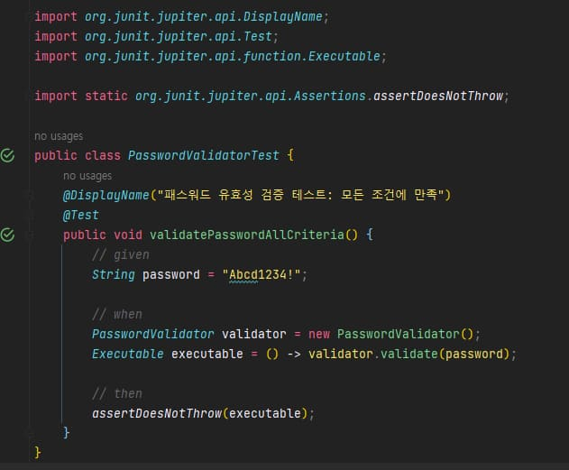

스프링 복습 및 정리 14.5P

<div class="cl1"></div>

## TDD(Test Driven Development)

DDD는 도메인 중심의 설계 기법이다.

도메인 모델이 애플리케이션 개발에 있어 핵심적인 역할을 하기 때문에 도메인 모델 없이는 애플리케이션도 있을 수 없다.

<div class="cl3"></div>

도메인 모델이 DDD의 중심에 서 있다면 **TDD에는 테스트가 그 중심에 서 있다.**

<div class="cl3"></div>

TDD는 테스트 주도 개발이다.

TDD의 개념을 한마디로 요약하자면 **테스트를 먼저 하고 구현은 그 다음에 한다**로 요약할 수 있다.

<div class="cl2"></div>

### TDD가 아닌 전통적인 개발 방식

애플리케이션을 개발할 때 개발 절차는 일반적으로 다음과 같다.

(서비스 제공 기업에서 불특정 다수의 회원에게 제공하는 서비스 애플리케이션을 가정)

<div class="cl4"></div>

1. 서비스 제작에 관여하는 이해 당사자가 모여 서비스에 대한 콘셉트와 해당 콘셉트에 따른 요구 사항을 지속적으로 수집한다. <br> <br>
2. 수집된 요구 사항에 맞춰 서비스 화면으로 제공하기 위한 UI를 설계하면서 구체적인 기능 요구 사항들을 정의한다. <br> <br>
3. 프론트엔드 개발자는 기능 요구 사항과 UI를 통해 프론트엔드 측 개발을 진행하고,<br>웹 디자이너는 화면을 디자인하며, 백엔드 개발자는 역시 기능 요구 사항에 맞춰 백엔드 애플리케이션을 디자인한다.

<div class="cl3"></div>

1,2,3번 중에서 일반적으로 3번의 과정을 진행하면서 요구 사항이 수정되기도 하고 그에 따라 UI가 변경되기도 하며,

프론트엔드와 백엔드 측 설계가 변경되는 경우가 많다.

<div class="cl3"></div>

<div class="callout">
   <div class="callout-in">
       <p>애자일 방식으로 1주 ~ 3주 단위로 기획, 설계, 구현을 반복적으로 빠르게 진행하면서</p>
       <p>애플리케이션을 완성하는 방식을 도입하는 기업도 많이 있다.</p>
   </div>
</div>

<div class="cl3"></div>

3번 과정에서 백엔드 개발자의 개발 흐름은 일반적으로 다음과 같다.

<div class="cl4"></div>

1. 이해 당사자들 간에 수집된 요구 사항과 설계된 화면등을 기반으로 도메인 모델을 도출한다. <br> <br>
2. 도출된 도메인 모델을 통해 클라이언트의 요청을 받아들이는 엔트포인트와 비즈니스 로직,<br>데이터 액세스를 위한 클래스와 인터페이스 등을 설계해서 큰 그림을 그린다. <br> <br>
3. 클래스 설계를 통해 애플리케이션에 대한 큰 그림을 그렸다면 클래스와 인터페이스의 큰 틀을 작성한다. <br> <br>
4. 클래스와 인터페이스의 큰 틀이 작성되었다면 클래스와 인터페이스 내에 메서드를 정의하면서<br>세부 동작을 고민하고, 코드로 구현한다. <br> <br>
5. 해당 메서드의 기능 구현이 끝났다면 구현한 기능이 잘 동작하는지 테스트한다. <br> <br>
6. 테스트에 문제가 발생한다면 구현한 코드를 디버깅하면서 문제의 원인을 찾는다.

<div class="cl3"></div>

위 백엔드 개발자의 개발 흐름 중, TDD 관점에서 두드러지는 점 한 가지는 3 ~ 6번의 과정에서 구현이 먼저고,

테스트가 나중이라는 점이다.

<div class="cl3"></div>

프론트엔드 개발자든 백엔드 개발자든 간에 애플리케이션 개발 흐름은 **선 구현, 후 테스트**가 일반적인 흐름이다.

<div class="cl3"></div>

구현도 하지 않았는데 테스트를 한다는 것 자체가 말이 안되는 상황이라고 생각되는 건 어쩌면 당연하다.

이처럼 말이 안 되는 걸 말이 되게 하는 개발 방식이 TDD이다.

<div class="cl2"></div>

### TDD 특성

회원 등록 시 입력하는 로그인 인증용 패스워드의 유효성을 검증하는 기능을 TDD 방식으로 개발해 보겠다.

<div class="cl3"></div>

먼저 구현할 패스워드 유효성 검증에 통과하는 조건은 다음과 같다.

- 패스워드 길이는 8 ~ 20 사이의 길이여야 한다.
- 패스워드는 알파벳 소문자 + 알파벳 대문자 + 숫자 + 특수 문자 형태로 구성되어야 한다.
- 알파벳 대/소문자와 숫자를 제외한 모든 문자는 특수문자라고 가정한다.

<div class="cl3"></div>

**테스트 클래스와 테스트 케이스 이름 정하기**

```java
public class PasswordValidatorTest {
    @DisplayName("패스워드 유효성 검증 테스트: 모든 조건에 만족")
    @Test
    public void validatePassword() {
        
    }
}
```

<div class="cl4"></div>

이 상태에서 테스트 케이스를 실행하면 구체적인 테스트 코드가 없기 때문에 실행 결과는 passed 이다.

<div class="cl2"></div>

**모든 유효성 검증 조건을 만족하는 테스트**

```java
import static org.junit.jupiter.api.Assertions.assertDoesNotThrow;

public class PasswordValidatorTest {
    @DisplayName("패스워드 유효성 검증 테스트: 모든 조건에 만족")
    @Test
    public void validatePasswordAllCriteria() {
        // given
        String password = "Abcd1234!";

        // when
        PasswordValidator validator = new PasswordValidator();
        Executable executable = () -> validator.validate(password);
        
        // then
        assertDoesNotThrow(executable);
    }
}
```

<div class="cl4"></div>

테스트 데이터는 패스워드 유효성 검증에 통과하는 문자열로 먼저 입력했다.

<div class="cl3"></div>

이렇게 하면 유효성 검증에 통과하지 못하는 실패한 테스트 케이스를 성공하는 테스트로

단계적으로 수정하기 때문에 모든 조건에 만족하기 위해 한꺼번에

너무 많은 기능을 구현하지 않고 점진적으로 수정해 갈 수 있다.

<div class="cl4"></div>

> ⭐ 모든 조건에 만족하는 테스트를 먼저 진행한 뒤에 조건에 만족하지 않는 테스트를<br>단계적으로 진행하면서 실패하는 테스트를 점진적으로 성공시켜 간다.

<div class="cl4"></div>

그런데 아직 존재하지 않는 PasswordValidator 클래스 때문에 컴파일 에러가 난다.

실행 결과가 공식적으로 failed가 뜨는 건 아니지만 컴파일 에러가 나므로 failed나 마찬가지이다.

<div class="cl2"></div>

**PasswordValidator 클래스 생성**

```java
public class PasswordValidator {
}
```

<div class="cl2"></div>

**PasswordValidator 클래스 validate() 메서드 생성**

```java
public class PasswordValidator {
    public void validate(String password) {
    }
}
```

<p align="center" style="margin: 64px 0 44px 0"></p>

이제 위 그림과 같이 모든 빨간 줄과 빨간색 표시가 사라졌다.

이 상태에서 테스트 케이스를 실행하면 passed를 볼 수 있다.

<div class="cl3"></div>

TDD의 개발 방식을 어렴풋이나마 짐작할 수 있을 것이다.

<div class="cl4"></div>

> ⭐ falied인 테스트 케이스를 지속적으로 그리고 단계적으로 수정하면서<br>테스트 케이스 실행 결과가 passed가 되도록 만들고 있다.

> ⭐ 지금껏 작성한 코드의 양은 많지 않다. 여기서 TDD의 또 하나의 특성을 알 수 있다.<br>TDD에서는 테스트가 passed될 만큼의 코드만 우선 작성한다.

<div class="cl2"></div>

**조건에서 특수 문자가 빠진 경우 테스트**

```java
public class PasswordValidatorTest {
    @DisplayName("모든 조건에 만족")
    @Test
    public void validatePasswordAllCriteria() {
        // given
        String password = "Abcd1234!";

        // when
        PasswordValidator validator = new PasswordValidator();
        Executable executable = () -> validator.validate(password);

        // then
        assertDoesNotThrow(executable);
    }

    @DisplayName("특수 문자 포함 여부 테스트")
    @Test
    public void validatePasswordWithoutSpecialCharacter() {
        // given
        String password = "Abcd1234";
        
        // when
        PasswordValidator validator = new PasswordValidator();
        Executable executable = () -> validator.validate(password);
        
        // then
        assertDoesNotThrow(executable);
    }
}
```

<div class="cl4"></div>

PasswordValidator 클래스에 패스워드를 검증하는 조건은 하나도 없기 때문에 실행 결과는 passed이다.

<div class="cl3"></div>

아래에서 PasswordValidator 클래스에 특수 문자를 포함하지 않는 경우만 예외를 던지도록 수정하겠다.

```java
public class PasswordValidator {
    public void validate(String password) {
        // (1)
        boolean containSpecialCharacter = 
                password.chars()
                        .anyMatch(ch -> !(Character.isDigit(ch) || Character.isAlphabetic(ch)));
        
        // (2)
        if (!containSpecialCharacter) throw new RuntimeException("Invalid password");
    }
}
```

<div class="cl4"></div>

위 코드에서는 (1)과 같이 특수 문자를 포함하고 있는지의 여부를 체크한 뒤에,

(2)에서 특수 문자를 포함하고 있지 않을 경우에만 예외를 던지도록 기능을 수정했다.

<div class="cl3"></div>

테스트를 다시 실행하면 특수 문자가 없기 때문에 failed가 된다.

<div class="cl2"></div>

**PasswordValidator 클래스 리팩토링**

다른 조건을 만족하는 로직이 추가되면 PasswordValidator 클래스의 유효성 검증 로직 코드가

깔끔하지 않아서 정규 표현식을 사용하여 패스워드 유효성 검사를 진행하도록 리팩토링 한다.

<div class="cl4"></div>

```java
public class PasswordValidator {
    public void validate(String password) {
        if (!Pattern.matches("(?=.*\\W)(?=\\S+$).+", password)) {
            throw new RuntimeException("Invalid password");
        }
    }
}
```

<div class="cl2"></div>

**테스트 테이터를 추가한 후 재검증**

수정된 코드가 잘 동작하는지 여부를 정확하게 테스트하기 위해서는

특수 문자를 포함하지 않은 패스워드를 한번 더 테스트해서 failed인지 확인하는 것이 좋다.

<div class="cl4"></div>

```java
public class PasswordValidatorTest {
    @DisplayName("모든 조건에 만족")
    @Test
    public void validatePasswordAllCriteria() {

		...

    @DisplayName("특수 문자 포함 여부 테스트")
    @Test
    public void validatePasswordWithoutSpecialCharacter() {
        // given
        String password1 = "Abcd1234!";
        String password2 = "Abcd1234";

        // when
        PasswordValidator validator = new PasswordValidator();
        Executable executable1 = () -> validator.validate(password1);
        Executable executable2 = () -> validator.validate(password2);

        // then
        assertDoesNotThrow(executable1);
        assertDoesNotThrow(executable2);
    }
}
```

<div class="cl4"></div>

테스트 결과는 failed이다.

특수 문자가 포함되지 않은 패스워드는 유효성 검증에서 실패한다는 것을 확실히 검증 할 수 있게 되었다.

<div class="cl3"></div>

이제 아래와 같이 유효한 패스워드인지를 검증하는 다음 조건에 대해 앞에서 특수 문자 포함 여부를 

검증한 방식과 마찬가지로 테스트와 검증, 리팩토링 단계를 반복해서 진행하면 된다.

<div class="cl4"></div>

- 특수문자 + 소문자를 포함하는지 테스트, 검증, 리팩토링 단계 반복
- 특수문자 + 소문자 + 대문자를 포함하는지 테스트, 검증, 리팩토링 단계 반복
- 특수문자 + 소문자 + 대문자 + 숫자를 포함하는지 테스트, 검증, 리팩토링 단계 반복
- 특수문자 + 소문자 + 대문자 + 숫자를 포함하면서 8 ~ 20 길이를 만족하는지 반복

<div class="cl3"></div>

이제 TDD의 개발 방식이 조금은 이해될 것이라 생각한다.

<div class="cl3"></div>

> TDD의 개발 방식은 **실패하는 테스트 → 실패하는 테스트를 성공할 만금의 기능 구현 →<br>성공하는 테스트 → 리팩토링 → 실패하는 테스트와 성공하는 테스트 확인** 이라는 흐름을 반복한다.

<div class="cl2"></div>

### TDD의 장단점

**장점**

- 테스트를 통과할 만큼의 기능을 구현하므로 한 번에 너무 많은 기능을 구현할 필요가 없다.
- 테스트의 코드가 추가되면서 검증하는 범위가 넓어질수록 구현도 점진적으로 완성되어 간다.
- 리팩토링 할 부분이 눈에 보이면 그때그때 리팩토링을 빠르게 진행하기 때문에 리팩토링의 비용이 상대적으로 적다.
- 항상 테스트 케이스가 존재하기 때문에 기존 코드를 수정하더라도 심리적 불안이 적다.
- 리팩토링을 통해 꾸준히 코드를 개선하므로 코드의 품질을 일정 부분 유지할 수 있다.
- 코드 수정 이후, 바로 테스트를 진행할 수 있으므로 코드 수정 결과를 빠르게 피드백받을 수 있다.

<div class="cl3"></div>

**단점**

- 가장 큰 단점은 TDD의 개발 방식이 익숙하지 않다.
- 테스트 코드의 작성에 익숙하지 않은 사람, 테스트 코드를 작성하길 원치 않는 사람들에게는 부정적인 방식일 수 있다.
- 팀 단위로 개발을 진행해야 하므로 팀원들 간 사전에 협의가 되어야 한다.

