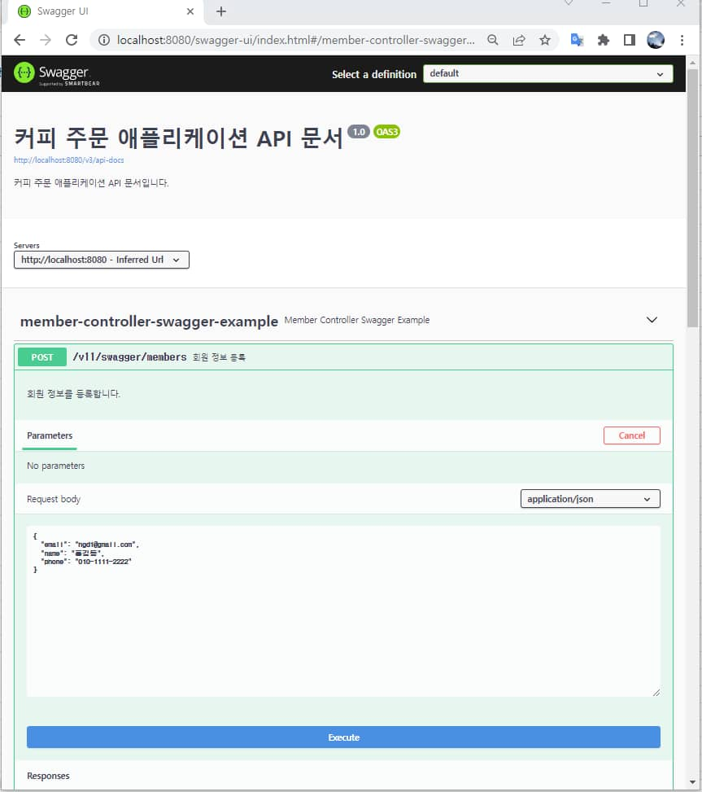
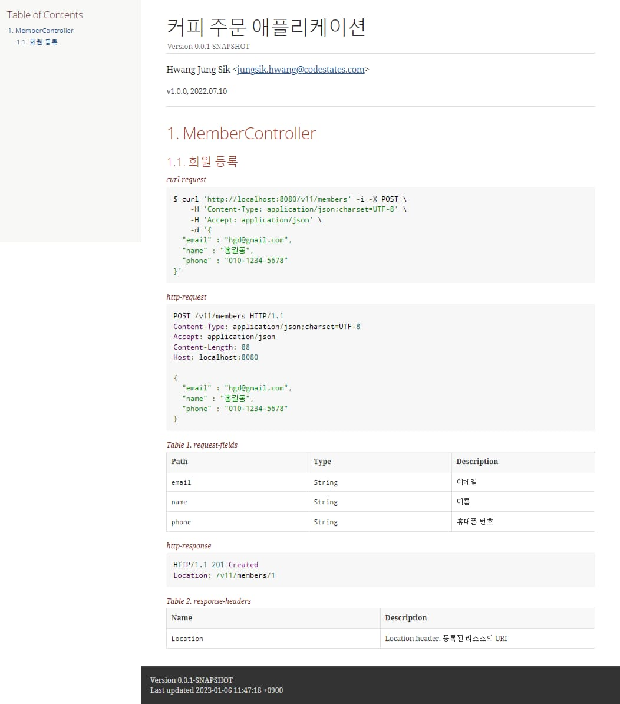
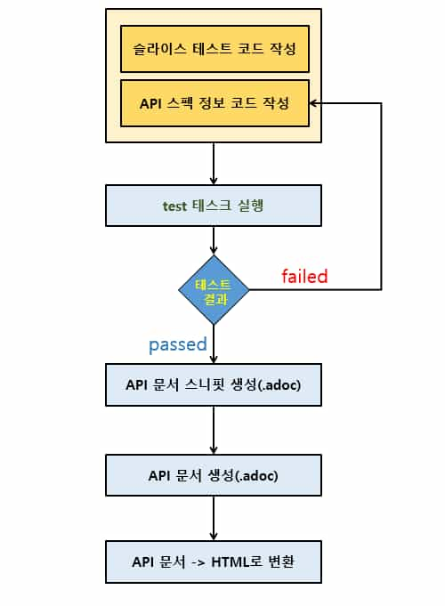
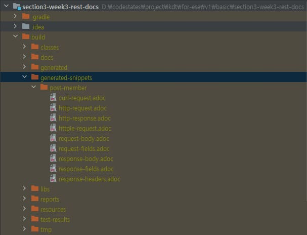
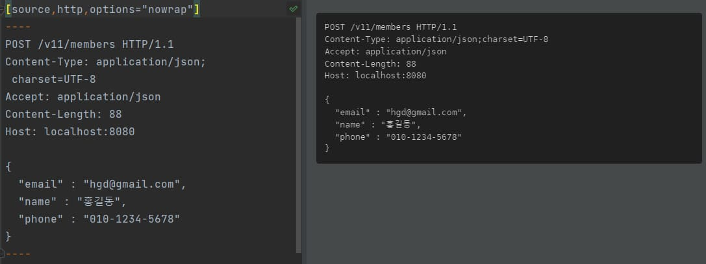

스프링 복습 및 정리 15P

<div class="cl1"></div>

## API 문서화

API 문서화란 클라이언트가 REST API 백엔드 애플리케이션에 요청을 전송하기 위해서

알아야 되는 요청 정보(URL . URI, request body, query parameter 등)를 문서로 잘 정리하는 것을 의미한다.

<div class="cl3"></div>

API 문서는 개발자가 요청 URL(URI) 등의 API 정보를 직접 수기로 작성할 수도 있고,

애플리케이션 빌드를 통해 API 문서를 자동 생성할 수도 있다.

<div class="cl2"></div>

### API 문서 생성의 자동화가 필요한 이유

REST API 기반의 백엔드 애플리케이션을 개발하고 있고,

프론트엔드 쪽을 담당하고 있는 개발자들이 애플리케이션의 API 정보를 문서로 제공해 줄 것을 요청했다고 가정해 보겠다.

<div class="cl3"></div>

어떤 프로젝트에 참여했을 때 애플리케이션 구현 단계 전/후로 문서 작업을 해야 되는 경우가 많다.

거기다 API 문서를 워드 프로세서나 노션, 에버노트 등의 문서를 이용해서

직접 수기로 작성한 후에 제공한다고 보면 너무나 비효율적이다.

<div class="cl3"></div>

또한 한번 작성된 API 문서에 기능이 추가되거나 수정되면 API 문서 역시 함께 수정되어야 하는데

아무래도 사람이 직업 하는 일이다 보니 깜빡하고 API 문서에 추가된 기능을 빠뜨릴 수도 있고,

클라이언트에게 제공된 API 정보와 수기로 작성한 API 문서의 정보가 다를 수도 있다.

> 실제로 클라이언트에게 제공한 API 문서와 백엔드 애플리케이션의 API 스펙 정보가 달라서 프론트엔드 쪽에서<br>API 문서를 기반으로 백엔드 애플리케이션 쪽에 요청을 전송했을 때 에러가 발생하는 경우가 빈번하다.

<div class="cl1"></div>

## Swagger VS Spring Rest Docs

### Swagger

Java 기반의 애플리케이션에서는 전통적으로 Swagger라는 API 문서 자동화 오픈 소스를 많이 사용해 왔다.

<div class="cl4"></div>

Swagger는 어떤 방식으로 API 문서를 자동으로 생성해 주는지 간단하게 살펴보겠다.

```java
@ApiOperation(value = "회원 정보 API", tags = {"Member Controller"}) // (1)
@RestController
@RequestMapping("/v11/swagger/members")
@Validated
@Slf4j
public class MemberControllerSwaggerExample {
    private final MemberService memberService;
    private final MemberMapper mapper;

    public MemberControllerSwaggerExample(MemberService memberService, MemberMapper mapper) {
        this.memberService = memberService;
        this.mapper = mapper;
    }

    // (2)
    @ApiOperation(value = "회원 정보 등록", notes = "회원 정보를 등록합니다.")

    // (3)
    @ApiResponses(value = {
            @ApiResponse(code = 201, message = "회원 등록 완료"),
            @ApiResponse(code = 404, message = "Member not found")
    })
    @PostMapping
    public ResponseEntity postMember(@Valid @RequestBody MemberDto.Post memberDto) {
        Member member = mapper.memberPostToMember(memberDto);
        member.setStamp(new Stamp()); // homework solution 추가

        Member createdMember = memberService.createMember(member);

        return new ResponseEntity<>(
                new SingleResponseDto<>(mapper.memberToMemberResponse(createdMember)),
                HttpStatus.CREATED);
    }

    ...
    ...

    // (4)
    @ApiOperation(value = "회원 정보 조회", notes = "회원 식별자(memberId)에 해당하는 회원을 조회합니다.")
    @GetMapping("/{member-id}")
    public ResponseEntity getMember(
            @ApiParam(name = "member-id", value = "회원 식별자", example = "1")  // (5)
            @PathVariable("member-id") @Positive long memberId) {
        Member member = memberService.findMember(memberId);
        return new ResponseEntity<>(
                new SingleResponseDto<>(mapper.memberToMemberResponse(member))
                                    , HttpStatus.OK);
    }

    ...
    ...
}
```

<div class="cl4"></div>

위 코드는 MemberController의 API 정보를 문서화하기 위해서 Swagger를 적용한 코드 일부이다.

<div class="cl3"></div>

Swagger를 사용하면 (1) ~ (5)와 같이 API 문서를 만들기 위한 많은 어노테이션들이 애플리케이션 코드에 추가되어야 한다.

<div class="cl3"></div>

애플리케이션 기능을 구현하기 위한 코드에 API 문서를 생성하기 위한 어노테이션이 추가되는 것은

코드의 간결함을 추구하는 개발자라면 무언가 불편한 구조로 보일 가능성이 높다.

<div class="cl3"></div>

```java
@ApiModel("Member Post")  // (1)
@Getter
public class MemberPostDto {
    // (2)
    @ApiModelProperty(notes = "회원 이메일", example = "hgd@gmail.com", required = true)
    @NotBlank
    @Email
    private String email;

    // (3)
    @ApiModelProperty(notes = "회원 이름", example = "홍길동", required = true)
    @NotBlank(message = "이름은 공백이 아니어야 합니다.")
    private String name;

    // (4)
    @ApiModelProperty(notes = "회원 휴대폰 번호", example = "010-1111-1111", required = true)
    @Pattern(regexp = "^010-\\d{3,4}-\\d{4}$",
            message = "휴대폰 번호는 010으로 시작하는 11자리 숫자와 '-'로 구성되어야 합니다.")
    private String phone;
}
```

<div class="cl4"></div>

Controller가 끝이 아니라 Request Body나 Response Body 같은 DTO 클래스에도 위 코드와 같이

Swagger의 어노테이션을 일일이 추가해 주어야 한다.

<div class="cl3"></div>

**Swagger 장점**

<p align="center" style="margin: 34px 0 34px 0"></p>

위 그림은 애플리케이션에 추가된 Swagger 어노테이션을 기반으로 만들어진 API 문서의 모습이다.

<div class="cl3"></div>

Postman에서 MemberController에 HTTP 요청을 전송하듯이

Execute 버튼을 누르면 MemberController에 요청을 전송할 수 있다.

<div class="cl3"></div>

Postman처럼 API 요청 툴로써의 기능을 사용할 수 있다는 것이 Swagger의 대표적인 장접이다.

<div class="cl2"></div>

### Spring Rest Docs

Spring Rest Docs의 Swagger와 가장 큰 차이점은 애플리케이션 기능 구현과 관련된 코드에는

API 문서 생성을 위한 어노테이션 같은 어떠한 정보도 추가되지 않는 것이다.

<div class="cl3"></div>

대신에 슬라이스 테스트를 위한 Controller의 테스트 클래스에 API 문서를 위한 정보가 추가된다.

<div class="cl3"></div>

```java
@WebMvcTest(MemberController.class)
@MockBean(JpaMetamodelMappingContext.class)
@AutoConfigureRestDocs
public class MemberControllerRestDocsTest {
    @Autowired
    private MockMvc mockMvc;

    @MockBean
    private MemberService memberService;

    @MockBean
    private MemberMapper mapper;

    @Autowired
    private Gson gson;

    @Test
    public void postMemberTest() throws Exception {
        // given
        MemberDto.Post post = new MemberDto.Post("hgd@gmail.com",
                "홍길동",
                "010-1234-5678");
        String content = gson.toJson(post);

        // willReturn()이 최소 null은 아니어야 한다.
        given(mapper.memberPostToMember(Mockito.any(MemberDto.Post.class)))
                .willReturn(new Member());

        Member mockResultMember = new Member();
        mockResultMember.setMemberId(1L);
        given(memberService.createMember(Mockito.any(Member.class))).willReturn(mockResultMember);

        // when
        ResultActions actions =
                mockMvc.perform(
                        post("/v11/members")
                                .accept(MediaType.APPLICATION_JSON)
                                .contentType(MediaType.APPLICATION_JSON)
                                .content(content)
                );

        // then
        actions
                .andExpect(status().isCreated())
                .andExpect(header().string("Location", is(startsWith("/v11/members/"))))
                .andDo(document("post-member",    // =========== (1) API 문서화 관련 코드 시작 ========
                        getRequestPreProcessor(),
                        getResponsePreProcessor(),
                        requestFields(
                                List.of(
                                        fieldWithPath("email").type(JsonFieldType.STRING).description("이메일"),
                                        fieldWithPath("name").type(JsonFieldType.STRING).description("이름"),
                                        fieldWithPath("phone").type(JsonFieldType.STRING).description("휴대폰 번호")
                                )
                        ),
                        responseHeaders(
                                headerWithName(HttpHeaders.LOCATION).description("Location header. 등록된 리소스의 URI")
                        )
                ));   // =========== (2) API 문서화 관련 코드 끝========
    }
}
```

<div class="cl4"></div>

위 코드는 Mockito 포스트에서 다뤘던 Controller의 테스트 코드에

Spring Rest Docs의 API 문서화 코드가 추가된 모습이다.

<div class="cl3"></div>

Spring Rest Docs를 사용한 API 문서화의 대표적인 장점은 테스트 케이스에서 전송하는 API 문서 정보와

Controller에서 구현한 Request Body, Response Body, Query Parameter 등의 정보가 하나라도

일치하지 않으면 테스트 케이스의 실행 결과가 failed 되면서 API 문서가 정상적으로 생성이 되지 않는다.

<div class="cl3"></div>

즉, 테스트 케이스의 실행 결과를 passed로 만들지 않으면 API 문서 생성이 완료되지 않는다.

<div class="cl3"></div>

이 말을 달리 표현하자면, 테스트 케이스의 실행 결과가 passed 이면 Controller에 정의되어 있는

Request Body나 Response Body 등의 API 스펙 정보와 일치하는 API 문서가 만들어진다는 것이다.

<div class="cl3"></div>

따라서 애플리케이션에 정의되어 있는 API 스펙 정보와 API 문서 정보의 불일치로 인해 발생하는 문제를 방지할 수 있다.

<div class="cl3"></div>

Swagger는 어노테이션 내에 API 스펙 정보를 문자열로 입력하는 경우가 많기 때문에

애플리케이션에 정의되어 있는 API 스펙 정보와 API 문서 내의 정보가 100% 일치한다는 보장을 할 수 없다.

<div class="cl3"></div>

Swagger처럼 API를 호출해볼 수 있는 툴의 역할은 하지 못하지만 API 문서 자체로써의 기능은 충분히 해준다고 볼 수 있다.

<div class="cl3"></div>

Spring Rest Docs의 대표적인 단점이라면 테스트 케이스를 일일이 작성해야 되고,

Conroller에 대한 모든 테스트 케이스를 passed로 만들어야 한다는 점이다.

<div class="cl3"></div>

마지막으로 아래는 Spring Rest Docs를 이용한 API 문서이다.

<p align="center" style="margin: 54px 0 34px 0"></p>

<div class="cl1"></div>

## Spring Rest Docs

위에서 언급했다시피 Spring Rest Docs는 REST API 문서를 자동으로 생성해 주는 Spring 하위 프로젝트이다.

<div class="cl3"></div>

Spring Rest Docs의 가장 큰 특징은 Controller의 슬라이스 테스트를 통해 테스트가 통과되어야지만

API 문서가 정상적으로 만들어진다는 것이다.

<div class="cl3"></div>

이러한 특징으로 인해 Spring Rest Docs는 테스트를 중요하게 생각하는 개발자들에게 각광받는 기술 중 하나이다.

<div class="cl2"></div>

### Spring Rest Docs의 API 문서 생성 흐름

<p align="center" style="margin: 34px 0 64px 0"></p>

**테스트 코드 작성**

- 슬라이스 테스트 코드 작성
    - Spring Rest Docs는 Controller의 슬라이스 테스트와 밀접한 관련이 있다.<br>Controller에 대한 슬라이스 테스트 코드를 먼저 작성한다.
<div class="cl4"></div>
- API 스펙 정보 코드 작성
    - 슬라이스 테스트 코드 다음에 Controller에 정의되어 있는<br>API 스펙 정보(Request Body, Response Body, Query Parameter 등)를 코드로 작성한다.
    
<div class="cl4"></div>
---
<div class="cl4"></div>

**test 태스크(task) 실행**

작성된 슬라이스 테스트 코드를 실행한다.

하나의 테스트 클래스를 실행시켜도 되지만 일반적으로 Gradle의 빌드 태스크 중 하나인

test task를 실행시켜서 API 문서 스니펫(snippet)을 일괄 생성한다.

<div class="cl3"></div>

테스트 실행 결과가 passed이면 다음 작업을 진행하고,

failed이면 문제를 해결하기 위해 테스트 케이스를 수정한 후, 다시 테스트를 진행해야 한다.

<div class="cl4"></div>
---
<div class="cl4"></div>

**API 문서 스니펫(.adoc file) 생성**

테스트 케이스의 테스트 실행 결과가 passed이면 테스트 코드에 포함된 API 스펙 정보 코드를 기반으로

API 문서 스니펫이 .adoc 확장자를 가진 파일로 생성된다.

> 스니펫(snippet)은 일반적으로 코드의 일부 조각을 의미하는 경우가 많은데 여기서는 문서의 일부 조각을 의미한다.<br>스니펫은 테스트 케이스 하나당 하나의 스니펫이 생성되며, 여러 개의 스니펫을 모아서 하나의 API 문서를 생성할 수 있다.

<div class="cl4"></div>
---
<div class="cl4"></div>

**API 문서 생성**

생성된 API 문서 스니펫을 모아서 하나의 API 문서로 생성한다.

<div class="cl4"></div>
---
<div class="cl4"></div>

**API 문서를 HTML로 변환**

생성된 API 문서를 HTML 파일로 변환한다.

HTML로 변환된 API 문서는 HTML 파일 자체를 공유할 수도 있고,

URL을 통해 해당 HTML에 접속해서 확인할 수 있다.

<div class="cl2"></div>

### Spring Rest Docs 설정

**build.gradle 설정**

```jsx
plugins {
  id 'org.springframework.boot' version '2.7.1'
  id 'io.spring.dependency-management' version '1.0.11.RELEASE'
  id "org.asciidoctor.jvm.convert" version "3.3.2"    // (1)
  id 'java'
}

group = 'com.codestates'
version = '0.0.1-SNAPSHOT'
sourceCompatibility = '11'

repositories {
  mavenCentral()
}

// (2)
ext {
  set('snippetsDir', file("build/generated-snippets"))
}

// (3)
configurations {
  asciidoctorExtensions
}

dependencies {
  // (4)
  testImplementation 'org.springframework.restdocs:spring-restdocs-mockmvc'
  
  // (5) 
  asciidoctorExtensions 'org.springframework.restdocs:spring-restdocs-asciidoctor'

  implementation 'org.springframework.boot:spring-boot-starter-data-jpa'
  implementation 'org.springframework.boot:spring-boot-starter-validation'
  implementation 'org.springframework.boot:spring-boot-starter-web'
  compileOnly 'org.projectlombok:lombok'
  runtimeOnly 'com.h2database:h2'
  annotationProcessor 'org.projectlombok:lombok'
  testImplementation 'org.springframework.boot:spring-boot-starter-test'
  implementation 'org.mapstruct:mapstruct:1.5.1.Final'
  annotationProcessor 'org.mapstruct:mapstruct-processor:1.5.1.Final'
  implementation 'org.springframework.boot:spring-boot-starter-mail'

  implementation 'com.google.code.gson:gson'
}

// (6)
tasks.named('test') {
  outputs.dir snippetsDir
  useJUnitPlatform()
}

// (7)
tasks.named('asciidoctor') {
  configurations "asciidoctorExtensions"
  inputs.dir snippetsDir
  dependsOn test
}

// (8)
task copyDocument(type: Copy) {
  dependsOn asciidoctor            // (8-1)
  from file("${asciidoctor.outputDir}")   // (8-2)
  into file("src/main/resources/static/docs")   // (8-3)
}

build {
  dependsOn copyDocument  // (9)
}

// (10)
bootJar {
  dependsOn copyDocument    // (10-1)
  from ("${asciidoctor.outputDir}") {  // (10-2)
    into 'static/docs'     // (10-3)
  }
}
```

<div class="cl4"></div>

(1)에서는 .adoc 파일 확장자를 가지는 AsciiDoc 문서를 생성해 주는 Asciidoctor를 사용하기 위한 플러그인을 추가한다.

<div class="cl3"></div>

(2)에서는 ext 변수의 set() 메서드를 이용해서 API 문서 스니펫이 생성될 경로를 지정한다.

<div class="cl3"></div>

(3)에서는 AsciiDoctor에서 사용되는 의존 그룹을 지정하고 있다.

:asciidoctor task가 실행되면 내부적으로 (3)에서 지정한 asciidoctorExtensions라는 그룹을 지정한다.

<div class="cl3"></div>

(4)에서 org.springframework.restdocs:spring-restdocs-mockmvc를 추가함으로써

spring-restdocs-core와 spring-restdocs-mockmvc 의존 라이브러리가 추가된다.

<div class="cl3"></div>

(5)에서 spring-restdocs-asciidoctor 의존 라이브러리를 추가한다.

(3)에서 지정한 asciidoctorExtensions 그룹에 의존 라이브러리가 포함이 된다.

<div class="cl3"></div>

(6)에서는 :test task 실행 시, API 문서 생성 스니펫 디렉토리 경로를 설정한다.

<div class="cl3"></div>

(7)에서는 :asciidoctor task 실행 시, Asciidoctor 기능을 사용하기 위해 :asciidoctor task에 asciidoctorExtensions을 설정한다.

<div class="cl3"></div>

(8)은 :build task 실행 전에 실행되는 task이다.

:copyDocument task가 수행되면 index.html 파일이 src/main/resources/static/docs에 copy 되며,

copy된 index.html 파일은 API 문서를 파일 형태로 외부에 제공하기 위한 용도로 사용할 수 있다.

<div class="cl4"></div>

(8-1)에서는 :asciidoctor task가 실행된 후에 task가 실행되도록 의존성을 설정한다.

(8-2)에서는 build/docs/asciidoc/ 경로에 생성되는 index.html을 copy한 후,

(8-3)의 src/main/resources/static/docs 경로에 index.html을 추가해 준다.

<div class="cl3"></div>

(9)에서는 :build task가 실행되기 전에 :copyDocument task가 먼저 수행되도록 한다.

<div class="cl3"></div>

(10)에서는 애플리케이션 실행 파일이 생성하는 :bootJar task 설정이다.

<div class="cl4"></div>

(10-1)에서는 :bootJar task 실행 전에 :copyDocument task가 실행되도록 의존성을 설정한다.

(10-2)와 (10-3)에서는 Asciidoctor 실행으로 생성되는 index.html파일을 jar 파일 안에 추가해 준다.

jar 파일에 index.html을 추가해 줌으로써 웹 브라우저에서 접속(localhost:8080/docs/index.html) 후, API 문서를 확인할 수 있다.

> (8)에서 copy되는 index.html은 외부에서 제공하기 위한 용도이고,<br>(10)에서는 index.html을 애플리케이션 실행 파일인 jar 파일에 포함해서 웹 브라우저에서 API 문서를 확인하기 위한 용도이다.

<div class="cl3"></div>

**API 문서 스니펫을 사용하기 위한 템플릿(또는 source 파일) 생성**

build.gradle에 API 문서 생성을 위한 설정이 완료되었으면 마지막으로 할 일은 API 문서 스니펫이

생성되었을 때 이 스니펫을 사용해서 최종 API 문서로 만들어 주는 템플릿 문서(index.adoc)를 생성하는 것이다.

<div class="cl4"></div>

- Gradle 기반 프로젝트에서는 아래 경로에 해당하는 디렉토릭를 생성해 주어야 한다.
    - src/docs/asciidoc/
    <div class="cl4"></div>
- 다음으로 src/docs/asciidoc/ 디렉토리 내에 비어있는 템플릿 문서(index.adoc)를 생성해 주면 된다.

<div class="cl2"></div>

### Spring Rest Docs 적용

**API 문서 생성을 위한 테스트 케이스 기본 구조**

```java
@WebMvcTest(MemberController.class)   // (1)
@MockBean(JpaMetamodelMappingContext.class)   // (2)
@AutoConfigureRestDocs    // (3)
public class MemberControllerRestDocsTest {
    @Autowired
    private MockMvc mockMvc;  // (4)

    @MockBean
	  // (5) 테스트 대상 Controller 클래스가 의존하는 객체를 Mock Bean 객체로 주입받기

    @Test
    public void postMemberTest() throws Exception {
        // given
        // (6) 테스트 데이터 

        // (7) Mock 객체를 이용한 Stubbing

        // when
        ResultActions actions =
                mockMvc.perform(
                     // (8) request 전송
                );

        // then
        actions
                .andExpect(// (9) response에 대한 기대 값 검증)
                .andDo(document(
                            // (10) API 문서 스펙 정보 추가
                 ));
    }
}
```

<div class="cl4"></div>

위 코드는 Spring Rest Docs를 이용해 API 문서를 생성하기 위한 테스트 케이스의 기본 구조이다.

<div class="cl3"></div>

(1)에서는 @SpringBootTest 어노테이션을 사용하지 않고, @WebMvcTest 어노테이션을 사용했다.

@WebMvcTest 어노테이션은 Controller를 테스트하기 위한 전용 어노테이션이다.

@WebMvcTest 어노테이션의 괄호 안에는 테스트 대상 Controller 클래스를 지정한다.

<div class="cl4"></div>
---
<div class="cl4"></div>

(2)는 JPA에서 사용하는 Bean 들을 Mock 객체로 주입해 주는 설정이다.

Spring Boot 기반의 테스트는 항상 최상위 패키지 경로에 있는 xxxxxxApplication 클래스를 찾아서 실행한다.

```java
@EnableJpaAuditing
@SpringBootApplication
public class Section3Week3RestDocsApplication {

  public static void main(String[] args) {
    SpringApplication.run(Section3Week3RestDocsApplication.class, args);
  }

}
```

<div class="cl4"></div>

<div class="callout">
   <div class="callout-in">
       <p>@EnableJpaAuditing을 xxxxxxApplication 클래스에 추가하게 되면 JPA와 관련된 Bean을 필요로 하기 때문에</p>
       <p>@WebMvcTest 어노테이션을 사용해서 테스트를 진행할 경우에는 (2)와 같이</p>
       <p>JpaMetamodelMappingContext를 Mock 객체로 주입해 주어야 한다.</p>
   </div>
</div>

<div class="cl4"></div>
---
<div class="cl4"></div>

(3)에서는 Spring Rest Docs에 대한 자동 구성을 위해 @AutoConfigureRestDocs를 추가해 준다.

<div class="cl4"></div>
---
<div class="cl4"></div>

(4)에서 MockMvc 객체를 주입받는다.

<div class="cl4"></div>
---
<div class="cl4"></div>

(5)에서는 Controller 클래스가 의존하는 객체(주로 서비스 클래스, Mapper)의 의존성을 제거하기 위해

@MockBean 어노테이션을 사용해서 Mock 객체를 주입받는다.

<div class="cl4"></div>
---
<div class="cl4"></div>

(6)에서는 HTTP request에 필요한 request body나 query parameter, path variable 등의 데이터를 추가한다.

<div class="cl4"></div>
---
<div class="cl4"></div>

(7)에서는 (5)에서 주입받은 Mock 객체가 동작하도록 Mockito에서 지원하는 given() 등의 메서드로 Stubbing 해 준다.

<div class="cl4"></div>
---
<div class="cl4"></div>

(8)에서는 MockMvc의 perform() 메서드로 request를 전송한다.

MockMvc의 perform() 메서드는 슬라이스 테스트에서 사용했던 방법과 동일하다.

<div class="cl4"></div>
---
<div class="cl4"></div>

(9)에서는 response를 검증한다.

ResultActions의 .andExpect() 역시 슬라이스 테스트에서 사용했던 방법과 동일하게 검증을 진행하면 된다.

<div class="cl4"></div>
---
<div class="cl4"></div>

(10)에서 테스트 수행 이후, API 문서를 자동 생성하기 위한 해당 Controller 핸들러 메서드의

API 스펙 정보를 document(…)에 추가해 준다.

document(…) 메서드는 API 문서를 생성하기 위해 Spring Rest Docs에서 지원하는 메서드이다.

.andDo(…) 메서드는 andExpect()처럼 어떤 검증 작업을 하는 것이 아니라 일반적인 동작을 정의하고자 할 때 사용된다.

<div class="cl3"></div>

<div class="callout">
   <div class="callout-in">
       <strong>@SpringBootTest VS @WebMvcTest</strong>
       <div class="cl3"></div>
       <p>@SpringBootTest 어노테이션은 @AutoConfigureMockMvc와 함께 사용되어 Controller를 테스트할 수 있는데,</p>
       <p>프로젝트에서 사용하는 전체 Bean을 ApplicationContext에 등록하여 사용한다.</p>
       <p>한마디로 테스트 환경을 구성하는 것은 편리하긴 한데 실행 속도가 상대적으로 느리다.</p>
       <div class="cl4"></div>
       <p>@WebMvcTest 어노테이션의 경우 Controller 테스트에 필요한 Bean만</p>
       <p>ApplicationContext에 등록하기 때문에 실행 속도는 상대적으로 빠르다.</p>
       <div class="cl4"></div>
       <p>다만, Controller에서 의존하고 있는 객체가 있다면 해당 객체에 대해서</p>
       <p>Mock 객체를 사용하여 의존성을 일일이 제거해 주어야 한다.</p>
       <div class="cl4"></div>
       <p>결과적으로 @SpringBootTest는 데이터베이스까지 요청 프로세스가 이어지는 통합 테스트에 주로 사용되고,</p>
       <p>@WebMvcTest는 Controller를 위한 슬라이스 테스트에 주로 사용한다.</p>
   </div>
</div>

<div class="cl2"></div>

**API 문서 생성을 위한 API 스펙 정보 추가**

```java
import static com.codestates.util.ApiDocumentUtils.getRequestPreProcessor;
import static com.codestates.util.ApiDocumentUtils.getResponsePreProcessor;
import static org.hamcrest.Matchers.is;
import static org.hamcrest.Matchers.startsWith;
import static org.mockito.BDDMockito.given;
import static org.springframework.restdocs.headers.HeaderDocumentation.headerWithName;
import static org.springframework.restdocs.headers.HeaderDocumentation.responseHeaders;
import static org.springframework.restdocs.mockmvc.MockMvcRestDocumentation.document;
import static org.springframework.restdocs.mockmvc.RestDocumentationRequestBuilders.post;
import static org.springframework.restdocs.payload.PayloadDocumentation.*;
import static org.springframework.test.web.servlet.result.MockMvcResultMatchers.*;

@WebMvcTest(MemberController.class)
@MockBean(JpaMetamodelMappingContext.class)
@AutoConfigureRestDocs
public class MemberControllerRestDocsTest {
    @Autowired
    private MockMvc mockMvc;

    // (1)
    @MockBean
    private MemberService memberService;

    // (2)
    @MockBean
    private MemberMapper mapper;

    @Autowired
    private Gson gson;

    @Test
    public void postMemberTest() throws Exception {
        // (3) given
        MemberDto.Post post = new MemberDto.Post("hgd@gmail.com", "홍길동", "010-1234-5678");
        String content = gson.toJson(post);

        // (4)
        given(mapper.memberPostToMember(Mockito.any(MemberDto.Post.class))).willReturn(new Member());

        // (5)
        Member mockResultMember = new Member();
        mockResultMember.setMemberId(1L);
        given(memberService.createMember(Mockito.any(Member.class))).willReturn(mockResultMember);

        // (6) when
        ResultActions actions =
                mockMvc.perform(
                        post("/v11/members")
                                .accept(MediaType.APPLICATION_JSON)
                                .contentType(MediaType.APPLICATION_JSON)
                                .content(content)
                );

        // then
        actions
                .andExpect(status().isCreated())
                .andExpect(header().string("Location", is(startsWith("/v11/members/"))))
                .andDo(document(       // (7) 
                        "post-member",     // (7-1)
                        getRequestPreProcessor(),      // (7-2)
                        getResponsePreProcessor(),     // (7-3)
                        requestFields(             // (7-4)
                                List.of(
                                        fieldWithPath("email").type(JsonFieldType.STRING).description("이메일"), // (7-5)
                                        fieldWithPath("name").type(JsonFieldType.STRING).description("이름"),
                                        fieldWithPath("phone").type(JsonFieldType.STRING).description("휴대폰 번호")
                                )
                        ),
                        responseHeaders(        // (7-6)
                                headerWithName(HttpHeaders.LOCATION).description("Location header. 등록된 리소스의 URI")
                        )
                ));
    }
}
```

<div class="cl4"></div>

위 코드는 MemberController 클래스의 postMember() 핸들러 메서드에 대한 API 스펙 정보를 추가하기 위한 테스트 케이스이다.

<div class="cl3"></div>

MemberController 클래스의 코드를 확인해 보면 MemberService 클래스와 MemberMapper를 핸들러 메서드 안에서 사용하고 있다.

즉, 위 코드의 테스트 케이스가 MemberController의 postMember() 핸들러 메서드에 요청을 전송하면

MemberMapper를 이용해 MemberDto.Post 객체와 Member 객체 간의 실제 매핑 작업을 진행한다.

<div class="cl3"></div>

또한 MemberService 객체를 통해 createMember() 메서드를 호출함으로써

실제 비즈니스 로직을 수행하고 데이터 액세스 계층의 코드까지 호출할 것이다.

<div class="cl3"></div>

**우리에게 필요한 핵심 관심사는 MemberController가 요청을 잘 전달받고, 응답을 잘 전송하며**

**요청과 응답이 정상적으로 수행되면 API 문서 스펙 정보를 잘 읽어 들여서 적절한 문서를 잘 생성하느냐 하는 것이다.**

<div class="cl3"></div>

따라서 MemberController가 MemberService와 MemberMapper의 메서드를 호출하지 않도록 관계를 단절시킬 필요가 있다.

<div class="cl3"></div>

MemberController가 의존하는 객체와의 관계를 단절하기 위해

(1)과 (2)에서 MemberService와 MemberMapper의 Mock Bean을 주입받는다.

<div class="cl3"></div>

두 Mock 객체는 테스트 케이스에서 가짜 메서드를 호출하는 데 사용된다(Stubbing).

<div class="cl4"></div>
---
<div class="cl4"></div>

(3)은 postMember() 핸들러 메서드에 전송하는 request body이다.

<div class="cl4"></div>
---
<div class="cl4"></div>

(4), (5)는 Mockito 포스트에서 다뤘던 내용이다.

MemberController의 postMember()에서 의존하는 객체의 메서드 호출을 (1)과 (2)에서

주입받은 Mock 객체를 사용해서 Stubbing하고 있다.

<div class="cl4"></div>
---
<div class="cl4"></div>

(6)은 Controller 슬라이스 테스트 챕터에서 학습했던 내용이다.

MockMvc의 perform() 메서드로 POST 요청을 전송하고 있다.

<div class="cl4"></div>
---
<div class="cl4"></div>

**(7)의 document(…) 메서드가 API 문서를 생성하기 위해서 알아야 될 내용이다.**

<div class="cl3"></div>

(7)의 document(…) 메서드는 API 스펙 정보를 전달받아서 실질적인 문서화 작업을 수행하는

RestDocumentationResultHandler 클래스에서 가장 핵심 기능을 하는 메서드이다.

<div class="cl3"></div>

document() 메서드의 첫 번째 파라미터인 (7-1)은 **API 문서 스니펫의 식별자 역할**을 하며,

(7-1)에서 post-member로 지정해씩 때문에 문서 스니펫은 post-member 디렉토리 하위에 생성된다.

<div class="cl3"></div>

(7-2)와 (7-3)은 문서 스니펫을 생성하기 전에 request와 response에 해당하는 문서 영역을

전처리하는 역할을 하는데 아래 코드와 같이 공통화한 후, 모든 테스트 케이스에서 재사용할 수 있도록 했다.

<div class="cl3"></div>

```java
import static org.springframework.restdocs.operation.preprocess.Preprocessors.*;

public interface ApiDocumentUtils {
  static OperationRequestPreprocessor getRequestPreProcessor() {
      return preprocessRequest(prettyPrint());
    }

    static OperationResponsePreprocessor getResponsePreProcessor() {
        return preprocessResponse(prettyPrint());
    }
}
```

<div class="cl4"></div>

- `preprocessRequest(prettyPrint())`는 문서에 표시되는 JSON 포맷의 request body를 예쁘게 표현해 준다.
- `preprocessResponse(prettyPrint())`는 문서에 표시되는 JSON 포맷의 response body를 예쁘게 표현해 준다.

<div class="cl3"></div>

(7-4)의 requestFields(…)는 문서로 표현될 request body를 의미하며, 파라미터로 전달되는

List<FieldDescriptor>의 원소인 FieldDescriptor 객체가 request body에 포함된 데이터를 표현한다.

<div class="cl3"></div>

(7-5)는 request body를 JSON 포맷으로 표현했을 때, 하나의 프로퍼티를 의미하는 FieldDescriptor이다.

type(JsonFieldType.STRING)은 JSON 프로퍼티의 값이 문자열임을 의미한다.

<div class="cl3"></div>

(7-6)의 responseHeaders(…)는 문서로 표현될 response header를 의미하며,

파라미터로 전달되는 HeaderDescriptor 객체가 response header를 표현한다.

- HttpHeaders.LOCATION : HTTP response의 Location header를 의미한다.

<div class="cl4"></div>
---
<div class="cl4"></div>

이제 테스트 케이스를 실행하고, 실행 결과가 passed이면 작성한 API 스펙 정보를 기반으로 문서 스니펫이 만들어질 것이다.

<p align="center" style="margin: 34px 0 34px 0"></p>

테스트 케이스 실행 후, 위 그림과 같이 문서 스니펫이 생성되었다.

<p align="center" style="margin: 34px 0 54px 0"></p>

위 그림은 생성된 문서 스니펫 중에서 http-request.adoc 파일을 오픈한 모습이다.

왼쪽은 http-request.adoc에 작성된 내용이며, 오른쪽은 Asciidoc 형태로 작성된 내용이 문서로 렌더링 된 모습이다.

<div class="cl3"></div>

이번에는 MemberController의 patchMember() 핸들러 메서드에 대한 API 스펙 정보를 테스트 케이스에 추가해 보겠다.

```java
@Test
public void patchMemberTest() throws Exception {
    // given
    long memberId = 1L;
    MemberDto.Patch patch = new MemberDto.Patch(memberId, "홍길동", "010-1111-1111", Member.MemberStatus.MEMBER_ACTIVE);
    String content = gson.toJson(patch);

    MemberDto.Response responseDto =
            new MemberDto.Response(1L,
                    "hgd@gmail.com",
                    "홍길동",
                    "010-1111-1111",
                    Member.MemberStatus.MEMBER_ACTIVE,
                    new Stamp());

    // willReturn()이 최소한 null은 아니어야 한다.
    given(mapper.memberPatchToMember(Mockito.any(MemberDto.Patch.class))).willReturn(new Member());

    given(memberService.updateMember(Mockito.any(Member.class))).willReturn(new Member());

    given(mapper.memberToMemberResponse(Mockito.any(Member.class))).willReturn(responseDto);

    // when
    ResultActions actions =
            mockMvc.perform(
                    patch("/v11/members/{member-id}", memberId)
                            .accept(MediaType.APPLICATION_JSON)
                            .contentType(MediaType.APPLICATION_JSON)
                            .content(content)
            );

    // then
    actions
            .andExpect(status().isOk())
            .andExpect(jsonPath("$.data.memberId").value(patch.getMemberId()))
            .andExpect(jsonPath("$.data.name").value(patch.getName()))
            .andExpect(jsonPath("$.data.phone").value(patch.getPhone()))
            .andExpect(jsonPath("$.data.memberStatus").value(patch.getMemberStatus().getStatus()))
            .andDo(document("patch-member",
                    getRequestPreProcessor(),
                    getResponsePreProcessor(),
                    pathParameters(              // (1)
                            parameterWithName("member-id").description("회원 식별자")
                    ),
                    requestFields(
                            List.of(
                                    fieldWithPath("memberId").type(JsonFieldType.NUMBER).description("회원 식별자").ignored(),    // (2)
                                    fieldWithPath("name").type(JsonFieldType.STRING).description("이름").optional(),    // (3)
                                    fieldWithPath("phone").type(JsonFieldType.STRING).description("휴대폰 번호").optional(),
                                    fieldWithPath("memberStatus").type(JsonFieldType.STRING).description("회원 상태: MEMBER_ACTIVE / MEMBER_SLEEP / MEMBER_QUIT").optional()
                            )
                    ),
                    responseFields(      // (4)
                            List.of(
                                    fieldWithPath("data").type(JsonFieldType.OBJECT).description("결과 데이터"),
                                    fieldWithPath("data.memberId").type(JsonFieldType.NUMBER).description("회원 식별자"),           // (5)
                                    fieldWithPath("data.email").type(JsonFieldType.STRING).description("이메일"),
                                    fieldWithPath("data.name").type(JsonFieldType.STRING).description("이름"),
                                    fieldWithPath("data.phone").type(JsonFieldType.STRING).description("휴대폰 번호"),
                                    fieldWithPath("data.memberStatus").type(JsonFieldType.STRING).description("회원 상태: 활동중 / 휴면 상태 / 탈퇴 상태"),
                                    fieldWithPath("data.stamp").type(JsonFieldType.NUMBER).description("스탬프 갯수")
                            )
                    )
            ));
}
```

<div class="cl4"></div>

postMember() 핸들러 메서드에 대한 테스트 케이스와 크게 달라진 건 없지만 몇 가지 추가된 부분이 있다.

<div class="cl3"></div>

(1)에서는 API 스펙 정보 중에서 URL의 path variable의 정보를 추가했다.

MemberController의 patchMember()와 getMember()는 /v11/members/{member-id}와 같은

요청 URL에 path variable이 있는 사실은 우리가 이미 잘 알고 있는 내용이다.

<div class="cl4"></div>
---
<div class="cl4"></div>

memberId의 경우, path variable 정보로 memberId를 전달받기 때문에

MemberDto.Patch DTO 클래스에서 request body에 매핑되지 않는 정보이다.

<div class="cl3"></div>

따라서 (2)와 같이 ignored()를 추가해서 API 스펙 정보에서 제외했다.

<div class="cl4"></div>
---
<div class="cl4"></div>

회원 정보는 모든 정보를 다 수정해야만 하는 것이 아니라 선택적으로 수정할 수 있어야 한다.

즉, 회원 이름, 휴대폰 번호, 회원 상태 중에서 수정하고 싶은 것만 선택적으로 수정할 수 있어야 하기 때문에

(3)과 같이 optional()을 추가해서 API 스펙 정보에서 필수가 아닌 선택 정보로 설정한다.

<div class="cl4"></div>
---
<div class="cl4"></div>

(4)의 responseFields(…)는 문서로 표현될 response body를 의미하며,

파라미터로 전달되는 List<FieldDescriptor>의 원소인 FieldDescriptor 객체가 response body에 포함된 데이터를 표현한다.

<div class="cl4"></div>

- JsonfieldType.OBJECT : JSON 포맷으로 표현된 프로퍼티의 값이 객체임을 의미한다.
- JsonfieldType.NUMBER : JSON 포맷으로 표현된 프로퍼티의 값이 int나 long 같은 Number임을 의미한다.

<div class="cl4"></div>
---
<div class="cl4"></div>

(5)에서 `fieldWithPath(”data,memberId”)`의 data.memberId는 data 프로퍼티의 하위 프로퍼티를 의미한다.

```java
{
    "data": {
        "memberId": 1, // data.memberId
        "email": "hgd@gmail.com",
        "name": "홍길동1",
        "phone": "010-1111-1111",
        "memberStatus": "활동중",
        "stamp": 0
    }
}
```

<div class="cl3"></div>
<div class="cl4"></div>

지금까지 Controller의 데스트 케이스에 API 스펙 정보를 추가해서 API 문서 스니펫을 생성해 보았다.

다음 포스트에서는 지금까지 생성한 API 문서 스니펫을 하나로 모아서 실제로 외부에 공개할 수 있는 API 문서를 만들어 보겠다.

