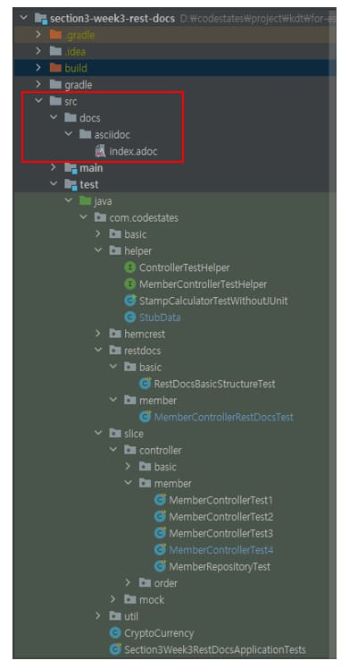
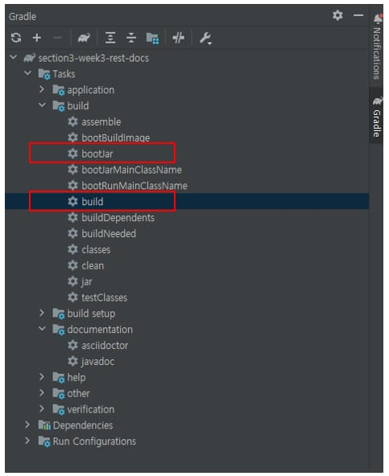
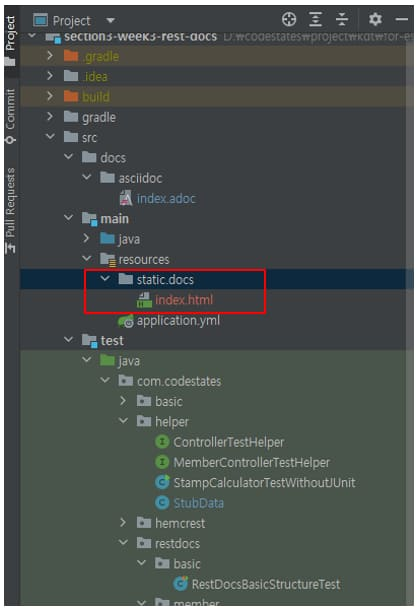
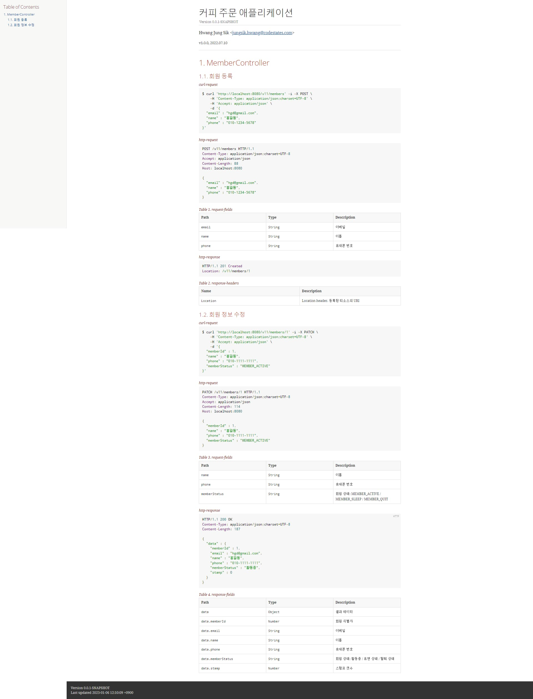
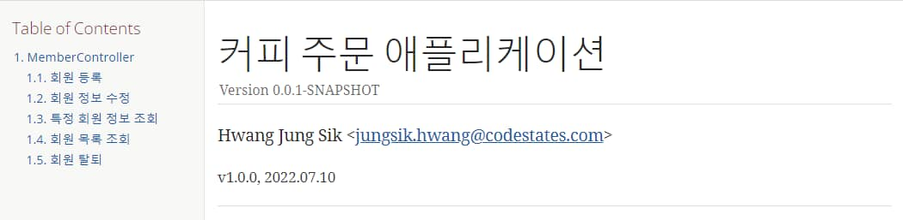
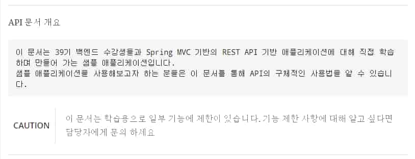

스프링 복습 및 정리 15.1P

<div class="cl1"></div>

## API 문서 생성

이 전 포스트에서는 Controller의 테스트를 위한 테스트 케이스에 API 스펙 정보를 추가해서 API 문서 스니펫을 생성했다.

<div class="cl3"></div>

이제 생성된 스니펫을 이용해서 실제로 외부에 제공할 수 있는 API 문서를 만들어 보도록 하겠다.

<div class="cl2"></div>

### 디렉토리 및 템플릿 문서 생성

지금까지 생성한 API 문서 스니펫은 문서 일부에 포함되는 조각 모음이다.

이 조각 모음을 제대로 된 문서로 만들기 위해서는 스니펫을 포함하는 템플릿 문서가 필요하다.

<p align="center" style="margin: 34px 0 34px 0"></p>

위 그림과 같이 src/docs/asciidoc 디렉토리를 생성하고 비어 있는 index.adoc 파일을 생성한다.

Gradle 프로젝트의 경우, 템플릿 문서가 위치하는 디폴트 경로가 src/docs/asciidoc 이다.

<div class="cl2"></div>

### 템플릿 문서 내용 추가

**index.adoc**

```jsx
= 커피 주문 애플리케이션    // (1)
:sectnums:
:toc: left                
:toclevels: 4
:toc-title: Table of Contents
:source-highlighter: prettify

Hwang Jung Sik <jungsik.hwang@codestates.com>   // (2)

v1.0.0, 2022.04.08    // (3)

// (4)
***
== MemberController
=== 회원 등록
.curl-request
include::{snippets}/post-member/curl-request.adoc[]     

.http-request
include::{snippets}/post-member/http-request.adoc[]

.request-fields
include::{snippets}/post-member/request-fields.adoc[]

.http-response
include::{snippets}/post-member/http-response.adoc[]

.response-headers
include::{snippets}/post-member/response-headers.adoc[]

=== 회원 정보 수정
.curl-request
include::{snippets}/patch-member/curl-request.adoc[]

.http-request
include::{snippets}/patch-member/http-request.adoc[]

.path-parameters
include::{snippets}/patch-member/path-parameters.adoc[]

.request-fields
include::{snippets}/patch-member/request-fields.adoc[]

.http-response
include::{snippets}/patch-member/http-response.adoc[]

.response-fields
include::{snippets}/patch-member/response-fields.adoc[]
```

<div class="cl4"></div>

위 코드는 Asciidoc 문법으로 작성된 템플릿 문서이다.

<div class="cl3"></div>

(1)은 API 문서의 제목이다.

<div class="cl4"></div>

(2)는 API 문서를 생성한 이의 정보이다.

<div class="cl4"></div>

(1)과 (2) 사이에 있는 항목은 API 문서의 목차와 관련된 내용이다.

<div class="cl4"></div>

(3)은 API 문서의 생성 날짜이다.

<div class="cl4"></div>

(4)부터 테스트 케이스 실행을 통해 생성한 API 문서 스니펫을 사용하는 부분이다.

템플릿 문서에서 스니펫을 사용하는 방법은 정해져 잇다.

`include::{snippets}/스니펫 문서가 위치한 디렉토리/스니펫 문서파일명.adoc[]`

마지막으로 Gradle의 :build 또는 :bootJar task 명령을 실행해서 index.adoc 파일을 index.html 파일로 변환하면 된다.

<div class="cl2"></div>

### 템플릿 문서를 HTML 파일로 변환

<p align="center" style="margin: 34px 0 34px 0"></p>

IntelliJ 우측 상단의 Gradle 탭을 클릭한 후, 위 그림과 같이 :bootJar 또는 :build task 명령을 더블 클릭한다.

<p align="center" style="margin: 34px 0 34px 0"></p>

task 명령이 실행되고 정상적으로 빌드가 종료되면 위 그림과 같이

src/main/resources/static/docs 티렉토리에 index.adoc 파일을 이용해 변환된 index.html 파일이 생성된다.

<div class="cl3"></div>

애플리케이션을 실행하고 `http://localhost:8080/docs/index.html` URL을 웹 브라우저에 입력한다.

<p align="center" style="margin: 34px 0 34px 0"></p>

위 그림과 같은 API 문서가 화면에 나올것이다.

<div class="cl1"></div>

## Asciidoc

Asciidoc은 Spring Rest Docs를 통해 생성되는 텍스트 기반 문서 포맷이다.

<div class="cl3"></div>

Asciidoc 포맷을 사용해서 메모, 문서, 기사, 서적, E-Book, 웹 페이지, 매뉴얼 페이지, 블로그 게시물 등을 작성할 수 있으며

Asciidoc 포맷으로 작성된 문서는 HTML, PDF, EPUB, 매뉴얼 페이지를 포함한 다양한 형식으로 변환될 수 있다.

<div class="cl3"></div>

또한 Asciidoc은 주로 기술 문서 작성을 위해 설계된 가벼운 마크업 언어이기도 하다.

<div class="cl3"></div>

Spring Rest Docs를 통해 만들어지는 문서 스니펫과 이 문서 스니펫을 사용하는

템플릿 문서는 Asciidoc 포맷의 문서로 이루어져 있기 때문에 우리가 제공하는 API 문서를 사용하는 이들이

직관적으로 API 문서를 이해할 수 있는 수준 정도의 Asciidoc 기본 문법은 알고 있는 것이 좋다.

<div class="cl2"></div>

### 목차 구성

```jsx
= 커피 주문 애플리케이션     // (1)
:sectnums:                  // (2)
:toc: left                  // (3)
:toclevels: 4               // (4)
:toc-title: Table of Contents   // (5)
:source-highlighter: prettify   // (6)

Hwang Jung Sik <jungsik.hwang@codestates.com>

v1.0.0, 2022.07.10
```

<div class="cl4"></div>

(1) 문서의 제목을 작성하기 위해서는 `=`를 추가하면 된다. `====`와 같이 `=`의 개수가 늘어날수록 글자는 작아진다.

<div class="cl4"></div>

(2) 목차에서 각 섹션에 넘버링을 해주기 위해서는 `:sectnums:`를 추가하면 된다.

<div class="cl4"></div>

(3) `:toc:`은 목차를 문서의 어느 위치에 구성할 것인지를 설정한다.

<div class="cl4"></div>

(4) `:toclevels:`는 목차에 표시할 제목의 level을 지정한다.

여기서는 4로 지정했기 때문에 `====` 까지의 제목만 목차에 표시된다.

<div class="cl4"></div>

(5) `:toc-title:`은 목차의 제목을 지정할 수 있다.

<div class="cl4"></div>

(6)`:source-highlighter:` 문서에 표시되는 소스 코드 하일라이터를 지정한다.

<p align="center" style="margin: 64px 0 34px 0"></p>

위 코드에서 작성된 문서는 위 그림과 같이 화면에 표시된다.

<div class="cl2"></div>

### 박스 문단 사용하기

```jsx
***  // (1)
API 문서 개요
 // (2)
 이 문서는 39기 백엔드 수강생들과 Spring MVC 기반의 REST API 기반 애플리케이션에 대해 직접 학습하며 만들어 가는 샘플 애플리케이션입니다.
 샘플 애플리케이션을 사용해보고자 하는 분들은 이 문서를 통해 API의 구체적인 사용법을 알 수 있습니다.

***
```

<div class="cl4"></div>

위 코드와 같이 API 문서에 박스 문단을 구성해서 API 문서에 대한 설명을 추가할 수 있다.

(1) *** 은 단락을 구분 지을 수 있는 수평선을 추가해 준다.

(2) 문단의 제목 다음에 한 라인을 띄우고 한 칸 들여 쓰기의 문단을 작성하면 박스 문단을 사용할 수 있다.

<p align="center" style="margin: 64px 0 34px 0"></p>

위 코드에서 작성된 문서는 위 그림과 같이 화면에 표시된다.

<div class="cl2"></div>

### 경고 문구 추가

```jsx
***
API 문서 개요

 이 문서는 39기 백엔드 수강생들과 Spring MVC 기반의 REST API 기반 애플리케이션에 대해 직접 학습하며 만들어 가는 샘플 애플리케이션입니다.
 샘플 애플리케이션을 사용해보고자 하는 분들은 이 문서를 통해 API의 구체적인 사용법을 알 수 있습니다.
// (1)
CAUTION: 이 문서는 학습용으로 일부 기능에 제한이 있습니다. 기능 제한 사항에 대해 알고 싶다면 담당자에게 문의 하세요

***
```

<div class="cl4"></div>

(1) `CAUTION:`을 사용해서 경고 문구를 추가할 수 있다.

이 외에 `NOTE:`, `TIP:`, `IMPORTANT:`, `WARNING:`등을 사용할 수 있다.

<p align="center" style="margin: 64px 0 34px 0"></p>

위 코드에서 작성된 경고 문구는 위 그림과 같이 화면에 표시된다.

<div class="cl2"></div>

### URL Scheme 자동 인식

다음과 같은 URL Scheme는 Asciidoc에서 자동으로 인식하여 링크가 설정된다.

- http
- https
- ftp
- irc
- mailto
- abc@gmail.com

<div class="cl2"></div>

### 이미지 추가

API 문서에 이미지를 추가하고 싶다면 아래의 코드와 같이 `image::`를 사용해서 추가할 수 있다.

```jsx
image::https://spring.io/images/spring-logo-9146a4d3298760c2e7e49595184e1975.svg[spring]
```

<div class="cl1"></div>

## Asciidoctor

Asciidoctor는 AsciiDoc 포맷의 문서를 파싱 해서 HTML 5, 매뉴얼 페이지, PDF 및 EPUB 3 등의 문서를 생성하는 툴이다.

<div class="cl3"></div>

<div class="callout">
   <div class="callout-in">
       <p>Spring Rest Docs에서는 Asciidoc 포맷의 문서를 HTML 파일로 변환하기 위해 내부적으로 Asciidoctor를 사용하고 있다.</p>
       <p>Asciidoctor의 구체적인 사용법을 알 필요는 없지만 Spring Rest Docs를 통해 생성되는 문서 스니펫을</p>
       <p>템플릿 문서에 포함해서 하나의 API 문서로 통합하는 방법 정도는 알고 있는 게 좋다.</p>
   </div>
</div>

<div class="cl2"></div>

### 문서 스니펫을 템플릿 문서에 포함시키기

이 전 포스트에서 테스트 케이스 실행을 통해 생성된 문서 스니펫을 템플릿 문서(index.adoc)에 포함(include) 시켰다.

이렇게 템플릿 문서에 포함된 스니펫은 애플리케이션 빌드 타임에 내부적으로 Asciidoctor가

index.adoc를 index.html로 변환 후, 특정 디렉토리(src/main/resources/static/docs)에 생성해 준다.

<div class="cl3"></div>

아래에서 Asciidoctor가 템플릿 문서 변환 작업을 수행하기 이 전 단계인 템플릿 문서에

스니펫을 포함하는 방법을 간단히 살펴보겠다.

<div class="cl3"></div>

**index.adoc 문서에 스니펫 포함 예**

```jsx
***
== MemberController
=== 회원 등록
.curl-request // (1)
include::{snippets}/post-member/http-request.adoc[] // (2)

.request-fields
include::{snippets}/post-member/request-fields.adoc[]

.http-response
include::{snippets}/post-member/http-response.adoc[]

.response-fields
include::{snippets}/post-member/response-fields.adoc[]

...
...
```

<div class="cl4"></div>

위 코드는 테스트 케이스 실행을 통해 생성된 스니펫을 포함하는 템플릿 문서의 일부이다.

<div class="cl3"></div>

(1)의 `.curl-request`에서 `.`은 하나의 스니펫 섹션 제목을 표현하기 위해 사용한다.

`curl-request`는 섹션의 제목이며, 원하는 대로 수정하면 된다.

<div class="cl3"></div>

(2)에서 `include`는 Asciidoctor에서 사용하는 매크로 중 하나이며,

스니펫을 템플릿 문서에 포함할 때 사용한다. `::`은 매크로를 사용하기 위한 표기법이다.

`{snippets}`는 해당 스니펫이 생성되는 디폴트 경로를 의미하며,

아래의 build.gradle 파일에 설정한 `snippetsDir`변수를 참조하는 데 사용할 수 있다.

<div class="cl3"></div>

**build.gradle**

```jsx
...
...

ext {
  set('snippetsDir', file("build/generated-snippets"))
}

...
...
```

