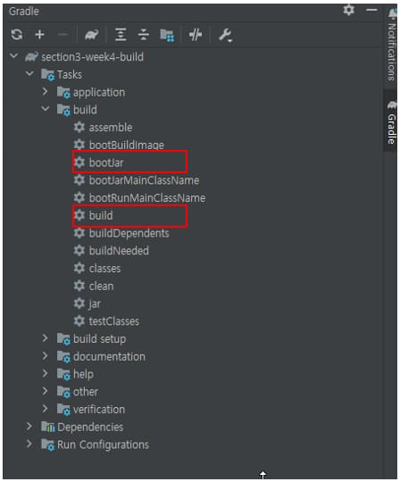
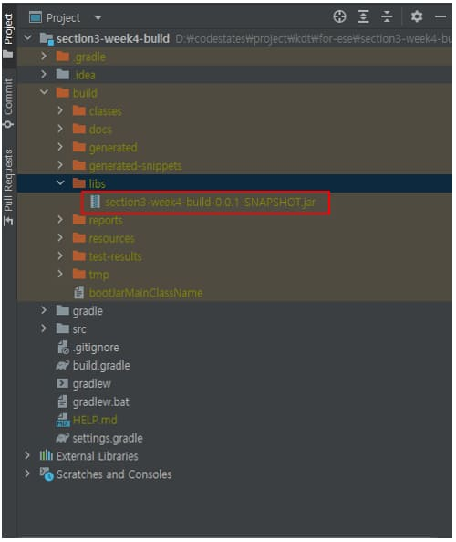
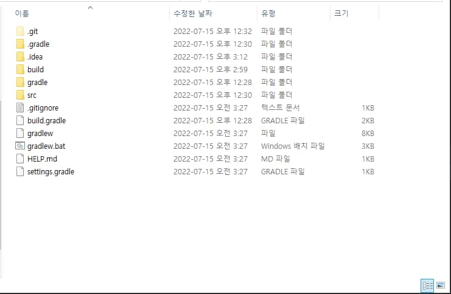
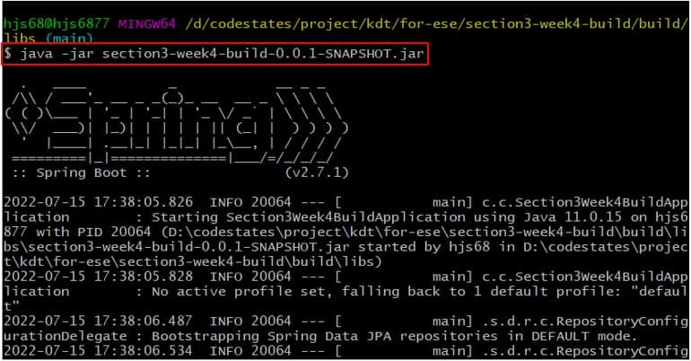
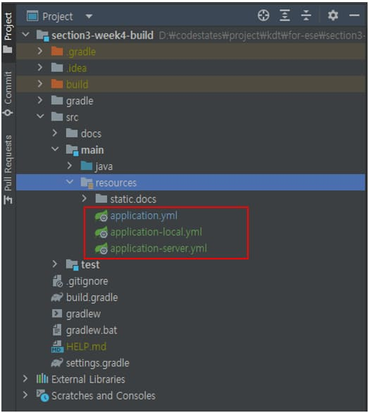
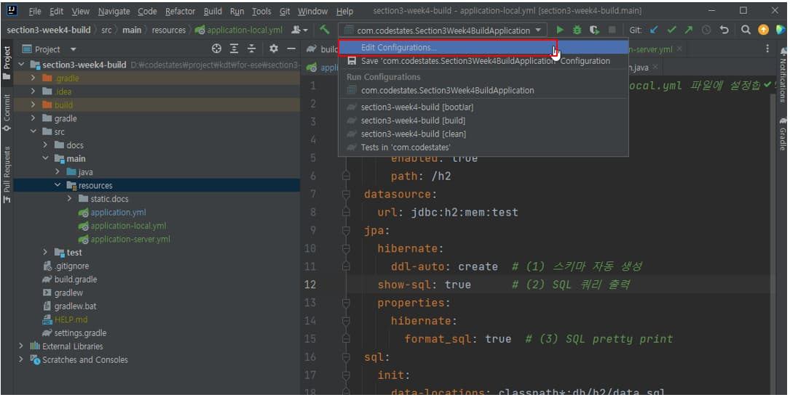

애플리케이션 빌드 / 실행 / 배포

<div class="cl1"></div>

## 애플리케이션 빌드

애플리케이션을 로컬 환경이 아닌 서버 환경에서 실행 가능하게 하려면 Gradle이나 Maven

같은 툴을 이용해서 Spring Boot 기반의 애플리케이션 소스 코드를 빌드하는 기본적인 방법을 알고있어야 한다.

<div class="cl3"></div>

### IntelliJ IDE를 이용한 빌드

<p align="center" style="margin: 34px 0 34px 0"></p>

위 그림은 IntelliJ IDE에서 사용할 수 있는 애플리케이션 빌드를 위한 task이다.

<div class="cl3"></div>

Spring Boot는 Gradle 빌드 툴을 이용해 애플리케이션을 빌드할 수 있는 플러그인을 지원하기 때문에

Gradle task 명령을 통해 애플리케이션을 손쉽게 빌드할 수 있다.

<div class="cl3"></div>

1. 우측 상단의 Gradle 윈도우 탭을 클릭한다.
2. 프로젝트 이름 > Tasks > build에서 :bootJar 또는 :build task를 더블 클릭한다.

<p align="center" style="margin: 54px 0 34px 0"></p>

빌드가 정상적으로 종료되면 위 그림과 같이 build/libs 디렉토리에 Jar 파일 하나가 생성된다.

생성된 Jar 파일은 로컬 PC에서 실행 가능한 애플리케이션 실행 파일이다.

<div class="cl3"></div>

<div class="callout">
   <div class="callout-in">
       <strong>:build 와 :bootJar</strong>
       <div class="cl3"></div>
       <p>:build task를 실행하면 :assemble, :check 같이 Gradle에서 빌드와 관련된 모든 task들을 실행시킨다.</p>
       <p>그리고 실행 가능한 Jar 파일 이외에 plain Jar 파일 하나를 더 생성한다.</p>
       <div class="cl4"></div>
       <p>반면에 :bootJar는 빌드와 관련된 모든 task들을 실행하는 것이 아니라</p>
       <p>애플리케이션의 실행 가능한 Jar(Executable Jar) 파일을 생성하기 위한 task만 실행한다.</p>
       <div class="cl4"></div>
       <p>단순히 Executable Jar 파일만 필요하다면 :bootJar task를 실행하면 된다.</p>
   </div>
</div>

<div class="cl2"></div>

### Gradle Task를 이용한 빌드

IntelliJ IDE를 이용하면 클릭 몇 번 만으로 손쉽게 빌드할 수 있다.

하지만 때로는 IntelliJ IDE가 설치되어 있지 않은 상황에서 빌드를 해야 될 경우도 생길 수 있다.

이럴 땐 Gradle task 명령어를 콘솔에서 바로 입력하여 빌드를 진행할 수 있다.

> Mac의 경우, Mac에서 지원하는 터미널에서 아래의 작업을 모두 진행할 수 있다.

<div class="cl3"></div>

먼저 템플릿 프로젝트가 위치해 있는 디렉토리 경로로 이동한다.

<p align="center" style="margin: 34px 0 34px 0"></p>

Gradle task를 CLI 명령으로 입력할 수 있는 콘솔창을 템플릿 프로젝트 root 경로에서 오픈한다.

콘솔은 cmd, git Bash, Power Shell이나 터미널 등 모두 가능하다.

<div class="cl3"></div>

아래의 명령을 입력해서 애플리케이션 빌드를 진행한다.

<div class="cl3"></div>

**windows 터미널**

```jsx
PS D:\codestates\project\section3-week4-build> .\gradlew bootJar
```

<div class="cl4"></div>

**Git Bash**

```jsx
MINGW64 /d/codestates/project/kdt/for-ese/section3-week4-build (main)
$ ./gradlew build
```

<div class="cl4"></div>

빌드가 정상적으로 종료되면 IntelliJ에서 빌드를 진행할 때와 마찬가지로 build/libs 디렉토리에 Jar 파일 하나가 생성된다.

<div class="cl1"></div>

## 애플리케이션 실행

빌드가 성공적으로 완료되었다면 이제 생성된 Jar(Executable Jar) 파일을 이용해서 애플리케이션을 실행할 수 있다.

<div class="cl4"></div>

1. 빌드를 통해 생성된 Jar 파일이 있는 디렉토리 경로로 이동한다.
2. 터미널 창을 오픈한 후에 아래의 그림과 같이 입력한다.

<p align="center" style="margin: 34px 0 34px 0"></p>

`java -jar Jar 파일명.jar`만 입력하면 애플리케이션을 서버 환경에서 실행시킬 수 있다.

<div class="cl2"></div>

### 프로파일(Profile) 적용

지금까지 만든 애플리케이션은 인메모리 DB인 H2를 사용하고 있는 문제점이 있다.

<div class="cl3"></div>

로컬 환경에서 개발을 진행할 때는 기존 application.yml 파일에 이미 설정되어 있는 H2를 사용하고,

서버용 jar 파일을 빌드할 경우에는 빌드 전에 기존에 application.yml 파일에 설정되어 있는

H2 정보 대신에 서버에서 사용하는 DB 정보로 수정한 뒤에 빌드하면 해결될 것이다.

<div class="cl3"></div>

그런데 매번 그렇게 하는 건 너무 비효율적이다.

<div class="cl3"></div>

이런 불편함을 줄이기 위해서 Spring에서는 Profile이라는 편리한 기능을 제공한다.

<div class="cl3"></div>

아래에서 애플리케이션에 Profile을 적용해서 애플리케이션이 빌드될 때,

로컬 환경에서는 로컬 환경의 DB 설정 정보를 실행 파일에 포함하고,

서버 환경일 경우에는 서버 환경의 DB 설정 정보를 실행 파일에 포함시켜 보겠다.

<div class="cl3"></div>

**프로파일 설정을 위한 yml 파일 생성**

<p align="center" style="margin: 34px 0 34px 0"></p>

먼저 위 그림과 같이 기존의 application.yml 파일 외에 application-local.yml 파일과

application-server.yml 파일을 추가한다.

<div class="cl3"></div>

그리고 나서 세 개의 yml 파일의 내용을 각각 아래와 같이 구성한다.

<div class="cl3"></div>

**application.yml**

```jsx
# 일반적으로 애플리케이션 실행 환경에 상관없는 공통 정보들은 application.yml에 설정할 수 있다.
# 현재는 비어있는 상태이다.
```

<div class="cl4"></div>

application.yml 파일은 주로 애플리케이션의 실행 환경에 상관없이 공통적으로 적용할 수 있는 프로퍼티를 설정할 수 있다.

현재 만들고 있는 샘플 애플리케이션에는 특별히 필요한 공통 정보가 없으므로 비워둔다.

<div class="cl3"></div>

**application-local.yml**

```jsx
# 로컬 환경에서 사용하는 정보들은 application-local.yml 파일에 설정한다.
spring:
  h2:
    console:
      enabled: true
      path: /h2
  datasource:
    url: jdbc:h2:mem:test
  jpa:
    hibernate:
      ddl-auto: create  # (1) 스키마 자동 생성
    show-sql: true      # (2) SQL 쿼리 출력
    properties:
      hibernate:
        format_sql: true  # (3) SQL pretty print
  sql:
    init:
      data-locations: classpath*:db/h2/data.sql
logging:
  level:
    org:
      springframework:
        orm:
          jpa: DEBUG
server:
  servlet:
    encoding:
      force-response: true
```

<div class="cl4"></div>

기존에 application.yml 파일에 설정해 둔 프로퍼티들을 모두 application-local.yml 파일로 옮겼다.

<div class="cl3"></div>

**application-server.yml**

```jsx
# 서버 환경에서 사용하는 정보들은 application-server.yml 파일에 설정한다.
# TODO MySQL DB 접속 정보를 아래에 설정한다.
spring:
  datasource:
    driver-class-name: com.mysql.cj.jdbc.Driver
    url: jdbc:mysql://127.0.0.1:3306/testdb # 내가 사용하는 데이터 베이스 이름
    username: root # 아이디
    password: t1psk12t # 비밀번호ㅗ
  thymeleaf:
    cache: false

  jpa:
    hibernate:
      ddl-auto: create  # (1) 스키마 자동 생성
    show-sql: true      # (2) SQL 쿼리 출력
    open-in-view: false
    show-sql: true
    properties:
      hibernate:
        format_sql: true  # (3) SQL pretty print
        format_sql: true  # (3) SQL pretty print
    hibernate:
      ddl-auto: update
```

<div class="cl4"></div>

샘플 애플리케이션을 실제 서버나 AWS 같은 클라우드에서 실행시켜야 한다면 이 파일에 설정하면 된다.

<div class="cl3"></div>

이 상태에서 IntelliJ에서 애플리케이션을 실행해 보면 H2 웹 콘솔에 접속이 안될 것이다.

application.yml 파일에 있던 H2 웹 콘솔 설정까지 application-local.yml 파일로 옮겼기 때문이다.

<div class="cl3"></div>

애플리케이션을 실행시키면, 프로파일을 적용하든 그렇지 않든 application.yml 파일에 설정된 정보는 항상 읽어온다.

그런데 현재 application.yml 파일에 H2 관련 설정들이 존재하지 않기 때문에 H2 웹 콘솔에 접속되지 않는 것이다.

<div class="cl3"></div>

H2 웹 콘솔에 정상적으로 접속하기 위해서는 로컬 환경의 프로파일을 적용하면 된다.

<div class="cl3"></div>

**IntelliJ IDE에서 프로파일 적용**

<p align="center" style="margin: 34px 0 34px 0"></p>

위 그림과 같이 Edit Run/Debug Configuration 다이얼로그를 오픈하기 위해

애플리케이션 실행 파일이 위치한 셀렉트 박스를 클릭한 후, Edit configurations를 클릭한다.

<p align="center" style="margin: 34px 0 34px 0"></p>

Program arguments 필드에 위 그림과 같이 `--spring.profiles.active=local`을 입력해서 활성화할 프로파일을 local로 지정한다.

여기서 local은 application-local.yml 파일명에서의 local을 가리킨다.

<div class="cl3"></div>

이제 애플리케이션을 다시 실행하면 H2 웹 콘솔에 정상적으로 접속이 되는 걸 확인할 수 있다.

<div class="cl3"></div>

<div class="callout">
   <div class="callout-in">
       <p>Sprgin에서 프로파일을 지정하는 가장 손쉬운 방법은 위에서 보았다시피</p>
       <p>application-local.yml처럼 -(대시)를 기준으로 프로파일명을 yml 파일 이름 안에 포함하는 것이다.</p>
       <div class="cl4"></div>
       <p>프로파일 명은 마음대로 정해도 상관없다.</p>
   </div>
</div>

<div class="cl3"></div>

만약 프로파일이 정상적으로 적용되었는지 확인하고 싶다면 아래 로그와 같이

애플리케이션이 실행될 때 출력되는 로그를 확인하면 된다.

```jsx
.   ____          _            __ _ _
 /\\ / ___'_ __ _ _(_)_ __  __ _ \ \ \ \
( ( )\___ | '_ | '_| | '_ \/ _` | \ \ \ \
 \\/  ___)| |_)| | | | | || (_| |  ) ) ) )
  '  |____| .__|_| |_|_| |_\__, | / / / /
 =========|_|==============|___/=/_/_/_/
 :: Spring Boot ::                (v2.7.1)

[main] c.c.Section3Week4BuildApplication : Starting Section3Week4BuildApplication using Java 11.0.1 on hjs6877 with PID 2756
[main] c.c.Section3Week4BuildApplication : The following 1 profile is active: local

...
...
```

<div class="cl4"></div>

위 로그를 보면 local 프로파일이 활성화된 것을 확인할 수 있다.

<div class="cl3"></div>

**빌드된 실행 파일에 프로파일 적용**

IntelliJ IDE 같은 개발 환경에서 테스트를 위해 프로파일을 변경해야 할 경우도 있지만

프로파일 기능은 빌드된 실행 파일을 어느 환경에서 실행할지 여부를 결정할 때 주로 사용된다.

<div class="cl3"></div>

```jsx
/d/codestates/project/kdt/for-ese/section3-week4-build/build/libs (main)
$ java -jar section3-week4-build-0.0.1-SNAPSHOT.jar --spring.profiles.active=local
```

<div class="cl4"></div>

이전에 실행 파일을 실행시키는 `java -jar section3-week4-build-0.0.1-SNAPSHOT.jar`에 IntelliJ IDE에서

Program arguments에 추가했던 것과 동일하게 `--spring.profiles.active=local` 설정을 추가해 주면 된다.

<div class="cl3"></div>

**Spring에서 지원하는 프로파일 기능은 빌드 후 생성되는 애플리케이션 실행 파일에 대한 실행 환경을**

**간단한 명령어 한 줄 만으로 설정할 수 있는 편리한 기능이면서 굉장히 중요한 기능이므로 사용법을 반드시 기억하기 바란다.**

<div class="cl1"></div>

## 애플리케이션 배포

**전통적인 배포 방법**

Spring Boot 기반의 Executable Jar 파일을 서버에 배포하는 가장 일반적인 방법은

scp나 sftp 같은 표준 유닉스 툴을 이용해서 서버로 간단히 전송하는 것이다.

서버로 전송된 Jar 파일은 JVM이 설치된 환경이라면 어디서든 손쉽게 실행할 수 있다.

<div class="cl3"></div>

**클라우드 서비스를 위한 배포 방법**

Executable Jar 파일은 특히 클라우드 환경에 손쉽게 배포할 수 있다.

<div class="cl4"></div>

- PassS(Platform as a Service)
    - Cloud Foundry, Heroku

<div class="cl4"></div>

대표적인 PaaS 제공 기업인 Cloud Foundry에서 제공하는 cf command line 툴을 사용하면

Executable Jar 파일을 손쉽게 배포할 수 있다.

<div class="cl4"></div>

cf command line 툴 사용 예. `$ cf push acloudyspringtime -p target/app-0.0.1-SNAPSHOT.jar`

<div class="cl3"></div>

- IaaS(Infrastructure as a Service)
    - Executable Jar는 AWS Elastic Beanstalk, AWS Container Registry, AWS Code Deploy 같은<br>서비스를 이용해서 쉽게 배포가 가능하다.
    - Microsoft의 클라우드 서비스인 Azure 역시 Azure Spring Cloud, Azure App Service에서<br>Spring Boot 기반의 Executable Jar 파일 배포 기능을 제공한다.
    - Google Cloud 역시 Executable Jar 파일 배포를 위한 여러 가지 옵션을 제공하고 있다.
    
<div class="cl3"></div>

- CI / CD 플랫폼을 사용한 배포
    - 실무에서 Executable Jar 파일에 대한 배포 자동화를 이루고 싶다면 Github Actions나 Circle CI 같은<br>CI / CD 플랫폼을 이용해 AWS나 Azure 같은 클라우드 서비스에 Executable Jar 파일을 자동 배포하도록 구성할 수 있다.

> CI / CD 플랫폼을 이용한 배포 자동화는 배포 시간을 단축시킬 수 있는 중요한 기술이다.

