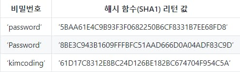
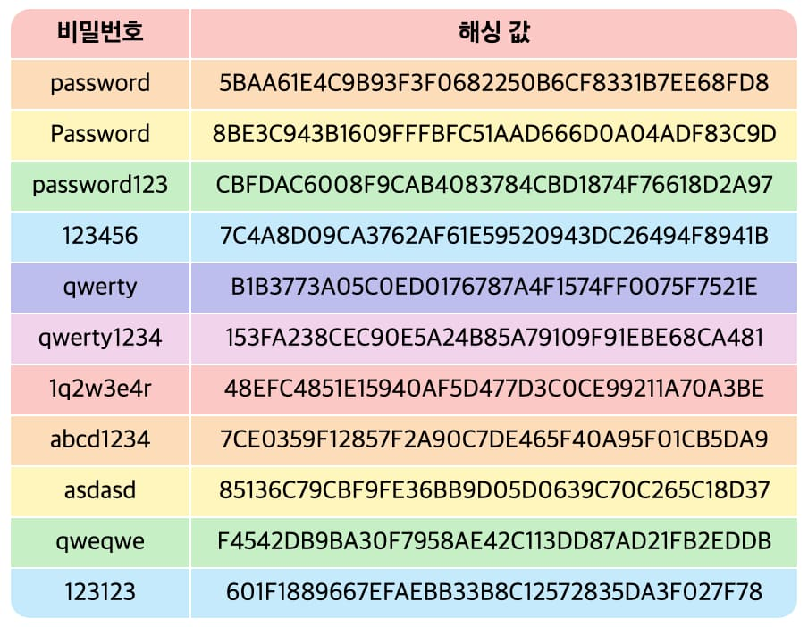
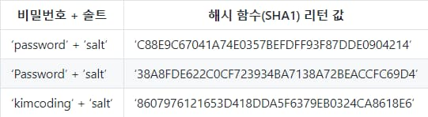
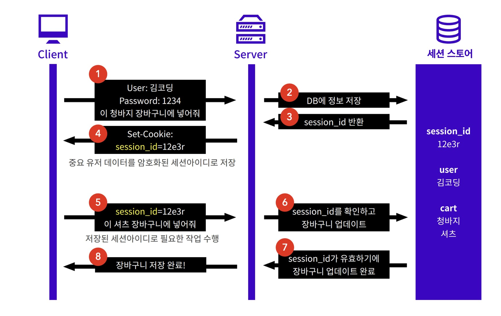
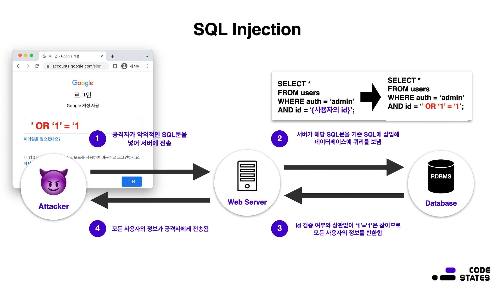

HTTPS, Hashing, Cookie, Session, 웹 보안 공격(SQL Injection, CSRF)

<div class="cl1"></div>

## HTTPS

HTTPS(하이퍼텍스트 전송 프로토콜 보안, Hypertext Transfer Protocol Secure)는

HTTP의 보안 버전으로, 데이터 통신을 암호화하는 프로토콜이다.

기본적으로 웹 브라우저와 웹 서버 간의 데이터 전송 시에 사용되며,

보안 소켓 계층(SSL) 또는 최근에는 전송 계층 보안(TLS)을 통해 암호화를 제공한다.

<div class="cl3"></div>

여러 가지 이유로 웹 트래픽이 증가함에 따라 개인 정보와 중요한 데이터의 안정성이 더 중요해 지면서,

사용자와 웹 사이트 간의 통신을 보호하기 위해 HTTPS가 필요해졌다.

아래는 HTTPS의 주요 특징과 동작 방식에 대한 설명이다.

<div class="cl3"></div>

**데이터 암호화**

HTTPS는 SSL 또는 TLS 프로토콜을 사용하여 데이터를 암호화한다.

이는 데이터를 전송하는 동안 제3자가 끼어들거나 데이터를 도난당하는 것을 방지한다.

<div class="cl4"></div>
---
<div class="cl4"></div>

**인증과 신뢰성**

HTTPS는 웹 사이트의 신원을 확인하고 검증하는 역할을 한다.

이는 사용자가 원하는 웹 사이트에 연결되었음을 보장하며, 중간자 공격과 같은 위험을 방지한다.

<div class="cl4"></div>
---
<div class="cl4"></div>

**SEO 향상**

검색 엔진은 HTTPS를 사용하는 웹 사이트를 더 높게 평가한다.

따라서 HTTPS를 사용하면 검색 엔진 최적화(SEO)에 긍정적인 영향을 미칠 수 있다.

<div class="cl4"></div>
---
<div class="cl4"></div>

**사용자 신뢰 증대**

사용자는 주소 표시줄에 ‘https://’를 보고 안전한 연결임을 확인할 수 있다.

이는 사용자에게 신뢰성을 제공하고, 개인 정보를 입력하는 페이지에 안전하게 접근할 수 있음을 의미한다.

<div class="cl4"></div>
---
<div class="cl4"></div>

**쿠키 보안 강화**

HTTPS는 쿠키를 보호하고 안전하게 전송하도록 도와준다.

안전하지 않은 환경에서는 중간자가 쿠키를 가로챌 수 있지만, HTTPS를 사용하면 쿠키가 암호화되므로 더욱 안전하다.

<div class="cl2"></div>

### 인증서 (Certificate)

웹 서버나 웹 사이트의 신원을 확인하는 데 사용된다.

이는 클라이언트에게 웹 서버가 실제로 자신이 주장하는 서버임을 보장하고 데이터의 안전한 전송을 지원한다.

인증서에는 공개키, 서비스 제공자의 정보, 서명 등이 포함되어 있다.

<div class="cl3"></div>

클라이언트 측에서 요청을 보낸다면 서버는 인증서와 함께 응답을 전송한다.

응답을 받은 클라이언트는 인증서에 작성된 도메인과 응답객체에 작성된 도메인을 비교한다.

만응답에서 확인한 도메인과 인증서에 작성된 도메인이 같다면 데이터를 제공해준 서버가 확실하다는 것을 알 수 있다.

<div class="cl2"></div>

### CA (Certificate Authority)

인증서를 발급하고 관리하는 신뢰할 수 있는 기관이다.

웹 서버가 자신의 신원을 증명하려면 CA로부터 인증서를 발급받아야 한다.

<div class="cl3"></div>

브라우저나 클라이언트에서 신뢰하는 CA의 목록이 내장되어 있어,

해당 CA에서 서명한 인증서는 신뢰성이 부여된다.

대표적인 CA로는 Let’s Encrypt, VeriSign, Comodo 등이 있다.

<div class="cl2"></div>

### 비대칭 키 암호화

HTTPS에서 사용되는 주요 암호화 방식은 비대칭 키 암호화이다.

이 방식은 공개 키와 개인 키라는 두 종류의 키를 사용한다.

<div class="cl3"></div>

**공개 키**

누구나 사용할 수 있는 키로, 데이터를 암호화하는 데 사용된다.

공개키로 암호화된 데이터는 개인 키로만 복호화할 수 있다.

<div class="cl3"></div>

**개인 키**

해당 키를 소유한 단일 개체만이 사용할 수 있는 키로, 데이터를 복호화하는 데 사용된다.

HTTPS에서는 클라이언트와 서버 간의 통신에서 사용되는 대칭 키를 안전하게 교환하기 위해 비대칭 키 암호화를 사용한다.

<div class="cl1"></div>

## Hashing

가장 많이 쓰이는 암호화 방식 중 하나이다.

복호화가 가능한 다른 암호화 방식들과 달리, 해싱은 암호화만 가능하다.

<div class="cl3"></div>

해싱은 해시 함수를 사용하여 암호화를 진행하는데, 해시 함수는 다음과 같은 특징을 가지낟.

- 항상 같은 길이의 문자열을 리턴한다.
- 서로 다른 문자열에 동일한 해시 함수를 사용하면 반드시 다른 결과 값이 나온다.
- 동일한 문자열에 동일한 해시 함수를 사용하면 항상 같은 결과값이 나온다.

<div class="cl3"></div>

아래 표는 대표적인 해시 함수중 하나인 SHA1에 특정 입력 값을 넣었을 때 어떤 결과가 리턴되는 지 보여주는 예시이다.

여기서 [[더보기]](https://www.convertstring.com/ko/Hash/SHA1) SHA1 함수를 직접 사용해 볼 수도 있다.

<p align="center" style="margin: 64px 0 34px 0"></p>

<div class="cl2"></div>

### 레인보우 테이블과 솔트(Salt)

항상 같은 결과값이 나온다는 특성을 이용해 해시 함수를 거치기 이전의 값을

알아낼 수 있도록 기록해 놓은 표인 레인보우 테이블이 존재한다.

<div class="cl3"></div>

레인보우 테이블에 기록된 값의 경우에는 유출이 되었을 때 해싱을 했더라도

해싱 이전의 값을 알아낼 수 있으므로 보안상 위협이 될 수 있다.

<p align="center" style="margin: 34px 0 34px 0"></p>

이때 활용할 수 있는 것이 솔트(Salt)이다.

말 그대로 소금을 치듯 해싱 이전 값에 임의의 값을 더해 데이터가 유출되더라도

해싱 이전의 값을 알아내기 더욱 어렵게 만드는 방법이다.

<p align="center" style="margin: 34px 0 34px 0"></p>

솔트를 사용하게 되면 해싱 값이 유출되더라도,

솔트가 함께 유출된 것이 아니라면 암호화 이전의 값을 알아내는 것은 불가능에 가깝다.

<div class="cl2"></div>

### 해싱의 목적

해싱의 목적은 데이터 그 자체를 사용하는 것이 아니라, 동일한 값의 데이터를 사용하고 있는지

여부만 확인하는 것이 목적이기 때문에 복호화가 불가능한 암호화 방식을 사용하는 것이다.

<div class="cl3"></div>

예시를 들어보자면, 사이트 관리자는 사용자의 비밀번호를 알고 있을 필요가 없다.

오히려 사용자들의 비밀번호를 알고 있다면, 이를 얼마든지 악용할 수 있기 때문에 심각한 문제가 생길 수도 있다.

그래서 보통 비밀번호를 데이터베이스에 저장할 때, 복호화가 불가능하도록 해싱하여 저장하게 된다.

해싱은 복호화가 불가능하므로 사이트 관리자도 정확한 비밀번호를 알 수 없다.

<div class="cl3"></div>

서버 측에서 비밀번호를 모르는 상태에서 로그인 요청을 처리하는 방법은 해싱한 값끼리 비교해서 일치하는지 확인하는 것이다.

꼭 정확한 값을 몰라도, 해싱한 값이 일치한다면 정확한 비밀번호를 입력했다는 뜻이 되기 때문에,

해싱 값으로만 로그인 요청을 처리하는 데에 문제가 없다.

<div class="cl3"></div>

이처럼 해싱은 민감한 데이터를 다루어야 하는 상황에서 데이터 유출의 위험성은 줄이면서

데이터의 유효성을 검증하기 위해서 사용되는 단방향 암호화 방식이다.

<div class="cl1"></div>

## Cookie

클라이언트와 서버 간의 상태를 유지하고 세션을 관리하기 위한 작은 데이터 조각이다.

쿠키는 클라이언트의 로컬 브라우저에 저장되며, 서버와 클라이언트 간의 통신에서 사용된다.

주로 사용자 인증, 세션 관리, 사용자 개인화 등 다양한 용도로 활용된다.

<div class="cl3"></div>

**저장 위치**

쿠키는 클라이언트의 로컬 브라우저에 저장된다.

따라서 클라이언트의 로컬 환경에서만 접근 가능하다.

<div class="cl4"></div>
---
<div class="cl4"></div>

**유효 기간**

쿠키에는 설정된 유효 기간이 있다.

유효 기간이 지나면 브라우저에서 해당 쿠키를 삭제한다.

<div class="cl4"></div>
---
<div class="cl4"></div>

**도메인 별 제한**

쿠키는 특정 도메인에 바인딩되어 있다.

쿠키가 설정된 도메인을 벗어나는 경우 해당 쿠키에 접근할 수 없다.

<div class="cl4"></div>
---
<div class="cl4"></div>

**보안**

일반적으로 쿠키는 사용자의 로컬 브라우저에 저장되기 때문에 보안에 취약할 수 있다.

HTTPS를 사용하여 통신하면 쿠키의 안전성을 높일 수 있다.

<div class="cl4"></div>
---
<div class="cl4"></div>

**사용자 동의**

일부 규정 및 법률에서는 사용자의 동의 없이 쿠키를 저장하거나 사용하는 것을 금지하고 있다.

따라서 웹사이트에서는 사용자에게 쿠키 사용에 대한 동의를 받는 것이 일반적이다.

<div class="cl4"></div>
---
<div class="cl4"></div>

**HTTP 요청과 응답**

쿠키는 HTTP 요청과 응답 헤더를 통해 클라이언트와 서버 간에 교환된다.

서버는 응답 헤더를 통해 클라이언트에게 쿠키를 설정하고,

클라이언트는 다음 요청 시에 해당 쿠키를 함께 전송한다.

<div class="cl2"></div>

간단한 쿠키의 예시는 아래와 같다.

이 예시에서는 사용자의 방문 횟수를 기록하는 쿠키를 설정하고 읽어온다.

<div class="cl4"></div>

```jsx
HTTP/1.1 200 OK
Set-Cookie: visit_count=1; Expires=Wed, 21 Oct 2023 07:28:00 GMT

...

HTTP/1.1 200 OK
Cookie: visit_count=1

...

HTTP/1.1 200 OK
Set-Cookie: visit_count=2; Expires=Wed, 21 Oct 2023 07:28:00 GMT
```

<div class="cl4"></div>

위 예시에서 Set-Cookie 헤더를 통해 쿠키를 설정하고,

다음 요청에서 Cookie 헤더를 통해 해당 쿠키를 서버에 전달한다.

이를 통해 서버는 사용자의 방문 횟수를 추적할 수 있다.

<div class="cl2"></div>

### 클라이언트 데이터 저장

앞서 언급한 것처럼 서버는 쿠키를 이용하여 데이터를 저장하고 원할 때 이 데이터를 다시 불러와 사용할 수 있다.

하지만 데이터를 저장한 이후 아무 때나 데이터를 가져올 수 없다.

데이터를 저장한 이후 특정 조건들이 만족하는 경우에만 다시 가져올 수 있다.

이런 조건들을 쿠키 옵션으로 표현할 수 있다. 아래는 주로 사용되는 쿠키 옵션들이다.

<div class="cl3"></div>

**Domain**

도메인이라는 것은 www.google.com과 같은 서버에 접속할 수 있는 이름이다.

쿠키 옵션에서 도메인은 포트 및 서브 도메인 정보, 세부 경로를 포함하지 않는다.

<div class="cl3"></div>

여기서 서브 도메인이란 ww 같은 도메인 앞에 추가로 작성되는 부분을 말한다.

따라서 요청해야 할 URL이 http://www.localhost.com:3000/users/login이라 하면,

여기에서 Domain은 localhost.com이 된다.

<div class="cl3"></div>

만약 쿠키 옵션에서 도메인 정보가 존재한다면 클라이언트에서는 쿠키의 도메인 옵션과

서버의 도메인이 일치해야지만 쿠키를 전송할 수 있다.

이를 통해 naver.com에서 받은 쿠키를 google.com에 전송하는 일을 막을 수 있다.

<div class="cl4"></div>
---
<div class="cl4"></div>

**Path**

세부 경로는 서버가 라우팅 할 때 사용하는 경로이다.

만약 요청해야 하는 URL이 http://www.localhost.com:3000/users/login인 경우라면

여기에서 Path, 세부 경로는 /users/login이 된다. 명시하지 않으면 기본으로 / 으로 설정되어 있다.

<div class="cl3"></div>

Path 옵션의 특징은 설정된 path를 전부 만족하는 경우 요청하는

Path가 추가로 더 존재하더라도 쿠키를 서버에 전송할 수 있다.

즉 Path 가 /users로 설정되어 있고, 요청하는 세부 경로가 /users/home인 경우라면 쿠키 전송이 가능하다.

<div class="cl3"></div>

하지만 /posts/home로 전송되는 요청은 Path 옵션을 만족하지 못하기 때문에 서버로 쿠키를 전송할 수 없다.

<div class="cl4"></div>
---
<div class="cl4"></div>

**MaxAge or Expires**

쿠키가 유효한 기간을 정하는 옵션이다.

만약 쿠키가 영원히 남아있다면 그만큼 탈취되기도 쉬워지기 때문에

이러한 유효기간을 설정하는 것이 보안 측면에서 중요하다.

MaxAge는 앞으로 몇 초 동안 쿠키가 유효한지 설정하는 옵션이다.

<div class="cl3"></div>

Expires은 MaxAge와 비슷하다.

다만 언제까지 유효한지 Date를 지정한다.

이때 클라이언트의 시간을 기준으로 한다.

이후 지정된 시간, 날짜를 초과하게 되면 쿠키는 자동으로 파괴된다.

<div class="cl3"></div>

쿠키는 위 옵션의 여부에 따라 Session Cookie와 Persistent Cookie로 나눠진다.

<U>세션 쿠키</U> - MaxAge 또는 Expires 옵션이 없는 쿠키로,
브라우저가 실행 중일 때 사용할 수 있는 임시 쿠키이다. 브라우저를 종료하면 해당 쿠키는 삭제된다.

<div class="cl3"></div>

<U>영속성 쿠키</U> - 브라우저의 종료 여부와 상관없이 MaxAge 또는 Expires에 지정된 유효시간만큼 사용가능한 쿠키이다.

<div class="cl4"></div>
---
<div class="cl4"></div>

**Secure**

쿠키를 전송해야 할 때 사용하는 프로토콜에 따른 쿠키 전송 여부를 결정한다.

만약 해당 옵션이 true로 설정된 경우, HTTPS 프로토콜을 이용하여 통신하는 경우에만 쿠키를 전송할 수 있다.

Secure 옵션이 없다면 프로토콜에 상관 없이 http://www... 또는 https://www...에 모두 쿠키를 전송할 수 있다.

<div class="cl4"></div>
---
<div class="cl4"></div>

**HttpOnly**

자바스크립트에서 브라우저의 쿠키에 접근 여부를 결정한다.

만약 해당 옵션이 true로 설정된 경우, 자바스크립트에서는 쿠키에 접근이 불가하다.

<div class="cl3"></div>

명시되지 않는 경우 기본으로 false로 지정되어 있다.

만약 이 옵션이 false인 경우 자바스크립트에서 쿠키에 접근이 가능하므로 XSS 공격에 취약하다.

<div class="cl4"></div>
---
<div class="cl4"></div>

**SameSite**

Cross-Site 요청을 받은 경우, 요청에서 사용한 메서드(Get, Post, Put, PATCH 등)와 해당 옵션의 조합을 기준으로

서버의 쿠키 전송 여부를 결정하게 된다. 이때, Cross-Origin과 Cross-Site를 혼동하지 않도록 주의해야 한다.

<div class="cl3"></div>

<U>Cross-Origin</U> - 서버의 도메인, 프로토콜, 포트 중 하나라도 다른 경우 Cross-Origin으로 구분된다.

- http://… vs https://… ⇒ 프로토콜이 다르므로 Cross-Origin이다.
- https://naver.com:443 vs https://naver.com ⇒  https의 기본 포트는 443이다.<br>따라서 도메인, 프로토콜, 포트가 모두 같은 Same-Origin이다.

<div class="cl3"></div>

<U>Cross-Site</U> - eTLD+1이 다른 경우 Cross-Site로 구분된다. 여기서 eTLD+1이란, .com, .org과 같이<br>도메인의 가장 마지막 부분을 TLD(Top Level Domain, 최상위 도메인)라고 하는데,

이 최상위 도메인의 바로 왼쪽의 하위 레벨 도메인을 합한 것을 eTLD+1이라고 한다.

- http://naver.com vs https://naver.com ⇒ 두 주소 모두 TLD는 .com,<br>eTLD+1은 naver.com으로 같으므로 Same-Site이다.
- https://naver.github.io vs https://google.github.io ⇒ 두 주소 모두 TLD는 .io,<br>eTLD는 github.io이며, eTLD+1은 각각 naver.github.io, google.github.io로 다르므로 Cross-Site이다.

<div class="cl3"></div>

SameSite 옵션에서 사용할 수 있는 속성은 다음과 같다.

Lax - Cross-Site 요청이라면 GET 메서드에 대해서만 쿠키를 전송할 수 있다.

Strict - 단어 그대로 가장 엄격한 옵션으로, Cross-Site가 아닌 Same-Site인 경우에만 쿠키를 전송할 수 있다.

None - Cross-Site에 대해 가장 관대한 옵션으로 항상 쿠키를 보내줄 수 있다. 다만 쿠키 옵션 중 Secure 옵션이 필요하다.

<div class="cl1"></div>

## Session

웹 애플리케이션에서 클라이언트와 서버 간의 상태를 유지하고 정보를 저장하는 데 사용되는 메커니즘이다.

세션은 쿠키와 함께 사용되며, 주로 사용자의 로그인 상태, 장바구니 정보, 사용자의 활동 등을 추적하기 위해 활용된다.

<div class="cl3"></div>

세션의 동작 과정은 아래와 같다.

<div class="cl4"></div>

1. 클라이언트가 웹 애플리케이션에 접속하면 서버는 클라이언트에게 고유한 세션 식별자를 부여하고 이를 쿠키에 저장한다.
2. 클라이언트는 이후의 모든 요청에서 해당 세션 식별자를 서버로 전송한다.
3. 서버는 세션 식별자를 사용하여 클라이언트의 세션 데이터에 접근하고 수정한다.
4. 클라이언트가 로그아웃하거나 세션이 만료되면 서버는 해당 세션 데이터를 제거한다.

<div class="cl3"></div>

세션의 주요 특징과 동작 방식은 아래와 같다.

<div class="cl3"></div>

**상태 유지**

세션은 클라이언트가 서버에 최초로 접속할 때 시작되고,

클라이언트가 웹 애플리케이션과 상호 작용하는 동안 유지된다.

따라서 여러 페이지 또는 요청 간에 정보를 공유하고 유지할 수 있다.

<div class="cl4"></div>
---
<div class="cl4"></div>

**일시적**

세션은 일시적이며, 일반적으로 클라이언트가 브라우저를 종료하거나

일정 시간 동안 활동이 없을 경우 만료된다.

<div class="cl4"></div>
---
<div class="cl4"></div>

**쿠키와 함께 사용**

세션은 일반적으로 쿠키를 사용하여 식별자를 클라이언트에게 부여한다.

클라이언트가 서버에 접속할 때 세션 식별자가 쿠키에 저장되며,

이를 통해 서버는 해당 클라이언트의 세션을 식별한다.

<div class="cl4"></div>
---
<div class="cl4"></div>

**서버 측 저장**

세션 데이터는 서버 측에 저장된다.

클라이언트는 세션 식별자만을 가지고 있고, 서버는 해당 식별자를 사용하여 세션 데이터에 접근한다.

<div class="cl4"></div>
---
<div class="cl4"></div>

**보안**

세션은 서버 측에서 데이터를 관리하므로,

클라이언트에 노출되지 않아 쿠키에 비해 상대적으로 보안성이 높다.

그러나 서버에서 관리되므로 서버 부하 및 자원 사용에 영향을 미칠 수 있다.

<div class="cl2"></div>

### 세션기반 인증

**로그인**

<p align="center" style="margin: 34px 0 34px 0"></p>

로그인을 통해 인증 정보가 저장되고, 인증된 사용자가 어떤 식으로 웹사이트를 이용하는지 알아보겠다.

<div class="cl3"></div>

사용자가 웹사이트에서 아이디 및 비밀번호를 이용해서 로그인을 시도했을 시,

만일 정확한 아이디와 비밀번호를 입력했다면, 서버는 인증(Authentication)에 성공했다고 판단할 것이다.

<div class="cl3"></div>

다음번에 인증을 필요로 하는 작업(장바구니에 물품 추가)을 요청할 경우,

서버는 해당 유저는 인증에 성공했음을 알고 있기 때문에 유저가 매번 로그인할 필요가 없다.

> 인증에 따라 리소스의 접근 권한(Authorization)이 달라진다.

<div class="cl3"></div>

이때 서버와 클라이언트에 각각 필요한 것이 다음과 같다.

- 서버는 사용자가 인증에 성공했음을 알고 있어야 한다.
- 클라이언트는 인증 성공을 증명할 수단을 갖고 있어야 한다.

<div class="cl3"></div>

여기서 몇 가지 용어가 등장한다.

- 사용자가 인증에 성공한 상태는 **세션**이라고 부른다.
    - 서버는 일종의 저장소에 세션을 저장한다. (2번) 주로 in-memory,<br>또는 세션 스토어(redis 등과 같은 트랜잭션이 빠른 DB)에 저장한다.
- 세션이 만들어지면, 각 세션을 구분할 수 있는 **세션 아이디**도 만들어지는데(3번),<br>보통 클라이언트에 세션 성공을 증명할 수단으로써 세션 아이디를 전달한다.(4번)

<div class="cl3"></div>

**이때 웹사이트에서 로그인을 유지하기 위한 수단으로 쿠키를 사용한다. 쿠키에는 서버에서 발급한 세션 아이디를 저장한다.**

<div class="cl3"></div>

쿠키를 통해 유효한 세션 아이디가 전달되고, (5번) 세션 스토어에 해당 세션이 존재한다면

(6번) 서버는 해당 요청에 접근 가능하다고 판단한다. (7,8번)

<div class="cl3"></div>

하지만 쿠키에 세션 아이디 정보가 없는 경우, 서버는 해당 요청이 인증되지 않았음을 알려준다.

<div class="cl2"></div>

**로그아웃**

세션 아이디가 담긴 쿠키는 클라이언트에 저장되어 있으며, 서버는 세션을 저장하고 있다.

그리고 서버는 아이디로만 인증 여부를 판단한다.

<div class="cl3"></div>

<div class="callout">
   <div class="callout-in">
       <strong>주의</strong>
       <p>쿠키는 세션 아이디, 즉 인증 성공에 대해 증명을 하고 있으므로,</p>
       <p>탈취될 때 서버는 해당 요청이 인증된 사용자의 요청이라고 판단한다.</p>
       <p>이것이 우리가 공공 PC에서 로그아웃해야 하는 이유이다.</p>
   </div>
</div>

<div class="cl3"></div>

그러므로 로그아웃은 다음 두 가지 작업을 해야 한다.

- 서버 : 세션 정보를 삭제해야 한다.
- 클라이언트 : 쿠키를 갱신해야 한다.

<div class="cl3"></div>

서버가 클라이언트의 쿠키를 임의로 삭제할 수는 없다.

대신, set-cookie로 클라이언트에게 쿠키를 전송할 때 세션 아이디의 키값을 무효한 값으로 갱신할 수 있다.

<div class="cl1"></div>

## 웹 보안 공격

### SQL Injection

SQL Injection(SQL 삽입)은 웹 해킹을 접한다면 가장 먼저 배우는 공격 기법인 만큼 간단하지만 강력한 공격이다.

이름처럼 데이터베이스에서 임의의 SQL 문을 실행할 수 있도록 명령어를 삽입하는 공격 유형이다.

응용 프로그램의 보안상의 허점을 이용해 데이터베이스를 비정상적으로 조작하며,

이에 따라 기록이 삭제되거나 데이터가 유출될 수 있다.

<p align="center" style="margin: 34px 0 34px 0"></p>

1. SQL 삽입 공격은 보통 사용자가 input form에 직접 무언가 작성하는 상황에서 발생한다.

    예를 들어 로그인 상황을 생각해 보면 웹 사이트에 로그인할 때, 입력한 아이디 값과 패스워드 값을

    이용해 데이터베이스에 접근한다. 만약 클라이언트가 kimcoding이라는 아이디 값을 보낸다면

    대략적인 코드는 다음과 같을 것이다.
    
    ```jsx
    SELECT * 
    FROM users
    WHERE auth='admin'
    AND id='kimcoding';
    ```
    <br>

    <br>
    
2. 공격자는 input form에 일반 텍스트(아이디, 패스워드)가 아닌 SQL 문을 작성한다.

    입력받은 아이디와 패스워드를 통해 데이터베이스를 조회하는데,

    패스워드에 `’OR ‘1’ = ‘1`을 넣어 보낸다면 다음과 같은 SQL 문이 완성된다.
    
    ```jsx
    SELECT * 
    FROM users
    WHERE auth='admin'
    AND id='' OR '1'='1';
    ```
    <br>

    <br>
    
3. WHERE 절에서 `OR`는 `AND`보다 연산 순위가 낮으므로 `OR` 절인 `‘1’ = ‘1’`(항상 참)이 가장 나중에 실행되어 결국 로그인에 성공한다.

    혹은 아래의 코드처럼 input form에 SQL 문을 마무리하는 키워드인 `;`와 함께 주요 테이블을 삭제하는

    SQL 문(`'; DROP TABLES users;--’`)을 작성한다면 데이터가 모두 삭제되는 큰 피해를 볼 수도 있다.
    
    ```jsx
    SELECT * 
    FROM users
    WHERE auth='admin'
    AND id='';DROP TABLES users;--';
    ```
    
<div class="cl2"></div>

**SQL Injection 대응 방안**

1. 입력(요청) 값 검증
    
    SQL 문은 사람이 사용하는 자연어와 비슷하므로 키워드를 막기엔 한계가 있다.
    
    따라서 블랙리스트가 아닌 화이트리스트 방식으로 해당 키워드가 들어오면
    
    다른 값으로 치환하여 SQL Injection에 대응할 수 있다.
    
    > 보안에서 화이트리스트란 기본 정책이 모두 차단인 상황에서 예외적으로 접근이 가능한 대상을 지정하는 방식 또는 그 지정된 대상들을 말한다.

    <br>

    <br>

    
2. Prepared Statement 구문 사용
    
    Prepared Statement 구문을 사용하면 사용자의 입력이 SQL 문으로부터 분리되어 SQL Injection을 방어할 수 있다.
    
    사용자의 입력값이 전달되기 전에 데이터베이스가 미리 컴파일하여 SQL을 바로 실행하지 않고 대기하며,
    
    사용자의 입력값을 단순 텍스트로 인식한다.
    
    따라서 입력값이 SQL 문이 아닌 단순 텍스트로 적용되며 공격에 실패하게 된다.
    
    <br>

    <br>

3. Error Message 노출 금지
    
    공격자는 데이터베이스의 Error Message를 통해 테이블이나 열 등 데이터베이스의 정보를 얻을 수 있다.
    
    에러가 발생한 SQL 문과 에러 내용이 클라이언트에 노출되지 않도록 별도의 에러핸들링이 필요하다.

<div class="cl2"></div>

### Cross-Site Request Forgery (CSRF)

웹 응용 프로그램에서 발생할 수 있는 보안 취약성 중 하나로,

공격자가 사용자의 권한으로 의도하지 않은 요청을 실행하도록 유도하는 공격 기법이다.

이 공격은 흔히 session riding 또는 one-click attack으로도 불린다.

<div class="cl3"></div>

CSRF 공격의 작동 방식은 다음과 같다.

<div class="cl3"></div>

**사용자 로그인**

사용자가 웹 응용 프로그램에 로그인되어 있는 상태여야 한다.

<div class="cl4"></div>
---
<div class="cl4"></div>

**공격자의 사이트 방문**

사용자가 특정 악의적인 웹 사이트를 방문하거나 악의적인 삽입된 이미지,

링크 등을 통해 해당 사이트와 상호 작용한다.

<div class="cl4"></div>
---
<div class="cl4"></div>

**의도하지 않은 요청 실행**

공격자의 사이트에서는 사용자의 브라우저가 의도하지 않은 요청을 실행하도록 유도한다.

이를 위해 이미지, 링크, 스크립트 등을 통해 자동으로 요청을 생성하거나,

특정 조작된 폼을 자동으로 제출한다.

<div class="cl4"></div>
---
<div class="cl4"></div>

**취약한 동작 수행**

사용자의 브라우저는 이러한 요청을 사용자의 권한으로 실행하므로,

웹 응용 프로그램은 해당 요청을 검증하지 않고 적용한다.

CSRF 공격을 방지하기 위한 주요 방법은 다음과 같다.

<div class="cl4"></div>
---
<div class="cl4"></div>

**CSRF 토큰 사용**

웹 응용 프로그램은 사용자의 세션과 연결된 고유한 CSRF 토큰을 생성하고,

모든 폼이나 중요한 요청에 이 토큰을 포함시킨다.

공격자는 이 토큰을 알지 못하면 의도하지 않은 요청을 실행할 수 없다.

<div class="cl4"></div>
---
<div class="cl4"></div>

**SameSite 쿠키 속성 사용**

SameSite 쿠키 속성을 이용하여 쿠키가 동일 출처에서만 전송되도록

제한함으로써 CSRF 공격을 방지할 수 있다.

<div class="cl4"></div>
---
<div class="cl4"></div>

**Referrer 검증**

서버에서는 HTTP Referer 헤더를 검증하여 요청이 올바른 출처에서 왔는지 확인할 수 있다.

하지만 Referer 헤더는 항상 신뢰할 수 있는 정보가 아닐 수 있다.

<div class="cl4"></div>
---
<div class="cl4"></div>

**HTTP 요청 메서드 검증**

중요한 동작을 수행하는 요청에 대해서는 GET 요청이 아닌 POST 또는 다른 안전한 HTTP 메서드를 사용한다.

<div class="cl4"></div>
---
<div class="cl4"></div>

**로그아웃 후 쿠키 소멸**

사용자가 로그아웃할 때 세션 쿠키를 즉시 소멸시키는 것이 좋다.

<div class="cl4"></div>
---
<div class="cl4"></div>

**CORS 정책 활용**

Cross-Origin Resource Sharing (CORS) 정책을 적용하여 다른 출처에서의 요청을 허용 또는 차단할 수 있다.