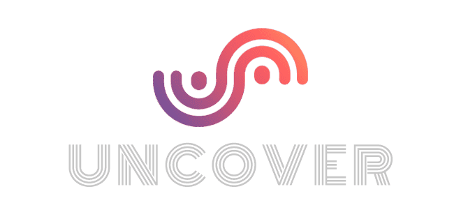

## Team. Undefined

No Copyright Music 서비스 플랫폼

2023.04.28 ~ 2023.05.31

**[홈페이지](https://uncoversound.com/)** ▶️

**[Github](https://github.com/codestates-seb/seb43_main_017)** ▶️

**[Notion](https://www.notion.so/Uncover-29b5c60e0d684aca9e669f27ade96777?pvs=21)** ▶️

**[기술 발표 영상](https://youtu.be/OJ9Xg6aKpAc?si=1C_jy0E8sbpS_5iZ)** ▶️
 

## Summary

저작권이 자유로는 음악들을 서비스하는 웹사이트입니다.

평소 EDM 음악을 즐겨 듣는 저의 취미에서 착안하여, 인터랙티브 웹을 강조한 기획을 진행했습니다.

Java와 Spring Boot를 활용한 프로젝트로, 팀 내에서의 첫 번째 경험이었습니다.

팀원들과 함께 처음 시도하는 프로젝트였기에 서로 질의응답하며 고민하는 과정이 흥미로웠고,

이를 통해 많이 배울 수 있었습니다.

커뮤니케이션 능력 향상과 함께 Java, Spring Boot에 대한 익숙함도 함께 얻을 수 있었습니다.

이 프로젝트는 이전까지의 공부와는 다르게 팀 프로젝트를 성공적으로 마무리한 경험이었습니다.

이를 통해 자발적인 학습과 실전 경험의 중요성을 깨달았으며,

이전과는 다른 수준의 자신감을 얻을 수 있었습니다.

Front-end : React, Recoil, TypeScript, Node.js, Styled-Components, Axios

Back-end : Java, Spring Boot, JWT, OAuth2, Gradle, Tomcat

Database : MySQL, AWS, H2

ETC : Postman, ngrok, git

### 주요 기능

- No Copyright 음악 (장르, 가수, 느낌, 악기 별 태그로 구분)
- 음악으로 플레이리스트 만들기
- 노래, 플레이리스트 댓글 기능
- 노래, 플레이리스트 좋아요 기능
- 원하는 영상에 노래를 넣을 수 있는 편집(Fitting Room) 기능
- 음악 태그, 플레이리스트 태그

## Experience

작성중…

## Retrospective

### 협업과 커뮤니케이션

프로젝트 동안 팀원들과의 **원활한 커뮤니케이션은 프로젝트의 핵심**이었습니다.

팀원들과 의견을 공유하고 조율하는 과정에서 서로의 아이디어와 전문성을 존중하고 융합할 수 있는 능력을 키울 수 있었습니다.

특히 정기적인 회의와 업무 분담, 의사 결정 과정에서의 원활한 소통은 프로젝트 진행에 큰 도움이 되었습니다.

### 문제 해결과 트러블 슈팅

프로젝트 도중 발생한 다양한 문제들을 해결해나가는 과정에서 많은 도전을 겪었습니다.

하나의 문제로 인해 후속 작업들이 지연되는 상황에서 초조함을 느낄 수 있었습니다.

그러나 이러한 도전은 동시에 성장의 기회로 작용했습니다.

문제를 분석하고 원인을 찾아내며 해결책을 모색하는 과정에서 문제 해결 능력과 창의적 사고력을 향상시킬 수 있었습니다.

**이러한 경험은 향후 프로젝트에서 발생할 수 있는 어려움에 대처하는 데 도움이 될 것입니다.**

### 다양한 팀 경험

프로젝트 동안 다른 팀의 서비스를 사용하면서 우리 팀과의 기술적인 차이를 경험했습니다.

각 팀이 선택한 기술 스택, 아키텍처, 디자인 패턴 등이 서로 다른 접근 방식과 장단점을 가지고 있었습니다.

이를 통해 우리 팀의 기술적인 **개선점을 도출**할 수 있었으며, 다양한 경험을 통한 **기술적 성장**을 이끌어냈습니다.

또한, 다른 팀의 서비스를 사용하면서 각 팀의 기술적 선택과 구현 방법을 관찰하며

우리 팀의 프로젝트에 **적용할 수 있는 아이디어**를 얻을 수 있었습니다.

다양한 팀의 서비스에서 보았던 장점과 아쉬운 점들을 살펴보고, 이를 향후 프로젝트에 적용하고 개선해 나갈 수 있을 것입니다.

이러한 경험을 통해 우리 팀은 기술적인 차이를 이해하고 적극적으로 학습하며,

향후 프로젝트에서 보다 나은 결과물을 만들어 나갈 수 있는 기초를 다졌습니다.

## End.

프로젝트를 진행하며 많은 경험을 쌓을 수 있어서 영광이었습니다.

이 프로젝트를 통해 새로운 기술을 배우고,

팀원들과의 협업을 통해 문제를 해결하고 성과를 이끌어낼 수 있었습니다.

또한, 다른 팀의 서비스를 경험해본 것도 큰 도움이 되었습니다.

다른 팀의 접근 방식과 아이디어를 접하며 새로운 관점을 얻고,

우리 팀의 성장과 개선 방향을 도출할 수 있었습니다.

이 프로젝트를 통해 내가 얻은 경험과 성장은 앞으로의 여정에서도 큰 자산이 될 것입니다.

프로젝트 동료들과의 협업, 문제 해결 과정,

기술적인 습득 등 다양한 경험들은 나에게 끊임없이 발전하는 기회를 제공해주었습니다.

마지막으로, 이번 프로젝트에 참여한 팀원들에게 감사의 말을 전하고 싶습니다.

함께 노력하고 협력하여 프로젝트를 성공으로 이끌어낸 모든 팀원들에게 큰 칭찬과 격려의 말을 전하고 싶습니다.

각자의 역할을 수행하며 우리 팀의 목표를 달성하였고, 그 과정에서 함께 성장할 수 있었습니다.

이 프로젝트를 통해 배운 것들을 지속적으로 발전시켜 나가며,

앞으로 더욱 탁월한 성과를 이루어내기 위해 노력하고 싶습니다.