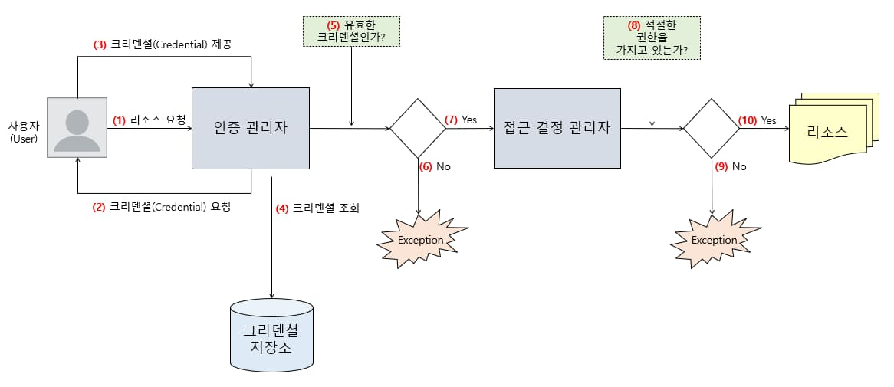
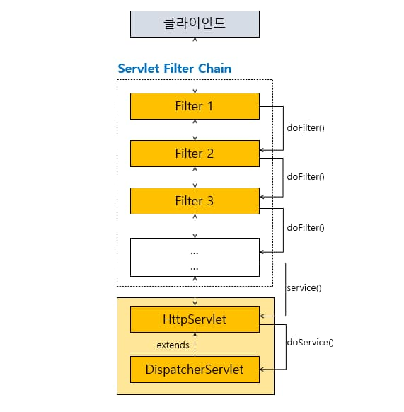
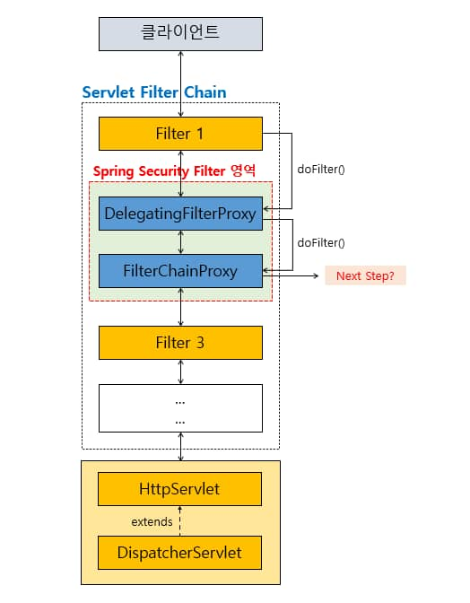
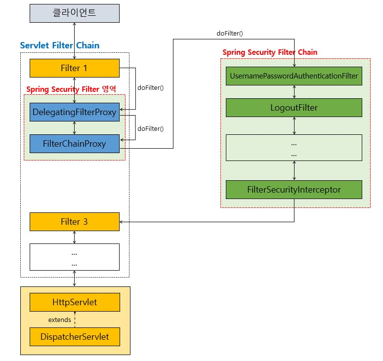
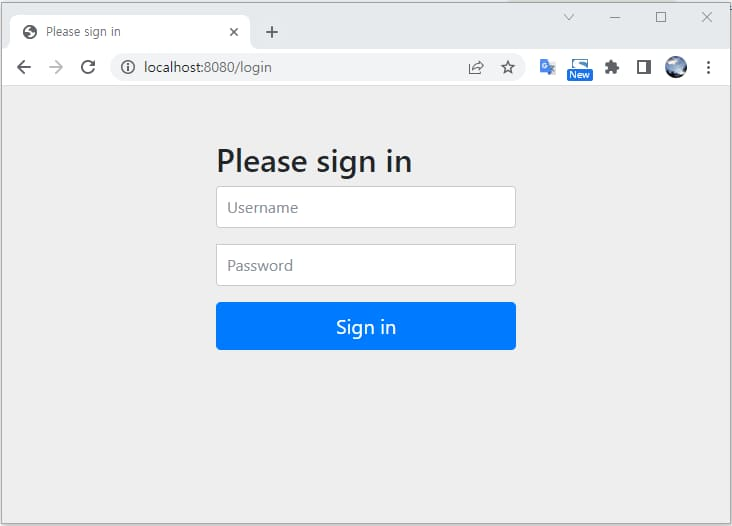
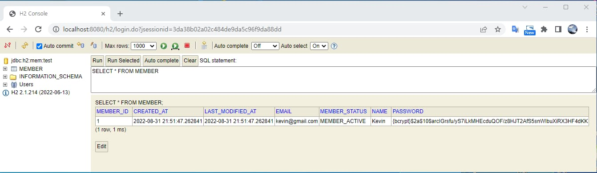
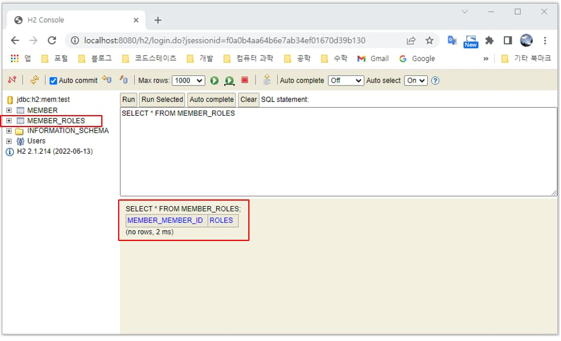
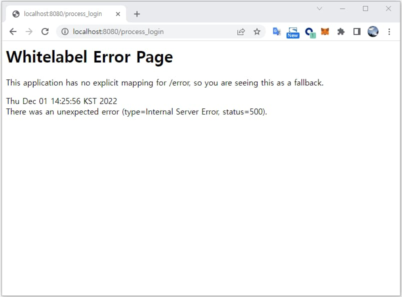

## Spring Security란?

보안을 구현하기 위한 강력한 프레임워크이다.

주로 인증(Authentication)과 권한 부여(Authorization)을 다루며, 다양한 보안 기능을 제공한다.

<div class="cl3"></div>

**Authentication (인증)**

사용자가 누구인지 확인하는 프로세스를 의미한다.

Spring Security는 다양한 인증 방법을 지원한다.

주요 인증 방법으로는 기본적인 ID/Password 인증, LDAP, OAuth, OpenID Connect 등이 있다.

<div class="cl3"></div>

**Authorization (권한 부여)**

사용자가 특정 리소스에 접근할 수 있는 권한을 부여하는 것을 의미한다.

URL 기반 및 메소드 기반의 접근 제어를 제공하여 특정 사용자 역할에 따라 권한을 관리할 수 있다.

<div class="cl3"></div>

**보안 설정 및 필터링**

웹 애플리케이션에서 보안 관련 설정을 편리하게 관리할 수 있도록 도와준다.

보안 관련 필터를 쉽게 추가하고 조작할 수 있다.

<div class="cl3"></div>

**CSRF 및 XSS 방어**

CSRF 및 XSS 공격과 같은 보안 취약점을 방어하기 위한 기능을 제공한다.

<div class="cl3"></div>

**세션 관리**

세션 관리를 통해 사용자의 인증 상태를 관리하고 세션 고정 공격등을 방어할 수 있다.

<div class="cl2"></div>

### Spring Security 처리 흐름

<p align="center" style="margin: 34px 0 34px 0"></p>

1. 사용자가 보호된 리소스를 요청한다.
2. 인증 관리자 역할을 하는 컴포넌트가 사용자의 크리덴셜을 요청한다.
    - 사용자의 크리덴셜이란 해당 사용자를 증명하기 위한 구체적인 수단을 의미한다.
    일반적으로는 사용자의 패스워드가 크리덴셜에 해당한다.
3. 사용자는 인증 관리자에게 크리덴셜을 제공한다.
4. 인증 관리자는 크리덴셜 저장소에서 사용자의 크리덴셜을 조회한다.
5. 인증 관리자는 사용자가 제공한 크리덴셜과 크리덴셜 저장소에 저장된 크리덴셜을 비교해 검증 작업을 수행한다.
6. 유효한 크리덴셜이 아니라면 Exception을 throw한다.
7. 유효한 크리덴셜이라면 8에서 접근 관리자 역할을 하는 컴포넌트는 사용자가 적절한 권한을 부여받았는지 검증한다.
8. 적절한 권한을 부여받지 못한 사용자라면 Exception을 throw한다.
9. 적절한 권한을 부여받은 사용자라면 보호된 리소스의 접근을 허용한다.

<div class="cl3"></div>

위 그림에서 사용자의 웹 요청이 Controller 같은 엔드포인트를 거쳐 접근하려는 리소스에 도달하기 전에

인증 관리자나 접근 결정 관리자 같은 컴포넌트가 중간에 웹 요청을 가로채 사용자의 크리덴셜과 접근 권한을 검증한다.

<div class="cl3"></div>

이처럼 서블릿 기반 애플리케이션의 경우, 애플리케이션의 엔드포인트에 요청이 도달하기 전에 중간에서

요청을 가로챈 후 어떤 처리를 할 수 있는 적절한 포인트를 제공하는데 이것이 바로 **서블릿 필터(Servlet Filter)**이다.

<div class="cl3"></div>

<div class="callout">
   <div class="callout-in">
       <p>서블릿 필터는 자바에서 제공하는 API이며, javax.servlet 패키지에 인터페이스 형태로 정의되어 있다.</p>
       <div class="cl4"></div>
       <p>javax.servlet.Filter 인터페이스를 구현한 서블릿 필터는 웹 요청(request)을 가로채어 어떤 처리(전처리)를 할 수 있으며,</p>
       <p>또한 엔드포인트에서 요청 처리가 끝난 후 전달되는 응답(response)을 클라이언트에게 전달하기 전에 어떤 처리(후처리)를 할 수 있다.</p>
   </div>
</div>

<div class="cl3"></div>

서블릿 필터는 하나 이상의 필터들을 연결해 필터 체인을 구성할 수 있다.

<p align="center" style="margin: 34px 0 34px 0"></p>

서블릿 필터는 각각의 필터들이 doFilter()라는 메서드를 구현해야 하며, doFilter() 메서드 호출을 통해 필터 체인을 형성하게 된다.

<div class="cl3"></div>

만약 Filter 인터페이스를 구현한 다수의 Filter 클래스를 위 그림과 같이 구현했다면

작업을 수행한 뒤, HttpServlet을 거쳐 DispatcherServlet에 요청이 전달되며,

반대로 DispatcherServlet에서 전달한 응답에 대해 역시 특별한 작업을 수행할 수 있다.

<div class="cl2"></div>

### Spring Security 필터 역할

<p align="center" style="margin: 34px 0 34px 0"></p>

위 그림은 서블릿 필터에 Spring Security Filter가 추가된 모습이다.

Spring Security Filter 영역에서 앞서 봤던 서블릿 필터와는 조금 다른 xxxxProxy라는게 있다.

<div class="cl3"></div>

xxxxProxy 클래스는 Filter 인터페이스를 구현하기 때문에 엄연히 서블릿 필터로써의 역할을 한다.

이 DelegatingFilterProxy와 FilterChainProxy는 조금 특별한 필터라고 보면 된다.

<div class="cl3"></div>

**DelegatingFilterProxy**

Spring에서 DI의 핵심은 Spring 컨테이너인 ApplicationContext이다.

Spring Security 역시 Spring의 핵심인 ApplicationContext를 이용한다.

<div class="cl4"></div>

서블릿 필터와 연결되는 Spring Security만의 필터를 ApplicationContext에 Bean으로 등록한 후에

이 Bean들을 이용해서 보안과 관련된 여러 가지 작업을 처리하게 되는데 DelegatingFilterProxy가

Bean으로 등록된 Spring Security의 필터를 사용하는 시작점이라고 생각하면 된다.

<div class="cl4"></div>

DelegatingFilterProxy는 보안과 관련된 어떤 작업을 처리하는 것이 아니라

서블릿 컨테이너 영역의 필터와 ApplicationContext에 Bean으로 등록된 필터들을 연결해 주는 브릿지 역할을 한다.

<div class="cl3"></div>

**FilterChainProxy**

Spring Security의 Filter Chain은 말 그대로 Spring Security에서 보안을 위한 작업을 처리하는 필터의 모음이다.

이 Spring Security의 Filter를 사용하기 위한 진입점이 바로 FilterChainPorxy이다.

<div class="cl4"></div>

한마디로 FilterChainProxy부터 Spring Security에서 제공하는 보안 필터들이 필요한 작업을 수행한다고 생각하면 된다.

<div class="cl4"></div>

Filter Chain은 URL 별로 여러 개 등록할 수 있으며, Filter Chain이 있을 때 어떤 Filter Chain을 사용할지는

FilterChainProxy가 결정하며, 가장 먼저 매칭된 Filter Chain을 실행한다.

<div class="cl4"></div>

예를 들어 /api/** 패턴의 Filter Chain이 있고, /api/message URL 요청을 전송하는 경우,

/api/** 패턴과 제일 먼저 매칭되므로, 디폴트 패턴인 /**도 일치하지만

가장 먼저 매칭되는 /api/** 패턴과 일치하는 Filter Chain만 실행한다.

<div class="cl4"></div>

/message/** 패턴의 Filter Chain이 없는데 /message/ URL 요청을 전송하는 경우,

매칭되는 Filter Chain이 없으므로 디폴트 패턴인 /** 패턴의 Filter Chain을 실행한다.

<div class="cl4"></div>

<p align="center" style="margin: 34px 0 34px 0"></p>

<div class="cl1"></div>

## Spring Security 적용

**bundle.gradle**

```js
dependencies {
  implementation 'org.springframework.boot:spring-boot-starter-security'
}
```

<div class="cl4"></div>

위 의존 라이브러리와 기본 자동 구성이 된 상태에서 애플리케이션을 실행한 후, 웹 브라우저에서 다시 localhost:8080으로 접속해 보면 아래와 같은 로그인 화면으로 리다이렉트 된다.

<p align="center" style="margin: 34px 0 34px 0"></p>

위 로그인 페이지는 Spring Security의 자동 구성을 통해 Spring Security가 내부적으로 제공해 주는 디폴트 로그인 페이지이다.

- Username :  ‘user’를 입력하면 된다.
- Password : 애플리케이션을 실행할 때 출력되는 로그에서 확인할 수 있다. (실행할 때마다 변경)
    
    ```java
    Using generated security password: 32593900-2c36-4cdb-9d15-ce8e5049481f
    ```
    
<div class="cl3"></div>

위 방식은 애플리케이션을 실행할 때마다 패스워드가 변경되는 것도 문제이며,

회원 각자의 인증 정보로 로그인을 하는 것도 불가능하다.

<div class="cl2"></div>

### Spring Security Configuration

Spring Security Configuration을 적용하면 원하는 인증 방식과 웹 페이지에 대한 접근 권한을 설정할 수 있다.

즉, 위 디폴트 로그인 페이지를 사용하지 않아도 된다.

<div class="cl3"></div>

```java
import org.springframework.context.annotation.Configuration;

@Configuration
public class SecurityConfiguration {
    // 여기에 Spring Security의 설정을 진행합니다.
}
```

<div class="cl4"></div>

Spring Boot에서 Spring Security Configuration을 위한 기본 구조는

@Configuration 어노테이션 하나만 추가해 주면 되므로 굉장히 심플하다.

<div class="cl2"></div>

**InMemory User로 인증**

```java
import org.springframework.context.annotation.Bean;
import org.springframework.context.annotation.Configuration;
import org.springframework.security.core.userdetails.User;
import org.springframework.security.core.userdetails.UserDetails;
import org.springframework.security.provisioning.InMemoryUserDetailsManager;

@Configuration
public class SecurityConfiguration {
    @Bean
    public UserDetailsManager userDetailsService() {
        // 1
        UserDetails userDetails =
                User.withDefaultPasswordEncoder()    // 1-1
                        .username("kevin@gmail.com") // 1-2
                        .password("1111")            // 1-3
                        .roles("USER")               // 1-4
                        .build();
        // 2
        return new InMemoryUserDetailsManager(userDetails);
    }
}
```

<div class="cl4"></div>

위 코드는 애플리케이션이 실행된 상태에서 사용자 인증을 위한 계정 정보를 메모리상에 고정된 값으로 설정한 예시이다.

<div class="cl3"></div>

이전에는 매번 애플리케이션이 실행될 때마다 랜덤하게 생성되는 패스워드를 이용해야 했던 반면에

위 코드에서는 사용자의 계정 정보를 메모리상에 지정했기 때문에 애플리케이션이 실행될 때마다 사용자 계정 정보가 변경될 일은 없다.

<div class="cl3"></div>

<U><strong>1</strong></U>의 UserDetails 인터페이스는 인증된 사용자의 핵심 정보를 포함하고 있으며,

UserDetails 구현체인 <U><strong>2</strong></U>의 User 클래스를 이용해서 사용자의 인증 정보를 생성하고 있다.

- withDefaultPasswordEncoder()는 디폴트 패스워드 인코더를 이용해 사용자 패스워드를 암호화한다. <br>
위 예제에서는 <U><strong>1-3</strong></U>의 password() 메서드의 파라미터로 전달한 “1111”을 암호화해 준다.
<br>
<br>
- username() 메서드는 사용자의 username(ID)을 설정한다.
<br>
<br>
- roles() 메서드는 사용자의 Role(역할)을 지정하는 메서드이다. <br>
실제 서비스로 운영되는 대부분의 애플리케이션은 크게 일반 사용자, 관리자 역할로 구분되어 <br>
관리자가 접속할 수 잇는 기능이 별도로 존재한다.

<div class="cl3"></div>

Spring Security에서는 사용자의 핵심 정보를 포함한 UserDetails를 관리하는 UserDatilsManager라는 인터페이스를 제공한다.

그런데 여기선 메모리상에서 UserDetails를 관리하므로 InMemoryUserDetailsManager라는 구현체를 사용한다.

<div class="cl3"></div>

<U><strong>2</strong></U>와 같이 new InMemoryUserDetailsManager(userDetails)를 통해 UserDetailsManager 객체를

Bean으로 등록하면 Spring에서는 해당 Bean이 가지고 있는 사용자의 인증 정보가

클라이언트의 요청으로 넘어올 경우 정상적인 인증 프로세스를 수행한다.

<div class="cl3"></div>

하지만 실제 서비스에서 이런 식으로 사용자 계정 정보를 고정시켜 사용하지는 않는다.

이 방식은 **테스트 환경 또는 데모 환경에서만 유용하게 사용**할 수 있는 방식이다.

<div class="cl3"></div>

<div class="callout">
   <div class="callout-in">
       <strong>Deprecated 상태인 withDefaultPasswordEncoder()</strong>
       <div class="cl3"></div>
       <p>API 문서에서 흔히 볼 수 있는 Deprecated라는 용어는 해당 API가 향후 버전에서는 더 이상 사용되지 않고</p>
       <p>제거될 수 있다는 의미기 때문에 Deprecated라고 표시된 API 사용은 권장되지 않는다.</p>
       <div class="cl4"></div>
       <p>그런데 withDefaultPasswordEncoder() 메서드의 Deprecated는 특이하게 향후 버전에서 제거됨을 의미하기보다는</p>
       <p>Production 환경에서 인증을 위한 사용자 정보를 고정해서 사용하지 말라는 경고의 의미를 나타내고 있는 것이다.</p>
       <p>반드시 테스트 환경이나 데모 환경에서만 사용하기 바란다.</p>
   </div>
</div>

<div class="cl2"></div>

**HTTP 보안 구성 기본**

```java
public class SecurityConfiguration {
    // 1
    @Bean
    public SecurityFilterChain filterChain(HttpSecurity http) throws Exception {
        // HttpSecurity를 통해 HTTP 요청에 대한 보안 설정을 구성한다.
    }

    @Bean
    public InMemoryUserDetailsManager userDetailsService() {
        UserDetails user =
                User.withDefaultPasswordEncoder()
                        .username("kevin@gmail.com")
                        .password("1111")
                        .roles("USER")
                        .build();
        return new InMemoryUserDetailsManager(user);
    }
}
```

<div class="cl4"></div>

위 코드는 Spring Security에서 HTTP 보안을 설정하기 위한 기본 코드이다.

<U><strong>1</strong></U>과 같이 HttpSecurity를 파라미터로 가지고,

SecurityFilterChain을 리턴하는 형태의 메서드를 정의하면 HTTP 보안 설정을 구성할 수 있다.

파라미터로 지정한 HttpSecurity는 HTTP 요청에 대한 보안 설정을 구성하기 위한 핵심 클래스이다.

<div class="cl3"></div>

<div class="callout">
   <div class="callout-in">
       <p>Spring Security 5.7 이전 버전에서는 HTTP 보안 설정을 구성하기 위해</p>
       <p>WebSecurityConfigurerAdapter를 상속하는 형태의 방법을 주로 사용했지만</p>
       <p>WebSecurityConfigurerAdapter는 5.7.0에서 Deprecated 되었다.</p>
       <p>따라서 위 코드와 같이 SecurityFilterChain을 Bean으로 등록해서 HTTP 보안 설정을 구성하는 방식을 권장한다.</p>
   </div>
</div>

<div class="cl2"></div>

**커스텀 로그인 페이지 지정**

```java
import org.springframework.context.annotation.Bean;
import org.springframework.context.annotation.Configuration;
import org.springframework.security.config.annotation.web.builders.HttpSecurity;
import org.springframework.security.core.userdetails.User;
import org.springframework.security.core.userdetails.UserDetails;
import org.springframework.security.provisioning.InMemoryUserDetailsManager;
import org.springframework.security.web.SecurityFilterChain;

@Configuration
public class SecurityConfiguration {
    @Bean
    public SecurityFilterChain filterChain(HttpSecurity http) throws Exception {
        http
            .csrf().disable()                 // 1
            .formLogin()                      // 2
            .loginPage("/auths/login-form")   // 3
            .loginProcessingUrl("/process_login")  // 4
            .failureUrl("/auths/login-form?error") // 5
            .and()                            // 6
            .authorizeHttpRequests()          // 7
            .anyRequest()                     // 8
            .permitAll();                     // 9

        return http.build();
    }

    @Bean
    public InMemoryUserDetailsManager userDetailsService() {
        UserDetails user =
                User.withDefaultPasswordEncoder()
                        .username("kevin@gmail.com")
                        .password("1111")
                        .roles("USER")
                        .build();
        return new InMemoryUserDetailsManager(user);
    }
}
```

<div class="cl4"></div>

위 코드에서는 Spring Security의 보안 구성 중에서 만들어 둔 커스텀 로그인 페이지를 사용하기 위한 최소한의 설정만 추가한 코드이다.

<div class="cl3"></div>

<U><strong>1</strong></U>에서는 CSRF 공격에 대한 설정을 비활성화하고 있다.

Spring Security는 기본적으로 아무 설정을 하지 않으면 CSRF 공격을 방지하기 위해 클라이언트로부터 CSRF Token을 수신 후, 검증한다.

여기선 로컬 환경에서 Spring Security를 공부하므로, CSRF 공격에 대한 설정이 필요하지 않다.

만약, 비활성화하지 않는다면 403 에러로 인해 접속이 불가능하다.

<div class="cl3"></div>

<U><strong>2</strong></U>의 `formLogin()`을 통해 기본적인 인증 방법을 폼 로그인 방식으로 지정한다.

<div class="cl3"></div>

<U><strong>3</strong></U>의 `loginPage(”/auths/login-form”`) 메서드를 통해 커스텀 로그인 페이지를 사용하도록 설정한다.

loginPage()의 파라미터인 “/auths/login-form” 핸들러 메서드에 요청을 전송하는 요청 URL이다.

<div class="cl3"></div>

<U><strong>4</strong></U>의 loginProcessingUrl(”/process_login”) 메서드를 통해 로그인 인증 요청을 수행할 요청 URL을 지정한다.

“/process_login”은 아래 html 코드에서 form 태그의 action 속성에 지정한 URL과 동일하다.

<div class="cl3"></div>

```html
<html xmlns:th="http://www.thymeleaf.org" xmlns:layout="http://www.ultraq.net.nz/thymeleaf/layout"
  layout:decorate="layouts/common-layout">
<head>
  <meta http-equiv="Content-Type" content="text/html; charset=UTF-8" />
  <title>Hello Spring Security Coffee Shop</title>
</head>

<body>
  <div layout:fragment="content">
    <form action="**/process_login**" method="post">
      <p><input type="email" name="username" placeholder="Email" /></p>
      <p><input type="password" name="password" placeholder="Password" /></p>
      <p><button>로그인</button></p>
    </form><a href="/members/register">회원가입</a>
  </div>
</body>
</html>
```

<div class="cl4"></div>

위 코드의 form 태그를 보면 `<form action="**/process_login**" method="post">`와 같이 /process_login URL이 지정된 것을 확인할 수 있다.

<div class="cl3"></div>

커스텀 로그인 화면에서 로그인 버튼을 클릭하게 되면 form 태그의 action 속성에 지정된

/process_login URL로 사용자 인증을 위한 email 주소와 패스워드를 전송하게 된다.

<div class="cl3"></div>

지금은 아직 별도의 인증 프로세스 로직을 작성하지 않았으므로 /process_login URL로 요청을

전송하면 여전히 Spring Security에서 내부적으로 인증 프로세스를 진행한다.

<div class="cl3"></div>

<U><strong>5</strong></U>의 `failureURl(”/auths/login-form?error”)` 메서드를 통해 로그인 인증에 실패할 경우 어떤 화면으로 리다이렉트 할 것인가를 지정한다.

<div class="cl3"></div>

```html
<html xmlns:th="http://www.thymeleaf.org" xmlns:layout="http://www.ultraq.net.nz/thymeleaf/layout"
  layout:decorate="layouts/common-layout">

<head>
  <meta http-equiv="Content-Type" content="text/html; charset=UTF-8" />
  <title>Hello Spring Security Coffee Shop</title>
</head>

<body>
  <div class="container" layout:fragment="content">
    <form action="/process_login" method="post"><!-- 로그인 실패에 대한 메시지 표시 -->
      <div class="row alert alert-danger center" role="alert" th:if="${param.error != null}">
        <div>로그인 인증에 실패했습니다.</div>
      </div>
      <div class="row">
        <div class="col-xs-2"><input type="email" name="username" class="form-control" placeholder="Email" /></div>
      </div>
      <div class="row" style="margin-top: 20px">
        <div class="col-xs-2"><input type="password" name="password" class="form-control" placeholder="Password" />
        </div>
      </div><button class="btn btn-outline-secondary" style="margin-top: 20px">로그인</button>
    </form>
    <div style="margin-top: 20px"><a href="/members/register">회원가입</a></div>
  </div>
</body>

</html>
```

<div class="cl4"></div>

위 코드는 로그인 인증에 실패할 경우, 인증에 실패했다는 메시지를 표시하기 위한 로직을 추가한 코드이다.

<div class="cl3"></div>

`${param.error}`의 값을 통해 로그인 인증 실패 메시지 표시 여부를 결정하고 있다.

`${param.error}`는 Spring Security Configuration에서 `failureUrl("/auths/login-form?error")`의

?error 부분에 해당하는 쿼리 파라미터를 의미한다.

<div class="cl3"></div>

<U><strong>6</strong></U>의 and() 메서드를 통해 Spring Security 보안 설정을 메서드 체인 형태로 구성할 수 있다.

<div class="cl3"></div>

<U><strong>7, 8, 9</strong></U>를 통해서 클라이언트의 요청에 대해 접근 권한을 확인한다. 접근을 허용할지 여부를 결정한다.

- <U><strong>7</strong></U>의 authorizeHttpRequests() 메서드를 통해 클라이언트의 요청이 들어오면 접근 권한을 확인하겠다고 정의한다.
<br>
<br>
- <U><strong>8, 9</strong></U>의 anyRequest().permitAll() 메서드를 통해 클라이언트의 모든 요청에 대해 접근을 허용한다.

<div class="cl2"></div>

**request URI에 접근 권한 부여**

```java
import org.springframework.context.annotation.Bean;
import org.springframework.context.annotation.Configuration;
import org.springframework.security.config.annotation.web.builders.HttpSecurity;
import org.springframework.security.core.userdetails.User;
import org.springframework.security.core.userdetails.UserDetails;
import org.springframework.security.provisioning.InMemoryUserDetailsManager;
import org.springframework.security.web.SecurityFilterChain;

@Configuration
public class SecurityConfiguration {
    @Bean
    public SecurityFilterChain filterChain(HttpSecurity http) throws Exception {
        http
            .csrf().disable()
            .formLogin()
            .loginPage("/auths/login-form")
            .loginProcessingUrl("/process_login")
            .failureUrl("/auths/login-form?error")
            .and()
            .exceptionHandling().accessDeniedPage("/auths/access-denied")   // 1
            .and()
            .authorizeHttpRequests(authorize -> authorize                  // 2
                    .antMatchers("/orders/**").hasRole("ADMIN")        // 2-1
                    .antMatchers("/members/my-page").hasRole("USER")   // 2-2
                    .antMatchers("⁄**").permitAll()                    // 2-3
            );
        return http.build();
    }

    @Bean
    public InMemoryUserDetailsManager userDetailsService() {
        UserDetails user =
                User.withDefaultPasswordEncoder()
                        .username("kevin@gmail.com")
                        .password("1111")
                        .roles("USER")
                        .build();
        return new InMemoryUserDetailsManager(user);
    }
}
```

<div class="cl4"></div>

이전 코드에서 `.authorizeHttpRequests().anyRequest().permitAll();` 설정을 통해 로그인 인증에 성공할 경우,

모든 화면에 접근할 수 있도록 했던 부분을 위 코드에서는 사용자의 Role 별로 request URI에 접근 권한이 부여되도록 수정했다.

<div class="cl3"></div>

<U><strong>1</strong></U>에서는 `exceptionHandling().accessDeniedPage("/auths/access-denied")`를 통해 권한이 없는 사용자가

특정 request URI에 접근할 경우 발생하는 403 에러를 처리하기 위한 페이지를 설정했다.

<div class="cl3"></div>

`exceptionHandling()` 메서드는 메서드의 이름 그대로 Exception을 처리하는 기능을 하며,

리턴하는 `ExceptionHandlingConfigurer` 객체를 통해 구체적인 Exception 처리를 할 수 있다.

<div class="cl3"></div>

`accessDeniedPage()` 메서드는 403 에러 발생 시, 파라미터로 지정한 URL로 리다이렉트 되도록 해준다.

<div class="cl3"></div>

<U><strong>2</strong></U>의 `authorizeHttpRequests()` 메서드는 람다 표현식을 통해 request URI에 대한 접근 권한을 부여할 수 있다.

`antMatchers()` 메서드는 이름 그대로 ant라는 빌드 툴에서 사용되는 Path Pattern을 이용해서 매치되는 URL을 표현한다.

<div class="cl4"></div>

- <U><strong>2-1</strong></U>의 `.antMatchers("/orders/**").hasRole("ADMIN")`은 ADMIN Role을 부여받은 사용자만
/orders로 시작하는 모든 URL에 접근할 수 있다는 의미이다.
<br>
<br>
`/orders/`는 /orders로 시작하는 모든 하위 URL을 포함한다. 예를 들면 /orders/1/coffees, /orders/1/coffees/1 등이 있다.
<br>
<br>
`/orders/*`는 /orders/1과 같이 하위 URL의 depth가 1인 URL만 포함한다.
<br>
<br>
- <U><strong>2-3</strong></U>의 `.antMatchers("/**").permitAll()`은 앞에서 지정한 URL 이외의 나머지 모든 URL은 Role에 상관없이 접근이 가능함을 의미한다.

<div class="cl3"></div>

```java
.authorizeHttpRequests(authorize -> authorize
                    .antMatchers("⁄**").permitAll()
                    .antMatchers("/orders/**").hasRole("ADMIN")
                    .antMatchers("/members/my-page").hasRole("USER")
            );
```

<div class="cl4"></div>

만약 위 코드처럼 순서가 바뀌어 `antMatchers("/**").permitAll()`이 제일 앞에 위치하면

Spring Security에서는 Role에 상관없이 모든 request URL에 대한 접근을 허용하기 때문에 다음에 오는

코드는 제 기능을 하지 못하게 되고 결과적으로 사용자의 Role과는 무관하게 모든 request URL에 접근할 수 있게 된다.

<div class="cl3"></div>

이와 같은 request URL 설정 오류를 방지하기 위해 항상 **더 구체적인 URL 경로부터**

**접근 권한을 부여한 다음 덜 구체적인 URL 경로에 접근 권한을 부여하는 습관을 들여야 한다.**

<div class="cl3"></div>

<div class="callout">
   <div class="callout-in">
       <p>Ant는 Maven과 Gradle에 밀려서 거의 사용되지 않는 빌드 툴이지만 Ant에서 사용되는</p>
       <p>Ant Pattern은 URL 경로 등을 지정하기 위한 Pattern 표현식으로 여러 오픈 소스에서 사용되고 있다.</p>
   </div>
</div>

<div class="cl2"></div>

**로그아웃 설정**

```java
import org.springframework.context.annotation.Bean;
import org.springframework.context.annotation.Configuration;
import org.springframework.security.config.annotation.web.builders.HttpSecurity;
import org.springframework.security.core.userdetails.User;
import org.springframework.security.core.userdetails.UserDetails;
import org.springframework.security.provisioning.InMemoryUserDetailsManager;
import org.springframework.security.web.SecurityFilterChain;

@Configuration
public class SecurityConfiguration {
    @Bean
    public SecurityFilterChain filterChain(HttpSecurity http) throws Exception {
        http
            .csrf().disable()
            .formLogin()
            .loginPage("/auths/login-form")
            .loginProcessingUrl("/process_login")
            .failureUrl("/auths/login-form?error")
            .and()
            .logout()                        // 1
            .logoutUrl("/logout")            // 2
            .logoutSuccessUrl("/")  // (3)
            .and()
            .exceptionHandling().accessDeniedPage("/auths/access-denied")
            .and()
            .authorizeHttpRequests(authorize -> authorize
                    .antMatchers("/orders/**").hasRole("ADMIN")
                    .antMatchers("/members/my-page").hasRole("USER")
                    .antMatchers("⁄**").permitAll()
            );
        return http.build();
    }

    ...
    ...
}
```

<div class="cl4"></div>

로그아웃에 대한 추가 설정을 위해서는 **1**과 같이 `logout()`을 먼저 호출해야 한다.

`logout()` 메서드는 로그아웃 설정을 위한 LogoutConfigurer를 리턴한다.

<div class="cl3"></div>

**2**에서는 logoutUrl(”/logout”)을 통해 사용자가 로그아웃을 수행하기 위한 request URL을 지정한다.

여기서 설정한 URL은 html의 로그아웃 메뉴에 지정한 `href=”/logout”`과 동일해야 한다.

<div class="cl3"></div>

**3**에서는 로그아웃을 성공적으로 수행한 이후 리다이렉트 할 URL을 지정한다.

<div class="cl2"></div>

### DB 연동 없는 로그인 인증

아직까지 회원 가입 요청으로 전달받은 회원 정보를 Spring Security가 알 수 있는 어떠한 처리도 하지 않았다.

아래에서 회원 가입 기능을 동작하도록 코드를 수정해 보겠다.

<div class="cl3"></div>

회원 가입 폼을 통해 InMemory User를 등록하기 위한 작업 순서는 아래와 같다.

- PasswordEncoder Bean 등록
- MemberService Bean 등록을 위한 JavaConfiguration 구성
- InMemoryMemberService 클래스 구현

<div class="cl2"></div>

**PasswordEncoder Bean 등록**

PasswordEncoder는 Spring Security에서 제공하는 패스워드 암호화 기능을 제공하는 컴포넌트이다.

회원 가입 폼에서 전달받은 패스워드는 InMemory User로 등록하기 전에 암호화되어야 한다.

PasswordEncoder는 다양한 암호화 방식을 제공하며,

Spring Security에서 지원하는 PasswordEncoder의 디폴트 암호화 알고리즘은 bcrypt이다.

<div class="cl3"></div>

```java
import org.springframework.context.annotation.Bean;
import org.springframework.context.annotation.Configuration;
import org.springframework.security.core.userdetails.User;
import org.springframework.security.core.userdetails.UserDetails;
import org.springframework.security.crypto.factory.PasswordEncoderFactories;
import org.springframework.security.crypto.password.PasswordEncoder;
import org.springframework.security.provisioning.InMemoryUserDetailsManager;
import org.springframework.security.provisioning.UserDetailsManager;

@Configuration
public class SecurityConfiguration {
    ...
    ...

    @Bean
    public UserDetailsManager userDetailsService() {
        UserDetails user =
                User.withDefaultPasswordEncoder()
                        .username("kevin@gmail.com")
                        .password("1111")
                        .roles("USER")
                        .build();

        UserDetails admin =
                User.withDefaultPasswordEncoder()
                        .username("admin@gmail.com")
                        .password("2222")
                        .roles("ADMIN")
                        .build();

        return new InMemoryUserDetailsManager(user, admin);
    }

    // 1
    @Bean
    public PasswordEncoder passwordEncoder() {
        return PasswordEncoderFactories.createDelegatingPasswordEncoder();  // 1-1
    }
}
```

<div class="cl4"></div>

위 코드에서는 <U><strong>1</strong></U>과 같이 SecurityConfiguration 클래스에서 PasswordEncoder를 Bean으로 등록하고 있다.

<div class="cl3"></div>

<U><strong>1-1</strong></U>의 `PasswordEncoderFactories.createDelegatingPasswordEncoder();`를 통해 `DelegatingPasswordEncoder`를

먼저 생성하는데, 이 `DelegatingPasswordEncoder`가 실질적으로 PasswordEncoder 구현 객체를 생성해 준다.

<div class="cl2"></div>

**MemberService Bean 등록을 위한 JavaConfiguration 구성**

```java
public interface MemberService {
    Member createMember(Member member);
}
```
<div class="cl4"></div>

주로 Service는 class이지만 지금은 편의상 interface로 구현했다.

회원 가입 폼에서 전달받은 정보를 이용해 새로운 사용자를 추가하는 기능만 있으면 되므로

createMember() 하나만 구현하는 구현체가 있으면 된다.

<div class="cl3"></div>

```java
public class InMemoryMemberService implements MemberService {
    public Member createMember(Member member) {

        return null;
    }
}
```
<div class="cl4"></div>

위 코드는 InMemory User를 등록하기 위한 MemberService 인터페이스의 구현 클래스인 InMemoryMemberService 클래스이다.

<div class="cl3"></div>

```java
import org.springframework.transaction.annotation.Transactional;

@Transactional
public class DBMemberService implements MemberService {
    public Member createMember(Member member) {
        return null;
    }
}
```
<div class="cl4"></div>

위 코드는 DB에 User를 등록하기 위한 MemberService 인터페이스의 구현 클래스인 DBMemberService 클래스이다.

<div class="cl3"></div>

```java
import com.example.member.InMemoryMemberService;
import com.example.member.MemberService;
import org.springframework.context.annotation.Bean;
import org.springframework.context.annotation.Configuration;
import org.springframework.security.crypto.password.PasswordEncoder;
import org.springframework.security.provisioning.UserDetailsManager;

@Configuration
public class JavaConfiguration {
    // 1
    @Bean
    public MemberService inMemoryMemberService(UserDetailsManager userDetailsManager,
                                              PasswordEncoder passwordEncoder) {
        return new InMemoryMemberService(userDetailsManager, passwordEncoder);
    }
}
```
<div class="cl4"></div>

JavaConfiguration 클래스에서는 MemberService 인터페이스의

구현 클래스인 InMemoryMemberService를 Spring Bean으로 등록한다.

<div class="cl3"></div>

<U><strong>1</strong></U>에서는 MemberService 인터페이스의 구현체인 InMemoryMemberService 클래스의 Bean 객체를 생성한다.

InMemberMemberService 클래스는 데이터베이스 연동 없이 메모리에

Spring Security의 User를 등록해야 하므로 UserDetailsManager 객체가 필요하다.

<div class="cl3"></div>

또한 User 등록 시, 패스워드를 암호화한 후에 등록해야 하므로

Spring Security에서 제공하는 PasswordEncoder 객체가 필요하다.

따라서 이 두 객체를 InMemoryMemberService 객체 생성 시, DI 해 준다.

<div class="cl2"></div>

**InMemoryMemberService 구현**

```java
import com.example.auth.utils.AuthorityUtils;
import org.springframework.security.core.GrantedAuthority;
import org.springframework.security.core.userdetails.User;
import org.springframework.security.core.userdetails.UserDetails;
import org.springframework.security.crypto.password.PasswordEncoder;
import org.springframework.security.provisioning.UserDetailsManager;

import java.util.List;

public class InMemoryMemberService implements MemberService {  // 1
    private final UserDetailsManager userDetailsManager;
    private final PasswordEncoder passwordEncoder;

    // 2
    public InMemoryMemberService(UserDetailsManager userDetailsManager, PasswordEncoder passwordEncoder) {
        this.userDetailsManager = userDetailsManager;
        this.passwordEncoder = passwordEncoder;
    }

    public Member createMember(Member member) {
        // 3
        List<GrantedAuthority> authorities = createAuthorities(Member.MemberRole.ROLE_USER.name());

        // 4
        String encryptedPassword = passwordEncoder.encode(member.getPassword());

        // 5
        UserDetails userDetails = new User(member.getEmail(), encryptedPassword, authorities);

        // 6
        userDetailsManager.createUser(userDetails);

        return member;
    }

    private List<GrantedAuthority> createAuthorities(String... roles) {
        // 3-1
        return Arrays.stream(roles)
                .map(role -> new SimpleGrantedAuthority(role))
                .collect(Collectors.toList());
    }
}
```
<div class="cl4"></div>

위 코드는 회원 가입 정보를 전달받아 Spring Security의 User를 메모리에 등록해 주는 코드이다.

<div class="cl3"></div>

InMemoryMemberService 클래스는 MemberService 인터페이스를 구현하는 구현 클래스임으로

<U><strong>1</strong></U>과 같이 implements MemberService를 지정한다.

여기서는 @Service 어노테이션을 사용하지 않고, JavaConfiguration을 이용해 Bean을 등록하고 있다.

<div class="cl3"></div>

<U><strong>2</strong></U>에서는 UserDetailsManager와 PasswordEncoder를 DI 받는다.

UserDetailsManager는 Spring Security의 User를 관리하는 관리자 역할을 한다.

SecurityConfiguration에서 Bean으로 등록한 UserDetailsManager는 InMemoryUserDetailsManager 이므로

여기서 DI 받은 userDetailsManager 인터페이스의 하위 타입은 InMemoryUserDetailsManager이다.

<div class="cl3"></div>

PasswordEncoder는 Spring Security User를 등록할 때 패스워드를 암호화해 주는 클래스이다.

Spring Security 5에서는 InMemory User도 패스워드 암호화가 필수이다.

따라서 DI 받은 PasswordEncoder를 이용해 User의 패스워드를 암호화해 주어야 한다.

<div class="cl3"></div>

Spring Security에서 User를 등록하기 위해서는 해당 user의 권한(Authority)을 지정해 주어야 한다.

따라서 <U><strong>3</strong></U>의 `createAuthorities(Member.MemberRole.ROLE_USER.name());`를 이용해

User의 권한 목록을 `List<GrantedAuthority>`로 생성하고 있다.

Member 클래스에서는 MemberRole이라는 enum이 정의되어 있고,

ROLE_USER와 ROLE_ADMIN이라는 enum 타입이 정의되어 있다.

<div class="cl3"></div>

Spring Security에서는 SimpleGrantedAuthority를 사용해 Role 베이스 형태의

권한을 지정할 떄 ‘Role_’ + 권한 명 형태로 지정해 주어야 한다.

그렇지 않을 경우 적절한 권한 매핑이 이루어지지 않는다.

<div class="cl3"></div>

<U><strong>3-1</strong></U>에서는 Java의 Stream API를 이용해 생성자 파라미터로 해당 User의 Role을 전달하면서

SimpleGrantedAuthority 객체를 생성한 후, `List<SimpleGrantedAuthority>` 형태로 리턴해 준다.

<div class="cl3"></div>

<U><strong>4</strong></U>에서는 PasswordEncoder를 이용해 등록할 User의 패스워드를 암호화하고 있다.

만약, 패스워드를 암호화하지 않고 User를 등록한다면 User 등록은 되지만 로그인 인증 시,

다음과 같은 에러를 만나게 되므로 User의 패스워드는 반드시 암호화해야 한다.

`java.lang.IllegalArgumentException: There is no PasswordEncoder mapped for the id "null”`

<div class="cl3"></div>

<U><strong>5</strong></U>에서는 Spring Security User로 등록하기 위해 UserDetails를 생성한다.

Spring Security에서는 User 정보를 UserDetails로 관리한다.

<div class="cl3"></div>

<U><strong>6</strong></U>에서는 UserDetailsManager의 createUser() 메서드를 이용해서 User를 등록한다.

<div class="cl2"></div>

### DB 연동을 통한 로그인 인증

위에서 설명했던 InMemory User는 애플리케이션을 다시 시작하면 메모리에 등록했던 

User 정보가 사라지기 때문에 실무에서는 사용하기 힘들다.

<div class="cl3"></div>

이제 아래에서 회원 정보를 데이터베이스 테이블에서 관리하는 방법을 설명하겠다.

<div class="cl3"></div>

Spring Security에서는 User의 인증 정보를 테이블에 저장하고,

테이블에 저장된 인증 정보를 이용해 인증 프로세스를 진행할 수 있는 여러 방법이 있다.

여기서는 그중 한 가지 방법인 Custom UserDetailsService를 이용해 보겠다.

<div class="cl4"></div>

- SecurityConfiguration의 설정 변경 및 추가
- JavaConfiguration의 Bean 등록 변경
- DBMemberService 구현
- Custom UserDetailsService 구현
- H2 웹 콘솔에서 등록한 회원 정보 확인 및 로그인 인증 테스트
- Custom UserDetails 구현
- User의 Role을 DB에서 관리하기

<div class="cl2"></div>

**SecurityConfiguration의 설정 변경 및 추가**

```java
import org.springframework.context.annotation.Bean;
import org.springframework.context.annotation.Configuration;
import org.springframework.core.annotation.Order;
import org.springframework.security.config.annotation.web.builders.HttpSecurity;
import org.springframework.security.core.userdetails.User;
import org.springframework.security.core.userdetails.UserDetails;
import org.springframework.security.crypto.factory.PasswordEncoderFactories;
import org.springframework.security.crypto.password.PasswordEncoder;
import org.springframework.security.provisioning.InMemoryUserDetailsManager;
import org.springframework.security.provisioning.UserDetailsManager;
import org.springframework.security.web.SecurityFilterChain;

@Configuration
public class SecurityConfiguration {
    @Bean
    public SecurityFilterChain filterChain(HttpSecurity http) throws Exception {
        http
            .headers().frameOptions().sameOrigin() // 1
            .and()
            .csrf().disable()
            .formLogin()
            .loginPage("/auths/login-form")
            .loginProcessingUrl("/process_login")
            .failureUrl("/auths/login-form?error")
            .and()
            .logout()
            .logoutUrl("/logout")
            .logoutSuccessUrl("/")
            .and()
            .exceptionHandling().accessDeniedPage("/auths/access-denied")
            .and()
            .authorizeHttpRequests(authorize -> authorize
                    .antMatchers("/orders/**").hasRole("ADMIN")
                    .antMatchers("/members/my-page").hasRole("USER")
                    .antMatchers("⁄**").permitAll()
            );
        return http.build();
    }

    @Bean
    public PasswordEncoder passwordEncoder() {
        return PasswordEncoderFactories.createDelegatingPasswordEncoder();
    }
}
```
<div class="cl4"></div>

이전에 작성되었던 InMemory User를 위한 설정들은 필요 없으므로 제거했다.

<div class="cl3"></div>

위 코드의 SecurityConfiguration 클래스에서 **1**은 웹 브라우저에서 H2 웹 콘솔을 정상적으로 사용하기 위한 설정이다.

<div class="cl3"></div>

<div class="callout">
   <div class="callout-in">
       <p>frameOptions()는 HTML 태그 중에서 &lt;frame>이나 &lt;iframe>,</p>
       <p>&lt;object> 태그에서 페이지를 렌더링 할지의 여부를 결정하는 기능이다.</p>
       <div class="cl4"></div>
       <p>Spring Security에서는 Clickjacking 공격을 막기위해 기본적으로 frameOptions() 기능이 활성화되어 있으며</p>
       <p>디폴트 값은 DENY이다. 즉, 위에서 언급한 HTML 태그를 이용한 페이지 렌더링을 허용하지 않겠다는 의미이다.</p>
       <div class="cl4"></div>
       <p><U><strong>1</strong></U>과 같이 `.frameOptions().sameOrigin()`을 호출하면 동일 출처로부터 들어오는 request만 페이지 렌더링을 허용한다.</p>
       <p>H2 웹 콘솔의 화면 자체가 내부적으로 태그를 사용하고 있으므로 개발 환경에서는</p>
       <p>H2 웹 콘솔을 정상적으로 사용할 수 있도록 <U><strong>1</strong></U>과 같이 설정하면 된다.</p>
   </div>
</div>

<div class="cl2"></div>

**JavaConfiguration의 Bean 등록 변경**

```java
@Configuration
public class JavaConfiguration {
    // 1
    @Bean
    public MemberService dbMemberService(MemberRepository memberRepository,
                                        PasswordEncoder passwordEncoder) {
        return new DBMemberService(memberRepository, passwordEncoder); // 1-1
    }
}
```
<div class="cl4"></div>

<U><strong>1</strong></U>과 같이 데이터베이스에 User의 정보를 저장하기 위해 MemberService 인터페이스의 구현 클래스를 DBMemberService로 변경한다.

<div class="cl3"></div>

DBMemberService는 내부에서 데이터를 데이터베이스에 저장하고,

패스워드를 암호화해야 하므로 <U><strong>1-1</strong></U>과 같이 MemberRepository와 PasswordEncoder 객체를 DI 해준다.

<div class="cl2"></div>

**DBMemberService 구현**

```java
import com.example.exception.BusinessLogicException;
import com.example.exception.ExceptionCode;
import org.springframework.security.crypto.password.PasswordEncoder;
import org.springframework.transaction.annotation.Transactional;

import java.util.Optional;

@Transactional
public class DBMemberService implements MemberService {
    private final MemberRepository memberRepository;
    private final PasswordEncoder passwordEncoder;

    // 1
    public DBMemberService(MemberRepository memberRepository,
                            PasswordEncoder passwordEncoder) {
        this.memberRepository = memberRepository;
        this.passwordEncoder = passwordEncoder;
    }

    public Member createMember(Member member) {
        verifyExistsEmail(member.getEmail());
        String encryptedPassword = passwordEncoder.encode(member.getPassword());  // 2
        member.setPassword(encryptedPassword);    // 3

        Member savedMember = memberRepository.save(member);

        System.out.println("# Create Member in DB");
        return savedMember;
    }

    ...
    ...
}
```
<div class="cl4"></div>

DBMemberService는 User의 인증 정보를 데이터베이스에 저장하는 역할을 한다.

Member 엔티티 클래스의 필드에 인증 정보를 담는 password 필드가 포함된다고 생각하면 된다.

<div class="cl3"></div>

<U><strong>1</strong></U>의 생성자를 통해 MemberRepository와 PasswordEncoder Bean 객체를 DI 받는다.

<U><strong>2</strong></U>에서 PasswordEncoder를 이용해 패스워드를 암호화한다.

<U><strong>3</strong></U>에서 암호화된 패스워드를 password 필드에 다시 할당한다.

<div class="cl3"></div>

<div class="callout">
   <div class="callout-in">
       <p>패스워드 같은 민감한 정보는 반드시 암호화되어 저장되어야 한다.</p>
       <p>패스워드는 암호화된 상태에서 복호화할 이유가 없으므로 단방향 암호화 방식으로 암호화되어야 한다.</p>
   </div>
</div>

<div class="cl2"></div>

**Custom UserDetailsService 구현**

```java
import com.example.auth.utils.HelloAuthorityUtils;
import com.example.exception.BusinessLogicException;
import com.example.exception.ExceptionCode;
import com.example.member.Member;
import com.example.member.MemberRepository;
import org.springframework.security.core.GrantedAuthority;
import org.springframework.security.core.userdetails.User;
import org.springframework.security.core.userdetails.UserDetails;
import org.springframework.security.core.userdetails.UserDetailsService;
import org.springframework.security.core.userdetails.UsernameNotFoundException;
import org.springframework.stereotype.Component;

import java.util.Collection;
import java.util.Optional;

@Component
public class HelloUserDetailsServiceV1 implements UserDetailsService {   // 1
    private final MemberRepository memberRepository;
    private final HelloAuthorityUtils authorityUtils;

    // 2
    public HelloUserDetailsServiceV1(MemberRepository memberRepository, HelloAuthorityUtils authorityUtils) {
        this.memberRepository = memberRepository;
        this.authorityUtils = authorityUtils;
    }

    // 3
    @Override
    public UserDetails loadUserByUsername(String username) throws UsernameNotFoundException {
        Optional<Member> optionalMember = memberRepository.findByEmail(username);
        Member findMember = optionalMember.orElseThrow(() -> new BusinessLogicException(ExceptionCode.MEMBER_NOT_FOUND));

        // 4
        Collection<? extends GrantedAuthority> authorities = authorityUtils.createAuthorities(findMember.getEmail());

        // 5
        return new User(findMember.getEmail(), findMember.getPassword(), authorities);
    }
}
```
<div class="cl4"></div>

데이터베이스에서 조회한 User의 인증 정보를 기반으로 인증을 처리하는 Custom UserDetailsService이다.

<div class="cl3"></div>

<div class="callout">
   <div class="callout-in">
       <p>Spring Security에서 제공하는 컴포넌트 중 하나인 UserDetailsService는 User 정보를 로드하는 핵심 인터페이스이다.</p>
       <div class="cl4"></div>
       <p>여기서 로드의 의미는 인증에 필요한 User 정보를 어딘가에서 가지고 온다는 의미이며,</p>
       <p>여기서 말하는 어딘가는 메모리가 될 수도 있고, DB 등의 영구 저장소가 될 수도 있다.</p>
       <div class="cl4"></div>
       <p>InMemory User를 등록하는 데 사용했던 InMemoryUserDetailsManager는</p>
       <p>UserDetailsManager 인터페이스의 구현체이고,</p>
       <p>UserDetailsManager는 UserDetailsService를 상속하는 확장 인터페이스이다.</p>
   </div>
</div>

<div class="cl3"></div>

위 클래스와 같은 Custom UserDetailsService를 구현하기 위해서는 <U><strong>1</strong></U>과 같이 UserDetailsService 인터페이스를 구현해야 한다.

<div class="cl3"></div>

HelloUserDetailsService는 데이터베이스에서 User를 조회하고,

조회한 User의 Role 정보를 생성하기 위해 <U><strong>2</strong></U>와 같이 MemberRepository와 HelloAuthorityUtils 클래스를 DI 받는다.

<div class="cl3"></div>

UserDetailsService 인터페이스를 implements 하는 구현 클래스는 <U><strong>3</strong></U>과 같이

`loadUserByUsername(String username)` 이라는 추상 메서드를 구현해야 한다.

<div class="cl3"></div>

<U><strong>4</strong></U>에서는 HelloAuthorityUtils를 이용해 데이터베이스에서 조회한 회원의 이메일 정보를 이용해

Role 기반의 권한 정보(GrantedAuthority) 컬렉션을 생성한다.

HelloAuthorityUtils 코드는 아래에서 확인할 수 있다.

<div class="cl3"></div>

데이터베이스에서 조회한 인증 정보와 <U><strong>4</strong></U>에서 생성한 권한 정보를 Spring Security에서는

아직 알지 못하기 때문에 Spring Security에 이 정보들을 제공해 주어야 하며,

<U><strong>5</strong></U>에서는 UserDetails 인터페이스의 구현체인 User 클래스의 객체를 통해 제공하고 있다.

<div class="cl3"></div>

<U><strong>5</strong></U>와 같이 데이터베이스에서 조회한 User 클래스의 객체를 리턴하면 Spring Security가

이 정보를 이용해 인증 절차를 수행한다.

즉, 데이터베이스에서 User의 인증 정보만 Spring Security에 넘겨주고,

인증 처리는 Spring Security가 대신해 준다.

<div class="cl4"></div>

> UserDetails는 UserDetailsService에 의해 로드되어 인증을 위해 사용되는 핵심 User 정보를 표현하는 인터페이스이다. <br> UserDetails 인터페이스의 구현체는 Spring Security에서 보안 정보 제공을 목적으로 직접 사용되지는 않고, <br> Authentication 객체로 캡슐화되어 제공된다.

<div class="cl3"></div>

```java
import org.springframework.beans.factory.annotation.Value;
import org.springframework.security.core.GrantedAuthority;
import org.springframework.security.core.authority.AuthorityUtils;
import org.springframework.stereotype.Component;
import java.util.List;

@Component
public class HelloAuthorityUtils {
    // 1
    @Value("${mail.address.admin}")
    private String adminMailAddress;

    // 2
    private final List<GrantedAuthority> ADMIN_ROLES = AuthorityUtils.createAuthorityList("ROLE_ADMIN", "ROLE_USER");

    // 3
    private final List<GrantedAuthority> USER_ROLES = AuthorityUtils.createAuthorityList("ROLE_USER");

    public List<GrantedAuthority> createAuthorities(String email) {
        // 4
        if (email.equals(adminMailAddress)) {
            return ADMIN_ROLES;
        }
        return USER_ROLES;
    }
}
```
<div class="cl4"></div>

위 코드는 HelloUserDetailsService에서 Role 기반의 User 권한을 생성하기 위해 사용한 코드이다.

<div class="cl3"></div>

<U><strong>1</strong></U>은 application.yml에 추가한 프로퍼티를 가져오는 포현식이다.

`@Value("${프로퍼티 경로}")`의 표현식 형태로 작성하면

application.yml에 정의되어 있는 프로퍼티의 값을 클래스 내에서 사용할 수 있다.

<U><strong>1</strong></U>에서는 application.yml에 미리 정의한 관리자 권한을 가질 수 있는 이메일 주소로 불러오고 있다.

application.yml 파일에 정의한 관리자용 이메일 주소는 회원 등록 시,

특정 이메일 주소에 관리자 권한을 부여할 수 있는지를 결정하기 위해 사용된다.

<div class="cl3"></div>

**application.yml**

```js
mail:
  address:
    admin: admin@gmail.com
```

<div class="cl4"></div>

<U><strong>2</strong></U>에서는 Spring Security에서 지원하는 AuthorityUtils 클래스를 이용해서 관리자용 권한 목록을 `List<GrantedAuthority>` 객체로 미리 생성한다.

관리자 권한의 경우, 일반 사용자의 권한까지 추가로 포함되어 있다.

<div class="cl3"></div>

<U><strong>3</strong></U>에서는 Spring Security에서 지원하는 AuthorityUtils 클래스를 이용해서 

일반 사용 권한 목록을 `List<GrantedAuthority>` 객체로 미리 생성한다.

<div class="cl3"></div>

<U><strong>4</strong></U>에서는 파라미터로 전달받은 이메일 주소가 application.yml 파일에서 가져온 관리자용 이메일 주소와

동일하다면 관리자용 권한인 `List<GrantedAuthority> ADMIN_ROLES`를 리턴한다.

<div class="cl3"></div>

<div class="callout">
   <div class="callout-in">
       <p>실무에서는 당연히 회원 가입 시, 아무런 인증 장치도 없이 이메일 주소만 입력해서 관리자 권한을 부여하지는 않는다.</p>
       <p>관리자로서 등록하기 위한 추가적인 인증 절차가 있을 것이다.</p>
   </div>
</div>

<div class="cl2"></div>

**H2 웹 콘솔에서 등록한 회원 정보 확인 및 로그인 인증 테스트**

<p align="center" style="margin: 34px 0 34px 0"></p>

여기까지 진행을 했다면 애플리케이션 실행 후, 회원 가입 메뉴에서 회원을 등록한 뒤에

H2 웹 콘솔(http://localhost:8080/h2)에 접속해서 등록한 회원 정보를 본다.

맨 마지막 열인 PASSWORD 열을 보면 회원 가입 메뉴에서 입력했던 패스워드 정보가 암호화 되어있다.

이제 로그인 화면에서 등록한 회원의 이메일 주소와 패스워드를 이용해 로그인을 하면 정상적으로 로그인이 되는 걸 확인할 수 있다.

<div class="cl2"></div>

**Custom UserDetails 구현**

지금까지 작성한 코드만으로도 데이터베이스에 회원의 인증 정보를 저장하고,

저장된 인증 정보를 기반으로 로그인 인증을 하는 데 큰 문제는 없다.

<div class="cl3"></div>

하지만 더 유연하고 깔끔한 코드의 구성을 위해 앞서 작성한 HelloUserDetailsService 클래스를 조금 개선하겠다.

<div class="cl3"></div>

```java
@Component
public class HelloUserDetailsServiceV1 implements UserDetailsService {
    private final MemberRepository memberRepository;
    private final HelloAuthorityUtils authorityUtils;

    public HelloUserDetailsServiceV1(MemberRepository memberRepository, HelloAuthorityUtils authorityUtils) {
        this.memberRepository = memberRepository;
        this.authorityUtils = authorityUtils;
    }

    @Override
    public UserDetails loadUserByUsername(String username) throws UsernameNotFoundException {
        Optional<Member> optionalMember = memberRepository.findByEmail(username);
        Member findMember = optionalMember.orElseThrow(() -> new BusinessLogicException(ExceptionCode.MEMBER_NOT_FOUND));
        Collection<? extends GrantedAuthority> authorities = authorityUtils.createAuthorities(findMember);

        // 개선하면 좋은 포인트
        return new User(findMember.getEmail(), findMember.getPassword(), authorities);
    }
}
```
<div class="cl4"></div>

위 코드는 현재까지 작성된 HelloUserDetailsService 코드이다.

<div class="cl3"></div>

```java
import com.example.auth.utils.HelloAuthorityUtils;
import com.example.exception.BusinessLogicException;
import com.example.exception.ExceptionCode;
import com.example.member.Member;
import com.example.member.MemberRepository;
import org.springframework.security.core.GrantedAuthority;
import org.springframework.security.core.userdetails.User;
import org.springframework.security.core.userdetails.UserDetails;
import org.springframework.security.core.userdetails.UserDetailsService;
import org.springframework.security.core.userdetails.UsernameNotFoundException;
import org.springframework.stereotype.Component;

import java.util.Collection;
import java.util.Optional;

@Component
public class HelloUserDetailsServiceV2 implements UserDetailsService {
    private final MemberRepository memberRepository;
    private final HelloAuthorityUtils authorityUtils;

    public HelloUserDetailsServiceV2(MemberRepository memberRepository, HelloAuthorityUtils authorityUtils) {
        this.memberRepository = memberRepository;
        this.authorityUtils = authorityUtils;
    }

    @Override
    public UserDetails loadUserByUsername(String username) throws UsernameNotFoundException {
        Optional<Member> optionalMember = memberRepository.findByEmail(username);
        Member findMember = optionalMember.orElseThrow(() -> new BusinessLogicException(ExceptionCode.MEMBER_NOT_FOUND));

        return new HelloUserDetails(findMember);  // 1 개선된 부분
    }

    // 2 HelloUserDetails 클래스 추가
    private final class HelloUserDetails extends Member implements UserDetails { // 2-1
        // 2-2
        HelloUserDetails(Member member) {
            setMemberId(member.getMemberId());
            setFullName(member.getFullName());
            setEmail(member.getEmail());
            setPassword(member.getPassword());
        }

        @Override
        public Collection<? extends GrantedAuthority> getAuthorities() {
            return authorityUtils.createAuthorities(this.getEmail());  // 2-3 리팩토링 포인트
        }

        // 2-4
        @Override
        public String getUsername() {
            return getEmail();
        }

        @Override
        public boolean isAccountNonExpired() {
            return true;
        }

        @Override
        public boolean isAccountNonLocked() {
            return true;
        }

        @Override
        public boolean isCredentialsNonExpired() {
            return true;
        }

        @Override
        public boolean isEnabled() {
            return true;
        }
    }

}
```
<div class="cl4"></div>

기존에는 loadUserByUsername() 메서드의 리턴 값으로

`new User(findMember.getEmail(), findMember.getPassword(), authorities);`을 리턴했지만

개선된 코드에서는 <U><strong>1</strong></U>과 같이 `new HelloUserDetails(findMember);`라는 Custom UserDetails 클래스의

생성자로 findMember를 전달하면서 코드가 더 깔끔해졌다.

<div class="cl3"></div>

그리고 기존에는 loadUserByUsername() 메서드 내부에서 User의 권한 정보를 생성하는

`Collection<? extends GrantedAuthority> authorities = authorityUtils.createAuthorities(findMember);` 

코드가 사라지고 <U><strong>2</strong></U>에서 정의한 HelloUserDetails 클래스 내부로 포함되었다.

<div class="cl3"></div>

<U><strong>2</strong></U>의 HelloUserDetails 클래스는 UserDetails 인터페이스를 구현하고 있고 또한 Member 엔티티 클래스를 상속하고 있다.

<div class="cl3"></div>

이렇게 구성하면 데이터베이스에서 조회한 회원 정보를 Spring Security의 User 정보로 변환 하는 과정과

User의 권한 정보를 생성하는 과정을 캡슐화할 수 있다.

<div class="cl3"></div>

또한 HelloUserDetails 클래스는 Member 엔티티 클래스를 상속하고 있으므로

HelloUserDetails를 리턴받아 사용하는 측에서는 두 개 클래스의 객체를 모두 다 손쉽게 캐스팅해서 사용 가능하다는 장점이 있다.

<div class="cl3"></div>

<U><strong>2-3</strong></U>에서는 HelloAuthorityUtils의 createAuthorities() 메서드를 이용해 User의 권한 정보를 생성하고 있다.

이 코드는 기존에는 loadUserByUsername() 메서드 내부에 있었지만 지금은 HelloUserDetails 클래스 내부에서 사용되도록 캡슐화되었다.

<div class="cl3"></div>

<U><strong>2-4</strong></U>에서는 Spring Security에서 인식할 수 있는 username을 Member 클래스의 email 주소로 채우고 있다.

getUsername()의 리턴 값은 null일 수 없다.

<div class="cl3"></div>

기타 UserDetails 인터페이스의 추상 메서드를 구현한 부분은 지금은 크게 중요하지 않은 부분이므로

모두 true 값을 리턴하고 있다.

<div class="cl2"></div>

**User의 Role을 DB에서 관리하기**

이제 Custom UserDetailsService를 이용한 로그인 인증의 마지막 단계이다.

일반적으로 User의 인증 정보 같은 보안과 관련된 정보는 데이터베이스 같은 영구 저장소에 안전하게 보관한다.

그런데 지금까지는 User의 권한 정보는 데이터베이스에서 관리하는 것이 아니라

데이터베이스에서 조회한 User 정보를 기준으로 코드상에서 조건에 맞게 생성하고 있다.

이제 User의 권한 정보를 데이터베이스에서 관리하도록 수정해 보겠다.

<div class="cl4"></div>

- User의 권한 정보를 저장하기 위한 테이블 생성
- 회원 가입 시, User의 권한 정보(Role)를 데이터베이스에 저장
- 로그인 인증 시, User의 권한 정보를 데이터베이스에서 조회

<div class="cl3"></div>

User의 권한 정보 테이블을 생성하기 전에 User와 User의 권한 정보 간에 관계를 먼저 생각해야 한다.

여기서 의미하는 관계는 테이블 간의 연관 관계를 의미하며,

이 테이블 간의 연관 관계는 샘플 애플리케이션에서 사용하고 있는 ORM 기술인 JPA를 통해 손쉽게 연관 관계를 맺을 수 있다.

<div class="cl3"></div>

```java
import com.example.audit.Auditable;
import lombok.Getter;
import lombok.NoArgsConstructor;
import lombok.Setter;

import javax.persistence.*;
import java.security.Principal;
import java.util.ArrayList;
import java.util.List;

@NoArgsConstructor
@Getter
@Setter
@Entity
public class Member extends Auditable implements Principal{
    @Id
    @GeneratedValue(strategy = GenerationType.IDENTITY)
    private Long memberId;

    @Column(length = 100, nullable = false)
    private String fullName;

    @Column(nullable = false, updatable = false, unique = true)
    private String email;

    @Column(length = 100, nullable = false)
    private String password;

    @Enumerated(value = EnumType.STRING)
    @Column(length = 20, nullable = false)
    private MemberStatus memberStatus = MemberStatus.MEMBER_ACTIVE;

    // 1 User의 권한 정보 테이블과 매핑되는 정보
    @ElementCollection(fetch = FetchType.EAGER)
    private List<String> roles = new ArrayList<>();

    public Member(String email) {
        this.email = email;
    }

    public Member(String email, String fullName, String password) {
        this.email = email;
        this.fullName= fullName;
        this.password = password;
    }

    @Override
    public String getName() {
        return getEmail();
    }

    public enum MemberStatus {
        MEMBER_ACTIVE("활동중"),
        MEMBER_SLEEP("휴면 상태"),
        MEMBER_QUIT("탈퇴 상태");

        @Getter
        private String status;

        MemberStatus(String status) {
          this.status = status;
        }
    }

    public enum MemberRole {
        ROLE_USER,
        ROLE_ADMIN
    }
}
```
<div class="cl4"></div>

위 코드는 Member 엔티티 클래스와 User의 권한 정보를 매핑한 코드이다.

Member 엔티티 클래스와 User의 권한 정보를 매핑하는 것은 **1**과 같이 간단하게 처리할 수 있다.

<U><strong>1</strong></U>과 같이 List, Set 같은 컬렉션 타입의 필드는 `@ElementCollection` 어노테이션을 추가하면

User 권한 정보와 관련된 별도의 엔티티 클래스를 생성하지 않아도 간단하게 매핑 처리가 된다.

즉, 이 상태에서 애플리케이션을 실행하면 아래 그림과 같은 테이블이 생성된다.

<p align="center" style="margin: 34px 0 34px 0"></p>

위 그림을 보면 MEmber 엔티티 클래스와 연관 관계 매핑에 대한 테이블이 생성되었다.

한 명의 회원이 한 개 이상의 Role을 가질 수 있으므로,

MEMBER 테이블과 MEMBER_ROLES 테이블은 1 대 N의 관계이다.

회원 가입을 통해 회원 정보가 MEMBER 테이블에 저장될 때,

MEMBER_ROLES 테이블의 MEMBER_MEMBER_ID 열에는 MEMBER 테이블의 기본키 값이

그리고 ROLES 열에는 권한 정보가 저장될 것이다.

<div class="cl3"></div>

이제 User의 권한 정보를 관리하는 테이블도 만들어졌으니,

다음은 회원 가입 시, User의 권한 정보를 데이터베이스에 저장하는 것이다.

<div class="cl3"></div>

```java
import com.example.auth.utils.HelloAuthorityUtils;
import com.example.exception.BusinessLogicException;
import com.example.exception.ExceptionCode;
import org.springframework.security.crypto.password.PasswordEncoder;
import org.springframework.transaction.annotation.Transactional;

import java.util.List;
import java.util.Optional;

@Transactional
public class DBMemberService implements MemberService {
    ...
    ...

    private final HelloAuthorityUtils authorityUtils;

    ...
    ...

    public Member createMember(Member member) {
        verifyExistsEmail(member.getEmail());
        String encryptedPassword = passwordEncoder.encode(member.getPassword());
        member.setPassword(encryptedPassword);

        // 1 Role을 DB에 저장
        List<String> roles = authorityUtils.createRoles(member.getEmail());
        member.setRoles(roles);

        Member savedMember = memberRepository.save(member);

        return savedMember;
    }

    ...
    ...
}
```
<div class="cl4"></div>

위 코드에서는 DBMemberService에서 회원 등록 시,

회원의 권한 정보를 데이터베이스에 저장하는 코드가 추가되었다.

<div class="cl3"></div>

<U><strong>1</strong></U>에서는 `authorityUtils.createRoles(member.getEmail());`를 통해 

회원의 권한 정보(`List<String> roles`)를 생성한 뒤 member 객체에 넘겨주고 있다.

<div class="cl3"></div>

아래 코드는 createRoles() 메서드가 추가된 HelloAuthorityUtils 클래스 코드이다.

```java
import org.springframework.beans.factory.annotation.Value;
import org.springframework.security.core.GrantedAuthority;
import org.springframework.security.core.authority.AuthorityUtils;
import org.springframework.security.core.authority.SimpleGrantedAuthority;
import org.springframework.stereotype.Component;

import java.util.List;
import java.util.stream.Collectors;

@Component
public class HelloAuthorityUtils {
    @Value("${mail.address.admin}")
    private String adminMailAddress;

    ...
    ...

    private final List<String> ADMIN_ROLES_STRING = List.of("ADMIN", "USER");
    private final List<String> USER_ROLES_STRING = List.of("USER");

    ...
    ...

    // 1 DB 저장용
    public List<String> createRoles(String email) {
        if (email.equals(adminMailAddress)) {
            return ADMIN_ROLES_STRING;
        }
        return USER_ROLES_STRING;
    }
}
```
<div class="cl4"></div>

<U><strong>1</strong></U>에서는 파라미터로 전달된 이메일 주소가 application.yml 파일의 mail.address.admin 프로퍼티에

정의된 이메일 주소와 동일하면 관리자 Role 목록(ADMIN_ROLES_STRING)을 리턴하고,

그 외에는 일반 사용자 Role 목록(USER_ROLES_STRING)을 리턴한다.

<div class="cl3"></div>

이제 마지막 작업으로 로그인 인증에 성공 시,

제공하는 User의 권한 정보를 데이터베이스의 테이블에서 관리되는 Role을 기반으로 생성하는 것이다.

<div class="cl3"></div>

```java
import com.example.auth.utils.HelloAuthorityUtils;
import com.example.exception.BusinessLogicException;
import com.example.exception.ExceptionCode;
import com.example.member.Member;
import com.example.member.MemberRepository;
import org.springframework.security.core.GrantedAuthority;
import org.springframework.security.core.userdetails.UserDetails;
import org.springframework.security.core.userdetails.UserDetailsService;
import org.springframework.security.core.userdetails.UsernameNotFoundException;
import org.springframework.stereotype.Component;

import java.util.Collection;
import java.util.Optional;

@Component
public class HelloUserDetailsServiceV3 implements UserDetailsService {
    private final MemberRepository memberRepository;
    private final HelloAuthorityUtils authorityUtils;

    public HelloUserDetailsServiceV3(MemberRepository memberRepository, HelloAuthorityUtils authorityUtils) {
        this.memberRepository = memberRepository;
        this.authorityUtils = authorityUtils;
    }

    @Override
    public UserDetails loadUserByUsername(String username) throws UsernameNotFoundException {
        Optional<Member> optionalMember = memberRepository.findByEmail(username);
        Member findMember = optionalMember.orElseThrow(() -> new BusinessLogicException(ExceptionCode.MEMBER_NOT_FOUND));

        return new HelloUserDetails(findMember);
    }

    private final class HelloUserDetails extends Member implements UserDetails {
        HelloUserDetails(Member member) {
            setMemberId(member.getMemberId());
            setFullName(member.getFullName());
            setEmail(member.getEmail());
            setPassword(member.getPassword());
            setRoles(member.getRoles());   // 1
        }

        @Override
        public Collection<? extends GrantedAuthority> getAuthorities() {
            // 2 DB에 저장된 Role 정보로 User 권한 목록 생성
            return authorityUtils.createAuthorities(this.getRoles());
        }

        ...
        ...
    }

}
```
<div class="cl4"></div>

위 코드는 데이터베이스의 MEMBER_ROLES 테이블에서 조회한 Role을 기반으로

User의 권한 목록(`List<GrantedAuthority>`)을 생성하는 로직이 추가된 HelloUserDetailsService 클래스이다.

<div class="cl4"></div>

- 먼저 **1**에서는 HelloUserDetails가 상속하고 있는 Member(`extends Member`)에 데이터베이스에서 조회한 `List<String> roles`를 전달한다.
- 그리고 **2**에서 다시 Member(extends Member)에 전달한 Role 정보를 <br>
  authorityUtils.createAuthorities() <br>
  메서드의 파라미터로 전달해서 권한 목록(`List<GrantedAuthority>`)을 생성한다.

<div class="cl4"></div>

> 데이터베이스에서 Role 정보를 가지고 오지 않았을 때는 <br> authorityUtils.createAuthorities(this.getRoles());가 아니라 <br> authorityUtils.createAuthorities(this.getEmail());이었다.

<div class="cl3"></div>

아래 코드는 데이터베이스에서 조회한 Role 정보를 기반으로 User의 권한 목록을 생성하는 

`createAuthorities(List<String> roles)` 메서드가 추가된 `HelloAuthorityUtils` 클래스의 코드이다.

<div class="cl3"></div>

```java
import org.springframework.beans.factory.annotation.Value;
import org.springframework.security.core.GrantedAuthority;
import org.springframework.security.core.authority.AuthorityUtils;
import org.springframework.security.core.authority.SimpleGrantedAuthority;
import org.springframework.stereotype.Component;

import java.util.List;
import java.util.stream.Collectors;

@Component
public class HelloAuthorityUtils {
    @Value("${mail.address.admin}")
    private String adminMailAddress;

    private final List<GrantedAuthority> ADMIN_ROLES = AuthorityUtils.createAuthorityList("ROLE_ADMIN", "ROLE_USER");
    private final List<GrantedAuthority> USER_ROLES = AuthorityUtils.createAuthorityList("ROLE_USER");
    private final List<String> ADMIN_ROLES_STRING = List.of("ADMIN", "USER");
    private final List<String> USER_ROLES_STRING = List.of("USER");

    // 메모리 상의 Role을 기반으로 권한 정보 생성.
    public List<GrantedAuthority> createAuthorities(String email) {
        if (email.equals(adminMailAddress)) {
            return ADMIN_ROLES;
        }
        return USER_ROLES;
    }

    // 1 DB에 저장된 Role을 기반으로 권한 정보 생성
    public List<GrantedAuthority> createAuthorities(List<String> roles) {
      List<GrantedAuthority> authorities = roles.stream()
              .map(role -> new SimpleGrantedAuthority("ROLE_" + role)) // (2)
              .collect(Collectors.toList());
      return authorities;
    }

    ...
    ...
}
```
<div class="cl4"></div>

**1**을 보면 기존에는 application.yml 파일의 mail.address.admin 프로퍼티에 정의된 관리자용

이메일 주소를 기준으로 관리자 Role을 추가했지만 이제는 그럴 필요가 없다.

단순히 데이터베이스에서 가지고 온 Role 목록(`List<String> roles`)을 그대로 이용해서 권한 목록(`authorities`)을 만들면 된다.

<div class="cl3"></div>

주의해야 할 것은 2와 같이 `SimpleGrantedAuthority` 객체를 생성할 때 생성자 파라미터로 넘겨주는 값이

“ `USER`" 또는 “`ADMIN`"으로 넘겨주면 안 되고 “`ROLE_USER`" 또는 “`ROLE_ADMIN`" 형태로 넘겨주어야 한다는 것이다.

<div class="cl2"></div>

### Custom AuthenticationProvider 사용 방법

앞에서 Custom UserDetailsService를 사용해 로그인 인증을 처리하는 방식은

Spring Security가 내부적으로 인증을 대신 처리해 주는 방식이다.

<div class="cl3"></div>

이번에는 Custom AuthenticationProvider를 이용해 직접 로그인 인증을 처리하는 방법을 설명해보겠다.

<div class="cl3"></div>

Custom AuthenticationProvider 방식을 사용해 보는 것은 Spring Security의 핵심 컴포넌트인

AuthenticationProvider를 이해하는 데 도움이 되고

또한 보안 요구 사항에 부합하는 적절한 인증 방식을 직접 구현해야 할 경우

Custom AuthenticationProvider가 필요할 수 있다.

<div class="cl3"></div>

```java
import org.springframework.security.authentication.AuthenticationProvider;
import org.springframework.security.authentication.BadCredentialsException;
import org.springframework.security.authentication.UsernamePasswordAuthenticationToken;
import org.springframework.security.core.Authentication;
import org.springframework.security.core.AuthenticationException;
import org.springframework.security.core.GrantedAuthority;
import org.springframework.security.core.userdetails.UsernameNotFoundException;
import org.springframework.security.crypto.password.PasswordEncoder;
import org.springframework.stereotype.Component;

import java.util.Collection;
import java.util.Optional;

@Component
public class HelloUserAuthenticationProvider implements AuthenticationProvider {   // 1
    private final HelloUserDetailsService userDetailsService;
    private final PasswordEncoder passwordEncoder;

    public HelloUserAuthenticationProvider(HelloUserDetailsService userDetailsService,
                                          PasswordEncoder passwordEncoder) {
        this.userDetailsService = userDetailsService;
        this.passwordEncoder = passwordEncoder;
    }

    // 3
    @Override
    public Authentication authenticate(Authentication authentication) throws AuthenticationException {
        UsernamePasswordAuthenticationToken authToken = (UsernamePasswordAuthenticationToken) authentication;  // 3-1

        // 3-2
        String username = authToken.getName();
        Optional.ofNullable(username).orElseThrow(() -> new UsernameNotFoundException("Invalid User name or User Password"));

        // 3-3
        UserDetails userDetails = userDetailsService.loadUserByUsername(username);

        String password = userDetails.getPassword();
        verifyCredentials(authToken.getCredentials(), password);    // 3-4

        Collection<? extends GrantedAuthority> authorities = userDetails.getAuthorities();  // 3-5

        // 3-6
        return UsernamePasswordAuthenticationToken.authenticated(username, password, authorities);
    }

    // 2 HelloUserAuthenticationProvider가 Username/Password 방식의 인증을 지원한다는 것을 Spring Security에 알려준다.
    @Override
    public boolean supports(Class<?> authentication) {
        return UsernamePasswordAuthenticationToken.class.equals(authentication);
    }

    private void verifyCredentials(Object credentials, String password) {
        if (!passwordEncoder.matches((String)credentials, password)) {
            throw new BadCredentialsException("Invalid User name or User Password");
        }
```
<div class="cl4"></div>

위 코드는 AuthenticationProvider를 HelloUserAuthenticationProvider의 코드이다.

<div class="cl3"></div>

<U><strong>1</strong></U>과 같이 AuthenticationProvider 인터페이스의 구현 클래스로 정의한다.

따라서 AuthenticationProvider의 구현 클래스로써의 HelloUserAuthenticationProvider를 구현해야 한다.

<div class="cl3"></div>

Spring Security는 위 코드와 같이 AuthenticationProvider를 구현한 구현 클래스가

Spring Bean으로 등록되어 있다면 해당 AuthenticationProvider를 이용해서 인증을 진행한다.

<div class="cl3"></div>

따라서 클라이언트 쪽에서 로그인 인증을 시도하면 구현한 HelloUserAuthenticationProvider가 직접 인증을 처리하게 된다.

<div class="cl3"></div>

AuthenticationProvider 인터페이스의 구현 클래스는 `authenticate(Authentication authentication)`

메서드와 `supports(Class<?> authentication)` 메서드를 구현해야 한다.

<div class="cl3"></div>

그중에서 <U><strong>2</strong></U>의 `supports(Class<?> authentication)` 메서드는 우리가 구현하는

Custom AuthenticationProvider(`HelloUserAuthenticationProvider`)가 Username/Password 방식의 

인증을 지원한다는 것을 Spring Security에 알려주는 역할을 한다.

<div class="cl3"></div>

`supports()` 메서드의 리턴값이 `true`일 경우, Spring Security는 해당

AuthenticationProvider의 authenticate() 메서드를 호출해서 인증을 진행한다.

<div class="cl3"></div>

<U><strong>3</strong></U>의 `authenticate(Authentication authentication)`에서 우리가 직접 작성한 인증 처리 로직을 이용해 사용자의 인증 여부를 결정한다.

<div class="cl3"></div>

<U><strong>3-1</strong></U>에서 authentication을 캐스팅하여 `UsernamePasswordAuthenticationToken`을 얻는다.

<div class="cl3"></div>

이 `UsernamePasswordAuthenticationToken` 객체에서 <U><strong>3-2</strong></U>와 같이 해당 사용자의 Username을 얻은 후, 존재하는지 체크한다.

<div class="cl3"></div>

Username이 존재한다면 <U><strong>3-3</strong></U>과 같이 userDetailsService를 이용해 데이터베이스에서 해당 사용자를 조회한다.

<div class="cl3"></div>

<U><strong>3-4</strong></U>에서 로그인 정보에 포함된 패스워드(`authToken.getCredentials()`)와 데이터베이스에 저장된 사용자의 패스워드 정보가 일치하는지를 검증한다.

<div class="cl3"></div>

<U><strong>3-4</strong></U>의 검증 과정을 통과했다면 로그인 인증에 성공한 사용자이므로 <U><strong>3-5</strong></U>와 같이 해당 사용자의 권한을 생성한다.

<div class="cl3"></div>

마지막으로 <U><strong>3-6</strong></U>과 같이 인증된 사용자의 인증 정보를 리턴값으로 전달한다.

이 인증 정보는 내부적으로 Spring Security에서 관리하게 된다.

<div class="cl3"></div>

이제 애플리케이션을 실행하고 회원 가입을 한 후, 로그인을 해 보면 정상적으로

Hello, Spring Security의 메인 화면이 브라우저에 표시될 것이다.

<div class="cl3"></div>

만약 회원 가입을 하지 않고 로그인을 시도할 경우 인증에 실패하고, 아래의 그림과 같은 에러 화면을 보게 된다.

<p align="center" style="margin: 34px 0 34px 0"></p>

앞에서 HelloUserDetailsService를 이용해 인증을 처리할 경우에는 인증 실패 시,

Spring Security 내부에서 인증 실패에 대한 전용 Exception인 AuthenticationException을

throw 하게 되고 이 AuthenticationException이 throw 되면 결과적으로 SecurityConfiguration에서

설정한 .failureUrl("/auths/login-form?error")을 통해 로그인 폼으로 리다이렉트 하면서

“로그인 인증에 실패했습니다”라는 인증 실패 메시지를 표시한다.

<div class="cl3"></div>

그런데 Custom AuthenticationProvider를 이용할 경우에는 회원가입 전 인증 실패 시, Whitelebel Error Page가 표시된다.

이유는 MemberService에서 등록된 회원 정보가 없으면,

BusinessLogicException을 throw 하는데 이 BusinessLogicException이 Custom AuthenticationProvider를 거쳐

그대로 Spring Security 내부 영역으로 throw 되기 때문이다.

<div class="cl3"></div>

Spring Security에서는 인증 실패 시, AuthenticationException이 throw 되지 않으면

Exception에 대한 별도의 처리를 하지 않고, 서블릿 컨테이너인 톰캣 쪽으로 이 처리를 넘긴다.

<div class="cl3"></div>

결국 서블릿 컨테이너 영역에서 해당 Exception에 대해 “/error” URL로 포워딩하는데

여기선 “/error” URL로 포워딩되었을 때 보여줄 뷰 페이지를 별도로 구성하지 않았기 때문에

디폴트 페이지인 “Whitelebel Error Page”를 브라우저에 표시하는 것이다.

<div class="cl3"></div>

해결책은 간단하다. Custom AuthenticationProvider에서 Exception이 발생할 경우,

이 Exception을 catch 해서 AuthenticationException으로 rethrow를 해주면 된다.

<div class="cl3"></div>

```java
import org.springframework.security.authentication.AuthenticationProvider;
import org.springframework.security.authentication.BadCredentialsException;
import org.springframework.security.authentication.UsernamePasswordAuthenticationToken;
import org.springframework.security.core.Authentication;
import org.springframework.security.core.AuthenticationException;
import org.springframework.security.core.GrantedAuthority;
import org.springframework.security.core.userdetails.UserDetails;
import org.springframework.security.core.userdetails.UsernameNotFoundException;
import org.springframework.security.crypto.password.PasswordEncoder;
import org.springframework.stereotype.Component;

import java.util.Collection;
import java.util.Optional;

@Component
public class HelloUserAuthenticationProvider implements AuthenticationProvider {
    private final HelloUserDetailsService userDetailsService;
    private final PasswordEncoder passwordEncoder;

    public HelloUserAuthenticationProvider(HelloUserDetailsService userDetailsService,
                                          PasswordEncoder passwordEncoder) {
        this.userDetailsService = userDetailsService;
        this.passwordEncoder = passwordEncoder;
    }

    // V2: AuthenticationException을 rethrow 하는 개선 코드
    @Override
    public Authentication authenticate(Authentication authentication) throws AuthenticationException {
        UsernamePasswordAuthenticationToken authToken = (UsernamePasswordAuthenticationToken) authentication;

        String username = authToken.getName();
        Optional.ofNullable(username).orElseThrow(() -> new UsernameNotFoundException("Invalid User name or User Password"));
        try {
            UserDetails userDetails = userDetailsService.loadUserByUsername(username);
            String password = userDetails.getPassword();
            verifyCredentials(authToken.getCredentials(), password);

            Collection<? extends GrantedAuthority> authorities = userDetails.getAuthorities();
            return UsernamePasswordAuthenticationToken.authenticated(username, password, authorities);
        } catch (Exception ex) {
            throw new UsernameNotFoundException(ex.getMessage()); // 1 AuthenticationException으로 다시 throw 한다.
        }
    }

    @Override
    public boolean supports(Class<?> authentication) {
        return UsernamePasswordAuthenticationToken.class.equals(authentication);
    }

    private void verifyCredentials(Object credentials, String password) {
        if (!passwordEncoder.matches((String)credentials, password)) {
            throw new BadCredentialsException("Invalid User name or User Password");
        }
    }
}
```
<div class="cl4"></div>

위 코드에서는 AuthenticationException이 아닌 다른 Exception이 발생할 경우

AuthenticationException으로 다시 rethrow 하도록 개선된 HelloUserAuthenticationProvider 코드이다.

<U><strong>1</strong></U>에서 UsernameNotFoundException을 throw 하도록 수정되었는데,

UsernameNotFoundException은 AuthenticationException을 상속하는 하위 Exception이기 때문에

이 UsernameNotFoundException이 throw되면 Spring Security 쪽에서 정상적으로 catch해서

정상적인 인증 실패 화면으로 리다이렉트 시켜준다.

<div class="cl4"></div>

> Custom AuthenticationProvider에서 AuthenticationException이 아닌 Exception이 발생할 경우에는 <br> 꼭 AuthenticationException을 rethrow 하도록 코드를 구성해야한다.

<div class="cl3"></div>

<div class="callout">
   <div class="callout-in">
       <strong>AuthenticationProvider</strong>
       <div class="cl3"></div>
       <p>AuthenticationProvider는 Spring Security에서 클라이언트로부터 전달받은 인증 정보를 바탕으로</p>
       <p>인증된 사용자인지에 대한 인증 처리를 수행하는 Spring Security 컴포넌트이다.</p>
       <div class="cl4"></div>
       <p>AuthenticationProvider는 인터페이스 형태로 정의되어 있으며,</p>
       <p>Spring Security에서는 AnonymousAuthenticationProvider,</p>
       <p>DaoAuthenticationProvider, JwtAuthenticationProvider,</p>
       <p>RememberMeAuthenticationProvider, OAuth2LoginAuthenticationProvider </p>
       <p>등 다양한 유형의 AuthenticationProvider 구현체를 제공한다.</p>
   </div>
</div>

