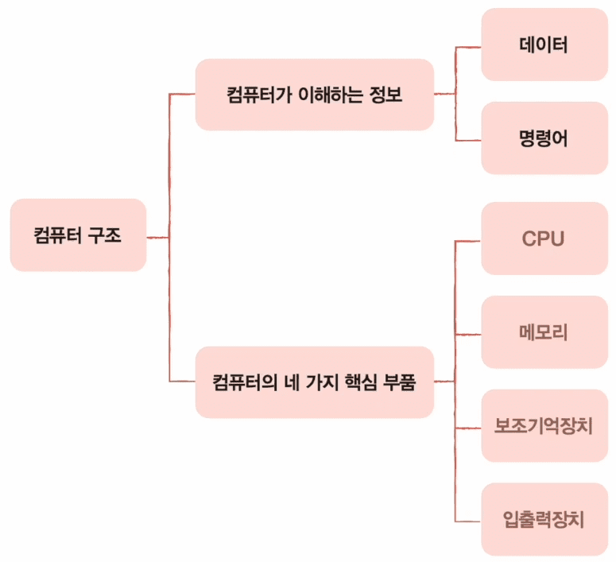
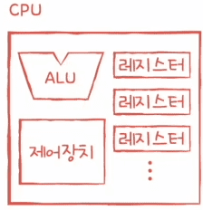
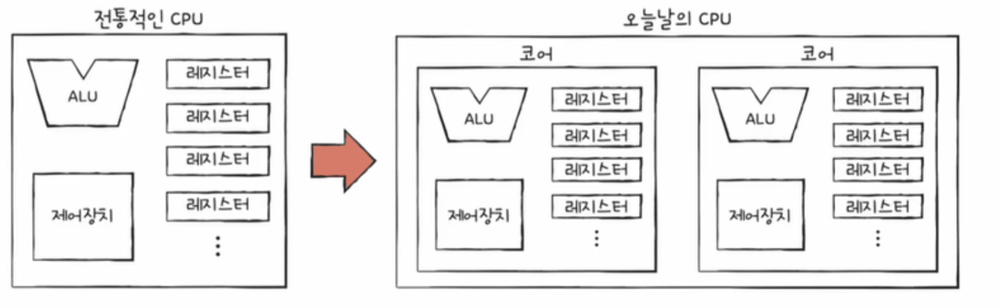
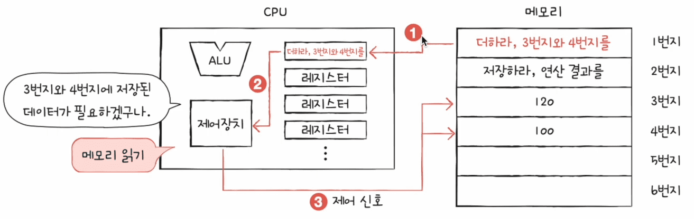
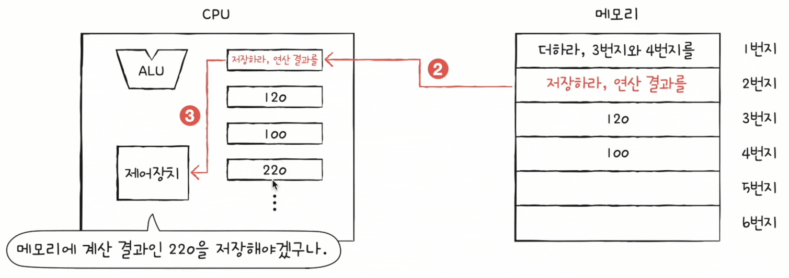
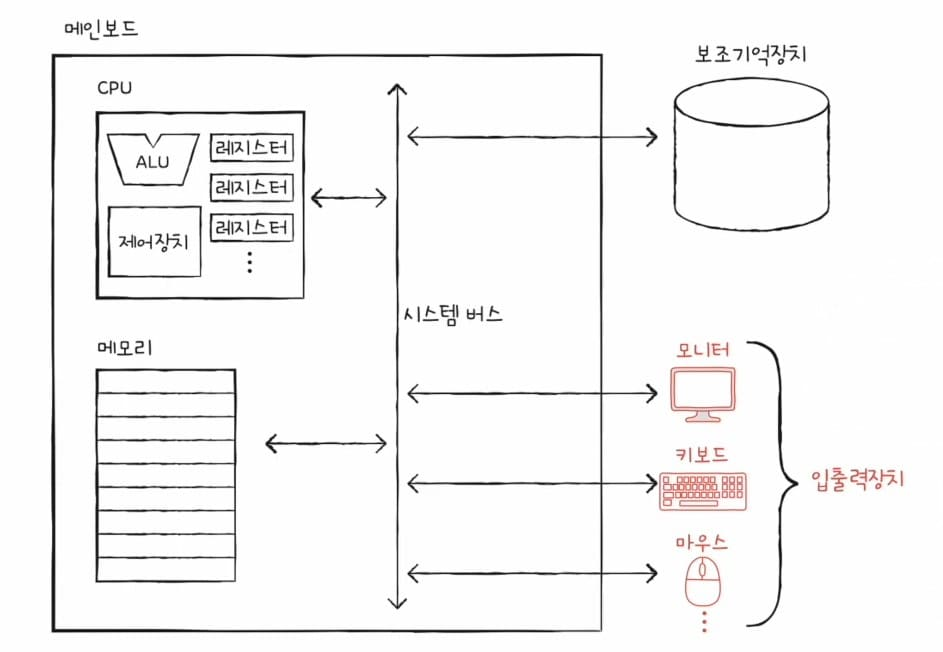

CS 정리 1P

## CPU (Central Processing Unit, 중앙 처리 장치)

CPU(중앙 처리 장치)는 컴퓨터의 중심부로, 명령어를 실행하고 데이터를 처리하는 역할을 한다.

### CU(Control Unit, 제어 장치)

**기능**: 프로그램의 명령어를 해석하고 실행 순서를 제어한다.

**역할**: 메모리에서 명령어를 가져와 해독하고, 적절한 연산 장치와 메모리 모듈에 신호를 보내어 작업을 수행하게 한다.

### ALU (Arithmetic Logic Unit, 산술논리연산장치)

**기능**: 산술 연산과 논리 연산을 수행한다.

**역할**: 덧셈, 뺄셈, 곱셈, 나눗셈 등의 기본 산술 연산과 AND, OR, NOT 같은 논리 연산을 처리한다.

### Register(레지스터)

**기능**: 고속의 임시 저장 장치로서, 연산 중에 필요한 데이터를 일시적으로 저장한다.

**종류**:

- **데이터 레지스터**: 연산에 사용되는 데이터를 저장
- **주소 레지스터**: 메모리 주소를 저장
- **상태 레지스터**: CPU의 현재 상태를 나타내는 플래그 비트들을 저장

### Cashe Memory (캐시 메모리)

**기능**: 자주 사용되는 데이터와 명령어를 일시적으로 저장하여 CPU의 데이터 접근 시간을 단축한다.

**종류**:

- **L1 캐시**: CPU 내부에 통합되어 있으며, 가장 빠르다
- **L2 캐시**: 약간 느리지만 여전히 CPU 가까이에 위치해있다.
- **L3 캐시**: 여러 CPU 코어가 공유하는 경우도 있다.

### Clock (클럭)

**기능**: CPU의 동작 속도를 결정하는 주기적인 신호를 제공한다.

**역할**: 클럭 주파수(Hz)는 초당 몇 번의 명령어를 처리할 수 있는지를 나타내며, CPU의 성능을 결정하는 중요한 요소이다.

### Bus (버스)

**기능**: CPU와 다른 컴퓨터 구성 요소 간의 데이터 전송 경로이다.

**종류**:

- **데이터 버스**: 데이터 전송에 사용
- **주소 버스**: 메모리 주소 전송에 사용
- **제어 버스**: 제어 신호 전송에 사용

### Instruction Pipeline (명령어 파이프라인)

**기능**: 명령어 처리 단계를 여러 단계로 나누어 동시에 처리함으로써 성능을 향상시킨다.

**단계**: 일반적으로 명령어 가져오기(Fetch), 해독(Decode), 실행(Execute), 메모리 접근(Memory Access), 쓰기(Write-back)의 단계로 구성된다.

### Multi-core (멀티코어)

**기능**: 하나의 CPU에 여러 개의 처리 코어를 포함하여 병렬 처리를 가능하게 한다.

**역할**: 멀티코어는 여러 작업을 동시에 처리할 수 있어 성능 향상과 효율성을 제공한다.

### CPU 연산 과정

1.CU는 메모리를 읽는 제어 신호를 보낸다.

2.CU가 신호를 보내면 메모리의 해당 위치에 있는 명령어를 레지스터에 가져온다.

3.레지스터로 읽어들인 명령어를 CU는 해석하고, 해석된 정보에 따라 필요한 추가 데이터를 메모리에서 가져온다.

4.ALU는 레지스터에 저장된 데이터(명령어가 지시하는)를 기반으로 연산을 수행하고, 연산된 결과를 다시 레지스터에 저장한다.

5.다음 명령어를 실행하기 위해, **필요한 경우** 연산 결과를 메모리에 저장한다.

## RAM (Random Access Memory, 메모리)

컴퓨터 시스템에서 중요한 역할을 하는 구성 요서이다.

RAM은 휘발성 메모리로, 컴퓨터가 켜져 있는 동안 데이터를 저장하고 빠르게 접근할 수 있도록 한다.

전원을 끄면 데이터는 사라진다.

### RAM의 주요 기능

**데이터 임시 저장**

- CPU가 빠르게 접근할 수 있는 데이터와 프로그램 명령어를 임시로 저장한다.
- 실행 중인 프로그램과 열려 있는 파일의 데이터를 저장한다.

**빠른 데이터 접근**

- RAM은 하드 디스크 드라이브(HDD)나 솔리드 스테이트 드라이브(SSD)보다 헐씬 빠른 데이터 접근 속도를 제공한다.
- CPU는 직접 RAM에서 데이터를 읽고 쓸 수 있어, 시스템의 전반적인 성능을 높인다.

**멀티태스킹 지원**

- RAM은 여러 프로그램을 동시에 실행할 수 있는 공간을 제공한다.
- RAM 용량이 클수록 더 많은 프로그램을 동시에 실행할 수 있다.

### RAM의 구조

**Cell (셀)**

- RAM은 수많은 셀로 구성되어 있으며, 각 셀은 한 비트의 데이터를 저장한다.
- 각 셀은 전하를 저장하는 커패시터와 전하의 상태를 제어하는 트랜지스터로 구성된다.
- DRAM 셀:
    - 커패시터: 전하를 저장하는 소자로, 1 또는 0의 비트를 저장한다.
    - 트랜지스터: 커패시터의 상태를 읽거나 쓰기 위해 사용된다.
- SRAM 셀:
    - 플립플롭 회로: 4~6개의 트랜지스터로 구성되어, 전하의 유무가 아닌 안정적인 전기적 상태로 비트를 저장한다.

**Row and Column (행과 열)**

- Address Line (어드레스 라인):
    - 셀의 주소를 지정하기 위한 행과 열로 구성된다.
    - CPU는 주소 버스를 통해 특정 셀의 주소를 지정하여 데이터를 읽거나 쓴다.
    - RAM의 각 셀은 고유한 주소를 가지고 있다.
- Row Select (행 선택): 특정 행을 활성화하여 해당 행의 모든 셀에 접근할 수 있다.
- Column Select (열 선택): 특정 열을 선택하여 활성화된 행에서 데이터 비트를 읽거나 쓸 수 있다.

**Data Line (데이터 라인)**

- 데이터 버스를 통해 데이터가 RAM과 CPU 사이를 오간다.
- 데이터 라인은 한 번에 여러 비트의 데이터를 전송할 수 있다.

**Control Line (제어 라인)**

- 제어 신호를 통해 데이터를 읽거나 쓰는 작업을 제어한다.
- 주로 READ(읽기)와 WRITE(쓰기) 신호를 사용한다.

## Secondary Storage Device (보조기억장치)

컴퓨터 시스템에서 데이터를 영구적으로 저장하는 데 사용되는 기억 장치이다.

RAM(주기억장치, Main Memory)는 휘발성이므로 전원이 꺼지면 데이터가 사라진다.

반면, 보조기억장치는 전원이 꺼져도 데이터를 지속적으로 보존한다.

보조기억장치는 아래와 같은 종류가 있다.

- **HDD (하드 디스크 드라이브)**
- **SSD (솔리드 스테이트 드라이브)**
- **Optical Disk (광학 디스크)**
- **Flash Memory (플래시 메모리)**
- **Magnetic Tape (자기 테이프)**

## I/O Devices (입출력장치)

컴퓨터 시스템의 외부와 상호작용하는 데 사용되는 하드웨어 장치이다.

사용자가 컴퓨터와 정보를 교환하거나, 컴퓨터가 외부 장치와 데이터를 주고받는 데 필수적인 역할을 한다.

입출력장치는 입력장치와 출력장치로 구분된다.

**Input Devices (입력장치)**

- 키보드
- 마우스
- 터치스크린
- 스캐너
- 마이크
- 웹캠

**Output Devices (출력장치)**

- 모니터
- 프린터
- 스피커
- 프로젝터

**입출력장치의 인터페이스 (유선)**

- USB
- HDMI
- VGA
- DP

**입출력장치의 인터페이스 (무선)**

- Bluetooth
- Wi-Fi
- RF

## Operating System (운영체제, OS)

컴퓨터 하드웨어와 사용자 간의 인터페이스를 제공하는 시스템 소프트웨어이다.

운영체제는 시스템 자원을 관리하고, 애플리케이션 소프트웨어를 실행하는 기반을 제공한다.

다양한 운영체제가 존재하며, 각각 고유의 특징과 용도를 가지고 있다.

### Windows

Microsoft에서 개발한 가장 널리 사용되는 운영체제 중 하나이다.

**GUI (그래픽 사용자 인터페이스)**

직관적이고 사용하기 쉬운 GUI를 제공한다.

**광범위한 소프트웨어 지원**

다양한 애플리케이션과 하드웨어를 지원한다.

**업데이트 및 보안**

정기적인 업데이트와 보안 패치를 제공한다.

**버전 다양성**

개인용, 교육용, 비즈니스용 등 다양한 버전이 있다.

**호환성**

대부분의 게임과 상용 소프트웨어와 높은 호환성을 자랑한다.

**주요버전**

Windows XP, Windows 7, Windows 8, Windows 10, Windows 11 등

### macOS

Apple에서 개발한 운영체제로, Mac 컴퓨터에서 사용된다.

**통합 생태계**

iPhone, iPad 등 애플의 다른 제품과 원활하게 연동된다.

**안정성**

높은 안정성과 보안을 제공한다.

**유닉스 기반**

Unix를 기반으로 하여 강력한 성능을 발휘한다.

**사용자 경험**

세련되고 직관적인 사용자 인터페이스를 제공한다.

**전문 소프트웨어**

그래픽 디자인, 비디오 편집, 음악 제작 등 전문 소프트웨어에 최적화되어 있다.

**주요 버전**

macOS Catalina, macOS Big Sur, macOS Monterey 등

### Linux

Linus Torvalds가 개발한 커널을 기반으로 하는 오픈 소스 운영체제이다.

**오픈 소스**

누구나 소스 코드를 수정하고 배포할 수 있다.

**배포판 다양성**

Ubuntu, Fedora, CentOS, Debian 등 다양한 배포판이 있다.

**커스터마이징**

사용자 요구에 맞게 커스터마이징이 가능하다.

**보안성**

높은 보안성과 안정성을 제공한다.

**서버용 최적화**

서버 운영체제로 많이 사용되며, 클라우드 및 데이터 센터 환경에서 인기가 많다.

### Unix

1969년 AT&T 벨 연구소에서 개발된 운영체제이다.

Unix 기반 운영체제는 고급 시스템에서 많이 사용된다.

**멀티태스킹**

동시에 여러 작업을 처리할 수 있는 강력한 멀티태스킹 기능

**멀티유저**

여러 사용자가 동시에 시스템을 사용할 수 있는 기능

**보안성**

강력한 보안 모델을 제공

**안정성**

높은 안정성과 신뢰성을 제공

**서버용 최적화**

대규모 서버 환경에서 많이 사용된다.

**주요 버전**

AIX, HP-UX, Solaris 등

### Android

Google에서 개발한 모바일 운영체제로, 주로 스마트폰과 태블릿에서 사용된다.

**오픈소스**

리눅스 커널 기반의 오픈 소스 운영체제이다.

**광범위한 앱 지원**

구글 플레이 스토어를 통해 다양한 애플리케이션을 제공한다.

**커스터마이징**

제조사와 사용자에 의해 커스터마이징이 가능하다.

**멀티태스킹**

효율적인 멀티태스킹을 지원한다.

**하드웨어 다양성**

다양한 하드웨어 플랫폼에서 동작한다.

**주요 버전**

Android Lollipop, Marshmallow, Nougat, Oreo, Pie, Android 10, Android 11, Android 12 등

### ios

Apple에서 개발한 모바일 운영체제로, iPhone과 iPad에서 사용된다.

**안정성**

높은 안정성과 보안을 제공한다.

**통합 생태계**

macOS와 원활하게 연동된다.

**애플리케이션 품질**

엄격한 앱 검수 절차를 통해 높은 품질의 앱을 제공한다.

**사용자 경험**

직관적이고 세련된 사용자 인터페이스를 제공한다.

**정기 업데이트**

정기적인 소프트웨어 업데이트를 통해 새로운 기능과 보안 패치를 제공한다

**주요 버전**

iOS 12, iOS 13, iOS 14, iOS 15, iOS 16 등

### 기타 운영체제

**Chrome OS**

구글에서 개발한 운영체제로, 주로 크롬북에서 사용된다.

특징: 클라우드 중심, 경량화, 빠른 부팅시간

**FreeBSD**

Unix 계열의 오픈소스 운영체제로, 고성능 네트워크와 서버 환경에 최적화

특징: 안정성, 보안성, 고성능 네트워킹

**Solaris**

Oracle에서 개발한 Unix 기반의 운영체제

특징: 안정성, 고성능, 대규모 시스템 관리 기능

### 운영체제의 주요 기능

- **프로세스 관리**: CPU 스케줄링, 프로세스 생성 및 종료, 프로세스 동기화 및 통신.
- **메모리 관리**: 메모리 할당 및 해제, 가상 메모리, 페이징 및 세그멘테이션.
- **파일 시스템 관리**: 파일 및 디렉터리 생성, 삭제, 읽기, 쓰기, 접근 제어.
- **디바이스 관리**: 디바이스 드라이버, 인터럽트 처리, 입출력 제어.
- **사용자 인터페이스 제공**: 명령줄 인터페이스(CLI), 그래픽 사용자 인터페이스(GUI).