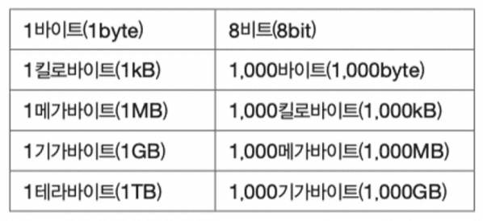
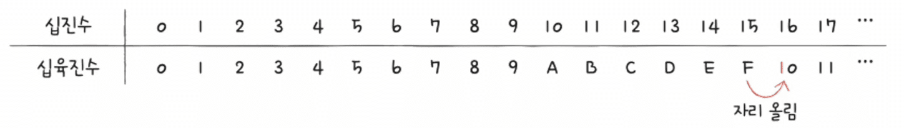

---
layout: single
title: "[CS] 비트와 이진법"
permalink: /104
categories: [All, Spring, 기초]
toc: true
toc_sticky: true
toc_label: index
toc_icon: "fa-solid fa-indent"
author_profile: false
--- 

CS 정리 2P

<div class="cl3"></div>

## bit (비트)

binary digit의 약자로, 컴퓨터에서 정보를 표현하는 가장 작은 단위이다. 

비트는 0(고)과 1(저)의 두 가지 값만 가질 수 있으며, 모든 디지털 데이터는 이러한 비트의 조합으로 이루어진다.

여러 비트가 모여 byte(바이트)를 형성하며, 1바이트는 8비트로 구성된다.

<p align="center" style="margin: 34px 0 34px 0"></p>

### 비트의 역할

**정보 표현**

- 텍스트, 이미지, 오디오, 비디오 등 모든 형태의 데이터는 비트의 조합으로 표현된다.
- 문자 'A'는 01000001 (8비트)로 표현된다.

**연산 수행**

- 컴퓨터의 중앙 처리 장치(CPU)는 비트 단위로 데이터를 처리한다.
- 기본적인 논리 연산(AND, OR, NOT)과 산술 연산(덧셈, 뺄셈 등)을 비트를 이용해 수행한다.

<div class="cl2"></div>

## Binary (이진법)

숫자를 0과 1의 두 가지 숫자로만 표현하는 수 체계이다.

이진법은 컴퓨터와 디지털 시스템의 기본적인 수 체계로, 모든 데이터와 명령어가 이진법을 통해 표현되어 처리된다.

<div class="cl3"></div>

### 이진법의 개념

<p align="center" style="margin: 34px 0 34px 0"></p>

- 이진법은 숫자를 0과 1의 두 가지 상태로 표현한다.
- 각 자릿수는 2의 거듭제곱을 기반으로 한다.
- 이진수의 각 자리 값은 오른쪽에서 왼쪽으로 2^0, 2^1, 2^2, 2^3, ... 순으로 증가한다.
- 이진수 1101의 각 자리 값은 2^3, 2^2, 2^1, 2^0로 각각 8, 4, 2, 1을 나타낸다.

<div class="cl3"></div>

### 이진수 표현 방법

<div class="cl4"></div>

**숫자 변환**

십진수(10진법) 13을 이진수로 변환하는 방법:

- 13을 2로 나누면 몫이 6, 나머지가 1
- 6을 2로 나누면 몫이 3, 나머지가 0
- 3을 2로 나누면 몫이 1, 나머지가 1
- 1을 2로 나누면 몫이 0, 나머지가 1
- 나머지를 역순으로 배열하면 1101이 된다.

<div class="cl3"></div>

**이진수 덧셈**

이진수의 덧셈은 십진수의 덧셈과 유사하지만, 2를 넘으면 자리 올림이 발생한다.

1. 0 + 0 = 0
2. 0  + 1 = 1
3. 1 + 0 = 1
4. 1 + 1 = 10
5. 1 + 1 + 1 = 11

<div class="cl4"></div>

```java
1010
+ 1101
------
10111 (23)
```

- 첫 번째 자리 (오른쪽에서 첫 번째 비트): 0 + 1 = 1
- 두 번째 자리: 1 + 0 = 1
- 세 번째 자리: 0 + 1 = 1
- 네 번째 자리: 1 + 1 = 10

<div class="cl3"></div>

**이진수 뺄셈**

이진수의 뺄셈도 자리 발림을 사용하여 수행된다.

1. 0 - 0 = 0
2. 1 - 0 = 1
3. 1 - 1 = 0
4. 0 - 1 = 1

<div class="cl4"></div>

```java
  1101  (13)
-  1010  (10)
---------
  0011  (3)
```

- 첫 번째 자리: 1 - 0 = 1
- 두 번째 자리: 0 - 1 = 1 (빌림이 필요, 왼쪽 자리에서 1 빌림)
- 세 번째 자리: 1 - 0 = 1 (빌려주기 전에 1 - 1 + 1(빌림) = 1)
- 네 번째 자리: 1 - 1 = 0

<div class="cl3"></div>

**이진법으로 음수를 표현하는 방법**

가장 일반적인 방법은 Two’s Complement(2의 보수) 표현을 사용하는 것이다.

<div class="cl4"></div>

- 양의 이진수를 1의 보수로 변환: 모든 비트를 반전시킨다. (0을 1로, 1을 0으로)
- 1의 보수에 1을 더하여 2의 보수를 구함: 1의 보수에 1을 더한다.

<div class="cl4"></div>

- 예: -3을 2의 보수로 표현
    1. 십진수 3을 이진수로 변환: 3 → 0011
    2. 1의 보수로 변환: 0011 → 1100
    3. 1의 보수에 1을 더함: 1100 + 1 → 1101
    따라서, 4비트 시스템에서 -3은 1101로 표현된다.

<div class="cl3"></div>

**2의 보수를 이용한 덧셈과 뺄셈**

2의 보수를 사용하면 음수와 양수의 덧셈 및 뺄셈을 동일한 방식으로 수행할 수 있다.

<div class="cl4"></div>

```java
  0101 (5)
+ 1101 (-3)
--------
 10010
```

5비트 결과에서 4비트만 취함: 0010 (2)

따라서, 5 + (-3) = 2이다.

<div class="cl3"></div>

**MSB (Most Significant Bit)**

이진수에서 가장 중요한 자리의 비트를 의미한다.

가장 왼쪽에 위치한 비트로, 숫자의 부호(양수 또는 음수)나 크기에 큰 영향을 미친다.

- Sign Bit(부호 비트)
    - 특히 2의 보수 표현에서 MSB는 숫자의 부호를 나타낸다.
    - MSB가 0이면 양수, 1이면 음수이다.
    - 0101 (5)에서 MSB는 0, 따라서 양수이다.
    - 1101 (-3)에서 MSB는 1, 따라서 음수이다.
- 숫자의 크기 결정
    - MSB는 가장 높은 값을 가지는 자리이므로 숫자의 크기를 결정하는 데 큰 영향을 미친다.
    - 예를 들어, 8비트 숫자에서 MSB는 2^7(128)의 값을 가진다.

<div class="cl2"></div>

### 이진법의 활용

<div class="cl4"></div>

**컴퓨터 내부 처리**

- 컴퓨터는 전기적 신호의 두 가지 상태(ON/OFF, 1/0)를 사용하여 데이터를 처리하므로 이진법이 적합하다.
- 모든 데이터(문자, 이미지, 소리 등)는 이진수로 변환되어 처리된다.

<div class="cl3"></div>

**메모리 주소 지정**

- 메모리의 각 주소는 이진수로 표현된다.
- CPU가 메모리의 특정 위치에 접근할 때 이진 주소를 사용한다.

<div class="cl3"></div>

**디지털 통신**

- 네트워크와 통신 시스템에서는 이진수로 데이터를 전송한다.
- 신호를 0과 1로 변환하여 전송하고, 수신 측에서 이를 다시 해석한다.

<div class="cl2"></div>

## 이진법과 다른 수 체계의 변환

<div class="cl4"></div>

**십진수에서 이진수로 변환**

앞서 설명한 대로, 십진수를 2로 나누어 나머지를 구하고 이를 역순으로 배열한다.

<div class="cl3"></div>

**이진수에서 십진수로 변환**

이진수의 각 자리 값을 2의 거듭제곱으로 변환한 후 합산한다.

이진수 1101은 (1 x 2^3) + (1x2^2) + (0x2^1) + (1 x 2^0)

즉  8 + 4 + 0 + 1 = 13이다.

<div class="cl3"></div>

**이진수에서 십육진수로 변환**

이진수를 4자리씩 묶어 각 묶음을 십육진수로 변환한다.

이진수 10101100은 1010(A)와 1100(C)으로 나뉘어 AC(십육진수)가 된다.

<div class="cl3"></div>

**십육진수에서 이진수로 변환**

각 십육진수 자리를 4비트의 이진수로 변환한다.

십육진수 1F는 1(0001)과 F(1111)로 변환되어 00011111이 된다.

<p align="center" style="margin: 34px 0 34px 0"></p>

## 쉽게 알아보는 이진수

<div class="cl3"></div>

<div id="binaryContainer">
    <input type="checkbox" id="in-1-1" />
    <input type="checkbox" id="in-1-2" checked />
    <input type="checkbox" id="in-1-3" />
    <input type="checkbox" id="in-1-4" />
    <input type="checkbox" id="in-1-5" checked />
    <input type="checkbox" id="in-1-6" />
    <input type="checkbox" id="in-1-7" />
    <input type="checkbox" id="in-1-8" /><br />
    <input type="checkbox" id="in-2-1" />
    <input type="checkbox" id="in-2-2" checked />
    <input type="checkbox" id="in-2-3" checked />
    <input type="checkbox" id="in-2-4" />
    <input type="checkbox" id="in-2-5" />
    <input type="checkbox" id="in-2-6" checked />
    <input type="checkbox" id="in-2-7" />
    <input type="checkbox" id="in-2-8" checked /><br />
    <input type="checkbox" id="in-3-1" />
    <input type="checkbox" id="in-3-2" checked />
    <input type="checkbox" id="in-3-3" checked />
    <input type="checkbox" id="in-3-4" />
    <input type="checkbox" id="in-3-5" checked />
    <input type="checkbox" id="in-3-6" checked />
    <input type="checkbox" id="in-3-7" />
    <input type="checkbox" id="in-3-8" /><br />
    <input type="checkbox" id="in-4-1" />
    <input type="checkbox" id="in-4-2" checked />
    <input type="checkbox" id="in-4-3" checked />
    <input type="checkbox" id="in-4-4" />
    <input type="checkbox" id="in-4-5" checked />
    <input type="checkbox" id="in-4-6" checked />
    <input type="checkbox" id="in-4-7" />
    <input type="checkbox" id="in-4-8" /><br />
    <input type="checkbox" id="in-5-1" />
    <input type="checkbox" id="in-5-2" checked />
    <input type="checkbox" id="in-5-3" checked />
    <input type="checkbox" id="in-5-4" />
    <input type="checkbox" id="in-5-5" checked />
    <input type="checkbox" id="in-5-6" checked />
    <input type="checkbox" id="in-5-7" checked />
    <input type="checkbox" id="in-5-8" checked /><br />
    <input type="checkbox" id="in-6-1" />
    <input type="checkbox" id="in-6-2" />
    <input type="checkbox" id="in-6-3" checked />
    <input type="checkbox" id="in-6-4" />
    <input type="checkbox" id="in-6-5" />
    <input type="checkbox" id="in-6-6" />
    <input type="checkbox" id="in-6-7" />
    <input type="checkbox" id="in-6-8" /><br />
    <input type="checkbox" id="in-7-1" />
    <input type="checkbox" id="in-7-2" checked />
    <input type="checkbox" id="in-7-3" />
    <input type="checkbox" id="in-7-4" checked />
    <input type="checkbox" id="in-7-5" />
    <input type="checkbox" id="in-7-6" checked />
    <input type="checkbox" id="in-7-7" checked />
    <input type="checkbox" id="in-7-8" checked /><br />
    <input type="checkbox" id="in-8-1" />
    <input type="checkbox" id="in-8-2" checked />
    <input type="checkbox" id="in-8-3" checked />
    <input type="checkbox" id="in-8-4" />
    <input type="checkbox" id="in-8-5" checked />
    <input type="checkbox" id="in-8-6" checked />
    <input type="checkbox" id="in-8-7" checked />
    <input type="checkbox" id="in-8-8" checked /><br />
    <input type="checkbox" id="in-9-1" />
    <input type="checkbox" id="in-9-2" checked />
    <input type="checkbox" id="in-9-3" checked />
    <input type="checkbox" id="in-9-4" checked />
    <input type="checkbox" id="in-9-5" />
    <input type="checkbox" id="in-9-6" />
    <input type="checkbox" id="in-9-7" checked />
    <input type="checkbox" id="in-9-8" /><br />
    <input type="checkbox" id="in-10-1" />
    <input type="checkbox" id="in-10-2" checked />
    <input type="checkbox" id="in-10-3" checked />
    <input type="checkbox" id="in-10-4" />
    <input type="checkbox" id="in-10-5" checked />
    <input type="checkbox" id="in-10-6" checked />
    <input type="checkbox" id="in-10-7" />
    <input type="checkbox" id="in-10-8" /><br />
    <input type="checkbox" id="in-11-1" />
    <input type="checkbox" id="in-11-2" checked />
    <input type="checkbox" id="in-11-3" checked />
    <input type="checkbox" id="in-11-4" />
    <input type="checkbox" id="in-11-5" />
    <input type="checkbox" id="in-11-6" checked />
    <input type="checkbox" id="in-11-7" />
    <input type="checkbox" id="in-11-8" /><br />
    <!-- <input type="checkbox" id="in-12-1"/>
    <input type="checkbox" id="in-12-2"/>
    <input type="checkbox" id="in-12-3" checked />
    <input type="checkbox" id="in-12-4"/>
    <input type="checkbox" id="in-12-5"/>
    <input type="checkbox" id="in-12-6"/>
    <input type="checkbox" id="in-12-7"/>
    <input type="checkbox" id="in-12-8" checked /><br/> -->
    <section>
      <h1><span class="output-1"></span><span class="output-2"></span><span class="output-3"></span><span
          class="output-4"></span><span class="output-5"></span><span class="output-6"></span><span
          class="output-7"></span><span class="output-8"></span><span class="output-9"></span><span
          class="output-10"></span><span class="output-11"></span><span class="output-12"></span>
      </h1>
    </section>
    <nav>
      <div>
        <label for="in-1-1"></label>
        <label for="in-1-2"></label>
        <label for="in-1-3"></label>
        <label for="in-1-4"></label>
        <label for="in-1-5"></label>
        <label for="in-1-6"></label>
        <label for="in-1-7"></label>
        <label for="in-1-8"></label>
      </div>
      <div>
        <label for="in-2-1"></label>
        <label for="in-2-2"></label>
        <label for="in-2-3"></label>
        <label for="in-2-4"></label>
        <label for="in-2-5"></label>
        <label for="in-2-6"></label>
        <label for="in-2-7"></label>
        <label for="in-2-8"></label>
      </div>
      <div>
        <label for="in-3-1"></label>
        <label for="in-3-2"></label>
        <label for="in-3-3"></label>
        <label for="in-3-4"></label>
        <label for="in-3-5"></label>
        <label for="in-3-6"></label>
        <label for="in-3-7"></label>
        <label for="in-3-8"></label>
      </div>
      <div>
        <label for="in-4-1"></label>
        <label for="in-4-2"></label>
        <label for="in-4-3"></label>
        <label for="in-4-4"></label>
        <label for="in-4-5"></label>
        <label for="in-4-6"></label>
        <label for="in-4-7"></label>
        <label for="in-4-8"></label>
      </div>
      <div>
        <label for="in-5-1"></label>
        <label for="in-5-2"></label>
        <label for="in-5-3"></label>
        <label for="in-5-4"></label>
        <label for="in-5-5"></label>
        <label for="in-5-6"></label>
        <label for="in-5-7"></label>
        <label for="in-5-8"></label>
      </div>
      <div>
        <label for="in-6-1"></label>
        <label for="in-6-2"></label>
        <label for="in-6-3"></label>
        <label for="in-6-4"></label>
        <label for="in-6-5"></label>
        <label for="in-6-6"></label>
        <label for="in-6-7"></label>
        <label for="in-6-8"></label>
      </div>
      <div>
        <label for="in-7-1"></label>
        <label for="in-7-2"></label>
        <label for="in-7-3"></label>
        <label for="in-7-4"></label>
        <label for="in-7-5"></label>
        <label for="in-7-6"></label>
        <label for="in-7-7"></label>
        <label for="in-7-8"></label>
      </div>
      <div>
        <label for="in-8-1"></label>
        <label for="in-8-2"></label>
        <label for="in-8-3"></label>
        <label for="in-8-4"></label>
        <label for="in-8-5"></label>
        <label for="in-8-6"></label>
        <label for="in-8-7"></label>
        <label for="in-8-8"></label>
      </div>
      <div>
        <label for="in-9-1"></label>
        <label for="in-9-2"></label>
        <label for="in-9-3"></label>
        <label for="in-9-4"></label>
        <label for="in-9-5"></label>
        <label for="in-9-6"></label>
        <label for="in-9-7"></label>
        <label for="in-9-8"></label>
      </div>
      <div>
        <label for="in-10-1"></label>
        <label for="in-10-2"></label>
        <label for="in-10-3"></label>
        <label for="in-10-4"></label>
        <label for="in-10-5"></label>
        <label for="in-10-6"></label>
        <label for="in-10-7"></label>
        <label for="in-10-8"></label>
      </div>
      <div>
        <label for="in-11-1"></label>
        <label for="in-11-2"></label>
        <label for="in-11-3"></label>
        <label for="in-11-4"></label>
        <label for="in-11-5"></label>
        <label for="in-11-6"></label>
        <label for="in-11-7"></label>
        <label for="in-11-8"></label>
      </div>
      <!--   <div>
    <label for="in-12-1"></label>
    <label for="in-12-2"></label>
    <label for="in-12-3"></label>
    <label for="in-12-4"></label>
    <label for="in-12-5"></label>
    <label for="in-12-6"></label>
    <label for="in-12-7"></label>
    <label for="in-12-8"></label>
  </div> -->
    </nav>
    <div class="map">
      <div><span>a</span><span>01100001</span></div>
      <div><span>b</span><span>01100010</span></div>
      <div><span>c</span><span>01100011</span></div>
      <div><span>d</span><span>01100100</span></div>
      <div><span>e</span><span>01100101</span></div>
      <div><span>f</span><span>01100110</span></div>
      <div><span>g</span><span>01100111</span></div>
      <div><span>h</span><span>01101000</span></div>
      <div><span>i</span><span>01101001</span></div>
      <div><span>j</span><span>01101010</span></div>
      <div><span>k</span><span>01101011</span></div>
      <div><span>l</span><span>01101100</span></div>
      <div><span>m</span><span>01101101</span></div>
      <div><span>n</span><span>01101110</span></div>
      <div><span>o</span><span>01101111</span></div>
      <div><span>p</span><span>01110000</span></div>
      <div><span>q</span><span>01110001</span></div>
      <div><span>r</span><span>01110010</span></div>
      <div><span>s</span><span>01110011</span></div>
      <div><span>t</span><span>01110100</span></div>
      <div><span>u</span><span>01110101</span></div>
      <div><span>v</span><span>01110110</span></div>
      <div><span>w</span><span>01110111</span></div>
      <div><span>x</span><span>01111000</span></div>
      <div><span>y</span><span>01111001</span></div>
      <div><span>z</span><span>01111010</span></div>
      <div><span>A</span><span>01000001</span></div>
      <div><span>B</span><span>01000010</span></div>
      <div><span>C</span><span>01000011</span></div>
      <div><span>D</span><span>01000100</span></div>
      <div><span>E</span><span>01000101</span></div>
      <div><span>F</span><span>01000110</span></div>
      <div><span>G</span><span>01000111</span></div>
      <div><span>H</span><span>01001000</span></div>
      <div><span>I</span><span>01001001</span></div>
      <div><span>J</span><span>01001010</span></div>
      <div><span>K</span><span>01001011</span></div>
      <div><span>L</span><span>01001100</span></div>
      <div><span>M</span><span>01001101</span></div>
      <div><span>N</span><span>01001110</span></div>
      <div><span>O</span><span>01001111</span></div>
      <div><span>P</span><span>01010000</span></div>
      <div><span>Q</span><span>01010001</span></div>
      <div><span>R</span><span>01010010</span></div>
      <div><span>S</span><span>01010011</span></div>
      <div><span>T</span><span>01010100</span></div>
      <div><span>U</span><span>01010101</span></div>
      <div><span>V</span><span>01010110</span></div>
      <div><span>W</span><span>01010111</span></div>
      <div><span>X</span><span>01011000</span></div>
      <div><span>Y</span><span>01011001</span></div>
      <div><span>Z</span><span>01011010</span></div>
      <div><span>0</span><span>00110000</span></div>
      <div><span>1</span><span>00110001</span></div>
      <div><span>2</span><span>00110010</span></div>
      <div><span>3</span><span>00110011</span></div>
      <div><span>4</span><span>00110100</span></div>
      <div><span>5</span><span>00110101</span></div>
      <div><span>6</span><span>00110110</span></div>
      <div><span>7</span><span>00110111</span></div>
      <div><span>8</span><span>00111000</span></div>
      <div><span>9</span><span>00111001</span></div>
      <div><span> </span><span>00100000</span></div>
      <div><span>!</span><span>00100001</span></div>
      <div><span>&quot;</span><span>00100010</span></div>
      <div><span>#</span><span>00100011</span></div>
      <div><span>$</span><span>00100100</span></div>
      <div><span>%</span><span>00100101</span></div>
      <div><span>&amp;</span><span>00100110</span></div>
      <div><span>'</span><span>00100111</span></div>
      <div><span>(</span><span>00101000</span></div>
      <div><span>)</span><span>00101001</span></div>
      <div><span>*</span><span>00101010</span></div>
      <div><span>+</span><span>00101011</span></div>
      <div><span>,</span><span>00101100</span></div>
      <div><span>-</span><span>00101101</span></div>
      <div><span>.</span><span>00101110</span></div>
      <div><span>/</span><span>00101111</span></div>
      <div><span>:</span><span>00111010</span></div>
      <div><span>;</span><span>00111011</span></div>
      <div><span>&lt;</span><span>00111100</span></div>
      <div><span>=</span><span>00111101</span></div>
      <div><span>&gt;</span><span>00111110</span></div>
      <div><span>?</span><span>00111111</span></div>
      <div><span>@</span><span>01000000</span></div>
      <div><span>[</span><span>01011011</span></div>
      <div><span>\</span><span>01011100</span></div>
      <div><span>]</span><span>01011101</span></div>
      <div><span>^</span><span>01011110</span></div>
      <div><span>_</span><span>01011111</span></div>
      <div><span>`</span><span>01100000</span></div>
      <div><span>{</span><span>01111011</span></div>
      <div><span>|</span><span>01111100</span></div>
      <div><span>}</span><span>01111101</span></div>
      <div><span>~</span><span>01111110</span></div>
    </div>
  </div>

  <div class="cl2"></div>