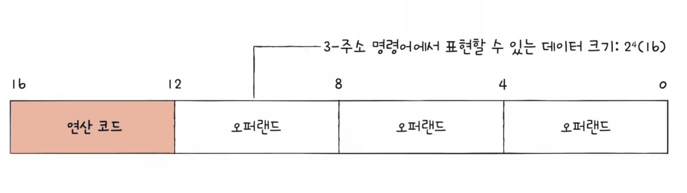
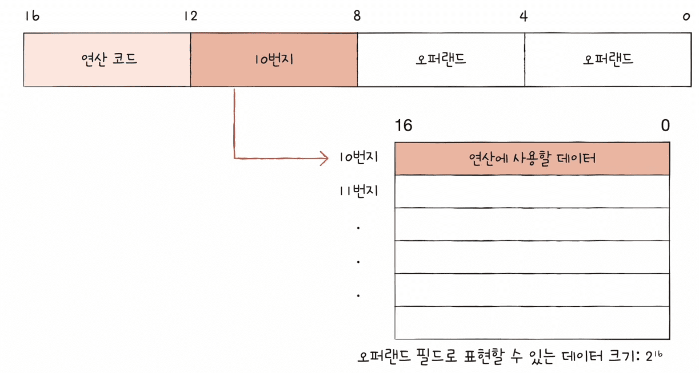

CS 정리 3P 

<div class="cl2"></div>

## Source Code (소스 코드)

소스코드는 프로그래머가 작성하는 프로그램의 텍스트 파일이다.

인간이 이해할 수 있는 프로그래밍 언어로 작성되어 있으며, 컴퓨터가 실행할 수 있는 기계어로 변환되기 전의 코드이다.

<div class="cl3"></div>

### Low-Level Language (저수준 언어)

저수준 언어는 하드웨어와 밀접하게 연관된 프로그래밍 언어로,  기계어와 매우 유사한 형태를 가지고 있다.

<div class="cl4"></div>

이러한 언어는 컴퓨터의 하드웨어 자원을 세밀하게 제어할 수 있으며, 프로그램의 성능 최적화에 유리하다.

그러나 이러한 세밀한 제어는 코드 작성 및 유지보수를 복잡하게 만든다.

<div class="cl4"></div>

예를 들면 기계어(CPU가 직접 이해하고 실행하는 0과 1로 이루어진 이진 코드),

어셈블리어 (기계어의 명령어를 사람이 이해하기 쉬운 기호로 표현한 언어)가 있다.

<div class="cl4"></div>

**특징**

- **하드웨어와 밀접한 연관**: 저수준 언어는 CPU의 명령어 세트와 직접적으로 관련이 있다.
- **고성능**: 세밀한 자원 제어를 통해 성능 최적화가 가능하다.
- **복잡한 개발**: 개발자가 하드웨어 동작을 이해하고 있어야 하며, 코드를 작성하고 디버깅하는 데 시간이 많이 소요된다.
- **플랫폼 종속적**: 특정 하드웨어에 종속적이어서, 다른 플랫폼으로 이식하기 어렵다.

<div class="cl3"></div>

### High-Level Language (고수준 언어)

고수준 언어는 개발자가 하드웨어 세부사항을 신경 쓰지 않고, 논리적인 문제 해결에 집중할 수 있도록 설계된 언어이다.

이러한 언어는 인간이 이해하기 쉬운 문법과 구조를 가지고 있으며, 다양한 추상화를 통해 개발 생산성을 높인다.

<div class="cl4"></div>

예를 들어 C, Python, Java, Js 등의 언어들이 있다.

<div class="cl4"></div>

**특징**

- **추상화 수준이 높음**: 하드웨어 세부사항을 숨기고, 고수준의 개념으로 코드를 작성할 수 있다.
- **개발 생산성**: 코드 작성, 디버깅, 유지보수가 용이하여 빠른 개발이 가능하다.
- **이식성**: 다양한 플랫폼에서 실행될 수 있도록 설계되어 있어, 이식성이 뛰어나다.
- **라이브러리와 프레임워크**: 풍부한 라이브러리와 프레임워크를 제공하여 개발 시간을 단축할 수 있다.

<div class="cl4"></div>

**비교**

| 특징 | 저수준 언어 | 고수준 언어 |
| --- | --- | --- |
| 추상화 수준 | 낮음 | 높음 |
| 성능 | 높음 | 보통 |
| 개발 복잡성 | 높음 | 낮음 |
| 이식성 | 낮음 | 높음 |
| 사용 용도 | 시스템 프로그래밍, 성능 최적화 | 애플리케이션 개발, 빠른 프로토타이핑 |

<div class="cl4"></div>

**결론**

저수준 언어와 고수준 언어는 각기 다른 목적과 용도를 가지고 있다.

저수준 언어는 하드웨어와의 밀접한 제어와 성능 최적화가 필요한 경우에 사용되며,

고수준 언어는 생산성과 이식성이 중요한 애플리케이션 개발에 사용된다.

<div class="cl4"></div>

개발자는 각 언어의 특성과 장단점을 이해하고, 프로젝트의 요구사항에 맞는 언어를 선택하는 것이 중요하다.

<div class="cl4"></div>
---
<div class="cl4"></div>

고수준 언어에서는 컴파일 언어와 인터프리트 언어로 프로그램 코드가 실행되는 방식에 따라 구분되는 두 가지 주요 유형의 프로그래밍 언어로 나뉜다.

각 유형은 소스코드를 어떻게 처리하고 실행하는지에 차이가 있으며, 이에 따라 개발 및 실행 과정에서 여러 장단점이 발생한다.

아래에서 컴파일 언어와 인터프리트 언어에 대해 각각의 특징과 차이점을 설명하겠다.

<div class="cl3"></div>

### Compiled Language (컴파일 언어)

컴파일 언어는 소스코드가 실행되기 전에 컴파일러라는 프로그램을 통해 기계어로 변환되는 언어이다.

컴파일러는 소스코드를 전체적으로 한 번에 읽고, 이를 기계어로 변환하여 실행 파일을 생성한다.

이 실행 파일은 독립적으로 실행될 수 있다.

<div class="cl4"></div>

1. **컴파일 과정**: 소스코드 전체가 컴파일러에 의해 기계어로 변환된다.
컴파일러는 코드의 문법을 검사하고 최적화하며, 오류가 있으면 컴파일 과정에서 알려준다.
2. **실행 파일 생성**: 컴파일된 결과는 독립적인 실행 파일로 생성되며, 이 파일은 운영체제에서 직접 실행될 수 있다.
3. **빠른 실행 속도**: 기계어로 변환된 실행 파일은 CPU가 직접 실행하기 때문에 실행 속도가 빠르다.
4. **디버깅과 수정**: 컴파일 과정에서 발견된 오류는 소스코드를 수정하고 다시 컴파일해야 한다.
이는 수정과 디버깅 과정이 복잡할 수 있다.
5. **플랫폼 종속성**: 컴파일된 실행 파일은 특정 운영체제와 하드웨어에 종속적이다.
다른 플랫폼에서 실행하려면 해당 플랫폼용으로 다시 컴파일해야 한다.

<div class="cl4"></div>

컴파일 언어는 C, C++, Rust, Go 등이 있다.

<div class="cl4"></div>

**컴파일 과정 예시 (C 언어)**

```c
#include <stdio.h>

int main() {
    printf("Hello, World!\n");
    return 0;
}
```

```c
// 컴파일 명령
gcc hello.c -o hello
```

```c
// 생성된 실행 파일
./hello
```

<div class="cl3"></div>

### Interpreted Language (인터프리트 언어)

인터프리트 언어는 소스 코드를 실행할 때 인터프리터라는 프로그램이 한 줄씩 읽고 실행하는 언어이다.

인터프리터는 소스코드를 실시간으로 해석하고 실행하며, 중간에 기계어로 변환된 실행 파일을 생성하지 않는다.

<div class="cl4"></div>

1. **실시간 해석**: 소스코드는 실행할 때 인터프리터에 의해 한 줄씩 읽히고 해석된다.
이를 통해 즉시 실행할 수 있다.
2. **빠른 디버깅과 수정**: 코드의 수정과 테스트가 용이하다. 오류가 발생하면 즉시 수정하고 다시 실행할 수 있다.
3. **느린 실행 속도**: 실행 시마다 소스코드를 해석하기 때문에 컴파일 언어에 비해 실행 속도가 느리다.
4. **이식성**: 소스코드는 인터프리터만 있으면 다양한 플랫폼에서 실행할 수 있다.
5. **종속성**: 소스코드를 실행하기 위해 해당 언어의 인터프리터가 필요하다.

<div class="cl4"></div>

인터프리트 언어로는 Python, JavaScript, Ruby 등이 있다.

<div class="cl4"></div>

**인터프리트 과정 예시 (Python)**

```python
# hello.py
print("Hello, World!")
```

```python
// 실행 명령
python hello.py
```

<div class="cl4"></div>

**차이점 요약**

| 특징 | 컴파일 언어 | 인터프리트 언어 |
| --- | --- | --- |
| 변환 과정 | 소스코드 전체를 기계어로 컴파일 | 소스코드를 한 줄씩 실시간 해석 |
| 실행 파일 | 독립적인 실행 파일 생성 | 별도의 실행 파일 생성 없음 |
| 실행 속도 | 빠름 | 느림 |
| 디버깅 및 수정 | 수정 후 다시 컴파일 필요 | 수정 후 즉시 실행 가능 |
| 이식성 | 플랫폼 종속적 | 플랫폼 독립적 |
| 종속성 | 컴파일러 필요 | 인터프리터 필요 |

<div class="cl3"></div>

### 혼합 접근법

일부 언어는 컴파일과 인터프리트 방식을 혼합하여 사용한다.

예를 들어, Java는 소스코드를 바이트코드로 컴파일하고, JVM이라는 인터프리터가 이 바이트코드를 실행한다.

이 접근법은 실행 속도와 이식성의 장점을 결합하려는 시도이다.

<div class="cl2"></div>

## 명령어 구조

컴퓨터 명령어의 구조는 보통 다음 세 가지 요소로 구성된다.

Opcode(연산코드), Operand(오퍼랜드), Addressing Mode(명령어 주소 지정 방식).

이들은 컴퓨터가 어떤 작업을 수행해야 하는지, 그리고 그 작업을 수행하기 위해 어떤 데이터를 사용해야 하는지를 정의한다.

<div class="cl3"></div>

### Opcode (연산 코드)

연산 코드는 컴퓨터 명령어의 일부로, CPU가 수행해야 할 작업의 종류를 지정하는 코드이다.

연산 코드는 컴퓨터 프로그램의 명령어를 구성하는 중요한 요소로, 명령어가 무엇을 수행해야 하는지를 나타낸다.

연산 코드는 명령어 집합 아키텍처(ISA, Instruction Set Architecture)에 의해 정의되며, 각 CPU는 특정 ISA에 따라 동작한다.

<div class="cl4"></div>

연산 코드 종류에는 데이터 이동 연산, 산술/논리 연산, 제어 흐름 연산, 입출력 제어 등이 있다.

CPU마다 각기 다른 연산 코드의 종류는 링크를 참고하길 바란다. [[바로가기]](https://github.com/kangtegong/self-learning-cs/blob/main/registers/registers.md)

<div class="cl4"></div>

**연산 코드의 구조**

- 연산 코드는 명령어의 첫 번째 부분에 위치하며, 고정된 길이를 가진다.
- 연산 코드는 명령어의 길이에 따라 1바이트 또는 그 이상의 길이를 가질 수 있다.
- 예: x86 아키텍처에서는 연산 코드가 1바이트에서 3바이트까지 다양할 수 있다.

<div class="cl4"></div>

**연산 코드의 역할**

- CPU가 명령어를 해석할 때 가장 먼저 읽는 부분이다.
- CPU는 연산 코드를 해석하여 어떤 연산을 수행할지 결정한다.
- 연산 코드는 명령어의 나머지 부분(오퍼랜드 등)을 어떻게 해석할지도 결정한다.

<div class="cl3"></div>

각 ISA마다 연산 코드와 그 의미가 다르다. 다음은 몇 가지 일반적인 연산 코드의 예시이다.

<div class="cl4"></div>

**데이터 이동 연산**

- `MOV` (Move): 데이터를 한 위치에서 다른 위치로 이동
- `PUSH` (Push): 데이터를 스택에 저장
- `POP` (Pop): 데이터를 스택에서 꺼내기

<div class="cl4"></div>

**산술 연산**

- `ADD` (Add): 두 오퍼랜드를 더하기
- `SUB` (Subtract): 두 오퍼랜드를 빼기
- `MUL` (Multiply): 두 오퍼랜드를 곱하기
- `DIV` (Divide): 두 오퍼랜드를 나누기

<div class="cl4"></div>

**논리 연산**

- `AND` (Logical AND): 비트 단위로 AND 연산 수행
- `OR` (Logical OR): 비트 단위로 OR 연산 수행
- `XOR` (Logical XOR): 비트 단위로 XOR 연산 수행
- `NOT` (Logical NOT): 비트 단위로 NOT 연산 수행

<div class="cl4"></div>

**제어 흐름 연산**

- `JMP` (Jump): 지정된 주소로 무조건 점프
- `JE` (Jump if Equal): 두 값이 같으면 점프
- `JNE` (Jump if Not Equal): 두 값이 다르면 점프
- `CALL` (Call): 서브루틴 호출
- `RET` (Return): 서브루틴에서 복귀

<div class="cl4"></div>

**비교 연산**

- `CMP` (Compare): 두 오퍼랜드를 비교
- `TEST` (Test): AND 연산 후 결과를 비교

<div class="cl3"></div>

**연산 코드의 실행 과정**

1. 명령어 인출 (Fetch)
    - CPU는 메모리에서 다음 명령어를 인출한다.
    - 프로그램 카운터(PC)가 명령어의 주소를 가리킨다.
    <div class="cl4"></div>
2. 명령어 해석 (Decode)
    - 인출된 명령어를 해석하여 연산 코드와 오퍼랜드를 분리한다.
    - 연산 코드를 해석하여 수행할 연산을 결정한다.
    <div class="cl4"></div>
3. 명령어 실행 (Execute)
    - 연산 코드에 따라 CPU가 해당 연산을 수행한다.
    - 오퍼랜드를 사용하여 연산 결과를 계산한다.
    <div class="cl4"></div>
4. 결과 저장 (Store)
    - 연산 결과를 레지스터 또는 메모리에 저장한다.

<div class="cl3"></div>

### Operand (오퍼랜드)

오퍼랜드는 명령어의 기능을 수행하는 데 필요한 실제 데이터를 제공하거나,

데이터를 포함하고 있는 위치를 참조한다.

오퍼랜드는 여러 형태로 존재하며, 각 형태는 특정 주소 지정 방식을 통해 사용된다.

<p align="center" style="margin: 34px 0 34px 0"></p>

**오퍼랜드의 형태**

1. Immediate Value (즉시 값)
    - 오퍼랜드가 명령어 내에 포함된 상수 값이다.
    - CPU가 명령어를 실행할 때 즉시 값을 사용한다.
    - 예시: `MOV R1, 10` (레지스터 R1에 값 10을 저장)
    <div class="cl4"></div>
2. Register (레지스터)
    - 오퍼랜드가 CPU 내부 레지스터를 가리킨다.
    - 레지스터는 고속 접근이 가능하여 빠른 연산에 사용된다.
    - 예시: `ADD R1, R2` (레지스터 R1과 R2의 값을 더함)
    <div class="cl4"></div>
3. Memory Address (메모리 주소)
    - 오퍼랜드가 메모리에 저장된 데이터의 주소를 나타낸다.
    - 메모리 주소는 직접 주소, 간접 주소 등 다양한 방식으로 지정된다.
    - 예시: `LOAD R1, [1000]` (메모리 주소 1000에 있는 값을 레지스터 R1에 로드)

<div class="cl3"></div>

**주소 지정 방식에 따른 오퍼랜드**

오퍼랜드는 주소 지정 방식에 따라 다르게 해석된다.

1. Immediate Addressing (즉시 주소 지정)
    - 오퍼랜드가 명령어 내에 포함된 즉시 값을 나타낸다.
    - 즉시 값은 실행 시점에 바로 사용된다.
    - 예시: `ADD R1, 10` (레지스터 R1에 10을 더함)
    <div class="cl4"></div>
2. Register Addressing (레지스터 주소 지정)
    - 오퍼랜드가 레지스터를 가리킨다.
    - 레지스터의 값이 직접 사용된다
    - 예시: `MOV R1, R2` (레지스터 R2의 값을 레지스터 R1에 복사)
    <div class="cl4"></div>
3. Direct Addressing (직접 주소 지정)
    - 오퍼랜드가 메모리의 특정 주소를 나타낸다.
    - 메모리 주소에 저장된 값이 사용된다.
    - 예시: `LOAD R1, [1000]` (메모리 주소 1000에 있는 값을 레지스터 R1에 로드)
    <div class="cl4"></div>
4. Indirect Addressing (간접 주소 지정)
    - 오퍼랜드가 레지스터나 메모리의 주소를 가리키는 주소를 나타낸다.
    - 실제 데이터는 이 주소가 가리키는 메모리 위치에 있다.
    - 예시: `LOAD R1, [R2]` (레지스터 R2에 저장된 주소에 있는 값을 레지스터 R1에 로드)
    <div class="cl4"></div>
5. Base Addressing (기준 주소 지정)
    - 오퍼랜드가 기준 주소(base address)와 변위(offset)를 사용하여 실제 메모리 주소를 계산한다.
    - 예시: `LOAD R1, 100(R2)` (레지스터 R2의 값에 100을 더한 주소에 있는 값을 레지스터 R1에 로드)
    <div class="cl4"></div>
6. Relative Addressing (상대 주소 지정)
    - 오퍼랜드가 현재 명령어의 주소를 기준으로 상대적인 위치를 나타낸다.
    - 주로 제어 흐름 명령어에서 사용된다.
    - 예시: `JMP 20` (현재 위치에서 20 바이트 떨어진 명령어로 점프)

<div class="cl3"></div>

### Addressing Mode (명령어 주소 지정 방식)

명령어 주소 지정 방식은 명령어가 오퍼랜드를 참조하는 방법을 정의한다.

주소 지정 방식은 CPU가 명령어 내에서 데이터를 어떻게 찾고, 접근하고, 해석할지를 결정한다.

다양한 주소 지정 방식을 통해 명령어는 유연하고 효율적으로 동작할 수 있다.

<p align="center" style="margin: 34px 0 34px 0"></p>

<p align="center" style="margin: 34px 0 34px 0"></p>

위 사진에서 16비트 크기의 명령어가 있다.

연산 코드가 4비트를 차지한다고 하면, 하나의 오퍼랜드가 차지할 수 있는 공간이 4비트밖에 되지 않기 때문에 정보를 16개밖에 표현하지 못한다.

<p align="center" style="margin: 34px 0 34px 0"></p>

이 같은 상황에서 메모리 주소를 할당하면, 표현할 수 있는 데이터의 크기가 커진다.

아래에서 주요 주소 지정 방식에 대해 설명하겠다.

<div class="cl4"></div>

**Immediate Addressing Mode (즉시 주소 지정 방식)**
  - 명령어에 포함된 데이터 자체를 오퍼랜드로 사용하는 방식이다.
  - 오퍼랜드는 명령어의 일부로, 데이터 값이 직접 명령어에 포함된다.
  - 장점: 명령어 자체에 값이 포함되어 있어 빠르고 단순하다.
  - 단점: 데이터 크기가 명령어 크기에 제한된다.
  
  ```nasm
  MOV R1, 10  ; 레지스터 R1에 즉시 값 10을 저장
  ```
    
<div class="cl4"></div>

**Register Addressing Mode (레지스터 주소 지정 방식)**
  - 오퍼랜드가 CPU의 레지스터를 가리키는 방식이다.
  - 빠른 접근 속도로 인해 연산 속도가 빠르다.
  - 장점: 레지스터 접근 속도가 매우 빠르다.
  - 단점: 레지스터의 수가 제한적이다.
  
  ```nasm
  ADD R1, R2  ; 레지스터 R1과 R2의 값을 더함
  ```
  
<div class="cl4"></div>

**Direct Addressing Mode (직접 주소 지정 방식)**
  - 명령어에 포함된 메모리 주소를 통해 오퍼랜드에 접근하는 방식이니다.
  - 오퍼랜드는 메모리 내 특정 주소의 데이터를 가리킨다.
  - 장점: 명령어가 읽기 쉬우며 이해하기 쉽다.
  - 단점: 메모리 접근이 상대적으로 느리다.
  
  ```nasm
  LOAD R1, 1000  ; 메모리 주소 1000의 값을 레지스터 R1에 로드
  ```
    
<div class="cl4"></div>

**Indirect Addressing Mode (간접 주소 지정 방식)**
  - 명령어에 포함된 주소가 가리키는 메모리 주소를 통해 오퍼랜드에 접근하는 방식이다.
  - 주소의 주소를 참조하여 데이터를 가져오는 방식이다.
  - 장점: 메모리 주소의 유연한 참조가 가능하다.
  - 단점: 추가 메모리 접근이 필요하여 상대적으로 느리다.
  
  ```nasm
  LOAD R1, [R2]  ; 레지스터 R2가 가리키는 주소의 값을 레지스터 R1에 로드
  ```

<div class="cl4"></div>
    
**Base Addressing Mode (기준 주소 지정 방식)**
  - 기준 주소(Base Address)와 변위(Offset)를 더하여 실제 메모리 주소를 계산하는 방식이다.
  - 흔히 배열이나 구조체의 특정 요소에 접근할 때 사용된다.
  - 장점: 배열이나 구조체 같은 데이터 구조 접근에 유용하다.
  - 단점: 주소 계산이 필요하여 다소 복잡할 수 있다.

  ```nasm
  LOAD R1, 100(R2)  ; 레지스터 R2의 값에 100을 더한 주소의 값을 레지스터 R1에 로드
  ```
    
<div class="cl4"></div>

**Relative Addressing Mode (상대 주소 지정 방식)**
  - 현재 명령어의 주소를 기준으로 상대적인 위치를 나타내는 방식이다.
  - 주로 제어 흐름 명령어에서 사용된다.
  - 장점: 프로그램 코드의 이동성이 높아진다.
  - 단점: 상대 주소 계산이 필요하다.
  
  ```nasm
  JMP 20  ; 현재 명령어 주소로부터 20 바이트 떨어진 위치로 점프
  ```
    
<div class="cl4"></div>

**Indexed Addressing Mode (인덱스 주소 지정 방식)**
  - 기본 주소와 인덱스 레지스터의 값을 더하여 실제 메모리 주소를 계산하는 방식이다.
  - 배열 처리를 위한 주소 계산에 유용하다.
  - 장점: 반복 구조나 배열 접근에 매우 유용하다.
  - 단점: 인덱스 계산이 필요하다.
  
  ```nasm
  LOAD R1, 1000(R2)  ; 메모리 주소 1000 + 레지스터 R2의 값을 더한 주소의 값을 레지스터 R1에 로드
  ```
    
<div class="cl4"></div>

**Register Indirect Addressing Mode (레지스터 간접 주소 지정 방식)**
  - 레지스터가 가리키는 메모리 주소를 통해 데이터에 접근하는 방식이다.
  
  ```nasm
  MOV R1, [R2]  ; 레지스터 R2가 가리키는 메모리 주소의 값을 레지스터 R1에 복사
  ```

  