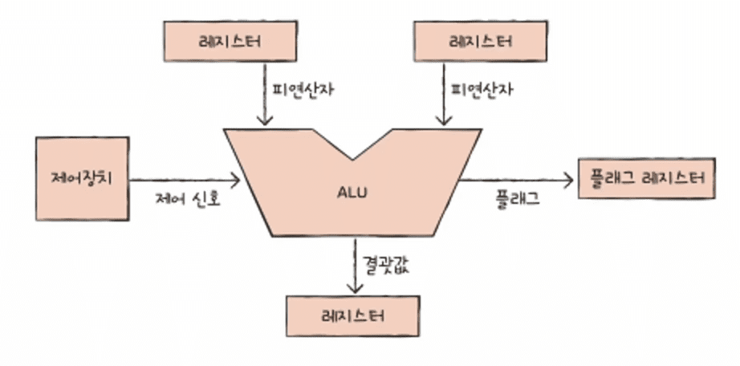
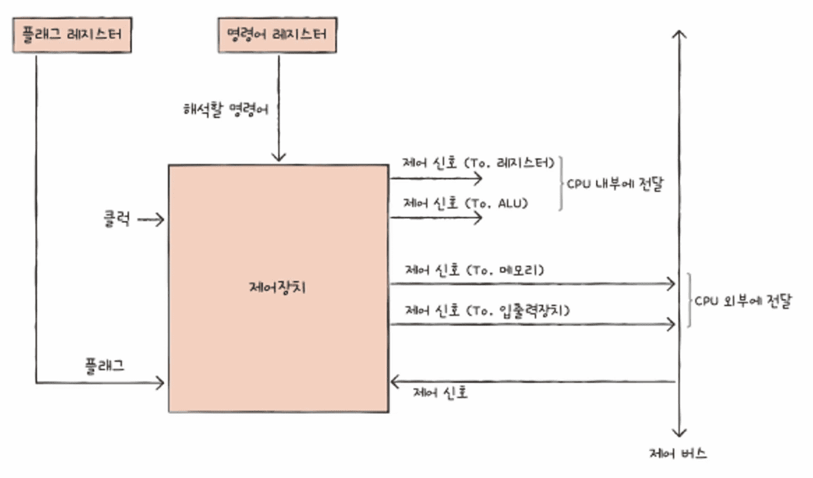
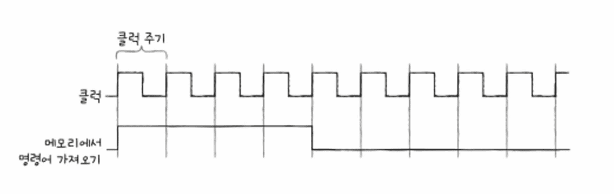
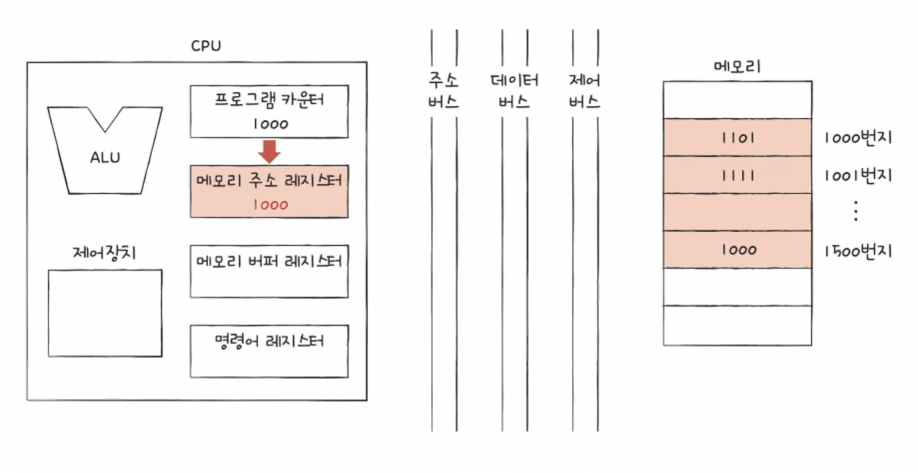
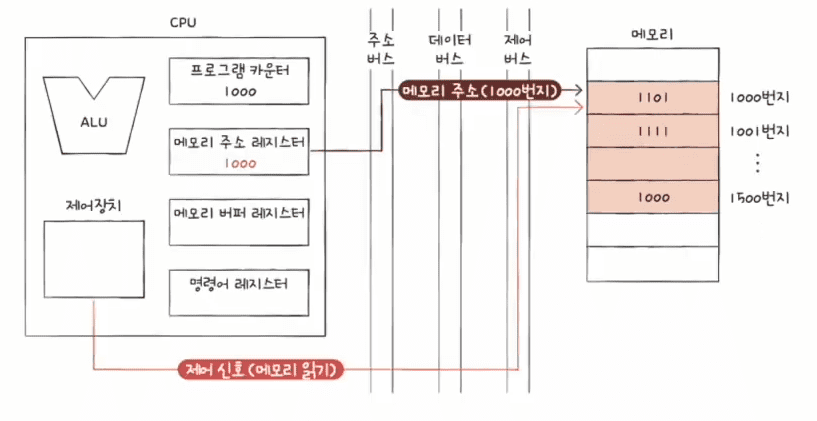
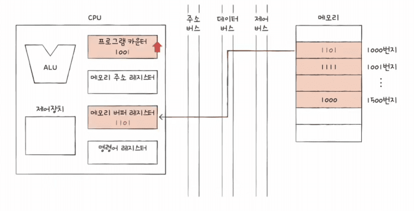
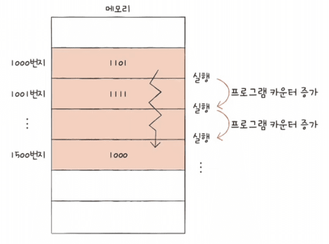
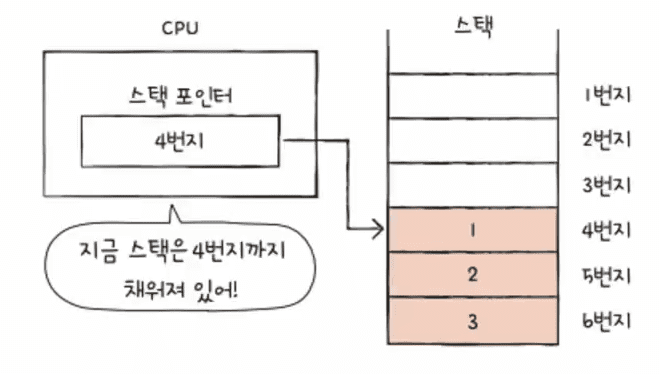
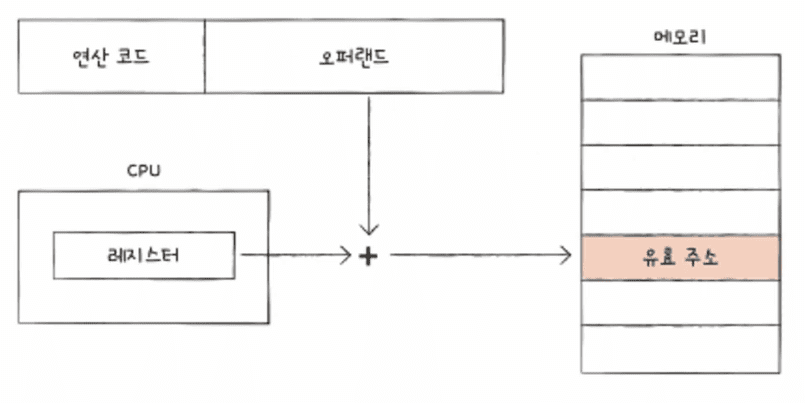

---
layout: single
title: "[CS] ALU, 제어장치 와 레지스터"
permalink: /106
categories: [All, CS, 기초]
toc: true
toc_sticky: true
toc_label: index
toc_icon: "fa-solid fa-indent"
author_profile: false
--- 

CS 정리 4P

## ALU (Arithmetic Logic Unit, 산술논리연산장치)

ALU는 컴퓨너의 중앙 처리 장치(CPU) 내부에서 산술 연산과 논리 연산을 수행하는 핵심 구성 요소이다.

ALU는 CPU가 데이터를 처리하고 명령을 실행하는 데 있어 중요한 역할을 담당한다.

ALU는 피연산자(계산할 값)를 레지스터에서 가져오고, 수행할 연산은 제어장치(Control Unit)로부터 받아오게 된다.

ALU는 이렇게 받아온 피연산자와 제어 신호를 사용하여 계산을 수행하고, 결과값을 레지스터에 임시 저장한다.

결과값을 메모리가 아닌 레지스터에 저장하는 이유는 CPU가 메모리에 접근하는 속도보다 레지스터에 접근하는 속도가 훨씬 빠르기 때문이다.

ALU가 내보내는 정보 중에는 플래그라는 것이 있다.

플래그는 연산 결과에 대한 부가 정보를 포함한다.

플래그는 연산 결과의 상태를 나타내는 비트로, CPU의 상태 레지스터나 플래그 레지스터에 저장된다.

- **Zero Flag (제로 플래그)**: 연산 결과가 0인 경우 설정된다.
- **Sign Flag (부호 플래그)**: 연산 결과가 음수인 경우 설정된다.
- **Carry Flag (캐리 플래그)**: 산술 연산에서 자리올림(캐리)이나 자리내림(버로우)이 발생한 경우 설정된다.
- **Overflow Flag (오버플로우 플래그)**: 산술 연산에서 오버플로우가 발생한 경우 설정된다.

플래그는 프로그램의 흐름 제어(조건부 분기 등)나 오류 검출 등의 목적으로 사용된다.

## Control Unit (제어 장치)

제어 장치는 컴퓨터의 CPU 내에서 중요한 역할을 하는 구성 요소로,

프로그램 명령어를 해석하고 실행하는 과정을 제어한다.

제어 장치는 CPU의 다른 구성 요소들, 예를 들어 ALU, 레지스터, 메모리 등과 협력하여 컴퓨터가 정확하게 작동하도록 지시한다.

### Clock

컴퓨터 시스템, 특히 CPU에서 중요한 역할을 하는 신호로, 모든 작업의 타이밍을 동기화하고,

작업이 언제 시작되고 끝나는지를 결정한다.

클럭은 일정한 주기로 반복되는 전기 신호이며, 이 신호에 따라 CPU가 명령어를 처리한다.

정리하면, 클럭은 컴퓨터의 모든 부품을 일사분란하게 움직일 수 있게 하는 시간 단위이다.

**Clock Signal (클럭 신호)**

클럭 신호는 CPU 내부에서 발생하는 정기적인 전압 변동이다.

이 변동은 디지털 회로가 작동하는 데 필요한 기본적인 타이밍 신호를 제공한다.

클럭 신호는 square wave(직사각형 파형) 형태로, high 상태와 low 상태를 반복한다.

**Clock Cycle (클럭 주기)**

클럭 주기는 클럭 신호가 high 상태에서 low 상태로 돌아가고, 다시 high 상태로 되는 한 사이클을 의미한다.

이 주기는 CPU가 작업을 완료하는 데 걸리는 기본 단위 시간을 정의한다.

클럭 주기 동안 CPU는 특정 작업을 완료할 수 있다.

예를 들어, 한 클럭 주기 동안 명령어의 fetch(인출), decode(해석), execute(실행) 중 하나를 수행할 수 있다.

**Clock Speed (클럭 속도)**

클럭 속도는 1초 동안 발생하는 클럭 주기의 수를 나타내며, 일반적으로 Hz(헤르츠) 단위로 측정된다.

예를 들어, 3GHz 클럭 속도는 1초에 30억 번의 클럭 주기가 발생함을 의미한다.

클럭 속도가 높을수록 CPU는 더 많은 명령어를 더 짧은 시간에 처리할 수 있어, 컴퓨터의 성능이 향상된다.

## Register (레지스터)

CPU 내부에 위치한 소형의 고속 저장 장치로, 컴퓨터가 데이터를 처리하는 동안 필요한 정보를 일시적으로 저장하는 역할을 한다.

레지스터는 메모리보다 훨씬 빠르게 작동하며, CPU가 명령어를 실행할 때 데이터를 즉시 접근하고 조작할 수 있도록 한다.

- **프로그램 카운터**: 메모리에서 읽어 들일 명령어의 주소
- **명령어 레지스터**: 해석할 명령어
- **메모리 주소 레지스터**: 메모리의 주소를 저장
- **메모리 버퍼 레지스터**: 메모리와 주고받을 값 (데이터와 명령어)
- **플래그 레지스터**: 연산 결과 또는 CPU 상태에 대한 부가적인 정보
- **범용 레지스터**: 다양하고 일반적인 상황에서 자유롭게 사용

*순차적인 실행 흐름이 끊기는 경우도 있다.

- 특정 메모리 주소로 실행 흐름을 이동하는 명령어 실행 시 (JUMP, CONDITIONAL JUMP, CALL, RET)
- 인터럽트 발생 시

**스택 포인터**

스택 주소 지정 방식을 사용한다.

스택 포인터는 스택의 꼭대기를 가리키는 레지스터이다.

**베이스 레지스터**

변위 주소 지정 방식을 사용한다.

오퍼랜드 필드의 값(변위)과 특정 레지스터의 값을 더하여 유효 주소를 얻는다. (기준 주소 저장)

