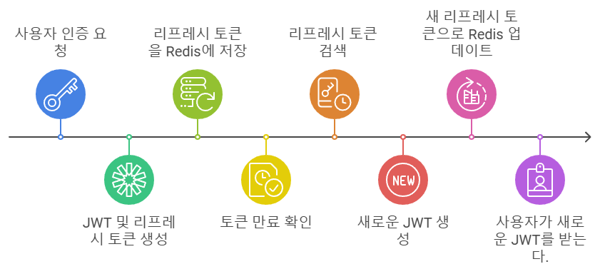

---
layout: single
title: "Redis를 활용한 JWT 리프레시 토큰 관리"
permalink: /107
categories: [All, Spring]
toc: true
toc_sticky: true
toc_label: index
toc_icon: "fa-solid fa-indent"
author_profile: false
--- 

<p align="center" style="margin: 34px 0 34px 0"></p>

## Redis를 사용한 Refresh Token 관리의 장점

Redis는 **인메모리 데이터베이스**로 높은 성능과 확장성을 제공하며,

JWT 기반 인증 시스템에서 Refresh Token을 관리하기에 적합한 도구이다.

<div class="cl3"></div>

**빠른 성능**

Redis는 메모리에 데이터를 저장하기 때문에 I/O 작업이 매우 빠르다.

발급, 검증, 갱신 작업이 빠르게 처리되며, 대규묘 트래픽을 처리할 때에도 성능 저하를 방지할 수 있다.

<div class="cl3"></div>

**만료 시간(TTL) 지원**

Redis는 키에 대해 TTL(Time-To-Live) 설정을 지원한다.

유효기간이 지난 Refresh Token은 자동으로 삭제되어 별도의 만료 처리 로직을 작성할 필요가 없다.

<div class="cl3"></div>

**중앙화된 토큰 관리**

Refresh Token을 Redis에 저장하면 여러 서버에서 동일한 Redis 인스턴스를 참조해 토큰을 관리할 수 있다.

<div class="cl3"></div>

**토큰 무효화 기능**

Redis에 저장된 Refresh Token을 삭제하거나 변경하여 특정 사용자의 토큰을 무효화할 수 있다.

때문에, JWT 단점 중 하나인 서버에서 발급한 토큰을 조기 만료할 수 없는 문제를 보완한다.

<div class="cl3"></div>

**간단한 데이터 구조**

Redis는 키-값 기반 저장소로, Refresh Token 관리에 적합하다.

```java
Key: "refreshToken:<userId>"
Value: "token_value"
TTL: 7 days (604800 seconds)
```

<div class="cl1"></div>

## build.gradle

```java
dependencies {
    implementation 'org.springframework.boot:spring-boot-starter-web'
    implementation 'org.springframework.boot:spring-boot-starter-data-jpa'
    implementation 'org.springframework.boot:spring-boot-starter-validation'
    implementation 'org.springframework.boot:spring-boot-starter-security'

    //JWT
    implementation 'io.jsonwebtoken:jjwt-api:0.11.5'
    implementation 'io.jsonwebtoken:jjwt-impl:0.11.5'
    implementation 'io.jsonwebtoken:jjwt-jackson:0.11.5'
    implementation 'org.springframework.boot:spring-boot-starter-data-redis'

    // db
    implementation 'io.hypersistence:hypersistence-utils-hibernate-60:3.4.1'
    runtimeOnly 'com.h2database:h2'

    // utils
    compileOnly 'org.projectlombok:lombok'
    annotationProcessor 'org.projectlombok:lombok'
    implementation 'org.apache.commons:commons-lang3:3.14.0'
    implementation 'org.apache.commons:commons-collections4:4.4'
    implementation 'org.apache.commons:commons-text:1.12.0'
}
```

<div class="cl3"></div>

## application.yml

```java
spring:
  datasource:
    driver-class-name: org.h2.Driver
    jdbc-url: 'jdbc:h2:mem:test'
    username: sa
    password:
    hikari:
      connection-timeout: 1000
      validation-timeout: 1000
  jpa:
    database-platform: org.hibernate.dialect.H2Dialect
    properties:
      hibernate:
        dialect: org.hibernate.dialect.H2Dialect
        format_sql: true
        hbm2ddl:
          auto: create
  h2:
    console:
      enabled: true
      path: /h2

  redis:
    host: localhost
    port: 6379

jwt:
  header: Authorization
  secret: aaaaaaaaaaaaaaaaaaaaaaaaaaaaaaaaaaaaaaaaaaaaaaaaaaaaaaaaaaaaaaaaaaaaaaaaaaaaa
  token-validity-in-seconds: 1800
  refresh-token-validity-in-seconds: 604800
```

<div class="cl1"></div>

## Redis를 이용한 리프레시 토큰 관리 구현

### RedisRepository

RedisRepository는 Redis에서 데이터를 조회, 저장, 삭제하는 기능을 담당한다.

```java
@Service
@RequiredArgsConstructor
public class RedisRepository {
    private final StringRedisTemplate redisTemplate;

    public String getData(String key) {
        ValueOperations<String, String> valueOperations = redisTemplate.opsForValue();
        return valueOperations.get(key);
    }

    public void setData(String key, String value, Duration duration) {
        ValueOperations<String, String> valueOperations = redisTemplate.opsForValue();
        valueOperations.set(key, value, duration);
    }

    public void deleteData(String key) {
        redisTemplate.delete(key);
    }
}
```

<div class="cl3"></div>

### AuthController (로그인)

```java
@Operation(summary = "로그인", description = "이메일과 비밀번호로 로그인 처리")
@PostMapping("/sign-in")
public ResponseEntity<TokenResponse> signInMember(@Valid @RequestBody LoginRequest loginRequest) {
    TokenResponse tokenResponse = authService.authenticate(loginRequest);
    HttpHeaders httpHeaders = new HttpHeaders();
    httpHeaders.add(JwtFilter.AUTHORIZATION_HEADER, "Bearer " + tokenResponse.getAccessToken());

    return new ResponseEntity<>(tokenResponse, httpHeaders, HttpStatus.OK);
}
```

<div class="cl3"></div>

### AuthService (로그인)

```java
private final RedisRepository redisRepository;
private final TokenProvider tokenProvider;
private final AuthenticationManagerBuilder authenticationManagerBuilder;

public TokenResponse authenticate(LoginRequest loginRequest) {
    UsernamePasswordAuthenticationToken authenticationToken =
        new UsernamePasswordAuthenticationToken(loginRequest.getEmail(), loginRequest.getPassword());

    Authentication authentication = authenticationManagerBuilder.getObject().authenticate(authenticationToken);

    SecurityContextHolder.getContext().setAuthentication(authentication);

    String accessToken = tokenProvider.generateAccessToken(authentication);
    String refreshToken = tokenProvider.generateRefreshToken(authentication);

    redisRepository.setData(loginRequest.getEmail(), refreshToken, Duration.ofDays(7));

    return new TokenResponse(accessToken, refreshToken);
}
```

<div class="cl3"></div>

**사용자 입력값으로 인증 객체 생성**

```java
UsernamePasswordAuthenticationToken authenticationToken =
    new UsernamePasswordAuthenticationToken(loginRequest.getEmail(), loginRequest.getPassword());
```

사용자가 입력한 email과 password를 기반으로 UsernamePasswordAuthenticationToken 객체를 생성한다.

이 객체는 Spring Security에서 사용자 인증을 수행하기 위해 사용하는 토큰 객체이다.

<div class="cl3"></div>

**사용자 인증 수행**

```java
Authentication authentication = authenticationManagerBuilder.getObject().authenticate(authenticationToken);
```

authenticationManagerBuilder는 Spring Security에서 인증을 수행하는 핵심 컴포넌트이다.

authenticate 메서드는 입력받은 authenticationToken을 검증하여 인증된 사용자 정보가 담긴 Authentication 객체를 반환한다.

(검증은 CustomUserDetailsService와 같은 커스텀 로직에 의해 처리된다.)

<div class="cl3"></div>

**인증 정보 SecurityContext에 저장**

```java
SecurityContextHolder.getContext().setAuthentication(authentication);
```

인증된 사용자 정보 (Authentication 객체)를 SecurityContextHolder에 저장한다.

이렇게 저장된 인증 정보는 애플리케이션의 다른 부분에서 사용자의 인증 상태를 확인하거나 권한을 검증하는 데 사용된다.

<div class="cl3"></div>

**JWT 토큰 생성**

```java
String accessToken = tokenProvider.generateAccessToken(authentication);
String refreshToken = tokenProvider.generateRefreshToken(authentication);
```

<div class="cl3"></div>

**리프레시 토큰 Redis에 저장**

```java
redisRepository.setData(loginRequest.getEmail(), refreshToken, Duration.ofDays(7));
```

만료 시간을 7일로 설정했다.

<div class="cl3"></div>

### TokenProvider

```java
@Component
@Slf4j
public class TokenProvider implements InitializingBean {
    private static final String AUTHORITIES_KEY = "auth";
    private final String secret;
    private final long tokenValidityInMilliseconds;
    private final long refreshTokenValidityInMilliseconds;
    private Key key;

    public TokenProvider(
        @Value("${jwt.secret}") String secret,
        @Value("${jwt.token-validity-in-seconds}") long tokenValidityInMilliseconds,
        @Value("${jwt.refresh-token-validity-in-seconds}") long refreshTokenValidityInMilliseconds
    ) {
        this.secret = secret;
        this.tokenValidityInMilliseconds = tokenValidityInMilliseconds * 1000;
        this.refreshTokenValidityInMilliseconds = refreshTokenValidityInMilliseconds * 1000;
    }

    @Override
    public void afterPropertiesSet() {
        try {
            byte[] keyBytes = Decoders.BASE64.decode(secret);
            this.key = Keys.hmacShaKeyFor(keyBytes);
        }
        catch (IllegalArgumentException e) {
            log.error("Error decoding secret key: ", e);
            throw new IllegalArgumentException("Invalid Base64 Key", e);
        }
    }

    public String generateAccessToken(Authentication authentication) {
        String authorities = authentication.getAuthorities().stream()
            .map(GrantedAuthority::getAuthority)
            .collect(Collectors.joining(","));

        long now = (new Date()).getTime();
        Date validity = new Date(now + this.tokenValidityInMilliseconds);

        return Jwts.builder()
            .setSubject(authentication.getName())
            .claim(AUTHORITIES_KEY, authorities)
            .signWith(key, SignatureAlgorithm.HS512)
            .setExpiration(validity)
            .compact();
    }

    // 리프레시 토큰은 인증 정보 재발급에만 사용이 되므로 권한을 포함하고 있지 않아도 됨.
    public String generateRefreshToken(Authentication authentication) {
        long now = (new Date()).getTime();
        Date validity = new Date(now + refreshTokenValidityInMilliseconds);

        return Jwts.builder()
            .setSubject(authentication.getName())
            .setExpiration(validity)
            .signWith(key, SignatureAlgorithm.HS512)
            .compact();
    }

    public Authentication getAuthentication(String token) {
        Claims claims = Jwts
            .parserBuilder()
            .setSigningKey(key)
            .build()
            .parseClaimsJws(token)
            .getBody();

        Collection<? extends GrantedAuthority> authorities = new ArrayList<>();
        if (claims.containsKey(AUTHORITIES_KEY)) {
            authorities = Arrays.stream(claims.get(AUTHORITIES_KEY).toString().split(","))
                .map(SimpleGrantedAuthority::new)
                .collect(Collectors.toList());
        }

        // User(member) Entity가 아닌 security.core.userdetails의 User임
        User principal = new User(claims.getSubject(), "", authorities);

        return new UsernamePasswordAuthenticationToken(principal, token, authorities);
    }

    public Claims getUserInfoFromToken(String token) {
        try {
            return Jwts.parserBuilder()
                .setSigningKey(key)
                .build()
                .parseClaimsJws(token)
                .getBody();
        }
        // 만료된 경우 Claims에서 정보 추출
        catch (ExpiredJwtException e) {
            log.info("Token is expired, retrieving claims from expired token.");
            return e.getClaims();
        }
    }

    // 검증
    public boolean validateToken(String token) {
        try {
            Jwts.parserBuilder()
                .setSigningKey(key)
                .build()
                .parseClaimsJws(token);
            return true;
        }
        catch (ExpiredJwtException e) {
            log.warn("만료된 JWT 토큰입니다.");
            return false;
        }
        catch (UnsupportedJwtException e) {
            log.warn("지원되지 않는 JWT 토큰입니다.");
            return false;
        }
        catch (MalformedJwtException e) {
            log.warn("JWT 토큰이 잘못되었습니다.");
            return false;
        }
        catch (SecurityException e) {
            log.warn("잘못된 JWT 서명입니다.");
            return false;
        }
        catch (IllegalArgumentException e) {
            log.error("잘못된 JWT 입력값이 제공되었습니다.");
            return false;
        }
    }
}

```

**afterPropertiesSet**

@Value로 주입된 secret 값을 디코딩하여 HMAC 키를 초기화

secret을 Base64로 디코딩 후 HmacSHA 알고리즘에 맞는 키 객체 생성

<div class="cl3"></div>

**generateAccessToken, generateRefreshToken**

인증 정보를 기반으로 액세스, 리프레시 토큰 생성

액세스 토큰은 권한 정보(Authorities)를 포함하며,

리프레시 토큰은 권한 정보(Authorities)를 포함하지 않음

<div class="cl3"></div>

**getAuthentication**

JWT 토큰에서 인증 정보(Authentication 추출)
Spring Security의 `UsernamePasswordAuthenticationToken`을 생성하여 반환.

<div class="cl3"></div>

**getUserInfoFromToken**

JWT 토큰의 클레임에서 사용자 정보를 추출

만료된 토큰이라도 클레임 정보를 추출할 수 있음

예외 발생 시 만료된 토큰의 Claims 객체 반환

<div class="cl3"></div>

**validateToken**

JWT 토큰의 유효성 검증

<div class="cl3"></div>

### AuthController (리프레시 토큰)

```java
@Operation(
    summary = "액세스 토큰 갱신",
    description = "리프레시 토큰을 이용해 만료된 액세스 토큰을 갱신함."
)
@PostMapping("/refresh")
public ResponseEntity<TokenResponse> refreshAccessToken(@RequestHeader("AccessToken") String accessTokenHeader,
                                                        @RequestHeader("RefreshToken") String refreshTokenHeader) {
    String accessToken = accessTokenHeader.replace("Bearer ", "");
    String refreshToken = refreshTokenHeader.replace("Bearer ", "");
    TokenResponse tokenResponse = authService.refreshAccessToken(accessToken, refreshToken);

    return ResponseEntity.ok(tokenResponse);
}
```

<div class="cl3"></div>

### AuthService (리프레시 토큰)

```java
public TokenResponse refreshAccessToken(String accessToken, String refreshToken) throws IOException {
  if (!tokenProvider.validateToken(accessToken)) {
      throw new BusinessLogicException(ExceptionCode.INVALID_ACCESS_TOKEN);
  }

  String email = tokenProvider.getUserInfoFromToken(accessToken).getSubject();
  String refreshTokenFromRedis = redisRepository.getData(email);

  if (refreshTokenFromRedis == null || !refreshTokenFromRedis.equals(refreshToken)) {
      throw new BusinessLogicException(ExceptionCode.INVALID_REFRESH_TOKEN);
  }

  Authentication authentication = tokenProvider.getAuthentication(accessToken);
  String newAccessToken = tokenProvider.generateAccessToken(authentication);

  return new TokenResponse(newAccessToken, refreshToken);
}
```

<div class="cl3"></div>

**액세스 토큰 검증**

```java
if (!tokenProvider.validateToken(accessToken)) {
    throw new BusinessLogicException(ExceptionCode.INVALID_ACCESS_TOKEN);
}
```

토큰의 구조 및 서명을 검증하여 유효성을 판단한다.

유효하지 않은 경우, 예외를 발생시긴다.

<div class="cl3"></div>

**액세스 토큰에서 사용자 정보 추출**

```java
String email = tokenProvider.getUserInfoFromToken(accessToken).getSubject();
```

액세스 토큰에서 사용자 정보를 추출한다. (email)

추출한 정보를 이후 Redis에서 저장된 리프레시 토큰을 조회하는 데 사용한다.

<div class="cl3"></div>

**Redis에서 리프레시 토큰 조회**

```java
String refreshTokenFromRedis = redisRepository.getData(email);
```

<div class="cl3"></div>

**리프레시 토큰 검증**

```java
if (refreshTokenFromRedis == null || !refreshTokenFromRedis.equals(refreshToken)) {
    throw new BusinessLogicException(ExceptionCode.INVALID_REFRESH_TOKEN);
}
```

Redis에 저장된 리프레시 토큰이 없거나, 클라이언트가 제공한 토큰과 일치하지 않는 경우 예외를 발생시킨다.

<div class="cl3"></div>

**사용자 인증 정보 추출**

```java
Authentication authentication = tokenProvider.getAuthentication(accessToken);
```

기존의 액세스 토큰에서 인증 정보를 추출한다.

Spring Security의 Authentication 객체를 반환하며, 이는 새로운 액세스 토큰을 생성하는 데 사용된다.

<div class="cl2"></div>

Redis를 활용하여 JWT 리프레시 토큰을 관리하면 속도와 확장성 면에서 효율적이다.

특히 TTL 기능을 활용해 수동 관리 부담을 줄이고, 시스템 보안과 사용자 경험을 모두 개선할 수 있다.

위 글에 상세하게 나와있지 않은 코드들은 아래 레포지토리에서 확인 가능하다.

[https://github.com/Genshin-Flow/GenshinFlow_Be](https://github.com/Genshin-Flow/GenshinFlow_Be)\

<div class="cl2"></div>