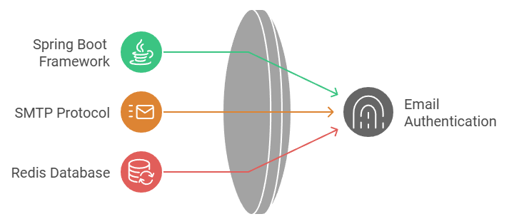
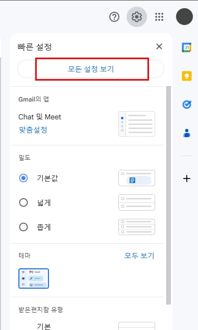
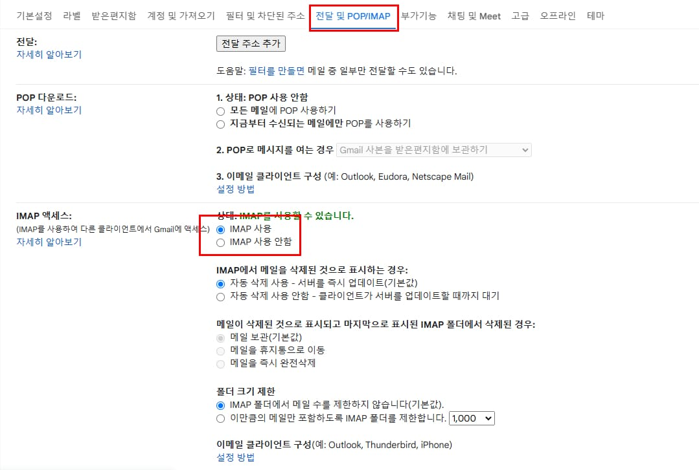
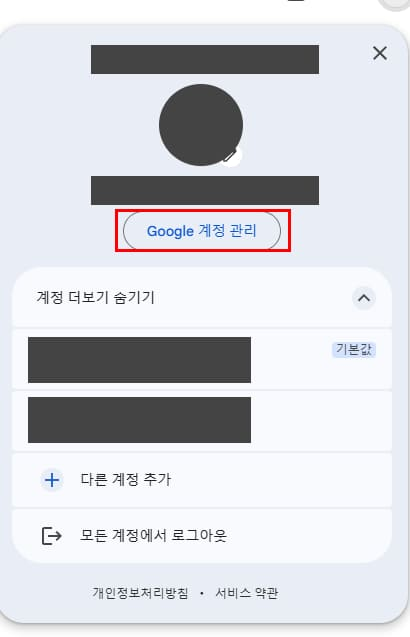
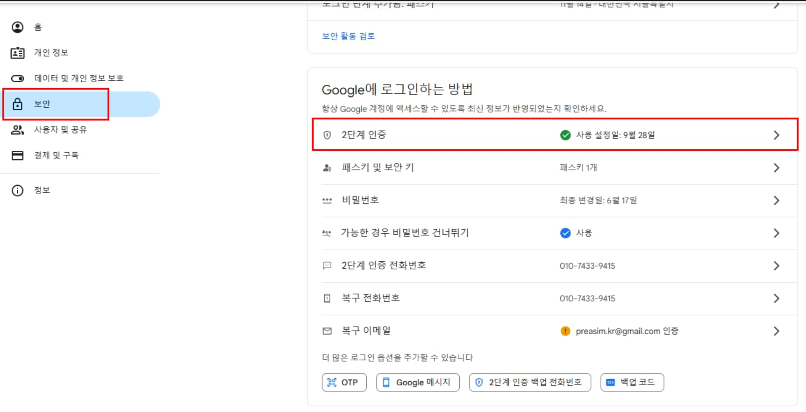
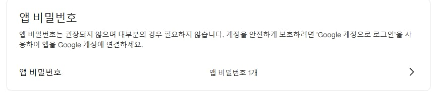
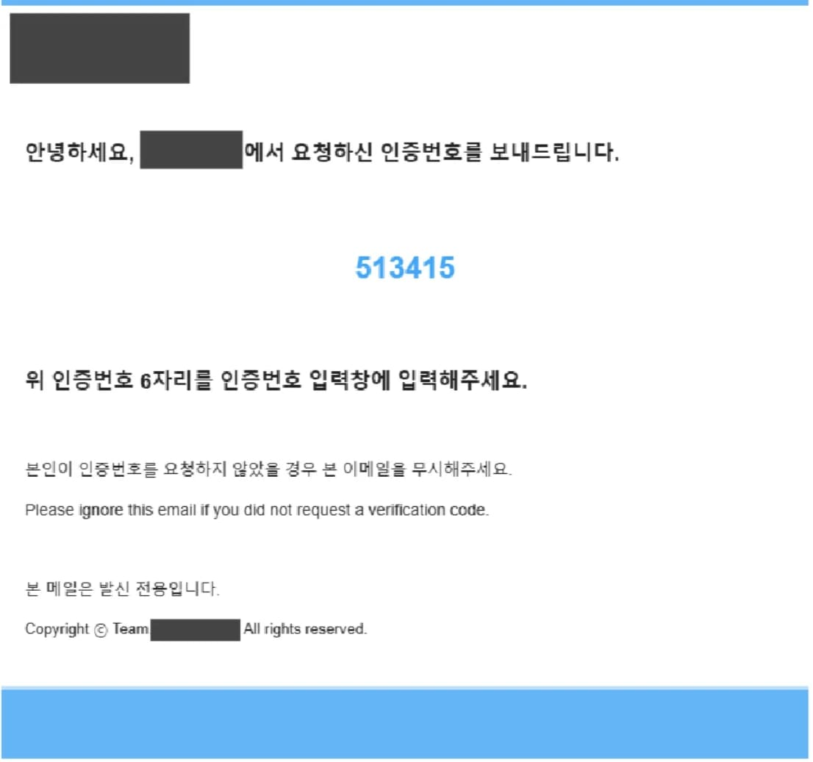

---
layout: single
title: "Spring Boot 이메일 인증 (SMTP, Redis)"
permalink: /Spring-Boot-이메일-인증-SMTP-Redis
categories: [All, Spring]
toc: true
toc_sticky: true
toc_label: index
toc_icon: "fa-solid fa-indent"
author_profile: false
--- 

## Redis를 사용하는 이유

<p align="center" style="margin: 34px 0 34px 0"></p>

이메일 인증 기능에서 Redis를 사용하는 이유는 **속도**, **효율성**, **간편한 데이터 관리**에 있다.

<div class="cl3"></div>

Redis는 인메모리 데이터베이스로, 디스크 기반 데이터베이스보다 읽기와 쓰기 속도가 훨씬 빠르다.

이로 인해 인증번호와 같은 **일시적인 데이터**를 저장하고 검증하는 작업을 매우 빠르게 처리할 수 있다.

<div class="cl3"></div>

또한, Redis는 **TTL(Time-To-Live)** 설정을 지원하여 데이터에 유효 기간을 지정할 수 있다.

유효 기간이 지나면 데이터가 자동으로 삭제되므로, **보안성이 강화**되고 **불필요한 데이터의 누적**을 방지할 수 있다.

<div class="cl3"></div>

Redis는 **Key-Value 저장소**로 설계되어 단순한 데이터 구조를 가지고 있으며,

**클러스터링**과 **복제(replication)** 기능을 통해 장애 발생 시에도 데이터를 안전하게 관리할 수 있다.

<div class="cl3"></div>

결론적으로, Redis는 인증번호처럼 **짧은 수명**과 **빠른 검증**이 요구되는 데이터 관리에 **최적화된 선택**이다.

<div class="cl1"></div>

## Gmail SMTP 설정

1.Gmail로 접속하여 우측 상단의 톱니바퀴를 클릭하고 모든 설정 보기에 들어간다.

<p align="center" style="margin: 34px 0 34px 0"></p>

<div class="cl3"></div>

2.전달 및 POP/IMAP에 들어가서 하단의 IMAP 사용을 선택한다.

<p align="center" style="margin: 34px 0 34px 0"></p>

<div class="cl3"></div>

3.구글 계정 관리로 들어간다.

<p align="center" style="margin: 34px 0 34px 0"></p>

<div class="cl3"></div>

4.보안 탭에 들어가 2단계 인증을 선택한다.

<p align="center" style="margin: 34px 0 34px 0"></p>

<div class="cl3"></div>

5.하단으로 내려가 앱 비밀번호를 생성한다. 
  앱 비밀번호 이름은 원하는 대로 작명하고 해당 비밀번호는 꼭 기억해두어야 한다.
    
<p align="center" style="margin: 34px 0 34px 0"></p>
    

<div class="cl1"></div>

## Config

### build.gradle

```java
implementation 'org.springframework.boot:spring-boot-starter-mail'
implementation 'org.springframework.boot:spring-boot-starter-data-redis'
```

<div class="cl3"></div>

### Application.yml

```java
  mail:
    host: smtp.gmail.com
    username: {이메일 주소}
    password: {앱 비밀번호}
    properties:
      mail.smtp.auth: true
      mail.smtp.starttls.enable: true

  redis:
    host: localhost
    port: 6379
```

<div class="cl1"></div>

## 이메일 인증 기능 구현

### EmailConfig

```java
import org.springframework.beans.factory.annotation.Value;
import org.springframework.context.annotation.Bean;
import org.springframework.context.annotation.Configuration;
import org.springframework.mail.javamail.JavaMailSender;
import org.springframework.mail.javamail.JavaMailSenderImpl;

import java.util.Properties;

@Configuration
public class EmailConfig {
    @Value("${spring.mail.username}")
    private String username;

    @Value("${spring.mail.password}")
    private String password;

    @Bean
    public JavaMailSender mailSender() {
        JavaMailSenderImpl mailSender = new JavaMailSenderImpl();
        mailSender.setHost("smtp.gmail.com");
        mailSender.setPort(587);
        mailSender.setUsername(username);
        mailSender.setPassword(password);

        Properties javaMailProperties = new Properties();
        javaMailProperties.put("mail.transport.protocol", "smtp");
        javaMailProperties.put("mail.smtp.auth", "true");
        javaMailProperties.put("mail.smtp.socketFactory.class", "javax.net.ssl.SSLSocketFactory");
        javaMailProperties.put("mail.smtp.starttls.enable", "true");
        javaMailProperties.put("mail.debug", "true");
        javaMailProperties.put("mail.smtp.ssl.trust", "smtp.gmail.com");
        javaMailProperties.put("mail.smtp.ssl.protocols", "TLSv1.3");

        mailSender.setJavaMailProperties(javaMailProperties);
        return mailSender;
    }
}
```

<div class="cl3"></div>

### RedisConfig

```java
import lombok.RequiredArgsConstructor;
import org.springframework.beans.factory.annotation.Value;
import org.springframework.context.annotation.Bean;
import org.springframework.context.annotation.Configuration;
import org.springframework.data.redis.connection.RedisConnectionFactory;
import org.springframework.data.redis.connection.lettuce.LettuceConnectionFactory;
import org.springframework.data.redis.core.RedisTemplate;
import org.springframework.data.redis.repository.configuration.EnableRedisRepositories;
import org.springframework.data.redis.serializer.StringRedisSerializer;

@EnableRedisRepositories
@RequiredArgsConstructor
@Configuration
public class RedisConfig {
    @Value("${spring.redis.host}")
    private String host;

    @Value("${spring.redis.port}")
    private Integer port;

    @Bean
    public RedisConnectionFactory redisConnectionFactory() {
        return new LettuceConnectionFactory(host, port);
    }

    @Bean
    public RedisTemplate<String, String> redisTemplate() {
        RedisTemplate<String, String> redisTemplate = new RedisTemplate<>();
        redisTemplate.setKeySerializer(new StringRedisSerializer());
        redisTemplate.setValueSerializer(new StringRedisSerializer());
        redisTemplate.setConnectionFactory(redisConnectionFactory());

        return redisTemplate;
    }
}

```

<div class="cl3"></div>

### RedisRepository

```java
import lombok.RequiredArgsConstructor;
import org.springframework.data.redis.core.StringRedisTemplate;
import org.springframework.data.redis.core.ValueOperations;
import org.springframework.stereotype.Service;

import java.time.Duration;

@Service
@RequiredArgsConstructor
public class RedisRepository {
    private final StringRedisTemplate redisTemplate;

    public String getData(String key) {
        ValueOperations<String, String> valueOperations = redisTemplate.opsForValue();
        return valueOperations.get(key);
    }

    public void setData(String key, String value, Duration duration) {
        ValueOperations<String, String> valueOperations = redisTemplate.opsForValue();
        valueOperations.set(key, value, duration);
    }

    public void deleteData(String key) {
        redisTemplate.delete(key);
    }
}
```

<div class="cl3"></div>

### MailSendService

```java
import com.next.genshinflow.exception.BusinessLogicException;
import com.next.genshinflow.exception.ExceptionCode;
import com.next.genshinflow.domain.user.repository.RedisRepository;
import jakarta.mail.MessagingException;
import jakarta.mail.internet.MimeMessage;
import lombok.AllArgsConstructor;
import org.springframework.core.io.ClassPathResource;
import org.springframework.mail.javamail.JavaMailSender;
import org.springframework.mail.javamail.MimeMessageHelper;
import org.springframework.stereotype.Service;

import java.nio.charset.StandardCharsets;
import java.nio.file.Files;
import java.nio.file.Paths;
import java.security.SecureRandom;
import java.time.Duration;

@Service
@AllArgsConstructor
public class MailSendService {
    private JavaMailSender mailSender;
    private RedisRepository redisRepository;
    private static final long AUTH_NUM_EXPIRE_TIME = 60L;

    public String generateAuthCode() {
        SecureRandom randomGenerator = new SecureRandom();
        StringBuilder randomNum = new StringBuilder();

        for (int i = 0; i < 6; i++) {
            randomNum.append(randomGenerator.nextInt(10));
        }

        return randomNum.toString();
    }

    public String sendVerificationEmail(String email) {
        String authNum = generateAuthCode();
        String fromMail = "발신 메일";
        String toMail = email;
        String title = "메일 제목";
        String content = loadEmailTemplate().replace("{{authNum}}", authNum);

        sendEmail(fromMail, toMail, title, content, authNum);
        return authNum;
    }

    private String loadEmailTemplate() {
        try {
            ClassPathResource resource = new ClassPathResource("EmailSend.html");
            return Files.readString(Paths.get(resource.getURI()), StandardCharsets.UTF_8);
        }
        catch (Exception e) {
            throw new RuntimeException("Failed to read HTML template", e);
        }
    }

    public void sendEmail(String fromMail, String toMail, String title, String content, String authNum) {
        MimeMessage message = mailSender.createMimeMessage();

        try {
            MimeMessageHelper helper = new MimeMessageHelper(message, true, "utf-8");
            helper.setFrom(fromMail);
            helper.setTo(toMail);
            helper.setSubject(title);
            helper.setText(content, true);

            mailSender.send(message);
        }
        catch (MessagingException e) {
            throw new RuntimeException("Failed to send email", e);
        }

        // 인증번호는 1분동안 유효함
        redisRepository.setData(authNum, toMail, Duration.ofSeconds(AUTH_NUM_EXPIRE_TIME));
    }

    public void verifyAuthCode(String email, String authNum) {
        String storedEmail = redisRepository.getData(authNum);

        if (storedEmail.equals(email)) {
            redisRepository.deleteData(authNum);
        }
        else {
            throw new BusinessLogicException(ExceptionCode.INVALID_AUTH_CODE);
        }
    }
}

```

<div class="cl4"></div>

**generateAuthCode()**

SecureRandom 클래스를 사용해 보안성이 높은 6자리 랜덤 난수를 생성한다.

ThreadLocalRandom 혹은 SecureRandom 를 사용하는 것이 좋으며,

Java 7부터는 Random은 사용하지 않는 것이 좋다. ([https://developer-cheol.tistory.com/86](https://developer-cheol.tistory.com/86) 참고)

<div class="cl3"></div>

**sendVerificationEmail(String email)**

generateAuthCode()를 호출하여 인증번호를 생성하고,

이메일 템플릿 파일(EmailSend.html)을 읽어 인증번호를 포함한 이메일 콘텐츠를 생성해서

sendEmail 메서드를 호출해 이메일을 발송한다.

<div class="cl3"></div>

**loadEmailTemplate()**

ClassPathResource를 사용해 resources 폴더의 Email.html 파일을 읽어온다.

<div class="cl3"></div>

**sendEmail(String fromMail, String toMail, String title, String content, String authNum)**

이메일을 실제로 발송하고, Redis에 인증번호와 이메일을 저장한다.

<div class="cl3"></div>

**verifyAuthCode(String email, String authNum)**

사용자가 제공한 인증번호와 Redis에 저장된 데이터를 검증한다.

입력받은 이메일, 인증코드와 Redis에 저장된 이메일, 인증코드가 일치하면 통과 후 redis에 저장된 값 삭제

만일 일치하지 않으면 예외를 발생시켜 실패 처리를 한다.

<div class="cl2"></div>

### EmailSend.html

```java
<!DOCTYPE html>
<html lang="ko">

<head>
    <meta charset="UTF-8">
    <meta name="viewport" content="width=device-width, initial-scale=1.0">
    <title>Document</title>
</head>
<body>
<div style="display: block; max-width: 700px; margin: 0 auto;">

    <header style="width: 100%; border-top: solid 6px #64b5f6;">
        
    </header>

    <div style="padding: 0 20px;">
        <p style="font-size: 18px; font-weight: 700; margin-top: 40px;">안녕하세요, <span style="color: #42a5f5;"> aaa 에서 요청하신 인증번호를 보내드립니다.</p>

        <h1 style="text-align: center; padding: 48px 0; color: #42a5f5;">{{authNum}}</h1>

        <p style="font-size: 18px; font-weight: 700;">위 인증번호 6자리를 인증번호 입력창에 입력해주세요.</p>

        <p style="padding-top: 34px; font-size: 14px;">본인이 인증번호를 요청하지 않았을 경우 본 이메일을 무시해주세요.</p>
        <p style="font-size: 14px;">Please ignore this email if you did not request a verification code.</p>

        <p style="padding-top: 34px; font-size: 14px;">본 메일은 발신 전용입니다.</p>
        <p style="margin-bottom: 40px;">Copyright ⓒ Team. 팀이름 All rights reserved.</p>
    </div>

    <footer style="height: 60px; background-color: #64b5f6; border-top: 3px solid #bbdefb;"></footer>
</div>
</body>

</html>
```

<div class="cl4"></div>

이메일 템플릿이다. resources 폴더 내부에 위치해있다.

<div class="cl3"></div>

### MailRequestDto

```java
@Getter
public class MailRequest {
    @Schema(description = "사용자 이메일", type = "String", example = "user@example.com")
    @Email
    @NotEmpty(message = "이메일을 입력해 주세요")
    private String email;
}
```

<div class="cl3"></div>

### 인증코드 발송 Controller

```java
@PostMapping("/verification-code/send")
public ResponseEntity<Void> sendVerificationCode(@RequestBody @Valid MailRequest mailRequest) {
    mailSendService.sendVerificationEmail(mailRequest.getEmail());
    return ResponseEntity.ok().build();
}
```

<div class="cl3"></div>

### 결과

<p align="center" style="margin: 34px 0 34px 0"></p>

이제 인증코드 발송에 성공했으면 인증 코드를 verifyAuthCode()를 호출해 Redis에 저장된 값과 검증 하면 된다.

<div class="cl3"></div>

### 인증 코드 검증 예시

아래는 회원가입 service 로직이다.

verifyAuthCode() 메서드를 호출하여 입력된 이메일과 인증번호를 Redis에 저장된 값과 비교한다.

값이 일치하지 않을 경우, 예외가 발생하며 로직이 중단된다.

<div class="cl4"></div>

```java
public MemberResponse createMember(SignUpRequest signUpRequest) {
    mailSendService.verifyAuthCode(signUpRequest.getEmail(), signUpRequest.getAuthNum());
    verifyExistEmail(signUpRequest.getEmail());

    UserInfoResponse apiResponse = getUserInfoFromApi(signUpRequest.getUid());

    MemberEntity member = buildMemberEntity(signUpRequest, apiResponse, Role.USER);
    MemberEntity savedMember = memberRepository.save(member);

    return MemberMapper.memberToResponse(savedMember);
}
```

<div class="cl2"></div>

위 글에 상세하게 나와있지 않은 코드들은 아래 레포지토리에서 확인 가능하다.

[https://github.com/Genshin-Flow/GenshinFlow_Be](https://github.com/Genshin-Flow/GenshinFlow_Be)

<div class="cl2"></div>