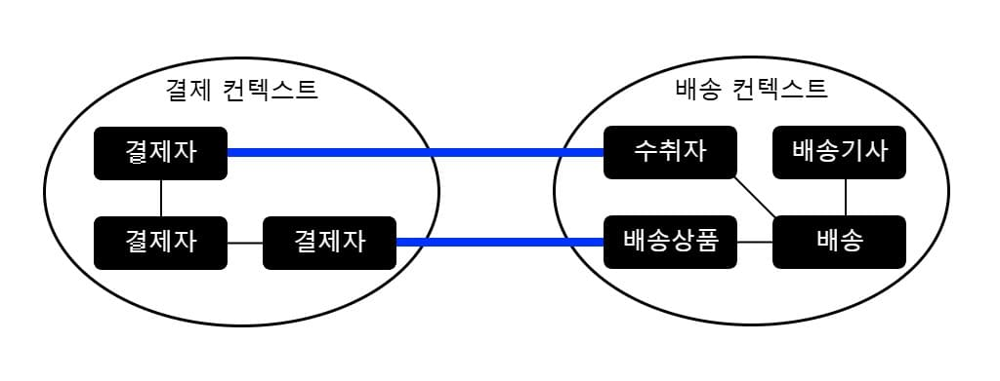
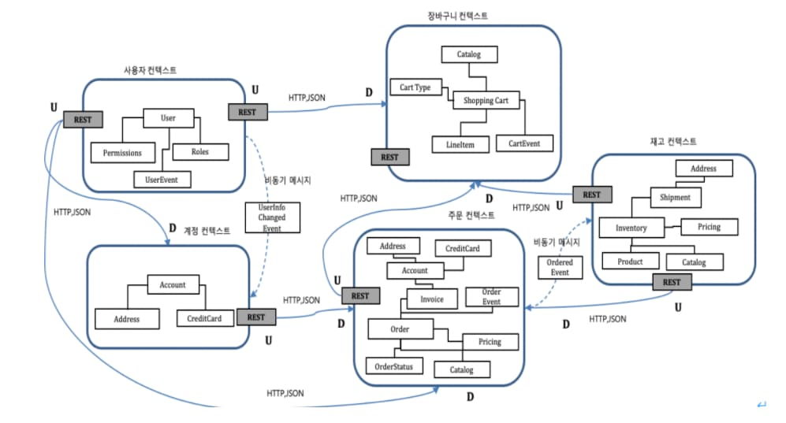

<div class="cl4"></div>

## 유비쿼터스 언어 (Ubiquitous Language)

개발자와 도메인 전문가(비즈니스 담당자)가 사용하는 공통된 언어를 정의하고 사용하는 것을 의미한다.

이 언어는 도메인 모델과 코드를 설계하는 데 사용되며, 모든 팀원 간의 커뮤니케이션을 단순화하고 일관성을 유지하도록 돕는다.

<div class="cl3"></div>

**공통된 언어**

- 도메인 전문가와 개발자가 서로 같은 용어를 사용하여 의사소통한다.
- 비즈니스 용어와 기술 용어를 통합하여 혼란을 줄이고 이해를 높인다.

<div class="cl3"></div>

**도메인 모델과의 통합** 

- 유비쿼터스 언어는 도메인 모델에 직접 반영된다.
- 도메인 엔티티, 값 객체, 서비스, 리포지토리 등에서 동일한 언어를 사용하여 코드와 비즈니스 논리를 일치시킨다.

<div class="cl3"></div>

**명확한 의사소통**

- 팀원 간의 오해를 방지하고, 비즈니스 규칙을 정확히 구현한다.
- 새로운 팀원이 프로젝트에 적응할 수 있도록 돕는다.

<div class="cl3"></div>

**일관성 유지**

- 문서, 코드, 회의 등 모든 상황에서 유비쿼터스 언어를 사용하여 프로젝트 전체의 일관성을 유지한다.

<div class="cl2"></div>

### 유비쿼터스 언어의 예시

<div class="cl4"></div>

**비즈니스 용어:** 상품 (Product), 주문 (Order), 결제 (Payment), 배송 (Delivery)

<div class="cl3"></div>

**코드와 비즈니스 언어의 일치**

```java
@Entity
public class Order {
    @Id
    @GeneratedValue(strategy = GenerationType.IDENTITY)
    private Long id;

    private String customerName;

    private LocalDateTime orderDate;

    @Enumerated(EnumType.STRING)
    private OrderStatus status; // 주문 상태 (e.g., PENDING, SHIPPED, DELIVERED)

    public void confirmOrder() {
        if (status != OrderStatus.PENDING) {
            throw new IllegalStateException("Order cannot be confirmed unless it is in PENDING state");
        }
        this.status = OrderStatus.CONFIRMED;
    }
}
```

Order, OrderStatus, confirmOrder() 등 클래스 및 메서드 이름이 비즈니스 용어와 동일하다.

<div class="cl3"></div>

**팀 커뮤니케이션**

도메인 전문가: “배송 대기 상태(PENDING)의 주문만 확인(confirmOrder)할 수 있습니다.”

개발자: confirmOrder() 메서드를 통해 이 규칙을 코드로 구현

<div class="cl3"></div>

| 한글명 | 영문명 | 설명 |
| --- | --- | --- |
| 상품 | product | 메뉴를 관리하는 기준이 되는 데이터 |
| 메뉴 그룹 | menu group | 메뉴 묶음, 분류 |
| 메뉴 | menu | 메뉴 그룹에 속하는 실제 주문 가능 단위 |
| 메뉴 상품 | menu product | 메뉴에 속하는 수량이 있는 상품 |
| 금액 | amount | 가격 * 수량 |
| 주문 테이블 | order table | 매장에서 주문이 발생하는 영역 |
| 빈 테이블 | empty table | 주문을 등록할 수 없는 주문 테이블 |
| 주문 | order | 매장에서 발생하는 주문 |
| 주문 상태 | order status | 주문은 조리 ➜ 식사 ➜ 계산 완료 순서로 진행된다. |
| 방문한 손님 수 | number of guests | 필수 사항은 아니며 주문은 0명으로 등록할 수 있다. |
| 단체 지정 | table group | 통합 계산을 위해 개별 주문 테이블을 그룹화하는 기능 |
| 주문 항목 | order line item | 주문에 속하는 수량이 있는 메뉴 |
| 매장 식사 | eat in | 포장하지 않고 매장에서 식사하는 것 |

<div class="cl4"></div>
---
<div class="cl4"></div>

## 바운디드 컨텍스트 (Bounded Context)

도메인을 모델링할 때 사용하는 핵심 개념으로, 도메인을 논리적으로 분리하여

각 영역을 독립적으로 관리할 수 있도록 하는 설계 방법이다.

<div class="cl3"></div>

이를 통해 도메인의 복잡성을 줄이고, 명확한 책임과 경계를 정의하여 소프트웨어를 보다 효과적으로 설계할 수 있다.

<p align="center" style="margin: 34px 0 34px 0"></p>

<div class="cl3"></div>

**경계 (Boundary) 설정**

- 각 컨텍스트는 독립적인 모델을 가지고 있으며, 해당 컨텍스트의 경계 안에서만 모델이 유효하다.
- 동일한 용어라도 컨텍스트에 따라 다른 의미를 가질 수 있다.

<div class="cl3"></div>

**독립성**

- 각 바운디드 컨텍스트는 다른 컨텍스트와 독립적으로 작동할 수 있다.
- 설계, 개발, 배포, 유지보수를 개별적으로 수행할 수 있어 확장성과 유연성이 증가한다.

<div class="cl3"></div>

**유비쿼터스 언어와 연계**

- 각 바운디드 컨텍스트는 자체적인 유비쿼터스 언어를 정의한다.
- 이로 인해 동일한 용어라도 다른 바운디드 컨텍스트에서는 다른 의미를 가질 수 있다.

<div class="cl3"></div>

**관계 정의**

- 서로 다른 바운디드 컨텍스트 간에는 명확한 관계와 통신 방식을 정의한다.
- 관계는 컨텍스트 맵(Context Map)을 통해 문서화할 수 있다.

<div class="cl2"></div>

### 컨텍스트 맵 (Context Map)

<p align="center" style="margin: 34px 0 34px 0"></p>

바운디드 컨텍스트 간의 관계와 통신 방식을 시작적으로 표현한 맵이다.

이를 통해 시스템의 전반적인 구조를 이해하고, 팀 간의 협업을 용이하게 한다.

<div class="cl3"></div>

**Shared Kernel (공유 커널)**

- 두 컨텍스트가 공통 모델(핵심 부분)을 공유한다.
- 예: "결제 정보"를 공유하는 결제 컨텍스트와 주문 컨텍스트.

<div class="cl3"></div>

**Customer-Supplier (고객-공급자 관계)**

- 한 컨텍스트(Customer)가 다른 컨텍스트(Supplier)에서 제공하는 모델을 소비한다.
- 예: 주문 컨텍스트는 상품 컨텍스트의 상품 정보를 사용.

<div class="cl3"></div>

**Partnership (협력 관계)**

- 두 컨텍스트가 긴밀하게 협력하여 모델을 설계하고 통합한다.

<div class="cl3"></div>

**Separate Ways (독립적인 관계)**

- 컨텍스트가 서로 독립적이고 직접적인 상호작용이 없다.

<div class="cl2"></div>

### 바운디드 컨텍스트 예시

<div class="cl4"></div>

**전자상거래 도메인**

| 바운디드 컨텍스트 | 유비쿼터스 언어 및 모델 | 역할 및 책임 |
| --- | --- | --- |
| 상품 관리(Product) | 상품(Product), 카테고리(Category), 재고(Stock) | 상품 데이터를 관리하고 검색 기능을 제공한다. |
| 주문 처리(Order) | 주문(Order), 주문 상태(Status), 결제(Payment) | 주문 생성 및 상태를 관리한다. |
| 배송 관리(Shipping) | 배송(Delivery), 송장(Invoice), 배송 상태(Delivery Status) | 배송 상태와 송장 정보를 관리한다. |

<div class="cl3"></div>

**상품 관리 컨텍스트 (Product Context)**

```java
@Entity
public class Product {
    @Id
    @GeneratedValue(strategy = GenerationType.IDENTITY)
    private Long id;

    private String name;
    private String category;
    private int stockQuantity;

    // Getters, Setters, and other domain-specific methods
}
```

<div class="cl3"></div>

**주문 처리 컨텍스트 (Order Context)**

```java
@Entity
public class Order {
    @Id
    @GeneratedValue(strategy = GenerationType.IDENTITY)
    private Long id;

    private LocalDateTime orderDate;

    @Enumerated(EnumType.STRING)
    private OrderStatus status;

    @OneToMany
    private List<OrderItem> items;

    // Getters, Setters, and other domain-specific methods
}
```

<div class="cl3"></div>

**배송 관리 컨텍스트 (Shipping Context)**

```java
@Entity
public class Delivery {
    @Id
    @GeneratedValue(strategy = GenerationType.IDENTITY)
    private Long id;

    private String trackingNumber;

    @Enumerated(EnumType.STRING)
    private DeliveryStatus status;

    // Getters, Setters, and other domain-specific methods
}
```

<div class="cl4"></div>
---
<div class="cl4"></div>

## DDD를 사용한 코드 예시

```java
src/main/java/com/example/ecommerce
├── application       # 애플리케이션 계층 (서비스)
├── domain            # 도메인 계층 (엔티티, 값 객체, 애그리거트 루트)
│   ├── model         # 도메인 모델
│   ├── repository    # 레포지토리 인터페이스
│   └── service       # 도메인 서비스
├── infrastructure    # 인프라 계층 (레포지토리 구현, 외부 API 연동)
├── presentation      # 표현 계층 (컨트롤러)
└── shared            # 공통 유틸리티, 예외, DTO 등
```

<div class="cl3"></div>

### 상품 도메인 모델 (Entity, Value Object)

```java
package com.example.ecommerce.domain.model;

import java.math.BigDecimal;
import java.util.Objects;

// 엔티티 (Aggregate Root)
public class Product {
    private Long id; // Primary Key
    private String name;
    private BigDecimal price;
    private Stock stock; // Value Object

    // 생성자
    public Product(Long id, String name, BigDecimal price, Stock stock) {
        this.id = id;
        this.name = name;
        this.price = price;
        this.stock = stock;
    }

    // 비즈니스 메서드
    public void reduceStock(int quantity) {
        if (stock.getQuantity() < quantity) {
            throw new IllegalArgumentException("재고가 부족합니다.");
        }
        stock = stock.reduce(quantity);
    }

    // Getter
    public Long getId() {
        return id;
    }
    
    public String getName() {
        return name;
    }
}

// 값 객체 (Stock)
class Stock {
    private final int quantity;

    public Stock(int quantity) {
        this.quantity = quantity;
    }

    public Stock reduce(int amount) {
        return new Stock(this.quantity - amount);
    }

    public int getQuantity() {
        return quantity;
    }

    @Override
    public boolean equals(Object o) {
        if (this == o) return true;
        if (o == null || getClass() != o.getClass()) return false;
        Stock stock = (Stock) o;
        return quantity == stock.quantity;
    }

    @Override
    public int hashCode() {
        return Objects.hash(quantity);
    }
}
```

<div class="cl3"></div>

### Repository

```java
package com.example.ecommerce.domain.repository;

import com.example.ecommerce.domain.model.Product;

import java.util.Optional;

public interface ProductRepository {
    Optional<Product> findById(Long id);
    void save(Product product);
}
```

<div class="cl3"></div>

### Domain Service

복잡한 비즈니스 로직이 엔티티 하나로 해결되지 않을 때 사용

```java
package com.example.ecommerce.domain.service;

import com.example.ecommerce.domain.model.Product;
import com.example.ecommerce.domain.repository.ProductRepository;

public class ProductDomainService {
    private final ProductRepository productRepository;

    public ProductDomainService(ProductRepository productRepository) {
        this.productRepository = productRepository;
    }

    public void processOrder(Long productId, int quantity) {
        Product product = productRepository.findById(productId)
                .orElseThrow(() -> new IllegalArgumentException("상품을 찾을 수 없습니다."));
        product.reduceStock(quantity);
        productRepository.save(product);
    }
}
```

<div class="cl3"></div>

### Application Service

```java
package com.example.ecommerce.application;

import com.example.ecommerce.domain.service.ProductDomainService;
import org.springframework.stereotype.Service;
import org.springframework.transaction.annotation.Transactional;

@Service
public class ProductApplicationService {
    private final ProductDomainService productDomainService;

    public ProductApplicationService(ProductDomainService productDomainService) {
        this.productDomainService = productDomainService;
    }

    @Transactional
    public void orderProduct(Long productId, int quantity) {
        productDomainService.processOrder(productId, quantity);
    }
}
```

<div class="cl3"></div>

### 표현 계층 (Presentation Layer)

```java
package com.example.ecommerce.presentation;

import com.example.ecommerce.application.ProductApplicationService;
import org.springframework.http.ResponseEntity;
import org.springframework.web.bind.annotation.*;

@RestController
@RequestMapping("/products")
public class ProductController {
    private final ProductApplicationService productApplicationService;

    public ProductController(ProductApplicationService productApplicationService) {
        this.productApplicationService = productApplicationService;
    }

    @PostMapping("/{id}/order")
    public ResponseEntity<String> orderProduct(@PathVariable Long id, @RequestParam int quantity) {
        productApplicationService.orderProduct(id, quantity);
        return ResponseEntity.ok("주문이 완료되었습니다.");
    }
}
```

<div class="cl2"></div>