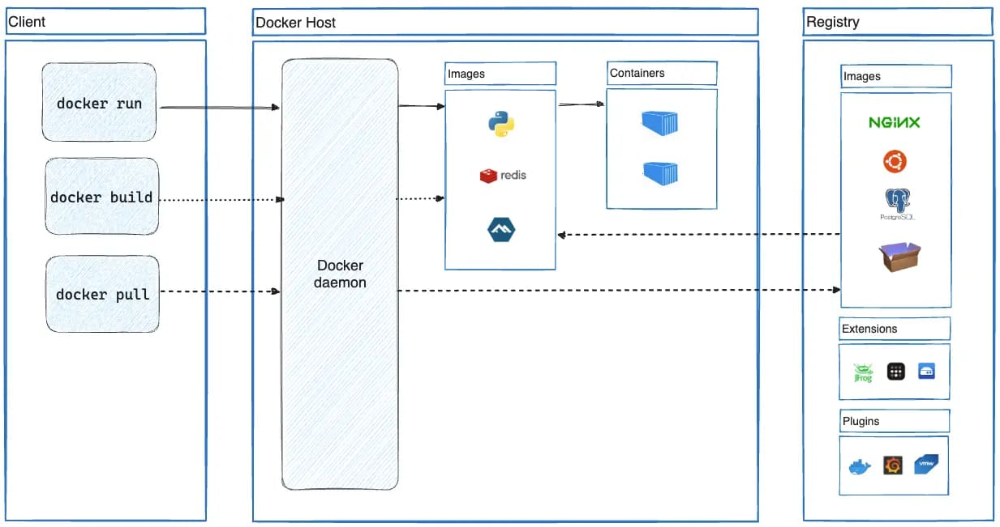

## WSL 2 설치 [Windows]

**Windows Home 에디션은 Hyper-V 기능을 지원하지 않기 때문에 Hyper-V 기반 Docker Engine은 사용 불가능하다.**

Home 버전에서는 WSL2 기반 Docker Engine을 사용해야한다.

<div class="cl3"></div>

WSL 2는 VM과 같은 도구 없이 윈도우 환경에서 Linux를 사용할 수 있도록 도와준다.

Windows Pro, Enterprise, Education에서는 Hyper-V를 사용할 수 있기 때문에,

WSL 2를 반드시 설치할 필요는 없다.

<div class="cl3"></div>

다만, WSL 2 기반 Docker는 리소스 절약과 Linux 환경 통합 측면에서 더 나은 선택일 수 있다.

<div class="cl3"></div>

**관리자 권한으로 PowerShell을 실행 후 아래 명령어 입력 (WSL 2 설치)**

```java
wsl --install
```

위 명령어는 WSL 2를 활성화하는 데 필요한 Windows 기능을 모두 자동으로 설치한다.

기본적으로 Ubuntu가 설치되지만, 다른 배포판을 원한다면 수동 설치 명령어를 권장한다.

설치가 완료되면 재부팅한다.

<div class="cl3"></div>

**WSL 활성화 및 기본 버전 확인**

```java
wsl -l -v
```

<div class="cl3"></div>

만약 WSL 2가 기본 버전이 아니면 아래 명령어로 설정한다.

```java
wsl --set-default-version 2
```

<div class="cl1"></div>

## Docker Desktop 설치

[https://www.docker.com/products/docker-desktop/](https://www.docker.com/products/docker-desktop/)

위 링크를 통해 자신에게 맞는 브라우저, cpu를 선택 후 다운로드를 받는다.

WSL 2 사용자는 설치 과정에서 WSL 2 Backend 옵션이 선택되어 있는지 확인한다.

(use WSL 2 instead of Hyper-V (recommended) 선택)

<div class="cl3"></div>

WSL 2에서 실행되는 Docker는 Linux 파일 경로에서 더 빠르게 작동한다.

/mnt/c/Users 대신 /home/username 경로를 사용하는 것을 추천한다.

<div class="cl3"></div>

Docker Desktop을 실행하여

Settings > Resources > WSL Integration 메뉴로 이동 후 Enable integration with my default WSL distro 옵션을 활성화 한다.

<div class="cl3"></div>

또한, Settings > Resources > Advanced 에서 CPU, 메모리, Swap 크기를 조절할 수 있다.

<div class="cl2"></div>

### Docker 설치 테스트

**버전 확인**

```java
wsl -l -v
```

<div class="cl3"></div>

위 명령어를 입력하면 아래와 같이 버전을 확인할 수 있다.

```java
* docker-desktop-data    Running         2
  Ubuntu                 Stopped         2
  docker-desktop         Running         2
```

<div class="cl1"></div>

## Docker 개념

Docker는 애플리케이션을 Container라는 가볍고 독립적인 환경에서 실행할 수 있게 해주는

컨테이너 기반의 오픈소스 플랫폼이다.

<div class="cl3"></div>

애플리케이션과 해당 애플리케이션이 동작하는 데 필요한 모든 환경(코드, 라이브러리, 설정 파일 등)

을 하나의 패키지로 묶어서 이식성과 일관성을 제공한다.

<div class="cl2"></div>

### Docker의 사용 이유

Docker의 주요 사용 이유는 팀원 및 서버와의 개발 환경을 쉽게 동기화할 수 있다는 점이다.

개발 과정에서 팀원 간 언어나 프레임워크의 버전 차이로 인해 오류가 발생하는 경우가 종종 있는데,

Docker를 사용하면 이러한 문제를 간단히 해결할 수 있다.

<div class="cl3"></div>

Docker Image에 언어나 프레임워크의 버전을 미리 설정해 두면,

해당 Image를 기반으로 생성된 Container는 로컬 환경의 간섭 없이 독립적으로 구동된다.

<div class="cl3"></div>

이를 통해 서버 컴퓨터를 내 개발 환경과 동일하게 구성할 수 있으며,

다른 서버로 이전해야 할 경우에도 Docker Image만 가져와 새로운 서버에서 Container를 생성함으로써

손쉽게 동일한 환경을 구축할 수 있다.

<p align="center" style="margin: 34px 0 34px 0"></p>

<div class="cl2"></div>

### Container(컨테이너)란?

컨테이너는 애플리케이션과 그 실행 환경을 격리하여 제공하는 가상화된 단위이다.

컨테이너는 가상 머신과 유사한 개념처럼 보이지만, 실제로는 더 가볍고 빠르다.

<div class="cl3"></div>

- OS 커널을 공유하며, 가상 머신보다 자원 사용이 효율적
- 애플리케이션 실행에 필요한 모든 파일 포함
- 배포 환경에 관계없이 동일한 실행 환경을 보장

<div class="cl2"></div>

### Docker의 주요 구성 요소

<div class="cl4"></div>

**Image**

- 컨테이너 실행을 위한 템플릿 역할을 한다.
- 애플리케이션과 관련된 파일, 설정을 포함한다.
- 읽기 전용이며, 컨테이너 실행 시 이미지에서 읽어온다.

<div class="cl3"></div>

**Container**

- 이미지를 실행한 상태로, 실제 애플리케이션이 동작하는 독립된 환경이다.
- 컨테이너는 이미지를 기반으로 생성되며, 생성 후에는 데이터와 상태를 유지할 수 있다.

<div class="cl3"></div>

**Dockerfile**

- 이미지를 생성하기 위한 설정 파일이다.
- 애플리케이션 환경, 설치할 패키지, 실행 명령어 등을 정의한다.

<div class="cl3"></div>

**Docker Engine**

- Docker의 핵심으로, 컨테이너를 생성하고 관리하는 역할을 한다.
- Community(CE): 무료 오픈소스 버전
- Enterprise(EE): 추가적인 보안 및 지원 제공

<div class="cl3"></div>

**Registry**

- Docker Image를 저장하고 관리하는 저장소이다.
- 대표적인 Docker Registry: Docker Hub, Amazon ECR, Google Container Registry

<div class="cl1"></div>

## Docker 사용법 (기초)

### Docker 이미지 확인

Docker Hub ([https://hub.docker.com/](https://hub.docker.com/))에서 다양한 이미지를 찾을 수 있다.

이미지를 다운로드하려면 docker pull 명령어를 사용한다.

<div class="cl3"></div>

```java
docker pull ubuntu
```

위 명령어는 ubuntu라는 이미지를 Docker Hub에서 다운로드한다.

<div class="cl2"></div>

### Docker 컨테이너 실행

Docker 컨테이너는 이미지를 기반으로 실행되는 독립적인 환경이다.

이미지를 다운로드한 후 컨테이너를 실행할 수 있다.

<div class="cl3"></div>

```java
docker run -it ubuntu
```

위 명령어는 ubuntu이미지를 기반으로 컨테이너를 실행하며, -it 옵션은 대화형 터미널 모드로 실행하는 옵션이다.

<div class="cl2"></div>

### Docker 컨테이너 확인

실행 중인 컨테이너는 docker ps 명령어로 확인할 수 있다.

이 명령어는 현재 실행 중인 모든 컨테이너를 목록으로 보여준다.

<div class="cl3"></div>

```java
docker ps
```

만약 모든 컨테이너(실행 중이지 않은 컨테이너)를 확인하고 싶다면 docker ps -a를 사용한다.

<div class="cl2"></div>

### Docker 컨테이너 중지

실행 중인 컨테이너를 중지하려면 docker stop 명령어를 사용한다.

CONTAINER_ID는 docker ps에서 확인할 수 있는 컨테이너의 ID이다.

```java
docker stop <CONTAINER_ID>
```

<div class="cl3"></div>

컨테이너를 중지하고 제거하려면 docker rm 명령어를 사용한다.

```java
docker rm <CONTAINER_ID>
```

<div class="cl2"></div>

### Docker 이미지 만들기

자신만의 Docker 이미지를 만들고 싶다면, Dockerfile을 작성해야 한다.

Dockerfile은 이미지 빌드를 위한 명령어를 담고 있는 텍스트 파일이다.

<div class="cl3"></div>

예를 들어, 간단한 웹 애플리케이션을 위한 Dockerfile은 아래와 같다.

```java
# 기본 이미지 선택
FROM node:14

# 작업 디렉토리 설정
WORKDIR /app

# 애플리케이션 파일 복사
COPY . .

# 의존성 설치
RUN npm install

# 애플리케이션 실행
CMD ["npm", "start"]
```

<div class="cl3"></div>

이 Dockerfile을 사용해 이미지를 빌드하려면 아래 명령어를 사용한다.

```java
docker build -t my-node-app .
```

-t는 이미지를 태그하는 옵션이고, my-node-app은 이미지 이름이다.

<div class="cl2"></div>

### Docker 이미지 실행

자신이 만든 이미지를 실행하려면 docker run 명령어를 사용한다.

```java
docker run -it my-node-app
```

<div class="cl2"></div>

### Docker 네트워크

컨테이너 간에 통신을 하려면 Docker 네트워크를 사용할 수 있다.

새로운 네트워크를 만들고 컨테이너를 그 네트워크에 연결하려면 아래 명령어를 사용한다.

```java
docker network create my-network
docker run -d --network my-network --name container1 my-image
docker run -d --network my-network --name container2 my-image
```

<div class="cl2"></div>

### Docker 볼륨

Docker에서 데이터는 기본적으로 컨테이너 내에 저장된다.

그러나 컨테이너를 삭제하면 데이터도 함께 삭제된다.

이를 방지하려면 Docker 볼륨을 사용하여 데이터를 지속적으로 저장할 수 있다.

<div class="cl3"></div>

**볼륨 생성**

```java
docker volume create my-volume
```

<div class="cl3"></div>

**컨테이너 실행 시 볼륨 마운트**

```java
docker run -v my-volume:/data my-image
```

<div class="cl2"></div>

### Docker 이미지 푸시 (Docker Hub에 업로드)

자신이 만든 이미지를 Docker Hub와 같은 이미지 저장소에 업로드하려면 docker push 명령어를 사용한다.

먼저 Docker Hub에 로그인해야 한다.

```java
docker login
```

<div class="cl3"></div>

**이미지 푸시**

```java
docker push <your-dockerhub-username>/my-node-app
```

<div class="cl2"></div>